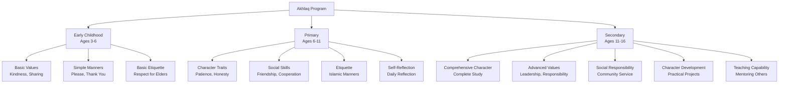
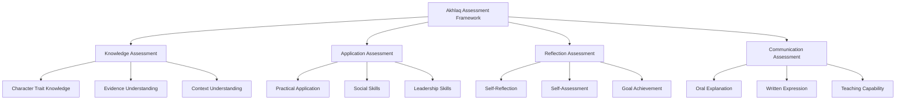

# Akhlaq (Islamic Character)

**Document Title:** Akhlaq (Islamic Character)
**Document ID:** IS_010
**Version:** 1.0
**Date:** 2026-01-11
**Project Name:** Smart Academy Digital Web Portal Development
**Content Category:** Islamic Studies Content

---

## Table of Contents

1. [Overview](#1-overview)
2. [Learning Objectives](#2-learning-objectives)
3. [Curriculum Structure](#3-curriculum-structure)
4. [Teaching Methodology](#4-teaching-methodology)
5. [Assessment & Evaluation](#5-assessment--evaluation)
6. [Resources & Materials](#6-resources--materials)
7. [Integration with Other Subjects](#7-integration-with-other-subjects)
8. [Parent Engagement](#8-parent-engagement)
9. [Technology Integration](#9-technology-integration)
10. [FAQs](#10-faqs)

---

## 1. Overview

The Akhlaq (Islamic Character) program at Smart Academy is designed to develop Islamic character and moral values in students, enabling them to embody the teachings of Islam in their daily lives. Akhlaq encompasses the cultivation of virtues, manners, and ethical behavior based on the Quran and Sunnah of Prophet Muhammad (PBUH). Our program guides students from basic understanding of Islamic values to comprehensive character development, preparing them to become righteous individuals who contribute positively to society.

### 1.1 Philosophy

The Akhlaq program is founded on these fundamental principles:

- **Prophetic Model**: Prophet Muhammad (PBUH) is the perfect role model for Islamic character. Allah (SWT) states in Quran 33:21: "There has certainly been for you in the Messenger of Allah an excellent pattern."

- **Inner and Outer Character**: Islamic character encompasses both inner qualities (intentions, thoughts) and outer behavior (actions, speech). The Prophet (PBUH) said: "Allah does not look at your appearance or wealth, but rather He looks at your hearts and your deeds." (Sahih Muslim, Book 32, Hadith 6221)

- **Character as Worship**: Developing good character is an act of worship. The Prophet (PBUH) said: "The most complete of believers in faith is the one with best character." (At-Tirmidhi, Book 1, Hadith 1162)

- **Practical Application**: Character development is not merely theoretical; it must be demonstrated in daily actions and interactions.

- **Lifelong Journey**: Character development is a continuous process that extends throughout one's life.

### 1.2 Goals

The Akhlaq program aims to achieve the following goals:

1. **Character Development**: Enable students to develop Islamic character traits at an appropriate level for their age and development.

2. **Moral Values**: Teach students Islamic moral values and their practical application.

3. **Etiquette (Adab)**: Guide students to learn Islamic etiquette in all aspects of life.

4. **Social Skills**: Help students develop positive social skills based on Islamic principles.

5. **Self-Reflection**: Encourage students to reflect on their character and strive for improvement.

6. **Positive Influence**: Prepare students to be positive influences in their communities.

7. **Teaching Capability**: Prepare students to teach Islamic character to others.

8. **Integration**: Connect Akhlaq with Quran, Sunnah, and other Islamic studies.

### 1.3 Program Structure

The Akhlaq program progresses through three developmental levels:

---

## 2. Learning Objectives

### 2.1 Knowledge Objectives

By the end of each level, students will demonstrate knowledge of:

#### Early Childhood (Ages 3-6)
- Basic Islamic values: kindness, sharing, respect, honesty
- Simple manners: please, thank you, greeting with As-salamu 'alaykum
- Basic etiquette: respect for elders, teachers, and peers
- Simple understanding of right and wrong
- Basic Duas for good character

#### Primary (Ages 6-11)
- Islamic character traits: patience (Sabr), honesty (Sidq), generosity (Karam)
- Social skills based on Islamic principles
- Islamic etiquette in various situations
- Understanding of character as worship
- Self-reflection and self-improvement
- Stories of Prophet's (PBUH) character as examples

#### Secondary (Ages 11-16)
- Comprehensive study of Islamic character traits
- Advanced values: leadership, responsibility, justice
- Social responsibility and community service
- Character development strategies
- Understanding of character's impact on society
- Teaching and mentoring skills for character development
- Contemporary character issues and Islamic solutions

### 2.2 Skills Objectives

Students will develop the following Akhlaq-specific skills:

#### Character Skills
- **Self-Awareness**: Understanding one's own character strengths and weaknesses
- **Self-Regulation**: Controlling emotions and behaviors
- **Decision Making**: Making ethical decisions based on Islamic principles
- **Conflict Resolution**: Resolving conflicts using Islamic methods

#### Social Skills
- **Communication**: Communicating with respect and kindness
- **Cooperation**: Working cooperatively with others
- **Leadership**: Leading with Islamic principles
- **Empathy**: Understanding and sharing others' feelings

#### Reflection Skills
- **Self-Reflection**: Reflecting on one's own character
- **Self-Improvement**: Identifying areas for improvement
- **Goal Setting**: Setting character development goals
- **Progress Tracking**: Monitoring character development progress

### 2.3 Character Objectives

Through Akhlaq studies, students will develop:

- **Sabr (Patience)**: Patience in all situations
- **Shukr (Gratitude)**: Gratitude for Allah's blessings
- **Amanah (Trustworthiness)**: Being trustworthy and reliable
- **Ikhlas (Sincerity)**: Sincerity in all actions
- **Adab (Respect/Manners)**: Respect and good manners
- **Tawadu (Humility)**: Humility in success and leadership
- **Jihad (Striving)**: Continuous effort for self-improvement
- **Rahma (Compassion)**: Compassion for others
- **Adl (Justice)**: Fairness and justice
- **Ihsan (Excellence)**: Striving for excellence in all actions

---

## 3. Curriculum Structure

### 3.1 Level-Specific Curriculum

#### Early Childhood (Ages 3-6)

| Character Trait | Content | Learning Focus |
|----------------|---------|----------------|
| **Kindness (Ihsan)** | Being kind to others | Kindness to family, friends, and animals |
| **Sharing (Musharakah)** | Sharing with others | Sharing toys, food, and time |
| **Respect (Ihtiram)** | Respect for others | Respect for parents, teachers, and peers |
| **Honesty (Sidq)** | Telling the truth | Being honest in words and actions |
| **Patience (Sabr)** | Waiting patiently | Patience in waiting and difficulties |
| **Gratitude (Shukr)** | Thanking Allah and others | Saying thank you and Alhamdulillah |
| **Manners (Adab)** | Basic Islamic manners | Greeting with As-salamu 'alaykum |
| **Cleanliness (Taharah)** | Cleanliness habits | Personal hygiene and cleanliness |

**Key Concepts**:
- Kindness to everyone
- Sharing with others
- Respect for elders
- Honesty and truthfulness
- Patience in difficulties
- Gratitude for blessings
- Good manners (Adab)
- Cleanliness (Taharah)

#### Primary (Ages 6-11)

##### Character Traits

| Trait | Definition | Practical Application |
|-------|-----------|---------------------|
| **Sabr (Patience)** | Remaining calm in difficulties | Patience in waiting, difficulties, and with people |
| **Shukr (Gratitude)** | Thanking Allah and others | Thanking Allah for blessings, thanking people for help |
| **Amanah (Trustworthiness)** | Being reliable | Keeping promises, being dependable |
| **Ikhlas (Sincerity)** | Doing everything for Allah | Sincerity in worship and good deeds |
| **Adab (Manners)** | Islamic etiquette | Good manners in all situations |
| **Tawadu (Humility)** | Being humble | Not showing off, accepting corrections |
| **Jihad (Striving)**: Striving for improvement | Continuous effort to improve character |
| **Rahma (Compassion)**: Showing kindness | Compassion for those in need |
| **Adl (Justice)**: Being fair | Fairness in all dealings |
| **Ihsan (Excellence)**: Doing everything well | Striving for excellence in all actions |

##### Social Skills

| Skill | Islamic Principle | Practical Application |
|-------|-----------------|---------------------|
| **Communication** | Kind and respectful speech | Speaking kindly, listening respectfully |
| **Friendship** | Choosing good friends | Selecting friends who encourage good character |
| **Cooperation** | Working together | Cooperating in group activities and projects |
| **Conflict Resolution** | Islamic methods of resolving conflicts | Using kindness, forgiveness, and mediation |
| **Leadership** | Islamic leadership principles | Leading with justice, kindness, and consultation |

##### Islamic Etiquette (Adab)

| Situation | Islamic Etiquette | Practical Application |
|-----------|-----------------|---------------------|
| **Greeting** | As-salamu 'alaykum | Greeting with Islamic greeting |
| **Eating** | Islamic eating etiquette | Saying Bismillah, eating with right hand, from right side |
| **Sleeping** | Islamic sleeping etiquette | Sleeping on right side, reciting Duas |
| **Visiting** | Islamic visiting etiquette | Greeting, respecting privacy, not overstaying |
| **Public Places** | Islamic public etiquette | Modesty, respect for others, avoiding harm |
| **Technology Use** | Islamic technology etiquette | Halal use, avoiding harm, time management |

##### Self-Reflection

| Activity | Description | Learning Focus |
|----------|-------------|----------------|
| **Daily Reflection** | Reflecting on daily actions | Identifying good and bad actions |
| **Weekly Goals** | Setting character goals | Planning for character improvement |
| **Progress Tracking** | Monitoring progress | Tracking character development |
| **Self-Assessment** | Assessing character | Evaluating character strengths and weaknesses |

#### Secondary (Ages 11-16)

##### Comprehensive Character Study

| Trait Category | Traits | Learning Focus |
|----------------|--------|----------------|
| **Personal Character** | Sabr, Shukr, Amanah, Ikhlas, Ihsan | Personal character development |
| **Social Character** | Adab, Rahma, Adl, Ukhuwwah | Social character development |
| **Leadership Character** | Tawadu, Shaja'ah, Hikmah | Leadership character development |
| **Spiritual Character** | Taqwa, Tawakkul, Ridha | Spiritual character development |

##### Advanced Values

| Value | Definition | Practical Application |
|-------|-----------|---------------------|
| **Leadership (Qiyadah)** | Leading with Islamic principles | Leading with justice, consultation, and responsibility |
| **Responsibility (Mas'uliyyah)** | Taking responsibility | Responsibility for actions, family, and community |
| **Justice (Adl)**: Fairness in all situations | Justice even when difficult |
| **Wisdom (Hikmah)**: Making wise decisions | Using Islamic principles for decision making |
| **Courage (Shaja'ah)**: Standing for truth | Courage to do right even when difficult |
| **Forgiveness (Afu)**: Forgiving others | Forgiving those who wrong us |
| **Generosity (Karam)**: Giving to others | Generosity with wealth, time, and knowledge |
| **Service (Khidmah)**: Serving others | Serving community and those in need |

##### Social Responsibility

| Area | Islamic Principle | Practical Application |
|------|-----------------|---------------------|
| **Community Service** | Serving community | Volunteering, helping those in need |
| **Environmental Responsibility** | Stewardship (Khalifah) | Protecting environment as Allah's creation |
| **Social Justice** | Standing against injustice | Advocating for justice and fairness |
| **Mentoring** | Helping others improve | Mentoring younger students in character development |
| **Positive Influence** | Being positive role model | Setting good example for others |

##### Character Development Projects

| Project | Description | Learning Focus |
|--------|-------------|----------------|
| **Character Journal** | Daily reflection journal | Self-reflection and improvement |
| **Community Service Project** | Volunteering in community | Applying character to service |
| **Peer Mentoring** | Mentoring younger students | Teaching character to others |
| **Character Campaign** | Organizing character development campaign | Leadership and influence |
| **Family Character Project** | Implementing character at home | Applying character to family life |

### 3.2 Character Traits by Age Group

#### Early Childhood (3-6)

| Trait | Simple Definition | Daily Practice |
|-------|----------------|---------------|
| **Kindness** | Being nice to others | Helping friends, sharing toys |
| **Sharing** | Giving to others | Sharing snacks, toys, time |
| **Respect** | Being polite | Saying please and thank you, listening to adults |
| **Honesty** | Telling the truth | Being honest about actions |
| **Patience** | Waiting calmly | Waiting for turn, not getting angry |
| **Gratitude** | Saying thank you | Thanking Allah and people |

#### Primary (6-11)

| Trait | Definition | Daily Practice |
|-------|-----------|---------------|
| **Sabr (Patience)** | Remaining calm in difficulties | Patience in homework, with siblings, in difficulties |
| **Shukr (Gratitude)** | Thanking Allah and others | Thanking Allah for blessings, thanking people |
| **Amanah (Trustworthiness)** | Being reliable | Keeping promises, being dependable |
| **Ikhlas (Sincerity)** | Doing for Allah | Sincerity in worship and good deeds |
| **Adab (Manners)** | Islamic etiquette | Good manners in all situations |
| **Tawadu (Humility)** | Being humble | Not showing off, accepting corrections |
| **Rahma (Compassion)** | Showing kindness | Helping those in need, being kind |
| **Adl (Justice)** | Being fair | Fairness in games, with siblings, in class |
| **Ihsan (Excellence)** | Doing everything well | Striving for excellence in all actions |

#### Secondary (11-16)

| Trait | Advanced Definition | Daily Practice |
|-------|------------------|---------------|
| **Sabr (Patience)** | Enduring difficulties with faith | Patience in academic challenges, personal difficulties, with others |
| **Shukr (Gratitude)** | Gratitude in all circumstances | Thanking Allah in blessings and difficulties |
| **Amanah (Trustworthiness)** | Complete reliability | Keeping all promises, being completely dependable |
| **Ikhlas (Sincerity)** | Complete sincerity | Sincerity in all actions, seeking only Allah's pleasure |
| **Adab (Manners)** | Complete Islamic etiquette | Perfecting manners in all situations |
| **Tawadu (Humility)** | Complete humility | Humility in success, accepting all corrections |
| **Jihad (Striving)** | Continuous self-improvement | Daily effort to improve character |
| **Rahma (Compassion)** | Complete compassion | Compassion for all, including those who wrong us |
| **Adl (Justice)** | Complete fairness | Justice even when personally difficult |
| **Ihsan (Excellence)** | Complete excellence | Excellence in all actions, worship, and character |

---

## 4. Teaching Methodology

### 4.1 Pedagogical Approach

The Akhlaq program employs a combination of traditional and modern teaching methods:

#### Traditional Methods
- **Modeling**: Teachers demonstrate Islamic character in their behavior
- **Storytelling**: Using stories from Quran, Sunnah, and Seerah
- **Memorization**: Memorizing character-building Duas and Hadith
- **Discussion**: Class discussions about character and its application

#### Modern Methods
- **Interactive Learning**: Use of smart boards, tablets, and multimedia resources
- **Project-Based Learning**: Projects that develop character through practice
- **Critical Reflection**: Encouraging students to reflect on their character
- **Differentiated Instruction**: Adapting methods to individual learning levels

### 4.2 Teaching Strategies

#### For Early Childhood (3-6)

| Strategy | Description | Example |
|----------|-------------|---------|
| **Modeling** | Teachers demonstrate character | Teachers showing kindness and respect |
| **Storytelling** | Simple character stories | Stories of Prophet's kindness |
| **Visual Learning** | Pictures and illustrations | Pictures showing good character |
| **Repetition** | Repeating character traits | Repeating "be kind" and "share" |
| **Songs and Rhymes** | Islamic songs about character | Songs about kindness and sharing |
| **Play-Based Learning** | Games and activities | Role-playing good character |
| **Positive Reinforcement** | Praising good character | Stickers and rewards for good behavior |

#### For Primary (6-11)

| Strategy | Description | Example |
|----------|-------------|---------|
| **Interactive Discussion** | Class discussions about character | Discussing how to show patience |
| **Character Stories** | Stories from Seerah | Stories of Prophet's character |
| **Role-Playing** | Acting out character traits | Role-playing honesty and kindness |
| **Group Work** | Collaborative activities | Group projects requiring cooperation |
| **Self-Reflection** | Daily reflection journals | Writing about daily character |
| **Goal Setting** | Setting character goals | Setting weekly character improvement goals |
| **Peer Feedback** | Getting feedback from peers | Peer assessment of character |

#### For Secondary (11-16)

| Strategy | Description | Example |
|----------|-------------|---------|
| **Critical Analysis** | Deep examination of character | Analyzing character in contemporary issues |
| **Case Studies** | Real-life character scenarios | Analyzing ethical dilemmas |
| **Project-Based Learning** | Character development projects | Community service projects |
| **Mentoring** | Students mentoring younger students | Teaching character to others |
| **Self-Assessment** | Comprehensive character assessment | Detailed self-evaluation |
| **Debate and Discussion** | Structured debates on character issues | Debating contemporary character challenges |
| **Leadership Projects** | Student-led character initiatives | Organizing character campaigns |

### 4.3 Classroom Environment

The Akhlaq classroom is designed to be:

- **Character-Focused**: Clean, organized, with character values displayed
- **Interactive**: Encouraging student participation and engagement
- **Respectful**: Environment of respect for all
- **Technology-Enhanced**: Smart boards, tablets, and digital resources
- **Comfortable**: Appropriate seating for discussions and activities
- **Inclusive**: Welcoming to students from all backgrounds

---

## 5. Assessment & Evaluation

### 5.1 Assessment Framework

### 5.2 Assessment Methods

#### Knowledge Assessment

| Criteria | Description | Scoring |
|----------|-------------|---------|
| **Character Trait Knowledge** | Understanding of character traits | 0-40 points |
| **Evidence Understanding** | Understanding of evidence from Quran and Sunnah | 0-30 points |
| **Context Understanding** | Understanding of context for character traits | 0-30 points |

**Scoring Rubric**:
- **Excellent (90-100)**: Deep understanding of all aspects
- **Very Good (80-89)**: Strong understanding with minor gaps
- **Good (70-79)**: Good understanding with some gaps
- **Satisfactory (60-69)**: Basic understanding with notable gaps
- **Needs Improvement (Below 60)**: Limited understanding

#### Application Assessment

| Criteria | Description | Scoring |
|----------|-------------|---------|
| **Practical Application** | Demonstration of character in daily life | 0-40 points |
| **Social Skills** | Demonstration of positive social skills | 0-30 points |
| **Leadership Skills** | Demonstration of Islamic leadership | 0-30 points |

**Scoring Rubric**:
- **Excellent (90-100)**: Excellent application of character
- **Very Good (80-89)**: Strong application of character
- **Good (70-79)**: Good application of character
- **Satisfactory (60-69)**: Basic application of character
- **Needs Improvement (Below 60)**: Limited application of character

#### Reflection Assessment

| Criteria | Description | Scoring |
|----------|-------------|---------|
| **Self-Reflection** | Quality of self-reflection | 0-30 points |
| **Self-Assessment** | Accuracy of self-assessment | 0-30 points |
| **Goal Achievement** | Progress toward character goals | 0-40 points |

**Scoring Rubric**:
- **Excellent (90-100)**: Excellent reflection and progress
- **Very Good (80-89)**: Strong reflection and progress
- **Good (70-79)**: Good reflection and progress
- **Satisfactory (60-69)**: Basic reflection and progress
- **Needs Improvement (Below 60)**: Limited reflection and progress

#### Communication Assessment

| Criteria | Description | Scoring |
|----------|-------------|---------|
| **Oral Explanation** | Ability to explain character traits | 0-30 points |
| **Written Expression** | Ability to express understanding in writing | 0-30 points |
| **Teaching Capability** | Ability to teach character to others | 0-40 points |

**Scoring Rubric**:
- **Excellent (90-100)**: Excellent communication skills
- **Very Good (80-89)**: Strong communication skills
- **Good (70-79)**: Good communication skills
- **Satisfactory (60-69)**: Basic communication skills
- **Needs Improvement (Below 60)**: Limited communication skills

### 5.3 Level-Based Assessment

#### Early Childhood Assessment

| Component | Criteria | Passing Score |
|-----------|----------|----------------|
| **Basic Values** | Understanding of basic values | 70% |
| **Simple Manners** | Demonstration of basic manners | 70% |
| **Practical** | Basic practical application | 70% |

#### Primary Assessment

| Component | Criteria | Passing Score |
|-----------|----------|----------------|
| **Character Traits** | Understanding of character traits | 75% |
| **Social Skills** | Demonstration of social skills | 75% |
| **Etiquette** | Demonstration of Islamic etiquette | 75% |
| **Application** | Application to daily life | 70% |

#### Secondary Assessment

| Component | Criteria | Passing Score |
|-----------|----------|----------------|
| **Comprehensive Character** | Understanding of complete character | 80% |
| **Advanced Values** | Understanding of advanced values | 75% |
| **Social Responsibility** | Demonstration of social responsibility | 75% |
| **Application** | Application to modern life | 75% |
| **Communication** | Ability to teach character | 70% |

### 5.4 Progress Tracking

Each student maintains an Akhlaq Progress Portfolio including:

- **Knowledge Record**: Record of knowledge assessments
- **Application Record**: Record of practical applications
- **Reflection Record**: Record of self-reflection work
- **Communication Record**: Record of oral and written explanations
- **Achievement Certificates**: Recognition of level completion
- **Teacher Feedback**: Regular feedback from Akhlaq teachers

### 5.5 Character Awards and Recognition

The Akhlaq program includes various awards and recognition:

| Award | Criteria | Recognition |
|--------|----------|-------------|
| **Character Star** | Consistent demonstration of good character | Monthly recognition |
| **Kindness Award** | Exceptional kindness | Special recognition |
| **Leadership Award** | Outstanding Islamic leadership | Special recognition |
| **Service Award** | Exceptional community service | Special recognition |
| **Character Champion** | Overall excellence in character development | Annual recognition |
| **Mentor Award** | Excellence in mentoring others | Special recognition |

---

## 6. Resources & Materials

### 6.1 Primary Textbooks

#### Akhlaq Books
- **Riyad as-Salihin**: Collection of Hadith on character
- **Islamic Manners**: Guide to Islamic etiquette
- **Character Development**: Islamic character development guide
- **Prophetic Character**: Study of Prophet's (PBUH) character

#### Supplementary Books
- **Stories of the Prophets**: Character lessons from prophets' lives
- **Companions of the Prophet**: Character examples from Sahabah
- **Islamic Character Made Easy**: Simplified character guide

### 6.2 Digital Resources

#### Akhlaq Applications
- **Character Tracker**: App for tracking character development
- **Islamic Manners**: App for learning Islamic etiquette
- **Daily Reflection**: App for daily character reflection

#### Online Resources
- **Akhlaq Websites**: Online resources on Islamic character
- **Character Lectures**: Video lectures by renowned scholars
- **Character Documentaries**: Educational documentaries

### 6.3 Audio and Video Resources

#### Video Resources
- **Character Lectures**: Video lectures by renowned scholars
- **Prophetic Character**: Videos on Prophet's (PBUH) character
- **Character Stories**: Animated stories for children

#### Audio Resources
- **Character Audio**: Audio explanations of character traits
- **Character Lectures**: Lectures on character topics
- **Podcasts**: Islamic podcasts on character topics

### 6.4 Supplementary Materials

#### Teaching Aids
- **Flashcards**: Character traits, Islamic manners
- **Posters**: Character values, Islamic etiquette
- **Charts**: Character development tracking
- **Visual Aids**: Pictures and illustrations for character concepts

#### Assessment Tools
- **Rubrics**: Detailed criteria for assessment
- **Checklists**: Progress tracking for character skills
- **Portfolios**: Student work samples and achievements
- **Progress Reports**: Regular communication with parents

---

## 7. Integration with Other Subjects

### 7.1 Re-STEAM Integration

The Akhlaq program integrates with STEAM subjects through the Re-STEAM framework:

#### Science Integration

| Akhlaq Concept | Science Connection | Example Activities |
|----------------|-------------------|-------------------|
| **Compassion for Animals** | Biology | Study of animal welfare |
| **Environmental Stewardship** | Environmental Science | Study of environmental protection |
| **Health and Wellness** | Health Science | Study of healthy lifestyle |

#### Technology Integration

| Akhlaq Concept | Technology Connection | Example Activities |
|----------------|-------------------|-------------------|
| **Online Etiquette** | Digital Technology | Study of Islamic online behavior |
| **Social Media Ethics** | Social Media | Study of ethical social media use |
| **Digital Citizenship** | Internet Technology | Study of responsible internet use |

#### Arts Integration

| Akhlaq Concept | Arts Connection | Example Activities |
|----------------|----------------|-------------------|
| **Islamic Art** | Visual Arts | Creating art reflecting Islamic values |
| **Nasheeds** | Performing Arts | Islamic songs about character |
| **Storytelling** | Language Arts | Creative writing about character |

#### Mathematics Integration

| Akhlaq Concept | Mathematics Connection | Example Activities |
|----------------|-------------------|-------------------|
| **Fairness in Distribution** | Applied Mathematics | Study of fair distribution |
| **Time Management** | Time Management | Study of balancing time for character development |

### 7.2 Cross-Curricular Projects

Students engage in projects that integrate Akhlaq with other subjects:

- **Character Science Fair**: Projects on compassion and environmental stewardship
- **Islamic Art Exhibition**: Student artwork reflecting character values
- **Character Poetry**: Creative writing based on character traits
- **Community Service**: Applying character through service projects
- **Mentoring Projects**: Teaching character to younger students

---

## 8. Parent Engagement

### 8.1 Home-School Partnership

Parents play a crucial role in supporting their children's character development:

#### Regular Communication
- **Monthly Character Progress Reports**: Detailed updates on character progress
- **Parent-Teacher Conferences**: Regular meetings to discuss character progress
- **Digital Communication**: WhatsApp groups and email for ongoing support
- **Character Workshops**: Workshops on supporting children's character development at home

#### Home Support Resources
- **Daily Character Practice**: Guide for practicing character at home
- **Family Character Time**: Guide for family character discussion
- **Application Guides**: Applying character to family life

### 8.2 Parent Involvement Opportunities

Parents are encouraged to:

- **Discuss Character**: Daily discussion about character lessons
- **Model Character**: Demonstrate Islamic character in daily life
- **Practice Together**: Practicing character together as a family
- **Attend Character Events**: Participate in character competitions and celebrations
- **Reinforce Positive Behavior**: Encourage and praise good character

### 8.3 Monitoring Progress at Home

Parents can support character development by:

- **Daily Discussion**: Discussing character lessons learned
- **Application**: Helping children apply character to daily life
- **Positive Reinforcement**: Encouraging and praising progress
- **Creating Environment**: Establishing an Islamic environment at home
- **Consistency**: Maintaining regularity in character practice
- **Modeling**: Demonstrating good character in daily life

---

## 9. Technology Integration

### 9.1 Digital Learning Tools

The Akhlaq program incorporates technology to enhance learning:

#### Character Learning Apps
- **Character Tracker**: App for tracking character development
- **Islamic Manners**: App for learning Islamic etiquette
- **Daily Reflection**: App for daily character reflection

#### Classroom Technology
- **Smart Boards**: Interactive displays for character content
- **Tablets**: Individual devices for personalized character learning
- **Projectors**: Displaying character content and videos
- **Audio Systems**: High-quality audio for character lectures

#### Learning Management System
- **Gibbon Integration**: Digital platform for character resources
- **Progress Tracking**: Online tracking of character progress
- **Resource Sharing**: Digital library of character materials
- **Assessment Tools**: Online quizzes and assessments

### 9.2 Technology for Akhlaq Program

The Akhlaq program uses specialized technology:

- **Character Apps**: Mobile apps for character development tracking
- **Reflection Apps**: Apps for daily character reflection
- **Online Resources**: Access to character libraries and lectures
- **Digital Libraries**: Comprehensive digital character resources

### 9.3 Online Akhlaq Resources

Students and parents have access to:

- **Online Character Libraries**: Comprehensive character resources
- **Character Video Lectures**: Access to renowned character scholars
- **Interactive Learning**: Online courses and tutorials
- **Character Communities**: Online forums for discussion and support

---

## 10. FAQs

### General Questions

**Q: What is Akhlaq?**

A: Akhlaq is Islamic character development, encompassing the cultivation of virtues, manners, and ethical behavior based on the Quran and Sunnah of Prophet Muhammad (PBUH). It includes developing traits such as patience, kindness, honesty, and respect.

**Q: Why is Akhlaq important?**

A: Akhlaq is important because:
- It is an act of worship to develop good character
- It helps Muslims embody Islamic teachings in daily life
- It fosters positive relationships and community
- It prepares students to be positive influences in society
- It complements other Islamic studies

**Q: At what age do students start learning Akhlaq?**

A: Students start learning basic Akhlaq concepts from Early Childhood (ages 3-6) with simple values like kindness and sharing. Formal Akhlaq study begins in Primary level (ages 6-11) with comprehensive character development.

### Curriculum Questions

**Q: What character traits are studied?**

A: Character traits studied include:
- Early Childhood: Kindness, sharing, respect, honesty, patience, gratitude
- Primary: Sabr, Shukr, Amanah, Ikhlas, Adab, Tawadu, Rahma, Adl, Ihsan
- Secondary: Comprehensive study including leadership, responsibility, justice, wisdom

**Q: How is character assessed?**

A: Character is assessed through:
- Knowledge (character trait knowledge, evidence understanding, context understanding)
- Application (practical application, social skills, leadership skills)
- Reflection (self-reflection, self-assessment, goal achievement)
- Communication (oral explanation, written expression, teaching capability)

**Q: What are the main Islamic values?**

A: Main Islamic values include:
- Sabr (Patience)
- Shukr (Gratitude)
- Amanah (Trustworthiness)
- Ikhlas (Sincerity)
- Adab (Manners/Respect)
- Tawadu (Humility)
- Jihad (Striving)
- Rahma (Compassion)
- Adl (Justice)
- Ihsan (Excellence)

### Assessment Questions

**Q: How is Akhlaq assessed?**

A: Akhlaq is assessed based on:
- Knowledge (character trait knowledge, evidence understanding, context understanding)
- Application (practical application, social skills, leadership skills)
- Reflection (self-reflection, self-assessment, goal achievement)
- Communication (oral explanation, written expression, teaching capability)

**Q: What happens if a student struggles with character development?**

A: We provide individualized support:
- One-on-one counseling with Akhlaq teachers
- Additional resources and materials
- Simplified explanations for complex concepts
- Encouragement and motivation
- Parent involvement in home practice

### Parent Questions

**Q: How can I support my child's character development at home?**

A: Parents can support by:
- Discussing character lessons learned
- Modeling good character in daily life
- Practicing character together as a family
- Helping children apply character to daily life
- Creating an Islamic environment at home
- Encouraging questions and discussions about character
- Attending character workshops

**Q: Do I need special knowledge to help my child with character development?**

A: No special knowledge is required. We provide:
- Parent workshops on character topics
- Home study guides with explanations
- Regular communication with teachers
- Resources for supporting character development at home

### Technology Questions

**Q: What technology tools are used in Akhlaq learning?**

A: Technology integration includes:
- Character learning apps
- Smart boards for interactive lessons
- Online resources and digital libraries
- Progress tracking systems

**Q: Is technology used instead of traditional methods?**

A: No, technology is used as a supplement to traditional methods:
- Face-to-face instruction remains primary
- Traditional methods of character development are maintained
- Technology enhances but does not replace traditional learning
- Balance is maintained between digital and traditional methods

---

## Document Approval

| Role | Name | Signature | Date |
|------|------|-----------|------|
| Islamic Studies Coordinator | | _________________ | ________ |
| Principal | | _________________ | ________ |
