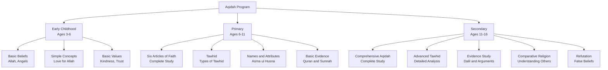
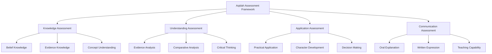

# Aqidah (Islamic Creed)

**Document Title:** Aqidah (Islamic Creed)
**Document ID:** IS_009
**Version:** 1.0
**Date:** 2026-01-11
**Project Name:** Smart Academy Digital Web Portal Development
**Content Category:** Islamic Studies Content

---

## Table of Contents

1. [Overview](#1-overview)
2. [Learning Objectives](#2-learning-objectives)
3. [Curriculum Structure](#3-curriculum-structure)
4. [Teaching Methodology](#4-teaching-methodology)
5. [Assessment & Evaluation](#5-assessment--evaluation)
6. [Resources & Materials](#6-resources--materials)
7. [Integration with Other Subjects](#7-integration-with-other-subjects)
8. [Parent Engagement](#8-parent-engagement)
9. [Technology Integration](#9-technology-integration)
10. [FAQs](#10-faqs)

---

## 1. Overview

The Aqidah (Islamic Creed) program at Smart Academy is designed to teach students the fundamental beliefs of Islam, establishing a strong foundation of faith (Iman). Aqidah covers the six articles of faith: belief in Allah, His angels, His books, His prophets, the Day of Judgment, and divine decree. Our program guides students from basic understanding of Islamic beliefs to comprehensive study of Aqidah, enabling them to develop a strong, correct Islamic creed.

### 1.1 Philosophy

The Aqidah program is founded on these fundamental principles:

- **Tawhid (Oneness of Allah)**: The foundation of Islamic creed is the absolute oneness of Allah (SWT). Allah (SWT) states in Quran 112:1-4: "Say, 'He is Allah, [who is] One, Allah, the Eternal Refuge. He neither begets nor is born, nor is there to Him any equivalent.'"

- **Correct Belief**: Correct Aqidah is essential for salvation. The Prophet (PBUH) said: "The most important matter is Islam, its pillar is prayer, and its peak is Jihad." (Sunan at-Tirmidhi)

- **Understanding with Evidence**: Islamic beliefs must be understood with evidence from Quran and Sunnah, not blind following.

- **Love and Reverence**: Correct Aqidah fosters love and reverence for Allah (SWT) and His creation.

- **Practical Application**: Correct beliefs must lead to correct actions and character.

### 1.2 Goals

The Aqidah program aims to achieve the following goals:

1. **Creed Knowledge**: Enable students to learn Islamic beliefs at an appropriate level for their age and development.

2. **Tawhid Understanding**: Help students develop deep understanding of Tawhid (Oneness of Allah).

3. **Evidence-Based Belief**: Teach students the evidence for Islamic beliefs from Quran and Sunnah.

4. **Refutation of False Beliefs**: Enable students to understand and refute false beliefs and innovations (Bid'ah).

5. **Practical Application**: Guide students to apply correct beliefs in their daily lives and character.

6. **Spiritual Development**: Foster spiritual development through correct beliefs.

7. **Teaching Capability**: Prepare students to explain Islamic beliefs to others.

8. **Integration**: Connect Aqidah with Quran, Sunnah, and other Islamic studies.

### 1.3 Program Structure

The Aqidah program progresses through three developmental levels:

---

## 2. Learning Objectives

### 2.1 Knowledge Objectives

By the end of each level, students will demonstrate knowledge of:

#### Early Childhood (Ages 3-6)
- Basic belief in Allah (SWT) as Creator
- Basic understanding of angels as Allah's messengers
- Basic understanding of prophets as Allah's messengers
- Basic understanding of Jannah (Paradise) and Jahannam (Hellfire)
- Basic understanding of Allah's love and care
- Simple Duas expressing love for Allah

#### Primary (Ages 6-11)
- Complete understanding of six articles of faith
- Detailed understanding of Tawhid (Oneness of Allah)
- Names and attributes of Allah (Asma ul Husna)
- Belief in angels, their roles and characteristics
- Belief in revealed books and their importance
- Belief in prophets, their stories and lessons
- Belief in Day of Judgment and Akhirah
- Belief in divine decree (Qadr and Qadar)
- Basic evidence for Islamic beliefs

#### Secondary (Ages 11-16)
- Comprehensive study of Islamic creed
- Advanced understanding of Tawhid and its types
- Detailed study of Allah's names and attributes
- Understanding of angels and their specific roles
- Comprehensive study of revealed books
- Detailed study of prophets and their stories
- Understanding of Day of Judgment in detail
- Understanding of divine decree and its implications
- Evidence for Islamic beliefs from Quran and Sunnah
- Understanding of false beliefs and how to refute them
- Basic comparative religion

### 2.2 Skills Objectives

Students will develop the following Aqidah-specific skills:

#### Comprehension Skills
- **Belief Understanding**: Understanding Islamic beliefs and their implications
- **Evidence Understanding**: Understanding the evidence for beliefs
- **Conceptual Understanding**: Understanding abstract concepts
- **Connection Understanding**: Understanding the connection between beliefs and actions

#### Analysis Skills
- **Evidence Analysis**: Analyzing the evidence for beliefs
- **Comparative Analysis**: Comparing different beliefs
- **Critical Thinking**: Reflecting on and analyzing beliefs
- **Refutation Skills**: Identifying and refuting false beliefs

#### Application Skills
- **Practical Application**: Applying beliefs to daily life
- **Character Development**: Using beliefs for character building
- **Decision Making**: Using beliefs for decision making
- **Communication**: Explaining beliefs to others

### 2.3 Character Objectives

Through Aqidah studies, students will develop:

- **Tawhid (Oneness of Allah)**: Complete trust in Allah's oneness
- **Taqwa (Allah-Consciousness)**: Allah-consciousness in all actions
- **Tawakkul (Trust in Allah)**: Complete reliance on Allah
- **Sabr (Patience)**: Patience in Allah's decree
- **Shukr (Gratitude)**: Gratitude for Allah's blessings
- **Khashyah (Fear of Allah)**: Reverence and fear of Allah
- **Hubb (Love for Allah)**: Deep love for Allah (SWT)
- **Ridha (Pleasure with Allah's Decree)**: Acceptance of Allah's will

---

## 3. Curriculum Structure

### 3.1 Level-Specific Curriculum

#### Early Childhood (Ages 3-6)

| Topic | Content | Learning Focus |
|-------|---------|----------------|
| **Allah (SWT)** | Allah as Creator | Allah created everything |
| **Angels** | Allah's messengers | Angels obey Allah |
| **Prophets** | Allah's messengers to people | Prophets teach about Allah |
| **Jannah** | Paradise | Reward for good deeds |
| **Jahannam** | Hellfire | Consequence of bad deeds |
| **Allah's Love** | Allah loves us | Allah cares for us |
| **Duas** | Expressing love for Allah | Simple Duas |

**Key Concepts**:
- Allah (SWT) is our Creator
- Angels are Allah's helpers
- Prophets teach us about Allah
- Good deeds lead to Jannah
- Bad deeds lead to Jahannam
- Allah loves us and cares for us

#### Primary (Ages 6-11)

##### Six Articles of Faith

| Article | Content | Learning Focus |
|--------|---------|----------------|
| **Belief in Allah** | Tawhid, names, attributes | Complete understanding of Allah |
| **Belief in Angels** | Creation, roles, characteristics | Understanding angels |
| **Belief in Books** | Revealed books, importance | Understanding divine books |
| **Belief in Prophets** | Stories, lessons, finality | Understanding prophets |
| **Belief in Day of Judgment** | Akhirah, resurrection, accountability | Understanding Akhirah |
| **Belief in Divine Decree** | Qadr and Qadar | Understanding divine decree |

##### Tawhid (Oneness of Allah)

| Type | Meaning | Evidence |
|------|---------|---------|
| **Tawhid ar-Rububiyyah** | Oneness of Lordship | Quran 1:2 |
| **Tawhid al-Uluhiyyah** | Oneness of worship | Quran 51:56 |
| **Tawhid al-Asma' wa as-Sifat** | Oneness of names and attributes | Quran 7:180 |

##### Names and Attributes of Allah

| Category | Examples | Learning Focus |
|----------|-----------|----------------|
| **Names of Mercy** | Ar-Rahman, Ar-Rahim | Understanding Allah's mercy |
| **Names of Power** | Al-Qawiyy, Al-Matin | Understanding Allah's power |
| **Names of Knowledge** | Al-'Alim, Al-Khabir | Understanding Allah's knowledge |
| **Names of Creation** | Al-Khaliq, Al-Bari' | Understanding Allah as Creator |

##### Basic Evidence

| Evidence Type | Example | Learning Focus |
|--------------|---------|----------------|
| **Quranic Evidence** | Quran 112:1-4 | Understanding Quran as evidence |
| **Prophetic Evidence** | Hadith about Tawhid | Understanding Hadith as evidence |
| **Rational Evidence** | Creation proves Creator | Understanding rational arguments |

#### Secondary (Ages 11-16)

##### Comprehensive Aqidah Study

| Topic | Content | Learning Focus |
|-------|---------|----------------|
| **Tawhid** | Complete study of Tawhid | Deep understanding of Allah's oneness |
| **Angels** | Detailed study of angels | Specific roles and characteristics |
| **Books** | Comprehensive study of revealed books | Contents and preservation |
| **Prophets** | Detailed study of prophets | Stories and lessons |
| **Day of Judgment** | Detailed study of Akhirah | Events and accountability |
| **Divine Decree** | Detailed study of Qadr and Qadar | Implications and acceptance |

##### Advanced Tawhid

| Type | Detailed Content | Learning Focus |
|------|----------------|----------------|
| **Tawhid ar-Rububiyyah** | Allah's lordship over all creation | Complete understanding |
| **Tawhid al-Uluhiyyah** | Worship directed only to Allah | Complete understanding |
| **Tawhid al-Asma' wa as-Sifat** | Allah's beautiful names and attributes | Complete understanding |

##### Evidence Study

| Evidence Type | Detailed Content | Learning Focus |
|--------------|----------------|----------------|
| **Quranic Evidence** | Comprehensive Quranic proofs | Detailed analysis |
| **Prophetic Evidence** | Comprehensive Hadith proofs | Detailed analysis |
| **Rational Evidence** | Logical arguments for beliefs | Detailed analysis |
| **Consensus Evidence** | Scholarly consensus (Ijma') | Understanding Ijma' |

##### Comparative Religion

| Religion | Basic Beliefs | Comparison with Islam |
|----------|---------------|---------------------|
| **Christianity** | Trinity, Jesus as son of God | Comparison with Tawhid |
| **Judaism** | Monotheism, rejection of prophets | Comparison with Islam |
| **Hinduism** | Multiple gods, reincarnation | Comparison with Tawhid |
| **Buddhism** | No creator, enlightenment | Comparison with Islam |
| **Atheism** | No belief in God | Comparison with Islam |

##### Refutation of False Beliefs

| False Belief | Refutation | Learning Focus |
|--------------|-----------|----------------|
| **Shirk (Associating partners with Allah)** | Quranic and prophetic refutation | Understanding and refuting Shirk |
| **Bid'ah (Innovation in religion)** | Evidence against innovations | Understanding and avoiding Bid'ah |
| **Superstition** | Evidence against superstitions | Rational Islamic approach |
| **Exaggeration in Religion** | Evidence against exaggeration | Balanced Islamic approach |

### 3.2 Detailed Aqidah Topics

#### Six Articles of Faith

| Article | Quranic Evidence | Prophetic Evidence |
|--------|------------------|-------------------|
| **Belief in Allah** | Quran 112:1-4 | Hadith: "I was ordered to fight people until they testify that there is no god but Allah" |
| **Belief in Angels** | Quran 2:285 | Hadith: "Angels were created from light" |
| **Belief in Books** | Quran 2:4 | Hadith: "The Torah and Gospel were revealed before the Quran" |
| **Belief in Prophets** | Quran 4:164 | Hadith: "Prophets are brothers, their mothers are different but their religion is one" |
| **Belief in Day of Judgment** | Quran 1:4 | Hadith: "The people will be gathered on the Day of Judgment barefoot, naked, and uncircumcised" |
| **Belief in Divine Decree** | Quran 54:49 | Hadith: "Everything is decreed even ability and disability" |

#### Tawhid (Oneness of Allah)

| Type | Definition | Quranic Evidence |
|------|-----------|------------------|
| **Tawhid ar-Rububiyyah** | Belief that Allah alone is Lord, Creator, Sustainer | Quran 1:2 |
| **Tawhid al-Uluhiyyah** | Belief that worship is due only to Allah | Quran 51:56 |
| **Tawhid al-Asma' wa as-Sifat** | Belief in Allah's names and attributes as He described them | Quran 7:180 |

#### Names of Allah (Asma ul Husna)

| Name | Meaning | Quranic Reference |
|------|---------|------------------|
| **Allah** | The God | Quran 2:255 |
| **Ar-Rahman** | The Entirely Merciful | Quran 1:3 |
| **Ar-Rahim** | The Especially Merciful | Quran 1:3 |
| **Al-Malik** | The King | Quran 1:4 |
| **Al-Quddus** | The Holy | Quran 59:23 |
| **As-Salam** | The Source of Peace | Quran 59:23 |
| **Al-Mu'min** | The Guardian of Faith | Quran 59:23 |
| **Al-'Aziz** | The Almighty | Quran 59:23 |
| **Al-Jabbar** | The Compeller | Quran 59:23 |
| **Al-Mutakabbir** | The Greatest | Quran 59:23 |

---

## 4. Teaching Methodology

### 4.1 Pedagogical Approach

The Aqidah program employs a combination of traditional and modern teaching methods:

#### Traditional Methods
- **Memorization**: Memorizing key beliefs and their evidence
- **Explanation**: Clear explanation of beliefs and their implications
- **Discussion**: Class discussions about beliefs and their applications
- **Modeling**: Teachers demonstrate implementation of beliefs in character

#### Modern Methods
- **Interactive Learning**: Use of smart boards, tablets, and multimedia resources
- **Visual Learning**: Using diagrams and visual aids for abstract concepts
- **Critical Thinking**: Encouraging students to reflect on and analyze beliefs
- **Differentiated Instruction**: Adapting content to different learning levels

### 4.2 Teaching Strategies

#### For Early Childhood (3-6)

| Strategy | Description | Example |
|----------|-------------|---------|
| **Storytelling** | Simple stories about Allah's creation | Stories of Allah's blessings |
| **Visual Learning** | Pictures and illustrations | Pictures of paradise and angels |
| **Repetition** | Repeating key beliefs | Repeating "Allah is our Creator" |
| **Songs and Rhymes** | Islamic songs about beliefs | Songs about Allah's love |
| **Play-Based Learning** | Games and activities | Games about Allah's creation |
| **Modeling** | Teachers demonstrate Islamic behavior | Teachers showing trust in Allah |

#### For Primary (6-11)

| Strategy | Description | Example |
|----------|-------------|---------|
| **Interactive Discussion** | Class discussions about beliefs | Discussing Tawhid and its types |
| **Memorization** | Memorizing names of Allah | Memorizing Asma ul Husna |
| **Evidence Study** | Studying evidence for beliefs | Finding Quranic evidence for Tawhid |
| **Visual Learning** | Diagrams and charts | Charts of six articles of faith |
| **Application Activities** | Applying beliefs to daily life | Applying trust in Allah |
| **Group Work** | Collaborative activities | Group projects on Tawhid |

#### For Secondary (11-16)

| Strategy | Description | Example |
|----------|-------------|---------|
| **Critical Analysis** | Deep examination of beliefs | Analyzing Tawhid and its implications |
| **Research Projects** | Independent research on Aqidah topics | Research on comparative religion |
| **Debate and Discussion** | Structured debates on Aqidah issues | Debating evidence for beliefs |
| **Comparative Study** | Comparing different beliefs | Comparing Islam with other religions |
| **Application Projects** | Applying beliefs to modern life | Creating guides for Islamic worldview |
| **Teaching Practice** | Students teaching younger students | Peer tutoring in Aqidah |

### 4.3 Classroom Environment

The Aqidah classroom is designed to be:

- **Spiritually Uplifting**: Clean, organized, with Aqidah content displayed
- **Interactive**: Encouraging student participation and engagement
- **Respectful**: Environment of reverence for Islamic beliefs
- **Technology-Enhanced**: Smart boards, tablets, and digital resources
- **Comfortable**: Appropriate seating for extended discussions
- **Inclusive**: Welcoming to students from all backgrounds

---

## 5. Assessment & Evaluation

### 5.1 Assessment Framework

### 5.2 Assessment Methods

#### Knowledge Assessment

| Criteria | Description | Scoring |
|----------|-------------|---------|
| **Belief Knowledge** | Understanding of Islamic beliefs | 0-40 points |
| **Evidence Knowledge** | Understanding of evidence for beliefs | 0-30 points |
| **Concept Understanding** | Understanding of abstract concepts | 0-30 points |

**Scoring Rubric**:
- **Excellent (90-100)**: Deep understanding of all aspects
- **Very Good (80-89)**: Strong understanding with minor gaps
- **Good (70-79)**: Good understanding with some gaps
- **Satisfactory (60-69)**: Basic understanding with notable gaps
- **Needs Improvement (Below 60)**: Limited understanding

#### Understanding Assessment

| Criteria | Description | Scoring |
|----------|-------------|---------|
| **Evidence Analysis** | Ability to analyze evidence | 0-30 points |
| **Comparative Analysis** | Ability to compare beliefs | 0-30 points |
| **Critical Thinking** | Ability to reflect on beliefs | 0-40 points |

**Scoring Rubric**:
- **Excellent (90-100)**: Excellent analytical skills
- **Very Good (80-89)**: Strong analytical skills
- **Good (70-79)**: Good analytical skills
- **Satisfactory (60-69)**: Basic analytical skills
- **Needs Improvement (Below 60)**: Limited analytical skills

#### Application Assessment

| Criteria | Description | Scoring |
|----------|-------------|---------|
| **Practical Application** | Ability to apply beliefs to daily life | 0-40 points |
| **Character Development** | Evidence of character development | 0-30 points |
| **Decision Making** | Using beliefs for decision making | 0-30 points |

**Scoring Rubric**:
- **Excellent (90-100)**: Excellent application of beliefs
- **Very Good (80-89)**: Strong application of beliefs
- **Good (70-79)**: Good application of beliefs
- **Satisfactory (60-69)**: Basic application of beliefs
- **Needs Improvement (Below 60)**: Limited application of beliefs

#### Communication Assessment

| Criteria | Description | Scoring |
|----------|-------------|---------|
| **Oral Explanation** | Ability to explain beliefs orally | 0-30 points |
| **Written Expression** | Ability to express understanding in writing | 0-30 points |
| **Teaching Capability** | Ability to teach beliefs to others | 0-40 points |

**Scoring Rubric**:
- **Excellent (90-100)**: Excellent communication skills
- **Very Good (80-89)**: Strong communication skills
- **Good (70-79)**: Good communication skills
- **Satisfactory (60-69)**: Basic communication skills
- **Needs Improvement (Below 60)**: Limited communication skills

### 5.3 Level-Based Assessment

#### Early Childhood Assessment

| Component | Criteria | Passing Score |
|-----------|----------|----------------|
| **Basic Beliefs** | Understanding of basic beliefs | 70% |
| **Simple Concepts** | Understanding of simple concepts | 70% |
| **Values** | Understanding of basic values | 70% |

#### Primary Assessment

| Component | Criteria | Passing Score |
|-----------|----------|----------------|
| **Six Articles of Faith** | Understanding of six articles | 75% |
| **Tawhid** | Understanding of Tawhid | 75% |
| **Names and Attributes** | Understanding of Asma ul Husna | 75% |
| **Evidence** | Understanding of basic evidence | 70% |

#### Secondary Assessment

| Component | Criteria | Passing Score |
|-----------|----------|----------------|
| **Comprehensive Aqidah** | Understanding of complete Aqidah | 80% |
| **Advanced Tawhid** | Understanding of advanced Tawhid | 75% |
| **Evidence Study** | Understanding of evidence | 75% |
| **Comparative Religion** | Understanding of comparative religion | 70% |
| **Communication** | Ability to explain Aqidah | 70% |

### 5.4 Progress Tracking

Each student maintains an Aqidah Progress Portfolio including:

- **Knowledge Record**: Record of knowledge assessments
- **Understanding Record**: Record of analytical work
- **Application Record**: Record of practical applications
- **Communication Record**: Record of oral and written explanations
- **Achievement Certificates**: Recognition of level completion
- **Teacher Feedback**: Regular feedback from Aqidah teachers

---

## 6. Resources & Materials

### 6.1 Primary Textbooks

#### Aqidah Books
- **Explanation of the Three Fundamental Principles**: By Sheikh Muhammad ibn Abdul Wahhab
- **Fundamentals of Tawhid**: By Dr. Bilal Philips
- **Islamic Creed**: By Umar Sulayman al-Ashqar
- **The Creed of the Four Imams**: By Dr. Muhammad ibn Abdul Wahhab

#### Supplementary Books
- **Islamic Beliefs Made Easy**: Simplified Aqidah guide
- **Tawhid and Its Types**: Detailed study of Tawhid
- **Names of Allah**: Study of Asma ul Husna

### 6.2 Digital Resources

#### Aqidah Applications
- **Names of Allah**: App for learning Asma ul Husna
- **Islamic Beliefs**: App for learning Aqidah
- **Tawhid Guide**: Interactive Tawhid learning

#### Online Resources
- **Aqidah Websites**: Online resources on Islamic creed
- **Aqidah Lectures**: Video lectures by renowned scholars
- **Aqidah Documentaries**: Educational documentaries

### 6.3 Audio and Video Resources

#### Video Resources
- **Aqidah Lectures**: Video lectures by renowned scholars
- **Tawhid Series**: Comprehensive video series on Tawhid
- **Comparative Religion**: Videos on comparative religion

#### Audio Resources
- **Aqidah Audio**: Audio explanations of Islamic beliefs
- **Aqidah Lectures**: Lectures on Aqidah topics
- **Podcasts**: Islamic podcasts on Aqidah topics

### 6.4 Supplementary Materials

#### Teaching Aids
- **Flashcards**: Islamic beliefs, names of Allah
- **Posters**: Six articles of faith, Tawhid types
- **Charts**: Names of Allah, evidence charts
- **Visual Aids**: Diagrams for abstract concepts

#### Assessment Tools
- **Rubrics**: Detailed criteria for assessment
- **Checklists**: Progress tracking for Aqidah skills
- **Portfolios**: Student work samples and achievements
- **Progress Reports**: Regular communication with parents

---

## 7. Integration with Other Subjects

### 7.1 Re-STEAM Integration

The Aqidah program integrates with STEAM subjects through the Re-STEAM framework:

#### Science Integration

| Aqidah Concept | Science Connection | Example Activities |
|----------------|-------------------|-------------------|
| **Creation** | Cosmology and Biology | Study of creation as evidence for Creator |
| **Miracles** | Science and Miracles | Study of miracles as evidence for prophethood |

#### Technology Integration

| Aqidah Concept | Technology Connection | Example Activities |
|----------------|-------------------|-------------------|
| **Preservation of Quran** | Information Technology | Study how Quran was preserved |
| **Aqidah Apps** | Digital Technology | Use apps for Aqidah study |

#### Arts Integration

| Aqidah Concept | Arts Connection | Example Activities |
|----------------|----------------|-------------------|
| **Calligraphy** | Visual Arts | Learning Arabic calligraphy with Allah's names |
| **Islamic Art** | Visual Arts | Creating art reflecting Tawhid |

#### Mathematics Integration

| Aqidah Concept | Mathematics Connection | Example Activities |
|----------------|-------------------|-------------------|
| **Order in Creation** | Mathematics | Study of mathematical patterns in creation |
| **Infinity Concept** | Mathematics | Understanding Allah's infinity through math |

### 7.2 Cross-Curricular Projects

Students engage in projects that integrate Aqidah with other subjects:

- **Aqidah Science Fair**: Projects on creation as evidence for Creator
- **Islamic Art Exhibition**: Student artwork reflecting Tawhid
- **Aqidah Poetry**: Creative writing based on Islamic beliefs
- **Comparative Religion Projects**: Research on different religions
- **Teaching Projects**: Teaching Aqidah to younger students

---

## 8. Parent Engagement

### 8.1 Home-School Partnership

Parents play a crucial role in supporting their children's Aqidah learning:

#### Regular Communication
- **Monthly Aqidah Progress Reports**: Detailed updates on Aqidah progress
- **Parent-Teacher Conferences**: Regular meetings to discuss Aqidah progress
- **Digital Communication**: WhatsApp groups and email for ongoing support
- **Aqidah Workshops**: Workshops on supporting children's Aqidah learning at home

#### Home Support Resources
- **Daily Aqidah Discussion**: Guide for discussing Aqidah at home
- **Family Aqidah Time**: Guide for family Aqidah discussion
- **Application Guides**: Applying Aqidah to family life

### 8.2 Parent Involvement Opportunities

Parents are encouraged to:

- **Discuss Aqidah**: Daily discussion about Islamic beliefs
- **Read Together**: Reading about Aqidah together as a family
- **Attend Aqidah Events**: Participate in Aqidah competitions and celebrations
- **Model Behavior**: Demonstrate implementation of beliefs in daily life

### 8.3 Monitoring Progress at Home

Parents can support Aqidah learning by:

- **Daily Discussion**: Discussing Aqidah lessons learned
- **Application**: Helping children apply beliefs to daily life
- **Positive Reinforcement**: Encouraging and praising progress
- **Creating Environment**: Establishing an Islamic environment at home
- **Consistency**: Maintaining regularity in Aqidah study

---

## 9. Technology Integration

### 9.1 Digital Learning Tools

The Aqidah program incorporates technology to enhance learning:

#### Aqidah Learning Apps
- **Names of Allah**: App for learning Asma ul Husna
- **Islamic Beliefs**: App for learning Aqidah
- **Tawhid Guide**: Interactive Tawhid learning

#### Classroom Technology
- **Smart Boards**: Interactive displays for Aqidah content
- **Tablets**: Individual devices for personalized Aqidah learning
- **Projectors**: Displaying Aqidah content and videos
- **Audio Systems**: High-quality audio for Aqidah lectures

#### Learning Management System
- **Gibbon Integration**: Digital platform for Aqidah resources
- **Progress Tracking**: Online tracking of Aqidah progress
- **Resource Sharing**: Digital library of Aqidah materials
- **Assessment Tools**: Online quizzes and assessments

### 9.2 Technology for Aqidah Program

The Aqidah program uses specialized technology:

- **Aqidah Apps**: Mobile apps for Aqidah study and reference
- **Online Resources**: Access to Aqidah libraries and lectures
- **Digital Libraries**: Comprehensive digital Aqidah resources

### 9.3 Online Aqidah Resources

Students and parents have access to:

- **Online Aqidah Libraries**: Comprehensive Aqidah resources
- **Aqidah Video Lectures**: Access to renowned Aqidah scholars
- **Interactive Learning**: Online courses and tutorials
- **Aqidah Communities**: Online forums for discussion and support

---

## 10. FAQs

### General Questions

**Q: What is Aqidah?**

A: Aqidah is Islamic creed, the fundamental beliefs of Islam. It includes belief in Allah, His angels, His books, His prophets, the Day of Judgment, and divine decree. Correct Aqidah is the foundation of Islamic faith.

**Q: Why is Aqidah important?**

A: Aqidah is important because:
- It is the foundation of Islamic faith
- Correct beliefs lead to correct actions
- It provides understanding of Allah and His creation
- It protects from false beliefs and innovations
- It fosters love and reverence for Allah

**Q: At what age do students start learning Aqidah?**

A: Students start learning basic Aqidah concepts from Early Childhood (ages 3-6) with simple beliefs about Allah. Formal Aqidah study begins in Primary level (ages 6-11) with comprehensive study of six articles of faith.

### Curriculum Questions

**Q: What are the six articles of faith?**

A: The six articles of faith are:
1. Belief in Allah
2. Belief in His angels
3. Belief in His books
4. Belief in His prophets
5. Belief in the Day of Judgment
6. Belief in divine decree

**Q: What is Tawhid?**

A: Tawhid is the oneness of Allah. It has three types:
- Tawhid ar-Rububiyyah: Oneness of Lordship
- Tawhid al-Uluhiyyah: Oneness of worship
- Tawhid al-Asma' wa as-Sifat: Oneness of names and attributes

**Q: What are Asma ul Husna?**

A: Asma ul Husna are the beautiful names of Allah, describing His attributes. There are 99 names mentioned in Quran and Sunnah, each describing a different attribute of Allah.

### Assessment Questions

**Q: How is Aqidah assessed?**

A: Aqidah is assessed based on:
- Knowledge (belief knowledge, evidence knowledge, concept understanding)
- Understanding (evidence analysis, comparative analysis, critical thinking)
- Application (practical application, character development, decision making)
- Communication (oral explanation, written expression, teaching capability)

**Q: What happens if a student struggles with Aqidah?**

A: We provide individualized support:
- One-on-one tutoring with Aqidah teachers
- Additional resources and materials
- Simplified explanations for complex concepts
- Encouragement and motivation
- Parent involvement in home study

### Parent Questions

**Q: How can I support my child's Aqidah learning at home?**

A: Parents can support by:
- Discussing Aqidah lessons learned
- Reading about Aqidah together as a family
- Helping children apply beliefs to daily life
- Creating an Islamic environment at home
- Encouraging questions and discussions about beliefs
- Attending Aqidah workshops

**Q: Do I need to know Arabic to help my child with Aqidah?**

A: No prior Arabic knowledge is required. We provide:
- Translations in English and Bengali
- Parent workshops on Aqidah topics
- Home study guides with explanations
- Regular communication with teachers

### Technology Questions

**Q: What technology tools are used in Aqidah learning?**

A: Technology integration includes:
- Aqidah learning apps
- Smart boards for interactive lessons
- Online resources and digital libraries
- Progress tracking systems

**Q: Is technology used instead of traditional methods?**

A: No, technology is used as a supplement to traditional methods:
- Face-to-face instruction remains primary
- Traditional methods of Aqidah study are maintained
- Technology enhances but does not replace traditional learning
- Balance is maintained between digital and traditional methods

---

## Document Approval

| Role | Name | Signature | Date |
|------|------|-----------|------|
| Islamic Studies Coordinator | | _________________ | ________ |
| Principal | | _________________ | ________ |
