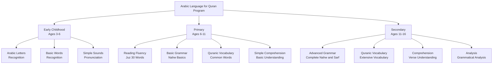
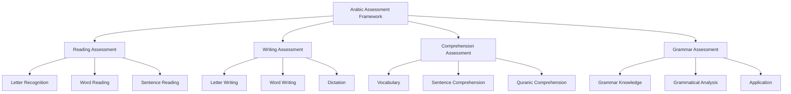

# Arabic Language for Quran

**Document Title:** Arabic Language for Quran
**Document ID:** IS_011
**Version:** 1.0
**Date:** 2026-01-11
**Project Name:** Smart Academy Digital Web Portal Development
**Content Category:** Islamic Studies Content

---

## Table of Contents

1. [Overview](#1-overview)
2. [Learning Objectives](#2-learning-objectives)
3. [Curriculum Structure](#3-curriculum-structure)
4. [Teaching Methodology](#4-teaching-methodology)
5. [Assessment & Evaluation](#5-assessment--evaluation)
6. [Resources & Materials](#6-resources--materials)
7. [Integration with Other Subjects](#7-integration-with-other-subjects)
8. [Parent Engagement](#8-parent-engagement)
9. [Technology Integration](#9-technology-integration)
10. [FAQs](#10-faqs)

---

## 1. Overview

The Arabic Language for Quran program at Smart Academy is designed to teach students Quranic Arabic, enabling them to understand the Holy Quran in its original language. Arabic is the language of the Quran, and understanding it directly connects students with the divine message without relying solely on translations. Our program guides students from basic Arabic letters to comprehensive Quranic Arabic comprehension, preparing them to engage with the Quran more deeply.

### 1.1 Philosophy

The Arabic Language for Quran program is founded on these fundamental principles:

- **Divine Language**: Arabic is the language of the Quran, chosen by Allah (SWT) for His final revelation. Allah (SWT) states in Quran 12:2: "Indeed, We have sent it down as an Arabic Quran that you might understand."

- **Direct Connection**: Understanding Quranic Arabic enables direct connection with Allah's words, without relying on translations which may not fully capture the depth and beauty of the original text.

- **Comprehension for Implementation**: Understanding the Quran in its original language enables better implementation of its teachings in daily life.

- **Gradual Progression**: Arabic learning follows a gradual progression from basic letters to advanced comprehension, respecting the natural learning process.

- **Integration with Quran Studies**: Arabic learning is integrated with Quran recitation, memorization, and Tafseer for holistic understanding.

### 1.2 Goals

The Arabic Language for Quran program aims to achieve the following goals:

1. **Arabic Literacy**: Enable students to read and write Arabic script fluently.

2. **Quranic Vocabulary**: Develop extensive Quranic Arabic vocabulary for comprehension.

3. **Grammar Understanding**: Teach Arabic grammar (Nahw and Sarf) for understanding sentence structure.

4. **Quranic Comprehension**: Enable students to understand Quranic verses in Arabic.

5. **Connection with Quran**: Connect Arabic learning with Quran recitation and memorization.

6. **Love for Arabic**: Foster appreciation and love for the Arabic language.

7. **Teaching Capability**: Prepare students to teach Arabic basics to others.

8. **Integration**: Connect Arabic learning with Quran, Hadith, and other Islamic studies.

### 1.3 Program Structure

The Arabic Language for Quran program progresses through three developmental levels:

---

## 2. Learning Objectives

### 2.1 Knowledge Objectives

By the end of each level, students will demonstrate knowledge of:

#### Early Childhood (Ages 3-6)
- All 29 Arabic letters with proper pronunciation
- Basic Arabic words from Quran (Allah, Rahman, Rahim)
- Simple Arabic sounds and pronunciation
- Recognition of Arabic letters in different forms
- Basic understanding of Arabic script direction (right to left)

#### Primary (Ages 6-11)
- Fluent reading of Arabic script
- Basic Arabic grammar (Nahw): Nouns, verbs, particles
- Basic Arabic morphology (Sarf): Verb forms
- Quranic vocabulary from Juz 30
- Basic understanding of Quranic sentence structure
- Common Quranic phrases and expressions

#### Secondary (Ages 11-16)
- Complete Arabic grammar (Nahw and Sarf)
- Extensive Quranic vocabulary
- Understanding of Quranic verses in Arabic
- Grammatical analysis of Quranic verses
- Advanced Arabic sentence structures
- Quranic idioms and expressions
- Ability to use Arabic dictionary for Quranic study

### 2.2 Skills Objectives

Students will develop the following Arabic-specific skills:

#### Reading Skills
- **Letter Recognition**: Identifying all Arabic letters
- **Word Reading**: Reading Arabic words fluently
- **Sentence Reading**: Reading Arabic sentences with proper flow
- **Quranic Reading**: Reading Quranic verses with comprehension

#### Writing Skills
- **Letter Writing**: Writing all Arabic letters correctly
- **Word Writing**: Writing Arabic words correctly
- **Sentence Writing**: Writing simple Arabic sentences
- **Dictation**: Writing from dictation

#### Comprehension Skills
- **Vocabulary Understanding**: Understanding Quranic vocabulary
- **Grammar Understanding**: Understanding Arabic grammar rules
- **Sentence Comprehension**: Understanding Arabic sentence structure
- **Quranic Comprehension**: Understanding Quranic verses in Arabic

#### Analysis Skills
- **Grammatical Analysis**: Analyzing grammar of Quranic verses
- **Morphological Analysis**: Analyzing word forms in Quran
- **Contextual Understanding**: Understanding words in Quranic context
- **Dictionary Usage**: Using Arabic dictionaries for Quranic study

### 2.3 Character Objectives

Through Arabic studies, students will develop:

- **Appreciation for Quran**: Deeper appreciation for the Quran through understanding its language
- **Love for Arabic**: Love for the Arabic language as the language of the Quran
- **Patience (Sabr)**: Patience in learning a new language
- **Perseverance**: Consistency in Arabic study
- **Curiosity**: Interest in understanding the Quran in its original language
- **Dedication**: Commitment to Arabic learning
- **Respect for Knowledge**: Respect for the effort required to understand the Quran

---

## 3. Curriculum Structure

### 3.1 Level-Specific Curriculum

#### Early Childhood (Ages 3-6)

| Topic | Content | Learning Focus |
|-------|---------|----------------|
| **Arabic Alphabet** | All 29 letters | Recognition and pronunciation |
| **Letter Forms** | Initial, medial, final forms | Recognizing letters in different positions |
| **Vowels (Harakat)** | Fatah, Dammah, Kasrah | Understanding vowel sounds |
| **Basic Words** | Allah, Rahman, Rahim, Bismillah | Common Quranic words |
| **Simple Sounds** | Pronunciation practice | Correct pronunciation of letters |
| **Letter Recognition** | Identifying letters | Recognizing letters in Quran |

**Key Concepts**:
- Arabic alphabet (29 letters)
- Letter forms (initial, medial, final, isolated)
- Vowels (Harakat): Fatah, Dammah, Kasrah, Sukun
- Basic Quranic vocabulary
- Right-to-left reading direction

#### Primary (Ages 6-11)

##### Reading Fluency

| Topic | Content | Learning Focus |
|-------|---------|----------------|
| **Letter Recognition** | All letters in all forms | Fluent letter recognition |
| **Word Reading** | Quranic words from Juz 30 | Fluent word reading |
| **Sentence Reading** | Simple Quranic sentences | Reading with proper flow |
| **Quranic Reading** | Selected verses from Juz 30 | Reading with comprehension |

##### Basic Grammar (Nahw)

| Topic | Content | Learning Focus |
|-------|---------|----------------|
| **Parts of Speech** | Ism (noun), Fi'l (verb), Harf (particle) | Understanding word types |
| **Nouns** | Types of nouns | Understanding noun categories |
| **Verbs** | Past, present, command forms | Basic verb forms |
| **Particles** | Prepositions, conjunctions | Common particles |
| **Gender** | Masculine and feminine | Understanding grammatical gender |
| **Number** | Singular, dual, plural | Understanding grammatical number |
| **Case** | Nominative, accusative, genitive | Basic case understanding |

##### Basic Morphology (Sarf)

| Topic | Content | Learning Focus |
|-------|---------|----------------|
| **Verb Forms** | Past, present, command | Basic verb conjugation |
| **Pronouns** | Attached pronouns | Understanding attached pronouns |
| **Verb Patterns** | Basic patterns | Understanding verb forms |

##### Quranic Vocabulary

| Category | Words | Learning Focus |
|----------|--------|----------------|
| **Divine Names** | Allah, Rahman, Rahim | Understanding divine attributes |
| **Common Words** | Quran, Kitab, Iman | Common Quranic vocabulary |
| **Verbs** | Common verbs | Understanding verb meanings |
| **Particles** | Common particles | Understanding particle usage |

#### Secondary (Ages 11-16)

##### Advanced Grammar (Nahw)

| Topic | Content | Learning Focus |
|-------|---------|----------------|
| **Complete Nahw** | Comprehensive grammar study | Complete understanding of Arabic grammar |
| **Advanced Nouns** | Detailed noun study | Advanced noun categories |
| **Advanced Verbs** | Complete verb study | Complete verb system |
| **Advanced Particles** | Detailed particle study | All particle types |
| **Sentences** | Complete sentence analysis | Understanding all sentence types |
| **Conditional Sentences** | If-then sentences | Understanding conditional structures |
| **Relative Clauses** | Relative pronouns | Understanding relative clauses |

##### Advanced Morphology (Sarf)

| Topic | Content | Learning Focus |
|-------|---------|----------------|
| **Complete Sarf** | Comprehensive morphology | Complete understanding of word forms |
| **Verb Forms** | All verb forms and patterns | Complete verb system |
| **Noun Forms** | All noun forms | Complete noun system |
| **Derivation** | Word derivation | Understanding how words are derived |
| **Roots** | Trilateral roots | Understanding Arabic root system |

##### Quranic Vocabulary

| Category | Words | Learning Focus |
|----------|--------|----------------|
| **Extensive Vocabulary** | 500+ Quranic words | Extensive vocabulary |
| **Root Words** | Words from same roots | Understanding root connections |
| **Synonyms** | Similar meaning words | Understanding word nuances |
| **Antonyms** | Opposite meaning words | Understanding contrasts |
| **Idioms** | Quranic idioms | Understanding idiomatic expressions |

##### Comprehension

| Topic | Content | Learning Focus |
|-------|---------|----------------|
| **Verse Comprehension** | Understanding selected verses | Comprehending Quranic verses |
| **Sentence Analysis** | Grammatical analysis | Analyzing verse grammar |
| **Contextual Understanding** | Words in context | Understanding context meanings |
| **Dictionary Usage** | Using Arabic dictionaries | Independent study skills |

### 3.2 Arabic Grammar Overview

#### Parts of Speech (Kalam)

| Part | Arabic | Description |
|-------|---------|-------------|
| **Noun** | Ism | Names of people, places, things |
| **Verb** | Fi'l | Action words |
| **Particle** | Harf | Words that connect other words |

#### Noun Types (Ism)

| Type | Arabic | Description |
|------|---------|-------------|
| **Common Noun** | Ism 'Aam | General nouns |
| **Proper Noun** | Ism 'Aalam | Specific names |
| **Pronoun** | Damir | Words replacing nouns |
| **Adjective** | Sifah | Describing words |
| **Active Participle** | Ism Fa'il | Doer of action |
| **Passive Participle** | Ism Mafa'ul | Receiver of action |

#### Verb Types (Fi'l)

| Type | Arabic | Description |
|------|---------|-------------|
| **Past Tense** | Madi | Completed action |
| **Present Tense** | Mudaari' | Ongoing action |
| **Command** | Amr | Imperative |
| **Prohibition** | Nahi | Negative command |

#### Grammatical Cases (I'rab)

| Case | Arabic | Ending | Function |
|------|---------|--------|----------|
| **Nominative** | Raf' | Dammah | Subject |
| **Accusative** | Nasb | Fatah | Object |
| **Genitive** | Jarr | Kasrah | Possession |

### 3.3 Quranic Vocabulary by Category

#### Divine Names and Attributes

| Word | Meaning | Quranic Reference |
|------|---------|-------------------|
| **Allah** | The God | Quran 1:1 |
| **Ar-Rahman** | The Entirely Merciful | Quran 1:3 |
| **Ar-Rahim** | The Especially Merciful | Quran 1:3 |
| **Al-Malik** | The King | Quran 1:4 |
| **Al-Quddus** | The Holy | Quran 59:23 |

#### Common Quranic Words

| Word | Meaning | Quranic Reference |
|------|---------|-------------------|
| **Quran** | Recitation/Reading | Quran 75:17-18 |
| **Kitab** | Book | Quran 2:2 |
| **Iman** | Faith | Quran 2:177 |
| **Islam** | Submission | Quran 3:19 |
| **Salah** | Prayer | Quran 2:43 |
| **Zakat** | Charity | Quran 2:43 |
| **Siyam** | Fasting | Quran 2:183 |
| **Hajj** | Pilgrimage | Quran 2:196 |

#### Common Verbs

| Verb | Meaning | Quranic Reference |
|------|---------|-------------------|
| **Qala** | Said | Quran 2:34 |
| **Fa'ala** | Did | Quran 2:25 |
| **Kana** | Was | Quran 2:255 |
| **Ja'ala** | Came | Quran 2:208 |
| **Ra'a** | Saw | Quran 2:255 |

---

## 4. Teaching Methodology

### 4.1 Pedagogical Approach

The Arabic Language for Quran program employs a combination of traditional and modern teaching methods:

#### Traditional Methods
- **Memorization**: Memorizing Arabic letters, words, and basic grammar rules
- **Repetition**: Repeated practice for fluency
- **Dictation**: Writing from dictation for practice
- **Reading Practice**: Regular reading practice with Quranic text

#### Modern Methods
- **Interactive Learning**: Use of smart boards, tablets, and multimedia resources
- **Visual Learning**: Using diagrams and visual aids for grammar concepts
- **Audio Learning**: Listening to Quranic recitation for pronunciation
- **Differentiated Instruction**: Adapting methods to individual learning levels

### 4.2 Teaching Strategies

#### For Early Childhood (3-6)

| Strategy | Description | Example |
|----------|-------------|---------|
| **Visual Learning** | Colorful letters and pictures | Alphabet cards with pictures |
| **Repetition** | Repeating letters and words | Repeating alphabet daily |
| **Songs and Rhymes** | Arabic alphabet songs | Songs for letter memorization |
| **Play-Based Learning** | Games and activities | Letter matching games |
| **Modeling** | Teachers demonstrate pronunciation | Showing correct pronunciation |
| **Positive Reinforcement** | Stickers and rewards | Rewards for letter recognition |

#### For Primary (6-11)

| Strategy | Description | Example |
|----------|-------------|---------|
| **Interactive Discussion** | Class discussions about grammar | Discussing noun types |
| **Visual Learning** | Grammar diagrams and charts | Visual aids for grammar |
| **Reading Practice** | Regular Quranic reading practice | Reading Juz 30 words |
| **Writing Practice** | Dictation and writing exercises | Writing from dictation |
| **Vocabulary Building** | Daily vocabulary practice | Learning 5 new words daily |
| **Group Work** | Collaborative activities | Group vocabulary games |
| **Self-Correction** | Identifying and correcting errors | Self-correction exercises |

#### For Secondary (11-16)

| Strategy | Description | Example |
|----------|-------------|---------|
| **Critical Analysis** | Deep grammatical analysis | Analyzing Quranic verses |
| **Research Projects** | Independent research on Arabic topics | Research on Quranic vocabulary |
| **Debate and Discussion** | Structured discussions | Discussing grammatical nuances |
| **Comparative Study** | Comparing different grammatical approaches | Comparing different explanations |
| **Application Projects** | Applying Arabic to Quran study | Using Arabic for Tafseer |
| **Teaching Practice** | Students teaching younger students | Peer tutoring in Arabic |
| **Dictionary Usage** | Using Arabic dictionaries | Independent Quranic study |

### 4.3 Classroom Environment

The Arabic classroom is designed to be:

- **Language-Focused**: Clean, organized, with Arabic content displayed
- **Interactive**: Encouraging student participation and engagement
- **Technology-Enhanced**: Smart boards, tablets, and digital resources
- **Comfortable**: Appropriate seating for extended practice
- **Inclusive**: Welcoming to students from all backgrounds

---

## 5. Assessment & Evaluation

### 5.1 Assessment Framework

### 5.2 Assessment Methods

#### Reading Assessment

| Criteria | Description | Scoring |
|----------|-------------|---------|
| **Letter Recognition** | Identifying all letters | 0-20 points |
| **Word Reading** | Reading words fluently | 0-30 points |
| **Sentence Reading** | Reading sentences with proper flow | 0-30 points |
| **Quranic Reading** | Reading Quranic verses | 0-20 points |

**Scoring Rubric**:
- **Excellent (90-100)**: Fluent reading with excellent pronunciation
- **Very Good (80-89)**: Strong reading with minor issues
- **Good (70-79)**: Good reading with some issues
- **Satisfactory (60-69)**: Basic reading with notable issues
- **Needs Improvement (Below 60)**: Significant reading issues

#### Writing Assessment

| Criteria | Description | Scoring |
|----------|-------------|---------|
| **Letter Writing** | Writing all letters correctly | 0-30 points |
| **Word Writing** | Writing words correctly | 0-30 points |
| **Dictation** | Writing from dictation | 0-40 points |

**Scoring Rubric**:
- **Excellent (90-100)**: Excellent writing with minimal errors
- **Very Good (80-89)**: Strong writing with minor errors
- **Good (70-79)**: Good writing with some errors
- **Satisfactory (60-69)**: Basic writing with notable errors
- **Needs Improvement (Below 60)**: Significant writing issues

#### Comprehension Assessment

| Criteria | Description | Scoring |
|----------|-------------|---------|
| **Vocabulary** | Understanding Quranic vocabulary | 0-30 points |
| **Sentence Comprehension** | Understanding Arabic sentences | 0-30 points |
| **Quranic Comprehension** | Understanding Quranic verses | 0-40 points |

**Scoring Rubric**:
- **Excellent (90-100)**: Deep comprehension of all aspects
- **Very Good (80-89)**: Strong comprehension with minor gaps
- **Good (70-79)**: Good comprehension with some gaps
- **Satisfactory (60-69)**: Basic comprehension with notable gaps
- **Needs Improvement (Below 60)**: Limited comprehension

#### Grammar Assessment

| Criteria | Description | Scoring |
|----------|-------------|---------|
| **Grammar Knowledge** | Understanding of grammar rules | 0-40 points |
| **Grammatical Analysis** | Analyzing grammar of verses | 0-30 points |
| **Application** | Applying grammar to comprehension | 0-30 points |

**Scoring Rubric**:
- **Excellent (90-100)**: Excellent grammatical understanding
- **Very Good (80-89)**: Strong grammatical understanding
- **Good (70-79)**: Good grammatical understanding
- **Satisfactory (60-69)**: Basic grammatical understanding
- **Needs Improvement (Below 60)**: Limited grammatical understanding

### 5.3 Level-Based Assessment

#### Early Childhood Assessment

| Component | Criteria | Passing Score |
|-----------|----------|----------------|
| **Letter Recognition** | Identifying all letters | 70% |
| **Basic Words** | Recognizing basic words | 70% |
| **Pronunciation** | Correct pronunciation | 70% |

#### Primary Assessment

| Component | Criteria | Passing Score |
|-----------|----------|----------------|
| **Reading Fluency** | Fluent reading of Arabic | 75% |
| **Basic Grammar** | Understanding basic grammar | 75% |
| **Quranic Vocabulary** | Common Quranic words | 75% |
| **Basic Comprehension** | Understanding simple sentences | 70% |

#### Secondary Assessment

| Component | Criteria | Passing Score |
|-----------|----------|----------------|
| **Advanced Grammar** | Complete grammar understanding | 80% |
| **Quranic Vocabulary** | Extensive vocabulary | 75% |
| **Comprehension** | Understanding Quranic verses | 75% |
| **Grammatical Analysis** | Analyzing verse grammar | 75% |
| **Dictionary Usage** | Using Arabic dictionaries | 70% |

### 5.4 Progress Tracking

Each student maintains an Arabic Progress Portfolio including:

- **Reading Record**: Record of reading assessments
- **Writing Record**: Record of writing assessments
- **Comprehension Record**: Record of comprehension work
- **Grammar Record**: Record of grammatical understanding
- **Vocabulary Record**: Record of vocabulary learned
- **Achievement Certificates**: Recognition of level completion
- **Teacher Feedback**: Regular feedback from Arabic teachers

---

## 6. Resources & Materials

### 6.1 Primary Textbooks

#### Arabic Learning Books
- **Noorani Qaida**: Foundation for Quran reading
- **Arabic Grammar for Beginners**: Basic Arabic grammar
- **Quranic Vocabulary**: Quranic word lists
- **Arabic Writing**: Arabic writing practice

#### Grammar Books
- **Nahw al-Wadih**: Basic Arabic grammar
- **Mughni al-Labib**: Comprehensive Arabic grammar
- **Arabic Grammar Made Easy**: Simplified grammar guide

#### Vocabulary Books
- **Quranic Vocabulary Dictionary**: Quranic word meanings
- **Most Frequent Words in Quran**: Common Quranic vocabulary
- **Arabic Roots**: Understanding Arabic root system

### 6.2 Digital Resources

#### Arabic Learning Apps
- **Duolingo Arabic**: Basic Arabic lessons
- **Madinah Arabic**: Comprehensive Arabic course
- **ArabicPod101**: Audio and video lessons
- **Quranic Arabic App**: Quranic vocabulary learning

#### Quran Applications
- **Quran.com**: Online Quran with word-by-word translation
- **Quran Explorer**: Recitation with vocabulary
- **iQuran**: Mobile app with Arabic features

### 6.3 Audio and Video Resources

#### Video Resources
- **Arabic Lessons**: Video lessons by Arabic teachers
- **Quranic Arabic**: Videos on Quranic Arabic
- **Grammar Tutorials**: Video grammar lessons

#### Audio Resources
- **Arabic Audio**: Audio lessons and practice
- **Quranic Recitation**: Listening to Quranic recitation
- **Arabic Podcasts**: Arabic learning podcasts

### 6.4 Supplementary Materials

#### Teaching Aids
- **Flashcards**: Arabic letters, vocabulary, grammar
- **Posters**: Arabic alphabet, grammar rules
- **Charts**: Verb conjugation charts, grammar tables
- **Visual Aids**: Diagrams for grammar concepts

#### Assessment Tools
- **Rubrics**: Detailed criteria for assessment
- **Checklists**: Progress tracking for Arabic skills
- **Portfolios**: Student work samples and achievements
- **Progress Reports**: Regular communication with parents

---

## 7. Integration with Other Subjects

### 7.1 Re-STEAM Integration

The Arabic Language for Quran program integrates with STEAM subjects through the Re-STEAM framework:

#### Science Integration

| Arabic Concept | Science Connection | Example Activities |
|----------------|-------------------|-------------------|
| **Arabic Roots** | Linguistics | Study of Arabic root system |
| **Language Development** | Cognitive Science | Study of language acquisition |

#### Technology Integration

| Arabic Concept | Technology Connection | Example Activities |
|----------------|-------------------|-------------------|
| **Arabic Apps** | Digital Technology | Use apps for Arabic learning |
| **Online Resources** | Internet Technology | Access Arabic resources online |

#### Arts Integration

| Arabic Concept | Arts Connection | Example Activities |
|----------------|----------------|-------------------|
| **Arabic Calligraphy** | Visual Arts | Learning Arabic calligraphy |
| **Quranic Art** | Visual Arts | Creating art with Arabic script |

#### Mathematics Integration

| Arabic Concept | Mathematics Connection | Example Activities |
|----------------|-------------------|-------------------|
| **Arabic Numbers** | Number Theory | Learning Arabic number system |
| **Grammar Patterns** | Pattern Recognition | Identifying grammatical patterns |

### 7.2 Cross-Curricular Projects

Students engage in projects that integrate Arabic with other subjects:

- **Arabic Science Fair**: Projects on Arabic linguistics
- **Arabic Art Exhibition**: Student artwork with Arabic script
- **Arabic Poetry**: Creative writing in Arabic
- **Quranic Translation Projects**: Translating Quranic verses
- **Teaching Projects**: Teaching Arabic to younger students

---

## 8. Parent Engagement

### 8.1 Home-School Partnership

Parents play a crucial role in supporting their children's Arabic learning:

#### Regular Communication
- **Monthly Arabic Progress Reports**: Detailed updates on Arabic progress
- **Parent-Teacher Conferences**: Regular meetings to discuss Arabic progress
- **Digital Communication**: WhatsApp groups and email for ongoing support
- **Arabic Workshops**: Workshops on supporting children's Arabic learning at home

#### Home Support Resources
- **Daily Arabic Practice**: Guide for practicing Arabic at home
- **Family Arabic Time**: Guide for family Arabic practice
- **Application Guides**: Applying Arabic to Quran study

### 8.2 Parent Involvement Opportunities

Parents are encouraged to:

- **Practice Together**: Practicing Arabic together as a family
- **Listen to Recitation**: Listening to Quranic recitation
- **Attend Arabic Events**: Participate in Arabic competitions and celebrations
- **Model Behavior**: Demonstrate appreciation for Arabic language

### 8.3 Monitoring Progress at Home

Parents can support Arabic learning by:

- **Daily Practice**: Ensuring daily Arabic practice
- **Listening**: Listening to children's Arabic reading
- **Application**: Helping children apply Arabic to Quran study
- **Positive Reinforcement**: Encouraging and praising progress
- **Creating Environment**: Establishing an environment for Arabic learning

---

## 9. Technology Integration

### 9.1 Digital Learning Tools

The Arabic Language for Quran program incorporates technology to enhance learning:

#### Arabic Learning Apps
- **Duolingo Arabic**: Basic Arabic lessons
- **Madinah Arabic**: Comprehensive Arabic course
- **ArabicPod101**: Audio and video lessons
- **Quranic Arabic App**: Quranic vocabulary learning

#### Classroom Technology
- **Smart Boards**: Interactive displays for Arabic content
- **Tablets**: Individual devices for personalized Arabic learning
- **Projectors**: Displaying Arabic content and videos
- **Audio Systems**: High-quality audio for Arabic pronunciation

#### Learning Management System
- **Gibbon Integration**: Digital platform for Arabic resources
- **Progress Tracking**: Online tracking of Arabic progress
- **Resource Sharing**: Digital library of Arabic materials
- **Assessment Tools**: Online quizzes and assessments

### 9.2 Technology for Arabic Program

The Arabic program uses specialized technology:

- **Arabic Apps**: Mobile apps for Arabic learning and practice
- **Online Resources**: Access to Arabic libraries and lessons
- **Digital Libraries**: Comprehensive digital Arabic resources

### 9.3 Online Arabic Resources

Students and parents have access to:

- **Online Arabic Libraries**: Comprehensive Arabic resources
- **Arabic Video Lessons**: Access to renowned Arabic teachers
- **Interactive Learning**: Online courses and tutorials
- **Arabic Communities**: Online forums for discussion and support

---

## 10. FAQs

### General Questions

**Q: Why learn Arabic for Quran?**

A: Learning Arabic for Quran is important because:
- It enables direct understanding of Allah's words
- It provides deeper connection with the Quran
- It helps understand the beauty and depth of Quranic language
- It supports better implementation of Quranic teachings
- It fosters appreciation for the Quran

**Q: At what age do students start learning Arabic?**

A: Students start learning basic Arabic from Early Childhood (ages 3-6) with letter recognition. Formal Arabic study begins in Primary level (ages 6-11) with reading fluency and basic grammar.

### Curriculum Questions

**Q: What Arabic topics are studied?**

A: Arabic study includes:
- Early Childhood: Arabic alphabet, basic words, pronunciation
- Primary: Reading fluency, basic grammar (Nahw), basic morphology (Sarf), Quranic vocabulary
- Secondary: Advanced grammar, extensive vocabulary, Quranic comprehension, grammatical analysis

**Q: What is Arabic grammar (Nahw and Sarf)?**

A: 
- **Nahw**: Arabic syntax, studying how words are arranged in sentences
- **Sarf**: Arabic morphology, studying how words are formed and changed

### Assessment Questions

**Q: How is Arabic assessed?**

A: Arabic is assessed based on:
- Reading (letter recognition, word reading, sentence reading, Quranic reading)
- Writing (letter writing, word writing, dictation)
- Comprehension (vocabulary, sentence comprehension, Quranic comprehension)
- Grammar (grammar knowledge, grammatical analysis, application)

**Q: What happens if a student struggles with Arabic?**

A: We provide individualized support:
- One-on-one tutoring with Arabic teachers
- Additional resources and materials
- Simplified explanations for complex concepts
- Encouragement and motivation
- Parent involvement in home practice

### Parent Questions

**Q: How can I support my child's Arabic learning at home?**

A: Parents can support by:
- Practicing Arabic together as a family
- Listening to children's Arabic reading
- Helping children apply Arabic to Quran study
- Creating an environment for Arabic learning
- Encouraging questions and discussions about Arabic
- Attending Arabic workshops

**Q: Do I need to know Arabic to help my child?**

A: No prior Arabic knowledge is required. We provide:
- Translations and explanations
- Parent workshops on Arabic topics
- Home study guides with explanations
- Regular communication with teachers

### Technology Questions

**Q: What technology tools are used in Arabic learning?**

A: Technology integration includes:
- Arabic learning apps
- Smart boards for interactive lessons
- Online resources and digital libraries
- Progress tracking systems

**Q: Is technology used instead of traditional methods?**

A: No, technology is used as a supplement to traditional methods:
- Face-to-face instruction remains primary
- Traditional methods of Arabic learning are maintained
- Technology enhances but does not replace traditional learning
- Balance is maintained between digital and traditional methods

---

## Document Approval

| Role | Name | Signature | Date |
|------|------|-----------|------|
| Islamic Studies Coordinator | | _________________ | ________ |
| Principal | | _________________ | ________ |
