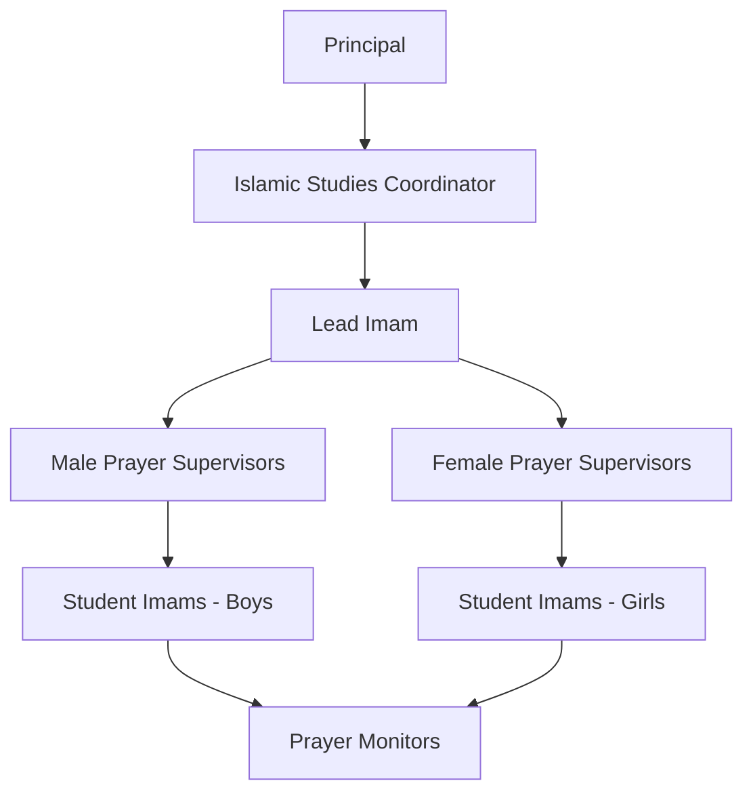
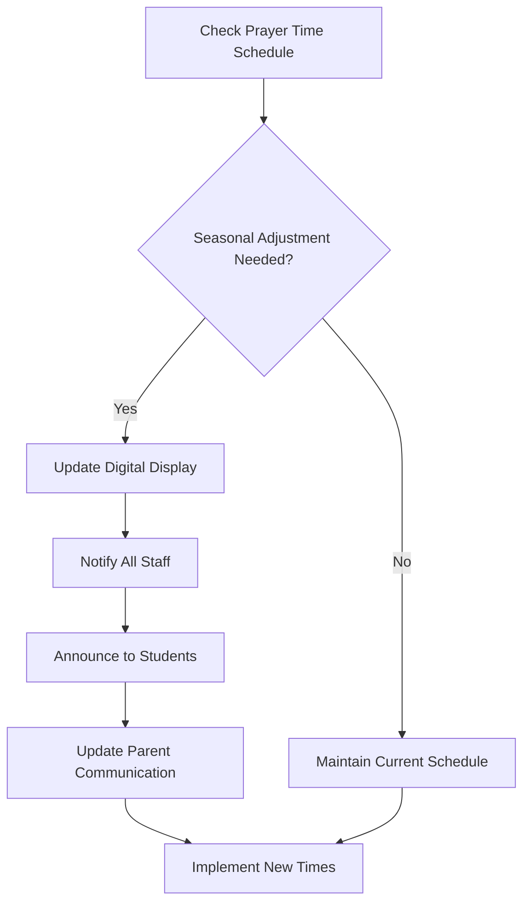

# Daily Prayer Program

**Document Title:** Daily Prayer Program
**Document ID:** IS_DPP_001
**Version:** 1.0
**Date:** 2026-01-11
**Project Name:** Smart Academy Digital Web Portal Development
**Content Category:** Islamic Studies Content

---

## Table of Contents

1. [Overview](#1-overview)
2. [Program Objectives](#2-program-objectives)
3. [Program Structure](#3-program-structure)
4. [Activities & Events](#4-activities--events)
5. [Schedule & Timing](#5-schedule--timing)
6. [Participation & Eligibility](#6-participation--eligibility)
7. [Resources & Materials](#7-resources--materials)
8. [Assessment & Recognition](#8-assessment--recognition)
9. [Parent Engagement](#9-parent-engagement)
10. [FAQs](#10-faqs)

---

## 1. Overview

The Daily Prayer Program at Smart Academy establishes a structured framework for students to develop consistent Salah (prayer) habits, fostering spiritual discipline and connection with Allah (SWT). This program integrates prayer into the daily school routine, ensuring students understand the importance, methodology, and spiritual significance of each of the five daily prayers.

### 1.1 Philosophy

The program is founded on the Quranic command:

> "Indeed, prayer has been decreed upon the believers at specified times." - Quran 4:103

And the prophetic tradition:

> "The first matter that the slave will be brought to account for on the Day of Judgment is the prayer. If it is sound, then the rest of his deeds will be sound. And if it is bad, then the rest of his deeds will be bad." - Sunan at-Tirmidhi, Book 2, Hadith 413

### 1.2 Goals

- **Knowledge Goals**: Students learn the rulings, conditions, and pillars of Salah
- **Skill Goals**: Students master proper Wudu (ablution), prayer postures, and recitation
- **Character Goals**: Students develop discipline, punctuality, and spiritual consciousness
- **Habit Goals**: Students establish consistent prayer habits that extend beyond school

---

## 2. Program Objectives

### 2.1 Knowledge Objectives

By the end of the program, students will be able to:

- Explain the importance and significance of the five daily prayers
- Identify the prayer times and their associated names in Arabic
- Understand the conditions, pillars, and obligatory acts of Salah
- Recite essential Surahs and supplications from memory
- Recognize the differences between obligatory (Fard) and voluntary (Sunnah/Nawafil) prayers

### 2.2 Skill Objectives

Students will demonstrate proficiency in:

- Performing Wudu (ablution) correctly according to Sunnah
- Standing in proper prayer rows (Saff) with correct alignment
- Executing prayer postures with proper composure and tranquility
- Reciting Quranic verses and supplications with correct pronunciation
- Leading prayers (Imam) for younger students (advanced levels)

### 2.3 Character Objectives

Students will develop:

- **Sabr (Patience)**: Waiting calmly for prayer times
- **Ikhlas (Sincerity)**: Praying solely for Allah's pleasure
- **Tawadu (Humility)**: Maintaining proper Adab in prayer
- **Amanah (Trustworthiness)**: Fulfilling the obligation of Salah
- **Rahma (Compassion)**: Helping younger students with prayer

### 2.4 Re-STEAM Integration

- **Science Connection**: Understanding the astronomical basis of prayer times
- **Technology Connection**: Using prayer time apps and digital displays
- **Mathematics Connection**: Calculating prayer times and understanding Islamic geometry
- **Arts Connection**: Appreciating the beauty of Quranic recitation and Islamic architecture in prayer spaces

---

## 3. Program Structure

### 3.1 Prayer Facilities

Smart Academy provides dedicated prayer facilities:

- **Main Musalla**: 200-student capacity prayer hall
- **Wudu Area**: Separate ablution stations for boys and girls
- **Prayer Mats**: Individual prayer mats with proper spacing
- **Qibla Direction**: Clearly marked with visual indicators
- **Prayer Time Display**: Digital prayer time clock visible throughout campus
- **Storage**: Lockers for prayer garments and personal prayer items

### 3.2 Prayer Leadership Structure

### 3.3 Age-Appropriate Implementation

#### Early Childhood (3-6 years)

- Introduction to prayer concepts through stories and visual aids
- Learning basic Wudu steps through demonstration
- Practicing simple prayer movements and positions
- Memorizing short Surahs (Al-Fatiha, Al-Ikhlas, Al-Falaq, An-Nas)
- Prayer duration: 5-10 minutes with guidance

#### Primary Level (6-11 years)

- Complete prayer performance with proper sequence
- Learning all obligatory parts of Salah
- Memorizing additional Surahs and supplications
- Understanding prayer times and their significance
- Prayer duration: 10-15 minutes

#### Secondary Level (11-16 years)

- Leading prayers as Imam for younger students
- Advanced understanding of prayer jurisprudence
- Memorizing longer Surahs and Quranic portions
- Teaching Wudu and prayer to younger students
- Prayer duration: 15-20 minutes

### 3.4 Prayer Components

Each prayer session includes:

1. **Preparation Phase** (5 minutes):
   - Wudu (ablution) if needed
   - Preparation of prayer space
   - Mental preparation and intention (Niyyah)

2. **Prayer Phase** (10-20 minutes):
   - Adhan (call to prayer) for Dhuhr and Asr
   - Congregational prayer in Jama'ah
   - Sunnah prayers before/after as appropriate

3. **Post-Prayer Phase** (5 minutes):
   - Dhikr (remembrance of Allah)
   - Du'a (supplications)
   - Brief reflection or reminder

---

## 4. Activities & Events

### 4.1 Daily Activities

#### Morning Preparation

- **Fajr Prayer**: Students encouraged to pray Fajr at home with family
- **Morning Adab**: Short session on Islamic manners and etiquette
- **Dhikr Session**: Collective remembrance of Allah before classes begin

#### Midday Prayers

- **Dhuhr Prayer**: Congregational prayer for all students
- **Wudu Education**: Supervised ablution with guidance
- **Prayer Leadership**: Student Imams rotate leading prayers

#### Afternoon Prayers

- **Asr Prayer**: Congregational prayer before dismissal
- **Prayer Reflection**: Brief discussion on prayer importance
- **Home Prayer Reminder**: Encouragement for Maghrib and Isha at home

### 4.2 Weekly Activities

#### Jumu'ah (Friday Prayer)

- **Special Arrangement**: Extended prayer time for Friday congregation
- **Khutbah (Sermon)**: Age-appropriate Islamic talks
- **Student Participation**: Selected students assist with prayer arrangements
- **Parent Invitation**: Parents welcome to attend Jumu'ah when possible

#### Prayer Review Sessions

- **Weekly Assessment**: Review of prayer attendance and performance
- **Skill Building**: Focus on improving specific prayer aspects
- **Q&A Sessions**: Address student questions about prayer

### 4.3 Monthly Activities

#### Prayer Workshops

- **Wudu Workshop**: Detailed training on proper ablution
- **Tajweed Workshop**: Quranic recitation improvement for prayer
- **Imam Training**: Advanced students learn to lead prayers effectively

#### Prayer Competitions

- **Best Prayer Performance**: Recognition for excellent prayer conduct
- **Wudu Competition**: Speed and accuracy in performing ablution
- **Surah Memorization**: Contest for memorizing prayer recitations

### 4.4 Special Events

#### Prayer Awareness Week

- **Theme**: "Salah: The Key to Success"
- **Activities**: Special assemblies, poster competitions, parent workshops
- **Guest Speakers**: Islamic scholars and community leaders
- **Family Prayer Event**: Evening prayer session with families

#### Annual Prayer Camp

- **Duration**: 2-3 days during school holidays
- **Focus**: Intensive prayer training and spiritual development
- **Activities**: Extended prayers, Quran recitation, Islamic lectures
- **Age Groups**: Separate sessions for different age levels

---

## 5. Schedule & Timing

### 5.1 Daily Prayer Schedule

| Prayer | School Time | Duration | Location | Notes |
|--------|-------------|----------|----------|-------|
| Fajr | Home (before school) | 10-15 min | Home | Family encouraged to pray together |
| Dhuhr | 1:00 PM - 1:30 PM | 20-25 min | Main Musalla | Congregational prayer with Adhan |
| Asr | 3:30 PM - 4:00 PM | 15-20 min | Main Musalla | Before dismissal |
| Maghrib | Home (after school) | 10-15 min | Home | Family prayer time |
| Isha | Home (evening) | 15-20 min | Home | Family encouraged to pray together |

### 5.2 Prayer Time Adjustment Process

### 5.3 Seasonal Prayer Times

Prayer times are adjusted seasonally based on local astronomical calculations:

- **Winter Schedule** (November - February): Earlier Dhuhr, later Asr
- **Summer Schedule** (May - August): Later Dhuhr, earlier Asr
- **Transition Periods** (March - April, September - October): Gradual adjustments

### 5.4 Special Day Adjustments

#### Examination Days

- Shortened prayer sessions while maintaining obligation
- Quiet prayer environment to support concentration
- Flexible timing for students with exam conflicts

#### Event Days

- Adjusted prayer schedule for school events
- Extended prayer time for special Islamic occasions
- Combined prayers when necessary (following Islamic jurisprudence)

#### Weather Considerations

- Indoor prayer during inclement weather
- Adjusted Wudu facilities access during heavy rain
- Emergency prayer procedures for severe weather

---

## 6. Participation & Eligibility

### 6.1 Mandatory Participation

All enrolled students are required to participate in:

- Dhuhr prayer (congregational)
- Asr prayer (congregational)
- Prayer education sessions
- Wudu training

### 6.2 Exemptions and Accommodations

#### Medical Exemptions

- Students with medical conditions may be exempt from certain prayer requirements
- Parental note from healthcare provider required
- Alternative spiritual activities provided as appropriate

#### Age-Based Exemptions

- **Early Childhood (3-5 years)**: Observation and gradual participation
- **Age 6-7 years**: Full participation with close supervision
- **Age 8+ years**: Full participation expected

#### Special Needs Accommodations

- Modified prayer positions for students with physical limitations
- Extended time for students requiring additional support
- One-on-one assistance for students with special needs
- Accessible prayer facilities and equipment

### 6.3 Attendance Policy

#### Attendance Tracking

- Digital attendance system for each prayer session
- Monthly attendance reports sent to parents
- Excused absences require parental notification
- Unexcused absences addressed through counseling

#### Attendance Requirements

- **Minimum Attendance**: 90% participation required for recognition
- **Perfect Attendance**: Special recognition and awards
- **Improvement Awards**: Recognition for consistent improvement

### 6.4 Student Leadership Roles

#### Student Imams

- **Eligibility**: Secondary students (11-16 years) with excellent prayer performance
- **Selection**: Based on prayer knowledge, recitation quality, and leadership ability
- **Responsibilities**: Leading prayers, assisting younger students, maintaining prayer discipline
- **Training**: Special Imam training sessions provided

#### Prayer Monitors

- **Eligibility**: Primary and secondary students demonstrating responsibility
- **Role**: Assisting supervisors, maintaining prayer hall order, helping younger students
- **Recognition**: Service hours and leadership certificates

---

## 7. Resources & Materials

### 7.1 Physical Resources

#### Prayer Facilities

- **Main Musalla**: 200-student capacity prayer hall
- **Wudu Stations**: Separate facilities for boys and girls
- **Prayer Mats**: Individual mats with proper spacing
- **Qibla Indicators**: Clear visual markers for prayer direction
- **Storage Areas**: Lockers for prayer garments and personal items

#### Prayer Equipment

- **Prayer Garments**: Available for students who need them
- **Wudu Supplies**: Soap, towels, water containers
- **Prayer Clocks**: Digital displays showing prayer times
- **Audio System**: For Adhan and Quranic recitation
- **Educational Materials**: Charts, posters, and visual aids

### 7.2 Educational Materials

#### Student Resources

- **Prayer Guide Booklets**: Age-appropriate instruction manuals
- **Wudu Charts**: Step-by-step visual guides
- **Surah Booklets**: Prayer recitations with transliteration and translation
- **Prayer Journals**: For tracking progress and reflections

#### Teacher Resources

- **Prayer Curriculum**: Detailed lesson plans and objectives
- **Assessment Tools**: Rubrics for evaluating prayer performance
- **Training Materials**: Professional development resources
- **Parent Communication Templates**: Letters and information sheets

### 7.3 Digital Resources

#### Prayer Time Applications

- **Prayer Time Apps**: Installed on school devices
- **Qibla Direction Apps**: For accurate prayer direction
- **Quran Apps**: Digital Quran with recitation and translation
- **Educational Videos**: Instructional videos for prayer and Wudu

#### Online Resources

- **Prayer Learning Platform**: School portal with prayer resources
- **Parent Portal**: Access to prayer schedules and student progress
- **Virtual Prayer Room**: For remote learning situations
- **Islamic Content Library**: Digital library of Islamic resources

### 7.4 Community Resources

#### Local Mosque Partnerships

- **Imam Visits**: Regular visits from local Islamic scholars
- **Mosque Tours**: Educational visits to local mosques
- **Community Prayer Events**: Participation in community prayers
- **Resource Sharing**: Access to additional Islamic materials

#### Parent Resources

- **Home Prayer Guides**: Instructions for family prayer at home
- **Prayer Time Charts**: Monthly prayer time schedules for home
- **Family Activity Ideas**: Suggestions for family Islamic activities
- **Q&A Sessions**: Regular opportunities for parent questions

---

## 8. Assessment & Recognition

### 8.1 Assessment Methods

#### Daily Assessment

- **Attendance Tracking**: Digital record of prayer participation
- **Performance Observation**: Supervisors note prayer quality and conduct
- **Wudu Assessment**: Evaluation of proper ablution technique
- **Recitation Quality**: Assessment of Quranic recitation accuracy

#### Weekly Assessment

- **Skill Check**: Review of specific prayer components
- **Progress Monitoring**: Tracking improvement over time
- **Peer Assessment**: Students evaluate each other's prayer (guided)
- **Self-Assessment**: Students reflect on their own prayer habits

#### Monthly Assessment

- **Comprehensive Review**: Full evaluation of prayer knowledge and performance
- **Goal Setting**: Students set personal prayer improvement goals
- **Parent Feedback**: Input from families on home prayer habits
- **Recognition Planning**: Identification of students for awards

### 8.2 Assessment Criteria

#### Knowledge Criteria

- Understanding of prayer importance and significance
- Knowledge of prayer times and their names
- Recognition of prayer conditions and pillars
- Memorization of required Surahs and supplications

#### Skill Criteria

- Proper Wudu technique
- Correct prayer postures and movements
- Accurate Quranic recitation with Tajweed
- Appropriate prayer conduct and Adab

#### Character Criteria

- Consistency in prayer attendance
- Punctuality and preparation for prayer
- Respectful behavior during prayer
- Willingness to help others with prayer

### 8.3 Recognition System

#### Daily Recognition

- **Prayer Star**: Immediate verbal praise for excellent prayer performance
- **Helper Badge**: Recognition for assisting other students
- **Improvement Note**: Acknowledgment of personal progress

#### Weekly Recognition

- **Prayer Champion**: Student with best prayer performance for the week
- **Perfect Attendance**: Recognition for full prayer participation
- **Most Improved**: Student showing greatest improvement

#### Monthly Recognition

- **Prayer Excellence Award**: Certificate for outstanding prayer performance
- **Leadership Award**: Recognition for student Imams and monitors
- **Consistency Award**: For sustained excellent prayer habits

#### Annual Recognition

- **Prayer Achievement Certificate**: Year-end recognition for prayer excellence
- **Imam Certification**: For students qualified to lead prayers
- **Prayer Ambassador**: Selected students represent school in community events

### 8.4 Award Categories

| Award | Criteria | Age Group | Recognition |
|-------|----------|-----------|-------------|
| Prayer Star | Excellent daily performance | All | Verbal praise, sticker |
| Prayer Champion | Best weekly performance | All | Certificate, small prize |
| Prayer Excellence | Outstanding monthly performance | All | Certificate, medal |
| Perfect Attendance | 100% prayer participation | All | Certificate, special recognition |
| Most Improved | Greatest progress | All | Certificate, encouragement |
| Imam Certification | Qualified prayer leader | 11-16 years | Certificate, leadership role |
| Prayer Ambassador | Community representation | 11-16 years | Badge, special duties |

---

## 9. Parent Engagement

### 9.1 Communication Channels

#### Regular Updates

- **Monthly Prayer Reports**: Detailed student progress reports
- **Prayer Time Schedules**: Monthly prayer time calendars
- **Event Notifications**: Information about special prayer events
- **Educational Tips**: Suggestions for supporting prayer at home

#### Digital Communication

- **Parent Portal**: Online access to student prayer records
- **SMS/WhatsApp Updates**: Prayer time reminders and event notices
- **Email Newsletters**: Monthly Islamic studies newsletter
- **School Website**: Prayer program information and resources

### 9.2 Parent Workshops

#### Prayer Education Workshops

- **Understanding Salah**: Importance and benefits of prayer
- **Home Prayer Setup**: Creating conducive prayer environment at home
- **Family Prayer**: Establishing family prayer routines
- **Common Challenges**: Addressing difficulties in maintaining prayer habits

#### Wudu Workshop

- **Proper Wudu Technique**: Step-by-step demonstration
- **Wudu Facilities**: Setting up home Wudu area
- **Teaching Children**: Age-appropriate Wudu instruction methods
- **Common Mistakes**: Identification and correction of Wudu errors

### 9.3 Family Prayer Activities

#### Home Prayer Support

- **Prayer Time Charts**: Visual schedules for home use
- **Family Prayer Guide**: Instructions for leading family prayers
- **Prayer Space Ideas**: Suggestions for creating home prayer area
- **Dhikr Resources**: Family remembrance activities

#### Special Family Events

- **Family Prayer Night**: Evening prayer session at school
- **Eid Prayer Celebration**: Family participation in Eid prayers
- **Ramadan Family Iftar**: Breaking fast together with prayer
- **Parent-Child Prayer**: Special bonding through prayer

### 9.4 Volunteer Opportunities

#### Prayer Supervision

- **Parent Volunteers**: Assist with prayer supervision
- **Wudu Assistance**: Help younger students with ablution
- **Prayer Hall Setup**: Prepare prayer facilities for daily use
- **Event Support**: Assist with special prayer events

#### Resource Contribution

- **Prayer Materials**: Donate prayer mats, garments, or supplies
- **Educational Resources**: Share Islamic books or materials
- **Expertise**: Parents with Islamic knowledge share with students
- **Community Connections**: Facilitate mosque or scholar visits

### 9.5 Parent Feedback

#### Feedback Channels

- **Parent Surveys**: Annual survey on prayer program effectiveness
- **Parent-Teacher Meetings**: Discuss student prayer progress
- **Suggestion Box**: Anonymous feedback and suggestions
- **Focus Groups**: Regular parent input sessions

#### Continuous Improvement

- **Program Review**: Annual review based on parent feedback
- **Adjustment Implementation**: Changes based on suggestions
- **Success Stories**: Share positive experiences with community
- **Challenge Addressing**: Resolve concerns and difficulties

---

## 10. FAQs

### 10.1 General Questions

**Q: Why is prayer mandatory at school?**

A: Prayer is one of the five pillars of Islam and a fundamental obligation for Muslims. As stated in Quran 4:103, "Indeed, prayer has been decreed upon the believers at specified times." Integrating prayer into the school routine helps students develop consistent prayer habits and strengthens their Islamic identity.

**Q: What if my child doesn't know how to pray yet?**

A: Our program is designed to teach students from their current level. We provide age-appropriate instruction, and students learn gradually through demonstration, practice, and guidance. No prior knowledge is required.

**Q: Can my child be exempt from prayer for medical reasons?**

A: Yes, students with medical conditions may be exempt from certain prayer requirements. A parental note from a healthcare provider is required, and we provide alternative spiritual activities as appropriate.

### 10.2 Prayer-Specific Questions

**Q: What prayers are performed at school?**

A: Students perform Dhuhr and Asr prayers in congregation at school. Fajr, Maghrib, and Isha prayers are encouraged to be performed at home with family to strengthen family bonds.

**Q: How long do prayer sessions last?**

A: Prayer sessions typically last 20-30 minutes, including preparation, the prayer itself, and brief post-prayer activities. Duration varies by age group and prayer.

**Q: What if prayer time conflicts with classes?**

A: The school schedule is designed to accommodate prayer times without disrupting academic learning. Prayer is integrated into the daily routine as an essential part of education.

### 10.3 Wudu and Preparation Questions

**Q: How do students perform Wudu at school?**

A: We have dedicated Wudu facilities with separate areas for boys and girls. Supervisors guide students through proper Wudu technique, and visual aids are available for reference.

**Q: What if a student forgets to bring prayer items?**

A: The school provides prayer mats and other necessary items. Students may also keep personal prayer items in their lockers at school.

**Q: Are prayer garments required?**

A: Prayer garments are available at school for students who need them. Students may also bring their own if preferred.

### 10.4 Parent Involvement Questions

**Q: How can I support my child's prayer at home?**

A: We provide home prayer guides, prayer time schedules, and family activity ideas. Establishing a consistent family prayer routine and creating a dedicated prayer space at home are excellent ways to support your child.

**Q: Can parents attend prayer sessions at school?**

A: Parents are welcome to attend Jumu'ah (Friday) prayer and special prayer events. Regular daily prayers are for students only to maintain an appropriate learning environment.

**Q: How will I know about my child's prayer progress?**

A: We send monthly prayer reports and provide access to student prayer records through the parent portal. Parent-teacher meetings also include discussion of prayer progress.

### 10.5 Special Situations Questions

**Q: What happens during Ramadan?**

A: During Ramadan, we adjust the schedule to accommodate fasting students. Prayer times may be modified, and additional spiritual activities are organized. Detailed information is provided to parents before Ramadan.

**Q: How are prayer times determined?**

A: Prayer times are calculated based on local astronomical coordinates and adjusted seasonally. We use reliable Islamic prayer time calculation methods and display times throughout the school.

**Q: What if my child has special needs?**

A: We provide accommodations for students with special needs, including modified prayer positions, extended time, and one-on-one assistance. Please discuss your child's specific needs with us so we can provide appropriate support.

---

## Document Approval

| Role | Name | Signature | Date |
|------|------|-----------|------|
| Islamic Studies Coordinator | | _________________ | ________ |
| Principal | | _________________ | ________ |
