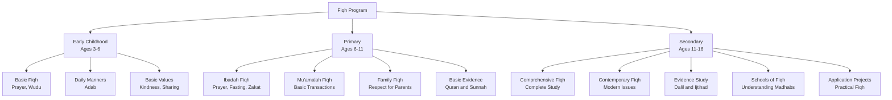
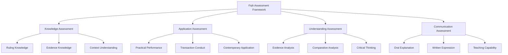

# Fiqh (Islamic Jurisprudence)

**Document Title:** Fiqh (Islamic Jurisprudence)
**Document ID:** IS_008
**Version:** 1.0
**Date:** 2026-01-11
**Project Name:** Smart Academy Digital Web Portal Development
**Content Category:** Islamic Studies Content

---

## Table of Contents

1. [Overview](#1-overview)
2. [Learning Objectives](#2-learning-objectives)
3. [Curriculum Structure](#3-curriculum-structure)
4. [Teaching Methodology](#4-teaching-methodology)
5. [Assessment & Evaluation](#5-assessment--evaluation)
6. [Resources & Materials](#6-resources--materials)
7. [Integration with Other Subjects](#7-integration-with-other-subjects)
8. [Parent Engagement](#8-parent-engagement)
9. [Technology Integration](#9-technology-integration)
10. [FAQs](#10-faqs)

---

## 1. Overview

The Fiqh (Islamic Jurisprudence) program at Smart Academy is designed to teach students the practical rulings and guidance derived from the Quran and Sunnah. Fiqh provides detailed understanding of how to implement Islamic teachings in daily life, covering worship, transactions, family life, and all aspects of human behavior. Our program guides students from basic understanding of Islamic rulings to comprehensive study of Fiqh, enabling them to practice Islam correctly in all aspects of life.

### 1.1 Philosophy

The Fiqh program is founded on these fundamental principles:

- **Divine Guidance**: Fiqh is derived from Allah's (SWT) guidance in the Quran and Prophet's (PBUH) Sunnah. Allah (SWT) states in Quran 4:59: "O you who have believed, obey Allah and obey the Messenger and those in authority among you."

- **Practical Application**: Fiqh is not merely theoretical knowledge; it must be implemented in daily life. The Prophet (PBUH) said: "Whoever Allah wants good for, He gives him understanding of the religion." (Sahih Bukhari, Book 3, Hadith 71)

- **Moderation (Wasatiyyah)**: Islam encourages moderation in all matters. Allah (SWT) states in Quran 2:143: "And thus We have made you a just community that you will be witnesses over the people."

- **Ease and Mercy**: Islamic rulings are based on ease and mercy, not hardship. Allah (SWT) states in Quran 2:185: "Allah intends for you ease and does not intend for you hardship."

- **Contextual Understanding**: Fiqh rulings must be understood in their proper context, considering time, place, and circumstances.

### 1.2 Goals

The Fiqh program aims to achieve the following goals:

1. **Fiqh Knowledge**: Enable students to learn Islamic rulings at an appropriate level for their age and development.

2. **Practical Implementation**: Guide students to implement Fiqh rulings in their daily lives, worship, and transactions.

3. **Understanding of Evidence**: Teach students the evidence (Dalil) behind Fiqh rulings from Quran and Sunnah.

4. **Contemporary Application**: Help students apply Fiqh to contemporary issues and modern life.

5. **Moderation**: Foster understanding of Islamic moderation and balance in all matters.

6. **Critical Thinking**: Develop students' ability to understand the wisdom (Hikmah) behind Fiqh rulings.

7. **Teaching Capability**: Prepare students to explain Fiqh rulings to others.

8. **Integration**: Connect Fiqh with Quran, Sunnah, and other Islamic studies.

### 1.3 Program Structure

The Fiqh program progresses through three developmental levels:

---

## 2. Learning Objectives

### 2.1 Knowledge Objectives

By the end of each level, students will demonstrate knowledge of:

#### Early Childhood (Ages 3-6)
- Basic Fiqh of prayer (Salah) and Wudu (ablution)
- Basic Islamic manners (Adab)
- Islamic values: kindness, sharing, respect
- Basic Duas for daily activities
- Simple understanding of Halal (permissible) and Haram (prohibited)

#### Primary (Ages 6-11)
- Comprehensive Fiqh of worship (Ibadah): Prayer, fasting, Zakat, Hajj
- Basic Fiqh of transactions (Mu'amalah): Buying, selling, eating
- Family Fiqh: Respect for parents, treatment of siblings
- Basic evidence for Fiqh rulings from Quran and Sunnah
- Contemporary Fiqh issues: Technology, social media

#### Secondary (Ages 11-16)
- Comprehensive study of all Fiqh areas
- Contemporary Fiqh issues: Finance, medicine, bioethics
- Understanding of Fiqh methodology: Ijtihad, Qiyas
- Schools of Fiqh (Madhabs): Understanding different approaches
- Evidence study: Detailed analysis of Dalil
- Application of Fiqh to modern life and contemporary challenges

### 2.2 Skills Objectives

Students will develop the following Fiqh-specific skills:

#### Comprehension Skills
- **Ruling Understanding**: Understanding Fiqh rulings and their application
- **Evidence Understanding**: Understanding the evidence behind rulings
- **Contextual Understanding**: Understanding rulings in their proper context
- **Wisdom Extraction**: Extracting the wisdom behind rulings

#### Application Skills
- **Worship Performance**: Correct performance of Islamic worship
- **Transaction Conduct**: Conducting transactions according to Islamic Fiqh
- **Family Life**: Implementing Fiqh in family relationships
- **Contemporary Application**: Applying Fiqh to modern issues

#### Analysis Skills
- **Evidence Analysis**: Analyzing the evidence for rulings
- **Comparative Analysis**: Comparing different Fiqh opinions
- **Critical Thinking**: Reflecting on the wisdom behind rulings
- **Problem Solving**: Applying Fiqh to new situations

### 2.3 Character Objectives

Through Fiqh studies, students will develop:

- **Obedience (Ta'ah)**: Obedience to Allah's commands
- **Consciousness (Taqwa)**: Allah-consciousness in all actions
- **Justice (Adl)**: Fairness and justice in all dealings
- **Honesty (Amanah)**: Honesty and trustworthiness
- **Moderation (Wasatiyyah)**: Balance and moderation in all matters
- **Compassion (Rahmah)**: Compassion in dealings with others
- **Respect (Ihtiram)**: Respect for rights of others
- **Responsibility (Mas'uliyyah)**: Taking responsibility for one's actions

---

## 3. Curriculum Structure

### 3.1 Level-Specific Curriculum

#### Early Childhood (Ages 3-6)

| Topic | Content | Learning Focus |
|-------|---------|----------------|
| **Wudu (Ablution)** | Basic steps of Wudu | Cleanliness before prayer |
| **Prayer (Salah)** | Basic prayer movements | Learning to pray |
| **Manners (Adab)** | Islamic manners | Kindness, respect, sharing |
| **Duas** | Daily Duas | Morning, evening, eating Duas |
| **Halal and Haram** | Basic understanding | What is allowed and not allowed |
| **Kindness** | Being kind to others | Kindness to family and friends |
| **Sharing** | Sharing with others | Importance of sharing |
| **Respect** | Respect for elders | Respect for parents and teachers |

**Key Concepts**:
- Cleanliness (Taharah)
- Prayer (Salah)
- Manners (Adab)
- Kindness (Ihsan)
- Sharing (Musharakah)
- Respect (Ihtiram)

#### Primary (Ages 6-11)

##### Ibadah Fiqh (Worship)

| Topic | Content | Learning Focus |
|-------|---------|----------------|
| **Taharah (Purification)** | Wudu, Ghusl, Tayammum | Complete purification |
| **Salah (Prayer)** | Five daily prayers, Jumu'ah, Eid prayers | Complete prayer performance |
| **Siyam (Fasting)** | Ramadan fasting, voluntary fasting | Rules of fasting |
| **Zakat** | Calculation and distribution | Zakat rules |
| **Hajj and Umrah** | Hajj rituals, Umrah performance | Pilgrimage rules |
| **Dhikr and Du'a** | Daily Adhkar and Duas | Remembrance of Allah |

##### Mu'amalah Fiqh (Transactions)

| Topic | Content | Learning Focus |
|-------|---------|----------------|
| **Buying and Selling** | Basic rules of trade | Halal transactions |
| **Eating and Drinking** | Halal and Haram food | Islamic dietary laws |
| **Dress and Adornment** | Islamic dress code | Modesty in dress |
| **Social Interactions** | Islamic manners in social life | Islamic social etiquette |
| **Friendship** | Islamic friendship | Choosing good friends |

##### Family Fiqh

| Topic | Content | Learning Focus |
|-------|---------|----------------|
| **Parents** | Rights and duties | Respect and obedience to parents |
| **Siblings** | Treatment of siblings | Kindness and cooperation |
| **Relatives** | Maintaining family ties | Silat ar-Rahim |
| **Neighbors** | Rights of neighbors | Kindness to neighbors |

##### Basic Evidence

| Topic | Content | Learning Focus |
|-------|---------|----------------|
| **Quran as Evidence** | Examples from Quran | Understanding Quranic evidence |
| **Sunnah as Evidence** | Examples from Hadith | Understanding Hadith evidence |
| **Ijma'** | Consensus of scholars | Understanding scholarly consensus |
| **Qiyas** | Analogical reasoning | Basic understanding of Qiyas |

#### Secondary (Ages 11-16)

##### Comprehensive Fiqh Study

| Category | Topics | Learning Focus |
|----------|--------|----------------|
| **Ibadah** | Complete worship Fiqh | All aspects of worship |
| **Mu'amalah** | Complete transactions Fiqh | All types of transactions |
| **Family** | Complete family Fiqh | Marriage, divorce, inheritance |
| **Jinayah** | Criminal law | Punishments and justice |
| **Siyasah** | Governance and leadership | Islamic governance |
| **Akhlaq** | Character and manners | Islamic character development |

##### Contemporary Fiqh Issues

| Area | Issues | Learning Focus |
|------|--------|----------------|
| **Finance** | Islamic banking, interest (Riba), cryptocurrency | Understanding Islamic finance |
| **Medicine** | Organ transplantation, euthanasia, genetic engineering | Islamic medical ethics |
| **Technology** | Social media, internet use, artificial intelligence | Islamic technology ethics |
| **Environment** | Environmental protection, animal rights | Islamic environmental ethics |
| **Bioethics** | Cloning, stem cells, IVF | Islamic bioethics |
| **Gender Issues** | Gender equality, women's rights | Islamic gender perspectives |

##### Fiqh Methodology

| Topic | Content | Learning Focus |
|-------|---------|----------------|
| **Dalil (Evidence)** | Quran, Sunnah, Ijma', Qiyas | Sources of Fiqh |
| **Ijtihad** | Independent reasoning | Understanding Ijtihad |
| **Qiyas** | Analogical reasoning | Understanding Qiyas |
| **Maslahah Mursalah** | Public interest | Understanding Maslahah |
| **Sadd ad-Dhara'i** | Blocking the means | Preventing harm |
| **Urf** | Customary practice | Understanding Urf |

##### Schools of Fiqh (Madhabs)

| Madhab | Founder | Key Characteristics |
|--------|---------|-------------------|
| **Hanafi** | Imam Abu Hanifah | Emphasis on Qiyas, flexibility |
| **Maliki** | Imam Malik | Emphasis on practice of Madinah |
| **Shafi'i** | Imam Shafi'i | Balance between text and reason |
| **Hanbali** | Imam Ahmad ibn Hanbal | Emphasis on Hadith |

### 3.2 Detailed Fiqh Topics

#### Ibadah Fiqh (Worship)

| Topic | Key Rulings | Evidence |
|-------|-------------|---------|
| **Taharah** | Wudu, Ghusl, Tayammum are required for prayer | Quran 5:6 |
| **Salah** | Five daily prayers are obligatory | Quran 4:103 |
| **Siyam** | Fasting Ramadan is obligatory | Quran 2:185 |
| **Zakat** | Zakat is obligatory on eligible wealth | Quran 2:177 |
| **Hajj** | Hajj is obligatory once in lifetime | Quran 3:97 |
| **Dhikr** | Remembrance of Allah is recommended | Quran 33:41-42 |

#### Mu'amalah Fiqh (Transactions)

| Topic | Key Rulings | Evidence |
|-------|-------------|---------|
| **Trade** | Trade must be halal and free from Riba | Quran 2:275 |
| **Food** | Halal food, prohibition of pork and alcohol | Quran 2:173, 5:90 |
| **Dress** | Modesty in dress for men and women | Quran 24:31, 33:59 |
| **Social** | Kindness, honesty, justice in dealings | Quran 5:8, 16:90 |

#### Family Fiqh

| Topic | Key Rulings | Evidence |
|-------|-------------|---------|
| **Parents** | Respect and obedience to parents | Quran 17:23-24 |
| **Marriage** | Marriage is half of the religion | Hadith: "When a man marries, he has completed half of his religion" |
| **Children** | Rights and responsibilities towards children | Hadith: "Each of you is a shepherd and responsible for his flock" |
| **Inheritance** | Fixed shares for heirs | Quran 4:11-12 |

---

## 4. Teaching Methodology

### 4.1 Pedagogical Approach

The Fiqh program employs a combination of traditional and modern teaching methods:

#### Traditional Methods
- **Memorization**: Memorizing basic Fiqh rulings
- **Explanation**: Clear explanation of rulings and their evidence
- **Discussion**: Class discussions about Fiqh applications
- **Practical Demonstration**: Demonstrating practical aspects of Fiqh

#### Modern Methods
- **Interactive Learning**: Use of smart boards, tablets, and multimedia resources
- **Case Studies**: Analyzing real-life scenarios through Fiqh
- **Project-Based Learning**: Projects that apply Fiqh to modern life
- **Critical Thinking**: Encouraging students to reflect on the wisdom behind rulings

### 4.2 Teaching Strategies

#### For Early Childhood (3-6)

| Strategy | Description | Example |
|----------|-------------|---------|
| **Demonstration** | Teachers demonstrate Wudu and prayer | Showing how to make Wudu |
| **Visual Learning** | Pictures and illustrations | Pictures of prayer positions |
| **Repetition** | Repeating basic rulings | Repeating Wudu steps |
| **Songs and Rhymes** | Islamic songs about manners | Songs about kindness |
| **Play-Based Learning** | Games and activities | Role-playing Islamic manners |
| **Modeling** | Teachers demonstrate Islamic behavior | Teachers showing kindness |

#### For Primary (6-11)

| Strategy | Description | Example |
|----------|-------------|---------|
| **Interactive Discussion** | Class discussions about Fiqh rulings | Discussing Zakat calculation |
| **Case Studies** | Real-life scenarios | Analyzing business transactions |
| **Practical Application** | Applying rulings to daily life | Applying prayer rules |
| **Group Work** | Collaborative activities | Group projects on Zakat |
| **Evidence Study** | Studying evidence from Quran and Sunnah | Finding evidence for prayer rulings |
| **Role-Playing** | Acting out Fiqh scenarios | Role-playing buying and selling |

#### For Secondary (11-16)

| Strategy | Description | Example |
|----------|-------------|---------|
| **Critical Analysis** | Deep examination of Fiqh rulings | Analyzing contemporary Fiqh issues |
| **Research Projects** | Independent research on Fiqh topics | Research on Islamic banking |
| **Debate and Discussion** | Structured debates on Fiqh issues | Debating contemporary bioethics |
| **Comparative Study** | Comparing different Madhabs | Comparing Hanafi and Shafi'i opinions |
| **Application Projects** | Applying Fiqh to modern life | Creating guides for Islamic finance |
| **Teaching Practice** | Students teaching younger students | Peer tutoring in Fiqh |

### 4.3 Classroom Environment

The Fiqh classroom is designed to be:

- **Spiritually Uplifting**: Clean, organized, with Fiqh content displayed
- **Interactive**: Encouraging student participation and engagement
- **Respectful**: Environment of respect for Islamic rulings
- **Technology-Enhanced**: Smart boards, tablets, and digital resources
- **Comfortable**: Appropriate seating for extended discussions
- **Inclusive**: Welcoming to students from all backgrounds

---

## 5. Assessment & Evaluation

### 5.1 Assessment Framework

### 5.2 Assessment Methods

#### Knowledge Assessment

| Criteria | Description | Scoring |
|----------|-------------|---------|
| **Ruling Knowledge** | Understanding of Fiqh rulings | 0-40 points |
| **Evidence Knowledge** | Understanding of evidence | 0-30 points |
| **Context Understanding** | Understanding of context | 0-30 points |

**Scoring Rubric**:
- **Excellent (90-100)**: Deep understanding of all aspects
- **Very Good (80-89)**: Strong understanding with minor gaps
- **Good (70-79)**: Good understanding with some gaps
- **Satisfactory (60-69)**: Basic understanding with notable gaps
- **Needs Improvement (Below 60)**: Limited understanding

#### Application Assessment

| Criteria | Description | Scoring |
|----------|-------------|---------|
| **Practical Performance** | Correct performance of worship | 0-40 points |
| **Transaction Conduct** | Conducting transactions according to Fiqh | 0-30 points |
| **Contemporary Application** | Applying Fiqh to modern issues | 0-30 points |

**Scoring Rubric**:
- **Excellent (90-100)**: Excellent application of rulings
- **Very Good (80-89)**: Strong application of rulings
- **Good (70-79)**: Good application of rulings
- **Satisfactory (60-69)**: Basic application of rulings
- **Needs Improvement (Below 60)**: Limited application of rulings

#### Understanding Assessment

| Criteria | Description | Scoring |
|----------|-------------|---------|
| **Evidence Analysis** | Ability to analyze evidence | 0-30 points |
| **Comparative Analysis** | Ability to compare opinions | 0-30 points |
| **Critical Thinking** | Ability to reflect on wisdom | 0-40 points |

**Scoring Rubric**:
- **Excellent (90-100)**: Excellent analytical skills
- **Very Good (80-89)**: Strong analytical skills
- **Good (70-79)**: Good analytical skills
- **Satisfactory (60-69)**: Basic analytical skills
- **Needs Improvement (Below 60)**: Limited analytical skills

#### Communication Assessment

| Criteria | Description | Scoring |
|----------|-------------|---------|
| **Oral Explanation** | Ability to explain rulings orally | 0-30 points |
| **Written Expression** | Ability to express understanding in writing | 0-30 points |
| **Teaching Capability** | Ability to teach rulings to others | 0-40 points |

**Scoring Rubric**:
- **Excellent (90-100)**: Excellent communication skills
- **Very Good (80-89)**: Strong communication skills
- **Good (70-79)**: Good communication skills
- **Satisfactory (60-69)**: Basic communication skills
- **Needs Improvement (Below 60)**: Limited communication skills

### 5.3 Level-Based Assessment

#### Early Childhood Assessment

| Component | Criteria | Passing Score |
|-----------|----------|----------------|
| **Basic Fiqh** | Understanding of basic rulings | 70% |
| **Manners** | Understanding of Islamic manners | 70% |
| **Practical** | Basic practical application | 70% |

#### Primary Assessment

| Component | Criteria | Passing Score |
|-----------|----------|----------------|
| **Ibadah Fiqh** | Understanding of worship rulings | 75% |
| **Mu'amalah Fiqh** | Understanding of transaction rulings | 75% |
| **Family Fiqh** | Understanding of family rulings | 75% |
| **Application** | Application to daily life | 70% |

#### Secondary Assessment

| Component | Criteria | Passing Score |
|-----------|----------|----------------|
| **Comprehensive Fiqh** | Understanding of complete Fiqh | 80% |
| **Contemporary Fiqh** | Understanding of contemporary issues | 75% |
| **Evidence Study** | Understanding of Fiqh methodology | 75% |
| **Application** | Application to modern life | 75% |
| **Communication** | Ability to explain Fiqh | 70% |

### 5.4 Progress Tracking

Each student maintains a Fiqh Progress Portfolio including:

- **Knowledge Record**: Record of knowledge assessments
- **Application Record**: Record of practical applications
- **Understanding Record**: Record of analytical work
- **Communication Record**: Record of oral and written explanations
- **Achievement Certificates**: Recognition of level completion
- **Teacher Feedback**: Regular feedback from Fiqh teachers

---

## 6. Resources & Materials

### 6.1 Primary Textbooks

#### Fiqh Books
- **Fiqh us-Sunnah**: By Sayyid Sabiq - Comprehensive Fiqh guide
- **Islamic Fiqh Academy**: Contemporary Fiqh rulings
- **Reliance of the Traveller**: Hanafi Fiqh manual
- **Al-Muqaddimat al-Muqaddas**: Shafi'i Fiqh manual

#### Supplementary Books
- **Islamic Law**: Introduction to Fiqh
- **Contemporary Fiqh Issues**: Modern Fiqh challenges
- **Fiqh Made Easy**: Simplified Fiqh guide

### 6.2 Digital Resources

#### Fiqh Applications
- **Fiqh Council**: Online Fiqh rulings and answers
- **Islamic Finance**: Islamic banking and finance resources
- **Zakat Calculator**: Online Zakat calculation tools

#### Online Resources
- **Fiqh Websites**: Online Fiqh resources and fatwas
- **Fiqh Lectures**: Video lectures by renowned scholars
- **Fiqh Documentaries**: Educational documentaries

### 6.3 Audio and Video Resources

#### Video Resources
- **Fiqh Lectures**: Video lectures by renowned scholars
- **Contemporary Fiqh**: Videos on modern Fiqh issues
- **Practical Fiqh**: Demonstrations of Fiqh rulings

#### Audio Resources
- **Fiqh Audio**: Audio explanations of Fiqh rulings
- **Fiqh Lectures**: Lectures on Fiqh topics
- **Podcasts**: Islamic podcasts on Fiqh topics

### 6.4 Supplementary Materials

#### Teaching Aids
- **Flashcards**: Fiqh rulings, evidence
- **Posters**: Fiqh topics, rules
- **Charts**: Prayer times, Zakat calculation
- **Visual Aids**: Pictures and illustrations for Fiqh concepts

#### Assessment Tools
- **Rubrics**: Detailed criteria for assessment
- **Checklists**: Progress tracking for Fiqh skills
- **Portfolios**: Student work samples and achievements
- **Progress Reports**: Regular communication with parents

---

## 7. Integration with Other Subjects

### 7.1 Re-STEAM Integration

The Fiqh program integrates with STEAM subjects through the Re-STEAM framework:

#### Science Integration

| Fiqh Concept | Science Connection | Example Activities |
|----------------|-------------------|-------------------|
| **Halal Food** | Food Science | Study of halal and haram food |
| **Medical Ethics** | Health Science | Study of Islamic medical ethics |
| **Environmental Ethics** | Environmental Science | Study of Islamic environmental ethics |

#### Technology Integration

| Fiqh Concept | Technology Connection | Example Activities |
|----------------|-------------------|-------------------|
| **Islamic Banking** | Financial Technology | Study of Islamic banking systems |
| **Social Media Ethics** | Digital Technology | Study of Islamic social media ethics |
| **AI Ethics** | Artificial Intelligence | Study of Islamic AI ethics |

#### Engineering Integration

| Fiqh Concept | Engineering Connection | Example Activities |
|----------------|-------------------|-------------------|
| **Architecture** | Structural Engineering | Study of Islamic architecture rules |

#### Arts Integration

| Fiqh Concept | Arts Connection | Example Activities |
|----------------|----------------|-------------------|
| **Dress Code** | Fashion Design | Study of Islamic dress guidelines |
| **Islamic Art** | Visual Arts | Study of Islamic art guidelines |

#### Mathematics Integration

| Fiqh Concept | Mathematics Connection | Example Activities |
|----------------|-------------------|-------------------|
| **Zakat Calculation** | Applied Mathematics | Calculate Zakat amounts |
| **Inheritance** | Applied Mathematics | Calculate inheritance shares |

### 7.2 Cross-Curricular Projects

Students engage in projects that integrate Fiqh with other subjects:

- **Fiqh Science Fair**: Projects on Islamic medical and environmental ethics
- **Islamic Finance Exhibition**: Student projects on Islamic banking
- **Fiqh Art Exhibition**: Student artwork reflecting Islamic guidelines
- **Community Service**: Applying Fiqh through service projects
- **Teaching Projects**: Teaching Fiqh to younger students

---

## 8. Parent Engagement

### 8.1 Home-School Partnership

Parents play a crucial role in supporting their children's Fiqh learning:

#### Regular Communication
- **Monthly Fiqh Progress Reports**: Detailed updates on Fiqh progress
- **Parent-Teacher Conferences**: Regular meetings to discuss Fiqh progress
- **Digital Communication**: WhatsApp groups and email for ongoing support
- **Fiqh Workshops**: Workshops on supporting children's Fiqh learning at home

#### Home Support Resources
- **Daily Fiqh Practice**: Guide for practicing Fiqh at home
- **Family Fiqh Time**: Guide for family Fiqh discussion
- **Application Guides**: Applying Fiqh to family life

### 8.2 Parent Involvement Opportunities

Parents are encouraged to:

- **Discuss Fiqh**: Daily discussion about Fiqh rulings
- **Practice Together**: Practicing Fiqh together as a family
- **Attend Fiqh Events**: Participate in Fiqh competitions and celebrations
- **Model Behavior**: Demonstrate implementation of Fiqh in daily life

### 8.3 Monitoring Progress at Home

Parents can support Fiqh learning by:

- **Daily Practice**: Ensuring daily Fiqh practice
- **Application**: Helping children apply Fiqh to daily life
- **Positive Reinforcement**: Encouraging and praising progress
- **Creating Environment**: Establishing an Islamic environment at home
- **Consistency**: Maintaining regularity in Fiqh practice

---

## 9. Technology Integration

### 9.1 Digital Learning Tools

The Fiqh program incorporates technology to enhance learning:

#### Fiqh Learning Apps
- **Fiqh Apps**: Mobile apps for Fiqh study
- **Zakat Calculators**: Online Zakat calculation tools
- **Prayer Time Apps**: Apps for prayer times and Qibla direction

#### Classroom Technology
- **Smart Boards**: Interactive displays for Fiqh content
- **Tablets**: Individual devices for personalized Fiqh learning
- **Projectors**: Displaying Fiqh content and videos
- **Audio Systems**: High-quality audio for Fiqh lectures

#### Learning Management System
- **Gibbon Integration**: Digital platform for Fiqh resources
- **Progress Tracking**: Online tracking of Fiqh progress
- **Resource Sharing**: Digital library of Fiqh materials
- **Assessment Tools**: Online quizzes and assessments

### 9.2 Technology for Fiqh Program

The Fiqh program uses specialized technology:

- **Fiqh Apps**: Mobile apps for Fiqh study and reference
- **Online Resources**: Access to Fiqh libraries and fatwas
- **Digital Libraries**: Comprehensive digital Fiqh resources

### 9.3 Online Fiqh Resources

Students and parents have access to:

- **Online Fiqh Libraries**: Comprehensive Fiqh resources
- **Fiqh Video Lectures**: Access to renowned Fiqh scholars
- **Interactive Learning**: Online courses and tutorials
- **Fiqh Communities**: Online forums for discussion and support

---

## 10. FAQs

### General Questions

**Q: What is Fiqh?**

A: Fiqh is Islamic jurisprudence, the study of Islamic rulings derived from the Quran and Sunnah. It covers all aspects of life including worship, transactions, family law, and ethics, providing practical guidance for implementing Islam in daily life.

**Q: Why is Fiqh important?**

A: Fiqh is important because:
- It provides detailed guidance for implementing Islam in daily life
- It helps Muslims understand what is halal and haram
- It provides evidence from Quran and Sunnah for rulings
- It guides contemporary issues through Islamic principles
- It ensures correct practice of Islam

**Q: At what age do students start learning Fiqh?**

A: Students start learning basic Fiqh concepts from Early Childhood (ages 3-6) with basic rulings about prayer and manners. Formal Fiqh study begins in Primary level (ages 6-11) with comprehensive study of worship and transactions.

### Curriculum Questions

**Q: What areas of Fiqh are studied?**

A: Fiqh study includes:
- Early Childhood: Basic Fiqh of prayer and manners
- Primary: Ibadah (worship), Mu'amalah (transactions), Family Fiqh
- Secondary: Comprehensive Fiqh including contemporary issues

**Q: What are the sources of Fiqh?**

A: The main sources of Fiqh are:
- Quran: Primary source of Islamic law
- Sunnah: Prophet's (PBUH) sayings and actions
- Ijma': Consensus of scholars
- Qiyas: Analogical reasoning

**Q: What are the schools of Fiqh (Madhabs)?**

A: The four main schools of Fiqh are:
- Hanafi: Founded by Imam Abu Hanifah
- Maliki: Founded by Imam Malik
- Shafi'i: Founded by Imam Shafi'i
- Hanbali: Founded by Imam Ahmad ibn Hanbal

### Assessment Questions

**Q: How is Fiqh assessed?**

A: Fiqh is assessed based on:
- Knowledge (ruling knowledge, evidence knowledge, context understanding)
- Application (practical performance, transaction conduct, contemporary application)
- Understanding (evidence analysis, comparative analysis, critical thinking)
- Communication (oral explanation, written expression, teaching capability)

**Q: What happens if a student struggles with Fiqh?**

A: We provide individualized support:
- One-on-one tutoring with Fiqh teachers
- Additional resources and materials
- Simplified explanations for complex rulings
- Encouragement and motivation
- Parent involvement in home practice

### Parent Questions

**Q: How can I support my child's Fiqh learning at home?**

A: Parents can support by:
- Discussing Fiqh rulings learned
- Practicing Fiqh together as a family
- Helping children apply Fiqh to daily life
- Creating an Islamic environment at home
- Encouraging questions and discussions about Fiqh
- Attending Fiqh workshops

**Q: Do I need to know Arabic to help my child with Fiqh?**

A: No prior Arabic knowledge is required. We provide:
- Translations in English and Bengali
- Parent workshops on Fiqh topics
- Home study guides with explanations
- Regular communication with teachers

### Technology Questions

**Q: What technology tools are used in Fiqh learning?**

A: Technology integration includes:
- Fiqh learning apps
- Smart boards for interactive lessons
- Online resources and digital libraries
- Progress tracking systems

**Q: Is technology used instead of traditional methods?**

A: No, technology is used as a supplement to traditional methods:
- Face-to-face instruction remains primary
- Traditional methods of Fiqh study are maintained
- Technology enhances but does not replace traditional learning
- Balance is maintained between digital and traditional methods

---

## Document Approval

| Role | Name | Signature | Date |
|------|------|-----------|------|
| Islamic Studies Coordinator | | _________________ | ________ |
| Principal | | _________________ | ________ |
