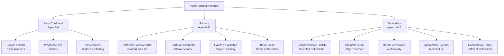
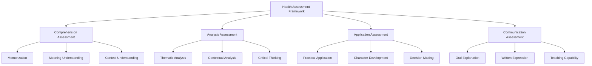

# Hadith Studies

**Document Title:** Hadith Studies
**Document ID:** IS_006
**Version:** 1.0
**Date:** 2026-01-11
**Project Name:** Smart Academy Digital Web Portal Development
**Content Category:** Islamic Studies Content

---

## Table of Contents

1. [Overview](#1-overview)
2. [Learning Objectives](#2-learning-objectives)
3. [Curriculum Structure](#3-curriculum-structure)
4. [Teaching Methodology](#4-teaching-methodology)
5. [Assessment & Evaluation](#5-assessment--evaluation)
6. [Resources & Materials](#6-resources--materials)
7. [Integration with Other Subjects](#7-integration-with-other-subjects)
8. [Parent Engagement](#8-parent-engagement)
9. [Technology Integration](#9-technology-integration)
10. [FAQs](#10-faqs)

---

## 1. Overview

The Hadith Studies program at Smart Academy is designed to introduce students to the sayings, actions, and approvals of Prophet Muhammad (PBUH), which serve as the second most important source of Islamic guidance after the Quran. Hadith (plural: Ahadith) provides detailed explanations of Quranic teachings and practical examples of how the Prophet (PBUH) implemented Islam in his daily life. Our program guides students from basic understanding of simple Ahadith to comprehensive study of authentic Hadith collections.

### 1.1 Philosophy

The Hadith program is founded on these fundamental principles:

- **Prophetic Guidance**: Hadith is the practical explanation of the Quran. The Prophet (PBUH) said: "I have been given the Quran and something similar to it along with it." (Sunan Abu Dawud, Book 42, Hadith 4604)

- **Authenticity**: Only authentic Ahadith (Sahih) are taught to ensure students receive reliable guidance. The Prophet (PBUH) said: "Convey from me, even if it is one verse." (Sahih Bukhari, Book 73, Hadith 173)

- **Practical Application**: Hadith is not merely theoretical knowledge; it must be implemented in daily life. The Prophet (PBUH) was described as "a walking Quran" by Aisha (RA).

- **Love and Reverence**: Learning Hadith fosters love and reverence for the Prophet (PBUH). Allah (SWT) states in Quran 33:21: "There has certainly been for you in the Messenger of Allah an excellent pattern."

- **Chain of Transmission**: Understanding the Isnad (chain of narrators) is essential for verifying the authenticity of Hadith.

### 1.2 Goals

The Hadith program aims to achieve the following goals:

1. **Hadith Knowledge**: Enable students to learn and understand authentic Ahadith at an appropriate level for their age and development.

2. **Prophetic Biography**: Help students understand the life and character of the Prophet (PBUH) through his sayings and actions.

3. **Practical Implementation**: Guide students to apply Hadith teachings in their daily lives, character, and decision-making.

4. **Authenticity Understanding**: Teach students the importance of authentic Hadith and the basics of Hadith verification.

5. **Love for Prophet**: Foster love and reverence for the Prophet (PBUH) through learning his teachings.

6. **Critical Thinking**: Develop students' ability to reflect on and analyze Hadith meanings.

7. **Teaching Capability**: Prepare students to explain Hadith teachings to others.

8. **Integration**: Connect Hadith with Quran, other Islamic studies, and academic subjects.

### 1.3 Program Structure

The Hadith program progresses through three developmental levels:

---

## 2. Learning Objectives

### 2.1 Knowledge Objectives

By the end of each level, students will demonstrate knowledge of:

#### Early Childhood (Ages 3-6)
- Simple Ahadith about basic manners and character
- Stories about the Prophet (PBUH) from Ahadith
- Basic Islamic values from Hadith (kindness, sharing, respect)
- Simple Duas from Hadith
- Basic understanding of the Prophet's love for children

#### Primary (Ages 6-11)
- Selected Sahih Ahadith from Sahih Bukhari and Sahih Muslim
- Hadith on Islamic character and values
- Hadith on worship (prayer, fasting, charity)
- Basic understanding of Isnad (chain of narrators)
- Hadith on daily life and manners
- Stories from Hadith about the Prophet's life

#### Secondary (Ages 11-16)
- Comprehensive study of selected authentic Hadith collections
- Thematic study of major Hadith themes
- Understanding of Hadith verification and authenticity
- Different categories of Hadith (Sahih, Hasan, Da'if)
- Application of Hadith to contemporary issues
- Comparative study of different Hadith collections
- Understanding of Hadith methodology

### 2.2 Skills Objectives

Students will develop the following Hadith-specific skills:

#### Comprehension Skills
- **Vocabulary**: Understanding key Arabic words in Hadith
- **Meaning**: Grasping the meaning of Hadith text (Matn)
- **Context**: Understanding the context of Hadith
- **Connection**: Understanding the connection between Hadith and Quran

#### Analysis Skills
- **Thematic Analysis**: Identifying and analyzing Hadith themes
- **Contextual Analysis**: Understanding Hadith in proper context
- **Authenticity Assessment**: Basic understanding of Hadith verification
- **Critical Thinking**: Reflecting on and analyzing Hadith meanings

#### Application Skills
- **Practical Application**: Applying Hadith teachings to daily life
- **Character Development**: Using Hadith for character building
- **Decision Making**: Using Hadith guidance for decision making
- **Communication**: Explaining Hadith meanings to others

### 2.3 Character Objectives

Through Hadith studies, students will develop:

- **Love for Prophet (Hubb)**: Love and reverence for the Prophet (PBUH)
- **Following Sunnah (Ittiba')**: Following the Prophet's example
- **Reflection (Tafakkur)**: Deep contemplation on Hadith teachings
- **Implementation (Amal)**: Applying Hadith teachings in daily life
- **Humility (Tawadu)**: Humility before the Prophet's teachings
- **Wisdom (Hikmah)**: Wisdom derived from Hadith understanding
- **Patience (Sabr)**: Patience in following Sunnah
- **Gratitude (Shukr)**: Gratitude for the Prophet's guidance

---

## 3. Curriculum Structure

### 3.1 Level-Specific Curriculum

#### Early Childhood (Ages 3-6)

| Hadith | Source | Key Theme | Learning Focus |
|--------|--------|-----------|----------------|
| **"The strong person is not..."** | Sahih Bukhari | Strength | True strength is self-control |
| **"None of you truly believes..."** | Sahih Bukhari | Love | Love for others like oneself |
| **"The best among you..."** | Sahih Bukhari | Character | Best character is best Muslim |
| **"Cleanliness is part of faith"** | Sahih Muslim | Cleanliness | Importance of cleanliness |
| **"Smiling is charity"** | At-Tirmidhi | Kindness | Kindness in daily interactions |
| **"Paradise is under mothers' feet"** | An-Nasa'i | Respect | Respect for parents |
| **"The person who is perfect..."** | Sahih Muslim | Excellence | Striving for excellence |
| **"Actions are by intentions"** | Sahih Bukhari | Sincerity | Importance of intentions |
| **"The most complete of believers..."** | At-Tirmidhi | Character | Best character with others |
| **"Whoever believes in Allah..."** | Sahih Bukhari | Speech | Speaking good or remaining silent |

**Key Concepts**:
- Love for the Prophet (PBUH)
- Following his example (Sunnah)
- Kindness to others
- Respect for parents
- Cleanliness
- Good manners (Adab)

#### Primary (Ages 6-11)

##### Selected Sahih Ahadith

| Hadith | Source | Key Theme | Learning Focus |
|--------|--------|-----------|----------------|
| **"Actions are but by intentions"** | Sahih Bukhari, Book 1, Hadith 1 | Intention | Importance of sincerity |
| **"Islam is built on five..."** | Sahih Muslim, Book 1, Hadith 19 | Pillars of Islam | Five pillars of Islam |
| **"The best of you is the one who learns Quran and teaches it"** | Sahih Bukhari, Book 61, Hadith 545 | Quran | Value of Quran |
| **"None of you truly believes until he loves for his brother what he loves for himself"** | Sahih Bukhari, Book 2, Hadith 12 | Brotherhood | Love for others |
| **"The strong person is not the one who wrestles..."** | Sahih Bukhari, Book 73, Hadith 177 | Self-control | True strength |
| **"Cleanliness is half of faith"** | Sahih Muslim, Book 2, Hadith 432 | Cleanliness | Importance of cleanliness |
| **"The most complete of believers in faith is the one with best character"** | At-Tirmidhi, Book 1, Hadith 1162 | Character | Importance of character |
| **"Paradise is at the feet of mothers"** | An-Nasa'i, Book 6, Hadith 3104 | Parents | Respect for parents |
| **"Whoever believes in Allah and the Last Day should speak good or remain silent"** | Sahih Bukhari, Book 73, Hadith 47 | Speech | Controlling speech |
| **"The person who is perfect in Islam is the one whose character is perfect"** | Sahih Muslim, Book 1, Hadith 46 | Character | Perfecting character |
| **"The most beloved deeds to Allah are those that are consistent..."** | Sahih Bukhari, Book 76, Hadith 646 | Consistency | Value of consistency |
| **"The world is a prison for the believer..."** | Sahih Muslim, Book 52, Hadith 7058 | Worldly life | Focus on Akhirah |
| **"The best among you are those who have the best manners and character"** | Sahih Bukhari, Book 73, Hadith 61 | Character | Best character |
| **"Allah is beautiful and loves beauty"** | Sahih Muslim, Book 37, Hadith 91 | Beauty | Appreciating beauty |
| **"The strong person is not the good wrestler..."** | Sahih Bukhari, Book 73, Hadith 177 | Strength | Controlling anger |
| **"The person who recites the Quran and is fluent in it..."** | Sahih Bukhari, Book 65, Hadith 4937 | Quran | Value of Quran |
| **"The most complete of believers in faith is the one with best character"** | At-Tirmidhi, Book 1, Hadith 1162 | Character | Best character |
| **"The person who is perfect in Islam is the one from whose tongue and hand Muslims are safe"** | Sahih Bukhari, Book 2, Hadith 10 | Safety | Not harming others |
| **"The world is cursed and everything in it..."** | Sahih Muslim, Book 52, Hadith 7058 | Worldly life | Detachment from world |
| **"The best of people is the one most beneficial to people"** | Al-Mu'jam Al-Awsat, Book 1, Hadith 5789 | Service | Serving others |

##### Hadith on Worship

| Hadith | Source | Key Theme | Learning Focus |
|--------|--------|-----------|----------------|
| **"Prayer is the pillar of religion"** | At-Tirmidhi | Prayer | Importance of prayer |
| **"Fasting is a shield..."** | Sahih Bukhari | Fasting | Benefits of fasting |
| **"Charity does not decrease wealth"** | Sahih Muslim | Charity | Benefits of charity |
| **"Hajj is the Jihad of every weak person"** | Sunan an-Nasa'i | Hajj | Importance of Hajj |
| **"The most beloved deed to Allah is prayer at its proper time"** | Sahih Bukhari | Prayer | Timely prayer |

##### Hadith on Character

| Hadith | Source | Key Theme | Learning Focus |
|--------|--------|-----------|----------------|
| **"The most complete of believers in faith is the one with best character"** | At-Tirmidhi | Character | Importance of character |
| **"A believer is not a slanderer, curser, or one who uses obscene language"** | At-Tirmidhi | Speech | Good speech |
| **"The strong person is not the good wrestler..."** | Sahih Bukhari | Self-control | Controlling anger |
| **"None of you truly believes until he loves for his brother what he loves for himself"** | Sahih Bukhari | Brotherhood | Love for others |
| **"The person who is perfect in Islam is the one from whose tongue and hand Muslims are safe"** | Sahih Bukhari | Safety | Not harming others |

#### Secondary (Ages 11-16)

##### Comprehensive Hadith Study

| Category | Selected Hadith | Source | Key Theme |
|----------|----------------|--------|-----------|
| **Iman (Faith)** | "Actions are but by intentions" | Sahih Bukhari 1:1 | Sincerity |
| **Iman (Faith)** | "Islam is built on five" | Sahih Muslim 1:19 | Pillars of Islam |
| **Ilm (Knowledge)** | "Seeking knowledge is obligatory on every Muslim" | Ibn Majah | Value of knowledge |
| **Ilm (Knowledge)** | "The best of you is the one who learns Quran and teaches it" | Sahih Bukhari 61:545 | Quran |
| **Akhlq (Character)** | "The most complete of believers in faith is the one with best character" | At-Tirmidhi 1:1162 | Character |
| **Akhlq (Character)** | "The best among you are those who have the best manners and character" | Sahih Bukhari 73:61 | Character |
| **Akhlq (Character)** | "A believer is not a slanderer, curser, or one who uses obscene language" | At-Tirmidhi | Speech |
| **Akhlq (Character)** | "The person who is perfect in Islam is the one from whose tongue and hand Muslims are safe" | Sahih Bukhari 2:10 | Safety |
| **Ibadah (Worship)** | "Prayer is the pillar of religion" | At-Tirmidhi | Prayer |
| **Ibadah (Worship)** | "The most beloved deed to Allah is prayer at its proper time" | Sahih Bukhari | Prayer |
| **Ibadah (Worship)** | "Fasting is a shield" | Sahih Bukhari | Fasting |
| **Ibadah (Worship)** | "Charity does not decrease wealth" | Sahih Muslim | Charity |
| **Mu'amalah (Transactions)** | "The Muslim is the one from whose tongue and hand Muslims are safe" | Sahih Bukhari | Safety |
| **Mu'amalah (Transactions)** | "None of you truly believes until he loves for his brother what he loves for himself" | Sahih Bukhari | Brotherhood |
| **Mu'amalah (Transactions)** | "The strong person is not the good wrestler" | Sahih Bukhari | Self-control |
| **Family** | "Paradise is at the feet of mothers" | An-Nasa'i | Parents |
| **Family** | "The best of you is the one who is best to his family" | At-Tirmidhi | Family |
| **Society** | "The best of people is the one most beneficial to people" | Al-Mu'jam Al-Awsat | Service |
| **Society** | "The believer does not hate his believing wife" | Sahih Bukhari | Marriage |
| **Worldly Life** | "The world is a prison for the believer" | Sahih Muslim | Akhirah |
| **Worldly Life** | "The world is cursed and everything in it" | Sahih Muslim | Detachment |

##### Thematic Study

| Theme | Selected Hadith | Learning Focus |
|-------|----------------|----------------|
| **Sincerity (Ikhlas)** | "Actions are but by intentions" | Importance of intentions |
| **Character (Akhlq)** | "The most complete of believers in faith is the one with best character" | Perfecting character |
| **Knowledge (Ilm)** | "The best of you is the one who learns Quran and teaches it" | Value of knowledge |
| **Worship (Ibadah)** | "Prayer is the pillar of religion" | Importance of worship |
| **Brotherhood (Ukhuwwah)** | "None of you truly believes until he loves for his brother what he loves for himself" | Love for others |
| **Self-Control (Hilm)** | "The strong person is not the good wrestler" | Controlling anger |
| **Service (Khidmah)** | "The best of people is the one most beneficial to people" | Serving others |
| **Family (Usrah)** | "Paradise is at the feet of mothers" | Respect for parents |
| **Speech (Kalam)** | "Whoever believes in Allah and the Last Day should speak good or remain silent" | Controlling speech |
| **Akhirah (Hereafter)** | "The world is a prison for the believer" | Focus on Akhirah |

### 3.2 Hadith Sources

#### Primary Hadith Collections

| Collection | Compiler | Number of Hadith | Characteristics |
|------------|-----------|------------------|------------------|
| **Sahih Bukhari** | Imam Bukhari | 7,563 (selected) | Most authentic after Quran |
| **Sahih Muslim** | Imam Muslim | 7,190 (selected) | Second most authentic |
| **Sunan Abu Dawud** | Imam Abu Dawud | 5,274 | Focus on Fiqh |
| **Jami' at-Tirmidhi** | Imam at-Tirmidhi | 3,956 | Includes Hasan Ahadith |
| **Sunan an-Nasa'i** | Imam an-Nasa'i | 5,758 | Focus on Fiqh |
| **Sunan Ibn Majah** | Imam Ibn Majah | 4,341 | Comprehensive |

#### Hadith Categories

| Category | Meaning | Criteria |
|----------|---------|-----------|
| **Sahih** | Authentic | Uninterrupted chain, trustworthy narrators, no contradiction |
| **Hasan** | Good | Slightly weaker chain than Sahih but still reliable |
| **Da'if** | Weak | Defects in chain or narrators |
| **Mawdu'** | Fabricated | False attribution to Prophet (PBUH) |
| **Mutawatir** | Mass-transmitted | Narrated by many people, impossible to fabricate |
| **Ahad** | Isolated | Narrated by one or few people |

### 3.3 Isnad (Chain of Narrators)

#### Components of Hadith

| Component | Arabic | Meaning |
|-----------|---------|---------|
| **Isnad** | الإسناد | Chain of narrators |
| **Matn** | المتن | Text of Hadith |
| **Rawi** | الراوي | Narrator |
| **Tabaqah** | الطبقة | Generation of narrators |

#### Famous Narrators

| Narrator | Title | Contribution |
|----------|-------|-------------|
| **Abu Hurairah** | Sayyid al-Muhaddithin | Narrated most Ahadith (5,374) |
| **Aisha** | Mother of Believers | Narrated 2,210 Ahadith |
| **Abdullah ibn Umar** | Narrated 2,630 Ahadith | Important narrator |
| **Anas ibn Malik** | Narrated 2,286 Ahadith | Served Prophet for 10 years |
| **Abdullah ibn Abbas** | Narrated 1,660 Ahadith | Cousin of Prophet |

---

## 4. Teaching Methodology

### 4.1 Pedagogical Approach

The Hadith program employs a combination of traditional and modern teaching methods:

#### Traditional Methods
- **Memorization**: Memorizing important Ahadith
- **Storytelling**: Using stories from Hadith to make lessons engaging
- **Discussion**: Class discussions about Hadith meanings and applications
- **Modeling**: Teachers demonstrate implementation of Hadith teachings

#### Modern Methods
- **Interactive Learning**: Use of smart boards, tablets, and multimedia resources
- **Project-Based Learning**: Projects that connect Hadith to real life
- **Critical Thinking**: Encouraging students to reflect and analyze
- **Differentiated Instruction**: Adapting content to different learning levels

### 4.2 Teaching Strategies

#### For Early Childhood (3-6)

| Strategy | Description | Example |
|----------|-------------|---------|
| **Storytelling** | Simple stories from Hadith | Stories of Prophet's kindness |
| **Visual Learning** | Pictures and illustrations | Pictures of Prophet's actions |
| **Repetition** | Repeating key Ahadith | Repeating "Cleanliness is part of faith" |
| **Songs and Rhymes** | Islamic songs about Hadith | Songs about kindness |
| **Play-Based Learning** | Games and activities | Role-playing Hadith teachings |
| **Modeling** | Teachers demonstrate Islamic behavior | Teachers showing kindness |

#### For Primary (6-11)

| Strategy | Description | Example |
|----------|-------------|---------|
| **Interactive Discussion** | Class discussions about Hadith meanings | Discussing lessons from Hadith |
| **Memorization** | Memorizing selected Ahadith | Memorizing "Actions are by intentions" |
| **Story Analysis** | Analyzing stories from Hadith | Discussing lessons from Prophet's stories |
| **Thematic Study** | Studying major themes | Studying character from Hadith |
| **Application Activities** | Applying Hadith to daily life | Role-playing Islamic manners |
| **Group Work** | Collaborative activities | Group projects on Hadith themes |

#### For Secondary (11-16)

| Strategy | Description | Example |
|----------|-------------|---------|
| **Critical Analysis** | Deep examination of Hadith | Analyzing Hadith themes |
| **Research Projects** | Independent research on Hadith topics | Research on Hadith verification |
| **Debate and Discussion** | Structured debates on Hadith issues | Discussing contemporary issues from Hadith perspective |
| **Comparative Study** | Comparing different Hadith collections | Comparing Bukhari and Muslim |
| **Application Projects** | Applying Hadith to modern life | Creating guides for Islamic lifestyle |
| **Teaching Practice** | Students teaching younger students | Peer tutoring in Hadith |

### 4.3 Classroom Environment

The Hadith classroom is designed to be:

- **Spiritually Uplifting**: Clean, organized, with Hadith verses displayed
- **Interactive**: Encouraging student participation and engagement
- **Respectful**: Environment of reverence for the Prophet's teachings
- **Technology-Enhanced**: Smart boards, tablets, and digital resources
- **Comfortable**: Appropriate seating for extended discussions
- **Inclusive**: Welcoming to students from all backgrounds

---

## 5. Assessment & Evaluation

### 5.1 Assessment Framework

### 5.2 Assessment Methods

#### Comprehension Assessment

| Criteria | Description | Scoring |
|----------|-------------|---------|
| **Memorization** | Memorization of selected Ahadith | 0-20 points |
| **Meaning** | Understanding of Hadith meanings | 0-40 points |
| **Context** | Understanding of Hadith context | 0-20 points |
| **Vocabulary** | Understanding key Arabic words | 0-20 points |

**Scoring Rubric**:
- **Excellent (90-100)**: Deep understanding of all aspects
- **Very Good (80-89)**: Strong understanding with minor gaps
- **Good (70-79)**: Good understanding with some gaps
- **Satisfactory (60-69)**: Basic understanding with notable gaps
- **Needs Improvement (Below 60)**: Limited understanding

#### Analysis Assessment

| Criteria | Description | Scoring |
|----------|-------------|---------|
| **Thematic Analysis** | Ability to identify and analyze themes | 0-30 points |
| **Contextual Analysis** | Ability to understand context | 0-30 points |
| **Critical Thinking** | Ability to reflect and analyze | 0-40 points |

**Scoring Rubric**:
- **Excellent (90-100)**: Excellent analytical skills
- **Very Good (80-89)**: Strong analytical skills
- **Good (70-79)**: Good analytical skills
- **Satisfactory (60-69)**: Basic analytical skills
- **Needs Improvement (Below 60)**: Limited analytical skills

#### Application Assessment

| Criteria | Description | Scoring |
|----------|-------------|---------|
| **Practical Application** | Ability to apply Hadith to daily life | 0-40 points |
| **Character Development** | Evidence of character development | 0-30 points |
| **Decision Making** | Using Hadith guidance for decisions | 0-30 points |

**Scoring Rubric**:
- **Excellent (90-100)**: Excellent application of teachings
- **Very Good (80-89)**: Strong application of teachings
- **Good (70-79)**: Good application of teachings
- **Satisfactory (60-69)**: Basic application of teachings
- **Needs Improvement (Below 60)**: Limited application of teachings

#### Communication Assessment

| Criteria | Description | Scoring |
|----------|-------------|---------|
| **Oral Explanation** | Ability to explain Hadith orally | 0-30 points |
| **Written Expression** | Ability to express understanding in writing | 0-30 points |
| **Teaching Capability** | Ability to teach Hadith to others | 0-40 points |

**Scoring Rubric**:
- **Excellent (90-100)**: Excellent communication skills
- **Very Good (80-89)**: Strong communication skills
- **Good (70-79)**: Good communication skills
- **Satisfactory (60-69)**: Basic communication skills
- **Needs Improvement (Below 60)**: Limited communication skills

### 5.3 Level-Based Assessment

#### Early Childhood Assessment

| Component | Criteria | Passing Score |
|-----------|----------|----------------|
| **Simple Ahadith** | Understanding of simple Ahadith | 70% |
| **Stories** | Recall of simple stories | 70% |
| **Key Concepts** | Understanding of key concepts | 70% |

#### Primary Assessment

| Component | Criteria | Passing Score |
|-----------|----------|----------------|
| **Selected Ahadith** | Understanding of selected Ahadith | 75% |
| **Themes** | Understanding of major themes | 75% |
| **Memorization** | Memorization of key Ahadith | 70% |
| **Application** | Application to daily life | 70% |

#### Secondary Assessment

| Component | Criteria | Passing Score |
|-----------|----------|----------------|
| **Comprehensive Hadith** | Understanding of selected Ahadith | 80% |
| **Thematic Analysis** | Analysis of major themes | 75% |
| **Contextual Understanding** | Understanding of Hadith context | 75% |
| **Application** | Application to modern life | 75% |
| **Communication** | Ability to explain Hadith | 70% |

### 5.4 Progress Tracking

Each student maintains a Hadith Progress Portfolio including:

- **Comprehension Record**: Record of comprehension assessments
- **Analysis Record**: Record of analytical work
- **Application Record**: Record of practical applications
- **Communication Record**: Record of oral and written explanations
- **Achievement Certificates**: Recognition of level completion
- **Teacher Feedback**: Regular feedback from Hadith teachers

---

## 6. Resources & Materials

### 6.1 Primary Textbooks

#### Hadith Collections
- **Sahih Al-Bukhari**: Complete collection with translation
- **Sahih Muslim**: Complete collection with translation
- **Riyad as-Salihin**: Collection of authentic Ahadith by Imam an-Nawawi
- **Forty Hadith**: An-Nawawi's Forty Hadith with commentary

#### Hadith Study Books
- **Introduction to Hadith Studies**: Basic introduction to Hadith science
- **Hadith Methodology**: Understanding Hadith verification
- **Hadith Commentary**: Explanations of selected Ahadith

### 6.2 Digital Resources

#### Hadith Applications
- **Sunnah.com**: Online Hadith database with search
- **Hadith Collection**: Mobile app for Hadith study
- **Sahih Bukhari Online**: Digital version of Sahih Bukhari
- **Sahih Muslim Online**: Digital version of Sahih Muslim

#### Quran Applications
- **Quran.com**: Online Quran with Hadith references
- **Quran Explorer**: Hadith references for Quranic verses

### 6.3 Audio and Video Resources

#### Video Resources
- **Hadith Lectures**: Video lectures by renowned scholars
- **Hadith Stories**: Animated stories from Hadith
- **Hadith Explanation**: Video explanations of Ahadith

#### Audio Resources
- **Hadith Audio**: Audio explanations of Ahadith
- **Hadith Lectures**: Lectures on Hadith topics
- **Podcasts**: Islamic podcasts on Hadith topics

### 6.4 Supplementary Materials

#### Teaching Aids
- **Flashcards**: Hadith text, key concepts
- **Posters**: Hadith verses, themes
- **Charts**: Hadith themes, concepts
- **Visual Aids**: Pictures and illustrations for Hadith stories

#### Assessment Tools
- **Rubrics**: Detailed criteria for assessment
- **Checklists**: Progress tracking for Hadith skills
- **Portfolios**: Student work samples and achievements
- **Progress Reports**: Regular communication with parents

---

## 7. Integration with Other Subjects

### 7.1 Re-STEAM Integration

The Hadith program integrates with STEAM subjects through the Re-STEAM framework:

#### Science Integration

| Hadith Concept | Science Connection | Example Activities |
|----------------|-------------------|-------------------|
| Medicine | Health Science | Study of Prophetic medicine |
| Hygiene | Health Science | Study of cleanliness from Hadith |
| Nutrition | Health Science | Study of dietary guidance from Hadith |

#### Technology Integration

| Hadith Concept | Technology Connection | Example Activities |
|----------------|-------------------|-------------------|
| Preservation of Hadith | Information Technology | Study how Hadith was preserved |
| Hadith Apps | Digital Technology | Use apps for Hadith study |
| Online Resources | Internet Technology | Accessing Hadith resources online |

#### Arts Integration

| Hadith Concept | Arts Connection | Example Activities |
|----------------|----------------|-------------------|
| Calligraphy | Visual Arts | Learning Arabic calligraphy with Hadith |
| Nasheeds | Performing Arts | Islamic songs about Hadith |
| Storytelling | Language Arts | Creative writing based on Hadith |

#### Mathematics Integration

| Hadith Concept | Mathematics Connection | Example Activities |
|----------------|-------------------|-------------------|
| Charity Calculations | Applied Mathematics | Calculate Zakat amounts |
| Time Management | Time Management | Study Hadith on time management |

### 7.2 Cross-Curricular Projects

Students engage in projects that integrate Hadith with other subjects:

- **Hadith Science Fair**: Projects on Prophetic medicine and health
- **Islamic Art Exhibition**: Student artwork reflecting Hadith themes
- **Hadith Poetry**: Creative writing based on Hadith
- **Community Service**: Applying Hadith teachings through service
- **Teaching Projects**: Teaching Hadith to younger students

---

## 8. Parent Engagement

### 8.1 Home-School Partnership

Parents play a crucial role in supporting their children's Hadith learning:

#### Regular Communication
- **Monthly Hadith Progress Reports**: Detailed updates on Hadith progress
- **Parent-Teacher Conferences**: Regular meetings to discuss Hadith progress
- **Digital Communication**: WhatsApp groups and email for ongoing support
- **Hadith Workshops**: Workshops on supporting children's Hadith learning at home

#### Home Support Resources
- **Daily Hadith Discussion**: Guide for discussing Hadith at home
- **Family Hadith Time**: Guide for family Hadith reading together
- **Application Guides**: Applying Hadith teachings to family life

### 8.2 Parent Involvement Opportunities

Parents are encouraged to:

- **Discuss Hadith**: Daily discussion about Hadith lessons
- **Read Together**: Reading Hadith together as a family
- **Attend Hadith Events**: Participate in Hadith competitions and celebrations
- **Model Behavior**: Demonstrate implementation of Hadith in daily life

### 8.3 Monitoring Progress at Home

Parents can support Hadith learning by:

- **Daily Discussion**: Discussing Hadith lessons learned
- **Application**: Helping children apply Hadith to daily life
- **Positive Reinforcement**: Encouraging and praising progress
- **Creating Environment**: Establishing an Islamic environment at home
- **Consistency**: Maintaining regularity in Hadith study

---

## 9. Technology Integration

### 9.1 Digital Learning Tools

The Hadith program incorporates technology to enhance learning:

#### Hadith Learning Apps
- **Hadith Apps**: Mobile apps for Hadith study
- **Online Hadith**: Digital Hadith resources
- **Hadith with Commentary**: Apps with Hadith and commentary

#### Classroom Technology
- **Smart Boards**: Interactive displays for Hadith content
- **Tablets**: Individual devices for personalized Hadith learning
- **Projectors**: Displaying Hadith content and videos
- **Audio Systems**: High-quality audio for Hadith lectures

#### Learning Management System
- **Gibbon Integration**: Digital platform for Hadith resources
- **Progress Tracking**: Online tracking of Hadith progress
- **Resource Sharing**: Digital library of Hadith materials
- **Assessment Tools**: Online quizzes and assessments

### 9.2 Technology for Hadith Program

The Hadith program uses specialized technology:

- **Hadith Apps**: Mobile apps for Hadith study and reference
- **Online Resources**: Access to Hadith libraries and lectures
- **Digital Libraries**: Comprehensive digital Hadith resources

### 9.3 Online Hadith Resources

Students and parents have access to:

- **Online Hadith Libraries**: Comprehensive Hadith resources
- **Hadith Video Lectures**: Access to renowned Hadith scholars
- **Interactive Learning**: Online courses and tutorials
- **Hadith Communities**: Online forums for discussion and support

---

## 10. FAQs

### General Questions

**Q: What is Hadith?**

A: Hadith is the collection of sayings, actions, approvals, and descriptions of Prophet Muhammad (PBUH). It serves as the second most important source of Islamic guidance after the Quran, providing detailed explanations of Quranic teachings and practical examples of how the Prophet (PBUH) implemented Islam.

**Q: Why is Hadith important?**

A: Hadith is important because:
- It provides detailed explanation of Quranic teachings
- It shows practical implementation of Islam
- It guides daily life and character development
- It fosters love and reverence for the Prophet (PBUH)
- It complements and completes Quranic guidance

**Q: At what age do students start learning Hadith?**

A: Students start learning basic Hadith concepts from Early Childhood (ages 3-6) with simple Ahadith about manners and character. Formal Hadith study begins in Primary level (ages 6-11) with selected Sahih Ahadith from Bukhari and Muslim.

### Curriculum Questions

**Q: What Ahadith are studied in the program?**

A: Hadith study includes:
- Early Childhood: Simple Ahadith about manners and character
- Primary: Selected Sahih Ahadith from Bukhari and Muslim
- Secondary: Comprehensive study of authentic Hadith collections

**Q: What are the main Hadith collections?**

A: The main Hadith collections are:
- Sahih Bukhari: Most authentic collection
- Sahih Muslim: Second most authentic collection
- Sunan Abu Dawud: Focus on Fiqh
- Jami' at-Tirmidhi: Includes Hasan Ahadith
- Sunan an-Nasa'i: Focus on Fiqh
- Sunan Ibn Majah: Comprehensive collection

**Q: What are the categories of Hadith?**

A: The main categories of Hadith are:
- Sahih: Authentic
- Hasan: Good
- Da'if: Weak
- Mawdu': Fabricated
- Mutawatir: Mass-transmitted
- Ahad: Isolated

### Assessment Questions

**Q: How is Hadith assessed?**

A: Hadith is assessed based on:
- Comprehension (memorization, meaning, context, vocabulary)
- Analysis (thematic, contextual, critical thinking)
- Application (practical application, character development, decision making)
- Communication (oral explanation, written expression, teaching capability)

**Q: What happens if a student struggles with Hadith?**

A: We provide individualized support:
- One-on-one tutoring with Hadith teachers
- Additional resources and materials
- Simplified explanations for complex concepts
- Encouragement and motivation
- Parent involvement in home study

### Parent Questions

**Q: How can I support my child's Hadith learning at home?**

A: Parents can support by:
- Discussing Hadith lessons learned
- Reading Hadith together as a family
- Helping children apply Hadith to daily life
- Creating an Islamic environment at home
- Encouraging questions and discussions about Hadith
- Attending Hadith workshops

**Q: Do I need to know Arabic to help my child with Hadith?**

A: No prior Arabic knowledge is required. We provide:
- Translations in English and Bengali
- Parent workshops on Hadith topics
- Home study guides with explanations
- Regular communication with teachers

### Technology Questions

**Q: What technology tools are used in Hadith learning?**

A: Technology integration includes:
- Hadith learning apps
- Smart boards for interactive lessons
- Online resources and digital libraries
- Progress tracking systems

**Q: Is technology used instead of traditional methods?**

A: No, technology is used as a supplement to traditional methods:
- Face-to-face instruction remains primary
- Traditional methods of Hadith study are maintained
- Technology enhances but does not replace traditional learning
- Balance is maintained between digital and traditional methods

---

## Document Approval

| Role | Name | Signature | Date |
|------|------|-----------|------|
| Islamic Studies Coordinator | | _________________ | ________ |
| Principal | | _________________ | ________ |
