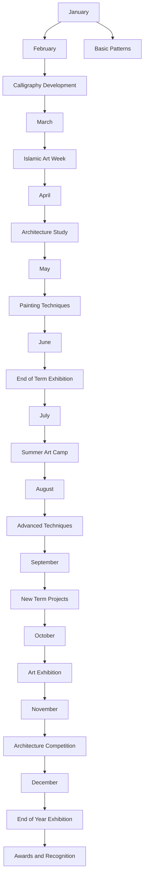

# Islamic Arts and Calligraphy Program

**Document Title:** Islamic Arts and Calligraphy Program
**Document ID:** IS_IAC_008
**Version:** 1.0
**Date:** 2026-01-11
**Project Name:** Smart Academy Digital Web Portal Development
**Content Category:** Islamic Studies Content

---

## Table of Contents

1. [Overview](#1-overview)
2. [Program Objectives](#2-program-objectives)
3. [Program Structure](#3-program-structure)
4. [Activities & Events](#4-activities--events)
5. [Schedule & Timing](#5-schedule--timing)
6. [Participation & Eligibility](#6-participation--eligibility)
7. [Resources & Materials](#7-resources--materials)
8. [Assessment & Recognition](#8-assessment--recognition)
9. [Parent Engagement](#9-parent-engagement)
10. [FAQs](#10-faqs)

---

## 1. Overview

The Islamic Arts and Calligraphy Program at Smart Academy provides students with opportunities to explore and create beautiful Islamic art forms including Arabic calligraphy, geometric patterns, Islamic architecture appreciation, and digital Islamic art. This program fosters artistic expression within Islamic guidelines while developing appreciation for Islamic artistic heritage.

### 1.1 Philosophy

Islamic art is a beautiful expression of faith and culture:

> "Allah is Beautiful and loves beauty." - Sahih Muslim, Book 1, Hadith 91

The Prophet Muhammad (peace be upon him) said:

> "Indeed, Allah has enjoined excellence (Ihsan) in all things." - Sahih Muslim, Book 1, Hadith 1955

Islamic art historically has served as a means to:

- Express devotion to Allah through beauty
- Preserve and transmit Islamic knowledge
- Create spaces of spiritual reflection
- Develop appreciation for Allah's creation

### 1.2 Goals

- **Artistic Goals**: Develop skills in various Islamic art forms
- **Cultural Goals**: Appreciate and preserve Islamic artistic heritage
- **Spiritual Goals**: Express devotion through artistic creation
- **Educational Goals**: Learn about Islamic art history and significance
- **Character Goals**: Develop patience, precision, and artistic discipline

---

## 2. Program Objectives

### 2.1 Knowledge Objectives

By the end of the program, students will be able to:

- Understand the significance and history of Islamic art
- Identify different styles of Arabic calligraphy
- Recognize Islamic geometric patterns and their meanings
- Appreciate Islamic architecture and its features
- Understand the principles of Islamic art (aniconism, geometry, calligraphy)
- Learn about famous Islamic artists and their contributions
- Understand the connection between art and Islamic spirituality

### 2.2 Skill Objectives

Students will demonstrate proficiency in:

- Writing Arabic calligraphy in different styles
- Creating Islamic geometric patterns
- Designing Islamic art projects
- Using various art media and techniques
- Appreciating and analyzing Islamic art
- Creating digital Islamic art (advanced levels)

### 2.3 Character Objectives

Students will develop:

- **Sabr (Patience)**: Developing patience through detailed art work
- **Ihsan (Excellence)**: Striving for excellence in artistic creation
- **Tawadu (Humility)**: Remaining humble in artistic achievements
- **Shukr (Gratitude)**: Appreciating the gift of artistic ability
- **Adab (Respect)**: Showing respect for Islamic art traditions
- **Ikhlas (Sincerity)**: Creating art for Allah's pleasure
- **Creativity**: Expressing Islamic values through creativity

### 2.4 Re-STEAM Integration

- **Science Connection**: Understanding the mathematics and geometry in Islamic patterns
- **Technology Connection**: Using digital tools for Islamic art creation
- **Mathematics Connection**: Applying mathematical principles to geometric patterns
- **Arts Connection**: Expressing Islamic values through various art forms
- **Engineering Connection**: Understanding the engineering in Islamic architecture

---

## 3. Program Structure

### 3.1 Islamic Art Forms Overview

The program includes five main areas of Islamic art:

```mermaid
graph TD
    A[Islamic Arts Program] --> B[Arabic Calligraphy]
    A --> C[Geometric Patterns]
    A --> D[Islamic Architecture]
    A --> E[Islamic Painting]
    A --> F[Digital Islamic Art]
    
    B --> B1[Thuluth Script]
    B --> B2[Naskh Script]
    B --> B3[Diwani Script]
    B --> B4[Kufic Script]
    
    C --> C1[Star Patterns]
    C --> C2[Interlacing Patterns]
    C --> C3[Tessellations]
    C --> C4[Arabesque]
    
    D --> D1[Mosque Architecture]
    D --> D2[Islamic Palaces]
    D --> D3[Madrasas]
    D --> D4[Islamic Gardens]
    
    E --> E1[Miniature Painting]
    E --> E2[Illumination]
    E --> E3[Manuscript Art]
    E --> E4[Decorative Arts]
    
    F --> F1[Digital Calligraphy]
    F --> F2[Digital Patterns]
    F --> F3[Vector Art]
    F --> F4[3D Islamic Art]
```

### 3.2 Curriculum by Level

#### Early Childhood (3-6 years)

| Art Form | Focus | Activities | Duration |
|----------|-------|------------|----------|
| **Arabic Calligraphy** | Basic Arabic letters | Tracing letters, simple words | 30 min |
| **Geometric Patterns** | Basic shapes | Coloring shapes, simple patterns | 30 min |
| **Islamic Architecture** | Basic recognition | Identifying mosques, domes | 30 min |
| **Islamic Painting** | Basic coloring | Coloring Islamic pictures | 30 min |
| **Digital Art** | Not applicable | - | - |

#### Primary Level (6-11 years)

| Art Form | Focus | Activities | Duration |
|----------|-------|------------|----------|
| **Arabic Calligraphy** | Basic scripts | Naskh script, simple words | 45 min |
| **Geometric Patterns** | Basic patterns | Creating star patterns, tessellations | 45 min |
| **Islamic Architecture** | Features and history | Learning mosque features, model making | 45 min |
| **Islamic Painting** | Basic techniques | Islamic motifs, illumination | 45 min |
| **Digital Art** | Introduction | Basic digital tools, simple designs | 45 min |

#### Secondary Level (11-16 years)

| Art Form | Focus | Activities | Duration |
|----------|-------|------------|----------|
| **Arabic Calligraphy** | Advanced scripts | Thuluth, Diwani, composition | 60 min |
| **Geometric Patterns** | Advanced patterns | Complex patterns, original designs | 60 min |
| **Islamic Architecture** | Advanced study | Detailed study, architectural design | 60 min |
| **Islamic Painting** | Advanced techniques | Miniature painting, advanced illumination | 60 min |
| **Digital Art** | Advanced techniques | Vector art, 3D design, animation | 60 min |

### 3.3 Calligraphy Styles

#### Major Calligraphy Styles

| Style | Characteristics | Use | Difficulty |
|-------|----------------|-----|------------|
| **Kufic** | Angular, geometric | Early Quran manuscripts, inscriptions | Advanced |
| **Naskh** | Rounded, clear | Quran printing, general writing | Beginner |
| **Thuluth** | Elegant, flowing | Titles, headings | Intermediate |
| **Diwani** | Curved, ornamental | Official documents, decorations | Advanced |
| **Riq'a** | Simple, practical | Everyday writing | Beginner |
| **Nasta'liq** | Diagonal, flowing | Persian poetry, Urdu | Advanced |

### 3.4 Program Components

#### Regular Art Classes

- **Weekly Art Sessions**: Regular art classes for each level
- **Skill Development**: Progressive skill building
- **Project Work**: Ongoing art projects
- **Art Appreciation**: Study of Islamic art history

#### Special Workshops

- **Calligraphy Workshops**: Specialized calligraphy training
- **Pattern Workshops**: Geometric pattern creation
- **Architecture Workshops**: Islamic architecture study
- **Digital Art Workshops**: Digital Islamic art creation

#### Art Exhibitions

- **School Exhibitions**: Regular displays of student art
- **Community Exhibitions**: Public displays of student work
- **Competitions**: Islamic art competitions
- **Art Fairs**: Special art fair events

---

## 4. Activities & Events

### 4.1 Regular Activities

#### Arabic Calligraphy

- **Basic Letter Practice**: Learning and practicing Arabic letters
- **Script Study**: Studying different calligraphy styles
- **Word Writing**: Writing Islamic words and phrases
- **Composition**: Creating calligraphic compositions
- **Advanced Techniques**: Advanced calligraphy techniques

#### Geometric Patterns

- **Basic Shapes**: Learning basic geometric shapes
- **Pattern Creation**: Creating Islamic geometric patterns
- **Tessellations**: Creating tessellating patterns
- **Star Patterns**: Creating Islamic star patterns
- **Original Designs**: Creating original pattern designs

#### Islamic Architecture

- **Architecture Study**: Studying Islamic architecture
- **Model Making**: Creating models of Islamic buildings
- **Drawing**: Drawing Islamic architectural features
- **Design**: Designing Islamic architectural elements
- **Field Trips**: Visiting Islamic architectural sites

#### Islamic Painting

- **Basic Techniques**: Learning basic painting techniques
- **Islamic Motifs**: Creating Islamic motifs and designs
- **Illumination**: Learning illumination techniques
- **Miniature Painting**: Creating miniature paintings
- **Manuscript Art**: Creating manuscript-style art

#### Digital Islamic Art

- **Digital Tools**: Learning digital art software
- **Digital Calligraphy**: Creating digital calligraphy
- **Digital Patterns**: Creating digital geometric patterns
- **Vector Art**: Creating vector Islamic art
- **3D Design**: Creating 3D Islamic art (advanced)

### 4.2 Special Events

#### Islamic Art Week

- **Theme**: "Beauty in Faith: Celebrating Islamic Art"
- **Activities**: Special workshops, exhibitions, competitions
- **Guest Artists**: Visiting Islamic artists
- **Art Exhibition**: Display of student art
- **Family Art Night**: Evening program with families

#### Calligraphy Competition

- **Categories**: Different calligraphy styles by age group
- **Judging**: Based on technique, beauty, and accuracy
- **Prizes**: Certificates, medals, and art supplies
- **Exhibition**: Display of competition entries
- **Awards Ceremony**: Recognition of winners

#### Islamic Art Exhibition

- **Scale**: Major school-wide exhibition
- **Participants**: All students display their art
- **Categories**: Various Islamic art categories
- **Judging**: Professional artists as judges
- **Community Event**: Open to parents and community

#### Architecture Model Competition

- **Focus**: Creating models of Islamic buildings
- **Categories**: Different building types and age groups
- **Judging**: Based on accuracy, creativity, and detail
- **Prizes**: Certificates and architectural kits
- **Exhibition**: Display of models

### 4.3 Workshops and Training

#### Calligraphy Workshops

- **Introduction to Calligraphy**: Basic calligraphy introduction
- **Script-Specific Workshops**: Workshops for specific scripts
- **Advanced Techniques**: Advanced calligraphy techniques
- **Composition Workshop**: Creating calligraphic compositions
- **Master Classes**: Classes with master calligraphers

#### Geometric Pattern Workshops

- **Basic Patterns**: Introduction to geometric patterns
- **Advanced Patterns**: Complex pattern creation
- **Original Design**: Creating original designs
- **Mathematical Principles**: Understanding the mathematics
- **Master Classes**: Classes with pattern experts

#### Digital Art Workshops

- **Introduction to Digital Art**: Basic digital art introduction
- **Software Training**: Training on specific software
- **Digital Calligraphy**: Creating digital calligraphy
- **Vector Art**: Creating vector Islamic art
- **3D Design**: Creating 3D Islamic art

### 4.4 Field Trips

#### Architecture Visits

- **Mosque Visits**: Visiting local mosques
- **Islamic Center Visits**: Visiting Islamic cultural centers
- **Museum Visits**: Visiting Islamic art museums
- **Historical Sites**: Visiting Islamic historical sites
- **Architectural Tours**: Guided architectural tours

#### Art Gallery Visits

- **Islamic Art Galleries**: Visiting Islamic art galleries
- **Contemporary Islamic Art**: Viewing contemporary Islamic art
- **Traditional Art**: Viewing traditional Islamic art
- **Artist Studios**: Visiting Islamic artist studios
- **Art Exhibitions**: Attending Islamic art exhibitions

---

## 5. Schedule & Timing

### 5.1 Weekly Schedule

| Day | Level | Time | Duration | Location |
|-----|-------|------|----------|----------|
| Monday | Early Childhood | 2:00 PM | 30 min | Art Room |
| Monday | Primary | 2:30 PM | 45 min | Art Room |
| Tuesday | Secondary | 2:00 PM | 60 min | Art Room |
| Wednesday | Early Childhood | 2:00 PM | 30 min | Art Room |
| Wednesday | Primary | 2:30 PM | 45 min | Art Room |
| Thursday | Secondary | 2:00 PM | 60 min | Art Room |
| Friday | All Levels | 1:30 PM | 90 min | Art Room |

### 5.2 Monthly Schedule

| Week | Focus | Activities |
|------|-------|------------|
| Week 1 | Calligraphy | Focus on Arabic calligraphy |
| Week 2 | Geometric Patterns | Focus on geometric patterns |
| Week 3 | Architecture | Focus on Islamic architecture |
| Week 4 | Painting/Digital Art | Focus on painting or digital art |

### 5.3 Annual Schedule

### 5.4 Class Structure

#### Standard Art Class (30-60 minutes depending on level)

| Time | Activity | Duration | Description |
|------|----------|----------|-------------|
| Start | Opening Du'a | 2 min | Begin with Du'a |
| Warm-up | Art Warm-up | 5 min | Quick art exercise |
| Instruction | New Technique | 10-15 min | Introduction of new technique |
| Practice | Guided Practice | 10-30 min | Practice with guidance |
| Project | Project Work | 5-15 min | Work on ongoing projects |
| Cleanup | Cleanup | 5 min | Clean up materials |
| Closing | Closing Du'a | 2 min | End with Du'a |

---

## 6. Participation & Eligibility

### 6.1 Membership Eligibility

#### General Requirements

- **Enrollment**: Must be enrolled student at Smart Academy
- **Interest**: Genuine interest in Islamic art
- **Commitment**: Willingness to attend classes regularly
- **Character**: Good character and behavior record
- **Parental Consent**: Parental approval for participation

#### Level-Specific Requirements

| Level | Age Range | Prerequisites |
|-------|-----------|---------------|
| Early Childhood | 3-6 years | Interest in art |
| Primary | 6-11 years | Basic motor skills |
| Secondary | 11-16 years | Interest and commitment |

### 6.2 Competition Eligibility

#### Calligraphy Competition

- **Beginner Level**: Basic calligraphy skills
- **Intermediate Level**: Proficient in one script
- **Advanced Level**: Proficient in multiple scripts

#### Architecture Competition

- **Beginner Level**: Basic model-making skills
- **Intermediate Level**: Good understanding of architecture
- **Advanced Level**: Advanced model-making and design

#### Art Exhibition

- **All Levels**: All students eligible to participate
- **Categories**: Various categories by art form and level
- **Original Work**: Must be original student work

### 6.3 Special Considerations

#### Special Needs Accommodations

- **Modified Activities**: Adjusted activities as needed
- **Support Personnel**: Additional support as required
- **Accessibility**: Ensure activities are accessible
- **Inclusion**: Full inclusion in all activities

#### Material Considerations

- **Material Safety**: Use of safe, age-appropriate materials
- **Allergies**: Consideration of material allergies
- **Cost**: Provision of basic materials, optional advanced materials

---

## 7. Resources & Materials

### 7.1 Educational Resources

#### Student Materials

- **Calligraphy Pens**: Various calligraphy pens and brushes
- **Paper**: Various types of paper for different art forms
- **Ink**: Calligraphy ink in various colors
- **Drawing Tools**: Rulers, compasses, protractors
- **Painting Supplies**: Brushes, paints, palettes
- **Digital Tools**: Tablets, styluses, software

#### Teacher Resources

- **Art Curriculum**: Detailed curriculum for each level
- **Teaching Guides**: Instructions for teaching Islamic art
- **Assessment Tools**: Rubrics for evaluating art work
- **Reference Materials**: Books and images of Islamic art
- **Parent Communication Templates**: Letters and information sheets

### 7.2 Physical Resources

#### Art Facilities

- **Art Room**: Dedicated room for art classes
- **Exhibition Space**: Space for displaying student art
- **Storage Area**: Storage for art materials and supplies
- **Work Area**: Large tables for art work
- **Display Boards**: Boards for displaying art

#### Art Supplies

- **Calligraphy Supplies**: Pens, ink, paper, practice sheets
- **Pattern Supplies**: Compasses, rulers, protractors, templates
- **Painting Supplies**: Brushes, paints, canvases, palettes
- **Model Making Supplies**: Cardboard, glue, scissors, craft materials
- **Digital Art Supplies**: Tablets, computers, software

### 7.3 Digital Resources

#### Art Software

- **Calligraphy Software**: Software for digital calligraphy
- **Pattern Software**: Software for creating geometric patterns
- **Vector Art Software**: Vector art software
- **3D Software**: 3D design software
- **Image Editing Software**: Image editing software

#### Online Resources

- **Art Portal**: School website section with art resources
- **Parent Portal**: Access to art schedules and progress
- **Virtual Tutorials**: Online tutorials for Islamic art
- **Islamic Content Library**: Digital library of Islamic art resources

### 7.4 Community Resources

#### Islamic Artists

- **Guest Artists**: Professional Islamic artists for workshops
- **Mentors**: Mentors for student development
- **Calligraphers**: Expert calligraphers for training
- **Architects**: Architects for architecture workshops

#### Community Partners

- **Mosques**: Partnership with local mosques
- **Islamic Centers**: Collaboration with Islamic centers
- **Art Galleries**: Partnership with art galleries
- **Museums**: Partnership with museums

---

## 8. Assessment & Recognition

### 8.1 Assessment Methods

#### Skill Assessment

- **Technique**: Assessment of artistic technique
- **Creativity**: Creativity in artistic expression
- **Accuracy**: Accuracy in following Islamic art principles
- **Progress**: Improvement over time
- **Completion**: Completion of projects

#### Participation Assessment

- **Attendance**: Record of class attendance
- **Engagement**: Level of engagement in activities
- **Effort**: Effort put into art work
- **Cooperation**: Ability to work cooperatively
- **Cleanliness**: Proper care of materials and workspace

#### Character Assessment

- **Patience**: Patience in detailed art work
- **Perseverance**: Perseverance through challenges
- **Respect**: Respect for Islamic art traditions
- **Humility**: Humility in artistic achievements
- **Sincerity**: Sincerity in artistic creation

### 8.2 Recognition System

#### Regular Recognition

- **Artist of the Month**: Outstanding art work for the month
- **Most Improved**: Greatest improvement in art skills
- **Best Technique**: Best technique in art work
- **Most Creative**: Most creative art work
- **Perfect Attendance**: Perfect attendance at art classes

#### Annual Recognition

- **Art Excellence Award**: Outstanding overall art achievement
- **Best Calligrapher**: Best calligraphy work
- **Best Pattern Designer**: Best geometric pattern work
- **Best Architectural Model**: Best architectural model
- **Most Dedicated**: Most dedicated art student

#### Special Recognition

- **Best Original Work**: Best original art work
- **Best Exhibition Piece**: Best piece in exhibition
- **Community Impact Award**: Impact on community through art
- **Innovation Award**: Innovation in Islamic art

### 8.3 Awards and Certificates

| Award | Criteria | Recognition |
|-------|----------|-------------|
| Artist of the Month | Outstanding monthly work | Certificate, badge |
| Most Improved | Greatest improvement | Certificate, recognition |
| Best Technique | Best technique | Certificate, art supplies |
| Most Creative | Most creative work | Certificate, recognition |
| Perfect Attendance | Perfect attendance | Certificate, special recognition |
| Art Excellence | Outstanding achievement | Certificate, trophy |
| Best Calligrapher | Best calligraphy | Certificate, medal |
| Best Pattern Designer | Best patterns | Certificate, prize |
| Best Architectural Model | Best model | Certificate, architectural kit |
| Most Dedicated | Most dedicated | Certificate, special recognition |

---

## 9. Parent Engagement

### 9.1 Communication Channels

#### Regular Updates

- **Art Newsletters**: Monthly art program newsletters
- **Exhibition Notifications**: Information about exhibitions
- **Progress Reports**: Student progress in art program
- **Event Updates**: Information about special events

#### Digital Communication

- **Parent Portal**: Online access to art information
- **SMS/WhatsApp Updates**: Art reminders and notices
- **Email Updates**: Regular email communications
- **School Website**: Art program information and resources

### 9.2 Parent Workshops

#### Islamic Art Education Workshop

- **Understanding Islamic Art**: Overview of Islamic art
- **Supporting Your Child**: How to support child's art participation
- **Art Benefits**: Benefits of art education
- **Q&A Session**: Opportunity for parent questions

#### Calligraphy Workshop for Parents

- **Basic Calligraphy**: Introduction to Arabic calligraphy
- **Home Practice**: How to support home practice
- **Art Appreciation**: Appreciating Islamic art
- **Q&A Session**: Opportunity for parent questions

### 9.3 Family Involvement

#### Home Art Support

- **Practice Guidelines**: Guidelines for home art practice
- **Material Support**: Providing materials for home practice
- **Encouragement**: Providing positive encouragement
- **Art Display**: Displaying child's art at home

#### Special Family Events

- **Family Art Night**: Evening program with families
- **Art Exhibition**: Families attend art exhibitions
- **Awards Ceremony**: Families attend recognition events
- **Art Fair**: Families attend art fair

### 9.4 Volunteer Opportunities

#### Art Support

- **Parent Volunteers**: Assist with art activities
- **Exhibition Setup**: Help set up art exhibitions
- **Material Preparation**: Help prepare art materials
- **Field Trip Chaperones**: Chaperone art field trips

#### Resource Contribution

- **Material Donations**: Donate art materials and supplies
- **Expertise Sharing**: Parents share art expertise
- **Community Connections**: Facilitate community partnerships
- **Financial Support**: Support art program financially

### 9.5 Parent Feedback

#### Feedback Channels

- **Parent Surveys**: Annual survey on art program effectiveness
- **Parent-Teacher Meetings**: Discuss student art progress
- **Suggestion Box**: Anonymous feedback and suggestions
- **Focus Groups**: Regular parent input sessions

#### Continuous Improvement

- **Program Review**: Annual review based on parent feedback
- **Adjustment Implementation**: Changes based on suggestions
- **Success Stories**: Share positive experiences with community
- **Challenge Addressing**: Resolve concerns and difficulties

---

## 10. FAQs

### 10.1 General Questions

**Q: What is Islamic art?**

A: Islamic art encompasses various art forms created within Islamic culture, including Arabic calligraphy, geometric patterns, architecture, painting, and decorative arts. It is characterized by aniconism (avoidance of figurative representation), emphasis on geometry and calligraphy, and spiritual expression.

**Q: Why is Islamic art important in education?**

A: Islamic art provides opportunities for creative expression within Islamic guidelines, develops appreciation for Islamic heritage, teaches patience and precision, and connects students with Islamic culture and spirituality.

**Q: What are the guidelines for Islamic art?**

A: Islamic art generally avoids figurative representation of living beings, emphasizes geometric patterns and calligraphy, focuses on beauty and precision, and maintains respect for Islamic principles and values.

### 10.2 Program-Specific Questions

**Q: What Islamic art forms are taught?**

A: We teach Arabic calligraphy, geometric patterns, Islamic architecture appreciation, Islamic painting, and digital Islamic art. Each form is taught at age-appropriate levels.

**Q: What do students do in Islamic art classes?**

A: Students learn and practice various Islamic art forms, create art projects, study Islamic art history, participate in exhibitions and competitions, and develop artistic skills within Islamic guidelines.

**Q: How often are Islamic art classes held?**

A: Classes are held weekly for 30-60 minutes depending on level. There are also special workshops, exhibitions, and competitions throughout the year.

### 10.3 Participation Questions

**Q: Who can participate in Islamic art program?**

A: All enrolled students who demonstrate good character and behavior are eligible to participate. Parental consent is required for participation.

**Q: How do students join Islamic art program?**

A: Students express interest, meet with the art teacher, obtain parental consent, and attend an orientation session before beginning regular classes.

**Q: Are there competitions for Islamic art?**

A: Yes, students participate in calligraphy competitions, architecture model competitions, art exhibitions, and other Islamic art competitions at school, regional, and national levels.

### 10.4 Art Material Questions

**Q: What materials are needed for Islamic art?**

A: Basic materials including calligraphy pens, ink, paper, drawing tools, painting supplies, and for advanced levels, digital tools. The school provides basic materials, and students may bring additional materials for special projects.

**Q: Are digital tools used in Islamic art?**

A: Yes, for secondary students, we use digital tools including tablets, styluses, and software for creating digital Islamic art including digital calligraphy, geometric patterns, and 3D design.

**Q: How are art materials provided?**

A: The school provides basic materials for all students. Students may bring additional materials for special projects or personal preference. Advanced materials may be provided for competitions and exhibitions.

### 10.5 Parent Involvement Questions

**Q: How can I support my child's Islamic art education?**

A: Parents can support by encouraging practice, providing materials and space for art at home, attending exhibitions and events, providing positive feedback, and volunteering to help with art activities.

**Q: Can parents attend Islamic art classes?**

A: While regular classes are for students only, parents are welcome to attend special workshops, exhibitions, competitions, and family art events.

**Q: How will I know about my child's art progress?**

A: We provide regular updates through newsletters, parent portal, SMS/WhatsApp updates, and email communications. Parents can also attend exhibitions and meetings with the art teacher.

### 10.6 Special Situations Questions

**Q: What if a child has difficulty with art skills?**

A: We work with students to develop their skills at their own pace. Individual attention and support are provided, and students are encouraged to focus on progress rather than perfection.

**Q: Are accommodations made for students with special needs?**

A: Yes, accommodations are made for students with special needs including modified activities, support personnel, accessibility considerations, and full inclusion in all activities.

**Q: What if a child wants to focus on a specific art form?**

A: Students can focus on specific art forms within the program. We provide opportunities for specialization while ensuring exposure to various Islamic art forms.

---

## Document Approval

| Role | Name | Signature | Date |
|------|------|-----------|------|
| Islamic Studies Coordinator | | _________________ | ________ |
| Principal | | _________________ | ________ |
