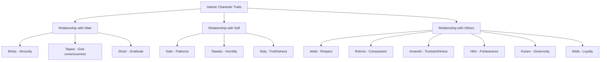
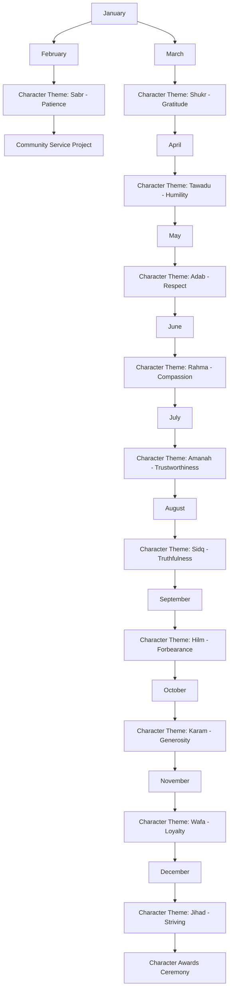

# Islamic Character Building Program

**Document Title:** Islamic Character Building Program
**Document ID:** IS_ICB_004
**Version:** 1.0
**Date:** 2026-01-11
**Project Name:** Smart Academy Digital Web Portal Development
**Content Category:** Islamic Studies Content

---

## Table of Contents

1. [Overview](#1-overview)
2. [Program Objectives](#2-program-objectives)
3. [Program Structure](#3-program-structure)
4. [Activities & Events](#4-activities--events)
5. [Schedule & Timing](#5-schedule--timing)
6. [Participation & Eligibility](#6-participation--eligibility)
7. [Resources & Materials](#7-resources--materials)
8. [Assessment & Recognition](#8-assessment--recognition)
9. [Parent Engagement](#9-parent-engagement)
10. [FAQs](#10-faqs)

---

## 1. Overview

The Islamic Character Building Program at Smart Academy systematically develops Islamic character traits (Akhlaq) in students through intentional instruction, modeling, practice, and recognition. This comprehensive program integrates character education across all aspects of school life, ensuring students internalize and demonstrate Islamic values in their daily behavior and interactions.

### 1.1 Philosophy

Character is the foundation of Islamic education:

> "Indeed, Allah is with those who fear Him and those who are doers of good." - Quran 16:128

The Prophet Muhammad (peace be upon him) emphasized character:

> "I was sent only for the purpose of perfecting good morals." - Sunan Ibn Majah, Book 36, Hadith 4217

And he said:

> "The most complete of the believers in faith is the one with the best character." - Sunan at-Tirmidhi, Book 1, Hadith 1162

### 1.2 Goals

- **Character Goals**: Develop strong Islamic character traits in all students
- **Behavioral Goals**: Transform knowledge into consistent positive behavior
- **Social Goals**: Foster respectful, compassionate, and responsible relationships
- **Spiritual Goals**: Strengthen connection with Allah through character development
- **Community Goals**: Create a positive Islamic school culture and environment

---

## 2. Program Objectives

### 2.1 Knowledge Objectives

By the end of the program, students will be able to:

- Identify and explain core Islamic character traits (Akhlaq)
- Understand the importance of character in Islam
- Recognize the connection between faith and behavior
- Learn about the character of the Prophet Muhammad (peace be upon him)
- Understand the consequences of good and bad character
- Identify Quranic verses and Hadith about character

### 2.2 Skill Objectives

Students will demonstrate proficiency in:

- Practicing Islamic character traits in daily life
- Resolving conflicts using Islamic principles
- Making ethical decisions based on Islamic values
- Demonstrating respect and courtesy in all interactions
- Exercising self-control and patience
- Showing compassion and kindness to others

### 2.3 Character Objectives

Students will develop:

- **Sabr (Patience)**: Enduring difficulties with patience and trust in Allah
- **Shukr (Gratitude)**: Appreciating Allah's blessings and showing thanks
- **Tawadu (Humility)**: Being humble and avoiding arrogance
- **Amanah (Trustworthiness)**: Fulfilling trusts and responsibilities
- **Ikhlas (Sincerity)**: Acting sincerely for Allah's pleasure
- **Rahma (Compassion)**: Showing mercy and kindness to others
- **Adab (Respect)**: Demonstrating proper Islamic manners
- **Hilm (Forbearance)**: Controlling anger and responding calmly
- **Jihad (Striving)**: Striving for excellence in character
- **Sidq (Truthfulness)**: Being truthful and honest in all dealings
- **Wafa (Loyalty)**: Being faithful to commitments and relationships
- **Karam (Generosity)**: Being generous and giving to others

### 2.4 Re-STEAM Integration

- **Science Connection**: Understanding character development through behavioral science
- **Technology Connection**: Using digital tools for character tracking and reflection
- **Mathematics Connection**: Analyzing character progress through data and metrics
- **Arts Connection**: Expressing character values through creative projects
- **Engineering Connection**: Designing solutions that benefit the community

---

## 3. Program Structure

### 3.1 Character Traits Framework

The program focuses on 12 core character traits, organized into three categories:

### 3.2 Weekly Character Focus Schedule

| Week | Character Trait | Arabic | Theme | Focus Activities |
|------|----------------|--------|-------|-----------------|
| Week 1 | Sincerity | Ikhlas | Acting for Allah's pleasure | Intention setting, reflection |
| Week 2 | Patience | Sabr | Enduring with trust | Patience challenges, stories |
| Week 3 | Gratitude | Shukr | Thanking Allah | Gratitude journals, sharing |
| Week 4 | Humility | Tawadu | Avoiding arrogance | Humility exercises, service |
| Week 5 | Respect | Adab | Islamic manners | Manners practice, role-playing |
| Week 6 | Compassion | Rahma | Showing kindness | Kindness projects, helping others |
| Week 7 | Trustworthiness | Amanah | Keeping promises | Trust activities, responsibility |
| Week 8 | Truthfulness | Sidq | Being honest | Truth games, honesty discussions |
| Week 9 | Forbearance | Hilm | Controlling anger | Anger management, calm responses |
| Week 10 | Generosity | Karam | Giving to others | Charity projects, sharing |
| Week 11 | Loyalty | Wafa | Being faithful | Commitment activities, teamwork |
| Week 12 | Striving | Jihad | Excellence in character | Goal setting, self-improvement |

### 3.3 Age-Appropriate Implementation

#### Early Childhood (3-6 years)

- **Focus**: Basic character concepts through stories and play
- **Method**: Storytelling, role-playing, songs, and visual aids
- **Activities**: Simple character games, puppet shows, picture books
- **Duration**: 10-15 minute character lessons
- **Assessment**: Observation and teacher feedback

#### Primary Level (6-11 years)

- **Focus**: Understanding and practicing character traits
- **Method**: Interactive lessons, group activities, discussions
- **Activities**: Character projects, role-playing, community service
- **Duration**: 20-30 minute character lessons
- **Assessment**: Self-assessment, peer feedback, teacher evaluation

#### Secondary Level (11-16 years)

- **Focus**: Deep understanding and application of character
- **Method**: In-depth study, leadership opportunities, mentoring
- **Activities**: Character presentations, mentoring younger students, community projects
- **Duration**: 30-45 minute character lessons
- **Assessment**: Comprehensive evaluation, leadership assessment

### 3.4 Program Components

#### Daily Character Integration

- **Morning Character Focus**: Daily character trait introduction
- **Character Reminders**: Throughout the day reminders
- **Character Challenges**: Daily character practice opportunities
- **End-of-Day Reflection**: Character reflection and journaling

#### Weekly Character Activities

- **Character Assembly**: Weekly assembly focusing on character trait
- **Character Workshops**: In-depth exploration of character traits
- **Character Projects**: Hands-on character building activities
- **Character Awards**: Recognition for character excellence

#### Monthly Character Programs

- **Character Theme**: Monthly focus on specific character areas
- **Character Competitions**: Character-based competitions and games
- **Community Service**: Character in action through service
- **Parent Workshops**: Character education for parents

#### Annual Character Events

- **Character Week**: Special week dedicated to character development
- **Character Awards Ceremony**: Annual recognition of character excellence
- **Character Fair**: Showcase of character projects and achievements
- **Community Character Day**: Character celebration with community

---

## 4. Activities & Events

### 4.1 Daily Activities

#### Morning Character Focus

- **Character Quote of the Day**: Daily Islamic quote about character
- **Character Story**: Short story illustrating the character trait
- **Character Challenge**: Daily challenge to practice the trait
- **Character Pledge**: Students pledge to practice the trait

#### Character Integration Throughout the Day

- **Classroom Character**: Character expectations in classrooms
- **Playground Character**: Character during recess and play
- **Lunchtime Character**: Character during meals
- **Prayer Character**: Character during prayers and worship

#### End-of-Day Reflection

- **Character Journal**: Students reflect on character practice
- **Character Sharing**: Students share character experiences
- **Character Goals**: Set character goals for next day
- **Character Du'a**: Du'a for character improvement

### 4.2 Weekly Activities

#### Character Assembly

- **Character Introduction**: Introduction of weekly character trait
- **Character Presentation**: Student presentation on the trait
- **Character Role-Play**: Students demonstrate the trait
- **Character Recognition**: Recognition of character examples

#### Character Workshops

- **Trait Exploration**: In-depth study of character trait
- **Practical Application**: How to apply the trait in daily life
- **Character Discussion**: Group discussions about the trait
- **Character Practice**: Hands-on practice of the trait

#### Character Projects

- **Creative Projects**: Art, writing, or media projects about character
- **Service Projects**: Community service demonstrating character
- **Research Projects**: Research on character in Islam
- **Presentation Projects**: Presentations on character traits

### 4.3 Monthly Activities

#### Character Theme Month

- **Month-Long Focus**: Extended focus on character area
- **Cross-Curricular Integration**: Character integrated across subjects
- **Home-School Connection**: Character activities at home
- **Community Involvement**: Community character projects

#### Character Competitions

- **Character Essay Competition**: Writing about character traits
- **Character Art Competition**: Artistic expression of character
- **Character Speech Competition**: Speeches about character
- **Character Skit Competition**: Dramatic presentations of character

#### Community Service

- **Charity Drives**: Collecting donations for those in need
- **Environmental Projects**: Cleaning and beautifying community
- **Elderly Assistance**: Helping elderly community members
- **Peer Tutoring**: Students helping other students

### 4.4 Special Events

#### Character Week

- **Theme**: "Character: The Foundation of Success"
- **Activities**: Special assemblies, competitions, workshops
- **Guest Speakers**: Islamic scholars and community leaders
- **Character Fair**: Display of character projects
- **Family Character Night**: Evening event with families

#### Character Awards Ceremony

- **Annual Recognition**: Recognition of character excellence
- **Award Categories**: Various character awards
- **Student Recognition**: Students recognized for character achievements
- **Parent Recognition**: Parents recognized for supporting character development
- **Community Recognition**: Community partners recognized

#### Community Character Day

- **Community Gathering**: Open event for community
- **Character Activities**: Various character activities for all ages
- **Character Displays**: Showcase of student character work
- **Character Talks**: Short talks on character topics
- **Family Activities**: Character activities for families

---

## 5. Schedule & Timing

### 5.1 Daily Character Schedule

| Time | Activity | Duration | Description |
|------|----------|----------|-------------|
| 8:30 AM | Morning Character Focus | 10 min | Daily character trait introduction |
| Throughout Day | Character Integration | Ongoing | Character reminders and challenges |
| 1:00 PM | Character Reflection | 5 min | Midday character check |
| 3:30 PM | End-of-Day Reflection | 10 min | Character journaling and sharing |

### 5.2 Weekly Character Schedule

| Day | Activity | Duration | Description |
|-----|----------|----------|-------------|
| Monday | Character Assembly | 30 min | Weekly character trait introduction |
| Tuesday | Character Workshop | 30 min | In-depth character exploration |
| Wednesday | Character Project | 45 min | Hands-on character activity |
| Thursday | Character Discussion | 20 min | Group discussion on character |
| Friday | Character Review | 15 min | Weekly character review and recognition |

### 5.3 Monthly Character Schedule

| Week | Focus | Activities |
|------|-------|------------|
| Week 1 | Character Introduction | Assembly, workshops, goal setting |
| Week 2 | Character Practice | Daily practice, character challenges |
| Week 3 | Character Projects | Character projects and presentations |
| Week 4 | Character Recognition | Awards, celebration, reflection |

### 5.4 Annual Character Schedule

---

## 6. Participation & Eligibility

### 6.1 Mandatory Participation

#### Required Participation

- **Morning Character Focus**: All students participate daily
- **Character Assemblies**: Weekly assembly attendance required
- **Character Lessons**: Age-appropriate character education
- **Character Projects**: Completion of character-related projects

#### Academic Requirements

- **Character Assignments**: Students complete character-related assignments
- **Character Presentations**: Students present on character topics
- **Character Journals**: Students maintain character reflection journals
- **Character Assessments**: Students participate in character assessments

### 6.2 Voluntary Participation

#### Optional Activities

- **Character Clubs**: Students may join character-focused clubs
- **Leadership Roles**: Students may volunteer for character leadership
- **Mentoring Programs**: Students may mentor younger students
- **Community Service**: Students may participate in service projects

#### Special Recognition

- **Character Awards**: Students nominated for character excellence
- **Character Ambassadors**: Selected students represent character program
- **Peer Mentors**: Students selected to mentor others
- **Character Leaders**: Students lead character activities

### 6.3 Age-Appropriate Participation

#### Early Childhood (3-6 years)

- **Participation**: Observation and simple activities
- **Activities**: Stories, songs, games, role-playing
- **Duration**: Short activities with frequent breaks
- **Focus**: Basic character concepts and positive behavior

#### Primary Level (6-11 years)

- **Participation**: Active engagement in all activities
- **Activities**: Projects, discussions, role-playing, service
- **Duration**: Age-appropriate activity length
- **Focus**: Understanding and practicing character traits

#### Secondary Level (11-16 years)

- **Participation**: Full participation with leadership opportunities
- **Activities**: Advanced projects, mentoring, teaching, organizing
- **Duration**: Full participation in extended activities
- **Focus**: Deep understanding, application, and leadership

### 6.4 Leadership Opportunities

#### Character Ambassadors

- **Selection**: Based on character excellence and leadership ability
- **Role**: Represent character program, mentor younger students
- **Responsibilities**: Lead character activities, organize events
- **Training**: Special leadership training provided

#### Peer Mentors

- **Eligibility**: Students demonstrating strong character
- **Role**: Mentor younger students in character development
- **Responsibilities**: One-on-one mentoring, group activities
- **Recognition**: Service hours and leadership certificate

#### Character Committee

- **Composition**: Students, teachers, and parents
- **Role**: Plan and organize character activities
- **Responsibilities**: Event planning, feedback, improvement
- **Meeting**: Monthly committee meetings

---

## 7. Resources & Materials

### 7.1 Educational Resources

#### Student Materials

- **Character Guide Booklets**: Age-appropriate character guides
- **Character Journals**: For daily reflection and goal setting
- **Character Stories**: Stories illustrating character traits
- **Activity Books**: Character-building activities
- **Character Cards**: Quick reference cards for character traits

#### Teacher Resources

- **Character Curriculum**: Detailed lesson plans and objectives
- **Teaching Guides**: Instructions for character activities
- **Assessment Tools**: Rubrics for evaluating character development
- **Presentation Materials**: Slides and visual aids
- **Parent Communication Templates**: Letters and information sheets

### 7.2 Physical Resources

#### Character Education Materials

- **Character Posters**: Visual displays of character traits
- **Character Books**: Storybooks about character
- **Character Games**: Educational games for character development
- **Character Awards**: Certificates, badges, and prizes
- **Character Displays**: Boards for displaying character work

#### Activity Supplies

- **Art Supplies**: Materials for character art projects
- **Project Materials**: Supplies for character projects
- **Journal Materials**: Notebooks and writing supplies
- **Reward Items**: Stickers, tokens, and small prizes
- **Decorations**: Character-themed decorations

### 7.3 Digital Resources

#### Character Applications

- **Character Tracking Apps**: For monitoring character progress
- **Reflection Apps**: Digital journaling and reflection tools
- **Educational Videos**: Videos about character development
- **Interactive Games**: Character-building digital games
- **Assessment Tools**: Digital character assessment tools

#### Online Resources

- **Character Portal**: School website section with character resources
- **Parent Portal**: Access to character progress and resources
- **Virtual Activities**: Online character activities
- **Islamic Content Library**: Digital library of character resources

### 7.4 Community Resources

#### Mosque Partnerships

- **Imam Visits**: Regular visits from local Islamic scholars
- **Character Lectures**: Special talks on character
- **Community Events**: Participation in community character events
- **Resource Sharing**: Access to additional Islamic materials

#### Parent Resources

- **Home Character Guide**: Instructions for family character activities
- **Character Tips**: Suggestions for supporting character at home
- **Family Activity Ideas**: Suggestions for home character activities
- **Q&A Sessions**: Regular opportunities for parent questions

---

## 8. Assessment & Recognition

### 8.1 Assessment Methods

#### Daily Assessment

- **Character Observation**: Daily observation of character behavior
- **Character Challenges**: Completion of daily character challenges
- **Reflection Journals**: Review of character reflections
- **Peer Feedback**: Peer observations and feedback

#### Weekly Assessment

- **Character Check**: Weekly review of character progress
- **Goal Review**: Check progress on character goals
- **Participation Assessment**: Evaluation of participation in activities
- **Self-Assessment**: Student self-evaluation of character

#### Monthly Assessment

- **Comprehensive Review**: Full evaluation of character development
- **Project Evaluation**: Assessment of character projects
- **Parent Feedback**: Input from families on home character
- **Recognition Planning**: Identification of students for awards

### 8.2 Assessment Criteria

#### Knowledge Criteria

- **Trait Understanding**: Understanding of character traits
- **Islamic Knowledge**: Knowledge of Islamic character teachings
- **Application Knowledge**: How to apply traits in daily life
- **Consequences Understanding**: Understanding of character consequences

#### Behavioral Criteria

- **Consistency**: Regular demonstration of character traits
- **Application**: Applying traits in various situations
- **Self-Control**: Exercising control over behavior
- **Positive Impact**: Positive influence on others

#### Social Criteria

- **Respect**: Showing respect to others
- **Cooperation**: Working well with others
- **Leadership**: Demonstrating leadership in character
- **Responsibility**: Taking responsibility for actions

### 8.3 Recognition System

#### Daily Recognition

- **Character Star**: Immediate praise for demonstrating character
- **Character Note**: Written note of recognition
- **Peer Recognition**: Students recognize each other's character
- **Character Token**: Small token for character demonstration

#### Weekly Recognition

- **Character Champion**: Student demonstrating character excellence
- **Most Improved**: Student showing greatest character improvement
- **Character Helper**: Recognition for helping others
- **Perfect Character**: Consistent character demonstration

#### Monthly Recognition

- **Character Excellence Award**: Outstanding character development
- **Character Project Award**: Best character project
- **Service Award**: Exceptional community service
- **Leadership Award**: Character leadership excellence

#### Annual Recognition

- **Character Achievement Certificate**: Year-end recognition
- **Character Ambassador**: Selected students represent program
- **Perfect Character Award**: Consistent excellence throughout year
- **Character Hall of Fame**: Outstanding character achievements

### 8.4 Award Categories

| Award | Criteria | Age Group | Recognition |
|-------|----------|-----------|-------------|
| Character Star | Daily character demonstration | All | Verbal praise, sticker |
| Character Champion | Weekly excellence | All | Certificate, badge |
| Character Excellence | Monthly outstanding | All | Certificate, medal |
| Character Project | Best character project | All | Certificate, prize |
| Service Award | Exceptional community service | All | Certificate, special recognition |
| Leadership Award | Character leadership | 11-16 years | Certificate, special role |
| Character Ambassador | Program representative | 11-16 years | Badge, special duties |
| Perfect Character | Consistent excellence | All | Certificate, trophy |

---

## 9. Parent Engagement

### 9.1 Communication Channels

#### Regular Updates

- **Character Reports**: Monthly character progress reports
- **Character Tips**: Weekly character development tips
- **Event Notifications**: Information about character events
- **Progress Updates**: Student character progress information

#### Digital Communication

- **Parent Portal**: Online access to character records
- **SMS/WhatsApp Updates**: Character reminders and notices
- **Email Updates**: Regular email communications
- **School Website**: Character program information and resources

### 9.2 Parent Workshops

#### Character Education Workshop

- **Understanding Character**: Importance of character development
- **Home Character**: Creating character-focused home environment
- **Family Character**: Establishing family character traditions
- **Character Challenges**: Addressing character development challenges

#### Character Traits Workshop

- **Trait Deep-Dive**: In-depth exploration of character traits
- **Practical Application**: How to practice traits at home
- **Family Activities**: Character activities for families
- **Character Modeling**: Parents as character role models

### 9.3 Family Character Activities

#### Home Character Support

- **Character Journals**: Family character reflection journals
- **Character Challenges**: Weekly family character challenges
- **Character Discussions**: Family discussions about character
- **Character Goals**: Setting family character goals

#### Special Family Events

- **Family Character Night**: Evening program with families
- **Character Fair**: Display of family character projects
- **Community Service**: Family charity activities
- **Character Celebration**: Celebration of character achievements

### 9.4 Volunteer Opportunities

#### Character Supervision

- **Parent Volunteers**: Assist with character activities
- **Event Support**: Help organize character events
- **Mentoring**: Parents mentor students in character
- **Character Committee**: Serve on character committee

#### Resource Contribution

- **Character Materials**: Donate character education materials
- **Expertise Sharing**: Parents share character knowledge
- **Community Connections**: Facilitate community partnerships
- **Storytelling**: Parents share character stories

### 9.5 Parent Feedback

#### Feedback Channels

- **Parent Surveys**: Annual survey on character program effectiveness
- **Parent-Teacher Meetings**: Discuss student character progress
- **Suggestion Box**: Anonymous feedback and suggestions
- **Focus Groups**: Regular parent input sessions

#### Continuous Improvement

- **Program Review**: Annual review based on parent feedback
- **Adjustment Implementation**: Changes based on suggestions
- **Success Stories**: Share positive experiences with community
- **Challenge Addressing**: Resolve concerns and difficulties

---

## 10. FAQs

### 10.1 General Questions

**Q: Why is character building important in Islamic education?**

A: Character building is essential in Islam because the Prophet Muhammad (peace be upon him) was sent to perfect good character. Islamic education aims to develop both knowledge and character, as true success comes from having both.

**Q: How does the character building program work?**

A: The program focuses on one character trait each week through daily lessons, activities, and reflections. Students learn about the trait, practice it, and reflect on their progress. Recognition and awards encourage continued character development.

**Q: How is character assessed?**

A: Character is assessed through daily observation, reflection journals, peer feedback, project completion, and teacher evaluation. Assessment focuses on understanding, application, and consistency of character traits.

### 10.2 Program-Specific Questions

**Q: What character traits are taught?**

A: We focus on 12 core character traits: Ikhlas (Sincerity), Sabr (Patience), Shukr (Gratitude), Tawadu (Humility), Adab (Respect), Rahma (Compassion), Amanah (Trustworthiness), Sidq (Truthfulness), Hilm (Forbearance), Karam (Generosity), Wafa (Loyalty), and Jihad (Striving).

**Q: How are character traits integrated into daily school life?**

A: Character traits are integrated through morning character focus, daily reminders and challenges, classroom expectations, playground behavior, lunchtime manners, and prayer character. Teachers model and reinforce character throughout the day.

**Q: What happens if a student struggles with a character trait?**

A: Students receive additional support through one-on-one mentoring, extra practice opportunities, parent involvement, and positive reinforcement. Character development is a process, and students are encouraged to keep trying.

### 10.3 Parent Involvement Questions

**Q: How can I support my child's character development at home?**

A: Parents can support by modeling good character, discussing character traits, setting character goals, providing character-focused activities, reading character stories, and recognizing character achievements.

**Q: Can parents participate in character activities at school?**

A: Yes, parents are welcome to attend character assemblies, special character events, parent workshops, and family character nights. Parents can also volunteer to help with character activities.

**Q: How will I know about my child's character progress?**

A: We provide monthly character reports, regular updates through the parent portal, parent-teacher meetings, and special recognition notifications. Parents can also observe character through their child's behavior and reflections.

### 10.4 Award Questions

**Q: How are character awards determined?**

A: Awards are based on consistent demonstration of character traits, improvement in character, participation in character activities, completion of character projects, and positive influence on others.

**Q: What types of awards are given?**

A: We have daily recognition (Character Star), weekly recognition (Character Champion), monthly recognition (Character Excellence), and annual recognition (Character Achievement Certificate, Character Ambassador).

**Q: Can every student receive a character award?**

A: Yes, we recognize different types of character excellence including consistency, improvement, leadership, service, and special achievements. Every student has the opportunity to be recognized for their character development.

### 10.5 Special Situations Questions

**Q: How does the program handle character challenges?**

A: We approach character challenges with patience, understanding, and support. Students receive guidance, mentoring, and opportunities to learn and improve. The focus is on growth and development, not punishment.

**Q: Are accommodations made for students with special needs?**

A: Yes, accommodations are made for students with special needs including modified activities, additional support, individualized goals, and adapted assessment methods.

**Q: How does character building relate to academic success?**

A: Character building supports academic success by developing self-discipline, responsibility, perseverance, respect for learning, and positive relationships. Strong character traits directly contribute to better academic performance.

---

## Document Approval

| Role | Name | Signature | Date |
|------|------|-----------|------|
| Islamic Studies Coordinator | | _________________ | ________ |
| Principal | | _________________ | ________ |
