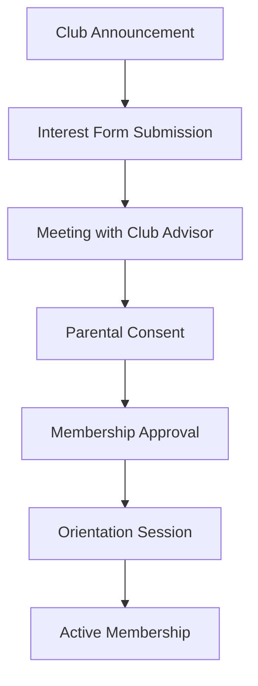
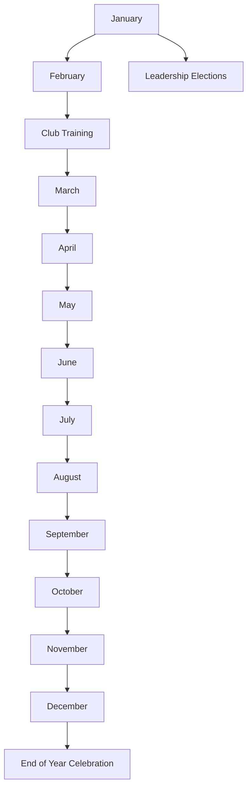

# Islamic Clubs Program

**Document Title:** Islamic Clubs Program
**Document ID:** IS_ICP_006
**Version:** 1.0
**Date:** 2026-01-11
**Project Name:** Smart Academy Digital Web Portal Development
**Content Category:** Islamic Studies Content

---

## Table of Contents

1. [Overview](#1-overview)
2. [Program Objectives](#2-program-objectives)
3. [Program Structure](#3-program-structure)
4. [Activities & Events](#4-activities--events)
5. [Schedule & Timing](#5-schedule--timing)
6. [Participation & Eligibility](#6-participation--eligibility)
7. [Resources & Materials](#7-resources--materials)
8. [Assessment & Recognition](#8-assessment--recognition)
9. [Parent Engagement](#9-parent-engagement)
10. [FAQs](#10-faqs)

---

## 1. Overview

The Islamic Clubs Program at Smart Academy provides students with structured opportunities to deepen their Islamic knowledge, develop leadership skills, and engage in meaningful Islamic activities outside regular classroom instruction. These clubs foster peer learning, community service, and practical application of Islamic teachings in a supportive environment.

### 1.1 Philosophy

Islamic clubs provide opportunities for collective learning and action:

> "And cooperate in righteousness and piety, but do not cooperate in sin and aggression." - Quran 5:2

The Prophet Muhammad (peace be upon him) emphasized the importance of companionship and learning together:

> "A person is upon the religion of his companion, so let each of you look at whom he befriends." - Sunan at-Tirmidhi, Book 1, Hadith 2378

And he said:

> "The example of a good companion and a bad companion is like that of the musk seller and the blacksmith's bellows." - Sahih Bukhari, Book 73, Hadith 210

### 1.2 Goals

- **Knowledge Goals**: Deepen Islamic knowledge through focused club activities
- **Skill Goals**: Develop leadership, organization, and communication skills
- **Character Goals**: Strengthen Islamic character through practical application
- **Social Goals**: Build positive peer relationships and community bonds
- **Service Goals**: Engage in meaningful community service and Da'wah

---

## 2. Program Objectives

### 2.1 Knowledge Objectives

By the end of the program, students will be able to:

- Deepen understanding of specific Islamic topics through club activities
- Apply Islamic knowledge to practical situations and projects
- Learn from peers through collaborative learning
- Research and present on Islamic topics
- Understand the importance of teamwork in Islamic work

### 2.2 Skill Objectives

Students will demonstrate proficiency in:

- Leadership and organizational skills
- Public speaking and presentation abilities
- Research and analytical skills
- Teamwork and collaboration
- Project planning and execution
- Community engagement and service

### 2.3 Character Objectives

Students will develop:

- **Ukhuwah (Brotherhood/Sisterhood)**: Building strong Islamic bonds
- **Ikhlas (Sincerity)**: Working sincerely for Allah's pleasure
- **Amanah (Trustworthiness)**: Fulfilling club responsibilities
- **Sabr (Patience)**: Working through challenges with patience
- **Shukr (Gratitude)**: Appreciating opportunities to serve Islam
- **Rahma (Compassion)**: Showing compassion through service
- **Tawadu (Humility)**: Leading and serving with humility

### 2.4 Re-STEAM Integration

- **Science Connection**: Exploring scientific contributions of Muslim scholars
- **Technology Connection**: Using digital tools for club activities and projects
- **Mathematics Connection**: Understanding Islamic contributions to mathematics
- **Arts Connection**: Creating Islamic art and creative projects
- **Engineering Connection**: Designing solutions for community service projects

---

## 3. Program Structure

### 3.1 Club Overview

The Islamic Clubs Program includes six main clubs:

```mermaid
graph TD
    A[Islamic Clubs Program] --> B[Quran Club]
    A --> C[Hadith Club]
    A --> D[Seerah Club]
    A --> E[Islamic History Club]
    A --> F[Charity Club]
    A --> G[Da'wah Club]
    
    B --> B1[Quran Recitation]
    B --> B2[Quran Memorization]
    B --> B3[Tajweed Practice]
    B --> B4[Quran Projects]
    
    C --> C1[Hadith Study]
    C --> C2[Hadith Memorization]
    C --> C3[Hadith Application]
    C --> C4[Hadith Projects]
    
    D --> D1[Prophet's Life]
    D --> D2[Prophetic Character]
    D --> D3[Prophetic Teachings]
    D --> D4[Seerah Projects]
    
    E --> E1[Islamic History]
    E --> E2[Muslim Scholars]
    E --> E3[Islamic Civilization]
    E --> E4[History Projects]
    
    F --> F1[Charity Drives]
    F --> F2[Community Service]
    F --> F3[Fundraising]
    F --> F4[Charity Projects]
    
    G --> G1[Da'wah Training]
    G --> G2[Community Outreach]
    G --> G3[Islamic Education]
    G --> G4[Da'wah Projects]
```

### 3.2 Club Descriptions

#### Quran Club

- **Focus**: Deepening engagement with the Holy Quran
- **Activities**: Quran recitation, memorization, Tajweed practice, Quran projects
- **Age Groups**: All levels with age-appropriate activities
- **Meeting Frequency**: Weekly
- **Leadership**: Student president, vice-president, and committee

#### Hadith Club

- **Focus**: Study and application of Hadith (Prophetic traditions)
- **Activities**: Hadith study, memorization, application, projects
- **Age Groups**: Primary and secondary levels
- **Meeting Frequency**: Weekly
- **Leadership**: Student president, vice-president, and committee

#### Seerah Club

- **Focus**: Study of the Prophet Muhammad's (peace be upon him) life
- **Activities**: Seerah study, character analysis, presentations, projects
- **Age Groups**: All levels with age-appropriate content
- **Meeting Frequency**: Weekly
- **Leadership**: Student president, vice-president, and committee

#### Islamic History Club

- **Focus**: Study of Islamic history and civilization
- **Activities**: History study, research, presentations, projects
- **Age Groups**: Primary and secondary levels
- **Meeting Frequency**: Weekly
- **Leadership**: Student president, vice-president, and committee

#### Charity Club

- **Focus**: Community service and charitable activities
- **Activities**: Charity drives, community service, fundraising, projects
- **Age Groups**: All levels with age-appropriate service
- **Meeting Frequency**: Weekly
- **Leadership**: Student president, vice-president, and committee

#### Da'wah Club

- **Focus**: Islamic outreach and education
- **Activities**: Da'wah training, community outreach, Islamic education, projects
- **Age Groups**: Secondary level (11-16 years)
- **Meeting Frequency**: Weekly
- **Leadership**: Student president, vice-president, and committee

### 3.3 Club Leadership Structure

Each club has the following leadership structure:

| Position | Responsibilities | Eligibility |
|----------|------------------|-------------|
| **Club President** | Overall leadership, meeting facilitation, representative | Secondary students with leadership experience |
| **Vice-President** | Assist president, lead in president's absence | Secondary students |
| **Secretary** | Record minutes, maintain records, communication | Primary/secondary students |
| **Treasurer** | Manage club budget, fundraising, expenses | Secondary students |
| **Event Coordinator** | Plan and organize club events | Primary/secondary students |
| **Committee Members** | Support club activities, participate in projects | All club members |

### 3.4 Club Membership

#### Membership Categories

- **Active Member**: Regular attendance and participation in club activities
- **Associate Member**: Occasional participation in selected activities
- **Leadership Member**: Holds leadership position in the club
- **Honorary Member**: Recognized for exceptional contribution

#### Membership Requirements

- **Enrollment**: Must be enrolled student at Smart Academy
- **Interest**: Genuine interest in club focus area
- **Commitment**: Willingness to commit time and effort
- **Character**: Good character and behavior
- **Parental Consent**: Parental approval for participation

#### Membership Process

---

## 4. Activities & Events

### 4.1 Club-Specific Activities

#### Quran Club Activities

- **Daily Quran Recitation**: Group recitation sessions
- **Tajweed Workshops**: Special sessions on pronunciation rules
- **Quran Memorization**: Structured memorization program
- **Quran Projects**: Creative projects about Quran
- **Quran Competitions**: Internal recitation competitions
- **Quran Study Groups**: Study groups for Quran understanding

#### Hadith Club Activities

- **Hadith Study Sessions**: Study of selected Hadith collections
- **Hadith Memorization**: Memorization of important Hadith
- **Hadith Application**: Applying Hadith to daily life
- **Hadith Presentations**: Student presentations on Hadith topics
- **Hadith Projects**: Research projects on Hadith
- **Hadith Discussions**: Group discussions on Hadith meanings

#### Seerah Club Activities

- **Seerah Study**: Detailed study of Prophet's life
- **Character Analysis**: Study of Prophetic character traits
- **Seerah Presentations**: Student presentations on Seerah topics
- **Seerah Projects**: Creative projects about the Prophet's life
- **Seerah Reenactments**: Dramatic presentations of Seerah events
- **Seerah Discussions**: Group discussions on Seerah lessons

#### Islamic History Club Activities

- **History Study**: Study of Islamic history periods
- **Scholar Research**: Research on Muslim scholars
- **Civilization Projects**: Projects on Islamic civilization
- **History Presentations**: Student presentations on history topics
- **Museum Visits**: Visits to Islamic history museums
- **History Discussions**: Group discussions on historical events

#### Charity Club Activities

- **Charity Drives**: Organizing collections for those in need
- **Community Service**: Service projects in the community
- **Fundraising**: Fundraising events for charitable causes
- **Volunteer Work**: Volunteer opportunities for students
- **Charity Projects**: Specific charitable projects
- **Awareness Campaigns**: Raising awareness about social issues

#### Da'wah Club Activities

- **Da'wah Training**: Training on Islamic outreach methods
- **Community Outreach**: Outreach activities in the community
- **Islamic Education**: Educational programs about Islam
- **Da'wah Projects**: Specific Da'wah initiatives
- **Interfaith Dialogue**: Interfaith dialogue activities
- **Islamic Presentations**: Presentations about Islam

### 4.2 Joint Club Activities

#### All-Club Meetings

- **Monthly Assembly**: All clubs meet together for updates
- **Joint Projects**: Collaborative projects between clubs
- **Club Fair**: Showcase of all club activities
- **Leadership Training**: Training for all club leaders
- **Planning Sessions**: Joint planning for school events

#### Special Events

- **Islamic Clubs Week**: Special week highlighting all clubs
- **Joint Charity Drive**: All clubs participate in charity
- **Islamic Knowledge Competition**: Competition involving all clubs
- **Community Day**: All clubs participate in community service
- **End-of-Year Celebration**: Celebration of club achievements

### 4.3 Community Service Activities

#### Charity Club-Led Activities

- **Food Drives**: Collecting food for those in need
- **Clothing Collections**: Gathering clothes for distribution
- **School Supplies Drive**: Collecting supplies for underprivileged students
- **Elderly Assistance**: Helping elderly community members
- **Environmental Projects**: Cleaning and beautifying community

#### All-Club Service Projects

- **Community Clean-Up**: Joint community cleaning project
- **Hospital Visits**: Visiting patients in hospitals
- **Orphanage Support**: Supporting local orphanages
- **Tree Planting**: Environmental service project
- **Disaster Relief**: Supporting disaster relief efforts

### 4.4 Educational Activities

#### Workshops and Seminars

- **Islamic Workshops**: Specialized workshops on Islamic topics
- **Guest Speaker Sessions**: Presentations by Islamic scholars
- **Skill-Building Workshops**: Workshops on leadership and skills
- **Research Workshops**: Training on research methods
- **Presentation Skills**: Training on effective presentations

#### Educational Trips

- **Mosque Visits**: Educational visits to local mosques
- **Islamic Centers**: Visits to Islamic cultural centers
- **Museum Visits**: Visits to Islamic history museums
- **Library Visits**: Visits to Islamic libraries
- **Historical Sites**: Visits to Islamic historical sites

---

## 5. Schedule & Timing

### 5.1 Weekly Club Schedule

| Day | Club | Time | Duration | Location |
|-----|------|------|----------|----------|
| Monday | Quran Club | 2:00 PM | 60 min | Room 101 |
| Monday | Hadith Club | 2:00 PM | 60 min | Room 102 |
| Tuesday | Seerah Club | 2:00 PM | 60 min | Room 103 |
| Tuesday | Islamic History Club | 2:00 PM | 60 min | Room 104 |
| Wednesday | Charity Club | 2:00 PM | 60 min | Room 105 |
| Wednesday | Da'wah Club | 2:00 PM | 60 min | Room 106 |
| Thursday | All-Club Meeting | 2:00 PM | 45 min | Assembly Hall |
| Friday | Club Activities | 1:30 PM | 90 min | Various |

### 5.2 Monthly Club Schedule

| Week | Focus | Activities |
|------|-------|------------|
| Week 1 | Club Meetings | Regular club meetings and activities |
| Week 2 | Project Work | Focus on club projects |
| Week 3 | Community Service | Community service activities |
| Week 4 | Review and Planning | Review progress and plan next month |

### 5.3 Annual Club Schedule

### 5.4 Meeting Structure

#### Standard Club Meeting (60 minutes)

| Time | Activity | Duration | Description |
|------|----------|----------|-------------|
| 2:00 PM | Opening Du'a | 2 min | Begin with Du'a |
| 2:02 PM | Attendance | 3 min | Take attendance |
| 2:05 PM | Review | 5 min | Review previous meeting |
| 2:10 PM | Main Activity | 35 min | Club-specific activity |
| 2:45 PM | Planning | 10 min | Plan next activities |
| 2:55 PM | Closing Du'a | 2 min | End with Du'a |
| 2:57 PM | Dismissal | 3 min | Organize and dismiss |

#### All-Club Meeting (45 minutes)

| Time | Activity | Duration | Description |
|------|----------|----------|-------------|
| 2:00 PM | Opening Du'a | 2 min | Begin with Du'a |
| 2:02 PM | Announcements | 10 min | School and club announcements |
| 2:12 PM | Club Updates | 15 min | Each club reports on activities |
| 2:27 PM | Joint Planning | 10 min | Plan joint activities |
| 2:37 PM | Recognition | 5 min | Recognize achievements |
| 2:42 PM | Closing Du'a | 2 min | End with Du'a |
| 2:44 PM | Dismissal | 1 min | Dismiss |

---

## 6. Participation & Eligibility

### 6.1 Membership Eligibility

#### General Requirements

- **Enrollment**: Must be enrolled student at Smart Academy
- **Age**: Must meet age requirements for specific clubs
- **Interest**: Genuine interest in club focus area
- **Commitment**: Willingness to attend meetings regularly
- **Character**: Good character and behavior record

#### Club-Specific Requirements

| Club | Minimum Age | Prerequisites |
|------|-------------|---------------|
| Quran Club | 3 years | Interest in Quran |
| Hadith Club | 6 years | Basic Islamic knowledge |
| Seerah Club | 3 years | Interest in Prophet's life |
| Islamic History Club | 6 years | Interest in history |
| Charity Club | 3 years | Interest in service |
| Da'wah Club | 11 years | Strong Islamic knowledge |

### 6.2 Leadership Eligibility

#### President Requirements

- **Age**: Secondary student (11-16 years)
- **Experience**: Previous club membership or leadership experience
- **Character**: Excellent character and behavior
- **Commitment**: Willingness to dedicate extra time
- **Skills**: Leadership and organizational skills

#### Other Leadership Positions

- **Vice-President**: Secondary students with leadership potential
- **Secretary**: Primary/secondary students with organizational skills
- **Treasurer**: Secondary students with responsibility
- **Event Coordinator**: Primary/secondary students with planning skills
- **Committee Members**: All club members

### 6.3 Participation Levels

#### Active Participation

- **Attendance**: Regular attendance at club meetings (minimum 75%)
- **Engagement**: Active participation in club activities
- **Projects**: Completion of club projects
- **Leadership**: Willingness to take on leadership roles

#### Associate Participation

- **Attendance**: Occasional attendance at selected activities
- **Engagement**: Participation in specific projects of interest
- **Projects**: Completion of selected projects
- **Support**: Support for club activities as able

### 6.4 Special Considerations

#### Multiple Club Membership

- **Policy**: Students may join up to two clubs
- **Consideration**: Must be able to commit time to both clubs
- **Approval**: Requires approval from both club advisors
- **Balance**: Must maintain academic performance

#### Special Needs Accommodations

- **Modified Activities**: Adjusted activities as needed
- **Support Personnel**: Additional support as required
- **Accessibility**: Ensure club activities are accessible
- **Inclusion**: Full inclusion in all club activities

---

## 7. Resources & Materials

### 7.1 Educational Resources

#### Club-Specific Materials

- **Quran Club**: Quran copies, Tajweed guides, memorization trackers
- **Hadith Club**: Hadith collections, study guides, memorization lists
- **Seerah Club**: Seerah books, biographies, presentation materials
- **Islamic History Club**: History books, research materials, project supplies
- **Charity Club**: Charity guides, project planning materials
- **Da'wah Club**: Da'wah guides, presentation materials, educational resources

#### General Club Materials

- **Club Handbooks**: Guidelines for club operation
- **Meeting Agendas**: Templates for meeting agendas
- **Project Planning Guides**: Guides for planning projects
- **Leadership Materials**: Leadership training materials
- **Communication Templates**: Templates for club communication

### 7.2 Physical Resources

#### Meeting Spaces

- **Club Rooms**: Dedicated rooms for each club
- **Meeting Hall**: Large hall for all-club meetings
- **Activity Spaces**: Spaces for club activities and projects
- **Storage Areas**: Storage for club materials and supplies

#### Activity Supplies

- **Office Supplies**: Paper, pens, markers, and other office supplies
- **Project Materials**: Supplies for club projects
- **Presentation Materials**: Materials for presentations and displays
- **Technology**: Computers, projectors, and other technology
- **Equipment**: Equipment for club activities

### 7.3 Digital Resources

#### Club Management Tools

- **Club Portal**: Online portal for club management
- **Communication Tools**: Tools for club communication
- **Project Management**: Tools for managing club projects
- **Resource Sharing**: Platform for sharing club resources

#### Educational Resources

- **Online Libraries**: Digital Islamic libraries
- **Educational Videos**: Videos on Islamic topics
- **Research Tools**: Tools for research and study
- **Presentation Software**: Software for creating presentations

### 7.4 Community Resources

#### Islamic Scholars

- **Club Advisors**: Islamic scholars as club advisors
- **Guest Speakers**: Scholars for special presentations
- **Mentors**: Mentors for student development
- **Consultants**: Consultants for club projects

#### Community Partners

- **Mosques**: Partnership with local mosques
- **Islamic Centers**: Collaboration with Islamic centers
- **Charity Organizations**: Partnerships with charities
- **Educational Institutions**: Partnerships with educational institutions

---

## 8. Assessment & Recognition

### 8.1 Assessment Methods

#### Participation Assessment

- **Attendance Tracking**: Record of meeting attendance
- **Activity Participation**: Engagement in club activities
- **Project Completion**: Completion of club projects
- **Leadership Demonstration**: Leadership in club activities

#### Skill Assessment

- **Leadership Skills**: Demonstration of leadership abilities
- **Communication Skills**: Effectiveness in communication
- **Teamwork**: Ability to work collaboratively
- **Project Management**: Skills in planning and executing projects

#### Character Assessment

- **Commitment**: Consistency in participation
- **Responsibility**: Fulfillment of responsibilities
- **Initiative**: Taking initiative in club activities
- **Character**: Demonstration of Islamic character

### 8.2 Recognition System

#### Club-Specific Recognition

- **Member of the Month**: Outstanding club member
- **Project Award**: Best club project
- **Leadership Award**: Outstanding leadership
- **Service Award**: Exceptional service to club

#### Annual Recognition

- **Club Achievement Award**: Outstanding achievement in club
- **Leadership Excellence**: Exceptional leadership
- **Service Excellence**: Exceptional service
- **Most Improved**: Greatest improvement in club

#### Special Recognition

- **Club President Award**: Recognition for club presidents
- **Club of the Year**: Best performing club
- **Community Impact Award**: Impact on community
- **Innovation Award**: Innovative club projects

### 8.3 Awards and Certificates

| Award | Criteria | Recognition |
|-------|----------|-------------|
| Member of the Month | Outstanding participation | Certificate, badge |
| Project Award | Best club project | Certificate, prize |
| Leadership Award | Outstanding leadership | Certificate, medal |
| Service Award | Exceptional service | Certificate, special recognition |
| Club Achievement | Outstanding achievement | Certificate, trophy |
| Club of the Year | Best performing club | Trophy, recognition |
| Community Impact | Impact on community | Certificate, special recognition |
| Innovation Award | Innovative projects | Certificate, prize |

---

## 9. Parent Engagement

### 9.1 Communication Channels

#### Regular Updates

- **Club Newsletters**: Monthly club newsletters
- **Meeting Updates**: Information about club meetings
- **Project Updates**: Information about club projects
- **Achievement Recognition**: Recognition of club achievements

#### Digital Communication

- **Parent Portal**: Online access to club information
- **SMS/WhatsApp Updates**: Club reminders and notices
- **Email Updates**: Regular email communications
- **School Website**: Club program information

### 9.2 Parent Workshops

#### Club Education Workshop

- **Understanding Clubs**: Overview of club programs
- **Supporting Your Child**: How to support club participation
- **Club Benefits**: Benefits of club participation
- **Q&A Session**: Opportunity for parent questions

#### Leadership Workshop

- **Leadership Development**: Understanding leadership in clubs
- **Supporting Leadership**: How to support child's leadership
- **Leadership Benefits**: Benefits of leadership experience
- **Q&A Session**: Opportunity for parent questions

### 9.3 Family Involvement

#### Club Events

- **Club Fair**: Families attend club fair
- **Achievement Ceremonies**: Families attend recognition events
- **Community Service**: Families participate in service projects
- **Special Events**: Families attend special club events

#### Home Support

- **Project Support**: Support for club projects at home
- **Practice Support**: Support for practice and preparation
- **Encouragement**: Encouragement for club participation
- **Celebration**: Celebration of club achievements

### 9.4 Volunteer Opportunities

#### Club Support

- **Parent Volunteers**: Assist with club activities
- **Event Support**: Help organize club events
- **Project Support**: Help with club projects
- **Transportation**: Provide transportation for activities

#### Resource Contribution

- **Material Donations**: Donate materials for clubs
- **Expertise Sharing**: Share expertise with clubs
- **Community Connections**: Facilitate community partnerships
- **Financial Support**: Support club activities financially

### 9.5 Parent Feedback

#### Feedback Channels

- **Parent Surveys**: Annual survey on club programs
- **Parent-Teacher Meetings**: Discuss club participation
- **Suggestion Box**: Anonymous feedback and suggestions
- **Focus Groups**: Regular parent input sessions

#### Continuous Improvement

- **Program Review**: Annual review based on parent feedback
- **Adjustment Implementation**: Changes based on suggestions
- **Success Stories**: Share positive experiences
- **Challenge Addressing**: Resolve concerns and difficulties

---

## 10. FAQs

### 10.1 General Questions

**Q: What are Islamic clubs?**

A: Islamic clubs are student-led organizations focused on specific areas of Islamic knowledge and practice. They provide opportunities for students to deepen their understanding, develop leadership skills, and engage in meaningful Islamic activities.

**Q: Why should my child join an Islamic club?**

A: Islamic clubs provide opportunities for deeper Islamic learning, leadership development, community service, positive peer relationships, and practical application of Islamic teachings.

**Q: How many clubs can a student join?**

A: Students may join up to two clubs to ensure they can commit adequate time to each while maintaining academic performance.

### 10.2 Club-Specific Questions

**Q: What clubs are available?**

A: We offer six Islamic clubs: Quran Club, Hadith Club, Seerah Club, Islamic History Club, Charity Club, and Da'wah Club. Each club focuses on a specific area of Islamic knowledge and practice.

**Q: What do clubs do in their meetings?**

A: Club meetings include activities specific to each club's focus, such as Quran recitation, Hadith study, Seerah presentations, history research, charity planning, or Da'wah training. Meetings also include planning and project work.

**Q: How often do clubs meet?**

A: Clubs meet weekly for 60 minutes. There are also monthly all-club meetings and special events throughout the year.

### 10.3 Participation Questions

**Q: Who can join Islamic clubs?**

A: All enrolled students who meet the age requirements for their chosen club and demonstrate good character and behavior are eligible to join. Parental consent is required for participation.

**Q: How do students join clubs?**

A: Students submit an interest form, meet with the club advisor, obtain parental consent, and attend an orientation session before becoming active members.

**Q: Can students be club leaders?**

A: Yes, students can serve in various leadership positions including President, Vice-President, Secretary, Treasurer, Event Coordinator, and Committee Member. Leadership positions have specific eligibility requirements.

### 10.4 Parent Involvement Questions

**Q: How can I support my child's club participation?**

A: Parents can support by encouraging participation, providing transportation, helping with projects, attending club events, and volunteering to help with club activities.

**Q: Can parents attend club meetings?**

A: While regular club meetings are for students only, parents are welcome to attend special club events, the club fair, achievement ceremonies, and community service activities.

**Q: How will I know about my child's club activities?**

A: We provide regular updates through newsletters, the parent portal, SMS/WhatsApp updates, and email communications. Parents can also attend club events and meetings with club advisors.

### 10.5 Special Situations Questions

**Q: What if a child wants to change clubs?**

A: Students may request to change clubs at the beginning of each term. The request is reviewed by club advisors to ensure appropriate placement.

**Q: Are accommodations made for students with special needs?**

A: Yes, accommodations are made for students with special needs including modified activities, support personnel, accessibility considerations, and full inclusion in club activities.

**Q: What if club activities conflict with other commitments?**

A: Students are encouraged to prioritize and manage their commitments. Club advisors can help students balance their involvement. Academic responsibilities always take priority.

---

## Document Approval

| Role | Name | Signature | Date |
|------|------|-----------|------|
| Islamic Studies Coordinator | | _________________ | ________ |
| Principal | | _________________ | ________ |
