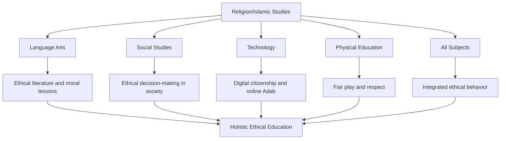
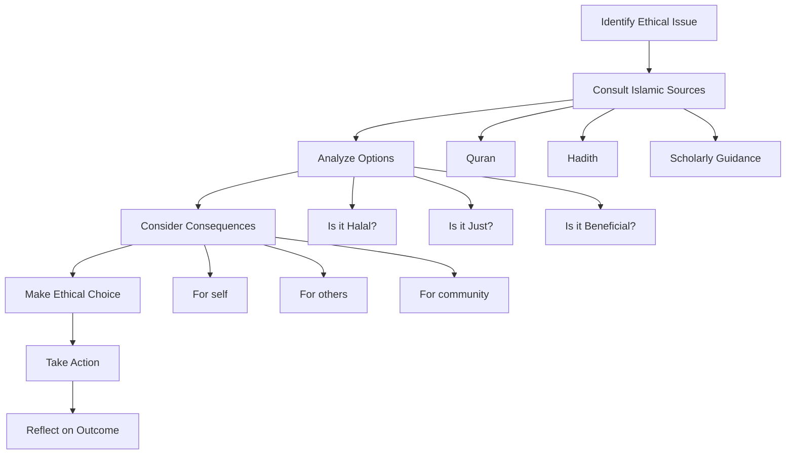

# Islamic Ethics Integration in Education

**Document Title:** Islamic Ethics Integration in Education
**Document ID:** IS_ETH_001
**Version:** 1.0
**Date:** 2026-01-11
**Project Name:** Smart Academy Digital Web Portal Development
**Content Category:** Islamic Studies Content

---

## Table of Contents

1. [Overview](#1-overview)
2. [Integration Philosophy](#2-integration-philosophy)
3. [Integration Framework](#3-integration-framework)
4. [Subject-Specific Integration](#4-subject-specific-integration)
5. [Teaching Strategies](#5-teaching-strategies)
6. [Lesson Planning](#6-lesson-planning)
7. [Assessment & Evaluation](#7-assessment--evaluation)
8. [Teacher Training](#8-teacher-training)
9. [Parent Engagement](#9-parent-engagement)
10. [FAQs](#10-faqs)

---

## 1. Overview

This document outlines Smart Academy's approach to integrating Islamic ethics across the curriculum. The integration is grounded in the belief that ethical behavior is not merely a set of rules but a way of life rooted in faith, character, and consciousness of Allah. Through the Re-STEAM framework (Religion + STEAM), students learn to apply Islamic ethical principles in all areas of learning and life.

### 1.1 Philosophy

The Islamic philosophy of ethics education at Smart Academy is based on several fundamental principles:

- **Taqwa (God-Consciousness)**: Ethical behavior stems from consciousness of Allah and awareness that He sees all actions.
- **Ihsan (Excellence)**: Striving for excellence in all actions, knowing that Allah loves those who do good.
- **Adab (Etiquette)**: Proper conduct and respect in all interactions, reflecting Islamic manners.
- **Amanah (Trust)**: Fulfilling trusts and responsibilities with integrity and accountability.
- **Ikhlas (Sincerity)**: Performing all actions sincerely for Allah's pleasure, not for recognition or reward.
- **Balance**: Integrating ethical principles across all subjects while maintaining academic excellence.

### 1.2 Goals

The integration of Islamic ethics across the curriculum aims to achieve the following goals:

**Knowledge Goals:**
- Understand Islamic ethical principles from Quran and Sunnah
- Learn the foundations of Islamic ethics and their applications
- Recognize ethical dimensions in all academic subjects
- Understand the importance of ethics in personal and professional life

**Skills Goals:**
- Apply Islamic ethical principles to decision-making
- Analyze ethical dilemmas from an Islamic perspective
- Practice Islamic etiquette (Adab) in various contexts
- Develop moral reasoning and ethical problem-solving skills

**Character Goals:**
- Internalize Islamic ethical values in daily life
- Develop strong moral character based on Islamic teachings
- Cultivate habits of ethical behavior
- Become role models of Islamic ethics in the community

---

## 2. Integration Philosophy

### 2.1 Islamic Foundations

The integration of Islamic ethics is founded on authentic Islamic sources:

**Quranic Foundations:**

> "Indeed, Allah commands you to render trusts to whom they are due and when you judge between people to judge with justice. Excellent is that which Allah instructs you. Indeed, Allah is ever Hearing and Seeing."
> — Quran 4:58

> "And speak to people good [words] and establish prayer and give Zakah."
> — Quran 2:83

> "O you who have believed, avoid much [negative] assumption. Indeed, some assumption is sin. And do not spy or backbite each other, and do not backbite each other. Would one of you like to eat the flesh of his brother when dead? You would detest it."
> — Quran 49:12

> "And the servants of the Most Merciful are those who walk upon the earth easily, and when the ignorant address them [harshly], they say [words of] peace."
> — Quran 25:63

> "And whoever fears Allah - He will make for him a way out and will provide for him from where he does not expect."
> — Quran 65:2-3

**Hadith Foundations:**

> "The most complete of the believers in faith is the one with the best character, and the best of you are the best in behavior to their women."
> — Sunan al-Tirmidhi, Book 46, Hadith 1162

> "None of you truly believes until he loves for his brother what he loves for himself."
> — Sahih Bukhari, Book 2, Hadith 12

> "The strong person is not the one who can wrestle someone else down. The strong person is the one who can control himself when he is angry."
> — Sahih Bukhari, Book 73, Hadith 135

> "Truthfulness leads to righteousness, and righteousness leads to Paradise."
> — Sahih Bukhari, Book 73, Hadith 104

> "Your smile in the face of your brother is charity."
> — Sunan al-Tirmidhi, Book 37, Hadith 1956

### 2.2 Re-STEAM Framework Integration

The Re-STEAM framework (Religion + STEAM) provides the structural foundation for integrating Islamic ethics across the curriculum:

**Key Integration Points:**

1. **Language Arts**: Reading literature with moral lessons and Islamic values
2. **Social Studies**: Ethical decision-making in social contexts
3. **Technology**: Digital citizenship and online Islamic etiquette (Adab)
4. **Physical Education**: Fair play, respect for opponents, and sportsmanship
5. **All Subjects**: Integrated ethical behavior in learning and interactions

---

## 3. Integration Framework

### 3.1 Age-Appropriate Integration

The integration of Islamic ethics is tailored to three developmental stages:

#### Early Childhood (3-6 years)

**Focus Areas:**
- Basic manners (Salam, saying please and thank you)
- Sharing and kindness
- Respect for teachers and peers
- Honesty and truthfulness
- Caring for others

**Integration Examples:**
- Learning to say Assalamu Alaikum
- Sharing toys and materials
- Being kind to classmates
- Telling the truth
- Helping others

#### Primary Level (6-11 years)

**Focus Areas:**
- Respect for elders and teachers
- Honesty in work and relationships
- Kindness to animals and the environment
- Fairness and justice
- Responsibility and accountability

**Integration Examples:**
- Showing respect to teachers and elders
- Being honest in tests and assignments
- Treating animals with kindness
- Playing fairly with others
- Taking responsibility for actions

#### Secondary Level (11-16 years)

**Focus Areas:**
- Ethical decision-making in complex situations
- Integrity in academic and personal life
- Respect for diversity and differences
- Social responsibility and community service
- Ethical use of technology and media

**Integration Examples:**
- Making ethical choices in difficult situations
- Maintaining academic integrity
- Respecting people of different backgrounds
- Participating in community service
- Using technology ethically and responsibly

### 3.2 Integration Matrix

| Grade Level | Subject Area | Ethical Integration | Quranic Reference | Key Islamic Concept |
|-------------|---------------|---------------------|-------------------|-------------------|
| Early Childhood | All Subjects | Basic manners and respect | Quran 17:23-24 | Adab (Etiquette) |
| Early Childhood | Play/Activities | Sharing and kindness | Quran 107:1-3 | Ihsan (Kindness) |
| Primary | Language Arts | Truthful communication | Quran 33:70 | Sidq (Truthfulness) |
| Primary | Mathematics | Honesty in calculations | Quran 83:1-3 | Amanah (Trust) |
| Primary | Social Studies | Fairness and justice | Quran 5:8 | Adl (Justice) |
| Secondary | Technology | Digital ethics | Quran 49:12 | Husn al-Zann (Good assumption) |
| Secondary | Science | Ethical research | Quran 17:36 | Verification |
| Secondary | All Subjects | Academic integrity | Quran 2:42 | Ikhlas (Sincerity) |
| Secondary | Physical Education | Fair play and respect | Quran 5:8 | Respect and fairness |

---

## 4. Subject-Specific Integration

### 4.1 Language Arts: Reading Literature with Moral Lessons

**Islamic Perspective:**
Language Arts education at Smart Academy emphasizes reading literature that promotes Islamic values and ethical behavior. Students learn to analyze literary works through an Islamic worldview and draw moral lessons from stories and texts.

**Key Integration Points:**

**Ethical Themes in Literature:**

| Ethical Theme | Islamic Value | Literary Examples |
|---------------|--------------|------------------|
| **Honesty** | Sidq (Truthfulness) | Stories about truth-tellers |
| **Kindness** | Ihsan (Kindness) | Stories about helping others |
| **Courage** | Shaja'ah (Courage) | Stories about standing for truth |
| **Patience** | Sabr (Patience) | Stories about overcoming challenges |
| **Forgiveness** | Afw (Forgiveness) | Stories about reconciliation |
| **Justice** | Adl (Justice) | Stories about fairness |
| **Humility** | Tawadu (Humility) | Stories about modest characters |
| **Generosity** | Karam (Generosity) | Stories about giving |

**Quranic Connections:**

> "Indeed, Allah orders justice and good conduct and giving to relatives and forbids immorality and bad conduct and oppression. He admonishes you that perhaps you will be reminded."
> — Quran 16:90

> "And speak to people good [words] and establish prayer and give Zakah."
> — Quran 2:83

> "And the servants of the Most Merciful are those who walk upon the earth easily, and when the ignorant address them [harshly], they say [words of] peace."
> — Quran 25:63

**Lesson Example: Analyzing Stories for Ethical Lessons**

**Objective:** Students will analyze a story to identify ethical lessons and connect them to Islamic values.

**Islamic Integration:**
- Read a story with clear ethical themes
- Identify the moral lesson of the story
- Connect the lesson to Islamic values and teachings
- Reflect on how to apply the lesson in daily life

**Activity:**
- Read and analyze the story
- Identify ethical dilemmas and solutions
- Create a moral lesson chart
- Write a reflection on personal application

### 4.2 Social Studies: Ethical Decision-Making

**Islamic Perspective:**
Social Studies education at Smart Academy emphasizes ethical decision-making in social contexts. Students learn to analyze social issues from an Islamic perspective and make ethical choices that benefit the community.

**Key Integration Points:**

**Ethical Decision-Making Framework:**

**Social Ethical Issues:**

| Issue | Islamic Perspective | Quranic Reference | Key Principle |
|-------|-------------------|-------------------|---------------|
| **Environmental Protection** | Stewardship (Khalifah) | Quran 7:31 | Protecting creation |
| **Social Justice** | Justice (Adl) | Quran 5:8 | Fair treatment for all |
| **Helping the Poor** | Charity (Sadaqah) | Quran 2:177 | Generosity and compassion |
| **Respecting Elders** | Honor and respect | Quran 17:23-24 | Respect for parents and elders |
| **Honesty in Business** | Honest trade | Quran 2:188 | Ethical business practices |
| **Community Service** | Serving others | Quran 5:2 | Helping the community |
| **Respecting Diversity** | Unity in diversity | Quran 49:13 | Respect for differences |
| **Conflict Resolution** | Peaceful resolution | Quran 49:9-10 | Reconciliation and peace |

**Quranic Connections:**

> "O you who have believed, be persistently standing firm for Allah, witnesses in justice, and do not let the hatred of a people prevent you from being just. Be just; that is nearer to righteousness."
> — Quran 5:8

> "And cooperate in righteousness and piety, but do not cooperate in sin and aggression."
> — Quran 5:2

> "The believers are but brothers, so make settlement between your brothers."
> — Quran 49:10

**Lesson Example: Ethical Decision-Making in Social Situations**

**Objective:** Students will apply Islamic ethical principles to make decisions in social situations.

**Islamic Integration:**
- Present a social scenario with ethical dimensions
- Guide students through the decision-making framework
- Consult Islamic sources for guidance
- Make an ethical decision and justify it

**Activity:**
- Analyze the scenario
- Identify the ethical issue
- Research relevant Islamic teachings
- Make a decision and present justification

### 4.3 Technology: Digital Citizenship and Online Islamic Etiquette (Adab)

**Islamic Perspective:**
Technology education at Smart Academy emphasizes ethical use of technology and digital citizenship. Students learn to apply Islamic etiquette (Adab) to online interactions and use technology responsibly.

**Key Integration Points:**

**Digital Ethics Principles:**

| Principle | Islamic Value | Online Application |
|-----------|---------------|-------------------|
| **Truthfulness** | Sidq | Being honest online |
| **Respect** | Ihtiram | Respecting others online |
| **Privacy** | Hurmah | Respecting others' privacy |
| **Kindness** | Ihsan | Being kind in online communication |
| **Moderation** | I'tidal | Balanced use of technology |
| **Accountability** | Mas'uliyyah | Taking responsibility for online actions |
| **Avoiding Harm** | Darar | Not causing harm online |
| **Verification** | Taba'yun | Verifying information before sharing |

**Online Islamic Etiquette (Adab):**

1. **Communication Etiquette:**
   - Use respectful language
   - Avoid gossip and backbiting (Ghibah)
   - Verify information before sharing
   - Respond with kindness even to harsh messages

2. **Privacy and Respect:**
   - Respect others' privacy
   - Do not share others' information without permission
   - Avoid spying or prying into others' affairs
   - Protect your own privacy appropriately

3. **Content Sharing:**
   - Share only beneficial and truthful content
   - Avoid sharing inappropriate material
   - Give credit to sources
   - Be mindful of the impact of shared content

4. **Time Management:**
   - Use technology in moderation
   - Prioritize important responsibilities
   - Avoid excessive screen time
   - Balance online and offline activities

**Quranic Connections:**

> "O you who have believed, avoid much [negative] assumption. Indeed, some assumption is sin. And do not spy or backbite each other, and do not backbite each other. Would one of you like to eat the flesh of his brother when dead? You would detest it."
> — Quran 49:12

> "And do not pursue that of which you have no knowledge. Indeed, the hearing, the sight and the heart - about all those [one] will be questioned."
> — Quran 17:36

> "And the servants of the Most Merciful are those who walk upon the earth easily, and when the ignorant address them [harshly], they say [words of] peace."
> — Quran 25:63

**Lesson Example: Digital Citizenship and Islamic Adab**

**Objective:** Students will understand Islamic etiquette for online interactions and apply it to digital communication.

**Islamic Integration:**
- Study Quranic teachings about speech and communication
- Learn about online etiquette from an Islamic perspective
- Analyze online scenarios for ethical behavior
- Practice Islamic Adab in online communication

**Activity:**
- Create a digital etiquette guide
- Analyze online communication scenarios
- Practice respectful online responses
- Develop a personal digital ethics pledge

### 4.4 Physical Education: Fair Play, Respect for Opponents

**Islamic Perspective:**
Physical Education at Smart Academy emphasizes fair play, respect, and sportsmanship. Students learn to apply Islamic values in sports and physical activities, treating opponents with respect and playing with integrity.

**Key Integration Points:**

**Sports Ethics from Islamic Perspective:**

| Ethical Principle | Islamic Value | Application in Sports |
|-------------------|---------------|----------------------|
| **Fair Play** | Adl (Justice) | Playing by the rules |
| **Respect** | Ihtiram | Respecting opponents and officials |
| **Humility** | Tawadu (Humility) | Being humble in victory and gracious in defeat |
| **Self-Control** | Hilm (Forbearance) | Controlling anger and frustration |
| **Teamwork** | Ta'awun (Cooperation) | Working together as a team |
| **Excellence** | Ihsan (Excellence) | Striving for excellence |
| **Moderation** | I'tidal (Balance) | Balanced approach to competition |
| **Gratitude** | Shukr (Gratitude) | Being grateful for abilities and opportunities |

**Islamic Sportsmanship Guidelines:**

1. **Before the Game:**
   - Make intention (Niyyah) for health and character building
   - Prepare properly and respect the rules
   - Treat opponents with respect
   - Remember Allah in all actions

2. **During the Game:**
   - Play fairly and honestly
   - Respect officials and their decisions
   - Help injured opponents
   - Control anger and frustration
   - Encourage teammates positively

3. **After the Game:**
   - Shake hands with opponents
   - Accept victory with humility
   - Accept defeat with grace
   - Thank Allah for the opportunity
   - Reflect on lessons learned

**Quranic Connections:**

> "And not equal are the good deed and the bad. Repel [evil] by that [deed] which is better; and thereupon the one whom between you and him is enmity [will become] as though he was a devoted friend."
> — Quran 41:34

> "And the servants of the Most Merciful are those who walk upon the earth easily, and when the ignorant address them [harshly], they say [words of] peace."
> — Quran 25:63

> "And whoever is patient and forgives - indeed, that is of the matters [requiring] determination."
> — Quran 42:43

**Lesson Example: Islamic Sportsmanship**

**Objective:** Students will understand and apply Islamic principles of sportsmanship in physical activities.

**Islamic Integration:**
- Study Islamic teachings about behavior and character
- Learn about sportsmanship from an Islamic perspective
- Analyze sports scenarios for ethical behavior
- Practice Islamic values in physical activities

**Activity:**
- Create a sportsmanship code based on Islamic values
- Analyze sports scenarios for ethical behavior
- Role-play various sports situations
- Reflect on personal behavior in sports

---

## 5. Teaching Strategies

### 5.1 Modeling Islamic Ethics

**Strategy Description:**
Teachers model Islamic ethics through their behavior, creating a powerful example for students to follow. Modeling is one of the most effective ways to teach ethical behavior.

**Implementation Steps:**

1. **Demonstrate Islamic Manners:**
   - Greet students with Assalamu Alaikum
   - Show respect to all students
   - Speak kindly and respectfully
   - Listen actively to students

2. **Practice What You Teach:**
   - Demonstrate honesty in all interactions
   - Show fairness in grading and discipline
   - Admit mistakes and apologize when wrong
   - Keep promises and commitments

3. **Create Ethical Classroom Environment:**
   - Establish clear ethical expectations
   - Encourage respectful communication
   - Promote a culture of kindness
   - Address unethical behavior appropriately

### 5.2 Ethical Dilemma Discussions

**Strategy Description:**
Ethical dilemma discussions engage students in analyzing complex situations and making ethical decisions based on Islamic principles.

**Implementation Steps:**

1. **Present the Dilemma:**
   - Choose age-appropriate scenarios
   - Present the situation clearly
   - Identify the ethical dimensions
   - Explain the consequences of different choices

2. **Guide Analysis:**
   - Help students identify the ethical issue
   - Encourage consultation of Islamic sources
   - Guide analysis of options
   - Consider consequences for all stakeholders

3. **Facilitate Decision-Making:**
   - Encourage students to make ethical choices
   - Justify choices with Islamic principles
   - Discuss alternative perspectives
   - Reflect on the decision-making process

**Ethical Dilemma Examples:**

**Primary Level:**
- You find a wallet with money. What do you do?
- Your friend asks you to cheat on a test. What do you do?
- You see someone being bullied. What do you do?

**Secondary Level:**
- You discover your friend is using someone else's work. What do you do?
- You have the opportunity to help someone but it will inconvenience you. What do you do?
- You witness an injustice but speaking up could cause problems. What do you do?

### 5.3 Role-Playing Ethical Scenarios

**Strategy Description:**
Role-playing allows students to practice ethical behavior in simulated situations, developing skills they can apply in real life.

**Implementation Steps:**

1. **Select Scenarios:**
   - Choose relevant ethical scenarios
   - Ensure scenarios are age-appropriate
   - Include diverse situations
   - Align with Islamic values

2. **Assign Roles:**
   - Distribute roles to students
   - Provide context and background
   - Explain objectives
   - Set time limits

3. **Conduct Role-Play:**
   - Students act out scenarios
   - Apply Islamic ethics in actions
   - Practice respectful communication
   - Demonstrate ethical decision-making

4. **Debrief and Reflect:**
   - Discuss what happened
   - Analyze ethical choices
   - Connect to Islamic principles
   - Reflect on learning

**Role-Play Scenario Examples:**

1. **Resolving Conflict:**
   - Two students have a disagreement
   - Practice Islamic conflict resolution
   - Use respectful communication
   - Seek fair solutions

2. **Standing Up for Justice:**
   - Witnessing unfair treatment
   - Deciding whether to speak up
   - Using Islamic principles to guide action
   - Practicing courage and wisdom

3. **Helping Others:**
   - Seeing someone in need
   - Deciding how to help
   - Balancing personal needs with helping others
   - Practicing generosity and compassion

### 5.4 Service Learning Projects

**Strategy Description:**
Service learning projects combine academic learning with community service, allowing students to apply Islamic ethics in real-world situations.

**Implementation Steps:**

1. **Identify Community Needs:**
   - Assess community needs
   - Consult with community members
   - Identify areas where students can help
   - Align with Islamic values of service

2. **Plan the Project:**
   - Set clear objectives
   - Define roles and responsibilities
   - Establish timelines
   - Plan for reflection

3. **Implement the Project:**
   - Execute the service project
   - Apply Islamic ethics throughout
   - Work collaboratively
   - Document the process

4. **Reflect and Celebrate:**
   - Reflect on the experience
   - Connect to Islamic teachings
   - Celebrate achievements
   - Plan for continued service

**Service Learning Project Examples:**

1. **Environmental Clean-Up:**
   - Clean up local areas
   - Apply stewardship (Khalifah) principles
   - Learn about environmental ethics
   - Benefit the community

2. **Tutoring Younger Students:**
   - Help younger students with studies
   - Practice patience and kindness
   - Apply teaching ethics
   - Share knowledge (Ilm)

3. **Visiting Elderly:**
   - Visit elderly care facilities
   - Practice respect and kindness
   - Learn from elders
   - Apply Islamic etiquette (Adab)

### 5.5 Reflective Journaling

**Strategy Description:**
Reflective journaling helps students internalize Islamic ethical principles by reflecting on their experiences and decisions.

**Implementation Steps:**

1. **Provide Journal Prompts:**
   - Create thought-provoking prompts
   - Connect to Islamic teachings
   - Encourage honest reflection
   - Make prompts age-appropriate

2. **Guide Reflection:**
   - Encourage regular journaling
   - Provide feedback on entries
   - Share insights (with permission)
   - Connect reflections to Islamic values

3. **Use Journals for Growth:**
   - Track progress in ethical development
   - Identify areas for improvement
   - Celebrate growth
   - Set goals for continued development

**Journal Prompt Examples:**

1. **Daily Reflection:**
   - "What ethical choice did I make today?"
   - "How did I show kindness today?"
   - "What could I have done better today?"

2. **Scenario Reflection:**
   - "How would I handle this situation according to Islamic ethics?"
   - "What Islamic principle guides this decision?"
   - "What are the consequences of this choice?"

3. **Personal Growth:**
   - "In what area of my character do I want to improve?"
   - "How can I practice this Islamic value more?"
   - "What steps will I take to improve?"

---

## 6. Lesson Planning

### 6.1 Lesson Planning Template

**Islamic-Integrated Ethics Lesson Plan**

| Section | Content |
|---------|---------|
| **Lesson Title** | [Title with Islamic connection] |
| **Grade Level** | [Early Childhood/Primary/Secondary] |
| **Duration** | [Time] |
| **Subject Area** | [Subject integrating ethics] |
| **Ethical Integration** | [Islamic ethical principle] |
| **Quranic Reference** | [Relevant verse(s)] |
| **Learning Objectives** | [Knowledge, Skills, Character] |
| **Materials Needed** | [List of materials] |
| **Key Vocabulary** | [Ethical and Islamic terms] |

**Lesson Procedure:**

1. **Introduction (5-10 minutes)**
   - Hook: Engaging question or scenario
   - Islamic connection: Introduce the ethical principle
   - Objectives: Share learning goals

2. **Direct Instruction (10-15 minutes)**
   - Present the ethical principle
   - Connect to Quranic verses or Hadith
   - Provide examples and applications
   - Show relevance to students' lives

3. **Guided Practice (15-20 minutes)**
   - Demonstrate ethical analysis
   - Guide students through scenarios
   - Facilitate Islamic reflections
   - Encourage questions and discussion

4. **Independent Practice (15-20 minutes)**
   - Students work independently or in groups
   - Apply ethical principles
   - Make ethical decisions
   - Document learning

5. **Closure (5-10 minutes)**
   - Review key concepts
   - Reinforce Islamic integration
   - Student reflections
   - Preview next lesson

**Assessment:**
- [Formative assessment methods]
- [Summative assessment methods]
- [Ethical understanding assessment]

**Differentiation:**
- [For advanced learners]
- [For struggling learners]
- [For students with special needs]

**Homework/Extension:**
- [Reinforcement activities]
- [Extension activities]
- [Islamic practice connections]

### 6.2 Sample Lesson Plans

#### Sample Lesson 1: Honesty - The Foundation of Trust

**Grade Level:** Primary (8-9 years)
**Duration:** 45 minutes
**Subject Area:** Language Arts / Character Education
**Ethical Integration:** Sidq (Truthfulness) and Amanah (Trust)

**Learning Objectives:**
- **Knowledge:** Understand the importance of honesty
- **Skills:** Practice honest communication
- **Character:** Develop commitment to truthfulness

**Quranic Reference:**
> "O you who have believed, fear Allah and be with the truthful."
> — Quran 9:119

**Materials:**
- Story about honesty
- Role-play cards
- Reflection journals
- Colored pencils

**Procedure:**

**Introduction (5 minutes):**
- Ask: "Why is honesty important?"
- Discuss the concept of trust
- Introduce Sidq (truthfulness) as an Islamic value

**Direct Instruction (10 minutes):**
- Tell a story about honesty
- Explain the Islamic value of Sidq
- Connect to Quran: "Be with the truthful"
- Discuss: How does honesty build trust?

**Guided Practice (15 minutes):**
- Students analyze the story
- Discuss the consequences of honesty and dishonesty
- Guide reflection: When is it hard to be honest?
- Discuss: What does Islam say about honesty?

**Independent Practice (15 minutes):**
- Students role-play honest and dishonest scenarios
- Write reflections on honesty
- Create a poster about honesty

**Closure (5 minutes):**
- Review the importance of honesty
- Ask: "How can we practice honesty daily?"
- Students share one commitment

**Assessment:**
- Formative: Participation in discussion
- Summative: Reflection and poster
- Islamic: Commitment to honesty

#### Sample Lesson 2: Digital Ethics - Online Islamic Adab

**Grade Level:** Secondary (13-14 years)
**Duration:** 60 minutes
**Subject Area:** Technology / ICT
**Ethical Integration:** Online Adab (Etiquette) and Husn al-Zann (Good Assumption)

**Learning Objectives:**
- **Knowledge:** Understand Islamic etiquette for online communication
- **Skills:** Apply Islamic Adab to online interactions
- **Character:** Develop responsible digital citizenship

**Quranic Reference:**
> "O you who have believed, avoid much [negative] assumption. Indeed, some assumption is sin. And do not spy or backbite each other."
> — Quran 49:12

**Materials:**
- Online communication scenarios
- Digital ethics guidelines
- Reflection worksheets
- Presentation software

**Procedure:**

**Introduction (10 minutes):**
- Ask: "How do we communicate online?"
- Discuss the importance of online etiquette
- Introduce Islamic Adab for online communication

**Direct Instruction (15 minutes):**
- Present Islamic teachings about communication
- Explain online ethical principles
- Connect to Quran: Avoid negative assumption and backbiting
- Discuss: How do Islamic principles apply online?

**Guided Practice (15 minutes):**
- Students analyze online scenarios
- Guide application of Islamic Adab
- Discuss: What would be the ethical response?
- Analyze consequences of different responses

**Independent Practice (15 minutes):**
- Students create a digital ethics guide
- Develop personal online etiquette pledge
- Design presentations on Islamic digital citizenship

**Closure (5 minutes):**
- Review key principles of online Adab
- Ask: "How will you practice Islamic Adab online?"
- Students share commitments

**Assessment:**
- Formative: Participation in analysis
- Summative: Digital ethics guide
- Islamic: Online etiquette pledge

#### Sample Lesson 3: Fair Play - Sportsmanship in Islam

**Grade Level:** All levels (adapted)
**Duration:** 50 minutes
**Subject Area:** Physical Education
**Ethical Integration:** Adl (Justice) and Ihsan (Excellence)

**Learning Objectives:**
- **Knowledge:** Understand Islamic principles of sportsmanship
- **Skills:** Practice fair play and respect in sports
- **Character:** Develop good sportsmanship

**Quranic Reference:**
> "And not equal are the good deed and the bad. Repel [evil] by that [deed] which is better."
> — Quran 41:34

**Materials:**
- Sports equipment
- Sportsmanship scenarios
- Reflection journals
- Awards/recognition materials

**Procedure:**

**Introduction (5 minutes):**
- Ask: "What makes a good sportsperson?"
- Discuss the concept of fair play
- Introduce Islamic values in sports

**Direct Instruction (10 minutes):**
- Explain Islamic principles of sportsmanship
- Present examples from Prophet's (PBUH) teachings
- Connect to Quran: Repel evil with good
- Discuss: How do Islamic values apply in sports?

**Guided Practice (15 minutes):**
- Students participate in sports activities
- Guide application of fair play principles
- Discuss: How can we show respect to opponents?
- Practice good sportsmanship

**Independent Practice (15 minutes):**
- Students create a sportsmanship code
- Role-play sports scenarios
- Write reflections on sportsmanship

**Closure (5 minutes):**
- Review key principles of sportsmanship
- Ask: "How will you practice good sportsmanship?"
- Students share commitments

**Assessment:**
- Formative: Observation during activities
- Summative: Sportsmanship code
- Islamic: Reflection on character

### 6.3 Weekly Integration Schedule

| Week | Ethical Principle | Subject Integration | Quranic Reference | Key Activity |
|------|-------------------|---------------------|-------------------|--------------|
| 1 | Introduction to Ethics | All Subjects | Quran 16:90 | What is ethics? |
| 2 | Sidq (Truthfulness) | Language Arts | Quran 9:119 | Honesty stories |
| 3 | Amanah (Trust) | Mathematics | Quran 23:8-9 | Trust in work |
| 4 | Adl (Justice) | Social Studies | Quran 5:8 | Fairness activities |
| 5 | Ihsan (Kindness) | All Subjects | Quran 2:195 | Kindness project |
| 6 | Sabr (Patience) | All Subjects | Quran 2:153 | Patience practice |
| 7 | Shukr (Gratitude) | All Subjects | Quran 14:7 | Gratitude journal |
| 8 | Tawadu (Humility) | All Subjects | Quran 25:63 | Humility practice |
| 9 | Karam (Generosity) | Social Studies | Quran 2:177 | Charity project |
| 10 | Afw (Forgiveness) | Language Arts | Quran 42:40 | Forgiveness stories |
| 11 | Adab (Etiquette) | All Subjects | Quran 25:63 | Manners practice |
| 12 | Husn al-Zann (Good Assumption) | Technology | Quran 49:12 | Online etiquette |
| 13 | Hilm (Forbearance) | Physical Education | Quran 3:134 | Self-control practice |
| 14 | Ikhlas (Sincerity) | All Subjects | Quran 98:5 | Sincerity reflection |
| 15 | Wafa (Loyalty) | Social Studies | Quran 5:1 | Loyalty scenarios |
| 16 | Ta'awun (Cooperation) | All Subjects | Quran 5:2 | Teamwork activities |
| 17 | Shura (Consultation) | All Subjects | Quran 42:38 | Group decisions |
| 18 | Amr bil-Ma'ruf (Enjoining Good) | Social Studies | Quran 3:104 | Community service |
| 19 | Nahy anil-Munkar (Forbidding Evil) | Social Studies | Quran 3:104 | Standing for justice |
| 20 | Birr al-Walidayn (Dutifulness to Parents) | All Subjects | Quran 17:23-24 | Respect activities |
| 21 | Silat ar-Rahim (Maintaining Ties) | Social Studies | Quran 47:22 | Family connections |
| 22 | Ihsan to Neighbors | All Subjects | Quran 4:36 | Neighbor project |
| 23 | Respect for Teachers | All Subjects | Quran 58:11 | Teacher appreciation |
| 24 | Respect for Elders | All Subjects | Quran 17:23-24 | Elder respect activities |
| 25 | Kindness to Animals | Science | Quran 6:38 | Animal care project |
| 26 | Environmental Ethics | Science | Quran 7:31 | Environmental project |
| 27 | Academic Integrity | All Subjects | Quran 2:42 | Honesty in work |
| 28 | Digital Ethics | Technology | Quran 49:12 | Online behavior |
| 29 | Sportsmanship | Physical Education | Quran 5:8 | Fair play activities |
| 30 | Review & Celebration | All Subjects | Multiple | Ethics fair |

---

## 7. Assessment & Evaluation

### 7.1 Assessment Framework

**Holistic Assessment Approach:**

Assessment in Islamic ethics education evaluates three dimensions:

1. **Ethical Understanding**: Knowledge of Islamic ethical principles
2. **Application Skills**: Ability to apply ethics in various situations
3. **Character Development**: Internalization of Islamic ethical values

**Assessment Types:**

| Assessment Type | Purpose | Example |
|-----------------|---------|---------|
| **Diagnostic** | Identify prior ethical understanding | Pre-test on ethical concepts |
| **Formative** | Monitor progress and provide feedback | Observation during activities, exit tickets |
| **Summative** | Evaluate learning at end of unit | Tests, projects, presentations |
| **Authentic** | Apply learning in real-world contexts | Service projects, ethical dilemmas |

### 7.2 Assessment Rubrics

#### Rubric 1: Ethical Understanding with Islamic Integration

| Criteria | Excellent (4) | Proficient (3) | Developing (2) | Beginning (1) |
|----------|---------------|----------------|----------------|---------------|
| **Ethical Knowledge** | Demonstrates deep understanding of Islamic ethical principles | Shows good understanding of principles | Shows basic understanding | Shows limited understanding |
| **Islamic Integration** | Makes insightful connections to Quran/Hadith | Makes appropriate connections | Makes basic connections | Makes minimal or no connections |
| **Critical Analysis** | Analyzes complex ethical situations | Analyzes situations appropriately | Identifies ethical issues | Limited analysis |
| **Communication** | Explains clearly with examples | Explains clearly | Explains with limited clarity | Unclear explanation |

#### Rubric 2: Ethical Application Assessment

| Criteria | Excellent (4) | Proficient (3) | Developing (2) | Beginning (1) |
|----------|---------------|----------------|----------------|---------------|
| **Decision-Making** | Consistently makes ethical decisions based on Islamic principles | Frequently makes ethical decisions | Sometimes makes ethical decisions | Rarely makes ethical decisions |
| **Behavior** | Consistently demonstrates ethical behavior | Frequently demonstrates ethical behavior | Sometimes demonstrates ethical behavior | Rarely demonstrates ethical behavior |
| **Problem-Solving** | Effectively solves ethical dilemmas | Solves ethical dilemmas appropriately | Attempts to solve dilemmas | Limited problem-solving |
| **Reflection** | Deep reflection on ethical choices | Good reflection on choices | Basic reflection | Minimal reflection |

#### Rubric 3: Character Development Assessment

| Criteria | Excellent (4) | Proficient (3) | Developing (2) | Beginning (1) |
|----------|---------------|----------------|----------------|---------------|
| **Consistency** | Consistently demonstrates Islamic ethical values | Frequently demonstrates values | Sometimes demonstrates values | Rarely demonstrates values |
| **Self-Awareness** | Highly aware of ethical strengths and areas for growth | Good self-awareness | Some self-awareness | Limited self-awareness |
| **Growth** | Demonstrates significant growth in character | Shows good growth | Shows some growth | Limited growth |
| **Influence** | Positively influences others' ethical behavior | Sometimes influences others | Rarely influences others | No influence demonstrated |

### 7.3 Assessment Methods

#### 1. Written Assessments

**Tests and Quizzes:**
- Include questions about Islamic ethical principles
- Example format:
  - Multiple choice: Ethical concepts
  - Short answer: Explain ethical principles
  - Essay: Analyze ethical dilemmas
  - Quran/Hadith identification: Match verses to ethical principles

**Example Questions:**

**Multiple Choice:**
1. What is the Islamic term for truthfulness?
   a) Sabr
   b) Sidq
   c) Shukr
   d) Sabr

2. According to the Quran, what should we avoid in our speech?
   a) Kindness
   b) Backbiting
   c) Truth
   d) Respect

**Short Answer:**
1. Explain the Islamic value of Amanah and give an example of how to practice it.
2. What does Islam teach about treating neighbors?

**Essay:**
"Discuss the importance of honesty (Sidq) in Islam. How does honesty contribute to building trust in society? Use Quranic verses and Hadith to support your answer."

#### 2. Performance Assessments

**Role-Playing:**
- Act out ethical scenarios
- Demonstrate Islamic ethical behavior
- Practice decision-making
- Receive feedback on performance

**Ethical Dilemma Analysis:**
- Analyze complex ethical situations
- Apply Islamic principles
- Make and justify ethical decisions
- Reflect on the decision-making process

**Service Learning Projects:**
- Plan and execute service projects
- Apply Islamic ethics in real-world situations
- Document the process and outcomes
- Reflect on learning and impact

#### 3. Portfolio Assessment

**Portfolio Components:**
- Ethical reflection journals
- Analysis of ethical dilemmas
- Service learning documentation
- Personal ethical development plans
- Creative work (poems, artwork, videos)

**Portfolio Review Process:**
- Student self-assessment
- Peer review
- Teacher assessment
- Parent/guardian review (optional)

#### 4. Observational Assessment

**Teacher Observation Checklist:**

| Behavior | Always | Sometimes | Rarely | Comments |
|----------|--------|-----------|--------|----------|
| Demonstrates honesty in work | | | | |
| Shows respect to teachers and peers | | | | |
| Practices kindness to others | | | | |
| Takes responsibility for actions | | | | |
| Demonstrates fairness in interactions | | | | |
| Controls anger appropriately | | | | |
| Helps others in need | | | | |
| Uses respectful language | | | | |

#### 5. Self-Assessment

**Student Reflection Journal Prompts:**

1. What ethical choice did I make today? How does it align with Islamic teachings?
2. In what area of my character do I want to improve?
3. How did I demonstrate [specific Islamic value] this week?
4. What ethical challenge did I face? How did I handle it?
5. What can I do to improve my ethical behavior?

### 7.4 Feedback Strategies

**Effective Feedback Principles:**

1. **Timely**: Provide feedback soon after assessment
2. **Specific**: Address specific strengths and areas for improvement
3. **Balanced**: Include both positive and constructive feedback
4. **Actionable**: Provide clear steps for improvement
5. **Islamic Context**: Frame feedback in Islamic terms when appropriate

**Feedback Examples:**

**Positive Feedback:**
- "Excellent analysis of the ethical dilemma. Your application of Islamic principles demonstrates deep understanding and maturity."
- "You consistently demonstrate honesty and integrity in your work. This is a reflection of strong Islamic character."

**Constructive Feedback:**
- "Good understanding of the ethical principle. To strengthen your application, try to consider more perspectives before making a decision."
- "Your reflection shows awareness of ethical issues. To deepen your understanding, try to connect your experiences to specific Quranic teachings."

---

## 8. Teacher Training

### 8.1 Training Requirements

**Essential Training Components:**

1. **Islamic Ethics Foundation:**
   - Understanding of Islamic ethical principles from Quran and Sunnah
   - Knowledge of key Islamic values and their applications
   - Understanding of Islamic character development
   - Familiarity with Islamic etiquette (Adab)

2. **Pedagogical Skills:**
   - Integration strategies for Islamic ethics
   - Methods for teaching ethical decision-making
   - Differentiated instruction for ethics education
   - Assessment methods for character development

3. **Character Modeling:**
   - Modeling Islamic ethics in teaching
   - Creating an ethical classroom environment
   - Guiding students in character formation
   - Facilitating ethical discussions

4. **Ethical Sensitivity:**
   - Recognizing ethical issues in various contexts
   - Understanding age-appropriate ethical content
   - Navigating complex ethical dilemmas
   - Maintaining confidentiality and trust

### 8.2 Training Program Structure

**Phase 1: Foundation Training (2 weeks)**

**Week 1: Islamic Ethics Foundations**
- Day 1: Introduction to Islamic ethics
- Day 2: Quranic foundations for ethics
- Day 3: Hadith foundations for ethics
- Day 4: Key Islamic values and principles
- Day 5: Islamic character development

**Week 2: Ethics Education Foundations**
- Day 1: Ethics curriculum overview
- Day 2: Age-appropriate ethical content
- Day 3: Ethical decision-making frameworks
- Day 4: Assessment in ethics education
- Day 5: Creating an ethical classroom environment

**Phase 2: Integration Training (2 weeks)**

**Week 3: Integration Strategies**
- Day 1: Framework for Islamic ethics integration
- Day 2: Integration in Language Arts
- Day 3: Integration in Social Studies
- Day 4: Integration in Technology
- Day 5: Integration in Physical Education

**Week 4: Teaching Strategies**
- Day 1: Modeling Islamic ethics
- Day 2: Ethical dilemma discussions
- Day 3: Role-playing ethical scenarios
- Day 4: Service learning projects
- Day 5: Reflective journaling

**Phase 3: Practice and Application (2 weeks)**

**Week 5: Lesson Planning**
- Day 1: Lesson planning template
- Day 2: Developing integrated lesson plans
- Day 3: Peer review of lesson plans
- Day 4: Revising lesson plans
- Day 5: Finalizing lesson plans

**Week 6: Teaching Practice**
- Day 1: Micro-teaching sessions
- Day 2: Observation of experienced teachers
- Day 3: Co-teaching opportunities
- Day 4: Reflection and feedback
- Day 5: Final assessment

**Phase 4: Ongoing Professional Development**

**Monthly Workshops:**
- Topic-specific training
- Sharing best practices
- Addressing challenges
- New resources and materials

**Quarterly Reviews:**
- Assessment of implementation
- Student feedback
- Curriculum adjustments
- Professional development needs assessment

### 8.3 Training Resources

**Essential Resources:**

1. **Islamic Sources:**
   - Quran with translation and tafsir
   - Collections of authentic Hadith
   - Books on Islamic ethics and character
   - Biographies of righteous figures

2. **Ethics Education Resources:**
   - Ethics curriculum guides
   - Ethical dilemma scenarios
   - Character education materials
   - Assessment rubrics

3. **Integration Resources:**
   - Lesson plan templates
   - Integration examples and case studies
   - Activity guides
   - Professional development materials

4. **Professional Resources:**
   - Training manuals
   - Observation checklists
   - Reflection journals
   - Professional development plans

### 8.4 Teacher Competencies

**Core Competencies for Islamic Ethics Teachers:**

| Competency | Description | Indicators |
|------------|-------------|------------|
| **Islamic Knowledge** | Understanding of Islamic ethical principles | Cites relevant Quran/Hadith, explains principles accurately |
| **Ethical Sensitivity** | Recognizing ethical issues | Identifies ethical dimensions in situations |
| **Integration Skills** | Ability to integrate ethics across curriculum | Makes meaningful connections, uses appropriate examples |
| **Modeling Skills** | Demonstrating Islamic ethics | Models ethical behavior consistently |
| **Pedagogical Skills** | Effective teaching strategies | Engages students, uses varied methods, differentiates instruction |
| **Facilitation Skills** | Guiding ethical discussions | Facilitates respectful dialogue, manages sensitive topics |
| **Assessment Skills** | Effective assessment of ethical development | Uses varied assessments, provides meaningful feedback |
| **Reflection** | Continuous improvement | Reflects on practice, seeks feedback, implements changes |
| **Collaboration** | Works effectively with colleagues | Shares resources, collaborates on projects, supports peers |

---

## 9. Parent Engagement

### 9.1 Communication Strategies

**Regular Communication:**

1. **Newsletters:**
   - Monthly updates on ethics curriculum
   - Highlights of Islamic values being taught
   - Upcoming activities and projects
   - Resources for home learning

2. **Parent-Teacher Meetings:**
   - Discuss student character development
   - Share examples of ethical growth
   - Provide resources for supporting ethical development at home
   - Address questions and concerns

3. **Digital Communication:**
   - Email updates on classroom activities
   - Online portal for accessing resources
   - Social media sharing of student projects
   - Virtual parent meetings when needed

### 9.2 Home Learning Activities

**Activities for Parents and Children:**

1. **Family Ethics Discussions:**
   - Discuss ethical dilemmas as a family
   - Share stories from Quran and Hadith
   - Reflect on daily ethical choices
   - Create family ethical guidelines

2. **Service Projects Together:**
   - Participate in community service as a family
   - Help neighbors in need
   - Volunteer at local organizations
   - Practice generosity and compassion

3. **Character Building Activities:**
   - Read stories about ethical figures
   - Watch educational programs with moral lessons
   - Practice Islamic etiquette at home
   - Create family gratitude journals

4. **Digital Ethics at Home:**
   - Establish family guidelines for technology use
   - Discuss online safety and etiquette
   - Monitor and guide online activities
   - Practice respectful online communication

### 9.3 Parent Workshops

**Workshop Topics:**

**Workshop 1: Understanding Islamic Ethics Education**
- Purpose and philosophy of ethics education
- Benefits for students
- How parents can support ethical development
- Q&A session

**Workshop 2: Ethics at Home**
- Creating an ethical home environment
- Teaching Islamic values at home
- Handling ethical dilemmas with children
- Resources and materials

**Workshop 3: Digital Ethics for Families**
- Islamic guidance on technology use
- Online safety and etiquette
- Balancing technology use
- Family digital guidelines

**Workshop 4: Supporting Your Child's Character Development**
- Understanding the ethics curriculum
- Recognizing ethical growth
- Encouraging ethical behavior
- Fostering Islamic values

### 9.4 Family Ethics Events

**Event Ideas:**

1. **Family Ethics Night:**
   - Student presentations on ethical topics
   - Family ethical dilemma discussions
   - Sharing of family ethical stories
   - Recognition of character development

2. **Community Service Day:**
   - Family service projects
   - Helping the community together
   - Practicing generosity and compassion
   - Reflection on service experience

3. **Ethics Fair:**
   - Student projects on Islamic ethics
   - Interactive ethical activities
   - Family participation in ethical scenarios
   - Community celebration

4. **Character Awards Ceremony:**
   - Recognition of ethical achievements
   - Celebration of character development
   - Family participation
   - Inspirational speeches

---

## 10. FAQs

### 10.1 General Questions

**Q1: Why integrate Islamic ethics across the curriculum?**

**A:** Integrating Islamic ethics across the curriculum provides a holistic educational experience that:
- Helps students see all learning through an Islamic worldview
- Strengthens character development alongside academic learning
- Provides consistent ethical guidance across all subjects
- Connects learning to Islamic values and beliefs
- Prepares students for ethical leadership in society

**Q2: Does ethics integration compromise academic standards?**

**A:** No. Ethics integration enhances education by:
- Maintaining high academic standards
- Adding depth and meaning to learning
- Encouraging critical thinking about ethical dimensions
- Providing motivation for academic excellence
- Connecting learning to students' values and beliefs

**Q3: How do you handle sensitive ethical topics?**

**A:** We approach sensitive topics with:
- Age-appropriate explanations
- Respect for different perspectives
- Emphasis on Islamic guidance
- Focus on learning and character development
- Confidentiality and sensitivity to students' needs

### 10.2 Curriculum Questions

**Q4: What ethical topics are covered at each grade level?**

**A:** The curriculum follows a progression appropriate to each developmental stage:

**Early Childhood (3-6 years):**
- Basic manners and respect
- Sharing and kindness
- Honesty and truthfulness
- Caring for others

**Primary Level (6-11 years):**
- Respect for elders and teachers
- Honesty in work and relationships
- Kindness to animals and environment
- Fairness and justice
- Responsibility and accountability

**Secondary Level (11-16 years):**
- Ethical decision-making in complex situations
- Integrity in academic and personal life
- Respect for diversity and differences
- Social responsibility and community service
- Ethical use of technology and media

**Q5: How are Quranic verses and Hadith selected for integration?**

**A:** Selection criteria include:
- Authenticity from reliable sources
- Relevance to ethical topics
- Age-appropriateness for students
- Clear and understandable meaning
- Support for learning objectives

**Q6: How much time is devoted to ethics integration?**

**A:** Ethics integration is woven throughout the curriculum rather than treated as a separate component. Typically:
- Brief ethical connections are made during most lessons (2-5 minutes)
- Some lessons have more extensive ethical integration (10-15 minutes)
- Projects often include significant ethical reflection components
- The approach is integrated rather than additive

### 10.3 Teaching and Learning Questions

**Q7: How do teachers prepare for ethics-integrated lessons?**

**A:** Teachers prepare by:
- Studying both subject content and relevant Islamic ethical principles
- Using lesson plan templates that include ethical integration
- Collaborating with Islamic Studies teachers
- Attending professional development on ethics education
- Reflecting on their own ethical development

**Q8: How is student ethical development assessed?**

**A:** Assessment includes:
- Questions that require ethical analysis and decision-making
- Projects that include ethical considerations
- Reflection journals on ethical choices
- Observations of student behavior and attitudes
- Presentations that demonstrate ethical understanding

**Q9: What if students have ethical questions teachers can't answer?**

**A:** We handle this by:
- Acknowledging the question and its importance
- Admitting when we don't know the answer
- Researching together with students
- Consulting with Islamic scholars or counselors
- Following up with answers in subsequent classes

### 10.4 Parent and Community Questions

**Q10: How can parents support ethical development at home?**

**A:** Parents can support ethical development by:
- Modeling Islamic ethical behavior
- Discussing ethical dilemmas as a family
- Reading stories from Quran and Hadith
- Participating in service projects together
- Establishing clear ethical expectations
- Attending school ethics events
- Providing resources for further learning

**Q11: Are there opportunities for parents to get involved?**

**A:** Yes, parents can get involved through:
- Attending parent workshops on ethics education
- Volunteering for ethics activities and events
- Sharing family ethical stories with classes
- Participating in family ethics events
- Joining the parent committee for curriculum feedback
- Supporting service learning initiatives

**Q12: How does the school ensure Islamic authenticity?**

**A:** We ensure authenticity by:
- Consulting with Islamic scholars and educators
- Using authentic Quranic and Hadith sources
- Reviewing content with Islamic Studies coordinators
- Providing teacher training on Islamic ethics
- Seeking feedback from religious scholars
- Regular review and update of materials

### 10.5 Assessment and Evaluation Questions

**Q13: How are students graded in ethics-integrated subjects?**

**A:** Grading reflects:
- Subject understanding and skills
- Ability to apply ethical principles
- Quality of work and projects
- Participation and engagement
- Character development and attitudes

**Q14: Do ethics integration activities count toward grades?**

**A:** Yes, ethics integration is part of the overall assessment:
- Reflection journals may be graded
- Projects include ethical criteria
- Some test questions assess ethical understanding
- Character development is noted in progress reports

**Q15: How do you measure character development?**

**A:** Character development is measured through:
- Teacher observations and checklists
- Student self-reflection journals
- Peer feedback
- Parent observations
- Demonstration of values in actions and projects

---

## Document Approval

| Role | Name | Signature | Date |
|------|------|-----------|------|
| Islamic Studies Coordinator | | _________________ | ________ |
| Principal | | _________________ | ________ |
| Character Education Coordinator | | _________________ | ________ |
| Curriculum Coordinator | | _________________ | ________ |

---

**Document Control:**

| Version | Date | Changes | Author |
|---------|------|---------|--------|
| 1.0 | 2026-01-11 | Initial document creation | Documentation Specialist |

---

**Related Documents:**
- [`islamic-perspective-science.md`](./islamic-perspective-science.md)
- [`islamic-perspective-history.md`](./islamic-perspective-history.md)
- [`islamic-values-framework.md`](./islamic-values-framework.md)
- [Smart Academy Curriculum Framework](../Curriculum_Framework/curriculum-framework.md)
