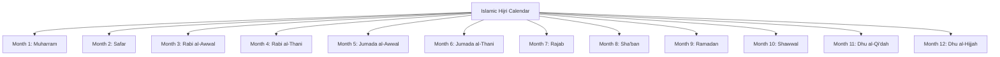
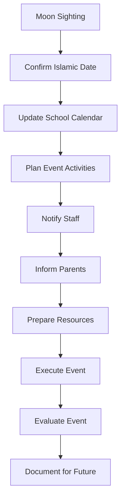
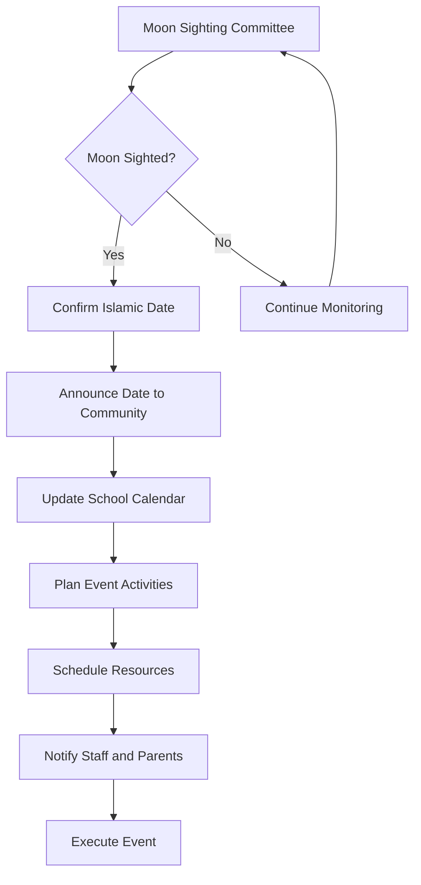

# Islamic Events Calendar

**Document Title:** Islamic Events Calendar
**Document ID:** IS_IEC_003
**Version:** 1.0
**Date:** 2026-01-11
**Project Name:** Smart Academy Digital Web Portal Development
**Content Category:** Islamic Studies Content

---

## Table of Contents

1. [Overview](#1-overview)
2. [Program Objectives](#2-program-objectives)
3. [Program Structure](#3-program-structure)
4. [Activities & Events](#4-activities--events)
5. [Schedule & Timing](#5-schedule--timing)
6. [Participation & Eligibility](#6-participation--eligibility)
7. [Resources & Materials](#7-resources--materials)
8. [Assessment & Recognition](#8-assessment--recognition)
9. [Parent Engagement](#9-parent-engagement)
10. [FAQs](#10-faqs)

---

## 1. Overview

The Islamic Events Calendar at Smart Academy integrates the Hijri (Islamic) calendar with the academic year, ensuring students understand and celebrate significant Islamic events while maintaining academic excellence. This comprehensive calendar system guides the planning of school activities, holidays, and special programs that honor Islamic traditions and foster spiritual growth.

### 1.1 Philosophy

The Islamic calendar is based on the lunar cycle and marks significant events in Islamic history:

> "Indeed, the number of months with Allah is twelve [lunar] months in the register of Allah [from] the day He created the heavens and the earth; of these, four are sacred." - Quran 9:36

The Prophet Muhammad (peace be upon him) said:

> "The best of fasting after Ramadan is fasting Allah's month of Muharram, and the best of prayer after the obligatory prayer is the night prayer." - Sahih Muslim, Book 6, Hadith 2611

### 1.2 Goals

- **Educational Goals**: Teach students about Islamic history, events, and their significance
- **Spiritual Goals**: Create opportunities for increased worship and reflection
- **Cultural Goals**: Preserve Islamic traditions and celebrations
- **Community Goals**: Strengthen community bonds through shared celebrations
- **Academic Goals**: Balance academic requirements with Islamic observances

---

## 2. Program Objectives

### 2.1 Knowledge Objectives

By the end of the program, students will be able to:

- Identify the twelve months of the Islamic Hijri calendar
- Explain the significance of major Islamic events
- Understand the historical context of Islamic celebrations
- Recognize the difference between lunar and solar calendars
- Learn about the lives of the Prophet (peace be upon him) and companions
- Understand the religious obligations associated with Islamic events

### 2.2 Skill Objectives

Students will demonstrate proficiency in:

- Calculating Islamic dates and understanding the lunar calendar
- Participating in Islamic celebrations and rituals appropriately
- Reciting relevant Quranic verses and supplications for each event
- Leading or assisting in Islamic event activities
- Creating Islamic art and decorations for celebrations
- Teaching younger students about Islamic events

### 2.3 Character Objectives

Students will develop:

- **Taqwa (God-consciousness)**: Awareness of Allah through Islamic events
- **Shukr (Gratitude)**: Appreciation for Islamic blessings and history
- **Ikhlas (Sincerity)**: Celebrating events for Allah's pleasure
- **Hubb (Love)**: Love for Allah, the Prophet, and Islamic tradition
- **Ukhuwah (Brotherhood/Sisterhood)**: Strengthening community bonds
- **Adab (Respect)**: Proper behavior during Islamic events

### 2.4 Re-STEAM Integration

- **Science Connection**: Understanding the lunar cycle and astronomy
- **Technology Connection**: Using Islamic calendar apps and digital tools
- **Mathematics Connection**: Calculating dates and understanding lunar phases
- **Arts Connection**: Creating Islamic decorations, calligraphy, and crafts
- **Engineering Connection**: Designing event setups and displays

---

## 3. Program Structure

### 3.1 Islamic Hijri Calendar Overview

The Islamic calendar consists of twelve lunar months:

### 3.2 Major Islamic Events Calendar

| Event | Islamic Date | Significance | School Activity |
|-------|-------------|-------------|-----------------|
| **Islamic New Year** | 1 Muharram | Beginning of Hijri year | Special assembly, reflection |
| **Ashura** | 10 Muharram | Day of fasting and remembrance | Fasting, educational activities |
| **Mawlid un-Nabi** | 12 Rabi al-Awwal | Prophet's birthday | Seerah program, celebration |
| **Isra and Mi'raj** | 27 Rajab | Night journey and ascension | Special lecture, activities |
| **Mid-Sha'ban** | 15 Sha'ban | Night of forgiveness | Special prayers, Du'a |
| **Ramadan Begins** | 1 Ramadan | Month of fasting | Ramadan program kickoff |
| **Laylat al-Qadr** | Last 10 nights of Ramadan | Night of Decree | Extended worship |
| **Eid al-Fitr** | 1 Shawwal | Festival of breaking fast | Eid celebration, holiday |
| **Day of Arafah** | 9 Dhu al-Hijjah | Hajj day | Fasting, special activities |
| **Eid al-Adha** | 10 Dhu al-Hijjah | Festival of Sacrifice | Eid celebration, holiday |

### 3.3 School Holiday Structure

#### Full School Holidays

- **Eid al-Fitr**: 3-5 days (depending on moon sighting)
- **Eid al-Adha**: 3-5 days (depending on moon sighting)

#### Partial School Holidays

- **Islamic New Year**: Half-day with special activities
- **Ashura**: Half-day with educational programs
- **Mawlid un-Nabi**: Half-day with celebration
- **Isra and Mi'raj**: Half-day with special activities

#### Regular School Days with Special Activities

- **Mid-Sha'ban**: Regular day with evening activities
- **Ramadan**: Modified schedule throughout the month
- **Laylat al-Qadr**: Extended hours for worship
- **Day of Arafah**: Regular day with fasting encouraged

### 3.4 Event Planning Process

---

## 4. Activities & Events

### 4.1 Monthly Islamic Events

#### Muharram (Islamic New Year)

**1 Muharram - Islamic New Year**

- **Significance**: Beginning of the Islamic Hijri year
- **Activities**:
  - Special assembly on Hijri calendar and Islamic history
  - Reflection on the past year and goals for the new year
  - Hijri calendar distribution to students
  - Islamic history projects and presentations
- **Age Groups**: All students participate with age-appropriate activities
- **Duration**: Half-day school day with extended activities

**10 Muharram - Ashura**

- **Significance**: Day of fasting and remembrance
- **Activities**:
  - Educational sessions on the significance of Ashura
  - Fasting encouraged for eligible students
  - Stories of Prophet Musa (Moses) and other prophets
  - Reflection on gratitude and Allah's blessings
- **Age Groups**: All students with age-appropriate fasting guidance
- **Duration**: Half-day school day with educational focus

#### Rabi al-Awwal

**12 Rabi al-Awwal - Mawlid un-Nabi (Prophet's Birthday)**

- **Significance**: Celebration of Prophet Muhammad's (peace be upon him) birth
- **Activities**:
  - Seerah (biography) presentations and competitions
  - Nasheed performances praising the Prophet
  - Poetry and essay competitions about the Prophet
  - Community service projects in honor of the Prophet's character
  - Decorations and Islamic art displays
- **Age Groups**: All students with different activity levels
- **Duration**: Half-day celebration with full-day activities

#### Rajab

**27 Rajab - Isra and Mi'raj (Night Journey and Ascension)**

- **Significance**: Prophet's night journey to Jerusalem and ascension to heaven
- **Activities**:
  - Special lecture on the story of Isra and Mi'raj
  - Quran recitation of relevant verses (Surah Al-Isra)
  - Educational videos and presentations
  - Student presentations on the significance of prayer
  - Special prayers and Du'a
- **Age Groups**: All students with age-appropriate content
- **Duration**: Half-day with special activities

#### Sha'ban

**15 Sha'ban - Mid-Sha'ban (Night of Forgiveness)**

- **Significance**: Night when Allah records destinies for the coming year
- **Activities**:
  - Special evening prayers at school or local mosque
  - Du'a sessions seeking Allah's forgiveness
  - Educational session on the significance of the night
  - Quran recitation and reflection
- **Age Groups**: Primary and secondary students encouraged to participate
- **Duration**: Regular school day with evening activities

### 4.2 Ramadan Events

**1 Ramadan - Beginning of Ramadan**

- **Significance**: Start of the blessed month of fasting
- **Activities**:
  - Ramadan kickoff assembly and celebration
  - Distribution of Ramadan calendars and guides
  - Setting Ramadan goals and intentions
  - Ramadan decorations throughout school
  - Parent workshop on Ramadan preparation
- **Age Groups**: All students participate
- **Duration**: Full day with special activities

**Last 10 Nights of Ramadan - Laylat al-Qadr**

- **Significance**: Night of Decree, better than a thousand months
- **Activities**:
  - Extended worship sessions at school
  - Quran recitation and completion
  - Special lectures on Laylat al-Qadr
  - Iftar gatherings
  - Late-night programs until midnight
- **Age Groups**: Primary and secondary students encouraged
- **Duration**: Extended hours on odd nights

### 4.3 Shawwal Events

**1 Shawwal - Eid al-Fitr**

- **Significance**: Festival celebrating the end of Ramadan
- **Activities**:
  - Special Eid prayer at school or local mosque
  - Eid celebration with food, games, and entertainment
  - Distribution of Eid gifts and sweets
  - Awards ceremony for Ramadan achievements
  - Community gathering and festivities
- **Age Groups**: All students and families
- **Duration**: Full school holiday with celebration

### 4.4 Dhu al-Hijjah Events

**9 Dhu al-Hijjah - Day of Arafah**

- **Significance**: The pinnacle of Hajj pilgrimage
- **Activities**:
  - Educational session on Hajj and its significance
  - Fasting encouraged for non-pilgrims
  - Du'a for those performing Hajj
  - Hajj simulation activities for students
  - Learning about the rituals of Hajj
- **Age Groups**: All students with age-appropriate activities
- **Duration**: Regular school day with special focus

**10 Dhu al-Hijjah - Eid al-Adha**

- **Significance**: Festival of Sacrifice, commemorating Prophet Ibrahim's sacrifice
- **Activities**:
  - Special Eid prayer at school or local mosque
  - Eid celebration with community gathering
  - Educational session on the story of Prophet Ibrahim
  - Charity distribution (Qurbani meat)
  - Games and entertainment for children
- **Age Groups**: All students and families
- **Duration**: Full school holiday with celebration

### 4.5 Ongoing Islamic Activities

#### Weekly Islamic Activities

- **Jumu'ah (Friday Prayer)**: Special Friday prayers with Khutbah
- **Islamic Studies Classes**: Regular Islamic education throughout the year
- **Quran Recitation**: Daily Quran reading sessions
- **Dhikr Sessions**: Regular remembrance of Allah

#### Monthly Islamic Activities

- **Islamic History Month**: Focus on different periods of Islamic history
- **Character Building Month**: Focus on specific Islamic character traits
- **Seerah Study**: Monthly sessions on Prophet's life
- **Islamic Science**: Exploring scientific contributions of Muslim scholars

---

## 5. Schedule & Timing

### 5.1 Annual Islamic Events Calendar

The following calendar shows the major Islamic events and corresponding school activities:

| Month | Islamic Event | Date (Approximate) | School Activity | Duration |
|-------|---------------|-------------------|-----------------|----------|
| **Muharram** | Islamic New Year | 1 Muharram | Special assembly, reflection | Half-day |
| **Muharram** | Ashura | 10 Muharram | Fasting, educational activities | Half-day |
| **Rabi al-Awwal** | Mawlid un-Nabi | 12 Rabi al-Awwal | Seerah program, celebration | Half-day |
| **Rajab** | Isra and Mi'raj | 27 Rajab | Special lecture, activities | Half-day |
| **Sha'ban** | Mid-Sha'ban | 15 Sha'ban | Special prayers, Du'a | Evening |
| **Ramadan** | Ramadan Begins | 1 Ramadan | Ramadan program kickoff | Full day |
| **Ramadan** | Laylat al-Qadr | Last 10 nights | Extended worship | Extended hours |
| **Shawwal** | Eid al-Fitr | 1 Shawwal | Eid celebration, holiday | 3-5 days |
| **Dhu al-Hijjah** | Day of Arafah | 9 Dhu al-Hijjah | Fasting, special activities | Regular day |
| **Dhu al-Hijjah** | Eid al-Adha | 10 Dhu al-Hijjah | Eid celebration, holiday | 3-5 days |

### 5.2 Daily Event Schedule (Event Days)

#### Half-Day Event Schedule

| Time | Activity | Duration | Notes |
|------|----------|----------|-------|
| 8:00 AM | School Arrival | - | Students arrive |
| 8:30 AM | Special Assembly | 30 min | Event-themed assembly |
| 9:00 AM | Educational Sessions | 60 min | Age-appropriate activities |
| 10:00 AM | Break | 20 min | Snack and rest |
| 10:20 AM | Activity Workshops | 60 min | Hands-on activities |
| 11:20 AM | Dhuhr Prayer | 20 min | Congregational prayer |
| 11:40 AM | Student Presentations | 40 min | Student-led activities |
| 12:20 PM | Closing Ceremony | 20 min | Summary and Du'a |
| 12:40 PM | Dismissal | - | Early dismissal |

#### Full-Day Event Schedule (Eid Celebrations)

| Time | Activity | Duration | Notes |
|------|----------|----------|-------|
| 8:00 AM | Arrival and Greetings | - | Families welcome |
| 8:30 AM | Eid Prayer | 30 min | Special prayer |
| 9:00 AM | Opening Ceremony | 30 min | Welcome and introduction |
| 9:30 AM | Student Performances | 60 min | Nasheeds, presentations |
| 10:30 AM | Awards Ceremony | 30 min | Recognition of achievements |
| 11:00 AM | Games and Activities | 90 min | Age-appropriate activities |
| 12:30 PM | Lunch | 60 min | Community meal |
| 1:30 PM | Family Activities | 60 min | Family games and bonding |
| 2:30 PM | Closing Du'a | 15 min | Conclusion |
| 2:45 PM | Dismissal | - | Event ends |

### 5.3 Event Timing Process

### 5.4 Seasonal Adjustments

#### Moon Sighting Process

- **Local Sighting**: Committee observes moon locally
- **Regional Coordination**: Coordinate with other Islamic centers
- **Official Announcement**: Official announcement of dates
- **Flexibility**: Schedule remains flexible until confirmed

#### Weather Considerations

- **Indoor Events**: Plan indoor alternatives for outdoor activities
- **Weather Monitoring**: Monitor weather forecasts for event days
- **Contingency Plans**: Have backup plans for different weather conditions
- **Communication**: Inform families of any changes due to weather

#### Academic Balance

- **Event Planning**: Schedule events to minimize academic disruption
- **Make-up Work**: Provide opportunities for missed academic work
- **Assessment Adjustments**: Modify testing schedules around major events
- **Continuity**: Ensure academic progress continues during event periods

---

## 6. Participation & Eligibility

### 6.1 Mandatory Participation

#### Required Participation

- **Morning Assemblies**: All students attend event assemblies
- **Educational Sessions**: Age-appropriate participation required
- **Prayer Times**: All students participate in congregational prayers
- **Character Education**: All students engage in character-building activities

#### Academic Requirements

- **Event-Related Projects**: Students complete projects related to Islamic events
- **Presentations**: Students prepare and present on Islamic topics
- **Assessments**: Students assessed on Islamic event knowledge
- **Reflection Journals**: Students maintain reflection journals

### 6.2 Voluntary Participation

#### Optional Activities

- **Extended Worship**: Laylat al-Qadr participation optional
- **Evening Programs**: Mid-Sha'ban and other evening activities
- **Community Service**: Charity projects and volunteer activities
- **Competitions**: Quran, knowledge, and art competitions

#### Special Roles

- **Event Ambassadors**: Students volunteer to help organize events
- **Presentation Leaders**: Students lead presentations and activities
- **Prayer Leaders**: Student Imams for special prayers
- **Decoration Teams**: Students help create event decorations

### 6.3 Age-Appropriate Participation

#### Early Childhood (3-6 years)

- **Participation**: Observation and simple activities
- **Activities**: Stories, crafts, songs, simple Du'as
- **Duration**: Shorter activities with frequent breaks
- **Focus**: Basic understanding of Islamic events

#### Primary Level (6-11 years)

- **Participation**: Active engagement in all activities
- **Activities**: Projects, presentations, competitions, games
- **Duration**: Age-appropriate activity length
- **Focus**: Understanding significance and history

#### Secondary Level (11-16 years)

- **Participation**: Full participation with leadership opportunities
- **Activities**: Advanced projects, teaching younger students, organizing events
- **Duration**: Full participation in extended activities
- **Focus**: Deep understanding and application

### 6.4 Special Considerations

#### Religious Diversity

- **Inclusive Approach**: All students welcome to participate and learn
- **Respectful Environment**: Respect for all religious backgrounds
- **Educational Focus**: Emphasis on learning and understanding
- **Optional Participation**: Non-Muslim students may observe without obligation

#### Special Needs

- **Accommodations**: Modified activities for students with special needs
- **Accessibility**: Ensure events are accessible to all students
- **Support**: Additional support for students who need it
- **Inclusion**: Full inclusion in all activities

#### Medical Considerations

- **Fasting Exemptions**: Medical exemptions from fasting
- **Activity Modifications**: Adjusted activities for health conditions
- **Rest Areas**: Quiet areas for students who need rest
- **Medical Support**: First aid and medical support available

---

## 7. Resources & Materials

### 7.1 Educational Resources

#### Student Materials

- **Islamic Calendar Booklets**: Monthly Islamic calendars with information
- **Event Guides**: Detailed guides for each Islamic event
- **Quran and Hadith Collections**: Relevant verses and traditions
- **Activity Books**: Event-specific educational activities
- **Project Materials**: Supplies for event-related projects

#### Teacher Resources

- **Event Curriculum**: Detailed lesson plans for each event
- **Teaching Guides**: Instructions for event activities
- **Assessment Tools**: Rubrics for evaluating student work
- **Presentation Materials**: Slides and visual aids
- **Parent Communication Templates**: Letters and information sheets

### 7.2 Physical Resources

#### Event Supplies

- **Decorations**: Islamic decorations for each event
- **Prayer Mats**: Additional mats for special prayers
- **Quran Copies**: Enough copies for all students
- **Audio Equipment**: For nasheeds and presentations
- **Display Materials**: Boards and displays for student work

#### Activity Supplies

- **Art Supplies**: Materials for crafts and decorations
- **Competition Materials**: Supplies for various competitions
- **Game Equipment**: For event celebrations
- **Food Supplies**: For Eid celebrations and Iftar events
- **Gift Items**: For prizes and awards

### 7.3 Digital Resources

#### Calendar Applications

- **Islamic Calendar Apps**: Installed on school devices
- **Prayer Time Apps**: For prayer times and event notifications
- **Quran Apps**: Digital Quran with recitation and translation
- **Educational Videos**: Instructional videos about Islamic events
- **Interactive Games**: Event-themed educational games

#### Online Resources

- **Event Portal**: School website section with event information
- **Parent Portal**: Access to event schedules and student progress
- **Virtual Events**: Online activities for remote learning
- **Islamic Content Library**: Digital library of Islamic resources

### 7.4 Community Resources

#### Mosque Partnerships

- **Imam Visits**: Regular visits from local Islamic scholars
- **Mosque Events**: Participation in mosque events
- **Community Prayers**: Joint prayers for major events
- **Resource Sharing**: Access to additional Islamic materials

#### Parent Resources

- **Home Event Guides**: Instructions for family event activities
- **Recipe Collections**: Traditional recipes for celebrations
- **Family Activity Ideas**: Suggestions for home celebrations
- **Q&A Sessions**: Regular opportunities for parent questions

---

## 8. Assessment & Recognition

### 8.1 Assessment Methods

#### Event-Specific Assessment

- **Knowledge Quizzes**: Short quizzes on event significance
- **Project Evaluation**: Assessment of event-related projects
- **Presentation Quality**: Evaluation of student presentations
- **Participation Level**: Engagement in event activities

#### Ongoing Assessment

- **Reflection Journals**: Student reflections on Islamic events
- **Character Development**: Observation of character traits
- **Community Service**: Participation in charity activities
- **Leadership Demonstration**: Leadership in event organization

### 8.2 Assessment Criteria

#### Knowledge Criteria

- **Event Understanding**: Comprehension of event significance
- **Historical Knowledge**: Knowledge of Islamic history
- **Quran and Hadith**: Relevant verses and traditions
- **Islamic Calendar**: Understanding of Hijri calendar

#### Skill Criteria

- **Presentation Skills**: Ability to present Islamic topics
- **Project Completion**: Quality of event-related projects
- **Participation**: Active engagement in activities
- **Leadership**: Ability to lead and organize activities

#### Character Criteria

- **Respect**: Proper behavior during Islamic events
- **Enthusiasm**: Positive attitude toward Islamic activities
- **Cooperation**: Working well with others
- **Responsibility**: Fulfilling assigned roles

### 8.3 Recognition System

#### Event-Specific Recognition

- **Event Champion**: Outstanding participation in specific events
- **Project Excellence**: Best event-related projects
- **Presentation Award**: Best presentations on Islamic topics
- **Participation Certificate**: Recognition for active participation

#### Ongoing Recognition

- **Islamic Knowledge Award**: Excellence in Islamic studies
- **Character Excellence**: Outstanding character development
- **Community Service Award**: Exceptional charity work
- **Leadership Award**: Student leadership in Islamic activities

#### Annual Recognition

- **Islamic Studies Achievement**: Year-end recognition for excellence
- **Event Ambassador**: Selected students represent school
- **Perfect Attendance**: Full participation in all events
- **Most Improved**: Greatest improvement in Islamic knowledge

### 8.4 Award Categories

| Award | Criteria | Age Group | Recognition |
|-------|----------|-----------|-------------|
| Event Champion | Outstanding event participation | All | Certificate, badge |
| Project Excellence | Best event-related project | All | Certificate, prize |
| Presentation Award | Best presentation | All | Certificate, medal |
| Participation Certificate | Active participation | All | Certificate |
| Islamic Knowledge Award | Excellence in Islamic studies | All | Certificate, trophy |
| Character Excellence | Outstanding character | All | Certificate, special recognition |
| Community Service Award | Exceptional charity work | All | Certificate, badge |
| Leadership Award | Student leadership | 11-16 years | Certificate, special role |

---

## 9. Parent Engagement

### 9.1 Communication Channels

#### Regular Updates

- **Event Calendars**: Monthly Islamic event calendars
- **Event Notifications**: Information about upcoming events
- **Progress Reports**: Student progress on Islamic studies
- **Educational Tips**: Suggestions for supporting Islamic education at home

#### Digital Communication

- **Parent Portal**: Online access to event information
- **SMS/WhatsApp Updates**: Event reminders and notices
- **Email Updates**: Regular email communications
- **School Website**: Islamic events calendar and resources

### 9.2 Parent Workshops

#### Islamic Events Workshop

- **Understanding Events**: Importance and significance of Islamic events
- **Home Celebration**: Creating Islamic celebrations at home
- **Family Traditions**: Establishing family Islamic traditions
- **Event Preparation**: Preparing for major Islamic events

#### Hijri Calendar Workshop

- **Understanding Hijri Calendar**: How the Islamic calendar works
- **Moon Sighting**: Understanding the moon sighting process
- **Date Calculation**: How to calculate Islamic dates
- **Calendar Planning**: Planning family activities around Islamic events

### 9.3 Family Event Activities

#### Home Event Support

- **Event Guides**: Instructions for family event celebrations
- **Recipe Collections**: Traditional recipes for celebrations
- **Family Prayer**: Guidelines for family prayers during events
- **Decoration Ideas**: Suggestions for home decorations

#### Special Family Events

- **Family Eid Celebration**: Family participation in Eid festivities
- **Event Nights**: Special evening programs for families
- **Community Iftar**: Family participation during Ramadan
- **Charity Projects**: Family charity activities

### 9.4 Volunteer Opportunities

#### Event Supervision

- **Parent Volunteers**: Assist with event organization
- **Event Setup**: Help prepare event decorations and materials
- **Activity Supervision**: Assist with event activities
- **Food Preparation**: Help prepare food for celebrations

#### Resource Contribution

- **Event Supplies**: Donate decorations and materials
- **Food Donations**: Contribute to celebration meals
- **Expertise Sharing**: Parents share Islamic knowledge
- **Community Connections**: Facilitate community partnerships

### 9.5 Parent Feedback

#### Feedback Channels

- **Parent Surveys**: Post-event surveys on program effectiveness
- **Parent-Teacher Meetings**: Discuss student progress
- **Suggestion Box**: Anonymous feedback and suggestions
- **Focus Groups**: Regular parent input sessions

#### Continuous Improvement

- **Program Review**: Annual review based on parent feedback
- **Adjustment Implementation**: Changes based on suggestions
- **Success Stories**: Share positive experiences with community
- **Challenge Addressing**: Resolve concerns and difficulties

---

## 10. FAQs

### 10.1 General Questions

**Q: How are Islamic event dates determined?**

A: Islamic event dates are based on the lunar Hijri calendar and confirmed through moon sighting. A moon sighting committee observes the moon locally and coordinates with other Islamic centers to confirm dates.

**Q: What happens if an Islamic event falls on a school day?**

A: For major events like Eid, school is closed. For other events, the schedule is adjusted with special activities, assemblies, and educational programs. Half-days are common for significant Islamic events.

**Q: Are non-Muslim students required to participate in Islamic events?**

A: While Islamic events are designed for Muslim students, all students are welcome to participate in the educational and cultural aspects. Non-Muslim students may observe and learn about Islamic traditions without religious obligation.

### 10.2 Event-Specific Questions

**Q: How is Eid al-Fitr celebrated at school?**

A: Eid al-Fitr is celebrated with a special Eid prayer, festive activities, awards ceremony recognizing Ramadan achievements, community gathering with food and entertainment, and family participation.

**Q: What is the difference between Eid al-Fitr and Eid al-Adha?**

A: Eid al-Fitr celebrates the end of Ramadan (month of fasting), while Eid al-Adha commemorates Prophet Ibrahim's willingness to sacrifice his son and coincides with Hajj pilgrimage.

**Q: How does the school prepare for Ramadan?**

A: The school prepares by adjusting the daily schedule, distributing Ramadan guides and calendars, decorating the school, organizing special activities, and conducting parent workshops on Ramadan preparation.

### 10.3 Calendar-Specific Questions

**Q: Why does the Islamic calendar change dates every year?**

A: The Islamic calendar is lunar-based with approximately 354 days per year, which is about 11 days shorter than the solar Gregorian calendar. This causes Islamic events to occur about 11 days earlier each year in the Gregorian calendar.

**Q: How can I keep track of Islamic event dates?**

A: The school provides monthly Islamic event calendars, sends notifications via SMS and email, and maintains an online calendar on the school website and parent portal.

**Q: What is Laylat al-Qadr and why is it important?**

A: Laylat al-Qadr (Night of Decree) is one of the odd nights in the last ten days of Ramadan. It is the night when the Quran was first revealed and is considered better than a thousand months of worship.

### 10.4 Participation Questions

**Q: Are students required to fast during Ramadan?**

A: Fasting is obligatory for Muslim adults. For students, we follow age-appropriate guidelines: Early Childhood (3-6 years) are not required, Primary (6-11 years) are encouraged with parental guidance, and Secondary (11-16 years) are expected to fast with parental support.

**Q: Can parents attend Islamic events at school?**

A: Yes, parents are welcome to attend special Islamic events including Eid celebrations, special assemblies, and family-oriented programs. Regular daily activities are for students only.

**Q: How are students assessed on Islamic events?**

A: Students are assessed through knowledge quizzes, project evaluations, presentation quality, participation level, and ongoing character development observations.

### 10.5 Special Situations Questions

**Q: What if an Islamic event conflicts with exams?**

A: The school schedules exams to avoid major conflicts with Islamic events. If conflicts occur, accommodations are made including extended time, flexible scheduling, and modified assessment formats.

**Q: How does the school handle moon sighting uncertainties?**

A: The school maintains flexibility in scheduling until dates are confirmed through official moon sighting announcements. Parents are notified promptly of any changes.

**Q: Are accommodations made for students with special needs during Islamic events?**

A: Yes, accommodations are made for students with special needs including modified activities, accessibility considerations, additional support, and full inclusion in all activities.

---

## Document Approval

| Role | Name | Signature | Date |
|------|------|-----------|------|
| Islamic Studies Coordinator | | _________________ | ________ |
| Principal | | _________________ | ________ |
