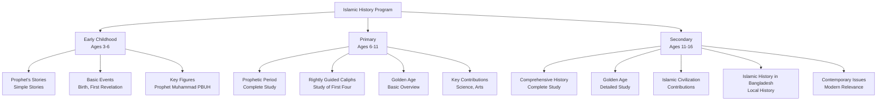
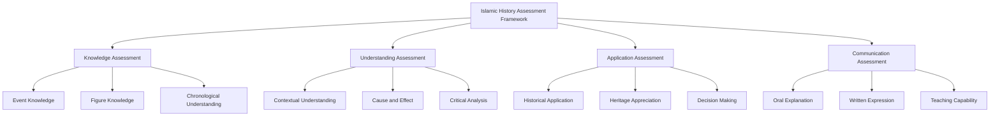

# Islamic History

**Document Title:** Islamic History
**Document ID:** IS_012
**Version:** 1.0
**Date:** 2026-01-11
**Project Name:** Smart Academy Digital Web Portal Development
**Content Category:** Islamic Studies Content

---

## Table of Contents

1. [Overview](#1-overview)
2. [Learning Objectives](#2-learning-objectives)
3. [Curriculum Structure](#3-curriculum-structure)
4. [Teaching Methodology](#4-teaching-methodology)
5. [Assessment & Evaluation](#5-assessment--evaluation)
6. [Resources & Materials](#6-resources--materials)
7. [Integration with Other Subjects](#7-integration-with-other-subjects)
8. [Parent Engagement](#8-parent-engagement)
9. [Technology Integration](#9-technology-integration)
10. [FAQs](#10-faqs)

---

## 1. Overview

The Islamic History program at Smart Academy is designed to teach students about the rich history of Islam from the time of Prophet Muhammad (PBUH) through the Golden Age of Islamic civilization and beyond. Islamic history provides valuable lessons about faith, leadership, perseverance, and contributions of Muslims to human civilization. Our program guides students from basic historical stories to comprehensive study of Islamic history, enabling them to appreciate their Islamic heritage and draw inspiration from past achievements.

### 1.1 Philosophy

The Islamic History program is founded on these fundamental principles:

- **Divine Guidance**: Islamic history is guided by Allah's (SWT) plan and wisdom. Allah (SWT) states in Quran 3:140: "If a wound has afflicted you, then a wound like it has already afflicted the people. And such days We rotate among mankind."

- **Learning from History**: History provides valuable lessons for present and future. The Prophet (PBUH) said: "The wise person is one who learns from the mistakes of others." (At-Tirmidhi)

- **Pride in Heritage**: Understanding Islamic history fosters pride in Islamic heritage while maintaining humility and gratitude to Allah for blessings.

- **Contributions to Humanity**: Islamic civilization made significant contributions to human knowledge, science, arts, and governance.

- **Lessons for Present**: Historical lessons guide students in facing contemporary challenges with wisdom and faith.

### 1.2 Goals

The Islamic History program aims to achieve the following goals:

1. **Historical Knowledge**: Enable students to learn about Islamic history at an appropriate level for their age and development.

2. **Historical Understanding**: Help students understand the context, causes, and effects of historical events.

3. **Lessons from History**: Teach students to draw lessons from Islamic history for present-day application.

4. **Appreciation of Heritage**: Foster appreciation for Islamic heritage and contributions.

5. **Critical Thinking**: Develop students' ability to analyze historical events and their significance.

6. **Connection to Present**: Help students understand how historical events relate to contemporary issues.

7. **Teaching Capability**: Prepare students to explain Islamic history to others.

8. **Integration**: Connect Islamic history with Quran, Seerah, and other Islamic studies.

### 1.3 Program Structure

The Islamic History program progresses through three developmental levels:

---

## 2. Learning Objectives

### 2.1 Knowledge Objectives

By the end of each level, students will demonstrate knowledge of:

#### Early Childhood (Ages 3-6)
- Basic stories about Prophet Muhammad (PBUH)
- Simple stories about other prophets
- Basic understanding of Makkah and Madinah
- Simple stories about early Muslims
- Basic understanding of Islamic heritage

#### Primary (Ages 6-11)
- Complete study of Prophetic period (610-632 CE)
- Rightly Guided Caliphs (Abu Bakr, Umar, Uthman, Ali)
- Basic overview of Islamic Golden Age (8th-13th centuries)
- Key contributions of Muslims to science, arts, and civilization
- Basic understanding of Islamic history in Bangladesh

#### Secondary (Ages 11-16)
- Comprehensive study of Islamic history from Prophetic period to present
- Detailed study of Islamic Golden Age
- Islamic civilization's contributions to human knowledge
- Islamic history in Bangladesh and South Asia
- Contemporary Islamic history and its relevance
- Comparative study of different Islamic periods

### 2.2 Skills Objectives

Students will develop the following Islamic History-specific skills:

#### Historical Skills
- **Chronological Understanding**: Understanding the sequence of historical events
- **Contextual Understanding**: Understanding the context of historical events
- **Cause and Effect**: Understanding causes and effects of historical events
- **Historical Analysis**: Analyzing historical events and their significance

#### Analytical Skills
- **Critical Thinking**: Reflecting on and analyzing historical events
- **Comparative Analysis**: Comparing different historical periods
- **Source Evaluation**: Evaluating historical sources
- **Lesson Extraction**: Extracting lessons from historical events

#### Application Skills
- **Historical Application**: Applying historical lessons to present-day situations
- **Heritage Appreciation**: Appreciating Islamic heritage and contributions
- **Decision Making**: Using historical wisdom for decision making
- **Communication**: Explaining Islamic history to others

### 2.3 Character Objectives

Through Islamic History studies, students will develop:

- **Appreciation for Heritage**: Pride in Islamic heritage with gratitude to Allah
- **Wisdom (Hikmah)**: Learning wisdom from historical events
- **Perseverance (Sabr)**: Learning perseverance from historical examples
- **Courage (Shaja'ah)**: Learning courage from historical figures
- **Leadership (Qiyadah)**: Learning leadership from Islamic leaders
- **Unity (Wahdah)**: Understanding importance of unity from Islamic history
- **Justice (Adl)**: Learning justice from Islamic history
- **Service (Khidmah)**: Learning service from Islamic history

---

## 3. Curriculum Structure

### 3.1 Level-Specific Curriculum

#### Early Childhood (Ages 3-6)

| Topic | Content | Learning Focus |
|-------|---------|----------------|
| **Prophet's Birth** | Birth in Makkah, Year of Elephant | Prophet's blessed birth |
| **Childhood** | Orphaned, raised by grandfather and uncle | Trust in Allah |
| **First Revelation** | Cave of Hira, Angel Jibreel | Beginning of Prophethood |
| **Early Muslims** | Khadijah, Ali, Abu Bakr, Zayd | First believers |
| **Migration to Madinah** | Hijrah story | Trust in Allah |
| **Basic Stories** | Simple stories from Seerah | Lessons from Prophet's life |

**Key Concepts**:
- Prophet Muhammad (PBUH) is Allah's Messenger
- Allah protects His prophets
- Trust in Allah during difficulties
- Importance of following truth
- Kindness and patience

#### Primary (Ages 6-11)

##### Prophetic Period (610-632 CE)

| Period | Key Events | Learning Focus |
|--------|-------------|----------------|
| **Early Life** | Birth to Prophethood (570-610 CE) | Prophet's character before Islam |
| **Makkah Period** | 610-622 CE | Revelation, persecution, early Muslims |
| **Madinah Period** | 622-632 CE | Establishment, battles, consolidation |
| **Farewell Hajj** | 632 CE | Final guidance |
| **Prophet's Passing** | 632 CE | Legacy and continuation |

##### Rightly Guided Caliphs

| Caliph | Period | Key Events | Learning Focus |
|--------|--------|-------------|----------------|
| **Abu Bakr** | 632-634 CE | Wars of Apostasy, compilation of Quran | Leadership and unity |
| **Umar** | 634-644 CE | Expansion, Islamic governance | Justice and administration |
| **Uthman** | 644-656 CE | Compilation of Quran, expansion | Preservation of Quran |
| **Ali** | 656-661 CE | Civil wars, Kharijite rule | Leadership during challenges |

##### Islamic Golden Age (8th-13th Centuries)

| Period | Key Events | Learning Focus |
|--------|-------------|----------------|
| **Umayyad Period** | 661-750 CE | Expansion and consolidation | Islamic empire |
| **Abbasid Period** | 750-1258 CE | Golden Age peak | Cultural and scientific achievements |
| **Seljuk Period** | 1037-1194 CE | Turkish rule | Military and administrative achievements |
| **Mamluk Period** | 1250-1517 CE | Egyptian rule | Architectural and cultural achievements |
| **Ottoman Period** | 1299-1924 CE | Turkish rule | Expansion and governance |

##### Key Contributions

| Area | Contributions | Learning Focus |
|------|-------------|----------------|
| **Science** | Mathematics, medicine, astronomy, chemistry | Scientific achievements |
| **Arts** | Architecture, calligraphy, literature, music | Cultural achievements |
| **Governance** | Administrative systems, justice, education | Political achievements |
| **Trade** | Trade routes, commerce | Economic achievements |

#### Secondary (Ages 11-16)

##### Comprehensive Islamic History

| Period | Key Events | Learning Focus |
|--------|-------------|----------------|
| **Prophetic Period** | 610-632 CE | Complete study of Prophet's life and early Islam |
| **Rightly Guided Caliphs** | 632-661 CE | Detailed study of first four caliphs |
| **Umayyad Period** | 661-750 CE | Expansion and consolidation |
| **Abbasid Period** | 750-1258 CE | Golden Age peak and achievements |
| **Seljuk Period** | 1037-1194 CE | Turkish rule and achievements |
| **Mamluk Period** | 1250-1517 CE | Egyptian rule and achievements |
| **Ottoman Period** | 1299-1924 CE | Turkish rule and achievements |
| **Modern Period** | 19th-21st centuries | Contemporary Islamic history |

##### Golden Age Detailed Study

| Area | Detailed Content | Learning Focus |
|------|----------------|----------------|
| **Science** | Detailed study of scientific contributions | Mathematics, medicine, astronomy, chemistry, physics |
| **Philosophy** | Islamic philosophy and theology | Kalam, falsafah, Islamic theology |
| **Literature** | Arabic and Persian literature | Poetry, prose, literary achievements |
| **Architecture** | Islamic architecture | Mosques, palaces, cities |
| **Art and Calligraphy** | Islamic art and calligraphy | Geometric patterns, Arabic calligraphy |
| **Music** | Islamic music and poetry | Nasheeds, musical instruments |
| **Education** | Islamic education system | Madrasas, universities, libraries |

##### Islamic Civilization Contributions

| Area | Contributions | Key Figures |
|------|-------------|--------------|
| **Mathematics** | Algebra, algorithms, trigonometry | Al-Khwarizmi, Al-Biruni, Al-Kindi |
| **Medicine** | Medical knowledge and hospitals | Ibn Sina, Al-Razi, Ibn al-Nafis |
| **Astronomy** | Astronomical observations and theories | Al-Battani, Al-Biruni, Al-Tusi |
| **Chemistry** | Chemical knowledge and experiments | Jabir ibn Hayyan, Al-Razi |
| **Philosophy** | Islamic philosophy and theology | Al-Kindi, Ibn Rushd, Ibn Sina |
| **Literature** | Arabic and Persian literature | Al-Mutanabbi, Al-Ma'arri, Rumi, Hafiz |
| **Architecture** | Islamic architecture | Ibn Tulun, Sinan, Mimar |
| **Art and Calligraphy** | Islamic art and calligraphy | Various artists and calligraphers |

##### Islamic History in Bangladesh

| Period | Key Events | Learning Focus |
|--------|-------------|----------------|
| **Pre-Islamic Bengal** | Before 13th century | Hindu-Buddhist influence |
| **Islamic Rule** | 13th-18th centuries | Delhi Sultanate, Bengal Sultanate |
| **Mughal Period** | 16th-18th centuries | Mughal rule in Bengal |
| **British Period** | 18th-20th centuries | British rule and Islamic response |
| **Modern Bangladesh** | 20th century-present | Islamic role in Bangladesh |

| Key Figures | Contribution | Learning Focus |
|-------------|-------------|----------------|
| **Khan Jahan Ali** | Islamic leader | Islamic leadership in Bengal |
| **Shah Jalal** | Islamic reformer | Islamic education in Bengal |
| **Haji Shariatullah** | Islamic scholar | Islamic scholarship in Bengal |
| **Maulana Bhashani** | Islamic leader | Political Islam in Bengal |
| **Maulana Azad** | Islamic leader | Islamic role in independence |

##### Contemporary Issues

| Issue | Historical Context | Learning Focus |
|-------|-----------------|----------------|
| **Islamic Governance** | Historical Islamic governance models | Lessons for modern governance |
| **Islamic Economics** | Historical Islamic economic systems | Lessons for modern economics |
| **Islamic Education** | Historical Islamic education systems | Lessons for modern education |
| **Muslim Unity** | Historical examples of unity | Lessons for contemporary unity |
| **Islamic Revival** | Historical revival movements | Lessons for contemporary revival |

### 3.2 Historical Periods Overview

#### Prophetic Period (610-632 CE)

| Phase | Period | Key Characteristics |
|-------|--------|---------------------|
| **Makkah Period** | 610-622 CE | Revelation, persecution, early Islamic community |
| **Madinah Period** | 622-632 CE | Establishment, battles, consolidation, final years |

#### Rightly Guided Caliphate (632-661 CE)

| Caliph | Period | Key Characteristics |
|--------|--------|---------------------|
| **Abu Bakr** | 632-634 CE | Wars of Apostasy, compilation of Quran |
| **Umar** | 634-644 CE | Expansion, Islamic governance, justice |
| **Uthman** | 644-656 CE | Compilation of Quran, expansion |
| **Ali** | 656-661 CE | Civil wars, Kharijite rule |

#### Umayyad Period (661-750 CE)

| Caliph | Period | Key Characteristics |
|--------|--------|---------------------|
| **Umayyad Caliphs** | 661-750 CE | Expansion, consolidation, administrative achievements |

#### Abassid Period (750-1258 CE)

| Caliph | Period | Key Characteristics |
|--------|--------|---------------------|
| **Abassid Caliphs** | 750-1258 CE | Golden Age peak, cultural and scientific achievements |

#### Seljuk Period (1037-1194 CE)

| Period | Key Characteristics |
|--------|---------------------|
| **Seljuk Empire** | 1037-1194 CE | Turkish rule, military and administrative achievements |

#### Mamluk Period (1250-1517 CE)

| Period | Key Characteristics |
|--------|---------------------|
| **Mamluk Sultanate** | 1250-1517 CE | Egyptian rule, architectural and cultural achievements |

#### Ottman Period (1299-1924 CE)

| Period | Key Characteristics |
|--------|---------------------|
| **Ottoman Empire** | 1299-1924 CE | Turkish rule, expansion and governance |

### 3.3 Key Historical Figures

#### Prophetic Period

| Figure | Role | Contribution |
|--------|------|-------------|
| **Prophet Muhammad (PBUH)** | Final Prophet | Established Islam, Quran, and Islamic community |
| **Abu Bakr** | First Caliph | Stabilized Islam, compiled Quran |
| **Umar ibn al-Khattab** | Second Caliph | Expanded Islamic state, established governance |
| **Uthman ibn Affan** | Third Caliph | Compiled Quran, expanded Islamic state |
| **Ali ibn Abi Talib** | Fourth Caliph | Led during civil wars, preserved Islam |
| **Aisha** | Scholar | Narrated many Hadith, contributed to Islamic knowledge |
| **Khalid ibn al-Walid** | Military Commander | Major military victories |
| **Mu'awiyah ibn Abi Sufyan** | Scholar | Compiled Hadith |

#### Golden Age Figures

| Figure | Period | Field | Contribution |
|--------|--------|-------|-------------|
| **Al-Khwarizmi** | 9th century | Mathematics | Algebra, algorithms |
| **Al-Biruni** | 10th-11th centuries | Astronomy, Mathematics | Astronomical observations, trigonometry |
| **Ibn Sina** | 10th-11th centuries | Medicine | Canon of Medicine |
| **Al-Razi** | 9th-10th centuries | Medicine, Chemistry | Medical knowledge, chemical experiments |
| **Al-Kindi** | 10th-11th centuries | Philosophy | Islamic philosophy, theology |
| **Ibn Rushd** | 12th century | Philosophy | Islamic philosophy, theology |
| **Al-Mutanabbi** | 10th-11th centuries | Literature | Arabic poetry and literature |
| **Al-Ma'arri** | 10th-11th centuries | Literature | Arabic poetry and literature |
| **Rumi** | 13th century | Literature, Sufism | Persian poetry, Sufi teachings |
| **Hafiz** | 14th century | Literature | Persian poetry |
| **Ibn Tulun** | 9th-10th centuries | Architecture | Mosque architecture |
| **Sinan** | 16th century | Architecture | Ottoman architecture |
| **Mimar** | 16th century | Architecture | Ottoman architecture |

#### Islamic History in Bangladesh

| Figure | Period | Contribution |
|--------|--------|-------------|
| **Khan Jahan Ali** | 19th-20th centuries | Islamic leadership in Bengal |
| **Shah Jalal** | 19th-20th centuries | Islamic education in Bengal |
| **Haji Shariatullah** | 19th-20th centuries | Islamic scholarship in Bengal |
| **Maulana Bhashani** | 20th century | Political Islam in Bengal |
| **Maulana Azad** | 20th century | Islamic role in independence |

---

## 4. Teaching Methodology

### 4.1 Pedagogical Approach

The Islamic History program employs a combination of traditional and modern teaching methods:

#### Traditional Methods
- **Storytelling**: Using historical narratives to make lessons engaging
- **Memorization**: Memorizing key dates, events, and figures
- **Discussion**: Class discussions about historical events and lessons
- **Modeling**: Teachers demonstrate how to learn from history

#### Modern Methods
- **Interactive Learning**: Use of smart boards, tablets, and multimedia resources
- **Project-Based Learning**: Projects that connect history to present
- **Critical Thinking**: Encouraging students to reflect on and analyze historical events
- **Differentiated Instruction**: Adapting content to different learning levels

### 4.2 Teaching Strategies

#### For Early Childhood (3-6)

| Strategy | Description | Example |
|----------|-------------|---------|
| **Storytelling** | Simple historical stories | Stories of Prophet's life |
| **Visual Learning** | Pictures and illustrations | Pictures of historical figures |
| **Repetition** | Repeating key events | Repeating Prophet's birth story |
| **Songs and Rhymes** | Islamic songs about history | Songs about Prophet's kindness |
| **Play-Based Learning** | Games and activities | Role-playing historical events |
| **Modeling** | Teachers demonstrate historical lessons | Teachers showing lessons from history |

#### For Primary (6-11)

| Strategy | Description | Example |
|----------|-------------|---------|
| **Interactive Discussion** | Class discussions about historical events | Discussing lessons from battles |
| **Timeline Creation** | Creating timeline of events | Visualizing historical chronology |
| **Story Analysis** | Analyzing historical stories | Discussing lessons from events |
| **Character Study** | Studying historical figures | Analyzing specific traits |
| **Application Activities** | Applying historical lessons to daily life | Role-playing historical situations |
| **Group Work** | Collaborative activities | Group projects on historical themes |

#### For Secondary (11-16)

| Strategy | Description | Example |
|----------|-------------|---------|
| **Critical Analysis** | Deep examination of historical events | Analyzing significance of events |
| **Research Projects** | Independent research on historical topics | Research on Golden Age contributions |
| **Debate and Discussion** | Structured debates on historical issues | Discussing contemporary relevance |
| **Comparative Study** | Comparing different historical periods | Comparing different caliphates |
| **Application Projects** | Applying historical lessons to modern life | Creating guides for modern governance |
| **Teaching Practice** | Students teaching younger students | Peer tutoring in history |

### 4.3 Classroom Environment

The Islamic History classroom is designed to be:

- **Historically Rich**: Clean, organized, with historical content displayed
- **Interactive**: Encouraging student participation and engagement
- **Respectful**: Environment of respect for historical figures
- **Technology-Enhanced**: Smart boards, tablets, and digital resources
- **Comfortable**: Appropriate seating for extended discussions
- **Inclusive**: Welcoming to students from all backgrounds

---

## 5. Assessment & Evaluation

### 5.1 Assessment Framework

### 5.2 Assessment Methods

#### Knowledge Assessment

| Criteria | Description | Scoring |
|----------|-------------|---------|
| **Event Knowledge** | Knowledge of key historical events | 0-40 points |
| **Figure Knowledge** | Knowledge of key historical figures | 0-30 points |
| **Chronological Understanding** | Understanding of historical sequence | 0-30 points |

**Scoring Rubric**:
- **Excellent (90-100)**: Deep knowledge of all aspects
- **Very Good (80-89)**: Strong knowledge with minor gaps
- **Good (70-79)**: Good knowledge with some gaps
- **Satisfactory (60-69)**: Basic knowledge with notable gaps
- **Needs Improvement (Below 60)**: Limited knowledge

#### Understanding Assessment

| Criteria | Description | Scoring |
|----------|-------------|---------|
| **Contextual Understanding** | Understanding of historical context | 0-30 points |
| **Cause and Effect** | Understanding of causes and effects | 0-30 points |
| **Critical Analysis** | Ability to analyze historical events | 0-40 points |

**Scoring Rubric**:
- **Excellent (90-100)**: Excellent analytical skills
- **Very Good (80-89)**: Strong analytical skills
- **Good (70-79)**: Good analytical skills
- **Satisfactory (60-69)**: Basic analytical skills
- **Needs Improvement (Below 60)**: Limited analytical skills

#### Application Assessment

| Criteria | Description | Scoring |
|----------|-------------|---------|
| **Historical Application** | Ability to apply historical lessons | 0-40 points |
| **Heritage Appreciation** | Appreciation of Islamic heritage | 0-30 points |
| **Decision Making** | Using historical wisdom for decisions | 0-30 points |

**Scoring Rubric**:
- **Excellent (90-100)**: Excellent application of lessons
- **Very Good (80-89)**: Strong application of lessons
- **Good (70-79)**: Good application of lessons
- **Satisfactory (60-69)**: Basic application of lessons
- **Needs Improvement (Below 60)**: Limited application of lessons

#### Communication Assessment

| Criteria | Description | Scoring |
|----------|-------------|---------|
| **Oral Explanation** | Ability to explain history orally | 0-30 points |
| **Written Expression** | Ability to express understanding in writing | 0-30 points |
| **Teaching Capability** | Ability to teach history to others | 0-40 points |

**Scoring Rubric**:
- **Excellent (90-100)**: Excellent communication skills
- **Very Good (80-89)**: Strong communication skills
- **Good (70-79)**: Good communication skills
- **Satisfactory (60-69)**: Basic communication skills
- **Needs Improvement (Below 60)**: Limited communication skills

### 5.3 Level-Based Assessment

#### Early Childhood Assessment

| Component | Criteria | Passing Score |
|-----------|----------|----------------|
| **Simple Stories** | Understanding of simple stories | 70% |
| **Basic Events** | Recall of basic events | 70% |
| **Key Figures** | Understanding of key figures | 70% |

#### Primary Assessment

| Component | Criteria | Passing Score |
|-----------|----------|----------------|
| **Prophetic Period** | Understanding of Prophet's life | 75% |
| **Rightly Guided Caliphs** | Understanding of first four caliphs | 75% |
| **Golden Age** | Understanding of Islamic Golden Age | 75% |
| **Contributions** | Understanding of key contributions | 70% |

#### Secondary Assessment

| Component | Criteria | Passing Score |
|-----------|----------|----------------|
| **Comprehensive History** | Understanding of complete Islamic history | 80% |
| **Golden Age** | Detailed understanding of Islamic Golden Age | 75% |
| **Contributions** | Understanding of Islamic civilization contributions | 75% |
| **Bangladesh History** | Understanding of Islamic history in Bangladesh | 75% |
| **Communication** | Ability to explain Islamic history | 70% |

### 5.4 Progress Tracking

Each student maintains an Islamic History Progress Portfolio including:

- **Knowledge Record**: Record of knowledge assessments
- **Understanding Record**: Record of analytical work
- **Application Record**: Record of practical applications
- **Communication Record**: Record of oral and written explanations
- **Achievement Certificates**: Recognition of level completion
- **Teacher Feedback**: Regular feedback from history teachers

---

## 6. Resources & Materials

### 6.1 Primary Textbooks

#### Islamic History Books
- **The History of Islam**: Comprehensive Islamic history textbook
- **Islamic Civilization**: Study of Islamic civilization
- **Golden Age of Islam**: Detailed study of Islamic Golden Age
- **Islamic History in Bengal**: Study of Islamic history in Bangladesh

#### Supplementary Books
- **Stories of Prophets**: Stories from Islamic history
- **Islamic Heroes**: Biographies of Islamic historical figures
- **Islamic Civilization Made Easy**: Simplified Islamic history guide

### 6.2 Digital Resources

#### Islamic History Applications
- **Islamic History Timeline**: Interactive timeline of Islamic history
- **Islamic History Apps**: Mobile apps for Islamic history study
- **Golden Age Resources**: Digital resources on Islamic Golden Age

#### Online Resources
- **Islamic History Websites**: Online resources on Islamic history
- **Islamic History Lectures**: Video lectures by renowned scholars
- **Islamic History Documentaries**: Educational documentaries

### 6.3 Audio and Video Resources

#### Video Resources
- **Islamic History Series**: Comprehensive video series on Islamic history
- **Golden Age Documentaries**: Documentaries on Islamic Golden Age
- **Historical Films**: Films about Islamic history

#### Audio Resources
- **Islamic History Audio**: Audio explanations of historical events
- **Islamic History Lectures**: Lectures on historical topics
- **Podcasts**: Islamic podcasts on historical topics

### 6.4 Supplementary Materials

#### Teaching Aids
- **Flashcards**: Historical events, figures, dates
- **Posters**: Historical timelines, figures, contributions
- **Charts**: Chronological charts, contribution charts
- **Visual Aids**: Pictures and illustrations for historical events

#### Assessment Tools
- **Rubrics**: Detailed criteria for assessment
- **Checklists**: Progress tracking for historical skills
- **Portfolios**: Student work samples and achievements
- **Progress Reports**: Regular communication with parents

---

## 7. Integration with Other Subjects

### 7.1 Re-STEAM Integration

The Islamic History program integrates with STEAM subjects through the Re-STEAM framework:

#### Science Integration

| Historical Concept | Science Connection | Example Activities |
|-----------------|-------------------|-------------------|
| **Islamic Science** | Scientific achievements | Study of Islamic contributions to science |
| **Medicine** | Health Science | Study of Islamic medicine |
| **Astronomy** | Astronomy | Study of Islamic astronomical achievements |

#### Technology Integration

| Historical Concept | Technology Connection | Example Activities |
|-----------------|-------------------|-------------------|
| **Islamic Technology** | Technology History | Study of Islamic technological innovations |
| **Architecture** | Engineering Technology | Study of Islamic architectural achievements |
| **Navigation** | Technology | Study of Islamic navigation achievements |

#### Arts Integration

| Historical Concept | Arts Connection | Example Activities |
|-----------------|----------------|-------------------|
| **Islamic Art** | Visual Arts | Study of Islamic art history |
| **Calligraphy** | Visual Arts | Study of Islamic calligraphy history |
| **Music** | Performing Arts | Study of Islamic music history |

#### Mathematics Integration

| Historical Concept | Mathematics Connection | Example Activities |
|-----------------|-------------------|-------------------|
| **Islamic Mathematics** | Mathematics History | Study of Islamic mathematical achievements |
| **Algebra** | Mathematics | Study of development of algebra |

### 7.2 Cross-Curricular Projects

Students engage in projects that integrate Islamic History with other subjects:

- **Islamic History Science Fair**: Projects on Islamic scientific achievements
- **Islamic Art Exhibition**: Student artwork reflecting Islamic history
- **Islamic History Poetry**: Creative writing based on historical events
- **Historical Research**: Research on Islamic historical topics
- **Teaching Projects**: Teaching Islamic history to younger students

---

## 8. Parent Engagement

### 8.1 Home-School Partnership

Parents play a crucial role in supporting their children's Islamic History learning:

#### Regular Communication
- **Monthly History Progress Reports**: Detailed updates on history progress
- **Parent-Teacher Conferences**: Regular meetings to discuss history progress
- **Digital Communication**: WhatsApp groups and email for ongoing support
- **History Workshops**: Workshops on supporting children's history learning at home

#### Home Support Resources
- **Daily History Discussion**: Guide for discussing history at home
- **Family History Time**: Guide for family history reading together
- **Application Guides**: Applying historical lessons to family life

### 8.2 Parent Involvement Opportunities

Parents are encouraged to:

- **Discuss History**: Daily discussion about historical lessons
- **Read Together**: Reading history together as a family
- **Attend History Events**: Participate in history competitions and celebrations
- **Model Behavior**: Demonstrate appreciation for Islamic heritage

### 8.3 Monitoring Progress at Home

Parents can support history learning by:

- **Daily Discussion**: Discussing historical lessons learned
- **Application**: Helping children apply historical lessons to daily life
- **Positive Reinforcement**: Encouraging and praising progress
- **Creating Environment**: Establishing an environment for history learning
- **Consistency**: Maintaining regularity in history study

---

## 9. Technology Integration

### 9.1 Digital Learning Tools

The Islamic History program incorporates technology to enhance learning:

#### History Learning Apps
- **History Apps**: Mobile apps for Islamic history study
- **Timeline Apps**: Interactive timeline of Islamic history
- **Golden Age Resources**: Digital resources on Islamic Golden Age

#### Classroom Technology
- **Smart Boards**: Interactive displays for historical content
- **Tablets**: Individual devices for personalized history learning
- **Projectors**: Displaying historical content and videos
- **Audio Systems**: High-quality audio for history lectures

#### Learning Management System
- **Gibbon Integration**: Digital platform for history resources
- **Progress Tracking**: Online tracking of history progress
- **Resource Sharing**: Digital library of historical materials
- **Assessment Tools**: Online quizzes and assessments

### 9.2 Technology for History Program

The Islamic History program uses specialized technology:

- **History Apps**: Mobile apps for history study and reference
- **Online Resources**: Access to history libraries and lectures
- **Digital Libraries**: Comprehensive digital historical resources

### 9.3 Online History Resources

Students and parents have access to:

- **Online History Libraries**: Comprehensive historical resources
- **History Video Lectures**: Access to renowned history scholars
- **Interactive Learning**: Online courses and tutorials
- **History Communities**: Online forums for discussion and support

---

## 10. FAQs

### General Questions

**Q: What is Islamic History?**

A: Islamic History is the study of the history of Islam from the time of Prophet Muhammad (PBUH) through the Golden Age of Islamic civilization and beyond. It covers the Prophetic period, Rightly Guided Caliphate, Umayyad and Abassid periods, Seljuk, Mamluk, and Ottman empires, and modern Islamic history.

**Q: Why is Islamic History important?**

A: Islamic History is important because:
- It provides valuable lessons from past experiences
- It fosters appreciation for Islamic heritage and contributions
- It helps understand contemporary issues through historical context
- It provides inspiration from historical figures and achievements
- It connects students with their Islamic identity

**Q: At what age do students start learning Islamic History?**

A: Students start learning basic Islamic History concepts from Early Childhood (ages 3-6) with simple stories about Prophet Muhammad (PBUH). Formal Islamic History study begins in Primary level (ages 6-11) with comprehensive study of Prophetic period and Golden Age.

### Curriculum Questions

**Q: What periods of Islamic History are studied?**

A: Islamic History study includes:
- Early Childhood: Simple stories from Prophet's life
- Primary: Prophetic period, Rightly Guided Caliphs, Golden Age overview
- Secondary: Comprehensive Islamic history from Prophetic period to present

**Q: What is the Islamic Golden Age?**

A: The Islamic Golden Age refers to the period from the 8th to the 13th centuries CE when Islamic civilization reached its peak in science, philosophy, arts, and governance under the Abassid Caliphate.

**Q: What are the main contributions of Islamic civilization?**

A: Main contributions include:
- Science: Mathematics, medicine, astronomy, chemistry, physics
- Philosophy: Islamic philosophy and theology
- Arts: Architecture, calligraphy, literature, music
- Governance: Administrative systems, justice, education

### Assessment Questions

**Q: How is Islamic History assessed?**

A: Islamic History is assessed based on:
- Knowledge (event knowledge, figure knowledge, chronological understanding)
- Understanding (contextual understanding, cause and effect, critical analysis)
- Application (historical application, heritage appreciation, decision making)
- Communication (oral explanation, written expression, teaching capability)

**Q: What happens if a student struggles with Islamic History?**

A: We provide individualized support:
- One-on-one tutoring with history teachers
- Additional resources and materials
- Simplified explanations for complex events
- Encouragement and motivation
- Parent involvement in home study

### Parent Questions

**Q: How can I support my child's Islamic History learning at home?**

A: Parents can support by:
- Discussing historical lessons learned
- Reading history together as a family
- Helping children apply historical lessons to daily life
- Creating an environment for history learning
- Encouraging questions and discussions about history
- Attending history workshops

**Q: Do I need special knowledge to help my child with Islamic History?**

A: No special knowledge is required. We provide:
- Translations and explanations
- Parent workshops on historical topics
- Home study guides with explanations
- Regular communication with teachers

### Technology Questions

**Q: What technology tools are used in Islamic History learning?**

A: Technology integration includes:
- History learning apps
- Smart boards for interactive lessons
- Online resources and digital libraries
- Progress tracking systems

**Q: Is technology used instead of traditional methods?**

A: No, technology is used as a supplement to traditional methods:
- Face-to-face instruction remains primary
- Traditional methods of history study are maintained
- Technology enhances but does not replace traditional learning
- Balance is maintained between digital and traditional methods

---

## Document Approval

| Role | Name | Signature | Date |
|------|------|-----------|------|
| Islamic Studies Coordinator | | _________________ | ________ |
| Principal | | _________________ | ________ |
