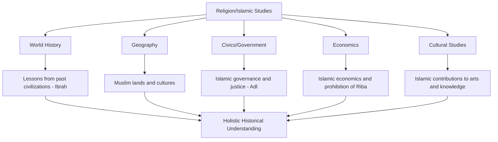

# Islamic Perspective in History Education

**Document Title:** Islamic Perspective in History Education
**Document ID:** IS_HIS_001
**Version:** 1.0
**Date:** 2026-01-11
**Project Name:** Smart Academy Digital Web Portal Development
**Content Category:** Islamic Studies Content

---

## Table of Contents

1. [Overview](#1-overview)
2. [Integration Philosophy](#2-integration-philosophy)
3. [Integration Framework](#3-integration-framework)
4. [Subject-Specific Integration](#4-subject-specific-integration)
5. [Teaching Strategies](#5-teaching-strategies)
6. [Lesson Planning](#6-lesson-planning)
7. [Assessment & Evaluation](#7-assessment--evaluation)
8. [Teacher Training](#8-teacher-training)
9. [Parent Engagement](#9-parent-engagement)
10. [FAQs](#10-faqs)

---

## 1. Overview

This document outlines Smart Academy's approach to integrating Islamic perspectives into history education. The integration is grounded in the belief that history is not merely a record of past events but a source of divine lessons (Ibrah) and guidance for humanity. Through the Re-STEAM framework (Religion + STEAM), students learn to view historical events through an Islamic worldview, understanding the rise and fall of civilizations as manifestations of Allah's wisdom and justice.

### 1.1 Philosophy

The Islamic philosophy of history education at Smart Academy is based on several fundamental principles:

- **Tawhid (Oneness of Allah)**: All historical events occur under Allah's knowledge and decree. History reveals Allah's consistent patterns in human affairs.
- **Ibrah (Lessons)**: History provides valuable lessons for guidance. The Quran repeatedly commands reflection on past civilizations.
- **Adl (Justice)**: Allah's justice is manifest in historical events. Nations rise and fall based on their deeds and adherence to truth.
- **Sabq (Precedent)**: Past events provide precedents for understanding present circumstances and preparing for the future.
- **Ummah (Community)**: Islamic history emphasizes the importance of community, unity, and collective responsibility.
- **Balance**: History education balances understanding of Islamic heritage with appreciation of other civilizations' contributions.

### 1.2 Goals

The integration of Islamic perspectives in history education aims to achieve the following goals:

**Knowledge Goals:**
- Understand Islamic history as part of Allah's plan for humanity
- Learn about the contributions of Islamic civilization to world history
- Recognize Quranic stories and their historical significance
- Understand the history of Bangladesh from an Islamic perspective
- Appreciate the diversity of Muslim cultures and civilizations

**Skills Goals:**
- Analyze historical events through an Islamic worldview
- Identify patterns and lessons from past civilizations
- Evaluate historical sources critically
- Connect historical events to contemporary issues
- Conduct historical research with Islamic ethics

**Character Goals:**
- Develop pride in Islamic heritage while maintaining humility
- Cultivate gratitude for the sacrifices of previous generations
- Learn from the mistakes and successes of past civilizations
- Develop a sense of responsibility to contribute positively to history
- Strengthen faith through understanding Allah's patterns in history

---

## 2. Integration Philosophy

### 2.1 Islamic Foundations

The integration of Islamic perspectives in history education is founded on authentic Islamic sources:

**Quranic Foundations:**

> "Indeed, in the stories of the prophets, there is a lesson for people of understanding. It is not a fabricated narration but a confirmation of what came before it and a detailed explanation of all things and guidance and mercy for a people who believe."
> — Quran 12:111

> "So have they not traveled through the earth and observed how was the end of those before them? They were greater than them in strength and in the traces on the land, but Allah seized them for their sins. And they had not from Allah any protector."
> — Quran 40:21

> "And We certainly sent Moses with Our signs, [saying], 'Bring out your people from darknesses into the light and remind them of the days of Allah.' Indeed in that are signs for everyone patient and grateful."
> — Quran 14:5

> "Then We gave Moses the Scripture, making complete [Our favor] upon the one who did good, and as a detailed explanation of all things and as guidance and mercy that perhaps in the meeting with their Lord they would believe."
> — Quran 6:154

**Hadith Foundations:**

> "The best of people are those of my generation, then those who follow them, then those who follow them."
> — Sahih Bukhari, Book 48, Hadith 819

> "Whoever holds fast to my Sunnah when my Ummah becomes corrupt will have the reward of a hundred martyrs."
> — Sunan al-Tirmidhi, Book 46, Hadith 3680

> "The parable of the believers in their affection, mercy, and compassion for each other is that of a body. When any limb aches, the whole body reacts with sleeplessness and fever."
> — Sahih Bukhari, Book 73, Hadith 226

### 2.2 Re-STEAM Framework Integration

The Re-STEAM framework (Religion + STEAM) provides the structural foundation for integrating Islamic perspectives across history education:

**Key Integration Points:**

1. **History as Ibrah (Lessons)**: Historical events provide divine lessons for guidance
2. **Geography as Muslim Ummah**: Understanding the spread and diversity of Muslim lands
3. **Civics as Adl (Justice)**: Islamic principles of governance and social justice
4. **Economics as Halal/Haram**: Islamic economic principles and prohibition of usury (Riba)
5. **Cultural Studies as Heritage**: Appreciating Islamic contributions to arts, sciences, and knowledge

---

## 3. Integration Framework

### 3.1 Age-Appropriate Integration

The integration of Islamic perspectives is tailored to three developmental stages:

#### Early Childhood (3-6 years)

**Focus Areas:**
- Stories of Prophets (Qasas al-Anbiya) with simple lessons
- Basic understanding of Islamic holidays and their historical significance
- Introduction to important Islamic figures (Prophets, Companions)
- Simple concepts of community and helping others

**Integration Examples:**
- Story of Prophet Muhammad (PBUH) and his character
- Story of Prophet Ibrahim (AS) and his trust in Allah
- Eid celebrations and their historical meaning
- Simple stories of the Companions helping each other

#### Primary Level (6-11 years)

**Focus Areas:**
- Seerah (Life of Prophet Muhammad PBUH) in detail
- Stories of other Prophets with lessons
- Islamic Golden Age and Muslim scholars
- Basic history of Bangladesh and Islam
- Important Islamic events and their significance

**Integration Examples:**
- Study of Prophet Muhammad's (PBUH) life in Makkah and Madinah
- Stories of Prophet Musa (AS) and Prophet Isa (AS)
- Contributions of Muslim scientists and scholars
- History of Islam in Bengal
- Important battles in Islamic history

#### Secondary Level (11-16 years)

**Focus Areas:**
- Comprehensive Islamic history from the time of Prophet Muhammad (PBUH) to present
- Comparative study of civilizations
- Islamic contributions to world civilization
- History of Bangladesh with Islamic perspective
- Contemporary Islamic world and challenges
- Critical analysis of historical narratives

**Integration Examples:**
- Study of the Rightly Guided Caliphs (Khulafa Rashidun)
- Islamic Golden Age achievements in various fields
- Colonialism and its impact on Muslim lands
- Bangladesh Liberation War and Islamic perspectives
- Modern Islamic movements and their historical context

### 3.2 Integration Matrix

| Grade Level | History Topic | Islamic Integration | Quranic Reference | Key Islamic Concept |
|-------------|---------------|---------------------|-------------------|-------------------|
| Early Childhood | Prophets' Stories | Learning from Prophets' examples | Quran 12:111 | Ibrah (Lessons) |
| Early Childhood | Islamic Holidays | Historical significance of celebrations | Quran 2:185 | Shukr (Gratitude) |
| Primary | Seerah | Prophet Muhammad's (PBUH) character and leadership | Quran 33:21 | Uswa (Example) |
| Primary | Muslim Scientists | Contributions to knowledge | Quran 96:1-5 | Ilm (Knowledge) |
| Primary | Bengal History | Islam in Bengal | Quran 49:13 | Ummah (Community) |
| Secondary | Caliphate | Islamic governance | Quran 4:59 | Shura (Consultation) |
| Secondary | Islamic Golden Age | Peak of Islamic civilization | Quran 24:35 | Nur (Light) |
| Secondary | Colonialism | Testing and trial from Allah | Quran 3:140 | Ibtila (Trial) |
| Secondary | Bangladesh History | Islamic identity in Bangladesh | Quran 22:41 | Wali (Protectors) |
| Secondary | Modern World | Islamic response to modernity | Quran 13:11 | Taghyur (Change) |

---

## 4. Subject-Specific Integration

### 4.1 World History: Islamic Golden Age Contributions

**Islamic Perspective:**
World history education at Smart Academy emphasizes the significant contributions of Islamic civilization to human progress. The Islamic Golden Age (8th-14th centuries) represents a period of remarkable advancement in science, medicine, philosophy, arts, and governance.

**Key Integration Points:**

**The Rise of Islamic Civilization:**
- The establishment of the Islamic state under Prophet Muhammad (PBUH)
- The Rightly Guided Caliphs (Khulafa Rashidun) and their governance
- The Umayyad and Abbasid Caliphates and their achievements
- The spread of Islam through trade, scholarship, and example

**Contributions to Knowledge:**

| Field | Contribution | Key Figures | Islamic Connection |
|-------|-------------|-------------|-------------------|
| **Mathematics** | Algebra, algorithms, Arabic numerals | Al-Khwarizmi | Seeking knowledge as worship |
| **Medicine** | Medical encyclopedia, surgery, pharmacology | Ibn Sina (Avicenna) | Healing as Allah's gift |
| **Astronomy** | Star catalogues, astronomical instruments | Al-Battani, Al-Farghani | Understanding Allah's creation |
| **Physics** | Optics, laws of motion | Ibn al-Haytham | Studying nature as signs of Allah |
| **Chemistry** | Distillation, chemical processes | Jabir ibn Hayyan | Understanding Allah's creation |
| **Geography** | World maps, travel accounts | Al-Idrisi, Ibn Battuta | Exploring Allah's earth |
| **Philosophy** | Integration of faith and reason | Al-Farabi, Ibn Rushd | Using reason to understand faith |
| **Architecture** | Mosques, palaces, public buildings | Various architects | Beauty in Allah's creation |

**Institutions of Learning:**
- Bayt al-Hikmah (House of Wisdom) in Baghdad
- Al-Azhar University in Cairo
- Libraries and translation movements
- The madrasah system of education

**Quranic Connections:**

> "Read! In the Name of your Lord Who has created. He has created man from a clot. Read! And your Lord is the Most Generous. Who has taught by the pen. He has taught man that which he knew not."
> — Quran 96:1-5

> "Allah will raise those who have believed among you and those who were given knowledge, by degrees."
> — Quran 58:11

> "And say, 'My Lord, increase me in knowledge.'"
> — Quran 20:114

**Lesson Example: The House of Wisdom (Bayt al-Hikmah)**

**Objective:** Students will understand the significance of the House of Wisdom and appreciate the Islamic commitment to knowledge and learning.

**Islamic Integration:**
- Study the establishment and purpose of Bayt al-Hikmah
- Learn about the translation movement and preservation of knowledge
- Discuss how seeking knowledge is an act of worship in Islam
- Reflect on the importance of preserving and sharing knowledge

**Activity:**
- Research one scholar associated with Bayt al-Hikmah
- Create a presentation on their contributions
- Discuss how their work reflects Islamic values
- Write a reflection on the importance of knowledge in Islam

### 4.2 Geography: Muslim Countries and Cultures

**Islamic Perspective:**
Geography education at Smart Academy emphasizes the diversity of Muslim lands and cultures, highlighting the unity of the Ummah (global Muslim community) across different regions.

**Key Integration Points:**

**The Muslim World:**
- Geographic distribution of Muslim populations
- Diversity of cultures, languages, and traditions
- Shared Islamic values across different cultures
- Historical spread of Islam through trade, scholarship, and migration

**Key Muslim Regions:**

| Region | Countries | Cultural Highlights | Islamic Significance |
|--------|-----------|-------------------|-------------------|
| **Arabian Peninsula** | Saudi Arabia, Yemen, Oman, UAE | Birthplace of Islam, Arabic language | Home to Makkah and Madinah |
| **North Africa** | Egypt, Morocco, Algeria, Tunisia, Libya | Berber and Arab cultures, Islamic architecture | Centers of Islamic learning |
| **Sub-Saharan Africa** | Nigeria, Senegal, Mali, Sudan | Diverse African cultures, Sufi traditions | Historic Islamic empires |
| **Middle East** | Turkey, Iran, Iraq, Syria, Jordan | Persian, Turkish, Arab cultures | Rich Islamic history |
| **South Asia** | Pakistan, Bangladesh, India, Afghanistan | Bengali, Urdu, Persian influences | Large Muslim populations |
| **Southeast Asia** | Indonesia, Malaysia, Brunei | Malay, Javanese, other cultures | Largest Muslim population |
| **Central Asia** | Uzbekistan, Kazakhstan, Turkmenistan | Turkic cultures, Silk Road heritage | Historic Islamic centers |
| **Europe** | Albania, Bosnia, Kosovo | European Muslim cultures | Bridge between East and West |

**Quranic Connections:**

> "O mankind, indeed We have created you from male and female and made you peoples and tribes that you may know one another. Indeed, the most noble of you in the sight of Allah is the most righteous of you. Indeed, Allah is Knowing and Acquainted."
> — Quran 49:13

> "And to Allah belongs the east and the west. So wherever you turn, there is the Face of Allah. Indeed, Allah is All-Encompassing and Knowing."
> — Quran 2:115

**Lesson Example: The Hajj - A Global Gathering**

**Objective:** Students will understand the Hajj pilgrimage as a manifestation of Muslim unity and diversity.

**Islamic Integration:**
- Study the geography of the Arabian Peninsula
- Learn about the Hajj rituals and their significance
- Explore how Muslims from around the world gather in unity
- Discuss the concept of Ummah (global Muslim community)

**Activity:**
- Create a map showing Muslim countries
- Research Hajj experiences from different cultures
- Design a presentation on the diversity of the Muslim Ummah
- Write a reflection on the importance of unity in diversity

### 4.3 Civics: Islamic Governance and Justice

**Islamic Perspective:**
Civics education at Smart Academy emphasizes Islamic principles of governance, justice, and social responsibility. Students learn about the Islamic concept of Adl (justice) and Shura (consultation) in governance.

**Key Integration Points:**

**Islamic Principles of Governance:**

| Principle | Meaning | Application |
|-----------|---------|-------------|
| **Adl** | Justice | Fair treatment for all citizens |
| **Shura** | Consultation | Decision-making through consultation |
| **Amanah** | Trust | Leaders are entrusted with responsibility |
| **Maslahah** | Public Interest | Policies that benefit the community |
| **Huquq** | Rights | Protection of individual and community rights |
| **Hisbah** | Accountability | Accountability to Allah and people |

**Historical Examples of Islamic Governance:**

1. **The Constitution of Madinah (Sahifah al-Madinah):**
   - First written constitution in history
   - Established rights for all citizens
   - Guaranteed religious freedom
   - Defined responsibilities of the state

2. **The Rightly Guided Caliphs (Khulafa Rashidun):**
   - Abu Bakr (RA): Justice and accountability
   - Umar ibn al-Khattab (RA): Welfare state and justice
   - Uthman ibn Affan (RA): Compilation of the Quran
   - Ali ibn Abi Talib (RA): Knowledge and justice

3. **Islamic Legal Systems:**
   - Sharia as a comprehensive legal framework
   - Qadi (judges) and their role
   - Protection of rights for all citizens
   - Emphasis on justice and compassion

**Quranic Connections:**

> "O you who have believed, obey Allah and obey the Messenger and those in authority among you."
> — Quran 4:59

> "Indeed, Allah commands you to render trusts to whom they are due and when you judge between people to judge with justice."
> — Quran 4:58

> "And consult them in the matter. And when you have decided, then rely upon Allah."
> — Quran 3:159

> "O you who have believed, be persistently standing firm for Allah, witnesses in justice, and do not let the hatred of a people prevent you from being just. Be just; that is nearer to righteousness."
> — Quran 5:8

**Lesson Example: Justice in Islamic History**

**Objective:** Students will understand the Islamic concept of justice through historical examples.

**Islamic Integration:**
- Study the story of Caliph Umar (RA) and the Jewish woman
- Learn about the Islamic welfare state established by Umar (RA)
- Discuss how Islamic justice applies to all people regardless of religion
- Reflect on the importance of justice in society

**Activity:**
- Research stories of justice from Islamic history
- Create a presentation on Islamic justice principles
- Compare Islamic justice with other systems
- Write a reflection on the importance of justice today

### 4.4 Economics: Islamic Finance, Prohibition of Riba

**Islamic Perspective:**
Economics education at Smart Academy emphasizes Islamic economic principles, including the prohibition of Riba (usury/interest), the importance of Zakah (obligatory charity), and the concept of Halal (permissible) economic activities.

**Key Integration Points:**

**Islamic Economic Principles:**

| Principle | Meaning | Application |
|-----------|---------|-------------|
| **Halal** | Permissible | Only permissible business activities |
| **Haram** | Prohibited | Avoiding prohibited transactions |
| **Riba** | Usury/Interest | Prohibition of interest-based transactions |
| **Zakah** | Obligatory Charity | 2.5% annual wealth distribution |
| **Sadaqah** | Voluntary Charity | Voluntary giving to help others |
| **Mudarabah** | Profit-sharing | Partnership based on profit-sharing |
| **Musharakah** | Joint Venture | Partnership with shared capital and profit |
| **Waqf** | Endowment | Charitable endowment for public benefit |

**Historical Examples of Islamic Economics:**

1. **The Economic System in Madinah:**
   - Establishment of the marketplace (Suq)
   - Fair trade practices
   - Protection of consumers
   - Support for the poor and needy

2. **Zakah and Welfare:**
   - Institutionalized charity
   - Support for the poor, orphans, and travelers
   - Economic redistribution
   - Social safety net

3. **Islamic Trade:**
   - Fair trade practices
   - Honest measurement and weighing
   - Ethical business conduct
   - Global trade networks

**Quranic Connections:**

> "O you who have believed, do not consume one another's wealth unjustly but only [in lawful] business by mutual consent."
> — Quran 4:29

> "And do not consume one another's wealth unjustly or send it [in bribery] to the rulers in order that [they might aid] you [to] consume a portion of the wealth of the people in sin, while you know [it is unlawful]."
> — Quran 2:188

> "Those who consume interest cannot stand [on the Day of Resurrection] except as one stands who is being beaten by Satan into insanity."
> — Quran 2:275

> "And establish prayer and give Zakah and bow with those who bow [in worship and obedience]."
> — Quran 2:43

**Lesson Example: The Prohibition of Riba**

**Objective:** Students will understand the Islamic prohibition of Riba and its implications for modern economic systems.

**Islamic Integration:**
- Study Quranic verses and Hadith about Riba
- Understand the reasons for the prohibition
- Compare Islamic finance with conventional finance
- Discuss practical applications in daily life

**Activity:**
- Research Islamic banking and finance
- Compare interest-based and Islamic financial products
- Create a presentation on Islamic economic principles
- Write a reflection on ethical economics

### 4.5 Islamic History in Bangladesh Context

**Islamic Perspective:**
Bangladesh has a rich Islamic history that spans over a millennium. Students learn about the arrival of Islam in Bengal, the contributions of Muslim rulers and scholars, and the role of Islam in Bangladesh's independence and identity.

**Key Integration Points:**

**Timeline of Islam in Bengal:**

| Period | Key Events | Significance |
|--------|-----------|--------------|
| **8th-13th Century** | Arrival of Islam through Arab traders | Early Islamic presence in Bengal |
| **13th-14th Century** | Muslim rule established | Beginning of Islamic Bengal |
| **14th-16th Century** | Bengal Sultanate | Golden age of Islamic Bengal |
| **16th-18th Century** | Mughal Empire | Integration into Mughal Empire |
| **18th-19th Century** | British Colonial Period | Challenges to Islamic identity |
| **1947** | Partition of India | Creation of East Pakistan |
| **1971** | Liberation War | Independence of Bangladesh |
| **1971-Present** | Modern Bangladesh | Islamic identity in modern nation |

**Key Figures in Bengali Islamic History:**

| Figure | Period | Contribution |
|--------|--------|-------------|
| **Shah Jalal (RA)** | 14th Century | Spread of Islam in Sylhet |
| **Khan Jahan Ali (RA)** | 15th Century | Islamic architecture and development |
| **Haji Shariatullah** | 19th Century | Faraizi movement |
| **Titumir** | 19th Century | Resistance against oppression |
| **Khwaja Salimullah** | Early 20th Century | Muslim League and Pakistan movement |
| **Maulana Bhashani** | Mid-20th Century | Political and Islamic leadership |

**Islamic Heritage Sites in Bangladesh:**

1. **Sixty Dome Mosque (Shat Gombuj Masjid)** - Bagerhat
2. **Khan Jahan Ali's Tomb** - Bagerhat
3. **Shah Jalal's Shrine** - Sylhet
4. **Tara Masjid** - Dhaka
5. **Lalbagh Fort Mosque** - Dhaka
6. **Ahsan Manzil** - Dhaka
7. **Bagha Mosque** - Rajshahi
8. **Kusumba Mosque** - Naogaon

**Quranic Connections:**

> "And why did you not, when you entered your garden, say, 'What Allah willed [has occurred]; there is no power except in Allah'?"
> — Quran 18:39

> "And whoever fears Allah - He will make for him a way out and will provide for him from where he does not expect."
> — Quran 65:2-3

**Lesson Example: Islam in Bengal - A Historical Journey**

**Objective:** Students will understand the historical development of Islam in Bengal and its impact on Bangladeshi culture and identity.

**Islamic Integration:**
- Study the arrival and spread of Islam in Bengal
- Learn about key figures and their contributions
- Explore Islamic architecture and heritage sites
- Discuss the role of Islam in Bangladesh's identity

**Activity:**
- Create a timeline of Islamic history in Bengal
- Research one Islamic heritage site in Bangladesh
- Design a presentation on Muslim contributions to Bengali culture
- Write a reflection on the importance of Islamic heritage

---

## 5. Teaching Strategies

### 5.1 Storytelling with Islamic Context

**Strategy Description:**
Storytelling is a powerful method for teaching history, especially when it involves stories from the Quran and Seerah. Stories engage students emotionally and help them remember lessons.

**Implementation Steps:**

1. **Select Stories Carefully:**
   - Choose authentic stories from Quran and reliable historical sources
   - Ensure stories are age-appropriate
   - Select stories with clear lessons and moral values

2. **Prepare the Story:**
   - Research the story thoroughly
   - Identify key lessons and Islamic principles
   - Prepare engaging narrative elements

3. **Tell the Story:**
   - Use expressive voice and gestures
   - Pause for reflection at key moments
   - Ask questions to engage students
   - Connect story to students' lives

4. **Reinforce Lessons:**
   - Discuss the moral of the story
   - Connect to Quranic verses or Hadith
   - Encourage student reflections
   - Apply lessons to modern contexts

**Story Examples:**
- The story of Prophet Yusuf (AS) - patience and trust in Allah
- The story of the Battle of Badr - trust in Allah and courage
- The story of the Constitution of Madinah - justice and unity
- The story of Caliph Umar (RA) and justice - accountability

### 5.2 Inquiry-Based Historical Analysis

**Strategy Description:**
Inquiry-based learning encourages students to ask questions, investigate historical events, and draw conclusions. When integrated with Islamic context, students learn to analyze history through an Islamic worldview.

**Implementation Steps:**

1. **Pose Provocative Questions:**
   - "Why did the Islamic Golden Age produce so many advancements?"
   - "What lessons can we learn from the fall of past civilizations?"
   - "How did Islamic principles influence governance in Muslim history?"
   - "What can we learn from the Seerah about leadership?"

2. **Facilitate Investigation:**
   - Provide primary and secondary sources
   - Encourage students to consult Quranic references
   - Guide students to analyze causes and effects
   - Help students identify patterns and lessons

3. **Share and Reflect:**
   - Students present findings with Islamic connections
   - Group discussions on lessons from history
   - Reflection journals on historical insights
   - Applications to contemporary issues

### 5.3 Project-Based Learning (PBL) with Historical Themes

**Strategy Description:**
Project-based learning engages students in extended projects that require research, critical thinking, and creativity. Historical projects integrate historical knowledge with Islamic values and contemporary relevance.

**Project Examples:**

**Project 1: Muslim Scientists Timeline**
- **Grade Level**: Primary (8-11 years)
- **Duration**: 4 weeks
- **History Content**: Islamic Golden Age, Muslim scientists
- **Islamic Integration**: Learning from Muslim scholars, seeking knowledge as worship
- **Deliverables**: 
  - Interactive timeline of Muslim scientists
  - Biographies of selected scientists
  - Demonstrations of their contributions
  - Reflection on lessons from their lives

**Project 2: Islamic Heritage Sites in Bangladesh**
- **Grade Level**: Secondary (12-15 years)
- **Duration**: 6 weeks
- **History Content**: Islamic history in Bengal, architecture
- **Islamic Integration**: Appreciation of Islamic heritage, understanding of Islamic art
- **Deliverables**:
  - Virtual tour of heritage sites
  - Historical research on selected sites
  - Architectural analysis with Islamic significance
  - Preservation recommendations

**Project 3: The Seerah - A Leadership Study**
- **Grade Level**: Secondary (14-16 years)
- **Duration**: 8 weeks
- **History Content**: Life of Prophet Muhammad (PBUH)
- **Islamic Integration**: Learning from the Prophet's example (Uswa Hasanah)
- **Deliverables**:
  - Leadership lessons from Seerah
  - Case studies of specific events
  - Applications to modern leadership
  - Personal leadership development plan

### 5.4 Experiential Learning Through Field Trips

**Strategy Description:**
Field trips provide direct experience with historical sites and artifacts, helping students develop a personal connection with history.

**Field Trip Ideas:**

1. **Local Islamic Heritage Sites:**
   - Visit historic mosques in Bangladesh
   - Explore Islamic architecture and art
   - Learn about local Islamic history
   - Document observations and reflections

2. **Museums:**
   - Visit museums with Islamic collections
   - Study historical artifacts
   - Learn about Islamic contributions to civilization
   - Create reports or presentations

3. **Historical Reenactments:**
   - Participate in historical reenactments
   - Experience historical events firsthand
   - Develop empathy for historical figures
   - Reflect on lessons learned

### 5.5 Cross-Curricular Integration

**Strategy Description:**
History education integrated with other subjects creates a holistic learning experience where students see connections across disciplines.

**Integration Examples:**

**History + Islamic Studies:**
- Study Seerah in depth with Islamic analysis
- Connect historical events to Quranic lessons
- Learn about Islamic jurisprudence (Fiqh) through history
- Understand the development of Islamic thought

**History + Geography:**
- Map the spread of Islam
- Study the geography of Muslim lands
- Understand how geography influenced Islamic history
- Explore trade routes and cultural exchange

**History + Language Arts:**
- Read historical texts and primary sources
- Write historical narratives with Islamic perspectives
- Analyze historical speeches and documents
- Create poetry inspired by historical events

**History + Art:**
- Study Islamic art and architecture
- Create artwork inspired by historical periods
- Analyze the relationship between art and faith
- Design historical exhibits

---

## 6. Lesson Planning

### 6.1 Lesson Planning Template

**Islamic-Integrated History Lesson Plan**

| Section | Content |
|---------|---------|
| **Lesson Title** | [Title with Islamic connection] |
| **Grade Level** | [Early Childhood/Primary/Secondary] |
| **Duration** | [Time] |
| **History Topic** | [Historical concept/event] |
| **Islamic Integration** | [Islamic concept/principle] |
| **Quranic Reference** | [Relevant verse(s)] |
| **Learning Objectives** | [Knowledge, Skills, Character] |
| **Materials Needed** | [List of materials] |
| **Key Vocabulary** | [Historical and Islamic terms] |

**Lesson Procedure:**

1. **Introduction (5-10 minutes)**
   - Hook: Engaging question or story
   - Islamic connection: Introduce the Islamic perspective
   - Objectives: Share learning goals

2. **Direct Instruction (10-15 minutes)**
   - Present historical content
   - Integrate Islamic perspective
   - Connect to Quranic verses or Hadith
   - Show real-world applications

3. **Guided Practice (15-20 minutes)**
   - Demonstrate analysis methods
   - Guide students through activities
   - Facilitate Islamic reflections
   - Encourage questions and discussion

4. **Independent Practice (15-20 minutes)**
   - Students work independently or in groups
   - Apply historical analysis
   - Make Islamic connections
   - Document learning

5. **Closure (5-10 minutes)**
   - Review key concepts
   - Reinforce Islamic integration
   - Student reflections
   - Preview next lesson

**Assessment:**
- [Formative assessment methods]
- [Summative assessment methods]
- [Islamic understanding assessment]

**Differentiation:**
- [For advanced learners]
- [For struggling learners]
- [For students with special needs]

**Homework/Extension:**
- [Reinforcement activities]
- [Extension activities]
- [Islamic practice connections]

### 6.2 Sample Lesson Plans

#### Sample Lesson 1: The Story of Prophet Yusuf (AS) - Patience and Trust

**Grade Level:** Primary (9-10 years)
**Duration:** 45 minutes
**History Topic:** Story of Prophet Yusuf (AS)
**Islamic Integration:** Sabr (Patience) and Tawakkul (Trust in Allah)

**Learning Objectives:**
- **Knowledge:** Understand the story of Prophet Yusuf (AS)
- **Skills:** Identify lessons from the story
- **Character:** Develop patience and trust in Allah

**Quranic Reference:**
> "Indeed, he who fears Allah and is patient, then indeed, Allah does not allow to be lost the reward of those who do good."
> — Quran 12:90

**Materials:**
- Quran (Surah Yusuf)
- Story illustrations
- Reflection journals
- Colored pencils

**Procedure:**

**Introduction (5 minutes):**
- Ask: "Have you ever faced a difficult situation?"
- Discuss the concept of patience
- Introduce Prophet Yusuf (AS) as an example of patience

**Direct Instruction (10 minutes):**
- Tell the story of Prophet Yusuf (AS)
- Highlight key moments of difficulty and patience
- Connect to Quran: "Indeed, Allah is with the patient"
- Discuss: What can we learn from Yusuf's (AS) patience?

**Guided Practice (15 minutes):**
- Students identify key moments in the story
- Discuss how Yusuf (AS) showed patience
- Guide reflection: How can we apply this to our lives?
- Discuss: What does Tawakkul (trust in Allah) mean?

**Independent Practice (15 minutes):**
- Students create a timeline of Yusuf's (AS) story
- Write lessons learned from each stage
- Write a personal reflection on patience

**Closure (5 minutes):**
- Review key lessons from the story
- Ask: "How can we practice patience in our daily lives?"
- Students share one thing they learned

**Assessment:**
- Formative: Participation in discussion
- Summative: Timeline and reflection
- Islamic: Personal reflection on patience

#### Sample Lesson 2: The Constitution of Madinah - Justice and Unity

**Grade Level:** Secondary (13-14 years)
**Duration:** 60 minutes
**History Topic:** Constitution of Madinah
**Islamic Integration:** Adl (Justice) and Wahdah (Unity)

**Learning Objectives:**
- **Knowledge:** Understand the Constitution of Madinah
- **Skills:** Analyze historical documents
- **Character:** Appreciate justice and unity

**Quranic Reference:**
> "O you who have believed, be persistently standing firm for Allah, witnesses in justice, and do not let the hatred of a people prevent you from being just."
> — Quran 5:8

**Materials:**
- Text of the Constitution of Madinah
- Historical context information
- Analysis worksheets
- Comparison charts

**Procedure:**

**Introduction (10 minutes):**
- Ask: "What makes a good constitution?"
- Discuss the concept of justice in governance
- Introduce the Constitution of Madinah

**Direct Instruction (15 minutes):**
- Explain the historical context of the Constitution
- Outline key provisions of the document
- Connect to Quran: Principles of justice and unity
- Discuss: Why was this document revolutionary?

**Guided Practice (15 minutes):**
- Students analyze specific provisions
- Discuss how the document ensured justice
- Guide comparison with modern constitutions
- Discuss: What can we learn from this document?

**Independent Practice (15 minutes):**
- Students create a modern application of the principles
- Write an essay on justice in governance
- Design a poster on unity in diversity

**Closure (5 minutes):**
- Review key principles of the Constitution
- Ask: "How can we apply these principles today?"
- Students share reflections

**Assessment:**
- Formative: Participation in analysis
- Summative: Essay or poster
- Islamic: Reflection on justice and unity

#### Sample Lesson 3: The Islamic Golden Age - Contributions to Knowledge

**Grade Level:** Secondary (14-16 years)
**Duration:** 50 minutes
**History Topic:** Islamic Golden Age
**Islamic Integration:** Ilm (Knowledge) and Hikmah (Wisdom)

**Learning Objectives:**
- **Knowledge:** Understand the achievements of the Islamic Golden Age
- **Skills:** Research and present historical information
- **Character:** Appreciate the value of knowledge

**Quranic Reference:**
> "Read! In the Name of your Lord Who has created."
> — Quran 96:1

**Materials:**
- Research materials on Islamic Golden Age
- Presentation software
- Biographies of Muslim scholars
- Timeline templates

**Procedure:**

**Introduction (5 minutes):**
- Ask: "What was the Islamic Golden Age?"
- Discuss the importance of knowledge in Islam
- Introduce key achievements of the period

**Direct Instruction (10 minutes):**
- Overview of the Islamic Golden Age
- Key fields of achievement
- Connect to Quran: Seeking knowledge as worship
- Discuss: Why was this period so productive?

**Guided Practice (15 minutes):**
- Students research one Muslim scholar
- Guide analysis of their contributions
- Discuss: How did their faith influence their work?
- Share findings with class

**Independent Practice (15 minutes):**
- Students create presentations on their scholar
- Include biographical information and achievements
- Connect to Islamic values
- Present to class

**Closure (5 minutes):**
- Review key achievements
- Ask: "How can we contribute to knowledge today?"
- Students share reflections

**Assessment:**
- Formative: Research process
- Summative: Presentation
- Islamic: Reflection on knowledge and faith

### 6.3 Weekly Integration Schedule

| Week | History Topic | Islamic Integration | Quranic Reference | Key Activity |
|------|---------------|---------------------|-------------------|--------------|
| 1 | Introduction to History | History as lessons (Ibrah) | Quran 12:111 | What is history? |
| 2 | Quranic Stories | Learning from Prophets | Quran 12:111 | Story analysis |
| 3 | Prophet Muhammad's (PBUH) Life | Uswa (Example) | Quran 33:21 | Seerah timeline |
| 4 | The Rightly Guided Caliphs | Justice (Adl) and Shura | Quran 4:59 | Caliph profiles |
| 5 | Islamic Golden Age | Knowledge (Ilm) | Quran 96:1-5 | Scholar research |
| 6 | Muslim Scientists | Seeking knowledge | Quran 58:11 | Scientist presentations |
| 7 | Islamic Architecture | Beauty in creation | Quran 16:8 | Architecture study |
| 8 | Islamic Art | Art as worship | Quran 7:32 | Art appreciation |
| 9 | Islamic Law (Sharia) | Justice and mercy | Quran 5:8 | Law case studies |
| 10 | Islamic Economics | Halal and Haram | Quran 2:275 | Economic principles |
| 11 | Zakah and Charity | Generosity (Karam) | Quran 2:177 | Charity project |
| 12 | Muslim Lands | Ummah (Community) | Quran 49:13 | Geography project |
| 13 | Islam in Bengal | Islamic heritage | Quran 22:41 | Heritage study |
| 14 | Muslim Rulers of Bengal | Leadership | Quran 38:26 | Ruler profiles |
| 15 | Islamic Architecture in Bengal | Beauty in faith | Quran 16:8 | Site visit |
| 16 | Colonial Period | Trial (Ibtila) | Quran 3:140 | Resistance study |
| 17 | Partition of India | Unity and division | Quran 3:103 | Analysis |
| 18 | Liberation War 1971 | Justice and freedom | Quran 22:40-41 | War stories |
| 19 | Islamic Identity in Bangladesh | Faith and nation | Quran 49:13 | Identity project |
| 20 | Contemporary Muslim World | Challenges and opportunities | Quran 13:11 | Current events |
| 21 | Islamic Movements | Reform and revival | Quran 9:71 | Movement analysis |
| 22 | Muslim Women in History | Women's contributions | Quran 33:35 | Women's profiles |
| 23 | Islamic Education | Seeking knowledge | Quran 20:114 | Education systems |
| 24 | Islamic Science | Faith and reason | Quran 2:164 | Science and Islam |
| 25 | Islamic Philosophy | Reason and revelation | Quran 3:190 | Philosophical debates |
| 26 | Islamic Literature | Literature as guidance | Quran 39:27 | Literary analysis |
| 27 | Comparative Civilizations | Learning from others | Quran 5:48 | Civilization comparison |
| 28 | Lessons from History | Ibrah (Lessons) | Quran 12:111 | Historical analysis |
| 29 | Making History | Responsibility (Amanah) | Quran 6:165 | Future planning |
| 30 | Review & Celebration | Integration of all concepts | Multiple | History fair |

---

## 7. Assessment & Evaluation

### 7.1 Assessment Framework

**Holistic Assessment Approach:**

Assessment in Islamic-integrated history education evaluates three dimensions:

1. **Historical Understanding**: Knowledge of historical events and concepts
2. **Islamic Integration**: Understanding of Islamic perspectives and connections
3. **Character Development**: Internalization of Islamic values and attitudes

**Assessment Types:**

| Assessment Type | Purpose | Example |
|-----------------|---------|---------|
| **Diagnostic** | Identify prior knowledge | Pre-test on historical concepts and Islamic understanding |
| **Formative** | Monitor progress and provide feedback | Observation during activities, exit tickets, questioning |
| **Summative** | Evaluate learning at end of unit | Tests, projects, presentations |
| **Authentic** | Apply learning in real-world contexts | Historical research projects, museum exhibits |

### 7.2 Assessment Rubrics

#### Rubric 1: Historical Understanding with Islamic Integration

| Criteria | Excellent (4) | Proficient (3) | Developing (2) | Beginning (1) |
|----------|---------------|----------------|----------------|---------------|
| **Historical Knowledge** | Demonstrates deep understanding of historical events, makes accurate connections | Shows good understanding, makes mostly accurate connections | Shows basic understanding, makes some connections | Shows limited understanding, makes few or no connections |
| **Islamic Integration** | Makes insightful connections between history and Islamic principles, cites relevant Quran/Hadith | Makes appropriate connections, cites some references | Makes basic connections, limited references | Makes minimal or no connections |
| **Critical Analysis** | Analyzes complex historical events, asks thoughtful questions | Analyzes events, asks relevant questions | Identifies events, asks basic questions | Limited analysis, few questions |
| **Communication** | Explains clearly with examples, uses appropriate terminology | Explains clearly, uses some terminology | Explains with limited clarity, basic terminology | Unclear explanation, limited terminology |

#### Rubric 2: Project-Based Assessment

| Criteria | Excellent (4) | Proficient (3) | Developing (2) | Beginning (1) |
|----------|---------------|----------------|----------------|---------------|
| **Historical Accuracy** | All information accurate, demonstrates deep understanding | Most information accurate, demonstrates good understanding | Some information accurate, demonstrates basic understanding | Limited accuracy, minimal understanding |
| **Islamic Perspective** | Strong integration of Islamic perspective throughout | Good integration in most areas | Basic integration in some areas | Minimal or no integration |
| **Research Quality** | Thorough research from multiple sources | Good research from several sources | Basic research from limited sources | Minimal research |
| **Presentation Quality** | Professional, engaging, well-organized | Clear, organized | Basic organization | Poor organization |
| **Reflection** | Deep reflection on learning and Islamic connections | Good reflection on learning | Basic reflection | Minimal reflection |

#### Rubric 3: Character Development Assessment

| Criteria | Excellent (4) | Proficient (3) | Developing (2) | Beginning (1) |
|----------|---------------|----------------|----------------|---------------|
| **Appreciation of Heritage** | Consistently expresses appreciation for Islamic heritage | Frequently expresses appreciation | Sometimes expresses appreciation | Rarely expresses appreciation |
| **Learning from History** | Actively seeks lessons from historical events | Frequently seeks lessons | Sometimes seeks lessons | Rarely seeks lessons |
| **Respect for Diversity** | Shows respect for diverse cultures and perspectives | Shows respect in most situations | Shows respect in some situations | Limited respect demonstrated |
| **Sense of Responsibility** | Demonstrates strong sense of responsibility to contribute | Shows good sense of responsibility | Shows some sense of responsibility | Limited sense of responsibility |
| **Faith Connection** | Consistently connects historical learning to faith | Frequently connects learning to faith | Sometimes connects learning to faith | Rarely connects learning to faith |

### 7.3 Assessment Methods

#### 1. Written Assessments

**Tests and Quizzes:**
- Include both historical and Islamic integration questions
- Example format:
  - Multiple choice: Historical facts
  - Short answer: Explain events with Islamic connections
  - Essay: Analyze topic from Islamic perspective
  - Quran/Hadith identification: Match verses to historical events

**Example Questions:**

**Multiple Choice:**
1. Who was the first Caliph of Islam?
   a) Umar ibn al-Khattab
   b) Abu Bakr as-Siddiq
   c) Ali ibn Abi Talib
   d) Uthman ibn Affan

2. According to the Quran, what should we learn from the stories of previous civilizations?
   a) To conquer other nations
   b) To take lessons and warnings
   c) To copy their practices
   d) To forget the past

**Short Answer:**
1. Explain the significance of the Constitution of Madinah and how it demonstrated Islamic principles of justice.
2. Describe how the Islamic Golden Age contributed to world civilization.

**Essay:**
"Discuss the contributions of Muslim scientists during the Islamic Golden Age. How did their faith influence their scientific work? Use specific examples and Quranic verses to support your answer."

#### 2. Performance Assessments

**Research Projects:**
- Conduct historical research with Islamic perspective
- Document findings and connections
- Present findings with Islamic integration
- Create educational materials for others

**Presentations:**
- Present historical topics with Islamic connections
- Use multimedia to enhance understanding
- Engage audience in Islamic reflections
- Demonstrate deep understanding

**Debates and Discussions:**
- Debate historical issues from Islamic perspectives
- Analyze different viewpoints
- Use Islamic principles to support arguments
- Develop critical thinking skills

#### 3. Portfolio Assessment

**Portfolio Components:**
- Research papers with Islamic reflections
- Project documentation
- Historical analysis essays
- Reflection journals
- Creative work (poems, artwork, videos)

**Portfolio Review Process:**
- Student self-assessment
- Peer review
- Teacher assessment
- Parent/guardian review (optional)

#### 4. Observational Assessment

**Teacher Observation Checklist:**

| Behavior | Always | Sometimes | Rarely | Comments |
|----------|--------|-----------|--------|----------|
| Shows interest in historical topics | | | | |
| Makes connections between history and Islam | | | | |
| Demonstrates respect for historical figures | | | | |
| Seeks lessons from historical events | | | | |
| Works collaboratively on historical projects | | | | |
| Asks thoughtful questions about history | | | | |
| Expresses appreciation for Islamic heritage | | | | |
| Applies historical lessons to modern issues | | | | |

#### 5. Self-Assessment

**Student Reflection Journal Prompts:**

1. What historical event did I learn about today that increased my understanding of Allah's wisdom in history?
2. What lessons can I learn from this historical event?
3. How does this historical knowledge help me understand my role as a Muslim today?
4. What questions do I still have about this topic?
5. How can I apply what I learned to benefit my community?

### 7.4 Feedback Strategies

**Effective Feedback Principles:**

1. **Timely**: Provide feedback soon after assessment
2. **Specific**: Address specific strengths and areas for improvement
3. **Balanced**: Include both positive and constructive feedback
4. **Actionable**: Provide clear steps for improvement
5. **Islamic Context**: Frame feedback in Islamic terms when appropriate

**Feedback Examples:**

**Positive Feedback:**
- "Excellent analysis of the Constitution of Madinah. Your understanding of Islamic justice principles is deep and well-articulated."
- "Your research on Muslim scientists demonstrates thorough work and appreciation for their contributions."

**Constructive Feedback:**
- "Good understanding of the Islamic Golden Age. To strengthen your Islamic integration, try to connect the achievements more explicitly to the Islamic value of seeking knowledge."
- "Your project is creative. Consider adding Quranic verses that relate to the topic to enhance the Islamic perspective."

---

## 8. Teacher Training

### 8.1 Training Requirements

**Essential Training Components:**

1. **Islamic Studies Foundation:**
   - Understanding of Islamic philosophy of history
   - Knowledge of Quranic stories and historical references
   - Understanding of Islamic principles (Adl, Shura, Ummah)
   - Familiarity with Seerah and Islamic history

2. **History Content Knowledge:**
   - Deep understanding of historical events and periods
   - Knowledge of historical methods and analysis
   - Understanding of age-appropriate content
   - Familiarity with curriculum standards

3. **Pedagogical Skills:**
   - Integration strategies for Islamic perspectives
   - Storytelling and narrative techniques
   - Differentiated instruction
   - Assessment methods for integrated learning

4. **Character Development:**
   - Modeling Islamic values in teaching
   - Creating a positive Islamic learning environment
   - Guiding students in character formation
   - Facilitating historical reflection

### 8.2 Training Program Structure

**Phase 1: Foundation Training (2 weeks)**

**Week 1: Islamic Foundations**
- Day 1: Introduction to Islamic philosophy of history
- Day 2: Quranic foundations for history education
- Day 3: Hadith foundations for history education
- Day 4: Key Islamic concepts (Ibrah, Adl, Ummah)
- Day 5: Seerah and Islamic history overview

**Week 2: History Education Foundations**
- Day 1: History curriculum overview
- Day 2: Historical methods and analysis
- Day 3: Age-appropriate historical content
- Day 4: Sources and historiography
- Day 5: Assessment in history education

**Phase 2: Integration Training (2 weeks)**

**Week 3: Integration Strategies**
- Day 1: Framework for Islamic integration
- Day 2: Subject-specific integration (World History)
- Day 3: Subject-specific integration (Geography)
- Day 4: Subject-specific integration (Civics)
- Day 5: Subject-specific integration (Economics)

**Week 4: Teaching Strategies**
- Day 1: Storytelling with Islamic context
- Day 2: Inquiry-based historical analysis
- Day 3: Project-based learning with historical themes
- Day 4: Experiential learning through field trips
- Day 5: Cross-curricular integration

**Phase 3: Practice and Application (2 weeks)**

**Week 5: Lesson Planning**
- Day 1: Lesson planning template
- Day 2: Developing integrated lesson plans
- Day 3: Peer review of lesson plans
- Day 4: Revising lesson plans
- Day 5: Finalizing lesson plans

**Week 6: Teaching Practice**
- Day 1: Micro-teaching sessions
- Day 2: Observation of experienced teachers
- Day 3: Co-teaching opportunities
- Day 4: Reflection and feedback
- Day 5: Final assessment

**Phase 4: Ongoing Professional Development**

**Monthly Workshops:**
- Topic-specific training
- Sharing best practices
- Addressing challenges
- New resources and materials

**Quarterly Reviews:**
- Assessment of implementation
- Student feedback
- Curriculum adjustments
- Professional development needs assessment

### 8.3 Training Resources

**Essential Resources:**

1. **Islamic Sources:**
   - Quran with translation and tafsir
   - Collections of authentic Hadith
   - Books on Islamic history and philosophy
   - Biographies of historical figures

2. **History Resources:**
   - History textbooks and curriculum guides
   - Primary and secondary historical sources
   - Maps and historical atlases
   - Digital resources and archives

3. **Integration Resources:**
   - Lesson plan templates
   - Integration examples and case studies
   - Assessment rubrics
   - Activity guides

4. **Professional Resources:**
   - Training manuals
   - Observation checklists
   - Reflection journals
   - Professional development plans

### 8.4 Teacher Competencies

**Core Competencies for Islamic-Integrated History Teachers:**

| Competency | Description | Indicators |
|------------|-------------|------------|
| **Islamic Knowledge** | Understanding of Islamic principles relevant to history | Cites relevant Quran/Hadith, explains Islamic concepts accurately |
| **Historical Knowledge** | Deep understanding of historical content | Explains events clearly, answers questions accurately |
| **Integration Skills** | Ability to connect history and Islam | Makes meaningful connections, uses appropriate examples |
| **Storytelling Skills** | Effective narrative techniques | Engages students through stories, maintains interest |
| **Pedagogical Skills** | Effective teaching strategies | Engages students, uses varied methods, differentiates instruction |
| **Character Modeling** | Demonstrates Islamic values | Models respect, justice, appreciation of heritage |
| **Assessment Skills** | Effective assessment of integrated learning | Uses varied assessments, provides meaningful feedback |
| **Reflection** | Continuous improvement | Reflects on practice, seeks feedback, implements changes |
| **Collaboration** | Works effectively with colleagues | Shares resources, collaborates on projects, supports peers |

---

## 9. Parent Engagement

### 9.1 Communication Strategies

**Regular Communication:**

1. **Newsletters:**
   - Monthly updates on history curriculum
   - Highlights of Islamic integration
   - Upcoming activities and projects
   - Resources for home learning

2. **Parent-Teacher Meetings:**
   - Discuss student progress in history and Islamic understanding
   - Share examples of student work
   - Provide resources for supporting learning at home
   - Address questions and concerns

3. **Digital Communication:**
   - Email updates on classroom activities
   - Online portal for accessing resources
   - Social media sharing of student projects
   - Virtual parent meetings when needed

### 9.2 Home Learning Activities

**Activities for Parents and Children:**

1. **Family History Projects:**
   - Create family trees with Islamic connections
   - Interview family members about their history
   - Document family Islamic heritage
   - Create family history presentations

2. **Historical Site Visits:**
   - Visit local Islamic heritage sites
   - Explore museums with Islamic collections
   - Document visits with photos and reflections
   - Share findings with family

3. **Storytelling at Home:**
   - Read stories from the Quran together
   - Share stories from Islamic history
   - Discuss lessons from stories
   - Create family story time traditions

4. **Cultural Celebrations:**
   - Celebrate Islamic holidays with historical context
   - Learn about Islamic traditions
   - Prepare traditional foods
   - Share cultural knowledge

### 9.3 Parent Workshops

**Workshop Topics:**

**Workshop 1: Understanding Islamic-Integrated History Education**
- Purpose and philosophy of integration
- Benefits for students
- How parents can support learning
- Q&A session

**Workshop 2: History at Home**
- Simple historical activities to do at home
- Using stories for learning
- Integrating Islamic perspectives at home
- Resources and materials

**Workshop 3: Family Heritage Projects**
- Importance of knowing family history
- Creating family trees
- Documenting Islamic heritage
- Sharing stories and traditions

**Workshop 4: Supporting Your Child's Learning**
- Understanding the curriculum
- Helping with homework
- Encouraging historical curiosity
- Fostering appreciation of heritage

### 9.4 Family History Events

**Event Ideas:**

1. **Family History Night:**
   - Student presentations on family history
   - Display of family trees
   - Sharing of family stories
   - Cultural food and traditions

2. **Heritage Site Visit:**
   - Guided visit to Islamic heritage sites
   - Historical education activities
   - Family exploration time
   - Reflection and sharing

3. **History Fair with Islamic Themes:**
   - Student projects showcasing history and Islam
   - Judging with Islamic integration criteria
   - Awards and recognition
   - Community celebration

4. **Cultural Festival:**
   - Celebration of diverse Muslim cultures
   - Food, music, and art from different regions
   - Educational presentations
   - Community gathering

---

## 10. FAQs

### 10.1 General Questions

**Q1: Why integrate Islamic perspectives into history education?**

**A:** Integrating Islamic perspectives into history education provides a holistic learning experience that:
- Helps students see history through their Islamic worldview
- Strengthens faith by showing Allah's patterns in history
- Provides valuable lessons (Ibrah) from past civilizations
- Connects learning to Islamic identity and values
- Honors the rich heritage of Islamic civilization

**Q2: Does Islamic integration compromise historical accuracy?**

**A:** No. Islamic integration enhances history education by:
- Maintaining high standards for historical accuracy and understanding
- Adding depth and meaning to historical events
- Encouraging critical analysis from multiple perspectives
- Providing motivation and purpose for historical study
- Connecting history to students' values and beliefs

**Q3: How do you handle sensitive historical topics?**

**A:** We approach sensitive topics with:
- Age-appropriate explanations
- Respect for different perspectives
- Emphasis on learning from history
- Focus on lessons rather than blame
- Islamic principles of justice and compassion

### 10.2 Curriculum Questions

**Q4: What historical topics are covered at each grade level?**

**A:** The curriculum follows a progression appropriate to each developmental stage:

**Early Childhood (3-6 years):**
- Stories of Prophets
- Islamic holidays and their significance
- Important Islamic figures
- Simple concepts of community

**Primary Level (6-11 years):**
- Seerah (Life of Prophet Muhammad PBUH)
- Stories of other Prophets
- Islamic Golden Age and Muslim scholars
- Basic history of Islam in Bengal

**Secondary Level (11-16 years):**
- Comprehensive Islamic history
- Comparative study of civilizations
- Islamic contributions to world civilization
- History of Bangladesh with Islamic perspective
- Contemporary Islamic world

**Q5: How are Quranic verses and Hadith selected for integration?**

**A:** Selection criteria include:
- Authenticity from reliable sources
- Relevance to historical topics
- Age-appropriateness for students
- Clear and understandable meaning
- Support for learning objectives

**Q6: How much time is devoted to Islamic integration in history classes?**

**A:** Islamic integration is woven throughout history education rather than treated as a separate component. Typically:
- Brief Islamic connections are made during most lessons (2-5 minutes)
- Some lessons have more extensive Islamic integration (10-15 minutes)
- Projects often include significant Islamic reflection components
- The approach is integrated rather than additive

### 10.3 Teaching and Learning Questions

**Q7: How do teachers prepare for Islamic-integrated history lessons?**

**A:** Teachers prepare by:
- Studying both historical content and relevant Islamic sources
- Using lesson plan templates that include Islamic integration
- Collaborating with Islamic Studies teachers
- Attending professional development on integration
- Reflecting on their own understanding of history and Islam

**Q8: How is student understanding of Islamic integration assessed?**

**A:** Assessment includes:
- Questions that require connecting history and Islamic concepts
- Projects that include Islamic perspectives
- Reflection journals on faith and history
- Observations of student engagement and attitudes
- Presentations that demonstrate integrated understanding

**Q9: What if students have questions teachers can't answer?**

**A:** We handle this by:
- Acknowledging the question and its importance
- Admitting when we don't know the answer
- Researching together with students
- Consulting with Islamic scholars or historians
- Following up with answers in subsequent classes

### 10.4 Parent and Community Questions

**Q10: How can parents support Islamic-integrated history learning at home?**

**A:** Parents can support learning by:
- Encouraging curiosity about history and heritage
- Reading Quranic stories together
- Sharing family history and traditions
- Visiting historical sites together
- Discussing current events from Islamic perspectives
- Attending school history events
- Providing resources for further learning

**Q11: Are there opportunities for parents to get involved?**

**A:** Yes, parents can get involved through:
- Attending parent workshops on history education
- Volunteering for history activities and events
- Sharing their family history with classes
- Participating in family history events
- Joining the parent committee for curriculum feedback
- Supporting heritage preservation initiatives

**Q12: How does the school ensure Islamic authenticity?**

**A:** We ensure authenticity by:
- Consulting with Islamic scholars and historians
- Using authentic Quranic and Hadith sources
- Reviewing content with Islamic Studies coordinators
- Providing teacher training on Islamic foundations
- Seeking feedback from religious scholars
- Regular review and update of materials

### 10.5 Assessment and Evaluation Questions

**Q13: How are students graded in Islamic-integrated history?**

**A:** Grading reflects:
- Historical understanding and skills
- Ability to make Islamic connections
- Quality of work and projects
- Participation and engagement
- Character development and attitudes

**Q14: Do Islamic integration activities count toward grades?**

**A:** Yes, Islamic integration is part of the overall assessment:
- Reflection journals may be graded
- Projects include Islamic integration criteria
- Some test questions assess Islamic understanding
- Character development is noted in progress reports

**Q15: How do you measure character development?**

**A:** Character development is measured through:
- Teacher observations and checklists
- Student self-reflection journals
- Peer feedback
- Parent observations
- Demonstration of values in actions and projects

---

## Document Approval

| Role | Name | Signature | Date |
|------|------|-----------|------|
| Islamic Studies Coordinator | | _________________ | ________ |
| Principal | | _________________ | ________ |
| History Department Head | | _________________ | ________ |
| Curriculum Coordinator | | _________________ | ________ |

---

**Document Control:**

| Version | Date | Changes | Author |
|---------|------|---------|--------|
| 1.0 | 2026-01-11 | Initial document creation | Documentation Specialist |

---

**Related Documents:**
- [`islamic-perspective-science.md`](./islamic-perspective-science.md)
- [`islamic-ethics-education.md`](./islamic-ethics-education.md)
- [`islamic-values-framework.md`](./islamic-values-framework.md)
- [Smart Academy Curriculum Framework](../Curriculum_Framework/curriculum-framework.md)
