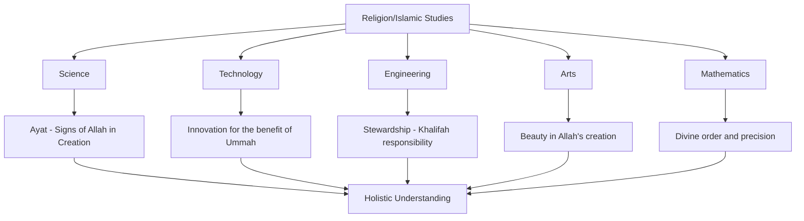

# Islamic Perspective in Science Education

**Document Title:** Islamic Perspective in Science Education
**Document ID:** IS_SCI_001
**Version:** 1.0
**Date:** 2026-01-11
**Project Name:** Smart Academy Digital Web Portal Development
**Content Category:** Islamic Studies Content

---

## Table of Contents

1. [Overview](#1-overview)
2. [Integration Philosophy](#2-integration-philosophy)
3. [Integration Framework](#3-integration-framework)
4. [Subject-Specific Integration](#4-subject-specific-integration)
5. [Teaching Strategies](#5-teaching-strategies)
6. [Lesson Planning](#6-lesson-planning)
7. [Assessment & Evaluation](#7-assessment--evaluation)
8. [Teacher Training](#8-teacher-training)
9. [Parent Engagement](#9-parent-engagement)
10. [FAQs](#10-faqs)

---

## 1. Overview

This document outlines Smart Academy's approach to integrating Islamic perspectives into science education. The integration is grounded in the belief that science is the study of Allah's creation (Ayat) and that understanding the natural world strengthens faith in the Creator. Through the Re-STEAM framework (Religion + STEAM), students learn to see scientific discoveries as manifestations of Allah's wisdom and power.

### 1.1 Philosophy

The Islamic philosophy of science education at Smart Academy is based on several fundamental principles:

- **Tawhid (Oneness of Allah)**: All scientific knowledge points to the unity and oneness of Allah. The laws of nature reflect Allah's consistent and systematic design.
- **Ayat (Signs of Allah)**: Scientific phenomena are signs (Ayat) that invite reflection and strengthen faith.
- **Khalifah (Stewardship)**: Humans are entrusted as caretakers of Allah's creation, responsible for its preservation and sustainable use.
- **Ilm (Knowledge)**: Seeking knowledge is a religious obligation, and scientific inquiry is a form of worship when done with right intention (Niyyah).
- **Balance**: Science education balances understanding of the physical world with spiritual awareness and ethical responsibility.

### 1.2 Goals

The integration of Islamic perspectives in science education aims to achieve the following goals:

**Knowledge Goals:**
- Understand scientific concepts as manifestations of Allah's creative power
- Learn about contributions of Muslim scientists throughout history
- Recognize Quranic verses that align with scientific discoveries
- Develop awareness of environmental stewardship from an Islamic perspective

**Skills Goals:**
- Apply critical thinking to explore the relationship between faith and science
- Conduct scientific inquiry with ethical considerations
- Analyze scientific findings through an Islamic worldview
- Develop research skills grounded in Islamic ethics

**Character Goals:**
- Cultivate awe and gratitude for Allah's creation
- Develop humility in the face of scientific knowledge
- Practice environmental responsibility as a form of worship
- Embrace curiosity as a means to draw closer to Allah

---

## 2. Integration Philosophy

### 2.1 Islamic Foundations

The integration of Islamic perspectives in science education is founded on authentic Islamic sources:

**Quranic Foundations:**

> "Indeed, in the creation of the heavens and the earth and the alternation of the night and the day are signs for those of understanding."
> — Quran 3:190

> "And it is He who spread the earth and placed therein firmly set mountains and rivers; and from all of the fruits He made therein two mates; He causes the night to cover the day. Indeed in that are signs for a people who give thought."
> — Quran 13:3

> "Then do they not look at the camels - how they are created? And at the heaven - how it is raised? And at the mountains - how they are erected? And at the earth - how it is spread out?"
> — Quran 88:17-20

**Hadith Foundations:**

> "The seeking of knowledge is obligatory for every Muslim."
> — Sunan Ibn Majah, Book 1, Hadith 224

> "Allah has not sent down any disease but that He has also sent down its cure."
> — Sahih Bukhari, Book 71, Hadith 582

> "The world is sweet and green, and Allah has made you governors over it to see how you will act."
> — Sahih Muslim, Book 42, Hadith 7068

### 2.2 Re-STEAM Framework Integration

The Re-STEAM framework (Religion + STEAM) provides the structural foundation for integrating Islamic perspectives across science education:

**Key Integration Points:**

1. **Science as Understanding Ayat**: Every scientific discovery reveals Allah's wisdom
2. **Technology as Amanah**: Technological advancement carries responsibility to use it ethically
3. **Engineering as Khalifah**: Engineering solutions serve humanity and protect creation
4. **Arts as Appreciation of Beauty**: Scientific artistry reflects Allah's aesthetic perfection
5. **Mathematics as Divine Order**: Mathematical precision demonstrates Allah's systematic design

---

## 3. Integration Framework

### 3.1 Age-Appropriate Integration

The integration of Islamic perspectives is tailored to three developmental stages:

#### Early Childhood (3-6 years)

**Focus Areas:**
- Wonder and awe at Allah's creation
- Basic appreciation of natural phenomena
- Simple concepts of gratitude for Allah's blessings
- Introduction to caring for plants and animals

**Integration Examples:**
- Observing weather changes as Allah's power
- Learning about animals as Allah's creations
- Planting seeds to understand growth as Allah's miracle
- Water conservation as caring for Allah's gift

#### Primary Level (6-11 years)

**Focus Areas:**
- Understanding natural laws as Allah's systematic design
- Learning about Muslim scientists and their contributions
- Connecting scientific concepts to Quranic verses
- Environmental responsibility as worship

**Integration Examples:**
- Studying the water cycle in relation to Quranic descriptions
- Learning about Al-Khwarizmi and the development of mathematics
- Understanding photosynthesis as Allah's provision
- Exploring the solar system as signs of Allah's greatness

#### Secondary Level (11-16 years)

**Focus Areas:**
- Critical analysis of scientific theories from Islamic worldview
- Understanding ethical implications of scientific advancement
- Exploring the harmony between revelation and reason
- Preparing for careers that serve the Ummah

**Integration Examples:**
- Examining evolution theory from Islamic perspective
- Analyzing bioethical issues using Islamic principles
- Understanding climate change as a test and responsibility
- Exploring medical ethics through Islamic jurisprudence (Fiqh)

### 3.2 Integration Matrix

| Grade Level | Science Topic | Islamic Integration | Quranic Reference | Key Islamic Concept |
|-------------|---------------|---------------------|-------------------|-------------------|
| Early Childhood | Plants & Animals | Allah's diverse creations | Quran 6:95, 6:141 | Ayat (Signs) |
| Early Childhood | Weather | Allah's control over nature | Quran 7:57, 30:48 | Qudrah (Power) |
| Primary | Human Body | Allah's perfect design | Quran 23:12-14 | Takwin (Creation) |
| Primary | Solar System | Allah's vast creation | Quran 6:97, 67:3-4 | Azamah (Greatness) |
| Primary | Water Cycle | Allah's provision system | Quran 23:18-19 | Rizq (Provision) |
| Secondary | Genetics | Allah's knowledge of all things | Quran 23:12-14 | Ilm (Knowledge) |
| Secondary | Environment | Stewardship responsibility | Quran 6:141, 7:31 | Khalifah (Stewardship) |
| Secondary | Medicine | Healing as Allah's gift | Quran 26:80 | Shifa (Healing) |
| Secondary | Technology | Ethical use of knowledge | Quran 2:269 | Hikmah (Wisdom) |

---

## 4. Subject-Specific Integration

### 4.1 Biology: Study of Life as Signs of Allah

**Islamic Perspective:**
Biology reveals the complexity, diversity, and wisdom inherent in Allah's creation of living organisms. Every cell, organism, and ecosystem demonstrates Allah's power and knowledge.

**Key Integration Points:**

**Cell Biology:**
- The complexity of cellular structure as evidence of intelligent design
- DNA as Allah's blueprint for life
- Cell division as a manifestation of Allah's systematic creation

**Human Anatomy & Physiology:**
- The human body as a sign (Ayah) of Allah's perfection
- The intricate systems (circulatory, respiratory, nervous) as evidence of design
- The miracle of human development from embryo to adult

**Ecology & Environmental Science:**
- Ecosystems as interconnected systems reflecting Allah's wisdom
- Biodiversity as Allah's creative diversity
- Environmental stewardship as a religious obligation

**Quranic Connections:**

> "And certainly did We create man from an extract of clay. Then We placed him as a sperm-drop in a firm lodging. Then We made the sperm-drop into a clinging clot, and We made the clot into a lump [of flesh], and We made [from] the lump, bones, and We covered the bones with flesh; then We developed him into another creation. So blessed is Allah, the best of creators."
> — Quran 23:12-14

> "And there is no creature on [or within] the earth or bird that flies with its wings except that they are communities like you."
> — Quran 6:38

**Muslim Scientists in Biology:**

| Scientist | Era | Contribution | Islamic Connection |
|-----------|-----|-------------|-------------------|
| Al-Jahiz | 9th Century | Early concepts of evolution and adaptation | Observed Allah's wisdom in adaptation |
| Ibn al-Nafis | 13th Century | Discovered pulmonary circulation | Recognized body as Allah's perfect design |
| Al-Dinawari | 9th Century | Botany and plant classification | Studied plants as Allah's creations |

**Lesson Example: The Miracle of Human Development**

**Objective:** Students will understand the stages of human embryonic development and appreciate Allah's wisdom in creation.

**Islamic Integration:**
- Compare Quranic description of embryonic stages with modern scientific understanding
- Discuss the precision and timing in development as evidence of Allah's knowledge
- Reflect on the gift of life and the responsibility to care for one's body

**Activity:**
- Create a timeline of embryonic development
- Match Quranic verses to developmental stages
- Write a reflection on gratitude for the gift of life

### 4.2 Physics: Laws of Nature as Allah's Systematic Design

**Islamic Perspective:**
Physics studies the fundamental laws that govern the universe. These consistent, predictable laws reflect Allah's wisdom, power, and systematic approach to creation.

**Key Integration Points:**

**Motion & Forces:**
- Newton's laws as evidence of Allah's consistent design
- Gravity as Allah's system holding the universe together
- Friction and resistance as part of Allah's balanced creation

**Energy & Thermodynamics:**
- Conservation of energy as reflection of Allah's eternal nature
- Entropy and the transient nature of the material world
- Light and electromagnetic radiation as Allah's signs

**Waves & Sound:**
- The beauty of sound and music as Allah's gifts
- Light as a metaphor for divine guidance (Nur)
- The electromagnetic spectrum as evidence of Allah's comprehensive creation

**Quantum Physics:**
- The mystery of quantum mechanics as evidence of human limitation
- The uncertainty principle as a reminder of Allah's perfect knowledge
- Subatomic particles as evidence of Allah's attention to detail

**Quranic Connections:**

> "He created the heavens and earth in truth. He wraps the night over the day and wraps the day over the night and has subjected the sun and the moon, each running [its course] for a specified term. Unquestionably, He is the Exalted in Might, the Perpetual Forgiver."
> — Quran 39:5

> "Blessed is He in whose hand is dominion, and He is over all things competent - [He] who created death and life to test you [as to] which of you is best in deed - and He is the Exalted in Might, the Forgiving - [He] who created seven heavens in layers. You do not see in the creation of the Most Merciful any inconsistency. So return [your] vision [to the sky]; do you see any breaks?"
> — Quran 67:1-3

**Muslim Scientists in Physics:**

| Scientist | Era | Contribution | Islamic Connection |
|-----------|-----|-------------|-------------------|
| Ibn al-Haytham | 11th Century | Father of optics, scientific method | Studied light as Allah's creation |
| Al-Biruni | 11th Century | Physics, astronomy, geodesy | Measured Earth to understand Allah's creation |
| Al-Khazini | 12th Century | Hydrostatic balance, specific gravity | Studied matter as Allah's design |
| Nasir al-Din al-Tusi | 13th Century | Planetary motion, Tusi couple | Sought to understand celestial order |

**Lesson Example: Light as a Sign of Allah**

**Objective:** Students will understand the properties of light and appreciate light as both a physical phenomenon and a spiritual metaphor.

**Islamic Integration:**
- Study the properties of light (reflection, refraction, dispersion)
- Explore Quranic verses using light as a metaphor for guidance (Nur)
- Discuss how understanding light physics enhances appreciation of Allah's creation
- Reflect on the spiritual significance of light in Islam

**Activity:**
- Conduct experiments with prisms and mirrors
- Create a presentation connecting light properties to Quranic concepts
- Design a project on applications of light in Islamic architecture

### 4.3 Chemistry: Elements and Compounds as Building Blocks of Creation

**Islamic Perspective:**
Chemistry explores the composition, structure, and properties of matter. The periodic table and chemical reactions reveal the systematic and orderly nature of Allah's creation.

**Key Integration Points:**

**Atomic Structure:**
- Atoms as fundamental units of Allah's creation
- Electron configurations as evidence of Allah's organized design
- The periodic table as a manifestation of Allah's pattern in creation

**Chemical Bonding:**
- Molecular bonds as examples of cooperation and unity in creation
- The diversity of compounds from limited elements as evidence of Allah's creativity
- Water's unique properties as essential for life, Allah's provision

**Chemical Reactions:**
- Conservation of mass as evidence of Allah's preservation
- Energy changes in reactions as evidence of Allah's power
- The role of catalysts as examples of Allah's facilitation

**Organic Chemistry:**
- Carbon's versatility as evidence of Allah's wisdom in design
- The complexity of organic molecules as signs of Allah's knowledge
- Biochemistry as the chemistry of life, Allah's masterpiece

**Quranic Connections:**

> "And We made from water every living thing. So will they not believe?"
> — Quran 21:30

> "And it is He who created the night and the day and the sun and the moon; all [heavenly bodies] in an orbit are swimming."
> — Quran 21:33

> "Indeed, Allah is the Splitter of grain and date seeds. He brings the living out of the dead and brings the dead out of the living. That is Allah; so how are you deluded?"
> — Quran 6:95

**Muslim Scientists in Chemistry:**

| Scientist | Era | Contribution | Islamic Connection |
|-----------|-----|-------------|-------------------|
| Jabir ibn Hayyan | 8th Century | Father of chemistry, distillation | Sought to understand matter as Allah's creation |
| Al-Razi | 9th-10th Century | Chemical substances, medical chemistry | Applied chemistry for healing (Shifa) |
| Al-Majriti | 10th Century | Chemistry, astronomy | Studied materials to understand creation |
| Ibn Sina | 10th-11th Century | Pharmacology, chemical medicine | Used chemistry for healing as worship |

**Lesson Example: Water - The Miracle Substance**

**Objective:** Students will understand the unique properties of water and appreciate it as Allah's special provision for life.

**Islamic Integration:**
- Study water's unique properties (high specific heat, universal solvent, density anomaly)
- Connect water's properties to its essential role in sustaining life
- Explore Quranic references to water as a sign of Allah's mercy
- Discuss water conservation as a religious obligation

**Activity:**
- Conduct experiments demonstrating water's unique properties
- Research water usage in Islamic rituals (Wudu, Ghusl)
- Create a water conservation plan for the school and community
- Write reflections on gratitude for water as Allah's blessing

### 4.4 Environmental Science: Stewardship (Khalifah) and Responsibility

**Islamic Perspective:**
Environmental science examines the interactions between organisms and their environment. Islam teaches that humans are Allah's vicegerents (Khalifah) on Earth, entrusted with the responsibility to protect and preserve the environment.

**Key Integration Points:**

**Ecosystems:**
- The balance in ecosystems as evidence of Allah's wisdom
- Biodiversity as Allah's creative diversity
- Food chains and webs as examples of interdependence in creation

**Climate & Weather:**
- Climate systems as Allah's provision for different regions
- Weather patterns as signs of Allah's power
- Climate change as a test and responsibility for humanity

**Pollution & Conservation:**
- Pollution as violation of the trust (Amanah) of stewardship
- Conservation as an act of worship
- Sustainable development as balancing dunya and akhirah goals

**Natural Resources:**
- Natural resources as Allah's Amanah (trust) to humanity
- Responsible resource management as religious duty
- Renewable energy as aligning with Islamic principles of balance

**Quranic Connections:**

> "And cause not corruption upon the earth after its reformation. And invoke Him in fear and aspiration. Indeed, the mercy of Allah is near to the doers of good."
> — Quran 7:56

> "O children of Adam, take your adornment at every masjid, and eat and drink, but be not excessive. Indeed, He likes not those who commit excess."
> — Quran 7:31

> "And do not walk upon the earth exultantly. Indeed, you will never tear the earth [apart], and you will never reach the mountains in height."
> — Quran 17:37

**Islamic Environmental Principles:**

| Principle | Meaning | Application |
|-----------|---------|-------------|
| **Khalifah** | Stewardship/Vicegerency | Humans are caretakers of Earth |
| **Amanah** | Trust | Environment is entrusted to humans |
| **Mizan** | Balance | Maintain ecological balance |
| **Israf** | Waste | Prohibition of wastefulness |
| **Fasad** | Corruption | Environmental destruction is prohibited |
| **Ta'a** | Obedience | Following Allah's commands in environmental matters |

**Lesson Example: Climate Change - Test and Responsibility**

**Objective:** Students will understand climate change from an Islamic perspective and develop action plans for environmental stewardship.

**Islamic Integration:**
- Study the scientific basis of climate change
- Explore Islamic teachings on environmental responsibility
- Analyze climate change as both a test and a consequence of human actions
- Develop practical solutions grounded in Islamic ethics

**Activity:**
- Research climate change impacts on Bangladesh
- Create an environmental action plan for the school
- Organize a tree-planting campaign as Sadaqah Jariyah
- Develop presentations on Islamic environmental ethics

---

## 5. Teaching Strategies

### 5.1 Inquiry-Based Learning with Islamic Context

**Strategy Description:**
Inquiry-based learning encourages students to ask questions, investigate, and discover answers. When integrated with Islamic context, students learn to see scientific inquiry as a means to understand Allah's creation.

**Implementation Steps:**

1. **Pose Provocative Questions**:
   - "How does the water cycle show Allah's wisdom?"
   - "What can we learn about Allah from studying the human body?"
   - "How do Muslim scientists contribute to our understanding of the world?"

2. **Facilitate Investigation**:
   - Provide resources for research (Quran, Hadith, scientific sources)
   - Encourage students to connect scientific findings to Islamic principles
   - Guide students to reflect on the spiritual significance of discoveries

3. **Share and Reflect**:
   - Students present findings with Islamic connections
   - Group discussions on the relationship between science and faith
   - Reflection journals on how scientific learning strengthens faith

### 5.2 Project-Based Learning (PBL) with Islamic Themes

**Strategy Description:**
Project-based learning engages students in extended projects that require critical thinking, collaboration, and problem-solving. Islamic-themed projects integrate scientific knowledge with Islamic values and objectives.

**Project Examples:**

**Project 1: The Water Conservation Campaign**
- **Grade Level**: Primary (6-11 years)
- **Duration**: 4 weeks
- **Science Content**: Water cycle, water properties, water usage
- **Islamic Integration**: Water as Allah's blessing, prohibition of waste (Israf)
- **Deliverables**: 
  - Research report on water usage in school
  - Water conservation plan
  - Awareness campaign materials
  - Implementation of conservation measures

**Project 2: Muslim Scientists Timeline**
- **Grade Level**: Secondary (11-16 years)
- **Duration**: 6 weeks
- **Science Content**: History of science, specific scientific contributions
- **Islamic Integration**: Learning from Muslim scholars, Islamic Golden Age
- **Deliverables**:
  - Interactive timeline of Muslim scientists
  - Biographies of selected scientists
  - Demonstrations of scientific principles
  - Reflection on lessons from Muslim scholars

**Project 3: Sustainable Garden Design**
- **Grade Level**: All levels (adapted)
- **Duration**: 8 weeks
- **Science Content**: Plant biology, soil science, ecosystems
- **Islamic Integration**: Stewardship (Khalifah), gratitude for provision (Shukr)
- **Deliverables**:
  - Garden design plan
  - Plant selection with scientific and Islamic rationale
  - Implementation of garden
  - Maintenance and observation journal

### 5.3 Experiential Learning Through Nature

**Strategy Description:**
Direct experience with nature helps students develop a personal connection with Allah's creation and understand scientific concepts in context.

**Implementation Approaches:**

1. **Field Trips**:
   - Visit botanical gardens to study plant diversity
   - Visit planetariums to understand the cosmos
   - Visit nature reserves to observe ecosystems
   - Visit water treatment plants to understand water management

2. **Outdoor Classroom Activities**:
   - Nature walks with observation journals
   - Weather observation and recording
   - Planting and growing activities
   - Bird watching and identification

3. **School Garden Projects**:
   - Create and maintain a school garden
   - Study plant growth and development
   - Learn about soil composition and health
   - Practice sustainable gardening techniques

### 5.4 Cross-Curricular Integration

**Strategy Description:**
Science education integrated with Islamic studies creates a holistic learning experience where students see connections across subjects.

**Integration Examples:**

**Science + Quran**:
- Study Quranic descriptions of natural phenomena
- Compare scientific understanding with Quranic verses
- Memorize relevant Quranic verses with scientific themes
- Tafsir (exegesis) of verses about creation

**Science + Islamic History**:
- Learn about Muslim scientists and their contributions
- Study the Islamic Golden Age of science
- Understand the role of Islam in promoting scientific inquiry
- Explore how Islamic values supported scientific advancement

**Science + Arabic Language**:
- Learn scientific terminology in Arabic
- Study Arabic scientific texts from classical scholars
- Understand Arabic roots of scientific terms
- Practice Arabic through scientific content

**Science + Islamic Ethics**:
- Discuss ethical implications of scientific discoveries
- Learn Islamic rulings (Fiqh) on scientific applications
- Develop ethical frameworks for scientific research
- Practice Islamic etiquette in scientific inquiry

### 5.5 Technology-Enhanced Learning

**Strategy Description:**
Technology tools enhance science education while maintaining Islamic perspectives and values.

**Technology Applications:**

1. **Digital Simulations**:
   - Virtual labs for safe experimentation
   - Simulations of natural phenomena
   - Interactive models of biological systems
   - Digital dissection alternatives

2. **Multimedia Resources**:
   - Documentaries on scientific discoveries
   - Videos of Muslim scientists and their work
   - Animations of scientific processes
   - Islamic scientific content from reliable sources

3. **Data Collection and Analysis**:
   - Digital sensors for environmental monitoring
   - Data logging for experiments
   - Statistical analysis tools
   - Graphing and visualization software

4. **Online Collaboration**:
   - Collaborative research projects
   - Sharing findings with other Islamic schools
   - Connecting with Muslim scientists globally
   - Participating in Islamic science competitions

---

## 6. Lesson Planning

### 6.1 Lesson Planning Template

**Islamic-Integrated Science Lesson Plan**

| Section | Content |
|---------|---------|
| **Lesson Title** | [Title with Islamic connection] |
| **Grade Level** | [Early Childhood/Primary/Secondary] |
| **Duration** | [Time] |
| **Science Topic** | [Scientific concept] |
| **Islamic Integration** | [Islamic concept/principle] |
| **Quranic Reference** | [Relevant verse(s)] |
| **Learning Objectives** | [Knowledge, Skills, Character] |
| **Materials Needed** | [List of materials] |
| **Key Vocabulary** | [Scientific and Islamic terms] |

**Lesson Procedure:**

1. **Introduction (5-10 minutes)**
   - Hook: Engaging question or demonstration
   - Islamic connection: Introduce the Islamic perspective
   - Objectives: Share learning goals

2. **Direct Instruction (10-15 minutes)**
   - Present scientific content
   - Integrate Islamic perspective
   - Connect to Quranic verses or Hadith
   - Show real-world applications

3. **Guided Practice (15-20 minutes)**
   - Demonstrate concepts
   - Guide students through activities
   - Facilitate Islamic reflections
   - Encourage questions and discussion

4. **Independent Practice (15-20 minutes)**
   - Students work independently or in groups
   - Apply scientific concepts
   - Make Islamic connections
   - Document learning

5. **Closure (5-10 minutes)**
   - Review key concepts
   - Reinforce Islamic integration
   - Student reflections
   - Preview next lesson

**Assessment:**
- [Formative assessment methods]
- [Summative assessment methods]
- [Islamic understanding assessment]

**Differentiation:**
- [For advanced learners]
- [For struggling learners]
- [For students with special needs]

**Homework/Extension:**
- [Reinforcement activities]
- [Extension activities]
- [Islamic practice connections]

### 6.2 Sample Lesson Plans

#### Sample Lesson 1: The Water Cycle - Allah's Provision System

**Grade Level:** Primary (8-9 years)
**Duration:** 45 minutes
**Science Topic:** Water Cycle
**Islamic Integration:** Allah's provision (Rizq) and wisdom (Hikmah)

**Learning Objectives:**
- **Knowledge:** Understand the stages of the water cycle
- **Skills:** Create a model of the water cycle
- **Character:** Develop gratitude for water as Allah's blessing

**Quranic Reference:**
> "And We sent down from the sky water in measure and We gave it lodging in the earth, and indeed We are Able to take it away."
> — Quran 23:18

**Materials:**
- Diagram of water cycle
- Clear plastic container, water, plastic wrap, small cup
- Heat source (lamp or sunlight)
- Colored pencils and paper

**Procedure:**

**Introduction (5 minutes):**
- Ask: "Where does rain come from?"
- Discuss water as essential for life
- Introduce water cycle as Allah's provision system

**Direct Instruction (10 minutes):**
- Explain water cycle stages: evaporation, condensation, precipitation, collection
- Show diagram and explain each stage
- Connect to Quran: Allah sends water in measure
- Discuss: Why is the water cycle important?

**Guided Practice (15 minutes):**
- Demonstrate mini water cycle model
- Students observe evaporation and condensation
- Guide students to label diagram
- Discuss: How does this show Allah's wisdom?

**Independent Practice (15 minutes):**
- Students create their own water cycle diagram
- Label stages and add Quranic verse
- Write 3 things they learned about Allah's wisdom in the water cycle

**Closure (5 minutes):**
- Review water cycle stages
- Ask: "How does understanding the water cycle increase your gratitude to Allah?"
- Students share one thing they're grateful for about water

**Assessment:**
- Formative: Observation during activity, questions
- Summative: Completed diagram with labels and Quranic verse
- Islamic: Written reflection on gratitude

#### Sample Lesson 2: The Solar System - Signs of Allah's Greatness

**Grade Level:** Secondary (13-14 years)
**Duration:** 60 minutes
**Science Topic:** Solar System Structure
**Islamic Integration:** Allah's greatness (Azamah) and power (Qudrah)

**Learning Objectives:**
- **Knowledge:** Understand the structure and scale of the solar system
- **Skills:** Calculate relative distances and sizes
- **Character:** Develop awe and humility before Allah's creation

**Quranic Reference:**
> "It is He who created the night and the day and the sun and the moon; all [heavenly bodies] in an orbit are swimming."
> — Quran 21:33

**Materials:**
- Solar system model or images
- Calculators
- Measuring tape
- Scale model materials (various sized balls)

**Procedure:**

**Introduction (10 minutes):**
- Ask: "How big is the solar system?"
- Show image of solar system
- Introduce concept of scale
- Connect to Quran: All celestial bodies in orbit

**Direct Instruction (15 minutes):**
- Explain solar system structure: Sun, planets, moons, asteroids
- Discuss scale and distances
- Explain orbital mechanics
- Connect to Quran: Precise order and movement

**Guided Practice (15 minutes):**
- Calculate scale distances for planets
- Create scale model in classroom
- Discuss: What does this tell us about Allah's power?
- Reflect on human place in the universe

**Independent Practice (15 minutes):**
- Students research one planet in depth
- Create fact sheet with scientific and Islamic reflections
- Write: How does studying the solar system increase your faith?

**Closure (5 minutes):**
- Review key concepts
- Ask: "How does understanding the solar system's scale affect your view of Allah?"
- Students share reflections

**Assessment:**
- Formative: Participation in scale model activity
- Summative: Planet fact sheet
- Islamic: Reflection on faith and scientific understanding

#### Sample Lesson 3: Photosynthesis - Allah's Miracle of Energy Conversion

**Grade Level:** Primary (10-11 years)
**Duration:** 50 minutes
**Science Topic:** Photosynthesis
**Islamic Integration:** Allah's provision (Rizq) and creative power (Qudrah)

**Learning Objectives:**
- **Knowledge:** Understand the process of photosynthesis
- **Skills:** Conduct experiments to demonstrate photosynthesis
- **Character:** Appreciate plants as Allah's provision

**Quranic Reference:**
> "And it is He who sends down rain from the sky, and We produce thereby the growth of all things. We produce from it greenery from which We produce grains arranged in layers."
> — Quran 6:99

**Materials:**
- Potted plants (some covered, some uncovered)
- Iodine solution
- Alcohol, beakers, hot water
- Leaves from plants
- Diagrams of photosynthesis

**Procedure:**

**Introduction (5 minutes):**
- Ask: "How do plants get their food?"
- Discuss plants as food source
- Introduce photosynthesis as Allah's miracle

**Direct Instruction (10 minutes):**
- Explain photosynthesis process
- Show equation: CO2 + H2O + light → glucose + O2
- Connect to Quran: Allah produces growth from rain
- Discuss: Why is photosynthesis important?

**Guided Practice (15 minutes):**
- Demonstrate starch test on leaves
- Students compare covered vs. uncovered leaves
- Guide observation and recording
- Discuss: How does this show Allah's wisdom?

**Independent Practice (15 minutes):**
- Students draw and label photosynthesis process
- Add Quranic verse to diagram
- Write: How does photosynthesis show Allah's creative power?

**Closure (5 minutes):**
- Review photosynthesis process
- Ask: "How does understanding photosynthesis increase your gratitude to Allah?"
- Students share reflections

**Assessment:**
- Formative: Observation during experiment
- Summative: Labeled diagram with Quranic connection
- Islamic: Written reflection on gratitude

### 6.3 Weekly Integration Schedule

| Week | Science Topic | Islamic Integration | Quranic Reference | Key Activity |
|------|---------------|---------------------|-------------------|--------------|
| 1 | Introduction to Science | Seeking knowledge as worship | Quran 58:11 | Science and faith discussion |
| 2 | Scientific Method | Muslim contributions to science | Quran 96:1-5 | Research Muslim scientists |
| 3 | Matter & Atoms | Allah's creation from nothing | Quran 21:30 | Atomic model with Islamic reflection |
| 4 | Water & Solutions | Water as Allah's blessing | Quran 21:30 | Water conservation project |
| 5 | Living Things | Diversity of Allah's creation | Quran 6:38 | Biodiversity study |
| 6 | Cells | Complexity as sign of design | Quran 23:12-14 | Cell model project |
| 7 | Human Body Systems | Body as Allah's gift | Quran 23:12-14 | Health and gratitude journal |
| 8 | Plants | Allah's provision through plants | Quran 6:99 | School garden project |
| 9 | Animals | Animals as communities like us | Quran 6:38 | Animal care project |
| 10 | Ecosystems | Balance in creation (Mizan) | Quran 55:7-9 | Ecosystem model |
| 11 | Energy | Energy as Allah's power | Quran 51:47 | Energy audit project |
| 12 | Forces & Motion | Allah's consistent laws | Quran 67:3-4 | Physics experiments |
| 13 | Light & Optics | Light as guidance (Nur) | Quran 24:35 | Optics experiments |
| 14 | Sound & Waves | Beauty in Allah's creation | Quran 17:44 | Sound and music project |
| 15 | Earth's Structure | Earth as Allah's provision | Quran 67:15-16 | Earth model project |
| 16 | Weather & Climate | Allah's control over weather | Quran 7:57 | Weather station project |
| 17 | Solar System | Allah's vast creation | Quran 6:97 | Solar system model |
| 18 | Stars & Galaxies | Signs of Allah's greatness | Quran 41:53 | Astronomy night |
| 19 | Environmental Science | Stewardship (Khalifah) | Quran 7:31 | Environmental action plan |
| 20 | Sustainability | Balance (Mizan) in resource use | Quran 25:67 | Sustainability project |
| 21 | Chemistry Basics | Elements as building blocks | Quran 86:5-7 | Periodic table project |
| 22 | Chemical Reactions | Transformation as Allah's power | Quran 2:260 | Chemistry experiments |
| 23 | Acids & Bases | Balance in nature | Quran 55:7-9 | pH testing project |
| 24 | Organic Chemistry | Complexity of life | Quran 23:12-14 | Molecular models |
| 25 | Genetics | Allah's knowledge of all things | Quran 23:12-14 | DNA model project |
| 26 | Evolution | Creation vs. evolution | Quran 23:12-14 | Critical analysis essay |
| 27 | Health & Disease | Healing as Allah's gift | Quran 26:80 | Health education project |
| 28 | Technology & Ethics | Knowledge with responsibility | Quran 2:269 | Ethics debate |
| 29 | Science Careers | Serving Ummah through science | Quran 28:77 | Career research project |
| 30 | Review & Celebration | Integration of all concepts | Multiple | Science fair with Islamic themes |

---

## 7. Assessment & Evaluation

### 7.1 Assessment Framework

**Holistic Assessment Approach:**

Assessment in Islamic-integrated science education evaluates three dimensions:

1. **Scientific Understanding**: Knowledge of scientific concepts and skills
2. **Islamic Integration**: Understanding of Islamic perspectives and connections
3. **Character Development**: Internalization of Islamic values and attitudes

**Assessment Types:**

| Assessment Type | Purpose | Example |
|-----------------|---------|---------|
| **Diagnostic** | Identify prior knowledge | Pre-test on science concepts and Islamic understanding |
| **Formative** | Monitor progress and provide feedback | Observation during activities, exit tickets, questioning |
| **Summative** | Evaluate learning at end of unit | Tests, projects, presentations |
| **Authentic** | Apply learning in real-world contexts | Environmental action projects, science fair projects |

### 7.2 Assessment Rubrics

#### Rubric 1: Scientific Understanding with Islamic Integration

| Criteria | Excellent (4) | Proficient (3) | Developing (2) | Beginning (1) |
|----------|---------------|----------------|----------------|---------------|
| **Scientific Knowledge** | Demonstrates deep understanding of scientific concepts, makes accurate connections | Shows good understanding, makes mostly accurate connections | Shows basic understanding, makes some connections | Shows limited understanding, makes few or no connections |
| **Islamic Integration** | Makes insightful connections between science and Islamic principles, cites relevant Quran/Hadith | Makes appropriate connections, cites some references | Makes basic connections, limited references | Makes minimal or no connections |
| **Critical Thinking** | Analyzes complex relationships, asks thoughtful questions | Analyzes relationships, asks relevant questions | Identifies relationships, asks basic questions | Limited analysis, few questions |
| **Communication** | Explains clearly with examples, uses appropriate terminology | Explains clearly, uses some terminology | Explains with limited clarity, basic terminology | Unclear explanation, limited terminology |

#### Rubric 2: Project-Based Assessment

| Criteria | Excellent (4) | Proficient (3) | Developing (2) | Beginning (1) |
|----------|---------------|----------------|----------------|---------------|
| **Scientific Accuracy** | All information accurate, demonstrates deep understanding | Most information accurate, demonstrates good understanding | Some information accurate, demonstrates basic understanding | Limited accuracy, minimal understanding |
| **Islamic Perspective** | Strong integration of Islamic perspective throughout | Good integration in most areas | Basic integration in some areas | Minimal or no integration |
| **Creativity & Innovation** | Highly creative, original approach | Creative, good approach | Some creativity, basic approach | Limited creativity, minimal approach |
| **Presentation Quality** | Professional, engaging, well-organized | Clear, organized | Basic organization | Poor organization |
| **Reflection** | Deep reflection on learning and Islamic connections | Good reflection on learning | Basic reflection | Minimal reflection |

#### Rubric 3: Character Development Assessment

| Criteria | Excellent (4) | Proficient (3) | Developing (2) | Beginning (1) |
|----------|---------------|----------------|----------------|---------------|
| **Awe & Gratitude** | Consistently expresses awe and gratitude for Allah's creation | Frequently expresses awe and gratitude | Sometimes expresses awe and gratitude | Rarely expresses awe and gratitude |
| **Stewardship** | Actively practices environmental stewardship | Practices stewardship in most situations | Practices stewardship in some situations | Limited practice of stewardship |
| **Curiosity** | Shows deep curiosity, asks insightful questions | Shows good curiosity, asks relevant questions | Shows some curiosity, asks basic questions | Limited curiosity, few questions |
| **Respect** | Shows respect for teachers, peers, and knowledge | Shows respect in most situations | Shows respect in some situations | Limited respect demonstrated |
| **Ethical Consideration** | Consistently considers ethical implications | Frequently considers ethics | Sometimes considers ethics | Rarely considers ethics |

### 7.3 Assessment Methods

#### 1. Written Assessments

**Tests and Quizzes:**
- Include both scientific and Islamic integration questions
- Example format:
  - Multiple choice: Scientific concepts
  - Short answer: Explain concepts with Islamic connections
  - Essay: Analyze topic from Islamic perspective
  - Quran/Hadith identification: Match verses to scientific concepts

**Example Questions:**

**Multiple Choice:**
1. Which process converts light energy into chemical energy in plants?
   a) Respiration
   b) Photosynthesis
   c) Transpiration
   d) Digestion

2. According to the Quran, what does Allah send down from the sky to produce growth?
   a) Fire
   b) Rain
   c) Gold
   d) Stars

**Short Answer:**
1. Explain the water cycle and how it demonstrates Allah's wisdom in providing for His creation.
2. Describe how the study of cells can increase a Muslim's faith in Allah.

**Essay:**
"Discuss the Islamic perspective on environmental stewardship. How should Muslims approach environmental issues such as climate change? Use Quranic verses and Hadith to support your answer."

#### 2. Performance Assessments

**Laboratory Activities:**
- Conduct experiments with Islamic reflection
- Document observations and connections
- Present findings with Islamic perspective

**Projects:**
- Research projects on Muslim scientists
- Environmental action projects
- Model building with Islamic themes
- Science fair projects with Islamic integration

**Presentations:**
- Present scientific topics with Islamic connections
- Use multimedia to enhance understanding
- Engage audience in Islamic reflections

#### 3. Portfolio Assessment

**Portfolio Components:**
- Lab reports with Islamic reflections
- Project documentation
- Research papers
- Reflection journals
- Creative work (poems, artwork, videos)

**Portfolio Review Process:**
- Student self-assessment
- Peer review
- Teacher assessment
- Parent/guardian review (optional)

#### 4. Observational Assessment

**Teacher Observation Checklist:**

| Behavior | Always | Sometimes | Rarely | Comments |
|----------|--------|-----------|--------|----------|
| Shows curiosity about scientific phenomena | | | | |
| Makes connections between science and Islam | | | | |
| Demonstrates respect for Allah's creation | | | | |
| Practices environmental stewardship | | | | |
| Works collaboratively with peers | | | | |
| Asks thoughtful questions | | | | |
| Expresses gratitude for blessings | | | | |
| Applies Islamic ethics in scientific work | | | | |

#### 5. Self-Assessment

**Student Reflection Journal Prompts:**

1. What scientific concept did I learn today that increased my understanding of Allah's creation?
2. How does this scientific knowledge help me fulfill my role as Khalifah (steward)?
3. What questions do I still have about this topic?
4. How can I apply what I learned to benefit my community?
5. What am I grateful for after today's lesson?

### 7.4 Feedback Strategies

**Effective Feedback Principles:**

1. **Timely**: Provide feedback soon after assessment
2. **Specific**: Address specific strengths and areas for improvement
3. **Balanced**: Include both positive and constructive feedback
4. **Actionable**: Provide clear steps for improvement
5. **Islamic Context**: Frame feedback in Islamic terms when appropriate

**Feedback Examples:**

**Positive Feedback:**
- "Excellent work connecting the water cycle to Quran 23:18. Your analysis shows deep understanding of both the scientific process and Allah's wisdom."
- "Your project on Muslim scientists demonstrates thorough research and appreciation for their contributions to science."

**Constructive Feedback:**
- "Good understanding of photosynthesis. To strengthen your Islamic integration, try to connect the process more explicitly to Allah's provision (Rizq)."
- "Your model is creative. Consider adding Quranic verses that relate to the topic to enhance the Islamic perspective."

---

## 8. Teacher Training

### 8.1 Training Requirements

**Essential Training Components:**

1. **Islamic Studies Foundation:**
   - Understanding of Tawhid and its implications for science education
   - Knowledge of relevant Quranic verses and Hadith
   - Understanding of Islamic principles (Khalifah, Amanah, Mizan)
   - Familiarity with Muslim scientists and their contributions

2. **Science Content Knowledge:**
   - Deep understanding of scientific concepts
   - Knowledge of scientific methods and inquiry
   - Understanding of age-appropriate content
   - Familiarity with curriculum standards

3. **Pedagogical Skills:**
   - Integration strategies for Islamic perspectives
   - Inquiry-based and project-based learning
   - Differentiated instruction
   - Assessment methods for integrated learning

4. **Character Development:**
   - Modeling Islamic values in teaching
   - Creating a positive Islamic learning environment
   - Guiding students in character formation
   - Facilitating spiritual reflection

### 8.2 Training Program Structure

**Phase 1: Foundation Training (2 weeks)**

**Week 1: Islamic Foundations**
- Day 1: Introduction to Islamic philosophy of science
- Day 2: Quranic foundations for science education
- Day 3: Hadith foundations for science education
- Day 4: Key Islamic concepts (Tawhid, Ayat, Khalifah, Amanah)
- Day 5: Muslim scientists in history

**Week 2: Science Education Foundations**
- Day 1: Science curriculum overview
- Day 2: Scientific methods and inquiry
- Day 3: Age-appropriate science content
- Day 4: Safety in science education
- Day 5: Assessment in science education

**Phase 2: Integration Training (2 weeks)**

**Week 3: Integration Strategies**
- Day 1: Framework for Islamic integration
- Day 2: Subject-specific integration (Biology)
- Day 3: Subject-specific integration (Physics)
- Day 4: Subject-specific integration (Chemistry)
- Day 5: Subject-specific integration (Environmental Science)

**Week 4: Teaching Strategies**
- Day 1: Inquiry-based learning with Islamic context
- Day 2: Project-based learning with Islamic themes
- Day 3: Experiential learning through nature
- Day 4: Cross-curricular integration
- Day 5: Technology-enhanced learning

**Phase 3: Practice and Application (2 weeks)**

**Week 5: Lesson Planning**
- Day 1: Lesson planning template
- Day 2: Developing integrated lesson plans
- Day 3: Peer review of lesson plans
- Day 4: Revising lesson plans
- Day 5: Finalizing lesson plans

**Week 6: Teaching Practice**
- Day 1: Micro-teaching sessions
- Day 2: Observation of experienced teachers
- Day 3: Co-teaching opportunities
- Day 4: Reflection and feedback
- Day 5: Final assessment

**Phase 4: Ongoing Professional Development**

**Monthly Workshops:**
- Topic-specific training
- Sharing best practices
- Addressing challenges
- New resources and materials

**Quarterly Reviews:**
- Assessment of implementation
- Student feedback
- Curriculum adjustments
- Professional development needs assessment

### 8.3 Training Resources

**Essential Resources:**

1. **Islamic Sources:**
   - Quran with translation and tafsir
   - Collections of authentic Hadith
   - Books on Islamic philosophy of science
   - Biographies of Muslim scientists

2. **Science Resources:**
   - Science textbooks and curriculum guides
   - Scientific equipment and materials
   - Digital resources and simulations
   - Science journals and magazines

3. **Integration Resources:**
   - Lesson plan templates
   - Integration examples and case studies
   - Assessment rubrics
   - Activity guides

4. **Professional Resources:**
   - Training manuals
   - Observation checklists
   - Reflection journals
   - Professional development plans

### 8.4 Teacher Competencies

**Core Competencies for Islamic-Integrated Science Teachers:**

| Competency | Description | Indicators |
|------------|-------------|------------|
| **Islamic Knowledge** | Understanding of Islamic principles relevant to science | Cites relevant Quran/Hadith, explains Islamic concepts accurately |
| **Science Knowledge** | Deep understanding of scientific content | Explains concepts clearly, answers questions accurately |
| **Integration Skills** | Ability to connect science and Islam | Makes meaningful connections, uses appropriate examples |
| **Pedagogical Skills** | Effective teaching strategies | Engages students, uses varied methods, differentiates instruction |
| **Character Modeling** | Demonstrates Islamic values | Models respect, patience, gratitude, stewardship |
| **Assessment Skills** | Effective assessment of integrated learning | Uses varied assessments, provides meaningful feedback |
| **Reflection** | Continuous improvement | Reflects on practice, seeks feedback, implements changes |
| **Collaboration** | Works effectively with colleagues | Shares resources, collaborates on projects, supports peers |

---

## 9. Parent Engagement

### 9.1 Communication Strategies

**Regular Communication:**

1. **Newsletters:**
   - Monthly updates on science curriculum
   - Highlights of Islamic integration
   - Upcoming activities and projects
   - Resources for home learning

2. **Parent-Teacher Meetings:**
   - Discuss student progress in science and Islamic understanding
   - Share examples of student work
   - Provide resources for supporting learning at home
   - Address questions and concerns

3. **Digital Communication:**
   - Email updates on classroom activities
   - Online portal for accessing resources
   - Social media sharing of student projects
   - Virtual parent meetings when needed

### 9.2 Home Learning Activities

**Activities for Parents and Children:**

1. **Nature Exploration:**
   - Nature walks with observation journals
   - Stargazing and discussing Allah's creation
   - Gardening projects together
   - Bird watching and identification

2. **Science Experiments at Home:**
   - Simple experiments with household items
   - Cooking as chemistry
   - Building projects as engineering
   - Weather observation and recording

3. **Islamic Reflection Activities:**
   - Reading Quranic verses about creation
   - Discussing Muslim scientists
   - Reflecting on blessings (Shukr)
   - Planning environmental stewardship activities

4. **Community Projects:**
   - Neighborhood clean-up campaigns
   - Tree planting initiatives
   - Water conservation projects
   - Recycling programs

### 9.3 Parent Workshops

**Workshop Topics:**

**Workshop 1: Understanding Islamic-Integrated Science Education**
- Purpose and philosophy of integration
- Benefits for students
- How parents can support learning
- Q&A session

**Workshop 2: Science at Home**
- Simple experiments to do at home
- Using everyday objects for science learning
- Integrating Islamic perspectives at home
- Resources and materials

**Workshop 3: Environmental Stewardship as a Family**
- Islamic teachings on environmental responsibility
- Practical actions families can take
- Community projects and initiatives
- Creating a family environmental plan

**Workshop 4: Supporting Your Child's Learning**
- Understanding the curriculum
- Helping with homework
- Encouraging curiosity and questions
- Fostering gratitude and awe

### 9.4 Family Science Events

**Event Ideas:**

1. **Family Science Night:**
   - Science demonstrations
   - Student project displays
   - Hands-on activities
   - Islamic reflections on science

2. **Nature Exploration Day:**
   - Guided nature walks
   - Plant and animal identification
   - Environmental education activities
   - Picnic with reflection on Allah's creation

3. **Science Fair with Islamic Themes:**
   - Student projects showcasing science and Islam
   - Judging with Islamic integration criteria
   - Awards and recognition
   - Community celebration

4. **Stargazing Event:**
   - Astronomy presentation
   - Telescope viewing
   - Quranic verses about the cosmos
   - Reflection on Allah's greatness

---

## 10. FAQs

### 10.1 General Questions

**Q1: Why integrate Islamic perspectives into science education?**

**A:** Integrating Islamic perspectives into science education provides a holistic learning experience that:
- Helps students see scientific knowledge as part of their Islamic identity
- Strengthens faith by showing how science reveals Allah's wisdom and power
- Provides ethical guidance for scientific applications
- Connects learning to the purpose of life (worship of Allah)
- Honors the legacy of Muslim scientists throughout history

**Q2: Does Islamic integration compromise scientific rigor?**

**A:** No. Islamic integration enhances science education by:
- Maintaining high standards for scientific accuracy and understanding
- Adding depth and meaning to scientific concepts
- Encouraging critical thinking from multiple perspectives
- Providing motivation and purpose for scientific inquiry
- Connecting science to students' values and beliefs

**Q3: How do you handle topics where science and religion seem to conflict?**

**A:** We approach these topics with:
- Respect for both scientific evidence and Islamic teachings
- Understanding that apparent conflicts often result from limited human understanding
- Recognition that science studies "how" things work, while religion addresses "why"
- Emphasis on areas of agreement and harmony
- Age-appropriate explanations that maintain faith while acknowledging scientific understanding

### 10.2 Curriculum Questions

**Q4: What scientific topics are covered at each grade level?**

**A:** The curriculum follows a progression appropriate to each developmental stage:

**Early Childhood (3-6 years):**
- Basic observation of nature
- Plants and animals
- Weather and seasons
- Water and its importance

**Primary Level (6-11 years):**
- Life science (plants, animals, human body)
- Physical science (matter, energy, forces)
- Earth science (weather, solar system)
- Environmental science

**Secondary Level (11-16 years):**
- Advanced biology (cells, genetics, ecology)
- Physics (mechanics, waves, light)
- Chemistry (atoms, reactions, organic chemistry)
- Environmental science and sustainability

**Q5: How are Quranic verses and Hadith selected for integration?**

**A:** Selection criteria include:
- Authenticity from reliable sources
- Relevance to scientific concepts
- Age-appropriateness for students
- Clear and understandable meaning
- Support for learning objectives

**Q6: How much time is devoted to Islamic integration in science classes?**

**A:** Islamic integration is woven throughout science education rather than treated as a separate component. Typically:
- Brief Islamic connections are made during most lessons (2-5 minutes)
- Some lessons have more extensive Islamic integration (10-15 minutes)
- Projects often include significant Islamic reflection components
- The approach is integrated rather than additive

### 10.3 Teaching and Learning Questions

**Q7: How do teachers prepare for Islamic-integrated science lessons?**

**A:** Teachers prepare by:
- Studying both scientific content and relevant Islamic sources
- Using lesson plan templates that include Islamic integration
- Collaborating with Islamic Studies teachers
- Attending professional development on integration
- Reflecting on their own understanding of science and Islam

**Q8: How is student understanding of Islamic integration assessed?**

**A:** Assessment includes:
- Questions that require connecting science and Islamic concepts
- Projects that include Islamic perspectives
- Reflection journals on faith and science
- Observations of student engagement and attitudes
- Presentations that demonstrate integrated understanding

**Q9: What if students have questions teachers can't answer?**

**A:** We handle this by:
- Acknowledging the question and its importance
- Admitting when we don't know the answer
- Researching together with students
- Consulting with Islamic scholars or science experts
- Following up with answers in subsequent classes

### 10.4 Parent and Community Questions

**Q10: How can parents support Islamic-integrated science learning at home?**

**A:** Parents can support learning by:
- Encouraging curiosity and questions about nature
- Reading Quranic verses about creation together
- Doing simple science experiments at home
- Discussing Muslim scientists and their contributions
- Modeling environmental stewardship
- Attending school science events
- Providing resources for further learning

**Q11: Are there opportunities for parents to get involved?**

**A:** Yes, parents can get involved through:
- Attending parent workshops on science education
- Volunteering for science activities and events
- Sharing their expertise (if relevant) with classes
- Participating in family science events
- Joining the parent committee for curriculum feedback
- Supporting environmental initiatives

**Q12: How does the school ensure Islamic authenticity?**

**A:** We ensure authenticity by:
- Consulting with Islamic scholars and educators
- Using authentic Quranic and Hadith sources
- Reviewing content with Islamic Studies coordinators
- Providing teacher training on Islamic foundations
- Seeking feedback from religious scholars
- Regular review and update of materials

### 10.5 Assessment and Evaluation Questions

**Q13: How are students graded in Islamic-integrated science?**

**A:** Grading reflects:
- Scientific understanding and skills
- Ability to make Islamic connections
- Quality of work and projects
- Participation and engagement
- Character development and attitudes

**Q14: Do Islamic integration activities count toward grades?**

**A:** Yes, Islamic integration is part of the overall assessment:
- Reflection journals may be graded
- Projects include Islamic integration criteria
- Some test questions assess Islamic understanding
- Character development is noted in progress reports

**Q15: How do you measure character development?**

**A:** Character development is measured through:
- Teacher observations and checklists
- Student self-reflection journals
- Peer feedback
- Parent observations
- Demonstration of values in actions and projects

---

## Document Approval

| Role | Name | Signature | Date |
|------|------|-----------|------|
| Islamic Studies Coordinator | | _________________ | ________ |
| Principal | | _________________ | ________ |
| Science Department Head | | _________________ | ________ |
| Curriculum Coordinator | | _________________ | ________ |

---

**Document Control:**

| Version | Date | Changes | Author |
|---------|------|---------|--------|
| 1.0 | 2026-01-11 | Initial document creation | Documentation Specialist |

---

**Related Documents:**
- [`islamic-perspective-history.md`](./islamic-perspective-history.md)
- [`islamic-ethics-education.md`](./islamic-ethics-education.md)
- [`islamic-values-framework.md`](./islamic-values-framework.md)
- [Smart Academy Curriculum Framework](../Curriculum_Framework/curriculum-framework.md)
