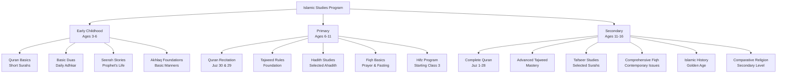
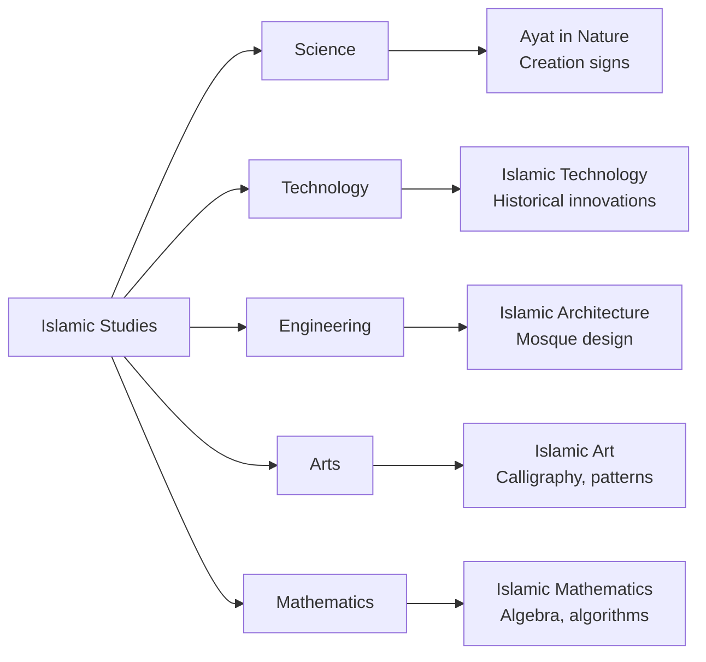

# Islamic Studies Program Overview

**Document Title:** Islamic Studies Program Overview
**Document ID:** IS_001
**Version:** 1.0
**Date:** 2026-01-11
**Project Name:** Smart Academy Digital Web Portal Development
**Content Category:** Islamic Studies Content

---

## Table of Contents

1. [Overview](#1-overview)
2. [Learning Objectives](#2-learning-objectives)
3. [Curriculum Structure](#3-curriculum-structure)
4. [Teaching Methodology](#4-teaching-methodology)
5. [Assessment & Evaluation](#5-assessment--evaluation)
6. [Resources & Materials](#6-resources--materials)
7. [Integration with Other Subjects](#7-integration-with-other-subjects)
8. [Parent Engagement](#8-parent-engagement)
9. [Technology Integration](#9-technology-integration)
10. [FAQs](#10-faqs)

---

## 1. Overview

The Islamic Studies program at Smart Academy forms the foundation of our educational philosophy, providing students with authentic Islamic knowledge rooted in the Quran and Sunnah. This comprehensive program integrates Islamic teachings with modern academic excellence through our Re-STEAM (Religion + STEAM) framework, nurturing students who are both spiritually grounded and intellectually prepared for the challenges of the modern world.

### 1.1 Philosophy

Our Islamic Studies program is built upon the following core principles:

- **Tawhid-Centric Learning**: All knowledge begins and ends with the recognition of Allah's (SWT) oneness. Every subject is taught through the lens of Tawhid, helping students see Allah's signs (Ayat) in creation and knowledge.

- **Sunnah-Based Education**: The teachings and practices of Prophet Muhammad (PBUH) serve as the ultimate model for character development, learning, and daily conduct.

- **Holistic Development**: We nurture the intellectual, spiritual, moral, and physical dimensions of each student, recognizing that true education encompasses the whole person.

- **Practical Application**: Islamic knowledge is not merely theoretical; students learn to apply Islamic principles in their daily lives, relationships, and future careers.

- **Age-Appropriate Pedagogy**: Content and teaching methods are carefully adapted to match the developmental stages of children from ages 3 to 16.

### 1.2 Goals

The Islamic Studies program aims to achieve the following goals:

1. **Islamic Identity Formation**: Help students develop a strong, confident Islamic identity that guides their choices and behaviors throughout life.

2. **Quranic Proficiency**: Enable students to read, recite, understand, and apply the teachings of the Quran with proper Tajweed.

3. **Hifz Excellence**: Provide structured support for students who aspire to memorize the entire Quran, with 15 Huffaz already completed and 45 students currently in the program.

4. **Islamic Knowledge Base**: Build comprehensive understanding of Aqidah (Islamic creed), Fiqh (Islamic jurisprudence), Hadith, Seerah, Islamic history, and Akhlaq (Islamic character).

5. **Character Development**: Instill Islamic values such as Sabr (patience), Shukr (gratitude), Amanah (trustworthiness), Ikhlas (sincerity), Adab (respect), Tawadu (humility), Rahma (compassion), and Jihad (striving for excellence).

6. **Arabic Language Proficiency**: Develop Arabic language skills to enable direct understanding of Quranic and Islamic texts.

7. **Integration with Modern Education**: Demonstrate how Islamic teachings complement and enhance understanding of science, technology, and other academic subjects.

8. **Community Leadership**: Prepare students to become positive contributors to their communities, embodying Islamic values in service to others.

### 1.3 Program Structure

The Islamic Studies program is structured across three developmental levels:

### 1.4 Daily Schedule

Islamic Studies is integrated into the daily schedule with dedicated time blocks:

| Level | Daily Islamic Studies Time | Components |
|-------|---------------------------|------------|
| Early Childhood (3-6) | 45 minutes | Quran recitation, Duas, Seerah stories, Akhlaq activities |
| Primary (6-11) | 60-75 minutes | Quran recitation, Tajweed, Islamic studies, Hifz (for selected students) |
| Secondary (11-16) | 90 minutes | Quran recitation, Tafseer, Fiqh, Hadith, Islamic history, Hifz revision |

**Daily Prayer Integration**: All students participate in daily congregational prayers (Salah) with proper Wudu and prayer etiquette, reinforcing practical application of Fiqh.

### 1.5 Hifz Program Overview

The Hifz (Quran memorization) program is a flagship component of Smart Academy's Islamic Studies offering:

- **Starting Age**: Class 3 (approximately 8 years old)
- **Duration**: 3-4 years for complete memorization
- **Current Status**: 15 Huffaz completed, 45 students currently enrolled
- **Daily Schedule**: Dedicated time for new memorization (Sabaq) and revision (Muraja'ah)
- **Certification**: Students receive Ijazah (certification) upon completion
- **Tracking System**: Individual progress tracking with milestones and regular assessments

### 1.6 Assessment System Overview

The Islamic Studies program uses a comprehensive assessment approach:

- **Formative Assessments**: Daily observation, oral recitation checks, participation in discussions
- **Summative Assessments**: Written tests, oral examinations, practical demonstrations
- **Hifz Assessments**: Weekly Sabaq tests, monthly Muraja'ah checks, quarterly comprehensive reviews
- **Character Assessments**: Behavioral observations, peer and teacher feedback, self-reflection
- **Portfolio Development**: Student portfolios documenting progress in Quran recitation, memorization, and character development

---

## 2. Learning Objectives

### 2.1 Knowledge Objectives

By the end of each level, students will demonstrate knowledge of:

**Early Childhood (3-6)**
- Recognition of Arabic letters and basic Quranic words
- Memorization of short Surahs (Surah Al-Fatiha, last 10 Surahs)
- Basic Duas for daily activities (waking, eating, sleeping, entering/leaving home)
- Stories from the Seerah of Prophet Muhammad (PBUH)
- Basic Islamic manners (Adab)
- Names of Allah (Asma ul Husna) - simplified for young learners

**Primary (6-11)**
- Complete recitation of Juz 30 (Juz Amma) and Juz 29
- Foundation Tajweed rules
- Selected Ahadith from Sahih Bukhari and Sahih Muslim
- Basic Fiqh of worship (prayer, fasting, zakat basics)
- Seerah of Prophet Muhammad (PBUH) - major events
- Stories of the Prophets
- Basic Aqidah (articles of faith)
- Arabic vocabulary for Quran comprehension

**Secondary (11-16)**
- Complete recitation of the entire Quran
- Advanced Tajweed with proper application
- Selected Tafseer of important Surahs
- Comprehensive Fiqh including contemporary issues
- Hadith studies with understanding of Isnad (chains of narration)
- Detailed Seerah and lessons from Prophet's life
- Islamic history from early period to Golden Age
- Comparative religion basics
- Arabic grammar and comprehension

### 2.2 Skills Objectives

Students will develop the following skills:

**Quranic Skills**
- Proper recitation with Tajweed
- Memorization of selected or complete Quran (based on program participation)
- Understanding of Quranic Arabic vocabulary
- Application of Quranic teachings in daily life

**Islamic Practice Skills**
- Performance of daily prayers with proper etiquette
- Recitation of daily Adhkar and Duas
- Implementation of Islamic manners in all interactions
- Observation of Islamic dress code and behavior

**Language Skills**
- Reading Arabic script fluently
- Basic Arabic conversation skills
- Understanding of Quranic Arabic grammar
- Writing basic Arabic text

**Character Skills**
- Demonstration of Islamic values in behavior
- Conflict resolution using Islamic principles
- Respectful communication with others
- Leadership and service to community

### 2.3 Character Objectives

The Islamic Studies program aims to develop the following character traits:

| Value (Arabic) | English Translation | Practical Application |
|----------------|-------------------|----------------------|
| Sabr | Patience | Perseverance in learning, calmness in difficulties |
| Shukr | Gratitude | Thanking Allah and others for blessings |
| Amanah | Trustworthiness | Fulfilling responsibilities, being reliable |
| Ikhlas | Sincerity | Doing everything for Allah's pleasure |
| Adab | Respect | Respecting parents, teachers, elders, and peers |
| Tawadu | Humility | Being humble, avoiding arrogance |
| Rahma | Compassion | Showing kindness to all creation |
| Jihad | Striving | Continuous effort for self-improvement and excellence |
| Ihsan | Excellence | Doing everything in the best possible manner |
| Ilm | Knowledge | Seeking and valuing Islamic and worldly knowledge |

---

## 3. Curriculum Structure

### 3.1 Program Components

The Islamic Studies program consists of the following integrated components:

1. **Quran Studies**: Recitation, memorization (Hifz), Tajweed, and Tafseer
2. **Hadith Studies**: Selected authentic Ahadith with explanations and applications
3. **Seerah Curriculum**: Biography of Prophet Muhammad (PBUH) and lessons
4. **Fiqh Studies**: Islamic jurisprudence covering worship and daily transactions
5. **Aqidah**: Islamic creed and theology
6. **Akhlaq**: Islamic character development and moral education
7. **Arabic Language**: Quranic Arabic for comprehension
8. **Islamic History**: Overview of Islamic civilization and contributions

### 3.2 Level-Specific Curriculum

#### Early Childhood (Ages 3-6)

| Component | Content Focus | Duration |
|-----------|---------------|----------|
| Quran | Arabic letters, short Surahs, basic words | Daily 15 min |
| Duas & Adhkar | Daily Duas, morning/evening Adhkar | Daily 10 min |
| Seerah | Stories from Prophet's life, Prophets' stories | Daily 10 min |
| Akhlaq | Basic manners, sharing, respect | Daily 10 min |

#### Primary (Ages 6-11)

| Component | Content Focus | Duration |
|-----------|---------------|----------|
| Quran | Juz 30 & 29 recitation, Tajweed foundation | Daily 20 min |
| Hifz (selected) | Memorization program starting Class 3 | Daily 30 min |
| Hadith | Selected Sahih Ahadith | Weekly 2 classes |
| Seerah | Prophet's biography chronologically | Weekly 2 classes |
| Fiqh | Prayer, fasting, zakat basics | Weekly 2 classes |
| Aqidah | Articles of faith, Tawhid | Weekly 1 class |
| Akhlaq | Character development activities | Weekly 1 class |
| Arabic | Quranic vocabulary, basic grammar | Weekly 2 classes |

#### Secondary (Ages 11-16)

| Component | Content Focus | Duration |
|-----------|---------------|----------|
| Quran | Complete Quran recitation, Tafseer | Daily 25 min |
| Hifz (selected) | Revision and completion | Daily 30 min |
| Hadith | Advanced Hadith studies, Isnad | Weekly 2 classes |
| Seerah | Detailed analysis, lessons application | Weekly 2 classes |
| Fiqh | Comprehensive Fiqh, contemporary issues | Weekly 2 classes |
| Aqidah | Advanced theology, comparative religion | Weekly 1 class |
| Akhlaq | Advanced character development | Weekly 1 class |
| Arabic | Grammar, comprehension, writing | Weekly 2 classes |
| Islamic History | Golden Age, contributions, Bangladesh | Weekly 1 class |

### 3.3 Cross-Curricular Integration

Islamic Studies is integrated with other subjects through the Re-STEAM framework:

---

## 4. Teaching Methodology

### 4.1 Pedagogical Approach

Our teaching methodology combines traditional Islamic pedagogy with modern educational best practices:

- **Storytelling**: Using stories from the Quran, Seerah, and Islamic history to make lessons engaging and memorable
- **Experiential Learning**: Hands-on activities, role-playing, and practical demonstrations
- **Socratic Method**: Guided questioning to develop critical thinking and deeper understanding
- **Peer Learning**: Group activities, peer teaching, and collaborative projects
- **Differentiated Instruction**: Adapting content and methods to meet diverse learning needs
- **Multisensory Learning**: Visual, auditory, and kinesthetic approaches to accommodate different learning styles

### 4.2 Teaching Strategies

#### For Early Childhood (3-6)
- **Visual Learning**: Colorful illustrations, flashcards, and visual aids
- **Repetition and Rhythm**: Songs, rhymes, and repetitive activities for memorization
- **Play-Based Learning**: Games and activities that teach Islamic concepts
- **Positive Reinforcement**: Encouragement and praise for effort and achievement
- **Modeling**: Teachers demonstrating Islamic behavior and manners

#### For Primary (6-11)
- **Interactive Discussions**: Class discussions about Islamic concepts and applications
- **Project-Based Learning**: Projects that integrate Islamic knowledge with other subjects
- **Memorization Techniques**: Structured approaches for Quran and Hadith memorization
- **Group Work**: Collaborative activities that build teamwork and Islamic brotherhood/sisterhood
- **Practical Application**: Real-life scenarios and problem-solving using Islamic principles

#### For Secondary (11-16)
- **Critical Analysis**: Deep examination of Islamic texts and contemporary issues
- **Research Projects**: Independent research on Islamic topics
- **Debate and Discussion**: Structured debates on Islamic and ethical issues
- **Mentorship**: Older students mentoring younger students in Islamic studies
- **Community Service**: Applying Islamic values through service projects

### 4.3 Classroom Environment

The Islamic Studies classroom is designed to be:

- **Spiritually Nurturing**: Clean, organized, with Quranic verses and Islamic art
- **Respectful**: Environment of mutual respect between teachers and students
- **Engaging**: Interactive and participatory rather than passive listening
- **Inclusive**: Welcoming to students from all backgrounds and learning abilities
- **Technology-Enhanced**: Smart boards, tablets, and digital resources for interactive learning

---

## 5. Assessment & Evaluation

### 5.1 Assessment Framework

The Islamic Studies program uses a comprehensive assessment framework:

```mermaid
graph TD
    A[Assessment Framework] --> B[Formative Assessment]
    A --> C[Summative Assessment]
    A --> D[Hifz Assessment]
    A --> E[Character Assessment]
    A --> F[Portfolio Assessment]
    
    B --> B1[Daily Observation]
    B --> B2[Oral Recitation]
    B --> B3[Class Participation]
    B --> B4[Quick Quizzes]
    
    C --> C1[Written Tests]
    C --> C2[Oral Examinations]
    C --> C3[Term Exams]
    C --> C4[Final Exams]
    
    D --> D1[Weekly Sabaq Tests]
    D --> D2[Monthly Muraja'ah]
    D --> D3[Quarterly Reviews]
    D --> D4[Completion Certification]
    
    E --> E1[Behavioral Observation]
    E --> E2[Peer Feedback]
    E --> E3[Self-Reflection]
    E --> E4[Teacher Evaluation]
    
    F --> F1[Quran Recitation Record]
    F --> F2[Memorization Progress]
    F --> F3[Character Development]
    F --> F4[Achievement Portfolio]
```

### 5.2 Assessment Methods

#### Quran Recitation Assessment
- **Fluency**: Smooth reading without hesitation
- **Tajweed**: Proper application of Tajweed rules
- **Accuracy**: Correct pronunciation and reading
- **Memorization**: Retention of memorized portions

#### Islamic Knowledge Assessment
- **Written Tests**: Multiple choice, short answer, essay questions
- **Oral Examinations**: Verbal questions and explanations
- **Presentations**: Student presentations on Islamic topics
- **Projects**: Research projects and creative work

#### Hifz Assessment
- **Sabaq**: New memorization tested daily
- **Manzil**: Recent memorization tested weekly
- **Muraja'ah**: Overall revision tested monthly
- **Comprehensive**: Complete Quran review quarterly

#### Character Assessment
- **Behavioral Rubrics**: Specific criteria for Islamic behavior
- **Observation Records**: Teacher observations of character demonstration
- **Peer Assessment**: Feedback from classmates on character traits
- **Self-Assessment**: Student reflection on character development

### 5.3 Grading System

Islamic Studies grades are reported using the following scale:

| Grade | Percentage | Description |
|-------|------------|-------------|
| A+ | 90-100% | Excellent - Outstanding performance |
| A | 80-89% | Very Good - Above expectations |
| B | 70-79% | Good - Meets expectations |
| C | 60-69% | Satisfactory - Basic understanding |
| D | 50-59% | Needs Improvement - Below expectations |
| F | Below 50% | Fail - Does not meet minimum standards |

**Special Recognition**:
- **Hafiz/Hafiza**: For students completing Quran memorization
- **Tajweed Excellence**: For outstanding Tajweed application
- **Character Award**: For exemplary Islamic character
- **Most Improved**: For significant progress in Islamic Studies

---

## 6. Resources & Materials

### 6.1 Primary Textbooks and Resources

#### Quran and Tajweed
- **The Noble Quran**: Standard Uthmani script with color-coded Tajweed
- **Tajweed Rules**: Comprehensive Tajweed textbook with examples
- **Noorani Qaida**: Foundation for Quran reading (early levels)

#### Hadith Collections
- **Sahih Al-Bukhari**: Selected Ahadith for students
- **Sahih Muslim**: Selected Ahadith for students
- **Riyad as-Salihin**: Collection of authentic Ahadith

#### Tafseer
- **Tafseer Ibn Kathir**: Simplified for student use
- **Tafseer al-Jalalayn**: Concise Tafseer for intermediate levels

#### Seerah
- **Ar-Raheeq Al-Makhtum**: The Sealed Nectar - Prophet's biography
- **Muhammad: His Life Based on Earliest Sources**: Martin Lings

#### Fiqh
- **Fiqh us-Sunnah**: Simplified Fiqh guide
- **Islamic Fiqh Academy**: Contemporary Fiqh rulings

#### Aqidah
- **Explanation of the Three Fundamental Principles**: By Sheikh Muhammad ibn Abdul Wahhab
- **Fundamentals of Tawhid**: By Dr. Bilal Philips

#### Islamic History
- **The History of Islam**: Comprehensive textbook
- **Islamic Civilization**: Contributions and achievements

### 6.2 Digital Resources

#### Quran Applications
- **Quran.com**: Online Quran with translations and Tafseer
- **Quran Explorer**: Recitation and study tools
- **iQuran**: Mobile app for Quran reading and memorization

#### Tajweed Learning
- **Tajweed Rules App**: Interactive Tajweed learning
- **YouTube Channels**: Tajweed lessons and recitations

#### Islamic Knowledge Platforms
- **Islamic Online University**: Free Islamic courses
- **SeekersGuidance**: Islamic education resources
- **Qalam Institute**: Video lectures and courses

#### Arabic Learning
- **Duolingo Arabic**: Basic Arabic lessons
- **Madinah Arabic**: Comprehensive Arabic course
- **ArabicPod101**: Audio and video lessons

### 6.3 Audio and Video Resources

#### Quran Recitations
- **Sheikh Mishary Rashid Alafasy**: Clear, melodious recitation
- **Sheikh Abdul Rahman Al-Sudais**: Powerful recitation
- **Sheikh Saad Al-Ghamdi**: Excellent for learning Tajweed

#### Islamic Lectures
- **Nouman Ali Khan**: Quranic studies and Arabic
- **Mufti Menk**: Practical Islamic advice
- **Omar Suleiman**: Islamic history and spirituality

#### Documentaries
- **The Message**: Film about early Islamic history
- **Muhammad: Legacy of a Prophet**: PBS documentary
- **Islamic Science Golden Age**: Educational documentaries

### 6.4 Supplementary Materials

#### Teaching Aids
- **Flashcards**: Arabic letters, Quranic vocabulary, Duas
- **Posters**: Islamic values, prayer times, Quranic verses
- **Charts**: Prayer positions, Wudu steps, Islamic calendar
- **Manipulatives**: Hands-on learning materials

#### Assessment Tools
- **Rubrics**: Detailed criteria for assessment
- **Checklists**: Progress tracking for memorization and skills
- **Portfolios**: Student work samples and achievements
- **Progress Reports**: Regular communication with parents

---

## 7. Integration with Other Subjects

### 7.1 Re-STEAM Integration Framework

The Islamic Studies program is integrated with STEAM subjects through the Re-STEAM framework, demonstrating how Islamic knowledge enhances and is enhanced by modern academic subjects.

#### Science Integration

| Islamic Concept | Science Connection | Example Activities |
|----------------|-------------------|-------------------|
| Ayat in Creation | Natural Sciences | Study of ecosystems reflecting Allah's wisdom |
| Tawhid in Science | Unity in Natural Laws | Exploring patterns in nature showing Allah's oneness |
| Islamic Medicine | Health Science | Contributions of Islamic scholars to medicine |
| Astronomy | Quranic Verses about Sky | Study of stars and planets mentioned in Quran |

#### Technology Integration

| Islamic Concept | Technology Connection | Example Activities |
|----------------|-------------------|-------------------|
| Islamic Golden Age Innovations | History of Technology | Study of Islamic inventions and their modern applications |
| Digital Quran | Technology Tools | Using apps for Quran memorization and revision |
| Islamic Ethics in Technology | Responsible Tech Use | Teaching ethical use of technology from Islamic perspective |
| Communication Technology | Islamic History | Study of how Muslims preserved knowledge through writing |

#### Engineering Integration

| Islamic Concept | Engineering Connection | Example Activities |
|----------------|-------------------|-------------------|
| Islamic Architecture | Structural Engineering | Study of mosque architecture and engineering principles |
| Water Management | Civil Engineering | Islamic contributions to irrigation and water systems |
| Mechanical Engineering | Islamic Inventions | Study of Al-Jazari's mechanical devices |
| Construction Technology | Islamic Buildings | Techniques used in Islamic historical buildings |

#### Arts Integration

| Islamic Concept | Arts Connection | Example Activities |
|----------------|----------------|-------------------|
| Islamic Calligraphy | Visual Arts | Learning Arabic calligraphy and its significance |
| Geometric Patterns | Mathematics & Art | Creating Islamic geometric patterns |
| Islamic Music | Performing Arts | Nasheeds and Islamic songs with proper instruments |
| Storytelling | Language Arts | Creative writing based on Islamic stories |

#### Mathematics Integration

| Islamic Concept | Mathematics Connection | Example Activities |
|----------------|-------------------|-------------------|
| Islamic Contributions to Math | History of Mathematics | Study of Al-Khwarizmi and algebra |
| Quranic Numerology | Number Theory | Analysis of numbers mentioned in Quran |
| Islamic Geometry | Spatial Mathematics | Study of geometric patterns in Islamic art |
| Zakat Calculations | Applied Mathematics | Practical calculations for Zakat |

### 7.2 Cross-Curricular Projects

Students engage in projects that integrate Islamic Studies with other subjects:

- **Islamic Science Fair**: Projects demonstrating scientific concepts mentioned in Quran
- **Islamic Art Exhibition**: Student artwork reflecting Islamic themes and values
- **Historical Reenactment**: Dramatizations of events from Islamic history
- **Community Service Projects**: Applying Islamic values through service
- **Research Projects**: Investigating contributions of Muslim scholars to various fields

---

## 8. Parent Engagement

### 8.1 Home-School Partnership

Smart Academy recognizes that parents are the primary educators of their children. The Islamic Studies program actively involves parents in their children's Islamic education through:

#### Regular Communication
- **Monthly Newsletters**: Updates on Islamic Studies curriculum and activities
- **Progress Reports**: Detailed reports on Quran recitation, memorization, and character development
- **Parent-Teacher Conferences**: Regular meetings to discuss student progress
- **Digital Communication**: WhatsApp groups and email for ongoing communication

#### Parent Workshops
- **Quran Learning at Home**: Workshop on supporting children's Quran recitation
- **Islamic Parenting**: Guidance on raising children with Islamic values
- **Understanding the Curriculum**: Overview of Islamic Studies program
- **Technology and Islam**: Balancing technology use with Islamic principles

#### Home Support Resources
- **Daily Duas Guide**: Collection of Duas for family use
- **Seerah Stories**: Stories from Prophet's life for family reading
- **Islamic Activities**: Family activities that reinforce Islamic learning
- **Prayer Schedule**: Family prayer time recommendations

### 8.2 Parent Involvement Opportunities

Parents are encouraged to participate in:

- **Islamic Events**: Eid celebrations, Quran competitions, Islamic fairs
- **Volunteer Opportunities**: Assisting with Islamic Studies activities and events
- **Parent Advisory Council**: Providing input on Islamic Studies program
- **Community Programs**: Participating in community service projects

### 8.3 Monitoring Progress at Home

Parents can support their children's Islamic education by:

- **Daily Prayer**: Ensuring children perform daily prayers
- **Quran Revision**: Listening to children's Quran recitation
- **Duas Practice**: Practicing daily Duas together as a family
- **Islamic Environment**: Creating an Islamic atmosphere at home
- **Modeling Behavior**: Demonstrating Islamic values in daily life
- **Communication**: Maintaining regular contact with Islamic Studies teachers

---

## 9. Technology Integration

### 9.1 Digital Learning Tools

The Islamic Studies program incorporates technology to enhance learning:

#### Quran Learning Apps
- **Memorization Apps**: Tools for tracking Hifz progress
- **Tajweed Apps**: Interactive Tajweed rule learning
- **Quran Audio**: Access to various recitations for listening practice
- **Tafseer Apps**: Digital Tafseer resources for study

#### Classroom Technology
- **Smart Boards**: Interactive displays for Quranic verses and Islamic content
- **Tablets**: Individual devices for personalized learning
- **Projectors**: Displaying Islamic content and documentaries
- **Audio Systems**: High-quality audio for Quran recitations

#### Learning Management System
- **Gibbon Integration**: Digital platform for Islamic Studies resources
- **Progress Tracking**: Online tracking of Quran memorization and progress
- **Resource Sharing**: Digital library of Islamic Studies materials
- **Assessment Tools**: Online quizzes and assessments

### 9.2 Technology for Hifz Program

The Hifz program uses specialized technology:

- **Hifz Tracking Apps**: Mobile apps for tracking memorization progress
- **Audio Recording**: Recording and reviewing recitation
- **Revision Schedules**: Automated revision reminders based on spaced repetition
- **Progress Visualization**: Visual charts showing memorization milestones

### 9.3 Online Islamic Resources

Students and parents have access to:

- **Online Quran Libraries**: Comprehensive Quran and Tafseer resources
- **Islamic Video Lectures**: Access to renowned Islamic scholars
- **Interactive Learning**: Online courses and tutorials
- **Islamic Communities**: Online forums for discussion and support

### 9.4 Digital Citizenship from Islamic Perspective

Technology use is guided by Islamic principles:

- **Ethical Internet Use**: Following Islamic guidelines for online behavior
- **Time Management**: Balancing technology use with religious obligations
- **Content Filtering**: Ensuring access to appropriate Islamic content
- **Privacy and Respect**: Islamic etiquette in digital communication

---

## 10. FAQs

### General Questions

**Q: What is the daily time commitment for Islamic Studies?**

A: Islamic Studies is integrated into the daily schedule:
- Early Childhood (3-6): 45 minutes daily
- Primary (6-11): 60-75 minutes daily
- Secondary (11-16): 90 minutes daily
Additionally, all students participate in daily prayers.

**Q: Is the Hifz program mandatory?**

A: The Hifz program is optional but highly encouraged. Students who show aptitude and interest can join the program starting from Class 3 (age 8+). Currently, 45 students are enrolled in the Hifz program.

**Q: How do you ensure the authenticity of Islamic content?**

A: All Islamic content is sourced from authentic Islamic sources:
- Quran: Standard Uthmani script
- Hadith: Sahih Bukhari, Sahih Muslim, and other authentic collections
- Fiqh: Based on recognized Islamic scholarship
- Teachers are qualified with Islamic education credentials

**Q: How is Islamic character development assessed?**

A: Character assessment is ongoing and includes:
- Teacher observations of behavior
- Peer feedback
- Self-reflection activities
- Parent input
- Specific rubrics for Islamic values demonstration

### Curriculum Questions

**Q: What Surahs do students memorize in Early Childhood?**

A: Early Childhood students memorize:
- Surah Al-Fatiha
- The last 10 Surahs of the Quran (Surah Al-Fil to Surah An-Nas)
- Short Duas for daily activities

**Q: When do students start learning Fiqh?**

A: Basic Fiqh concepts are introduced from Early Childhood through practical activities (prayer, Wudu). Formal Fiqh study begins in Primary level with focus on prayer and fasting, progressing to comprehensive Fiqh in Secondary level.

**Q: Is Arabic language taught as a separate subject?**

A: Arabic is integrated within the Islamic Studies program with focus on Quranic Arabic comprehension. Additional Arabic language classes may be offered based on student interest and availability.

### Assessment Questions

**Q: How is Quran memorization tested?**

A: Hifz assessment includes:
- Daily Sabaq test (new memorization)
- Weekly Manzil test (recent memorization)
- Monthly Muraja'ah (overall revision)
- Quarterly comprehensive review
- Final completion examination with certification

**Q: What happens if a student struggles with Quran memorization?**

A: We provide individualized support:
- One-on-one tutoring with Quran teachers
- Adjusted memorization pace
- Additional practice time
- Encouragement and motivation
- Parent involvement in home practice

### Parent Questions

**Q: How can I support my child's Islamic education at home?**

A: Parents can support by:
- Ensuring daily prayers
- Listening to Quran recitation
- Practicing Duas together
- Creating an Islamic environment at home
- Modeling Islamic behavior
- Maintaining communication with teachers
- Attending parent workshops

**Q: Are there resources for parents to learn alongside their children?**

A: Yes, we provide:
- Parent workshops on Islamic topics
- Recommended reading lists
- Online resources and courses
- Family Islamic activity guides
- Access to Islamic Studies curriculum materials

### Technology Questions

**Q: What technology tools are used in Islamic Studies?**

A: Technology integration includes:
- Quran learning apps for memorization and Tajweed
- Smart boards for interactive lessons
- Tablets for personalized learning
- Online resources and digital libraries
- Progress tracking systems

**Q: Is screen time balanced with traditional learning methods?**

A: Yes, we maintain a balanced approach:
- Technology is used as a tool, not replacement for traditional learning
- Face-to-face instruction remains primary
- Screen time is limited and purposeful
- Traditional methods (oral recitation, memorization) are emphasized

---

## Document Approval

| Role | Name | Signature | Date |
|------|------|-----------|------|
| Islamic Studies Coordinator | | _________________ | ________ |
| Principal | | _________________ | ________ |
