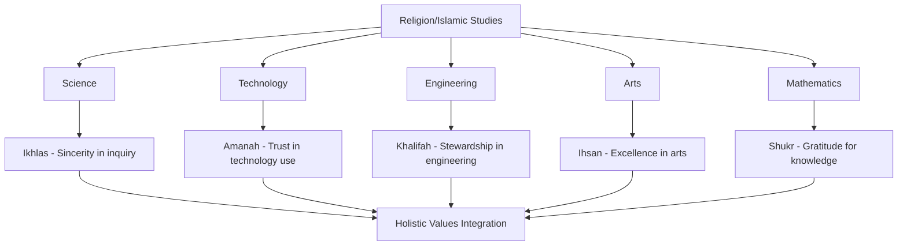

# Islamic Values Framework for Curriculum Integration

**Document Title:** Islamic Values Framework for Curriculum Integration
**Document ID:** IS_VAL_001
**Version:** 1.0
**Date:** 2026-01-11
**Project Name:** Smart Academy Digital Web Portal Development
**Content Category:** Islamic Studies Content

---

## Table of Contents

1. [Overview](#1-overview)
2. [Integration Philosophy](#2-integration-philosophy)
3. [Integration Framework](#3-integration-framework)
4. [Core Islamic Values](#4-core-islamic-values)
5. [Integration by Subject and Grade Level](#5-integration-by-subject-and-grade-level)
6. [Weekly Value Focus Schedule](#6-weekly-value-focus-schedule)
7. [Character Assessment Rubrics](#7-character-assessment-rubrics)
8. [Teaching Strategies](#8-teaching-strategies)
9. [Lesson Planning](#9-lesson-planning)
10. [Assessment & Evaluation](#10-assessment--evaluation)
11. [Teacher Training](#11-teacher-training)
12. [Parent Engagement](#12-parent-engagement)
13. [FAQs](#13-faqs)

---

## 1. Overview

This document outlines Smart Academy's comprehensive framework for integrating Islamic values across the curriculum. The framework is grounded in the belief that education is not merely about acquiring knowledge but about developing character rooted in Islamic values. Through the Re-STEAM framework (Religion + STEAM), students learn to embody Islamic values in all aspects of their academic and personal lives.

### 1.1 Philosophy

The Islamic values framework at Smart Academy is based on several fundamental principles:

- **Tawhid (Oneness of Allah)**: All values originate from the recognition of Allah's oneness and sovereignty. Character development begins with proper understanding of Tawhid.
- **Taqwa (God-Consciousness)**: Values are internalized through consciousness of Allah and awareness that He sees all actions.
- **Ihsan (Excellence)**: Striving for excellence in all actions, knowing that Allah loves those who do good.
- **Balance**: Integrating values across all subjects while maintaining academic excellence and spiritual growth.
- **Holistic Development**: Nurturing the intellectual, spiritual, moral, and social dimensions of each student.

### 1.2 Goals

The Islamic values framework aims to achieve the following goals:

**Knowledge Goals:**
- Understand core Islamic values from Quran and Sunnah
- Learn the foundations of Islamic character development
- Recognize how values apply to all academic subjects
- Understand the importance of values in personal and professional life

**Skills Goals:**
- Apply Islamic values in daily life and academic work
- Make decisions based on Islamic principles
- Demonstrate Islamic manners (Adab) in various contexts
- Develop moral reasoning and value-based problem-solving skills

**Character Goals:**
- Internalize Islamic values in daily life
- Develop strong moral character based on Islamic teachings
- Cultivate habits of virtuous behavior
- Become role models of Islamic values in the community

---

## 2. Integration Philosophy

### 2.1 Islamic Foundations

The Islamic values framework is founded on authentic Islamic sources:

**Quranic Foundations:**

> "Indeed, the most noble of you in the sight of Allah is the most righteous of you."
> — Quran 49:13

> "And indeed, you are of a great moral character."
> — Quran 68:4

> "And the servants of the Most Merciful are those who walk upon the earth easily, and when the ignorant address them [harshly], they say [words of] peace."
> — Quran 25:63

> "And take provisions, but indeed, the best provision is fear of Allah."
> — Quran 2:197

> "O you who have believed, why do you say what you do not do? Great is hatred in the sight of Allah that you say what you do not do."
> — Quran 61:2-3

**Hadith Foundations:**

> "The most complete of the believers in faith is the one with the best character, and the best of you are the best in behavior to their women."
> — Sunan al-Tirmidhi, Book 46, Hadith 1162

> "I was sent only to perfect good moral character."
> — Sunan al-Bayhaqi, Book 7, Hadith 13766

> "None of you truly believes until he loves for his brother what he loves for himself."
> — Sahih Bukhari, Book 2, Hadith 12

> "The strong person is not the one who can wrestle someone else down. The strong person is the one who can control himself when he is angry."
> — Sahih Bukhari, Book 73, Hadith 135

> "Truthfulness leads to righteousness, and righteousness leads to Paradise."
> — Sahih Bukhari, Book 73, Hadith 104

### 2.2 Re-STEAM Framework Integration

The Re-STEAM framework (Religion + STEAM) provides the structural foundation for integrating Islamic values across the curriculum:

**Key Integration Points:**

1. **Science**: Ikhlas (sincerity) in scientific inquiry, Shukr (gratitude) for understanding Allah's creation
2. **Technology**: Amanah (trust) in using technology, Adab (etiquette) in digital communication
3. **Engineering**: Khalifah (stewardship) in designing solutions, Ihsan (excellence) in work
4. **Arts**: Ihsan (excellence) in artistic expression, Shukr (gratitude) for creative abilities
5. **Mathematics**: Sabr (patience) in problem-solving, Shukr (gratitude) for the gift of reason

---

## 3. Integration Framework

### 3.1 Age-Appropriate Integration

The integration of Islamic values is tailored to three developmental stages:

#### Early Childhood (3-6 years)

**Focus Values:**
- Adab (Etiquette): Basic manners and respect
- Shukr (Gratitude): Thankfulness for blessings
- Ihsan (Kindness): Being kind to others
- Sidq (Truthfulness): Telling the truth
- Ta'awun (Cooperation): Working together

**Integration Examples:**
- Saying Assalamu Alaikum and JazakAllah Khair
- Thanking Allah for food, family, and friends
- Sharing toys and helping classmates
- Being honest about actions
- Playing together and helping each other

#### Primary Level (6-11 years)

**Focus Values:**
- Amanah (Trustworthiness): Being trustworthy
- Sabr (Patience): Patience in learning and life
- Adl (Justice): Fairness in interactions
- Tawadu (Humility): Being humble
- Karam (Generosity): Sharing with others

**Integration Examples:**
- Being honest in tests and assignments
- Being patient when learning difficult concepts
- Playing fairly with classmates
- Accepting praise and criticism gracefully
- Sharing resources and helping others

#### Secondary Level (11-16 years)

**Focus Values:**
- Ikhlas (Sincerity): Sincerity in all actions
- Hilm (Forbearance): Self-control and tolerance
- Wafa (Loyalty): Faithfulness to commitments
- Jihad (Striving): Striving for excellence in good
- Rahma (Compassion): Compassion for others

**Integration Examples:**
- Doing work for Allah's pleasure, not recognition
- Controlling anger and responding with kindness
- Being loyal to friends, family, and commitments
- Striving for academic and personal excellence
- Showing compassion to those in need

### 3.2 Values Integration Matrix

| Grade Level | Subject Area | Core Values | Quranic Reference |
|-------------|---------------|-------------|-------------------|
| Early Childhood | All Subjects | Adab, Shukr, Ihsan | Quran 17:23-24, 14:7 |
| Early Childhood | Play/Activities | Sidq, Ta'awun | Quran 33:70, 5:2 |
| Primary | All Subjects | Amanah, Sabr, Adl | Quran 23:8-9, 2:153, 5:8 |
| Primary | Mathematics | Shukr, Sabr | Quran 14:7, 2:153 |
| Primary | Language Arts | Sidq, Adab | Quran 33:70, 25:63 |
| Secondary | All Subjects | Ikhlas, Hilm, Wafa | Quran 98:5, 3:134, 5:1 |
| Secondary | Science | Ikhlas, Shukr | Quran 98:5, 14:7 |
| Secondary | Technology | Amanah, Adab | Quran 23:8-9, 49:12 |
| Secondary | All Subjects | Jihad, Rahma | Quran 29:69, 21:107 |

---

## 4. Core Islamic Values

### 4.1 Comprehensive Value Definitions

#### Ikhlas (Sincerity)

**Definition:** Performing all actions solely for Allah's pleasure, without seeking recognition or praise from others.

**Quranic References:**
> "And they were not commanded except to worship Allah, [being] sincere to Him in religion."
> — Quran 98:5

> "Say, 'Indeed, my prayer, my rites of sacrifice, my living and my dying are for Allah, Lord of the worlds.'"
> — Quran 6:162

**Hadith References:**
> "Actions are but by intentions, and every man shall have only that which he intended."
> — Sahih Bukhari, Book 1, Hadith 1

**Application in Education:**
- Doing homework and assignments for Allah's pleasure
- Participating in class with sincerity
- Helping others without expecting praise
- Being honest in all academic work

#### Sabr (Patience)

**Definition:** Remaining steadfast in the face of difficulties, persevering through challenges, and controlling one's emotions.

**Quranic References:**
> "O you who have believed, seek help through patience and prayer. Indeed, Allah is with the patient."
> — Quran 2:153

> "And be patient, [O Muhammad], for the decision of your Lord, and indeed, you are in Our eyes."
> — Quran 52:48

**Hadith References:**
> "How amazing is the affair of the believer! All of his affairs are good for him."
> — Sahih Muslim, Book 1, Hadith 2999

**Application in Education:**
- Being patient when learning difficult concepts
- Persevering through challenging assignments
- Controlling frustration during tests
- Being patient with classmates and teachers

#### Shukr (Gratitude)

**Definition:** Expressing thankfulness to Allah for His blessings and recognizing the source of all good.

**Quranic References:**
> "And [remember] when your Lord proclaimed, 'If you are grateful, I will surely increase you [in favor]; but if you deny, indeed, My punishment is severe.'"
> — Quran 14:7

> "And whatever of blessings you have is from Allah."
> — Quran 16:53

**Hadith References:**
> "He who does not thank people does not thank Allah."
> — Sunan al-Tirmidhi, Book 43, Hadith 1955

**Application in Education:**
- Thanking Allah for the ability to learn
- Being grateful for teachers and resources
- Appreciating opportunities for education
- Expressing gratitude to classmates who help

#### Amanah (Trustworthiness)

**Definition:** Fulfilling trusts and responsibilities with integrity, reliability, and accountability.

**Quranic References:**
> "Indeed, Allah commands you to render trusts to whom they are due."
> — Quran 4:58

> "O you who have believed, fulfill [all] contracts."
> — Quran 5:1

**Hadith References:**
> "The signs of a hypocrite are three: when he speaks he lies, when he makes a promise he breaks it, and when he is entrusted he betrays."
> — Sahih Bukhari, Book 2, Hadith 33

**Application in Education:**
- Being honest in tests and assignments
- Returning borrowed materials on time
- Keeping promises to classmates and teachers
- Being reliable in group work

#### Adab (Etiquette/Respect)

**Definition:** Proper conduct, manners, and respect in all interactions, reflecting Islamic teachings.

**Quranic References:**
> "And the servants of the Most Merciful are those who walk upon the earth easily, and when the ignorant address them [harshly], they say [words of] peace."
> — Quran 25:63

> "And speak to people good [words]."
> — Quran 2:83

**Hadith References:**
> "The most complete of the believers in faith is the one with the best character."
> — Sunan al-Tirmidhi, Book 46, Hadith 1162

**Application in Education:**
- Greeting teachers and classmates with Assalamu Alaikum
- Using respectful language
- Listening attentively when others speak
- Showing respect for school property

#### Tawadu (Humility)

**Definition:** Having a modest view of oneself, avoiding arrogance, and recognizing Allah's blessings.

**Quranic References:**
> "And the servants of the Most Merciful are those who walk upon the earth easily, and when the ignorant address them [harshly], they say [words of] peace."
> — Quran 25:63

> "And do not turn your cheek [in contempt] toward people and do not walk through the earth exultantly."
> — Quran 31:18

**Hadith References:**
> "No one humbles himself for the sake of Allah except that Allah raises him."
> — Sahih Muslim, Book 35, Hadith 6585

**Application in Education:**
- Accepting praise gracefully without arrogance
- Acknowledging the help of others in success
- Being willing to learn from anyone
- Not showing off knowledge or abilities

#### Rahma (Compassion)

**Definition:** Showing mercy, kindness, and empathy towards others, especially those in need.

**Quranic References:**
> "So by mercy from Allah, [O Muhammad], you were lenient with them. And if you had been rude [in speech] and harsh in heart, they would have disbanded from about you."
> — Quran 3:159

> "And He has not laid upon you in religion any hardship."
> — Quran 22:78

**Hadith References:**
> "The merciful are shown mercy by the Most Merciful. Be merciful to those on earth, and the One in the heavens will have mercy upon you."
> — Sunan al-Tirmidhi, Book 37, Hadith 1924

**Application in Education:**
- Helping classmates who are struggling
- Being kind to new students
- Showing empathy towards others' difficulties
- Participating in charitable activities

#### Hilm (Forbearance)

**Definition:** Exercising self-control, tolerance, and patience in difficult situations.

**Quranic References:**
> "And the servants of the Most Mercific are those who walk upon the earth easily, and when the ignorant address them [harshly], they say [words of] peace."
> — Quran 25:63

> "And whoever is patient and forgives - indeed, that is of the matters [requiring] determination."
> — Quran 42:43

**Hadith References:**
> "The strong person is not the one who can wrestle someone else down. The strong person is the one who can control himself when he is angry."
> — Sahih Bukhari, Book 73, Hadith 135

**Application in Education:**
- Controlling anger when provoked
- Responding to insults with kindness
- Being tolerant of different opinions
- Forgiving others who make mistakes

#### Karam (Generosity)

**Definition:** Being generous with one's time, knowledge, resources, and kindness.

**Quranic References:**
> "Never will you attain the good [reward] until you spend [in the way of Allah] from that which you love."
> — Quran 3:92

> "And whatever good you spend is for yourselves."
> — Quran 2:272

**Hadith References:**
> "The believer's shade on the Day of Resurrection will be his charity."
> — Sunan al-Tirmidhi, Book 38, Hadith 604

**Application in Education:**
- Sharing knowledge with classmates
- Donating to school and community causes
- Being generous with time to help others
- Sharing resources and materials

#### Wafa (Loyalty)

**Definition:** Being faithful, true to one's word, and maintaining commitments.

**Quranic References:**
> "O you who have believed, fulfill [all] contracts."
> — Quran 5:1

> "And fulfill the covenant of Allah when you have taken it."
> — Quran 16:91

**Hadith References:**
> "The signs of a hypocrite are three: when he speaks he lies, when he makes a promise he breaks it, and when he is entrusted he betrays."
> — Sahih Bukhari, Book 2, Hadith 33

**Application in Education:**
- Keeping promises to classmates and teachers
- Being loyal to friends and family
- Fulfilling commitments to group projects
- Being true to one's word

#### Jihad (Striving in Good)

**Definition:** Striving and exerting effort in the path of Allah, including self-improvement and service to others.

**Quranic References:**
> "And those who strive for Us - We will surely guide them to Our ways."
> — Quran 29:69

> "So whoever strives [for the cause of Allah] strives only for himself."
> — Quran 29:6

**Hadith References:**
> "The best Jihad is a word of truth in front of a tyrannical ruler."
> — Sunan al-Tirmidhi, Book 35, Hadith 2174

**Application in Education:**
- Striving for academic excellence
- Overcoming personal weaknesses
- Standing up for justice
- Serving the community

#### Sidq (Truthfulness)

**Definition:** Being truthful in speech and action, avoiding lies and deception.

**Quranic References:**
> "O you who have believed, fear Allah and be with the truthful."
> — Quran 9:119

> "O you who have believed, why do you say what you do not do?"
> — Quran 61:2

**Hadith References:**
> "Truthfulness leads to righteousness, and righteousness leads to Paradise."
> — Sahih Bukhari, Book 73, Hadith 104

**Application in Education:**
- Being honest in all academic work
- Telling the truth even when difficult
- Avoiding cheating and plagiarism
- Being truthful with teachers and classmates

### 4.2 Values Summary Table

| Value | Arabic | Core Meaning | Key Application |
|-------|--------|--------------|----------------|
| **Sincerity** | Ikhlas | Doing for Allah alone | Academic work, helping others |
| **Patience** | Sabr | Steadfastness | Learning difficulties, challenges |
| **Gratitude** | Shukr | Thankfulness | Appreciating blessings |
| **Trustworthiness** | Amanah | Fulfilling trusts | Honesty, reliability |
| **Etiquette** | Adab | Proper conduct | Manners, respect |
| **Humility** | Tawadu | Modesty | Accepting praise, learning |
| **Compassion** | Rahma | Kindness and mercy | Helping others, empathy |
| **Forbearance** | Hilm | Self-control | Anger management, tolerance |
| **Generosity** | Karam | Giving freely | Sharing, charity |
| **Loyalty** | Wafa | Faithfulness | Keeping promises |
| **Striving** | Jihad | Effort for good | Self-improvement, service |
| **Truthfulness** | Sidq | Honesty | Academic integrity |

---

## 5. Integration by Subject and Grade Level

### 5.1 Science Integration

**Primary Values:** Ikhlas, Shukr, Sabr

**Early Childhood (3-6 years):**
- **Ikhlas**: Learning about Allah's creation with sincerity
- **Shukr**: Thanking Allah for the wonders of nature
- **Sabr**: Being patient while observing natural phenomena

**Primary (6-11 years):**
- **Ikhlas**: Conducting experiments with sincere intention to learn
- **Shukr**: Gratitude for understanding Allah's creation
- **Sabr**: Patience in scientific inquiry and problem-solving

**Secondary (11-16 years):**
- **Ikhlas**: Sincerity in research and scientific work
- **Shukr**: Gratitude for the gift of knowledge and reason
- **Sabr**: Perseverance in complex scientific studies

### 5.2 Mathematics Integration

**Primary Values:** Shukr, Sabr, Amanah

**Early Childhood (3-6 years):**
- **Shukr**: Thanking Allah for the ability to count and calculate
- **Sabr**: Patience in learning numbers and basic operations
- **Amanah**: Being honest in counting and sharing

**Primary (6-11 years):**
- **Shukr**: Gratitude for mathematical understanding
- **Sabr**: Patience in solving problems
- **Amanah**: Honesty in calculations and showing work

**Secondary (11-16 years):**
- **Shukr**: Appreciation for the order and precision in mathematics
- **Sabr**: Perseverance in complex mathematical problems
- **Amanah**: Academic integrity in all mathematical work

### 5.3 Language Arts Integration

**Primary Values:** Sidq, Adab, Ihsan

**Early Childhood (3-6 years):**
- **Sidq**: Telling the truth in stories and conversations
- **Adab**: Using polite language and good manners
- **Ihsan**: Being kind in speech and writing

**Primary (6-11 years):**
- **Sidq**: Honesty in writing and speaking
- **Adab**: Respectful communication
- **Ihsan**: Excellence in expression and creativity

**Secondary (11-16 years):**
- **Sidq**: Truthfulness in all communication
- **Adab**: Respectful and eloquent expression
- **Ihsan**: Striving for excellence in language arts

### 5.4 Social Studies Integration

**Primary Values:** Adl, Karam, Rahma

**Early Childhood (3-6 years):**
- **Adl**: Fairness in play and sharing
- **Karam**: Sharing toys and resources
- **Rahma**: Kindness to classmates

**Primary (6-11 years):**
- **Adl**: Understanding justice in society
- **Karam**: Generosity towards others
- **Rahma**: Compassion for those in need

**Secondary (11-16 years):**
- **Adl**: Advocating for justice in society
- **Karam**: Generosity and service to community
- **Rahma**: Compassion and empathy for all

### 5.5 Technology Integration

**Primary Values:** Amanah, Adab, Hilm

**Early Childhood (3-6 years):**
- **Amanah**: Taking care of devices and materials
- **Adab**: Using technology with good manners
- **Hilm**: Sharing devices patiently

**Primary (6-11 years):**
- **Amanah**: Responsible use of technology
- **Adab**: Online etiquette and respect
- **Hilm**: Self-control with technology use

**Secondary (11-16 years):**
- **Amanah**: Ethical use of technology and information
- **Adab**: Digital citizenship and online respect
- **Hilm**: Balanced and responsible technology use

### 5.6 Physical Education Integration

**Primary Values:** Hilm, Adl, Tawadu

**Early Childhood (3-6 years):**
- **Hilm**: Controlling emotions during play
- **Adl**: Playing fairly
- **Tawadu**: Being humble in winning and losing

**Primary (6-11 years):**
- **Hilm**: Self-control in sports
- **Adl**: Fairness and sportsmanship
- **Tawadu**: Humility in competition

**Secondary (11-16 years):**
- **Hilm**: Forbearance and self-discipline
- **Adl**: Justice in sports and physical activities
- **Tawadu**: Humility in achievement

### 5.7 Arts Integration

**Primary Values:** Ihsan, Shukr, Ikhlas

**Early Childhood (3-6 years):**
- **Ihsan**: Doing art with care and kindness
- **Shukr**: Thanking Allah for creative abilities
- **Ikhlas**: Creating for Allah's pleasure

**Primary (6-11 years):**
- **Ihsan**: Excellence in artistic expression
- **Shukr**: Gratitude for artistic talents
- **Ikhlas**: Sincerity in creative work

**Secondary (11-16 years):**
- **Ihsan**: Striving for artistic excellence
- **Shukr**: Appreciation for beauty and creativity
- **Ikhlas**: Sincere artistic expression

---

## 6. Weekly Value Focus Schedule

### 6.1 Academic Year Schedule

| Week | Value | Arabic | Focus Area | Quranic Reference |
|------|-------|--------|------------|-------------------|
| 1 | Introduction | - | Overview of Islamic values | Quran 49:13 |
| 2 | Sincerity | Ikhlas | Intention in all actions | Quran 98:5 |
| 3 | Patience | Sabr | Perseverance in learning | Quran 2:153 |
| 4 | Gratitude | Shukr | Thankfulness for blessings | Quran 14:7 |
| 5 | Trustworthiness | Amanah | Honesty and reliability | Quran 4:58 |
| 6 | Etiquette | Adab | Manners and respect | Quran 25:63 |
| 7 | Humility | Tawadu | Modesty and avoiding arrogance | Quran 31:18 |
| 8 | Compassion | Rahma | Kindness and empathy | Quran 3:159 |
| 9 | Forbearance | Hilm | Self-control and tolerance | Quran 42:43 |
| 10 | Generosity | Karam | Giving and sharing | Quran 3:92 |
| 11 | Loyalty | Wafa | Faithfulness and promises | Quran 5:1 |
| 12 | Striving | Jihad | Effort for good | Quran 29:69 |
| 13 | Truthfulness | Sidq | Honesty in speech and action | Quran 9:119 |
| 14 | Justice | Adl | Fairness in all dealings | Quran 5:8 |
| 15 | Cooperation | Ta'awun | Working together | Quran 5:2 |
| 16 | Forgiveness | Afw | Letting go of grievances | Quran 42:40 |
| 17 | Respect for Parents | Birr al-Walidayn | Honoring parents | Quran 17:23-24 |
| 18 | Neighborliness | Ihsan lil-Jar | Kindness to neighbors | Quran 4:36 |
| 19 | Kindness to Animals | Ihsan lil-Hayawan | Compassion for animals | Quran 6:38 |
| 20 | Environmental Care | Khalifah | Stewardship of earth | Quran 7:31 |
| 21 | Knowledge Seeking | Talab al-Ilm | Pursuit of knowledge | Quran 20:114 |
| 22 | Good Speech | Husn al-Qawl | Speaking good words | Quran 2:83 |
| 23 | Good Assumption | Husn al-Zann | Positive thinking | Quran 49:12 |
| 24 | Moderation | I'tidal | Balance in all things | Quran 25:67 |
| 25 | Time Management | Ihsan fil-Waqt | Valuing time | Quran 103:1-3 |
| 26 | Friendship | Sadaqah | Good companionship | Quran 18:28 |
| 27 | Family Ties | Silat ar-Rahim | Maintaining family bonds | Quran 47:22 |
| 28 | Courage | Shaja'ah | Standing for truth | Quran 33:35 |
| 29 | Contentment | Qana'ah | Satisfaction with what one has | Quran 13:28 |
| 30 | Review & Celebration | - | Integration of all values | Multiple |

### 6.2 Daily Value Integration

**Morning Routine:**
- Make intention (Niyyah) for the day based on weekly value
- Recite relevant Quranic verse or Dua
- Set specific goals for practicing the value

**During Classes:**
- Reference the value in lesson content
- Provide examples of the value in action
- Encourage students to practice the value

**End of Day:**
- Reflect on how the value was practiced
- Identify areas for improvement
- Make intention for continued practice

---

## 7. Character Assessment Rubrics

### 7.1 General Character Rubric

| Criteria | Excellent (4) | Proficient (3) | Developing (2) | Beginning (1) |
|----------|---------------|----------------|----------------|---------------|
| **Consistency** | Consistently demonstrates the value in all situations | Frequently demonstrates the value | Sometimes demonstrates the value | Rarely demonstrates the value |
| **Understanding** | Deep understanding of the value and its importance | Good understanding of the value | Basic understanding of the value | Limited understanding |
| **Application** | Applies the value appropriately in diverse situations | Applies the value in most situations | Applies the value in some situations | Limited application |
| **Influence** | Positively influences others through example | Sometimes influences others | Rarely influences others | No influence demonstrated |
| **Reflection** | Deep reflection on personal growth | Good reflection on growth | Basic reflection | Minimal reflection |

### 7.2 Value-Specific Rubrics

#### Rubric for Ikhlas (Sincerity)

| Criteria | Excellent (4) | Proficient (3) | Developing (2) | Beginning (1) |
|----------|---------------|----------------|----------------|---------------|
| **Intention** | Consistently makes intention for Allah's pleasure | Frequently makes good intention | Sometimes makes good intention | Rarely considers intention |
| **Action** | Actions align with sincere intention | Most actions align with intention | Some actions align with intention | Actions don't align with intention |
| **Recognition** | Does not seek recognition from others | Rarely seeks recognition | Sometimes seeks recognition | Frequently seeks recognition |
| **Consistency** | Sincere in all aspects of life | Sincere in most aspects | Sincere in some aspects | Limited sincerity |

#### Rubric for Sabr (Patience)

| Criteria | Excellent (4) | Proficient (3) | Developing (2) | Beginning (1) |
|----------|---------------|----------------|----------------|---------------|
| **Difficulties** | Maintains patience through significant challenges | Patient through moderate challenges | Patient through minor challenges | Easily frustrated |
| **Learning** | Patient in learning difficult concepts | Generally patient in learning | Sometimes impatient | Frequently impatient |
| **Emotions** | Excellent emotional control | Good emotional control | Some emotional control | Poor emotional control |
| **Perseverance** | Consistently perseveres through setbacks | Usually perseveres | Sometimes gives up | Frequently gives up |

#### Rubric for Shukr (Gratitude)

| Criteria | Excellent (4) | Proficient (3) | Developing (2) | Beginning (1) |
|----------|---------------|----------------|----------------|---------------|
| **Expression** | Consistently expresses gratitude to Allah and others | Frequently expresses gratitude | Sometimes expresses gratitude | Rarely expresses gratitude |
| **Recognition** | Recognizes and appreciates all blessings | Recognizes most blessings | Recognizes some blessings | Limited recognition |
| **Attitude** | Consistently positive and appreciative | Generally positive | Sometimes positive | Frequently negative |
| **Thankfulness** | Thankful in all circumstances | Thankful in most circumstances | Sometimes thankful | Rarely thankful |

#### Rubric for Amanah (Trustworthiness)

| Criteria | Excellent (4) | Proficient (3) | Developing (2) | Beginning (1) |
|----------|---------------|----------------|----------------|---------------|
| **Honesty** | Completely honest in all situations | Honest in most situations | Sometimes honest | Frequently dishonest |
| **Reliability** | Always reliable and dependable | Usually reliable | Sometimes reliable | Unreliable |
| **Promises** | Always keeps promises | Usually keeps promises | Sometimes keeps promises | Frequently breaks promises |
| **Trust** | Trusted by all | Trusted by most | Sometimes trusted | Not trusted |

#### Rubric for Adab (Etiquette)

| Criteria | Excellent (4) | Proficient (3) | Developing (2) | Beginning (1) |
|----------|---------------|----------------|----------------|---------------|
| **Manners** | Excellent manners in all situations | Good manners in most situations | Basic manners | Poor manners |
| **Respect** | Shows respect to everyone | Shows respect to most people | Shows respect to some people | Limited respect |
| **Speech** | Always speaks respectfully | Usually speaks respectfully | Sometimes speaks respectfully | Frequently speaks disrespectfully |
| **Behavior** | Consistently well-behaved | Generally well-behaved | Sometimes well-behaved | Frequently misbehaves |

---

## 8. Teaching Strategies

### 8.1 Value-Based Storytelling

**Strategy Description:**
Using stories to illustrate Islamic values helps students understand and internalize them through relatable examples.

**Implementation Steps:**

1. **Select Stories:**
   - Choose stories from Quran, Seerah, or Islamic history
   - Ensure stories are age-appropriate
   - Select stories that clearly demonstrate the value
   - Include diverse examples

2. **Tell the Story:**
   - Use engaging narrative techniques
   - Pause for reflection at key moments
   - Ask questions to engage students
   - Connect story to students' lives

3. **Reinforce the Value:**
   - Discuss the moral of the story
   - Connect to Quranic verses or Hadith
   - Encourage student reflections
   - Apply lessons to modern contexts

**Story Examples:**
- Story of Prophet Yusuf (AS) - Sabr (patience) and forgiveness
- Story of Prophet Ayyub (AS) - Sabr (patience) and Shukr (gratitude)
- Story of Abu Bakr (RA) - Amanah (trustworthiness) and generosity
- Story of Umar ibn al-Khattab (RA) - Adl (justice) and humility

### 8.2 Value Modeling

**Strategy Description:**
Teachers model Islamic values through their behavior, creating powerful examples for students to follow.

**Implementation Steps:**

1. **Demonstrate Values:**
   - Model the value consistently in all interactions
   - Explain why certain actions demonstrate the value
   - Acknowledge when practicing the value
   - Admit mistakes and model improvement

2. **Create Opportunities:**
   - Provide opportunities for students to observe the value in action
   - Highlight examples of the value in daily life
   - Encourage students to recognize the value in others
   - Celebrate students who demonstrate the value

3. **Reflect Together:**
   - Discuss observations of the value in action
   - Analyze how the value impacts behavior
   - Connect observations to Islamic teachings
   - Plan for continued practice

### 8.3 Value-Based Projects

**Strategy Description:**
Projects focused on specific values allow students to explore and practice them in depth.

**Project Examples:**

**Project 1: Gratitude Journal**
- **Value:** Shukr (Gratitude)
- **Duration:** 4 weeks
- **Activities:**
  - Daily gratitude entries
  - Sharing gratitude with others
  - Creating gratitude artwork
  - Presenting gratitude reflections

**Project 2: Kindness Campaign**
- **Value:** Ihsan (Kindness) and Rahma (Compassion)
- **Duration:** 4 weeks
- **Activities:**
  - Daily acts of kindness
  - Kindness challenge
  - Creating kindness cards
  - Community service

**Project 3: Patience Challenge**
- **Value:** Sabr (Patience)
- **Duration:** 4 weeks
- **Activities:**
  - Daily patience practice
  - Documenting patience moments
  - Learning patience strategies
  - Sharing patience stories

### 8.4 Value-Based Discussions

**Strategy Description:**
Structured discussions help students explore values deeply and understand their applications.

**Implementation Steps:**

1. **Prepare Discussion:**
   - Select a value for discussion
   - Prepare thought-provoking questions
   - Gather relevant Quranic verses and Hadith
   - Plan discussion structure

2. **Facilitate Discussion:**
   - Create safe environment for sharing
   - Encourage all students to participate
   - Guide discussion with questions
   - Connect to Islamic teachings

3. **Synthesize Learning:**
   - Summarize key points
   - Connect to students' lives
   - Plan for application
   - Follow up on progress

**Discussion Question Examples:**
- "What does it mean to be truly sincere in our actions?"
- "How can we practice patience when we're frustrated?"
- "Why is gratitude important for our well-being?"
- "How does trustworthiness build strong relationships?"

### 8.5 Value-Based Reflection

**Strategy Description:**
Regular reflection helps students internalize values and track their progress.

**Implementation Steps:**

1. **Provide Reflection Prompts:**
   - Create value-specific prompts
   - Make prompts age-appropriate
   - Encourage honest reflection
   - Connect to Islamic teachings

2. **Guide Reflection Process:**
   - Set aside regular time for reflection
   - Provide reflection journals
   - Review and provide feedback
   - Share insights (with permission)

3. **Use Reflections for Growth:**
   - Track progress in value development
   - Identify areas for improvement
   - Celebrate growth
   - Set goals for continued development

**Reflection Prompt Examples:**
- "How did I demonstrate [value] today?"
- "In what situation was it challenging to practice [value]?"
- "What can I do to improve my practice of [value]?"
- "How does practicing [value] benefit me and others?"

---

## 9. Lesson Planning

### 9.1 Lesson Planning Template

**Value-Based Lesson Plan**

| Section | Content |
|---------|---------|
| **Lesson Title** | [Title with value focus] |
| **Grade Level** | [Early Childhood/Primary/Secondary] |
| **Duration** | [Time] |
| **Subject Area** | [Subject integrating value] |
| **Value Focus** | [Islamic value] |
| **Quranic Reference** | [Relevant verse(s)] |
| **Learning Objectives** | [Knowledge, Skills, Character] |
| **Materials Needed** | [List of materials] |
| **Key Vocabulary** | [Value-related terms] |

**Lesson Procedure:**

1. **Introduction (5-10 minutes)**
   - Hook: Engaging question or story
   - Value introduction: Introduce the value
   - Objectives: Share learning goals

2. **Direct Instruction (10-15 minutes)**
   - Present the value and its importance
   - Connect to Quranic verses or Hadith
   - Provide examples and applications
   - Show relevance to students' lives

3. **Guided Practice (15-20 minutes)**
   - Demonstrate value application
   - Guide students through activities
   - Facilitate value-based discussions
   - Encourage questions and sharing

4. **Independent Practice (15-20 minutes)**
   - Students work independently or in groups
   - Apply the value in activities
   - Practice value-based behaviors
   - Document learning

5. **Closure (5-10 minutes)**
   - Review key concepts about the value
   - Reinforce Islamic connections
   - Student reflections and commitments
   - Preview next value or lesson

**Assessment:**
- [Formative assessment methods]
- [Summative assessment methods]
- [Value understanding assessment]

**Differentiation:**
- [For advanced learners]
- [For struggling learners]
- [For students with special needs]

**Homework/Extension:**
- [Reinforcement activities]
- [Extension activities]
- [Value practice connections]

### 9.2 Sample Lesson Plans

#### Sample Lesson 1: Ikhlas - Sincerity in All Actions

**Grade Level:** Primary (8-9 years)
**Duration:** 45 minutes
**Subject Area:** All Subjects / Character Education
**Value Focus:** Ikhlas (Sincerity)

**Learning Objectives:**
- **Knowledge:** Understand the meaning of Ikhlas
- **Skills:** Practice sincerity in actions
- **Character:** Develop commitment to sincerity

**Quranic Reference:**
> "And they were not commanded except to worship Allah, [being] sincere to Him in religion."
> — Quran 98:5

**Materials:**
- Story about sincerity
- Reflection journals
- Colored pencils
- Value cards

**Procedure:**

**Introduction (5 minutes):**
- Ask: "What does it mean to be sincere?"
- Discuss the concept of intention
- Introduce Ikhlas as an Islamic value

**Direct Instruction (10 minutes):**
- Explain the meaning of Ikhlas
- Connect to Quran: Worship Allah sincerely
- Discuss: Why is sincerity important?
- Give examples of sincere actions

**Guided Practice (15 minutes):**
- Students analyze scenarios for sincerity
- Discuss intentions behind actions
- Guide reflection: What is my intention?
- Discuss: How can we be more sincere?

**Independent Practice (15 minutes):**
- Students create sincerity pledges
- Write reflections on sincerity
- Draw pictures representing sincerity

**Closure (5 minutes):**
- Review the importance of Ikhlas
- Ask: "How will you practice sincerity?"
- Students share commitments

**Assessment:**
- Formative: Participation in discussion
- Summative: Sincerity pledge and reflection
- Character: Commitment to sincerity

#### Sample Lesson 2: Sabr - Patience in Learning

**Grade Level:** Secondary (13-14 years)
**Duration:** 60 minutes
**Subject Area:** All Subjects
**Value Focus:** Sabr (Patience)

**Learning Objectives:**
- **Knowledge:** Understand the Islamic value of Sabr
- **Skills:** Develop patience strategies
- **Character:** Cultivate patience in learning

**Quranic Reference:**
> "O you who have believed, seek help through patience and prayer. Indeed, Allah is with the patient."
> — Quran 2:153

**Materials:**
- Quran and Hadith references
- Patience strategy worksheets
- Reflection journals
- Presentation software

**Procedure:**

**Introduction (10 minutes):**
- Ask: "When is it hard to be patient?"
- Discuss challenges in learning
- Introduce Sabr as an Islamic value

**Direct Instruction (15 minutes):**
- Explain the types of Sabr in Islam
- Connect to Quran: Allah is with the patient
- Discuss: How does patience help us?
- Present patience strategies

**Guided Practice (15 minutes):**
- Students identify situations requiring patience
- Guide application of patience strategies
- Discuss: How can we practice Sabr in learning?
- Share personal experiences

**Independent Practice (15 minutes):**
- Students create personal patience plans
- Develop specific strategies for challenges
- Write reflections on patience

**Closure (5 minutes):**
- Review key strategies for Sabr
- Ask: "How will you practice patience?"
- Students share commitments

**Assessment:**
- Formative: Participation in analysis
- Summative: Personal patience plan
- Character: Commitment to patience

#### Sample Lesson 3: Shukr - Gratitude for Blessings

**Grade Level:** All levels (adapted)
**Duration:** 50 minutes
**Subject Area:** All Subjects
**Value Focus:** Shukr (Gratitude)

**Learning Objectives:**
- **Knowledge:** Understand the importance of gratitude
- **Skills:** Practice expressing gratitude
- **Character:** Develop habit of thankfulness

**Quranic Reference:**
> "And [remember] when your Lord proclaimed, 'If you are grateful, I will surely increase you [in favor].'"
> — Quran 14:7

**Materials:**
- Gratitude journal templates
- Art supplies
- Reflection worksheets
- Gratitude cards

**Procedure:**

**Introduction (5 minutes):**
- Ask: "What are you grateful for?"
- Discuss the concept of gratitude
- Introduce Shukr as an Islamic value

**Direct Instruction (10 minutes):**
- Explain the importance of gratitude
- Connect to Quran: Gratitude leads to increase
- Discuss: How does gratitude benefit us?
- Give examples of expressing gratitude

**Guided Practice (15 minutes):**
- Students identify blessings to be grateful for
- Guide practice of expressing gratitude
- Discuss: How can we show gratitude?
- Share gratitude experiences

**Independent Practice (15 minutes):**
- Students create gratitude journals
- Write thank-you notes
- Create gratitude artwork

**Closure (5 minutes):**
- Review the importance of Shukr
- Ask: "How will you practice gratitude?"
- Students share commitments

**Assessment:**
- Formative: Participation in activities
- Summative: Gratitude journal or artwork
- Character: Commitment to gratitude

---

## 10. Assessment & Evaluation

### 10.1 Assessment Framework

**Holistic Assessment Approach:**

Assessment of Islamic values evaluates three dimensions:

1. **Value Understanding**: Knowledge of Islamic values and their importance
2. **Application Skills**: Ability to apply values in various situations
3. **Character Development**: Internalization and consistent practice of values

**Assessment Types:**

| Assessment Type | Purpose | Example |
|-----------------|---------|---------|
| **Diagnostic** | Identify prior understanding of values | Pre-test on value concepts |
| **Formative** | Monitor progress and provide feedback | Observation, exit tickets, reflection journals |
| **Summative** | Evaluate learning at end of unit | Tests, projects, presentations |
| **Authentic** | Apply learning in real-world contexts | Service projects, value-based activities |

### 10.2 Assessment Methods

#### 1. Written Assessments

**Tests and Quizzes:**
- Include questions about Islamic values
- Example format:
  - Multiple choice: Value concepts
  - Short answer: Explain values
  - Essay: Apply values to situations
  - Quran/Hadith identification: Match verses to values

**Example Questions:**

**Multiple Choice:**
1. What is the Islamic term for sincerity?
   a) Sabr
   b) Ikhlas
   c) Shukr
   d) Sidq

2. According to the Quran, what is the reward for gratitude?
   a) Decrease in blessings
   b) Increase in blessings
   c) No change
   d) Punishment

**Short Answer:**
1. Explain the Islamic value of Amanah and give an example.
2. What does Islam teach about patience (Sabr)?

**Essay:**
"Discuss the importance of sincerity (Ikhlas) in Islam. How does sincerity affect our actions and intentions? Use Quranic verses and Hadith to support your answer."

#### 2. Performance Assessments

**Role-Playing:**
- Act out scenarios demonstrating values
- Practice value-based behaviors
- Receive feedback on performance

**Value-Based Projects:**
- Plan and execute value-focused projects
- Apply values in real-world situations
- Document process and outcomes
- Reflect on learning

**Service Learning:**
- Participate in service activities
- Apply values in serving others
- Reflect on the experience
- Connect to Islamic teachings

#### 3. Portfolio Assessment

**Portfolio Components:**
- Value reflection journals
- Value-based project documentation
- Personal value development plans
- Creative work (poems, artwork, videos)

**Portfolio Review Process:**
- Student self-assessment
- Peer review
- Teacher assessment
- Parent/guardian review (optional)

#### 4. Observational Assessment

**Teacher Observation Checklist:**

| Value | Always | Sometimes | Rarely | Comments |
|--------|--------|-----------|--------|----------|
| **Ikhlas (Sincerity)** | | | | |
| **Sabr (Patience)** | | | | |
| **Shukr (Gratitude)** | | | | |
| **Amanah (Trustworthiness)** | | | | |
| **Adab (Etiquette)** | | | | |
| **Tawadu (Humility)** | | | | |
| **Rahma (Compassion)** | | | | |
| **Hilm (Forbearance)** | | | | |
| **Karam (Generosity)** | | | | |
| **Wafa (Loyalty)** | | | | |
| **Jihad (Striving)** | | | | |
| **Sidq (Truthfulness)** | | | | |

#### 5. Self-Assessment

**Student Reflection Journal Prompts:**

1. How did I demonstrate [value] today?
2. In what situation was it challenging to practice [value]?
3. What can I do to improve my practice of [value]?
4. How does practicing [value] benefit me and others?
5. What progress have I made in developing [value]?

### 10.3 Feedback Strategies

**Effective Feedback Principles:**

1. **Timely**: Provide feedback soon after assessment
2. **Specific**: Address specific strengths and areas for improvement
3. **Balanced**: Include both positive and constructive feedback
4. **Actionable**: Provide clear steps for improvement
5. **Islamic Context**: Frame feedback in Islamic terms when appropriate

**Feedback Examples:**

**Positive Feedback:**
- "Excellent demonstration of Sabr during the challenging activity. Your patience and perseverance are inspiring and reflect strong Islamic character."
- "You consistently show gratitude (Shukr) for blessings. This is a beautiful reflection of your faith and appreciation."

**Constructive Feedback:**
- "Good understanding of Ikhlas. To strengthen your practice, try to check your intention before each action."
- "Your reflection shows awareness of the value. To deepen your practice, try to find more opportunities to demonstrate [value] daily."

---

## 11. Teacher Training

### 11.1 Training Requirements

**Essential Training Components:**

1. **Islamic Values Foundation:**
   - Understanding of core Islamic values from Quran and Sunnah
   - Knowledge of value development and character formation
   - Understanding of how values integrate with faith
   - Familiarity with Islamic character education

2. **Pedagogical Skills:**
   - Integration strategies for Islamic values
   - Methods for teaching values effectively
   - Differentiated instruction for value education
   - Assessment methods for character development

3. **Character Modeling:**
   - Modeling Islamic values in teaching
   - Creating a values-based classroom environment
   - Guiding students in character formation
   - Facilitating value-based discussions

4. **Value Sensitivity:**
   - Recognizing opportunities to teach values
   - Understanding age-appropriate value content
   - Navigating complex value-related situations
   - Maintaining consistency in value modeling

### 11.2 Training Program Structure

**Phase 1: Foundation Training (2 weeks)**

**Week 1: Islamic Values Foundations**
- Day 1: Introduction to Islamic values framework
- Day 2: Quranic foundations for values
- Day 3: Hadith foundations for values
- Day 4: Core Islamic values and their meanings
- Day 5: Character development in Islam

**Week 2: Values Education Foundations**
- Day 1: Values curriculum overview
- Day 2: Age-appropriate value content
- Day 3: Value development stages
- Day 4: Assessment in values education
- Day 5: Creating a values-based classroom

**Phase 2: Integration Training (2 weeks)**

**Week 3: Integration Strategies**
- Day 1: Framework for values integration
- Day 2: Integration in Science
- Day 3: Integration in Mathematics
- Day 4: Integration in Language Arts
- Day 5: Integration in other subjects

**Week 4: Teaching Strategies**
- Day 1: Value-based storytelling
- Day 2: Value modeling
- Day 3: Value-based projects
- Day 4: Value-based discussions
- Day 5: Value-based reflection

**Phase 3: Practice and Application (2 weeks)**

**Week 5: Lesson Planning**
- Day 1: Lesson planning template
- Day 2: Developing value-based lesson plans
- Day 3: Peer review of lesson plans
- Day 4: Revising lesson plans
- Day 5: Finalizing lesson plans

**Week 6: Teaching Practice**
- Day 1: Micro-teaching sessions
- Day 2: Observation of experienced teachers
- Day 3: Co-teaching opportunities
- Day 4: Reflection and feedback
- Day 5: Final assessment

**Phase 4: Ongoing Professional Development**

**Monthly Workshops:**
- Topic-specific training
- Sharing best practices
- Addressing challenges
- New resources and materials

**Quarterly Reviews:**
- Assessment of implementation
- Student feedback
- Curriculum adjustments
- Professional development needs assessment

### 11.3 Training Resources

**Essential Resources:**

1. **Islamic Sources:**
   - Quran with translation and tafsir
   - Collections of authentic Hadith
   - Books on Islamic character and values
   - Biographies of righteous figures

2. **Values Education Resources:**
   - Values curriculum guides
   - Value-based activities and projects
   - Character education materials
   - Assessment rubrics

3. **Integration Resources:**
   - Lesson plan templates
   - Integration examples and case studies
   - Activity guides
   - Professional development materials

4. **Professional Resources:**
   - Training manuals
   - Observation checklists
   - Reflection journals
   - Professional development plans

### 11.4 Teacher Competencies

**Core Competencies for Values-Based Teachers:**

| Competency | Description | Indicators |
|------------|-------------|------------|
| **Islamic Knowledge** | Understanding of Islamic values | Cites relevant Quran/Hadith, explains values accurately |
| **Value Sensitivity** | Recognizing value teaching opportunities | Identifies value dimensions in situations |
| **Integration Skills** | Ability to integrate values across curriculum | Makes meaningful connections, uses appropriate examples |
| **Modeling Skills** | Demonstrating Islamic values | Models values consistently |
| **Pedagogical Skills** | Effective teaching strategies | Engages students, uses varied methods, differentiates instruction |
| **Facilitation Skills** | Guiding value discussions | Facilitates respectful dialogue, manages sensitive topics |
| **Assessment Skills** | Effective assessment of character development | Uses varied assessments, provides meaningful feedback |
| **Reflection** | Continuous improvement | Reflects on practice, seeks feedback, implements changes |
| **Collaboration** | Works effectively with colleagues | Shares resources, collaborates on projects, supports peers |

---

## 12. Parent Engagement

### 12.1 Communication Strategies

**Regular Communication:**

1. **Newsletters:**
   - Monthly updates on values curriculum
   - Highlights of values being taught
   - Upcoming activities and projects
   - Resources for home learning

2. **Parent-Teacher Meetings:**
   - Discuss student character development
   - Share examples of value growth
   - Provide resources for supporting values at home
   - Address questions and concerns

3. **Digital Communication:**
   - Email updates on classroom activities
   - Online portal for accessing resources
   - Social media sharing of student projects
   - Virtual parent meetings when needed

### 12.2 Home Learning Activities

**Activities for Parents and Children:**

1. **Family Value Discussions:**
   - Discuss the weekly value as a family
   - Share stories from Quran and Hadith
   - Reflect on daily value practice
   - Create family value guidelines

2. **Value-Based Projects:**
   - Create family gratitude journals
   - Practice daily acts of kindness
   - Work on patience challenges together
   - Develop family value pledges

3. **Character Building Activities:**
   - Read stories about Islamic values
   - Watch educational programs with value lessons
   - Practice Islamic etiquette at home
   - Create family value charts

4. **Service Activities:**
   - Participate in community service as a family
   - Help neighbors in need
   - Volunteer at local organizations
   - Practice generosity and compassion

### 12.3 Parent Workshops

**Workshop Topics:**

**Workshop 1: Understanding Islamic Values Education**
- Purpose and philosophy of values education
- Benefits for students
- How parents can support value development
- Q&A session

**Workshop 2: Values at Home**
- Creating a values-based home environment
- Teaching Islamic values at home
- Handling value-related challenges with children
- Resources and materials

**Workshop 3: Family Value Projects**
- Planning family value activities
- Implementing value practices at home
- Documenting value growth
- Celebrating character development

**Workshop 4: Supporting Your Child's Character Development**
- Understanding the values curriculum
- Recognizing value growth
- Encouraging value-based behavior
- Fostering Islamic values

### 12.4 Family Values Events

**Event Ideas:**

1. **Family Values Night:**
   - Student presentations on values
   - Family value discussions
   - Sharing of family value stories
   - Recognition of character development

2. **Community Service Day:**
   - Family service projects
   - Helping the community together
   - Practicing generosity and compassion
   - Reflection on service experience

3. **Values Fair:**
   - Student projects on Islamic values
   - Interactive value activities
   - Family participation in value scenarios
   - Community celebration

4. **Character Awards Ceremony:**
   - Recognition of value achievements
   - Celebration of character development
   - Family participation
   - Inspirational speeches

---

## 13. FAQs

### 13.1 General Questions

**Q1: Why integrate Islamic values across the curriculum?**

**A:** Integrating Islamic values across the curriculum provides a holistic educational experience that:
- Helps students see all learning through an Islamic worldview
- Strengthens character development alongside academic learning
- Provides consistent value-based guidance across all subjects
- Connects learning to Islamic beliefs and practices
- Prepares students for ethical leadership in society

**Q2: Does values integration compromise academic standards?**

**A:** No. Values integration enhances education by:
- Maintaining high academic standards
- Adding depth and meaning to learning
- Encouraging excellence (Ihsan) in all work
- Providing motivation for academic achievement
- Connecting learning to students' values and beliefs

**Q3: How do you handle sensitive value-related topics?**

**A:** We approach sensitive topics with:
- Age-appropriate explanations
- Respect for different perspectives
- Emphasis on Islamic guidance
- Focus on learning and character development
- Confidentiality and sensitivity to students' needs

### 13.2 Curriculum Questions

**Q4: What values are covered at each grade level?**

**A:** The curriculum follows a progression appropriate to each developmental stage:

**Early Childhood (3-6 years):**
- Adab (Etiquette), Shukr (Gratitude), Ihsan (Kindness)
- Sidq (Truthfulness), Ta'awun (Cooperation)

**Primary Level (6-11 years):**
- Amanah (Trustworthiness), Sabr (Patience), Adl (Justice)
- Tawadu (Humility), Karam (Generosity)

**Secondary Level (11-16 years):**
- Ikhlas (Sincerity), Hilm (Forbearance), Wafa (Loyalty)
- Jihad (Striving), Rahma (Compassion)

**Q5: How are Quranic verses and Hadith selected for value teaching?**

**A:** Selection criteria include:
- Authenticity from reliable sources
- Relevance to specific values
- Age-appropriateness for students
- Clear and understandable meaning
- Support for learning objectives

**Q6: How much time is devoted to values integration?**

**A:** Values integration is woven throughout the curriculum rather than treated as a separate component. Typically:
- Brief value connections are made during most lessons (2-5 minutes)
- Some lessons have more extensive value integration (10-15 minutes)
- Projects often include significant value reflection components
- The approach is integrated rather than additive

### 13.3 Teaching and Learning Questions

**Q7: How do teachers prepare for value-based lessons?**

**A:** Teachers prepare by:
- Studying both subject content and relevant Islamic values
- Using lesson plan templates that include value integration
- Collaborating with Islamic Studies teachers
- Attending professional development on values education
- Reflecting on their own value development

**Q8: How is student character development assessed?**

**A:** Assessment includes:
- Questions that require value analysis and application
- Projects that include value considerations
- Reflection journals on value practice
- Observations of student behavior and attitudes
- Presentations that demonstrate value understanding

**Q9: What if students have value-related questions teachers can't answer?**

**A:** We handle this by:
- Acknowledging the question and its importance
- Admitting when we don't know the answer
- Researching together with students
- Consulting with Islamic scholars or counselors
- Following up with answers in subsequent classes

### 13.4 Parent and Community Questions

**Q10: How can parents support value development at home?**

**A:** Parents can support value development by:
- Modeling Islamic values in daily life
- Discussing values as a family
- Reading stories from Quran and Hadith
- Participating in value-based activities together
- Establishing clear value expectations
- Attending school values events
- Providing resources for further learning

**Q11: Are there opportunities for parents to get involved?**

**A:** Yes, parents can get involved through:
- Attending parent workshops on values education
- Volunteering for values activities and events
- Sharing family value stories with classes
- Participating in family values events
- Joining the parent committee for curriculum feedback
- Supporting service learning initiatives

**Q12: How does the school ensure Islamic authenticity?**

**A:** We ensure authenticity by:
- Consulting with Islamic scholars and educators
- Using authentic Quranic and Hadith sources
- Reviewing content with Islamic Studies coordinators
- Providing teacher training on Islamic values
- Seeking feedback from religious scholars
- Regular review and update of materials

### 13.5 Assessment and Evaluation Questions

**Q13: How are students graded in values-integrated subjects?**

**A:** Grading reflects:
- Subject understanding and skills
- Ability to apply values
- Quality of work and projects
- Participation and engagement
- Character development and attitudes

**Q14: Do values integration activities count toward grades?**

**A:** Yes, values integration is part of overall assessment:
- Reflection journals may be graded
- Projects include value criteria
- Some test questions assess value understanding
- Character development is noted in progress reports

**Q15: How do you measure character development?**

**A:** Character development is measured through:
- Teacher observations and checklists
- Student self-reflection journals
- Peer feedback
- Parent observations
- Demonstration of values in actions and projects

---

## Document Approval

| Role | Name | Signature | Date |
|------|------|-----------|------|
| Islamic Studies Coordinator | | _________________ | ________ |
| Principal | | _________________ | ________ |
| Character Education Coordinator | | _________________ | ________ |
| Curriculum Coordinator | | _________________ | ________ |

---

**Document Control:**

| Version | Date | Changes | Author |
|---------|------|---------|--------|
| 1.0 | 2026-01-11 | Initial document creation | Documentation Specialist |

---

**Related Documents:**
- [`islamic-perspective-science.md`](./islamic-perspective-science.md)
- [`islamic-perspective-history.md`](./islamic-perspective-history.md)
- [`islamic-ethics-education.md`](./islamic-ethics-education.md)
- [Smart Academy Curriculum Framework](../Curriculum_Framework/curriculum-framework.md)
