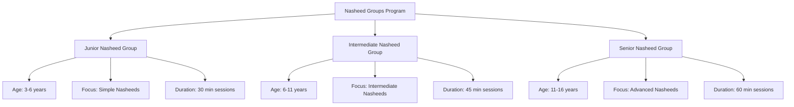
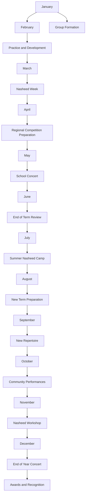

# Nasheed Groups Program

**Document Title:** Nasheed Groups Program
**Document ID:** IS_NGP_007
**Version:** 1.0
**Date:** 2026-01-11
**Project Name:** Smart Academy Digital Web Portal Development
**Content Category:** Islamic Studies Content

---

## Table of Contents

1. [Overview](#1-overview)
2. [Program Objectives](#2-program-objectives)
3. [Program Structure](#3-program-structure)
4. [Activities & Events](#4-activities--events)
5. [Schedule & Timing](#5-schedule--timing)
6. [Participation & Eligibility](#6-participation--eligibility)
7. [Resources & Materials](#7-resources--materials)
8. [Assessment & Recognition](#8-assessment--recognition)
9. [Parent Engagement](#9-parent-engagement)
10. [FAQs](#10-faqs)

---

## 1. Overview

The Nasheed Groups Program at Smart Academy provides students with opportunities to express their love for Islam through beautiful vocal music (Nasheed). This program focuses on age-appropriate Islamic songs that praise Allah, the Prophet Muhammad (peace be upon him), and Islamic values, fostering spiritual connection and artistic expression within Islamic guidelines.

### 1.1 Philosophy

Nasheed (Islamic vocal music) is a beautiful form of praising Allah and expressing Islamic values:

> "And We have certainly given you seven of the often repeated [verses] and the great Quran." - Quran 15:87

The Prophet Muhammad (peace be upon him) appreciated beautiful voices and poetry:

> "The most beautiful voice is the voice of the one who recites the Quran while making it weep." - Sunan an-Nasa'i, Book 8, Hadith 1025

The companions of the Prophet (peace be upon him) would recite poetry and nasheeds to express their love for Islam and to motivate each other in good deeds.

### 1.2 Goals

- **Spiritual Goals**: Strengthen connection with Allah through praise and remembrance
- **Artistic Goals**: Develop vocal skills and musical appreciation within Islamic guidelines
- **Cultural Goals**: Preserve Islamic musical traditions and values
- **Social Goals**: Build teamwork and cooperation through group performance
- **Character Goals**: Develop humility, discipline, and artistic expression

---

## 2. Program Objectives

### 2.1 Knowledge Objectives

By the end of the program, students will be able to:

- Understand the importance and guidelines of Nasheed in Islam
- Learn about famous Nasheed artists and their contributions
- Understand the meaning and themes of Nasheeds they perform
- Recognize the difference between permissible and impermissible music
- Learn about the history of Islamic vocal music
- Understand the role of Nasheed in Islamic culture and Da'wah

### 2.2 Skill Objectives

Students will demonstrate proficiency in:

- Singing Nasheeds with proper pitch and rhythm
- Performing in groups with harmony and coordination
- Memorizing Nasheed lyrics and meanings
- Expressing emotions appropriately through vocal performance
- Leading Nasheed performances
- Creating original Nasheeds (advanced levels)

### 2.3 Character Objectives

Students will develop:

- **Ikhlas (Sincerity)**: Performing Nasheeds for Allah's pleasure
- **Tawadu (Humility)**: Remaining humble in performance
- **Adab (Respect)**: Showing respect for Islamic guidelines in performance
- **Sabr (Patience)**: Practicing patiently to improve skills
- **Shukr (Gratitude)**: Appreciating the gift of voice and music
- **Ukhuwah (Brotherhood/Sisterhood)**: Working cooperatively in groups
- **Taqwa (God-consciousness)**: Maintaining Islamic consciousness in performance

### 2.4 Re-STEAM Integration

- **Science Connection**: Understanding the science of sound and voice
- **Technology Connection**: Using recording technology and audio equipment
- **Mathematics Connection**: Understanding rhythm, patterns, and musical structure
- **Arts Connection**: Expressing Islamic values through vocal artistry
- **Engineering Connection**: Understanding acoustics and sound engineering

---

## 3. Program Structure

### 3.1 Nasheed Groups Overview

The program includes three main groups based on age and skill level:

### 3.2 Group Descriptions

#### Junior Nasheed Group (3-6 years)

- **Focus**: Simple, repetitive Nasheeds with easy lyrics
- **Repertoire**: Short Nasheeds about Allah, Prophet, and basic Islamic values
- **Activities**: Singing, movement, basic rhythm
- **Performance**: School assemblies and special events
- **Duration**: 30-minute sessions, twice weekly
- **Leadership**: Teacher-led with student helpers

#### Intermediate Nasheed Group (6-11 years)

- **Focus**: Intermediate Nasheeds with more complex lyrics and melodies
- **Repertoire**: Nasheeds about Islamic history, character, and values
- **Activities**: Singing, harmony, basic choreography
- **Performance**: School events, community programs, competitions
- **Duration**: 45-minute sessions, twice weekly
- **Leadership**: Student leaders with teacher guidance

#### Senior Nasheed Group (11-16 years)

- **Focus**: Advanced Nasheeds with complex harmonies and arrangements
- **Repertoire**: Classical and contemporary Islamic Nasheeds
- **Activities**: Singing, harmony, choreography, composition
- **Performance**: School events, community programs, competitions, recordings
- **Duration**: 60-minute sessions, twice weekly
- **Leadership**: Student-led with teacher supervision

### 3.3 Nasheed Curriculum

#### Junior Curriculum (3-6 years)

| Theme | Nasheed Examples | Focus | Duration |
|-------|------------------|-------|----------|
| **Praise of Allah** | "Alhamdulillah", "Subhanallah" | Simple praise | 4 weeks |
| **Prophet's Love** | "Ya Rasulallah", "Muhammad" | Love for Prophet | 4 weeks |
| **Islamic Values** | "Be Kind", "Share with Others" | Basic values | 4 weeks |
| **Daily Du'a** | "Morning Du'a", "Bedtime Du'a" | Du'a through Nasheed | 4 weeks |
| **Islamic Events** | "Eid Mubarak", "Ramadan is Here" | Celebrations | 4 weeks |

#### Intermediate Curriculum (6-11 years)

| Theme | Nasheed Examples | Focus | Duration |
|-------|------------------|-------|----------|
| **Tawhid** | "La ilaha illallah", "Allahu Akbar" | Oneness of Allah | 4 weeks |
| **Seerah** | "The Prophet's Journey", "Madinah" | Prophet's life | 4 weeks |
| **Character** | "Patience", "Gratitude", "Honesty" | Islamic character | 4 weeks |
| **Islamic History** | "The Companions", "Islamic Heroes" | Historical figures | 4 weeks |
| **Da'wah** | "Spread the Light", "Message of Peace" | Islamic message | 4 weeks |

#### Senior Curriculum (11-16 years)

| Theme | Nasheed Examples | Focus | Duration |
|-------|------------------|-------|----------|
| **Deep Spirituality** | "The Light of Faith", "Seeking Allah" | Spiritual depth | 4 weeks |
| **Islamic Civilization** | "Golden Age", "Muslim Scholars" | Islamic heritage | 4 weeks |
| **Contemporary Issues** | "Stand for Truth", "Be the Change" | Modern relevance | 4 weeks |
| **Advanced Seerah** | "The Prophet's Wisdom", "Mercy to Worlds" | Prophetic teachings | 4 weeks |
| **Composition** | Student-created Nasheeds | Creativity | 4 weeks |

### 3.4 Group Leadership Structure

Each group has the following leadership structure:

| Position | Responsibilities | Eligibility |
|----------|------------------|-------------|
| **Group Leader** | Lead rehearsals, coordinate performances | Senior students with leadership experience |
| **Assistant Leader** | Assist leader, lead in leader's absence | Intermediate/Senior students |
| **Section Leader** | Lead vocal sections (soprano, alto, etc.) | Students with strong vocal skills |
| **Choreographer** | Plan and teach movements/choreography | Students with dance/movement skills |
| **Librarian** | Maintain Nasheed repertoire and materials | Organized students |
| **Member** | Participate in rehearsals and performances | All group members |

---

## 4. Activities & Events

### 4.1 Regular Activities

#### Rehearsals

- **Vocal Warm-up**: Breathing and vocal exercises
- **Repertoire Practice**: Learning and practicing Nasheeds
- **Harmony Practice**: Working on group harmony
- **Performance Practice**: Preparing for performances
- **Review Sessions**: Reviewing previously learned Nasheeds

#### Training Sessions

- **Vocal Technique**: Training on proper singing technique
- **Breathing Exercises**: Exercises for breath control
- **Pitch Training**: Training on pitch accuracy
- **Rhythm Training**: Training on rhythm and timing
- **Expression Training**: Training on emotional expression

#### Creative Activities

- **Nasheed Composition**: Creating original Nasheeds (advanced)
- **Arrangement**: Arranging Nasheeds for group performance
- **Choreography**: Creating movements for performances
- **Recording**: Recording performances for evaluation
- **Video Production**: Creating music videos (advanced)

### 4.2 Performance Activities

#### School Performances

- **Morning Assemblies**: Regular Nasheed performances
- **Islamic Events**: Performances for Islamic events
- **Special Assemblies**: Performances for special occasions
- **Awards Ceremonies**: Performances at awards events
- **Graduation**: Performances at graduation ceremonies

#### Community Performances

- **Mosque Events**: Performances at local mosques
- **Community Gatherings**: Performances at community events
- **Charity Events**: Performances at charity functions
- **Inter-School Events**: Performances at other schools
- **Public Events**: Performances at public Islamic events

#### Competitions

- **School Nasheed Competition**: Internal competition
- **Regional Nasheed Competition**: Regional-level competition
- **National Nasheed Competition**: National-level competition
- **Online Nasheed Competition**: Virtual competitions
- **International Nasheed Competition**: International opportunities

### 4.3 Special Events

#### Nasheed Week

- **Theme**: "Voices of Praise: Celebrating Islamic Music"
- **Activities**: Special performances, workshops, competitions
- **Guest Artists**: Visiting Nasheed artists
- **Nasheed Fair**: Display of Nasheed projects
- **Family Nasheed Night**: Evening program with families

#### Nasheed Concert

- **Scale**: Major school-wide concert
- **Performances**: All groups perform
- **Guest Artists**: Professional Nasheed artists
- **Audience**: Parents, community members
- **Recording**: Professional recording of concert

#### Nasheed Workshop

- **Purpose**: Intensive training on Nasheed performance
- **Duration**: 2-3 days during school holidays
- **Facilitators**: Professional Nasheed artists
- **Activities**: Training, practice, performance
- **Age Groups**: Separate sessions for different levels

### 4.4 Recording and Production

#### Studio Recording

- **Recording Sessions**: Professional recording of Nasheeds
- **Production**: Professional production of recordings
- **Album Creation**: Creating Nasheed albums
- **Distribution**: Sharing recordings with community
- **Online Presence**: Uploading recordings to online platforms

#### Video Production

- **Music Videos**: Creating music videos for Nasheeds
- **Live Recordings**: Recording live performances
- **Documentation**: Documenting Nasheed activities
- **Social Media**: Sharing videos on social media
- **YouTube Channel**: Maintaining school Nasheed channel

---

## 5. Schedule & Timing

### 5.1 Weekly Schedule

| Day | Group | Time | Duration | Location |
|-----|-------|------|----------|----------|
| Monday | Junior Group | 2:00 PM | 30 min | Music Room |
| Monday | Intermediate Group | 2:30 PM | 45 min | Music Room |
| Tuesday | Senior Group | 2:00 PM | 60 min | Music Room |
| Wednesday | Junior Group | 2:00 PM | 30 min | Music Room |
| Wednesday | Intermediate Group | 2:30 PM | 45 min | Music Room |
| Thursday | Senior Group | 2:00 PM | 60 min | Music Room |
| Friday | All Groups | 1:30 PM | 60 min | Assembly Hall |

### 5.2 Monthly Schedule

| Week | Focus | Activities |
|------|-------|------------|
| Week 1 | Learning New Nasheeds | Introduction and learning of new repertoire |
| Week 2 | Practice and Refinement | Practice and refinement of Nasheeds |
| Week 3 | Performance Preparation | Preparation for performances |
| Week 4 | Performance and Review | Performances and review of progress |

### 5.3 Annual Schedule

### 5.4 Rehearsal Structure

#### Standard Rehearsal (30-60 minutes depending on group)

| Time | Activity | Duration | Description |
|------|----------|----------|-------------|
| Start | Opening Du'a | 2 min | Begin with Du'a |
| Warm-up | Vocal Warm-up | 5-10 min | Breathing and vocal exercises |
| Review | Previous Nasheeds | 5-10 min | Review previously learned material |
| Learning | New Nasheed | 10-20 min | Learn new Nasheed |
| Practice | Group Practice | 5-15 min | Practice as a group |
| Performance | Performance Practice | 5-10 min | Practice for performance |
| Closing | Closing Du'a | 2 min | End with Du'a |

---

## 6. Participation & Eligibility

### 6.1 Membership Eligibility

#### General Requirements

- **Enrollment**: Must be enrolled student at Smart Academy
- **Interest**: Genuine interest in Nasheed and vocal performance
- **Commitment**: Willingness to attend rehearsals regularly
- **Character**: Good character and behavior record
- **Parental Consent**: Parental approval for participation

#### Group-Specific Requirements

| Group | Age Range | Prerequisites |
|-------|-----------|---------------|
| Junior Group | 3-6 years | Interest in singing |
| Intermediate Group | 6-11 years | Basic singing ability |
| Senior Group | 11-16 years | Strong singing ability and commitment |

### 6.2 Leadership Eligibility

#### Group Leader Requirements

- **Age**: Senior student (11-16 years)
- **Experience**: Previous Nasheed group membership
- **Skill**: Strong vocal and leadership skills
- **Character**: Excellent character and behavior
- **Commitment**: Willingness to dedicate extra time

#### Other Leadership Positions

- **Assistant Leader**: Intermediate/Senior students with leadership potential
- **Section Leader**: Students with strong vocal skills
- **Choreographer**: Students with movement/dance skills
- **Librarian**: Organized students with attention to detail

### 6.3 Participation Levels

#### Active Participation

- **Attendance**: Regular attendance at rehearsals (minimum 80%)
- **Engagement**: Active participation in all activities
- **Performance**: Participation in performances
- **Commitment**: Commitment to group goals

#### Associate Participation

- **Attendance**: Occasional attendance at rehearsals
- **Engagement**: Participation in selected activities
- **Performance**: Participation in selected performances
- **Support**: Support for group activities

### 6.4 Special Considerations

#### Voice Development

- **Age-Appropriate**: Activities appropriate for age and voice development
- **Vocal Health**: Emphasis on vocal health and proper technique
- **Voice Changes**: Accommodations for voice changes during puberty
- **Individual Differences**: Recognition of individual voice differences

#### Special Needs Accommodations

- **Modified Activities**: Adjusted activities as needed
- **Support Personnel**: Additional support as required
- **Accessibility**: Ensure activities are accessible
- **Inclusion**: Full inclusion in all activities

---

## 7. Resources & Materials

### 7.1 Educational Resources

#### Student Materials

- **Nasheed Lyrics**: Printed lyrics for all Nasheeds
- **Practice Recordings**: Audio recordings for practice
- **Nasheed Books**: Books about Nasheed and Islamic music
- **Vocal Exercise Sheets**: Sheets for vocal exercises
- **Performance Notes**: Notes for performances

#### Teacher Resources

- **Nasheed Curriculum**: Detailed curriculum for each group
- **Teaching Guides**: Instructions for teaching Nasheeds
- **Assessment Tools**: Rubrics for evaluating performance
- **Repertoire Lists**: Lists of approved Nasheeds
- **Parent Communication Templates**: Letters and information sheets

### 7.2 Physical Resources

#### Performance Facilities

- **Music Room**: Dedicated room for rehearsals
- **Performance Hall**: Large hall for performances
- **Practice Rooms**: Separate rooms for individual practice
- **Recording Studio**: Basic recording equipment
- **Storage Area**: Storage for materials and equipment

#### Performance Equipment

- **Microphones**: Microphones for performances
- **Sound System**: Sound system for performances
- **Speakers**: Speakers for rehearsals and performances
- **Music Stands**: Stands for lyrics and music
- **Audio Equipment**: Recording and playback equipment

### 7.3 Digital Resources

#### Nasheed Applications

- **Nasheed Apps**: Apps for learning and practicing Nasheeds
- **Recording Apps**: Apps for recording performances
- **Music Apps**: Apps for music learning and theory
- **Video Apps**: Apps for video recording and editing
- **Social Media**: Platforms for sharing performances

#### Online Resources

- **Nasheed Portal**: School website section with Nasheed resources
- **Parent Portal**: Access to Nasheed schedules and progress
- **Virtual Rehearsals**: Online rehearsal opportunities
- **Islamic Content Library**: Digital library of Nasheed resources

### 7.4 Community Resources

#### Nasheed Artists

- **Guest Artists**: Professional Nasheed artists for workshops
- **Mentors**: Mentors for student development
- **Performers**: Performers for special events
- **Advisors**: Advisors for program development

#### Community Partners

- **Mosques**: Partnership with local mosques for performances
- **Islamic Centers**: Collaboration with Islamic centers
- **Recording Studios**: Partnership with recording studios
- **Media Outlets**: Partnerships for media coverage

---

## 8. Assessment & Recognition

### 8.1 Assessment Methods

#### Performance Assessment

- **Vocal Quality**: Assessment of vocal technique and quality
- **Pitch Accuracy**: Accuracy of pitch in performance
- **Rhythm and Timing**: Accuracy of rhythm and timing
- **Expression**: Emotional expression in performance
- **Group Coordination**: Coordination and harmony in group performance

#### Participation Assessment

- **Attendance**: Record of rehearsal attendance
- **Engagement**: Level of engagement in activities
- **Progress**: Improvement over time
- **Commitment**: Commitment to group goals
- **Teamwork**: Ability to work cooperatively

#### Skill Assessment

- **Memorization**: Ability to memorize lyrics
- **Technique**: Proper vocal technique
- **Performance Quality**: Quality of performances
- **Leadership**: Leadership abilities (for leaders)
- **Creativity**: Creativity in performance (advanced)

### 8.2 Recognition System

#### Regular Recognition

- **Singer of the Month**: Outstanding performance for the month
- **Most Improved**: Greatest improvement in performance
- **Best Harmony**: Best harmony in group performance
- **Best Expression**: Best emotional expression
- **Perfect Attendance**: Perfect attendance at rehearsals

#### Annual Recognition

- **Nasheed Excellence Award**: Outstanding overall performance
- **Best Vocalist**: Best individual vocalist
- **Best Group Performance**: Best group performance
- **Leadership Award**: Outstanding leadership in group
- **Most Dedicated**: Most dedicated group member

#### Special Recognition

- **Best Original Nasheed**: Best original composition (advanced)
- **Best Performance**: Best performance of the year
- **Community Impact Award**: Impact on community through performances
- **Innovation Award**: Innovation in Nasheed performance

### 8.3 Awards and Certificates

| Award | Criteria | Recognition |
|-------|----------|-------------|
| Singer of the Month | Outstanding monthly performance | Certificate, badge |
| Most Improved | Greatest improvement | Certificate, recognition |
| Best Harmony | Best group harmony | Certificate, group award |
| Best Expression | Best emotional expression | Certificate, recognition |
| Perfect Attendance | Perfect attendance | Certificate, special recognition |
| Nasheed Excellence | Outstanding overall performance | Certificate, trophy |
| Best Vocalist | Best individual vocalist | Certificate, medal |
| Best Group Performance | Best group performance | Trophy, group recognition |
| Leadership Award | Outstanding leadership | Certificate, special role |
| Most Dedicated | Most dedicated member | Certificate, special recognition |

---

## 9. Parent Engagement

### 9.1 Communication Channels

#### Regular Updates

- **Nasheed Newsletters**: Monthly Nasheed program newsletters
- **Performance Notifications**: Information about upcoming performances
- **Progress Reports**: Student progress in Nasheed program
- **Event Updates**: Information about special events

#### Digital Communication

- **Parent Portal**: Online access to Nasheed information
- **SMS/WhatsApp Updates**: Nasheed reminders and notices
- **Email Updates**: Regular email communications
- **School Website**: Nasheed program information and resources

### 9.2 Parent Workshops

#### Nasheed Education Workshop

- **Understanding Nasheed**: Overview of Nasheed in Islam
- **Supporting Your Child**: How to support child's Nasheed participation
- **Benefits of Nasheed**: Benefits of Nasheed participation
- **Q&A Session**: Opportunity for parent questions

#### Vocal Health Workshop

- **Vocal Development**: Understanding vocal development in children
- **Vocal Health**: Maintaining vocal health
- **Practice Support**: How to support home practice
- **Q&A Session**: Opportunity for parent questions

### 9.3 Family Involvement

#### Home Practice Support

- **Practice Guidelines**: Guidelines for home practice
- **Listening Sessions**: Listening to child's practice
- **Encouragement**: Providing positive encouragement
- **Performance Attendance**: Attending child's performances

#### Special Family Events

- **Family Nasheed Night**: Evening program with families
- **Concert Attendance**: Families attend concerts
- **Awards Ceremony**: Families attend recognition events
- **Community Performances**: Families attend community events

### 9.4 Volunteer Opportunities

#### Nasheed Support

- **Parent Volunteers**: Assist with Nasheed activities
- **Event Support**: Help organize performances and events
- **Costume Support**: Help with costumes and props
- **Transportation**: Provide transportation for activities

#### Resource Contribution

- **Equipment Donations**: Donate equipment for Nasheed program
- **Material Donations**: Donate materials for activities
- **Expertise Sharing**: Parents share expertise
- **Financial Support**: Support Nasheed program financially

### 9.5 Parent Feedback

#### Feedback Channels

- **Parent Surveys**: Annual survey on Nasheed program effectiveness
- **Parent-Teacher Meetings**: Discuss student progress
- **Suggestion Box**: Anonymous feedback and suggestions
- **Focus Groups**: Regular parent input sessions

#### Continuous Improvement

- **Program Review**: Annual review based on parent feedback
- **Adjustment Implementation**: Changes based on suggestions
- **Success Stories**: Share positive experiences with community
- **Challenge Addressing**: Resolve concerns and difficulties

---

## 10. FAQs

### 10.1 General Questions

**Q: What is Nasheed?**

A: Nasheed is Islamic vocal music that praises Allah, the Prophet Muhammad (peace be upon him), and Islamic values. It is performed without musical instruments, using only the human voice, and follows Islamic guidelines.

**Q: Why is Nasheed important in Islamic education?**

A: Nasheed provides a beautiful way to express love for Islam, strengthen spiritual connection, develop artistic skills within Islamic guidelines, and preserve Islamic musical traditions.

**Q: What are the Islamic guidelines for Nasheed?**

A: Nasheed must be free from impermissible content, avoid musical instruments, use appropriate lyrics that praise Allah and Islamic values, and maintain modesty in performance.

### 10.2 Program-Specific Questions

**Q: What Nasheed groups are available?**

A: We offer three Nasheed groups: Junior Group (3-6 years), Intermediate Group (6-11 years), and Senior Group (11-16 years). Each group focuses on age-appropriate Nasheeds and skills.

**Q: What do students do in Nasheed groups?**

A: Students learn and practice Nasheeds, develop vocal skills, prepare for performances, participate in competitions, and engage in creative activities like composition and choreography.

**Q: How often do Nasheed groups meet?**

A: Groups meet twice weekly for 30-60 minutes depending on the group level. There are also special events, workshops, and performances throughout the year.

### 10.3 Participation Questions

**Q: Who can join Nasheed groups?**

A: All enrolled students who meet the age requirements for their chosen group and demonstrate good character and behavior are eligible to join. Parental consent is required for participation.

**Q: How do students join Nasheed groups?**

A: Students express interest, meet with the Nasheed teacher, obtain parental consent, and attend an orientation session before becoming active members.

**Q: Can students be leaders in Nasheed groups?**

A: Yes, students can serve in various leadership positions including Group Leader, Assistant Leader, Section Leader, Choreographer, and Librarian. Leadership positions have specific eligibility requirements.

### 10.4 Performance Questions

**Q: What performance opportunities are available?**

A: Students perform at school assemblies, Islamic events, community gatherings, competitions, concerts, and special events throughout the year.

**Q: Are there competitions for Nasheed groups?**

A: Yes, students participate in school, regional, national, and international Nasheed competitions. These provide opportunities to showcase talent and learn from others.

**Q: How are performances evaluated?**

A: Performances are evaluated based on vocal quality, pitch accuracy, rhythm and timing, expression, and group coordination using specific rubrics for each category.

### 10.5 Parent Involvement Questions

**Q: How can I support my child's Nasheed participation?**

A: Parents can support by encouraging practice, attending performances, providing positive feedback, helping with home practice, and volunteering to help with Nasheed activities.

**Q: Can parents attend Nasheed performances?**

A: Yes, parents are welcome to attend all Nasheed performances including school assemblies, concerts, competitions, and special events. Regular rehearsals are for students only.

**Q: How will I know about my child's Nasheed progress?**

A: We provide regular updates through newsletters, parent portal, SMS/WhatsApp updates, and email communications. Parents can also attend performances and meetings with the Nasheed teacher.

### 10.6 Special Situations Questions

**Q: What if a child has vocal difficulties?**

A: We work with students to develop their vocal abilities appropriately. If there are medical concerns, we recommend consultation with a healthcare provider and make accommodations as needed.

**Q: Are accommodations made for students with special needs?**

A: Yes, accommodations are made for students with special needs including modified activities, support personnel, accessibility considerations, and full inclusion in all activities.

**Q: What if a child wants to change Nasheed groups?**

A: Students may request to change groups based on age and skill development. The request is reviewed by the Nasheed teacher to ensure appropriate placement.

---

## Document Approval

| Role | Name | Signature | Date |
|------|------|-----------|------|
| Islamic Studies Coordinator | | _________________ | ________ |
| Principal | | _________________ | ________ |
