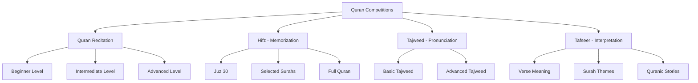
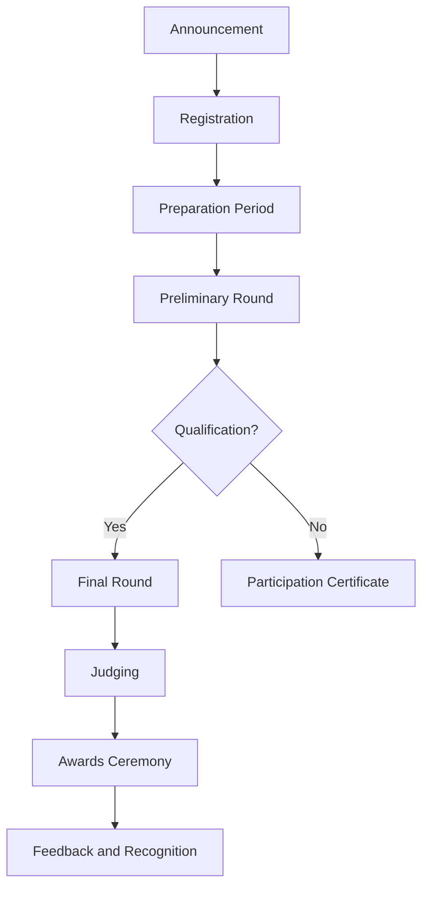
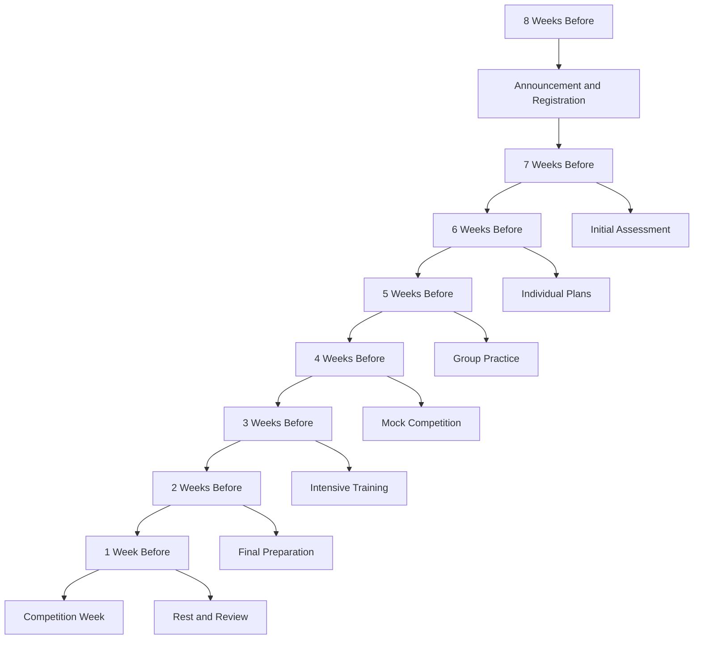

# Quran Competitions Program

**Document Title:** Quran Competitions Program
**Document ID:** IS_QCP_005
**Version:** 1.0
**Date:** 2026-01-11
**Project Name:** Smart Academy Digital Web Portal Development
**Content Category:** Islamic Studies Content

---

## Table of Contents

1. [Overview](#1-overview)
2. [Program Objectives](#2-program-objectives)
3. [Program Structure](#3-program-structure)
4. [Activities & Events](#4-activities--events)
5. [Schedule & Timing](#5-schedule--timing)
6. [Participation & Eligibility](#6-participation--eligibility)
7. [Resources & Materials](#7-resources--materials)
8. [Assessment & Recognition](#8-assessment--recognition)
9. [Parent Engagement](#9-parent-engagement)
10. [FAQs](#10-faqs)

---

## 1. Overview

The Quran Competitions Program at Smart Academy motivates and celebrates students' engagement with the Holy Quran through structured competitions in recitation, memorization (Hifz), Tajweed (pronunciation rules), and Tafseer (Quranic interpretation). This program encourages students to develop a lifelong relationship with the Quran while recognizing excellence and fostering healthy competition.

### 1.1 Philosophy

The Quran is the central source of guidance in Islam:

> "Indeed, this Quran guides to that which is most suitable and gives good tidings to the believers who do righteous deeds." - Quran 17:9

The Prophet Muhammad (peace be upon him) said:

> "The best among you are those who learn the Quran and teach it." - Sahih Bukhari, Book 61, Hadith 545

And he said:

> "The one who is proficient in the Quran is with the noble, righteous scribes; and the one who recites the Quran and stumbles over it, finding it difficult, will have a double reward." - Sahih Muslim, Book 1, Hadith 795

### 1.2 Goals

- **Engagement Goals**: Motivate students to engage deeply with the Quran
- **Excellence Goals**: Encourage excellence in Quranic recitation and memorization
- **Recognition Goals**: Celebrate and reward Quranic achievements
- **Motivation Goals**: Inspire continuous Quranic learning and practice
- **Community Goals**: Foster a Quran-centered school culture

---

## 2. Program Objectives

### 2.1 Knowledge Objectives

By the end of the program, students will be able to:

- Understand the importance and virtues of the Quran
- Identify the structure and organization of the Quran
- Recognize the themes and messages of various Surahs
- Understand basic Tafseer (interpretation) of Quranic verses
- Learn about the history and preservation of the Quran
- Understand the rules of Tajweed (Quranic pronunciation)

### 2.2 Skill Objectives

Students will demonstrate proficiency in:

- Reciting the Quran with proper Tajweed
- Memorizing portions of the Quran (Hifz)
- Understanding the meaning of recited verses
- Applying Tajweed rules correctly
- Reciting with proper rhythm and melody (Tarteel)
- Leading prayers with Quranic recitation

### 2.3 Character Objectives

Students will develop:

- **Ikhlas (Sincerity)**: Reciting and memorizing for Allah's pleasure
- **Taqwa (God-consciousness)**: Increasing awareness of Allah through Quran
- **Sabr (Patience)**: Persevering in memorization and practice
- **Adab (Respect)**: Showing proper respect for the Quran
- **Tawadu (Humility)**: Remaining humble in Quranic achievements
- **Shukr (Gratitude)**: Appreciating the gift of the Quran
- **Diligence**: Consistent effort in Quranic study

### 2.4 Re-STEAM Integration

- **Science Connection**: Understanding the preservation and scientific miracles in the Quran
- **Technology Connection**: Using digital Quran apps and recording technology
- **Mathematics Connection**: Understanding the numerical patterns and structure of the Quran
- **Arts Connection**: Appreciating the beauty of Quranic recitation and calligraphy
- **Engineering Connection**: Understanding the historical preservation methods of the Quran

---

## 3. Program Structure

### 3.1 Competition Categories

The Quran Competitions Program includes four main categories:

### 3.2 Competition Structure by Age Group

#### Early Childhood (3-6 years)

| Competition Category | Level | Requirements | Duration |
|---------------------|-------|--------------|----------|
| Quran Recitation | Beginner | Surah Al-Fatiha + 3 short Surahs | 3-5 minutes |
| Hifz | Beginner | Surah Al-Fatiha + 5 short Surahs | 3-5 minutes |
| Tajweed | Beginner | Basic pronunciation | 3-5 minutes |
| Tafseer | Not Applicable | - | - |

#### Primary Level (6-11 years)

| Competition Category | Level | Requirements | Duration |
|---------------------|-------|--------------|----------|
| Quran Recitation | Beginner | Juz 30 (last Juz) | 5-10 minutes |
| Quran Recitation | Intermediate | Selected Surahs from Juz 29-30 | 8-12 minutes |
| Hifz | Beginner | Last 10 Surahs | 5-10 minutes |
| Hifz | Intermediate | Juz 30 | 8-12 minutes |
| Tajweed | Basic | Basic Tajweed rules | 5-10 minutes |
| Tajweed | Advanced | Full Tajweed application | 8-12 minutes |
| Tafseer | Beginner | Meaning of memorized Surahs | 5-8 minutes |

#### Secondary Level (11-16 years)

| Competition Category | Level | Requirements | Duration |
|---------------------|-------|--------------|----------|
| Quran Recitation | Intermediate | Selected Surahs from Juz 28-30 | 10-15 minutes |
| Quran Recitation | Advanced | Selected Surahs from various Juz | 12-20 minutes |
| Hifz | Intermediate | 1-5 Juz | 10-20 minutes |
| Hifz | Advanced | 5+ Juz or Full Quran | 15-30 minutes |
| Tajweed | Advanced | Full Tajweed mastery | 10-15 minutes |
| Tafseer | Intermediate | Tafseer of selected Surahs | 8-12 minutes |
| Tafseer | Advanced | Thematic Tafseer | 12-15 minutes |

### 3.3 Competition Levels

#### School-Level Competitions

- **Participation**: All eligible students may participate
- **Frequency**: Once per term (3 times per year)
- **Categories**: All competition categories
- **Awards**: Certificates, medals, and prizes

#### Regional Competitions

- **Selection**: Top performers from school competitions
- **Frequency**: Once per year
- **Categories**: Selected categories based on regional requirements
- **Awards**: Trophies, certificates, and recognition

#### National Competitions

- **Selection**: Exceptional performers from regional competitions
- **Frequency**: As opportunities arise
- **Categories**: Based on national competition requirements
- **Awards**: National recognition, trophies, and prizes

### 3.4 Competition Timeline

---

## 4. Activities & Events

### 4.1 Competition Preparation Activities

#### Quran Recitation Preparation

- **Daily Practice**: Structured daily recitation practice
- **Tajweed Workshops**: Special workshops on pronunciation rules
- **Mock Competitions**: Practice competitions to build confidence
- **Peer Review**: Students review each other's recitation
- **Teacher Feedback**: Individual feedback and guidance

#### Hifz Preparation

- **Memorization Schedule**: Structured memorization plans
- **Review Sessions**: Regular review of memorized portions
- **Hifz Partners**: Peer partners for mutual review
- **Progress Tracking**: Monitoring memorization progress
- **Revision Techniques**: Teaching effective revision methods

#### Tajweed Preparation

- **Rule Study**: Detailed study of Tajweed rules
- **Practice Exercises**: Specific exercises for each rule
- **Recording Practice**: Recording and reviewing recitation
- **Expert Feedback**: Feedback from Tajweed experts
- **Correction Sessions**: Focused correction of mistakes

#### Tafseer Preparation

- **Verse Study**: Detailed study of Quranic verses
- **Tafseer Reading**: Reading authentic Tafseer sources
- **Understanding Tests**: Testing comprehension of meanings
- **Presentation Practice**: Practice presenting Tafseer
- **Discussion Groups**: Group discussions on Quranic meanings

### 4.2 Competition Events

#### Quran Recitation Competition

- **Format**: Individual recitation before judges
- **Judging Criteria**: Tajweed, melody, confidence, accuracy
- **Categories**: Beginner, Intermediate, Advanced
- **Age Groups**: Separate competitions for each age level
- **Duration**: 3-20 minutes depending on level

#### Hifz Competition

- **Format**: Recitation from memory before judges
- **Judging Criteria**: Accuracy, confidence, Tajweed, completion
- **Categories**: Beginner, Intermediate, Advanced
- **Age Groups**: Separate competitions for each age level
- **Duration**: 5-30 minutes depending on level

#### Tajweed Competition

- **Format**: Recitation focusing on Tajweed rules
- **Judging Criteria**: Rule application, accuracy, consistency
- **Categories**: Basic, Advanced
- **Age Groups**: Separate competitions for each age level
- **Duration**: 5-15 minutes depending on level

#### Tafseer Competition

- **Format**: Presentation of Quranic interpretation
- **Judging Criteria**: Understanding, clarity, depth, presentation
- **Categories**: Beginner, Intermediate, Advanced
- **Age Groups**: Separate competitions for each age level
- **Duration**: 5-15 minutes depending on level

### 4.3 Special Events

#### Quran Week

- **Theme**: "The Quran: Our Guide to Success"
- **Activities**: Special assemblies, competitions, workshops
- **Guest Speakers**: Islamic scholars and Quran reciters
- **Quran Exhibitions**: Display of Quranic projects
- **Parent Involvement**: Parents invited to attend

#### Annual Quran Competition

- **Scale**: Major school-wide competition
- **Categories**: All four competition categories
- **Judges**: External Islamic scholars and reciters
- **Prizes**: Significant prizes and recognition
- **Community Event**: Open to parents and community

#### Quran Completion Celebration

- **Purpose**: Celebrate students who complete Hifz
- **Event**: Special ceremony with Quran recitation
- **Recognition**: Certificates and awards for Huffaz
- **Guest of Honor**: Local Islamic scholar
- **Family Participation**: Families of Huffaz invited

### 4.4 Training and Development

#### Quran Recitation Training

- **Individual Coaching**: One-on-one recitation coaching
- **Group Sessions**: Group recitation practice
- **Expert Workshops**: Workshops with expert reciters
- **Recording Analysis**: Analysis of recorded recitation
- **Performance Training**: Training for competition performance

#### Hifz Training

- **Hifz Program**: Structured Hifz program for competitors
- **Review Techniques**: Teaching effective review methods
- **Memorization Strategies**: Strategies for effective memorization
- **Progress Monitoring**: Regular progress assessments
- **Mental Preparation**: Mental preparation for competitions

#### Tajweed Training

- **Rule Mastery**: Detailed study of Tajweed rules
- **Practical Application**: Applying rules in recitation
- **Correction Sessions**: Focused correction of mistakes
- **Expert Guidance**: Guidance from Tajweed experts
- **Continuous Improvement**: Ongoing improvement plans

---

## 5. Schedule & Timing

### 5.1 Annual Competition Schedule

| Competition | Month | Duration | Categories |
|-------------|-------|----------|------------|
| **Term 1 Competition** | March | 1 week | All categories |
| **Term 2 Competition** | July | 1 week | All categories |
| **Term 3 Competition** | November | 1 week | All categories |
| **Annual Quran Competition** | December | 2 days | All categories |
| **Regional Competition** | February | 2 days | Selected categories |
| **National Competition** | As scheduled | 2-3 days | Selected categories |

### 5.2 Competition Week Schedule

#### Day 1: Registration and Orientation

| Time | Activity | Duration | Description |
|------|----------|----------|-------------|
| 8:00 AM | Registration | 1 hour | Student registration |
| 9:00 AM | Orientation | 1 hour | Competition rules and guidelines |
| 10:00 AM | Practice Session | 2 hours | Final practice before competition |
| 12:00 PM | Dhuhr Prayer | 20 min | Congregational prayer |
| 12:20 PM | Lunch Break | 40 min | Lunch and rest |
| 1:00 PM | Quran Recitation - Preliminary | 2 hours | Preliminary round - Recitation |
| 3:00 PM | Dismissal | - | End of day |

#### Day 2: Preliminary Rounds

| Time | Activity | Duration | Description |
|------|----------|----------|-------------|
| 8:00 AM | Hifz - Preliminary | 2 hours | Preliminary round - Hifz |
| 10:00 AM | Break | 20 min | Short break |
| 10:20 AM | Tajweed - Preliminary | 2 hours | Preliminary round - Tajweed |
| 12:20 PM | Dhuhr Prayer | 20 min | Congregational prayer |
| 12:40 PM | Lunch Break | 40 min | Lunch and rest |
| 1:20 PM | Tafseer - Preliminary | 2 hours | Preliminary round - Tafseer |
| 3:20 PM | Results Announcement | 30 min | Preliminary results |
| 4:00 PM | Dismissal | - | End of day |

#### Day 3: Final Rounds and Awards

| Time | Activity | Duration | Description |
|------|----------|----------|-------------|
| 8:00 AM | Quran Recitation - Final | 2 hours | Final round - Recitation |
| 10:00 AM | Break | 20 min | Short break |
| 10:20 AM | Hifz - Final | 2 hours | Final round - Hifz |
| 12:20 PM | Dhuhr Prayer | 20 min | Congregational prayer |
| 12:40 PM | Lunch Break | 40 min | Lunch and rest |
| 1:20 PM | Tajweed - Final | 1 hour | Final round - Tajweed |
| 2:20 PM | Tafseer - Final | 1 hour | Final round - Tafseer |
| 3:20 PM | Awards Ceremony | 1 hour | Awards and recognition |
| 4:20 PM | Closing Du'a | 10 min | Conclusion |
| 4:30 PM | Dismissal | - | End of competition |

### 5.3 Preparation Timeline

### 5.4 Daily Preparation Schedule

| Time | Activity | Duration | Description |
|------|----------|----------|-------------|
| 8:00 AM | Morning Recitation | 15 min | Daily Quran recitation |
| 10:00 AM | Hifz Practice | 20 min | Memorization practice |
| 12:00 PM | Tajweed Review | 10 min | Tajweed rule review |
| 2:00 PM | Tafseer Study | 15 min | Tafseer reading |
| 4:00 PM | Practice Session | 30 min | Competition preparation |
| 6:00 PM | Review and Reflection | 10 min | Daily review |

---

## 6. Participation & Eligibility

### 6.1 Eligibility Requirements

#### General Eligibility

- **Enrollment**: Must be enrolled student at Smart Academy
- **Age**: Must meet age requirements for competition category
- **Islamic Studies**: Must be enrolled in Islamic Studies program
- **Character**: Must demonstrate good character and behavior

#### Category-Specific Eligibility

| Competition Category | Minimum Age | Prerequisites |
|---------------------|-------------|---------------|
| Quran Recitation - Beginner | 3 years | Basic Quran knowledge |
| Quran Recitation - Intermediate | 6 years | Completion of Juz 30 |
| Quran Recitation - Advanced | 11 years | Completion of multiple Juz |
| Hifz - Beginner | 3 years | Basic Quran knowledge |
| Hifz - Intermediate | 6 years | Memorization of last 10 Surahs |
| Hifz - Advanced | 8 years | Memorization of 1+ Juz |
| Tajweed - Basic | 6 years | Basic Tajweed knowledge |
| Tajweed - Advanced | 8 years | Advanced Tajweed knowledge |
| Tafseer - Beginner | 6 years | Basic Arabic understanding |
| Tafseer - Intermediate | 11 years | Intermediate Arabic |
| Tafseer - Advanced | 13 years | Advanced Arabic |

### 6.2 Registration Process

#### Registration Steps

1. **Announcement**: Competition announcement to students and parents
2. **Interest Form**: Students submit interest form
3. **Assessment**: Initial assessment of Quranic level
4. **Category Assignment**: Assignment to appropriate category
4. **Registration**: Official registration with parental consent
5. **Preparation**: Begin preparation with guidance

#### Required Documents

- **Registration Form**: Completed competition registration form
- **Parental Consent**: Parental consent form
- **Quranic Level**: Current Quranic level assessment
- **Medical Information**: Any relevant medical information
- **Photo**: Recent photograph for competition materials

### 6.3 Participation Levels

#### School-Level Participation

- **Eligibility**: All eligible students
- **Requirements**: Meet general and category-specific eligibility
- **Preparation**: Follow school preparation program
- **Benefits**: Recognition, certificates, prizes

#### Regional Participation

- **Eligibility**: Top performers from school competitions
- **Requirements**: Exceptional performance in school competition
- **Preparation**: Intensive preparation program
- **Benefits**: Regional recognition, trophies, advanced training

#### National Participation

- **Eligibility**: Exceptional performers from regional competitions
- **Requirements**: Outstanding performance at regional level
- **Preparation**: Specialized preparation program
- **Benefits**: National recognition, significant prizes, opportunities

### 6.4 Special Considerations

#### Special Needs Accommodations

- **Modified Format**: Adjusted competition format as needed
- **Extended Time**: Additional time for recitation if required
- **Assistive Technology**: Use of assistive technology if needed
- **Support Personnel**: Additional support during competition

#### Medical Considerations

- **Health Conditions**: Accommodations for health conditions
- **Breaks**: Additional breaks during competition
- **Rest Areas**: Quiet areas for rest as needed
- **Medical Support**: First aid and medical support available

#### Religious Considerations

- **Prayer Times**: Accommodations for prayer times
- **Islamic Etiquette**: Maintenance of Islamic etiquette throughout
- **Gender Separation**: Appropriate separation during competitions
- **Modesty Requirements**: Adherence to Islamic dress code

---

## 7. Resources & Materials

### 7.1 Educational Resources

#### Student Materials

- **Quran Copies**: Mushaf (Quran) for practice and competition
- **Tajweed Guides**: Detailed Tajweed rule books
- **Hifz Books**: Books for memorization tracking
- **Tafseer Books**: Authentic Tafseer sources
- **Practice Recordings**: Audio recordings for practice

#### Teacher Resources

- **Competition Guidelines**: Detailed competition rules and criteria
- **Judging Rubrics**: Scoring rubrics for each category
- **Training Materials**: Preparation training materials
- **Assessment Tools**: Tools for assessing student readiness
- **Parent Communication Templates**: Letters and information sheets

### 7.2 Physical Resources

#### Competition Facilities

- **Competition Hall**: Large hall for competitions
- **Practice Rooms**: Separate rooms for practice
- **Waiting Areas**: Comfortable waiting areas for participants
- **Prayer Facilities**: Access to prayer facilities
- **Audio Equipment**: Microphones and sound system

#### Competition Supplies

- **Quran Stands**: Rihal (Quran stands) for recitation
- **Microphones**: Individual microphones for recitation
- **Score Sheets**: Judging score sheets
- **Certificates**: Competition certificates
- **Awards**: Medals, trophies, and prizes

### 7.3 Digital Resources

#### Quran Applications

- **Quran Apps**: Digital Quran with recitation and translation
- **Tajweed Apps**: Apps for learning Tajweed rules
- **Recording Apps**: Apps for recording and reviewing recitation
- **Memorization Apps**: Apps for tracking memorization progress
- **Tafseer Apps**: Digital Tafseer resources

#### Online Resources

- **Competition Portal**: School website section with competition information
- **Parent Portal**: Access to competition schedules and progress
- **Virtual Practice**: Online practice opportunities
- **Islamic Content Library**: Digital library of Quranic resources

### 7.4 Community Resources

#### Islamic Scholars

- **Judges**: Islamic scholars as competition judges
- **Trainers**: Expert Quran reciters for training
- **Speakers**: Guest speakers for special events
- **Advisors**: Advisors for competition development

#### Mosque Partnerships

- **Competition Venues**: Use of mosque facilities for competitions
- **Expert Reciters**: Access to expert reciters
- **Community Events**: Participation in community Quran events
- **Resource Sharing**: Access to additional Quranic materials

---

## 8. Assessment & Recognition

### 8.1 Judging Criteria

#### Quran Recitation Judging

| Criteria | Weight | Description |
|----------|--------|-------------|
| Tajweed | 30% | Application of Tajweed rules |
| Melody/Tarteel | 25% | Proper rhythm and melody |
| Accuracy | 25% | Correct recitation without mistakes |
| Confidence | 10% | Confidence and composure |
| Voice Quality | 10% | Clarity and quality of voice |

#### Hifz Judging

| Criteria | Weight | Description |
|----------|--------|-------------|
| Accuracy | 40% | Correct memorization without mistakes |
| Tajweed | 25% | Application of Tajweed rules |
| Confidence | 20% | Confidence in recitation from memory |
| Completion | 15% | Completion of required portion |

#### Tajweed Judging

| Criteria | Weight | Description |
|----------|--------|-------------|
| Rule Application | 40% | Correct application of Tajweed rules |
| Consistency | 30% | Consistent application throughout |
| Accuracy | 20% | Correct pronunciation |
| Understanding | 10% | Understanding of rules |

#### Tafseer Judging

| Criteria | Weight | Description |
|----------|--------|-------------|
| Understanding | 35% | Depth of understanding |
| Clarity | 25% | Clear presentation of meaning |
| Accuracy | 25% | Accurate interpretation |
| Presentation | 15% | Quality of presentation |

### 8.2 Scoring System

#### Point System

- **Excellent (90-100)**: Outstanding performance with minimal errors
- **Very Good (80-89)**: Very good performance with minor errors
- **Good (70-79)**: Good performance with some errors
- **Satisfactory (60-69)**: Satisfactory performance with notable errors
- **Needs Improvement (below 60)**: Performance requires significant improvement

#### Tie-Breaking

1. **Tajweed Score**: Higher Tajweed score wins
2. **Accuracy Score**: Higher accuracy score wins
3. **Confidence Score**: Higher confidence score wins
4. **Judge Consensus**: Final decision by judges

### 8.3 Recognition System

#### Competition Awards

| Award | Category | Recognition |
|-------|----------|-------------|
| First Place | All categories | Trophy, certificate, prize |
| Second Place | All categories | Medal, certificate, prize |
| Third Place | All categories | Medal, certificate, prize |
| Participation | All participants | Certificate |
| Excellence | Special recognition | Special certificate, prize |

#### Special Recognition

- **Best Reciter**: Best overall recitation across categories
- **Best Hafiz**: Best memorization performance
- **Best Tajweed**: Best Tajweed application
- **Best Tafseer**: Best Tafseer presentation
- **Most Improved**: Greatest improvement from previous competition
- **Youngest Achiever**: Outstanding performance by youngest participant

#### Annual Recognition

- **Quran Champion**: Outstanding overall performance throughout year
- **Hifz Achievement**: Recognition for completing Hifz
- **Consistent Excellence**: Consistent high performance
- **Leadership Award**: Leadership in Quranic activities
- **Community Recognition**: Recognition in community events

### 8.4 Awards and Prizes

| Award Type | Prize | Description |
|------------|-------|-------------|
| First Place | Trophy + Certificate + Prize | Top performer in category |
| Second Place | Medal + Certificate + Prize | Second performer in category |
| Third Place | Medal + Certificate + Prize | Third performer in category |
| Participation | Certificate | All participants |
| Special Recognition | Special Certificate + Prize | Special achievements |
| Annual Award | Special Trophy + Certificate | Year-end recognition |

---

## 9. Parent Engagement

### 9.1 Communication Channels

#### Regular Updates

- **Competition Announcements**: Information about upcoming competitions
- **Progress Reports**: Student progress in preparation
- **Schedule Updates**: Competition schedules and changes
- **Results Notifications**: Competition results and achievements

#### Digital Communication

- **Parent Portal**: Online access to competition information
- **SMS/WhatsApp Updates**: Competition reminders and notices
- **Email Updates**: Regular email communications
- **School Website**: Competition program information and resources

### 9.2 Parent Workshops

#### Quran Competition Workshop

- **Understanding Competitions**: Overview of Quran competitions
- **Supporting Your Child**: How to support child's preparation
- **Competition Benefits**: Benefits of Quran competitions
- **Q&A Session**: Opportunity for parent questions

#### Quran Education Workshop

- **Quranic Importance**: Understanding the importance of Quran
- **Home Practice**: How to support home Quran practice
- **Memorization Tips**: Tips for supporting memorization
- **Tajweed Basics**: Basic Tajweed for parents

### 9.3 Family Support Activities

#### Home Practice Support

- **Practice Schedule**: Guidelines for home practice
- **Listening Sessions**: Listening to child's recitation
- **Review Sessions**: Helping with review of memorized portions
- **Encouragement**: Providing positive encouragement

#### Special Family Events

- **Family Quran Night**: Evening Quran program with families
- **Competition Viewing**: Parents attend competitions
- **Awards Ceremony**: Families attend awards ceremony
- **Quran Celebration**: Celebration of Quran achievements

### 9.4 Volunteer Opportunities

#### Competition Support

- **Parent Volunteers**: Assist with competition organization
- **Registration Help**: Help with registration process
- **Event Setup**: Prepare competition facilities
- **Award Distribution**: Assist with award ceremony

#### Resource Contribution

- **Quran Materials**: Donate Quran copies and materials
- **Prize Donations**: Contribute prizes for competitions
- **Expertise Sharing**: Parents share Quranic knowledge
- **Community Connections**: Facilitate community partnerships

### 9.5 Parent Feedback

#### Feedback Channels

- **Parent Surveys**: Post-competition surveys
- **Parent-Teacher Meetings**: Discuss student progress
- **Suggestion Box**: Anonymous feedback and suggestions
- **Focus Groups**: Regular parent input sessions

#### Continuous Improvement

- **Program Review**: Annual review based on parent feedback
- **Adjustment Implementation**: Changes based on suggestions
- **Success Stories**: Share positive experiences with community
- **Challenge Addressing**: Resolve concerns and difficulties

---

## 10. FAQs

### 10.1 General Questions

**Q: Why are Quran competitions important?**

A: Quran competitions motivate students to engage deeply with the Quran, encourage excellence in recitation and memorization, and provide recognition for Quranic achievements. They help students develop a lifelong relationship with the Quran.

**Q: How can my child prepare for Quran competitions?**

A: Students prepare through daily practice, following a structured preparation program, attending workshops and training sessions, practicing with peers and teachers, and receiving regular feedback and guidance.

**Q: What are the different competition categories?**

A: There are four main categories: Quran Recitation (reciting with proper Tajweed), Hifz (memorization), Tajweed (pronunciation rules), and Tafseer (Quranic interpretation). Each category has different levels for different age groups.

### 10.2 Competition-Specific Questions

**Q: How are competitions judged?**

A: Competitions are judged by Islamic scholars and expert Quran reciters using specific criteria for each category. Criteria include Tajweed, accuracy, confidence, melody, and understanding depending on the competition type.

**Q: What prizes are awarded?**

A: Prizes include trophies for first place, medals for second and third place, certificates for all participants, and special prizes for outstanding achievements. Annual awards recognize consistent excellence.

**Q: Can students compete in multiple categories?**

A: Yes, students may compete in multiple categories if they meet the eligibility requirements for each category. However, they should ensure they can adequately prepare for each category they enter.

### 10.3 Preparation Questions

**Q: How long does preparation take?**

A: Preparation typically begins 8 weeks before the competition, with structured practice sessions, workshops, and mock competitions. The intensity of preparation increases as the competition approaches.

**Q: What support does the school provide for preparation?**

A: The school provides structured preparation programs, individual coaching, group practice sessions, workshops with experts, mock competitions, and regular feedback and guidance.

**Q: How can parents support their child's preparation?**

A: Parents can support by ensuring daily practice at home, listening to their child's recitation, helping with review of memorized portions, providing encouragement and motivation, and attending competitions and events.

### 10.4 Participation Questions

**Q: Who is eligible to participate?**

A: All enrolled students who meet the age and prerequisite requirements for their chosen category are eligible to participate. Students must demonstrate good character and behavior.

**Q: How do students register for competitions?**

A: Students register by submitting an interest form, undergoing an initial assessment, being assigned to an appropriate category, completing official registration with parental consent, and beginning preparation.

**Q: Are there opportunities for regional and national competitions?**

A: Yes, top performers from school competitions may be selected to participate in regional and national competitions. Exceptional performers receive intensive preparation for these higher-level competitions.

### 10.5 Special Situations Questions

**Q: What if a child has special needs?**

A: Accommodations are made for students with special needs including modified competition format, extended time, assistive technology, and additional support personnel as needed.

**Q: What if a child is nervous about competing?**

A: Nervousness is normal. We help students build confidence through mock competitions, positive reinforcement, relaxation techniques, and gradual exposure to competition settings.

**Q: How are conflicts or disputes resolved?**

A: Any conflicts or disputes are resolved by the competition committee through discussion, review of judging criteria, consultation with judges, and fair and transparent decision-making processes.

---

## Document Approval

| Role | Name | Signature | Date |
|------|------|-----------|------|
| Islamic Studies Coordinator | | _________________ | ________ |
| Principal | | _________________ | ________ |
