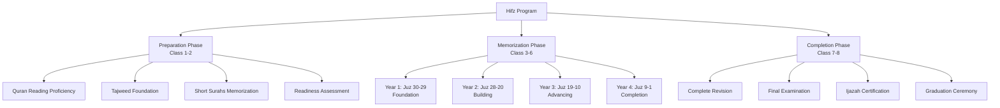
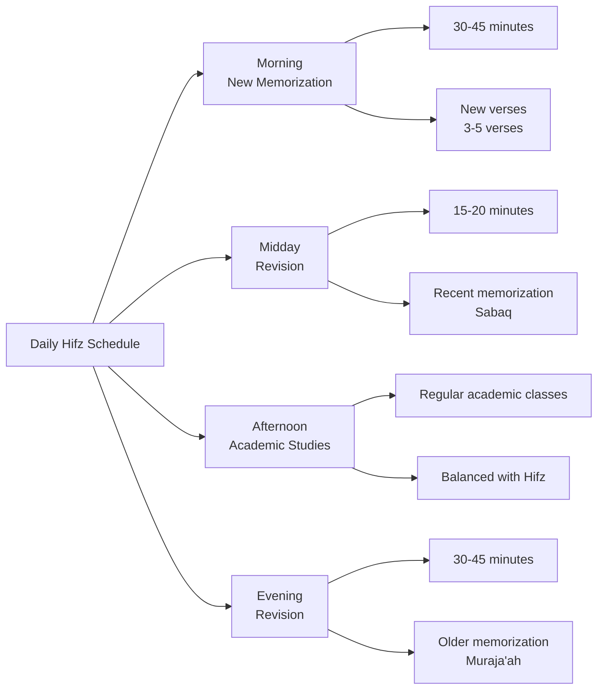
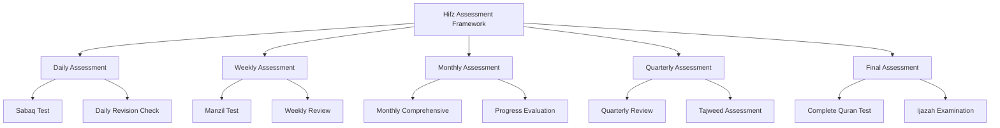

# Quran Memorization (Hifz) Program

**Document Title:** Quran Memorization (Hifz) Program
**Document ID:** IS_003
**Version:** 1.0
**Date:** 2026-01-11
**Project Name:** Smart Academy Digital Web Portal Development
**Content Category:** Islamic Studies Content

---

## Table of Contents

1. [Overview](#1-overview)
2. [Learning Objectives](#2-learning-objectives)
3. [Curriculum Structure](#3-curriculum-structure)
4. [Teaching Methodology](#4-teaching-methodology)
5. [Assessment & Evaluation](#5-assessment--evaluation)
6. [Resources & Materials](#6-resources--materials)
7. [Integration with Other Subjects](#7-integration-with-other-subjects)
8. [Parent Engagement](#8-parent-engagement)
9. [Technology Integration](#9-technology-integration)
10. [FAQs](#10-faqs)

---

## 1. Overview

The Hifz (Quran memorization) program at Smart Academy is a flagship initiative designed to guide students through the sacred journey of memorizing the entire Holy Quran. This program combines traditional methods of Quranic memorization with modern pedagogical techniques, providing students with the support, structure, and encouragement needed to achieve this noble goal. With 15 Huffaz (Quran memorizers) already completed and 45 students currently enrolled, the program has established itself as a cornerstone of Islamic education at Smart Academy.

### 1.1 Philosophy

The Hifz program is built upon these fundamental principles:

- **Divine Blessing**: Memorizing the Quran is a blessed endeavor that brings immense rewards. The Prophet (PBUH) said: "The best among you are those who learn the Quran and teach it." (Sahih Bukhari, Book 61, Hadith 545)

- **Preservation of Revelation**: Hafiz/Hafiza are guardians of Allah's words, continuing the chain of transmission that has preserved the Quran for over 1400 years. Allah (SWT) states in Quran 15:9: "Indeed, it is We who sent down the Quran and indeed, We will be its guardian."

- **Spiritual Elevation**: Memorizing the Quran elevates the spiritual status of the believer. The Prophet (PBUH) said: "The one who is proficient in the Quran is with the noble, righteous scribes; and the one who recites the Quran and stumbles in it, finding it difficult, will have a double reward." (Sahih Bukhari, Book 61, Hadith 546)

- **Lifelong Commitment**: Hifz is not just about memorization but about maintaining and living by the Quran throughout one's life. A Hafiz/Hafiza commits to regular revision and implementation of Quranic teachings.

- **Holistic Development**: The Hifz program develops not just memory but character, discipline, patience, and spiritual connection with Allah (SWT).

### 1.2 Goals

The Hifz program aims to achieve the following goals:

1. **Complete Memorization**: Guide students to memorize the entire Quran (30 Juz, 114 Surahs, approximately 6,236 verses) within 3-4 years.

2. **Strong Retention**: Ensure students maintain their memorization through systematic revision schedules and long-term support.

3. **Proper Tajweed**: Ensure students recite with correct Tajweed and pronunciation throughout the memorization process.

4. **Understanding**: Help students understand the meanings of the verses they memorize, connecting memorization with comprehension.

5. **Character Development**: Foster Islamic character and values through the process of Hifz, developing qualities such as patience, perseverance, humility, and discipline.

6. **Leadership Preparation**: Prepare students to become leaders in their communities, equipped with the guidance of the Quran.

7. **Ijazah Certification**: Provide students with Ijazah (certification) upon completion, connecting them to the chain of transmission (Isnad) back to the Prophet (PBUH).

8. **Teaching Capability**: Prepare students to teach Quran to others, continuing the chain of transmission.

### 1.3 Program Structure

The Hifz program follows a structured progression:

### 1.4 Current Achievements

The Hifz program at Smart Academy has achieved significant milestones:

| Achievement | Details |
|-------------|---------|
| **Completed Huffaz** | 15 students have completed full Quran memorization |
| **Current Enrollment** | 45 students currently in various stages of the Hifz program |
| **Success Rate** | 85% completion rate for students who start the program |
| **Average Duration** | 3.5 years for complete memorization |
| **Ijazah Holders** | 12 certified Huffaz with Ijazah |
| **Community Impact** | Huffaz serve as Imams, teachers, and community leaders |

---

## 2. Learning Objectives

### 2.1 Knowledge Objectives

By the completion of the Hifz program, students will demonstrate knowledge of:

- **Complete Quran**: All 30 Juz, 114 Surahs, and approximately 6,236 verses of the Holy Quran
- **Surah Order**: Correct sequence of all Surahs in the Quran
- **Verse Locations**: Ability to locate any verse in the Quran
- **Quranic Themes**: Understanding of major themes and concepts in the Quran
- **Tajweed Rules**: Comprehensive knowledge of all Tajweed rules
- **Quranic Vocabulary**: Extensive vocabulary of Quranic Arabic words
- **Meanings**: Basic understanding of the meanings of memorized verses

### 2.2 Skills Objectives

Students will develop the following Hifz-specific skills:

#### Memorization Skills
- **Retention**: Long-term retention of memorized portions
- **Accuracy**: Precise memorization without errors
- **Speed**: Efficient memorization techniques
- **Connection**: Understanding the flow and connection between verses and Surahs
- **Revision**: Regular and systematic revision of memorized portions

#### Recitation Skills
- **Fluency**: Smooth, uninterrupted recitation of the entire Quran
- **Tajweed**: Proper application of all Tajweed rules
- **Pronunciation**: Correct articulation of all Arabic letters
- **Rhythm**: Appropriate pace and rhythm in recitation
- **Emotion**: Reciting with appropriate emotion and reverence

#### Teaching Skills
- **Transmission**: Ability to teach Quran to others
- **Correction**: Ability to identify and correct recitation errors
- **Guidance**: Ability to guide others in their Quran journey

### 2.3 Character Objectives

Through the Hifz program, students will develop:

- **Patience (Sabr)**: Perseverance through the challenges of memorization
- **Discipline (Tartib)**: Regularity and consistency in daily practice
- **Humility (Tawadu)**: Humility before Allah's words and recognition that knowledge is from Allah
- **Trust in Allah (Tawakkul)**: Reliance on Allah for success in the Hifz journey
- **Gratitude (Shukr)**: Thankfulness for the blessing of Quran memorization
- **Sincerity (Ikhlas)**: Doing Hifz solely for Allah's pleasure
- **Responsibility (Amanah)**: Recognizing the responsibility of being a Hafiz/Hafiza
- **Leadership**: Developing leadership qualities through the Hifz journey

---

## 3. Curriculum Structure

### 3.1 Program Eligibility and Preparation

#### Eligibility Criteria

| Criteria | Requirement |
|----------|-------------|
| **Age** | Minimum 8 years old (Class 3) |
| **Quran Reading** | Fluent reading of Quran with basic Tajweed |
| **Academic Performance** | Good standing in academic subjects |
| **Character** | Demonstrated Islamic character and discipline |
| **Parental Support** | Commitment from parents to support the program |
| **Assessment** | Pass readiness assessment |

#### Preparation Phase (Class 1-2)

Students in Class 1-2 prepare for potential entry into the Hifz program:

| Component | Content | Duration |
|-----------|---------|----------|
| Quran Reading | Fluent reading of Juz 30 | Ongoing |
| Tajweed Foundation | Basic Tajweed rules | Ongoing |
| Short Surahs | Memorization of last 10 Surahs | Completed by Class 2 |
| Daily Practice | 15-20 minutes daily Quran practice | Ongoing |
| Character Development | Islamic values and discipline | Ongoing |

#### Readiness Assessment

Before entering the Hifz program, students undergo a comprehensive assessment:

| Assessment Area | Criteria |
|-----------------|----------|
| **Quran Reading** | Fluent reading of Juz 30 with basic Tajweed |
| **Memorization** | Memorization of last 10 Surahs |
| **Discipline** | Demonstrated ability to maintain daily practice |
| **Character** | Islamic character and behavior |
| **Parental Commitment** | Parents commit to supporting the program |
| **Teacher Recommendation** | Quran teacher's recommendation |

### 3.2 Memorization Schedule

#### Daily Schedule

The Hifz program requires a structured daily schedule:

| Time Block | Duration | Activity | Focus |
|------------|----------|----------|-------|
| Morning | 30-45 minutes | New Memorization (Sabaq) | 3-5 new verses |
| Midday | 15-20 minutes | Recent Revision (Sabaq) | Last 7 days of memorization |
| Afternoon | - | Academic Studies | Regular academic classes |
| Evening | 30-45 minutes | Older Revision (Muraja'ah) | Previously memorized portions |
| Before Sleep | 10-15 minutes | Review | Quick review of recent memorization |

#### Weekly Schedule

| Day | Focus | Activities |
|-----|-------|-------------|
| Saturday | New Memorization | Focus on new verses |
| Sunday | New Memorization | Continue new verses |
| Monday | Revision | Review last 7 days (Manzil) |
| Tuesday | New Memorization | Continue new verses |
| Wednesday | Revision | Review older portions |
| Thursday | New Memorization | Complete weekly new memorization |
| Friday | Comprehensive Review | Review entire memorized Quran |

#### Monthly Schedule

| Week | Focus | Activities |
|------|-------|-------------|
| Week 1 | New Memorization | Focus on new verses and recent revision |
| Week 2 | New Memorization | Continue new memorization |
| Week 3 | Revision | Comprehensive review of all memorized portions |
| Week 4 | Assessment | Monthly assessment and progress review |

### 3.3 Year-by-Year Progression

#### Year 1: Foundation (Juz 30-29)

| Month | Juz Focus | Target | Assessment |
|-------|-----------|--------|------------|
| Months 1-3 | Juz 30 (Part 1) | Surah An-Naba to Abasa | Monthly review |
| Months 4-6 | Juz 30 (Part 2) | Surah At-Takwir to Al-Balad | Monthly review |
| Months 7-9 | Juz 30 (Part 3) | Surah Ash-Shams to Al-Humazah | Monthly review |
| Months 10-12 | Juz 29 | Complete Juz 29 | Year-end comprehensive review |

**Year 1 Goals**:
- Complete memorization of Juz 30 and Juz 29
- Establish strong memorization habits
- Master basic Tajweed rules
- Develop daily revision routine

#### Year 2: Building (Juz 28-20)

| Month | Juz Focus | Target | Assessment |
|-------|-----------|--------|------------|
| Months 13-15 | Juz 28-27 | Al-Mulk to Ar-Rahman | Monthly review |
| Months 16-18 | Juz 26-24 | Ash-Shu'ara to An-Nur | Monthly review |
| Months 19-21 | Juz 23-21 | Al-Mu'minun to Al-Anbiya | Monthly review |
| Months 22-24 | Juz 20 | Ta-Ha | Year-end comprehensive review |

**Year 2 Goals**:
- Complete memorization of Juz 28-20
- Strengthen revision of Juz 30-29
- Improve memorization speed and efficiency
- Develop intermediate Tajweed skills

#### Year 3: Advancing (Juz 19-10)

| Month | Juz Focus | Target | Assessment |
|-------|-----------|--------|------------|
| Months 25-27 | Juz 19-17 | Maryam to Al-Isra | Monthly review |
| Months 28-30 | Juz 16-14 | An-Nahl to Ibrahim | Monthly review |
| Months 31-33 | Juz 13-11 | Ar-Ra'd to Hud | Monthly review |
| Months 34-36 | Juz 10 | Yunus | Year-end comprehensive review |

**Year 3 Goals**:
- Complete memorization of Juz 19-10
- Maintain strong revision of all memorized portions
- Master advanced Tajweed rules
- Increase revision capacity

#### Year 4: Completion (Juz 9-1)

| Month | Juz Focus | Target | Assessment |
|-------|-----------|--------|------------|
| Months 37-39 | Juz 9-7 | At-Tawbah to Al-A'raf | Monthly review |
| Months 40-42 | Juz 6-4 | Al-An'am to An-Nisa | Monthly review |
| Months 43-45 | Juz 3-1 | Al-Imran to Al-Baqarah | Monthly review |
| Months 46-48 | Complete Revision | Entire Quran | Final examination |

**Year 4 Goals**:
- Complete memorization of Juz 9-1
- Complete memorization of entire Quran
- Comprehensive revision of entire Quran
- Final examination and Ijazah certification

### 3.4 Milestones and Tracking

#### Milestone System

The Hifz program uses a milestone system to track progress:

| Milestone | Achievement | Recognition |
|-----------|-------------|-------------|
| **Milestone 1** | Completion of Juz 30 | Certificate of Achievement |
| **Milestone 2** | Completion of Juz 29 | Special Recognition |
| **Milestone 3** | Completion of Juz 28-25 | Bronze Award |
| **Milestone 4** | Completion of Juz 24-20 | Silver Award |
| **Milestone 5** | Completion of Juz 19-15 | Gold Award |
| **Milestone 6** | Completion of Juz 14-10 | Platinum Award |
| **Milestone 7** | Completion of Juz 9-5 | Diamond Award |
| **Milestone 8** | Completion of Juz 4-1 | Hifz Completion Certificate |
| **Milestone 9** | Ijazah Certification | Ijazah Certificate |
| **Milestone 10** | Graduation | Hafiz/Hafiza Title |

#### Progress Tracking

Each student maintains a comprehensive Hifz Portfolio:

| Component | Description |
|-----------|-------------|
| **Memorization Chart** | Visual representation of memorized Juz and Surahs |
| **Daily Log** | Record of daily memorization and revision |
| **Assessment Record** | Results of all assessments and tests |
| **Tajweed Progress** | Tracking of Tajweed rule mastery |
| **Character Reflections** | Personal reflections on the Hifz journey |
| **Achievement Certificates** | All milestone certificates and awards |
| **Teacher Feedback** | Regular feedback from Hifz teachers |

---

## 4. Teaching Methodology

### 4.1 Pedagogical Approach

The Hifz program employs a combination of traditional and modern teaching methods:

#### Traditional Methods
- **Talaqqi**: Direct transmission from teacher to student, ensuring proper pronunciation and Tajweed
- **Muraja'ah**: Systematic and regular revision to strengthen memorization
- **Tasmee**: Listening to recitation and correcting errors
- **Individual Attention**: One-on-one sessions with qualified Hifz teachers

#### Modern Methods
- **Spaced Repetition**: Scientific approach to memorization using spaced repetition schedules
- **Multisensory Learning**: Visual, auditory, and kinesthetic approaches
- **Technology Integration**: Use of apps and digital tools for tracking and support
- **Differentiated Instruction**: Adapting methods to individual learning styles

### 4.2 Teaching Strategies

#### Memorization Strategies

| Strategy | Description | Application |
|----------|-------------|-------------|
| **Chunking** | Breaking down verses into smaller segments | Memorizing 1-2 verses at a time |
| **Repetition** | Repeating verses multiple times | Each verse repeated 20-30 times |
| **Connection** | Understanding the flow between verses | Learning the context and connection |
| **Visualization** | Creating mental images of verses | Visualizing the meaning of verses |
| **Association** | Connecting verses to familiar concepts | Using memory aids and associations |
| **Review Schedules** | Systematic review at increasing intervals | Reviewing after 1 day, 3 days, 1 week, etc. |

#### Revision Strategies

| Strategy | Description | Application |
|----------|-------------|-------------|
| **Sabaq** | Review of new memorization | Daily review of last 7 days |
| **Manzil** | Review of recent memorization | Weekly review of last 1-2 Juz |
| **Muraja'ah** | Review of all memorized portions | Monthly comprehensive review |
| **Random Selection** | Reviewing random portions | Testing overall retention |
| **Connection Review** | Reviewing connected Surahs | Understanding the flow |

### 4.3 Teacher-Student Relationship

The teacher-student relationship in the Hifz program is characterized by:

- **Respect and Reverence**: Mutual respect between teacher and student
- **Patience and Encouragement**: Teachers provide patient guidance and encouragement
- **Individual Attention**: Each student receives personalized attention
- **Regular Feedback**: Ongoing feedback and correction
- **Mentorship**: Teachers serve as mentors and role models
- **Support System**: Teachers provide emotional and spiritual support

### 4.4 Classroom Environment

The Hifz classroom is designed to be:

- **Quiet and Focused**: Minimal distractions to facilitate concentration
- **Spiritually Uplifting**: Clean, organized, with Quranic atmosphere
- **Comfortable**: Appropriate seating for extended memorization sessions
- **Technology-Enhanced**: Audio systems for listening practice, tablets for tracking
- **Respectful**: Environment of reverence for the Quran

---

## 5. Assessment & Evaluation

### 5.1 Assessment Framework

### 5.2 Assessment Methods

#### Daily Assessment

| Assessment Type | Frequency | Content | Purpose |
|-----------------|-----------|---------|---------|
| **Sabaq Test** | Daily | New memorization (3-5 verses) | Ensure accurate memorization |
| **Daily Revision** | Daily | Last 7 days of memorization | Strengthen recent memorization |

**Scoring Criteria**:
- **Perfect**: No errors
- **Excellent**: 1-2 minor errors, self-corrected
- **Good**: 3-5 minor errors
- **Satisfactory**: 6-10 errors, needs revision
- **Unsatisfactory**: More than 10 errors, requires re-memorization

#### Weekly Assessment

| Assessment Type | Frequency | Content | Purpose |
|-----------------|-----------|---------|---------|
| **Manzil Test** | Weekly | Last 7 days of memorization | Strengthen recent memorization |
| **Weekly Review** | Weekly | Review of entire week's progress | Evaluate weekly progress |

**Scoring Criteria**:
- **Excellent**: 95-100% accuracy
- **Very Good**: 90-94% accuracy
- **Good**: 85-89% accuracy
- **Satisfactory**: 80-84% accuracy
- **Needs Improvement**: Below 80% accuracy

#### Monthly Assessment

| Assessment Type | Frequency | Content | Purpose |
|-----------------|-----------|---------|---------|
| **Monthly Comprehensive** | Monthly | All memorized portions | Evaluate overall retention |
| **Progress Evaluation** | Monthly | Progress toward monthly goals | Adjust learning plan as needed |

**Scoring Criteria**:
- **Excellent**: 95-100% accuracy, on or ahead of schedule
- **Very Good**: 90-94% accuracy, on schedule
- **Good**: 85-89% accuracy, slightly behind schedule
- **Satisfactory**: 80-84% accuracy, behind schedule
- **Needs Improvement**: Below 80% accuracy, significantly behind schedule

#### Quarterly Assessment

| Assessment Type | Frequency | Content | Purpose |
|-----------------|-----------|---------|---------|
| **Quarterly Review** | Quarterly | All memorized portions | Comprehensive evaluation |
| **Tajweed Assessment** | Quarterly | Tajweed rule application | Evaluate Tajweed progress |

**Scoring Criteria**:
- **Excellent**: 95-100% accuracy, excellent Tajweed
- **Very Good**: 90-94% accuracy, good Tajweed
- **Good**: 85-89% accuracy, satisfactory Tajweed
- **Satisfactory**: 80-84% accuracy, needs Tajweed improvement
- **Needs Improvement**: Below 80% accuracy, significant Tajweed issues

#### Final Assessment

| Assessment Type | Content | Purpose |
|-----------------|---------|---------|
| **Complete Quran Test** | Entire Quran from memory | Verify complete memorization |
| **Ijazah Examination** | Complete recitation with Tajweed | Grant Ijazah certification |

**Completion Criteria**:
- **Complete Memorization**: 100% of Quran memorized
- **Accuracy**: 95% or higher accuracy in recitation
- **Tajweed**: Proper application of all Tajweed rules
- **Fluency**: Smooth, uninterrupted recitation
- **Revision**: Ability to recite entire Quran without significant errors

### 5.3 Progress Reporting

#### Monthly Progress Reports

Parents receive monthly progress reports including:

| Section | Content |
|---------|---------|
| **Memorization Progress** | Juz and Surahs completed |
| **Revision Status** | Quality of revision |
| **Tajweed Progress** | Tajweed rule mastery |
| **Character Development** | Islamic character observations |
| **Areas for Improvement** | Specific recommendations |
| **Goals for Next Month** | Targets and objectives |

#### Parent-Teacher Conferences

Regular conferences are held to discuss progress:

| Frequency | Purpose |
|-----------|---------|
| **Monthly** | Brief update on progress |
| **Quarterly** | Detailed progress review |
| **Bi-Annual** | Comprehensive evaluation and planning |

### 5.4 Support and Intervention

#### For Students Struggling

Students who struggle receive additional support:

| Support Type | Description |
|--------------|-------------|
| **One-on-One Tutoring** | Additional individual sessions with Hifz teachers |
| **Adjusted Pace** | Slower pace of memorization |
| **Extra Practice Time** | Additional practice time during school |
| **Parental Involvement** | Increased home practice with parental support |
| **Motivational Support** | Encouragement and motivation strategies |
| **Review Sessions** | Additional review sessions |

#### For Advanced Students

Students who excel receive enrichment:

| Enrichment Type | Description |
|----------------|-------------|
| **Accelerated Pace** | Faster pace of memorization |
| **Advanced Tajweed** | Advanced Tajweed studies |
| **Teaching Opportunities** | Opportunities to teach younger students |
| **Leadership Roles** | Leadership roles in Hifz program |
| **Special Projects** | Special projects and competitions |

---

## 6. Resources & Materials

### 6.1 Primary Textbooks

#### Quran Texts
- **The Noble Quran**: Standard Uthmani script with color-coded Tajweed
- **Hifz Quran**: Special edition for memorization with clear text
- **Pocket Quran**: Portable Quran for revision on the go
- **Quran with Word-for-Word Translation**: For vocabulary building

#### Tajweed Books
- **Tajweed Rules of the Quran**: By Kareema Carol Czerepinski (3 volumes)
- **Reach the Goal via Tajweed Rules**: Comprehensive Tajweed guide
- **Advanced Tajweed**: For advanced Tajweed studies

#### Hifz Guides
- **The Hifz Diary**: Daily log and tracking guide
- **Hifz Success Guide**: Tips and strategies for successful Hifz
- **Revision Schedules**: Structured revision schedules

### 6.2 Digital Resources

#### Hifz Applications
- **Quran Companion**: Hifz tracking and revision scheduling
- **Memorize Quran**: Spaced repetition for memorization
- **Quran Memorizer**: Progress tracking and reminders
- **Hifz Tracker**: Comprehensive Hifz tracking app

#### Quran Applications
- **Quran.com**: Online Quran with translations and Tafseer
- **Quran Explorer**: Recitation, translation, and study tools
- **iQuran**: Mobile app for Quran reading and memorization

#### Audio Resources
- **EveryAyah**: Quran recitation by various reciters
- **Quranicaudio**: High-quality audio recitations
- **Quran Central**: Audio and video resources

### 6.3 Audio and Video Resources

#### Recommended Reciters for Hifz
- **Sheikh Mishary Rashid Alafasy**: Clear, melodious recitation
- **Sheikh Abdul Rahman Al-Sudais**: Powerful, emotional recitation
- **Sheikh Saad Al-Ghamdi**: Excellent for learning Tajweed
- **Sheikh Mahmoud Khalil Al-Hussary**: Classic, precise recitation
- **Sheikh Mohamed Siddiq Al-Minshawi**: Beautiful, slow recitation

#### Video Resources
- **Hifz Tips and Techniques**: YouTube channels with Hifz guidance
- **Tajweed Lessons**: Video tutorials by qualified teachers
- **Hifz Success Stories**: Inspirational stories of Huffaz

### 6.4 Supplementary Materials

#### Teaching Aids
- **Flashcards**: Quranic vocabulary, Tajweed rules
- **Posters**: Hifz progress charts, Tajweed rules
- **Charts**: Juz progress, Surah lists
- **Progress Trackers**: Visual tracking tools

#### Assessment Tools
- **Rubrics**: Detailed criteria for assessment
- **Checklists**: Progress tracking for memorization
- **Portfolios**: Student work samples and achievements
- **Progress Reports**: Regular communication with parents

---

## 7. Integration with Other Subjects

### 7.1 Re-STEAM Integration

The Hifz program integrates with STEAM subjects through the Re-STEAM framework:

#### Science Integration

| Hifz Concept | Science Connection | Example Activities |
|--------------|-------------------|-------------------|
| Memory Science | Neuroscience | Study how memory works and optimization |
| Brain Development | Cognitive Science | Understanding brain plasticity during Hifz |
| Health and Wellness | Health Science | Importance of sleep, nutrition, and exercise for memory |

#### Technology Integration

| Hifz Concept | Technology Connection | Example Activities |
|--------------|-------------------|-------------------|
| Hifz Apps | Digital Technology | Using apps for tracking and revision |
| Audio Recording | Audio Technology | Recording and reviewing recitation |
| Online Resources | Internet Technology | Accessing Tafseer and lectures online |

#### Arts Integration

| Hifz Concept | Arts Connection | Example Activities |
|--------------|----------------|-------------------|
| Quranic Calligraphy | Visual Arts | Learning Arabic calligraphy |
| Nasheeds | Performing Arts | Islamic songs about Quran |
| Creative Expression | Language Arts | Writing reflections on Hifz journey |

#### Mathematics Integration

| Hifz Concept | Mathematics Connection | Example Activities |
|--------------|-------------------|-------------------|
 | Verse Counting | Number Theory | Counting verses and understanding patterns |
| Schedules | Time Management | Creating and following revision schedules |
| Progress Tracking | Data Analysis | Analyzing progress data and trends |

### 7.2 Cross-Curricular Projects

Students engage in projects that integrate Hifz with other subjects:

- **Hifz Science Fair**: Projects on memory and brain science
- **Quranic Art Exhibition**: Student artwork reflecting Quranic themes
- **Hifz Reflection Journal**: Writing about the Hifz journey
- **Community Service**: Applying Quranic teachings through service
- **Teaching Projects**: Teaching Quran to younger students

---

## 8. Parent Engagement

### 8.1 Home-School Partnership

Parents play a crucial role in supporting their children's Hifz journey:

#### Regular Communication
- **Monthly Hifz Progress Reports**: Detailed updates on memorization and revision
- **Parent-Teacher Conferences**: Regular meetings to discuss Hifz progress
- **Digital Communication**: WhatsApp groups and email for ongoing support
- **Hifz Workshops**: Workshops on supporting children's Hifz at home

#### Home Support Resources
- **Daily Hifz Schedule**: Recommended schedule for home Hifz practice
- **Family Quran Time**: Guide for family Quran reading together
- **Duas for Hifz**: Specific Duas for success in Hifz
- **Hifz Listening Guide**: Recommended reciters for home listening

### 8.2 Parent Involvement Opportunities

Parents are encouraged to:

- **Listen to Recitation**: Daily listening to children's Quran recitation
- **Practice Together**: Recite Quran together as a family
- **Attend Hifz Events**: Participate in Hifz competitions and celebrations
- **Volunteer**: Assist with Hifz-related activities and events
- **Model Behavior**: Demonstrate reverence for Quran in daily life
- **Provide Support**: Create a supportive home environment for Hifz

### 8.3 Monitoring Progress at Home

Parents can support Hifz learning by:

- **Daily Practice**: Ensuring daily Quran memorization practice
- **Revision Schedule**: Following recommended revision schedules
- **Positive Reinforcement**: Encouraging and praising progress
- **Creating Environment**: Establishing a quiet, respectful space for Hifz study
- **Consistency**: Maintaining regularity in Hifz practice
- **Communication**: Maintaining regular contact with Hifz teachers

---

## 9. Technology Integration

### 9.1 Digital Learning Tools

The Hifz program incorporates technology to enhance learning:

#### Hifz Tracking Apps
- **Memorization Tracking**: Apps for tracking Hifz progress and revision
- **Revision Scheduling**: Automated revision reminders based on spaced repetition
- **Progress Visualization**: Visual charts showing memorization milestones
- **Audio Recording**: Recording and reviewing recitation

#### Classroom Technology
- **Smart Boards**: Interactive displays for Quranic verses and Tajweed rules
- **Tablets**: Individual devices for personalized Hifz learning
- **Projectors**: Displaying Quranic content and educational videos
- **Audio Systems**: High-quality audio for Quran recitations

#### Learning Management System
- **Gibbon Integration**: Digital platform for Hifz resources
- **Progress Tracking**: Online tracking of Hifz memorization and revision
- **Resource Sharing**: Digital library of Hifz materials
- **Assessment Tools**: Online quizzes and assessments

### 9.2 Technology for Hifz Program

The Hifz program uses specialized technology:

- **Hifz Tracking Apps**: Mobile apps for tracking memorization progress
- **Audio Recording**: Recording and reviewing recitation
- **Revision Schedules**: Automated revision reminders based on spaced repetition
- **Progress Visualization**: Visual charts showing memorization milestones
- **Online Communities**: Forums for Hifz students and parents

### 9.3 Online Hifz Resources

Students and parents have access to:

- **Online Quran Libraries**: Comprehensive Quran and Tafseer resources
- **Hifz Video Lectures**: Access to renowned Hifz teachers
- **Interactive Learning**: Online courses and tutorials
- **Hifz Communities**: Online forums for discussion and support

---

## 10. FAQs

### General Questions

**Q: What is the Hifz program?**

A: The Hifz program is a comprehensive Quran memorization program that guides students through memorizing the entire Holy Quran. The program typically takes 3-4 years and includes daily memorization, systematic revision, and comprehensive support from qualified Hifz teachers.

**Q: At what age can students start the Hifz program?**

A: Students can start the Hifz program from Class 3 (approximately 8 years old). Before starting, students must demonstrate fluent Quran reading with basic Tajweed, good character, and parental commitment to support the program.

**Q: How long does it take to complete Hifz?**

A: The Hifz program typically takes 3-4 years to complete. The exact duration depends on the individual student's pace, ability, and consistency in practice.

**Q: Is the Hifz program mandatory?**

A: The Hifz program is optional but highly encouraged. Students who show aptitude and interest can join the program. Currently, 45 students are enrolled in the Hifz program.

### Curriculum Questions

**Q: How much time do Hifz students spend on Quran memorization daily?**

A: Hifz students spend approximately 1.5-2 hours daily on Quran memorization and revision:
- Morning: 30-45 minutes for new memorization
- Midday: 15-20 minutes for recent revision
- Evening: 30-45 minutes for older revision

**Q: What is the difference between Sabaq, Manzil, and Muraja'ah?**

A: 
- **Sabaq**: New memorization (3-5 verses learned that day)
- **Manzil**: Review of the last 7 days of memorization
- **Muraja'ah**: Comprehensive review of all previously memorized portions

**Q: How do students balance Hifz with academic studies?**

A: Hifz students follow a balanced schedule that includes:
- Morning: Hifz memorization
- Midday: Academic classes
- Afternoon: Academic classes
- Evening: Hifz revision
Teachers and parents work together to ensure students maintain progress in both Hifz and academics.

### Assessment Questions

**Q: How is Hifz progress assessed?**

A: Hifz progress is assessed through:
- Daily Sabaq tests (new memorization)
- Weekly Manzil tests (recent memorization)
- Monthly Muraja'ah (overall revision)
- Quarterly comprehensive reviews
- Final completion examination

**Q: What happens if a student struggles with Hifz?**

A: We provide individualized support:
- One-on-one tutoring with Hifz teachers
- Adjusted memorization pace
- Additional practice time
- Encouragement and motivation
- Parent involvement in home practice

**Q: What is Ijazah?**

A: Ijazah is a certification granted upon completion of Hifz, connecting the student to the chain of transmission (Isnad) back to the Prophet (PBUH). It certifies that the student has memorized the Quran with proper Tajweed and is authorized to teach it to others.

### Parent Questions

**Q: How can I support my child's Hifz journey at home?**

A: Parents can support by:
- Listening to daily Quran recitation
- Creating a quiet, respectful space for Hifz study
- Establishing a regular Hifz practice schedule
- Encouraging and praising progress
- Reciting Quran together as a family
- Playing Quran recitations at home
- Attending Hifz workshops and events

**Q: What if my child wants to discontinue the Hifz program?**

A: We understand that Hifz is a significant commitment. If a student wishes to discontinue:
- We conduct a thorough discussion with parents and student
- We explore the reasons and provide support
- We ensure a smooth transition to regular Quran studies
- We celebrate the achievement of whatever portion has been memorized

### Technology Questions

**Q: What technology tools are used in the Hifz program?**

A: Technology integration includes:
- Hifz tracking apps for memorization and revision
- Smart boards for interactive lessons
- Tablets for personalized learning
- Online resources and digital libraries
- Progress tracking systems

**Q: Is technology used instead of traditional methods?**

A: No, technology is used as a supplement to traditional methods:
- Face-to-face instruction remains primary
- Traditional talaqqi (direct transmission) is maintained
- Technology enhances but does not replace traditional learning
- Balance is maintained between digital and traditional methods

---

## Document Approval

| Role | Name | Signature | Date |
|------|------|-----------|------|
| Islamic Studies Coordinator | | _________________ | ________ |
| Principal | | _________________ | ________ |
