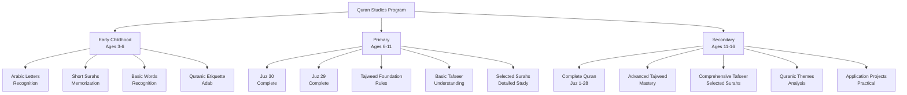
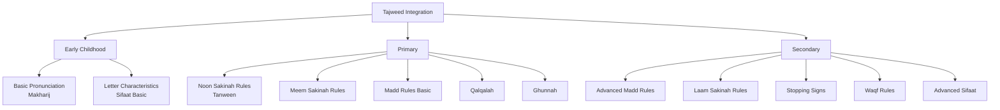
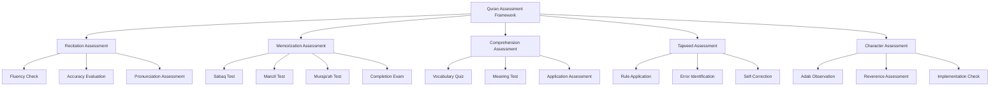

# Quran Studies Program

**Document Title:** Quran Studies Program
**Document ID:** IS_002
**Version:** 1.0
**Date:** 2026-01-11
**Project Name:** Smart Academy Digital Web Portal Development
**Content Category:** Islamic Studies Content

---

## Table of Contents

1. [Overview](#1-overview)
2. [Learning Objectives](#2-learning-objectives)
3. [Curriculum Structure](#3-curriculum-structure)
4. [Teaching Methodology](#4-teaching-methodology)
5. [Assessment & Evaluation](#5-assessment--evaluation)
6. [Resources & Materials](#6-resources--materials)
7. [Integration with Other Subjects](#7-integration-with-other-subjects)
8. [Parent Engagement](#8-parent-engagement)
9. [Technology Integration](#9-technology-integration)
10. [FAQs](#10-faqs)

---

## 1. Overview

The Quran Studies program at Smart Academy is the cornerstone of our Islamic education, designed to help students develop a deep, personal relationship with the Holy Quran. This program encompasses Quran recitation, understanding, memorization, and practical application of Quranic teachings in daily life. Our approach combines traditional methods of Quranic education with modern pedagogical techniques to ensure students not only learn to read the Quran but also understand its meaning and implement its guidance.

### 1.1 Philosophy

The Quran Studies program is founded on these fundamental principles:

- **Divine Origin**: The Quran is the literal word of Allah (SWT), revealed to Prophet Muhammad (PBUH) through Angel Jibreel (AS). As stated in Quran 15:9: "Indeed, it is We who sent down the Quran and indeed, We will be its guardian."

- **Complete Guidance**: The Quran provides comprehensive guidance for all aspects of life. As Allah (SWT) states in Quran 2:2: "This is the Book about which there is no doubt, a guidance for those conscious of Allah."

- **Recitation with Reverence**: The Quran must be recited with proper Tajweed, understanding, and reverence. Allah (SWT) commands in Quran 73:4: "And recite the Quran with measured recitation."

- **Practical Application**: Learning the Quran is not merely an academic exercise; it must be implemented in daily life. As stated in Quran 39:18: "They are the ones who listen to the word and follow the best of it."

- **Lifelong Journey**: Quranic learning is a continuous process that extends beyond formal education. The Prophet (PBUH) said: "The best among you are those who learn the Quran and teach it." (Sahih Bukhari, Book 61, Hadith 545)

### 1.2 Goals

The Quran Studies program aims to achieve the following goals:

1. **Recitation Proficiency**: Enable students to recite the Quran fluently with proper Tajweed and pronunciation.

2. **Comprehension**: Develop understanding of Quranic Arabic and the meanings of Quranic verses.

3. **Memorization**: Support students in memorizing portions or the entire Quran through our Hifz program.

4. **Implementation**: Guide students to apply Quranic teachings in their daily lives, character, and decision-making.

5. **Love for Quran**: Foster a deep love and connection with the Quran that lasts a lifetime.

6. **Teaching Capability**: Prepare students to teach Quran to others, continuing the chain of transmission.

7. **Integration**: Connect Quranic teachings with other academic subjects and real-world contexts.

### 1.3 Program Structure

The Quran Studies program progresses through three developmental levels:

---

## 2. Learning Objectives

### 2.1 Knowledge Objectives

By the end of each level, students will demonstrate knowledge of:

#### Early Childhood (Ages 3-6)
- All Arabic letters with proper pronunciation
- Short Surahs: Al-Fatiha, Al-Fil, Quraysh, Al-Ma'un, Al-Kawthar, Al-Kafirun, An-Nasr, Al-Lahab, Al-Ikhlas, Al-Falaq, An-Nas
- Basic Quranic vocabulary (Allah, Rahman, Rahim, etc.)
- Etiquette of handling and reciting the Quran
- Basic meanings of short Surahs

#### Primary (Ages 6-11)
- Complete recitation of Juz 30 (Juz Amma) - 37 Surahs
- Complete recitation of Juz 29 - 11 Surahs
- Foundation Tajweed rules and their application
- Basic meanings of memorized Surahs
- Important Quranic themes and concepts
- Stories of the Prophets mentioned in the Quran
- Selected verses about Islamic values and character

#### Secondary (Ages 11-16)
- Complete recitation of the entire Quran (30 Juz)
- Advanced Tajweed rules with proper application
- Detailed Tafseer of selected important Surahs
- Understanding of Quranic Arabic grammar and vocabulary
- Quranic themes and their relevance to contemporary issues
- Scientific and historical references in the Quran
- Application of Quranic guidance to modern life

### 2.2 Skills Objectives

Students will develop the following Quranic skills:

#### Recitation Skills
- **Fluency**: Smooth, uninterrupted reading of Quranic text
- **Pronunciation**: Correct articulation of Arabic letters (Makharij)
- **Tajweed**: Proper application of all Tajweed rules
- **Rhythm**: Appropriate pace and rhythm in recitation
- **Emotion**: Reciting with appropriate emotion and reverence

#### Memorization Skills (for Hifz students)
- **Retention**: Long-term retention of memorized portions
- **Accuracy**: Precise memorization without errors
- **Revision**: Regular revision of previously memorized portions
- **Connection**: Understanding the flow and connection between verses

#### Comprehension Skills
- **Vocabulary**: Understanding key Quranic Arabic words
- **Context**: Understanding the context of revelation (Asbab al-Nuzul)
- **Meaning**: Grasping the basic meanings of verses
- **Application**: Connecting Quranic teachings to daily life

### 2.3 Character Objectives

Through Quran studies, students will develop:

- **Reverence (Ta'zim)**: Respect and honor for the Quran
- **Humility (Tawadu)**: Humility before Allah's words
- **Reflection (Tafakkur)**: Deep contemplation on Quranic verses
- **Implementation (Amal)**: Applying Quranic teachings in daily life
- **Love (Hubb)**: Deep love for the Quran
- **Patience (Sabr)**: Perseverance in learning and memorizing
- **Discipline (Tartib)**: Regularity in Quran recitation and study

---

## 3. Curriculum Structure

### 3.1 Juz Progression

The Quran curriculum follows a structured progression through the Juz (parts) of the Quran:

#### Early Childhood (Ages 3-6)

| Stage | Content | Duration |
|-------|---------|----------|
| Stage 1 | Arabic letters recognition | 3 months |
| Stage 2 | Connecting letters to form words | 2 months |
| Stage 3 | Short Surahs: Al-Fatiha, Al-Fil, Quraysh | 4 months |
| Stage 4 | Short Surahs: Al-Ma'un, Al-Kawthar, Al-Kafirun | 3 months |
| Stage 5 | Short Surahs: An-Nasr, Al-Lahab, Al-Ikhlas | 2 months |
| Stage 6 | Short Surahs: Al-Falaq, An-Nas | 2 months |

#### Primary (Ages 6-11)

| Year | Juz Focus | Surahs Covered |
|------|-----------|----------------|
| Class 1 | Juz 30 (Part 1) | Surah An-Naba to Surah Abasa |
| Class 2 | Juz 30 (Part 2) | Surah At-Takwir to Surah Al-Balad |
| Class 3 | Juz 30 (Part 3) | Surah Ash-Shams to Surah Al-Humazah |
| Class 4 | Juz 30 (Part 4) | Surah Al-Fil to Surah An-Nas |
| Class 5 | Juz 29 | Surah Al-Mulk to Surah Al-Jinn |

#### Secondary (Ages 11-16)

| Year | Juz Focus | Progress |
|------|-----------|----------|
| Class 6 | Juz 1-5 | Al-Fatiha to Al-Ma'idah |
| Class 7 | Juz 6-10 | Al-An'am to At-Tawbah |
| Class 8 | Juz 11-15 | Yunus to Al-Hijr |
| Class 9 | Juz 16-20 | An-Nahl to Taha |
| Class 10 | Juz 21-28 | Al-Anbiya to Al-Mujadila |

### 3.2 Surah-Specific Curriculum

#### Early Childhood - Short Surahs

| Surah | Number | Key Themes | Learning Focus |
|-------|--------|------------|----------------|
| Al-Fatiha | 1 | Opening, praise, guidance | Daily prayer, understanding |
| Al-Fil | 105 | Allah's protection | Trust in Allah |
| Quraysh | 106 | Blessings, gratitude | Shukr (gratitude) |
| Al-Ma'un | 107 | Kindness, charity | Helping others |
| Al-Kawthar | 108 | Abundance, sacrifice | Gratitude, prayer |
| Al-Kafirun | 109 | Tawhid, rejection of shirk | Faith in Allah |
| An-Nasr | 110 | Victory, gratitude | Thanking Allah |
| Al-Lahab | 111 | Consequences of disbelief | Warning against arrogance |
| Al-Ikhlas | 112 | Tawhid, Allah's nature | Pure monotheism |
| Al-Falaq | 113 | Protection from evil | Seeking Allah's protection |
| An-Nas | 114 | Protection from evil | Seeking Allah's protection |

#### Primary - Juz 30 & 29 Selected Surahs

| Surah | Number | Key Themes | Learning Focus |
|-------|--------|------------|----------------|
| An-Naba | 78 | Day of Judgment, Paradise | Akhirah awareness |
| An-Nazi'at | 79 | Resurrection, accountability | Reflection on life |
| Abasa | 80 | Etiquette of da'wah | Respect for all |
| At-Takwir | 81 | Day of Judgment | Signs of Akhirah |
| Al-Infitar | 82 | Accountability | Self-reflection |
| Al-Mutaffifin | 83 | Justice, honesty | Fair dealings |
| Al-Inshiqaq | 84 | Day of Judgment | Preparation for Akhirah |
| Al-Buruj | 85 | Persecution, faith | Steadfastness |
| At-Tariq | 86 | Allah's power | Recognition of Allah |
| Al-A'la | 87 | Praise, guidance | Remembering Allah |
| Al-Ghashiyah | 88 | Paradise and Hellfire | Motivation for good deeds |
| Al-Fajr | 89 | Gratitude, consequences | Thankfulness to Allah |
| Al-Balad | 90 | Responsibility, effort | Striving for good |
| Ash-Shams | 91 | Soul purification | Self-improvement |
| Al-Layl | 92 | Giving, righteousness | Charity and good deeds |
| Ad-Duhaa | 93 | Allah's favors | Gratitude and patience |
| Al-Inshirah | 94 | Ease after difficulty | Trust in Allah |
| At-Tin | 95 | Human dignity | Purpose of creation |
| Al-Alaq | 96 | Knowledge, importance of reading | Value of education |
| Al-Qadr | 97 | Laylat al-Qadr | Night of Power |
| Al-Bayyinah | 98 | Clear proof of Islam | Certainty in faith |
| Az-Zalzalah | 99 | Day of Judgment | Accountability |
| Al-Adiyat | 100 | Gratitude, human nature | Self-reflection |
| Al-Qari'ah | 101 | Day of Judgment | Preparation for Akhirah |
| At-Takathur | 102 | Worldly competition | Focus on Akhirah |
| Al-Asr | 103 | Time, loss, success | Time management |
| Al-Humazah | 104 | Backbiting, greed | Avoiding negative traits |
| Al-Mulk | 67 | Allah's kingdom, creation | Reflecting on creation |
| Al-Qalam | 68 | Pen, truth vs falsehood | Importance of knowledge |
| Al-Haqqah | 69 | Day of Judgment | Truth of resurrection |
| Al-Ma'arij | 70 | Ascension, patience | Spiritual elevation |
| Nuh | 71 | Story of Prophet Nuh | Lessons from Prophets |
| Al-Jinn | 72 | Jinn, Quran's universality | Diversity of Allah's creation |

#### Secondary - Selected Important Surahs for Tafseer

| Surah | Number | Key Themes | Learning Focus |
|-------|--------|------------|----------------|
| Al-Baqarah | 2 | Guidance, laws, stories | Comprehensive Islamic law |
| Al-Imran | 3 | Family of Imran, lessons | Faith and steadfastness |
| An-Nisa | 4 | Women's rights, inheritance | Social justice in Islam |
| Al-Ma'idah | 5 | Laws, dietary rules | Islamic jurisprudence |
| Al-An'am | 6 | Tawhid, rejection of shirk | Pure monotheism |
| Al-A'raf | 7 | Stories of Prophets | Lessons from history |
| Al-Anfal | 8 | Battle of Badr, jihad | Courage and faith |
| At-Tawbah | 9 | Repentance, hypocrites | Sincerity in faith |
| Yunus | 10 | Story of Prophet Yunus | Patience and dua |
| Yusuf | 12 | Story of Prophet Yusuf | Trust in Allah during trials |
| Al-Kahf | 18 | Trials, stories | Protection from fitnah |
| Maryam | 19 | Stories of Prophets | Faith and family |
| Ta-Ha | 20 | Story of Musa, dua | Communication with Allah |
| Al-Anbiya | 21 | Stories of Prophets | Lessons from Prophets |
| Al-Hajj | 22 | Hajj, tawhid | Pilgrimage and worship |
| Al-Mu'minun | 23 | Believers' characteristics | Building Islamic character |
| An-Nur | 24 | Modesty, social laws | Islamic social ethics |
| Al-Furqan | 25 | Quran as criterion | Following divine guidance |
| Ash-Shu'ara | 26 | Stories of Prophets | Consistency in da'wah |
| An-Naml | 27 | Stories, wisdom | Learning from history |
| Al-Qasas | 28 | Story of Musa | Leadership and courage |
| Al-Ankabut | 29 | Trials, patience | Steadfastness in faith |
| Ar-Rum | 30 | Signs of Allah | Reflection on creation |
| Luqman | 31 | Wisdom, parenting | Islamic family values |
| As-Sajdah | 32 | Creation, resurrection | Submission to Allah |
| Al-Ahzab | 33 | Battle of the Trench | Community building |
| Saba | 34 | Kingdoms, consequences | Power belongs to Allah |
| Fatir | 35 | Creation, angels | Gratitude to Allah |
| Ya-Sin | 36 | Resurrection, Quran | Heart of the Quran |
| As-Saffat | 37 | Prophets, angels | Faith in unseen |
| Sad | 38 | Repentance, Dawud | Turning to Allah |
| Az-Zumar | 39 | Sincerity, repentance | Pure worship |
| Ghafir | 40 | Forgiveness, patience | Allah's mercy |
| Fussilat | 41 | Quran's truth | Following guidance |
| Ash-Shura | 42 | Consultation, unity | Islamic governance |
| Az-Zukhruf | 43 | Worldly adornments | Focus on Akhirah |
| Ad-Dukhan | 44 | Smoke, punishment | Warning and mercy |
| Al-Jathiyah | 45 | Accountability | Preparation for judgment |
| Al-Ahqaf | 46 | Disbelievers, Hud | Lessons from history |
| Muhammad | 47 | Jihad, believers | Striving for Allah |
| Al-Fath | 48 | Victory, treaty | Trust in Allah's plan |
| Al-Hujurat | 49 | Islamic etiquette | Social conduct in Islam |
| Qaf | 50 | Resurrection | Certainty of Akhirah |
| Az-Zariyat | 51 | Oath, creation | Reflecting on signs |
| At-Tur | 52 | Paradise, punishment | Motivation for deeds |
| An-Najm | 53 | Isra and Mi'raj | Spiritual journey |
| Al-Qamar | 54 | Moon, punishment | Signs of Allah |
| Ar-Rahman | 55 | Allah's blessings | Gratitude and recognition |
| Al-Waqi'ah | 56 | Day of Judgment | Three groups of people |
| Al-Hadid | 57 | Iron, believers | Strength in faith |
| Al-Mujadila | 58 | Arguments, consultation | Conflict resolution |

### 3.3 Tajweed Integration

Tajweed rules are integrated throughout the Quran curriculum:

---

## 4. Teaching Methodology

### 4.1 Pedagogical Approach

The Quran Studies program employs a combination of traditional and modern teaching methods:

#### Traditional Methods
- **Talaqqi**: Direct transmission from teacher to student, ensuring proper pronunciation and Tajweed
- **Muraja'ah**: Regular revision to strengthen memorization and retention
- **Tadabbur**: Deep reflection and contemplation on Quranic meanings
- **Talaqqi al-Quran**: One-on-one recitation practice with qualified teachers

#### Modern Methods
- **Interactive Learning**: Use of smart boards, tablets, and multimedia resources
- **Differentiated Instruction**: Adapting teaching methods to individual learning styles
- **Project-Based Learning**: Projects that connect Quranic teachings to real life
- **Peer Learning**: Group activities and peer teaching opportunities

### 4.2 Teaching Strategies by Level

#### Early Childhood (Ages 3-6)

| Strategy | Description | Example |
|----------|-------------|---------|
| Visual Learning | Colorful flashcards and illustrations | Arabic letter cards with pictures |
| Repetition & Rhythm | Songs, rhymes, and repetitive activities | Alphabet songs, Surah recitation with melody |
| Storytelling | Stories from Quran in simple language | Stories of Prophets for young children |
| Play-Based Learning | Games and activities | Matching games for Arabic letters |
| Positive Reinforcement | Encouragement and praise | Stickers and rewards for progress |
| Modeling | Teachers demonstrate proper recitation | Teacher recites, students repeat |

#### Primary (Ages 6-11)

| Strategy | Description | Example |
|----------|-------------|---------|
| Interactive Discussion | Class discussions about Quranic meanings | Discussing lessons from Surah Yusuf |
| Memorization Techniques | Structured approaches for memorization | Chunking verses, repetition schedules |
| Group Recitation | Students recite together | Group Juz Amma recitation |
| Individual Practice | One-on-one recitation with teacher | Individual Tajweed correction |
| Meaning-Based Learning | Focus on understanding meanings | Learning vocabulary before memorization |
| Application Activities | Applying Quranic teachings | Role-playing Islamic manners |

#### Secondary (Ages 11-16)

| Strategy | Description | Example |
|----------|-------------|---------|
| Critical Analysis | Deep examination of Quranic verses | Analyzing themes in Surah Al-Baqarah |
| Research Projects | Independent research on Quranic topics | Research on scientific references in Quran |
| Debate & Discussion | Structured debates on Quranic issues | Discussing contemporary issues from Quranic perspective |
| Tafseer Study | Detailed study of Quranic interpretation | Studying Tafseer Ibn Kathir |
| Application Projects | Applying Quranic teachings to modern life | Creating guides for Islamic lifestyle |
| Teaching Practice | Students teaching younger students | Peer tutoring in Quran recitation |

### 4.3 Classroom Environment

The Quran classroom is designed to be:

- **Spiritually Uplifting**: Clean, quiet, with Quranic verses displayed
- **Focused**: Minimal distractions to facilitate concentration
- **Respectful**: Environment of reverence for the Quran
- **Interactive**: Encouraging student participation and engagement
- **Technology-Enhanced**: Smart boards, audio systems for recitation practice
- **Comfortable**: Appropriate seating for extended recitation sessions

---

## 5. Assessment & Evaluation

### 5.1 Assessment Framework

### 5.2 Assessment Methods

#### Recitation Assessment

| Criteria | Description | Scoring |
|----------|-------------|---------|
| Fluency | Smooth reading without hesitation | 0-10 points |
| Accuracy | Correct reading without errors | 0-10 points |
| Tajweed | Proper application of Tajweed rules | 0-10 points |
| Pronunciation | Correct articulation of letters | 0-10 points |
| Rhythm | Appropriate pace and rhythm | 0-5 points |
| Reverence | Reciting with proper etiquette | 0-5 points |

**Scoring Rubric**:
- **Excellent (45-50)**: Near-perfect recitation with excellent Tajweed
- **Very Good (40-44)**: Strong recitation with minor Tajweed issues
- **Good (35-39)**: Good recitation with some Tajweed errors
- **Satisfactory (30-34)**: Basic recitation with notable errors
- **Needs Improvement (Below 30)**: Significant issues requiring intervention

#### Memorization Assessment (Hifz)

| Assessment Type | Frequency | Content | Purpose |
|-----------------|-----------|---------|---------|
| Sabaq | Daily | New memorization | Ensure accurate memorization |
| Manzil | Weekly | Last 7 days of memorization | Strengthen recent memorization |
| Muraja'ah | Monthly | All previously memorized portions | Maintain long-term retention |
| Quarterly Review | Every 3 months | Complete review of all memorized Quran | Comprehensive assessment |
| Completion Exam | End of program | Entire Quran | Final certification |

**Memorization Scoring**:
- **Perfect**: No errors
- **Excellent**: 1-2 minor errors, self-corrected
- **Good**: 3-5 minor errors
- **Satisfactory**: 6-10 errors, needs revision
- **Unsatisfactory**: More than 10 errors, requires re-memorization

#### Comprehension Assessment

| Assessment Type | Description | Example |
|----------------|-------------|---------|
| Vocabulary Quiz | Test understanding of Quranic words | Matching Arabic words with meanings |
| Meaning Test | Assess understanding of Surah meanings | Short answer questions on Surah themes |
| Application Assessment | Evaluate application of teachings | Essay on applying Quranic lessons |
| Oral Explanation | Student explains verses in own words | Oral presentation on Surah meaning |

#### Tajweed Assessment

| Tajweed Rule | Assessment Method | Proficiency Levels |
|--------------|-------------------|-------------------|
| Makharij | Pronunciation check | Foundation, Beginner, Intermediate, Advanced |
| Sifaat | Characteristic application | Foundation, Beginner, Intermediate, Advanced |
| Noon Sakinah | Rule application | Foundation, Beginner, Intermediate, Advanced |
| Meem Sakinah | Rule application | Foundation, Beginner, Intermediate, Advanced |
| Madd Rules | Duration and type | Foundation, Beginner, Intermediate, Advanced |
| Qalqalah | Intensity and application | Foundation, Beginner, Intermediate, Advanced |
| Ghunnah | Duration and nasal sound | Foundation, Beginner, Intermediate, Advanced |
| Stopping Signs | Proper stopping | Foundation, Beginner, Intermediate, Advanced |

### 5.3 Progress Tracking

Each student maintains a Quran Progress Portfolio including:

- **Recitation Log**: Record of Surahs and Juz completed
- **Memorization Tracker**: Visual chart of Hifz progress
- **Tajweed Assessment Record**: Progress in Tajweed rules mastery
- **Comprehension Notes**: Understanding of Quranic meanings
- **Character Reflections**: Personal reflections on applying Quranic teachings
- **Achievement Certificates**: Recognition of milestones achieved

### 5.4 Feedback and Support

Students receive regular feedback:

- **Daily Feedback**: Immediate correction during recitation practice
- **Weekly Reports**: Summary of progress and areas for improvement
- **Monthly Conferences**: Detailed discussion of progress with parents
- **Individualized Support**: Additional help for struggling students
- **Enrichment Opportunities**: Advanced activities for excelling students

---

## 6. Resources & Materials

### 6.1 Primary Textbooks

#### Quran Texts
- **The Noble Quran**: Standard Uthmani script with color-coded Tajweed
- **Juz Amma**: Separate book for Juz 30 with translation
- **Quran with Word-for-Word Translation**: For vocabulary building
- **Tajweed Quran**: Color-coded for Tajweed rules

#### Tajweed Books
- **Tajweed Rules of the Quran**: By Kareema Carol Czerepinski (3 volumes)
- **Reach the Goal via Tajweed Rules**: Comprehensive Tajweed guide
- **Noorani Qaida**: Foundation for Quran reading (early levels)

#### Tafseer Books
- **Tafseer Ibn Kathir**: Simplified for students
- **Tafseer al-Jalalayn**: Concise Tafseer
- **The Meaning of the Holy Quran**: By Abdullah Yusuf Ali

### 6.2 Digital Resources

#### Quran Applications
- **Quran.com**: Online Quran with translations, Tafseer, and audio
- **Quran Explorer**: Recitation, translation, and study tools
- **iQuran**: Mobile app for Quran reading and memorization
- **Quran Pro**: Comprehensive Quran app with multiple features

#### Tajweed Learning Apps
- **Tajweed Quran**: Interactive Tajweed learning
- **Learn Quran Tajweed**: Step-by-step Tajweed instruction
- **Quran Tajweed**: Video lessons and practice

#### Memorization Apps
- **Quran Companion**: Hifz tracking and revision scheduling
- **Memorize Quran**: Spaced repetition for memorization
- **Quran Memorizer**: Progress tracking and reminders

#### Audio Resources
- **EveryAyah**: Quran recitation by various reciters
- **Quranicaudio**: High-quality audio recitations
- **Quran Central**: Audio and video resources

### 6.3 Audio and Video Resources

#### Recommended Reciters
- **Sheikh Mishary Rashid Alafasy**: Clear, melodious recitation
- **Sheikh Abdul Rahman Al-Sudais**: Powerful, emotional recitation
- **Sheikh Saad Al-Ghamdi**: Excellent for learning Tajweed
- **Sheikh Mahmoud Khalil Al-Hussary**: Classic, precise recitation
- **Sheikh Mohamed Siddiq Al-Minshawi**: Beautiful, slow recitation

#### Video Resources
- **Quran Recitation with Tajweed**: YouTube channels with instruction
- **Tajweed Lessons**: Video tutorials by qualified teachers
- **Quran Tafseer**: Video explanations of Quranic verses
- **Learning Arabic for Quran**: Arabic language instruction

### 6.4 Supplementary Materials

#### Teaching Aids
- **Flashcards**: Arabic letters, Quranic vocabulary, Tajweed rules
- **Posters**: Quranic verses, Tajweed rules, prayer times
- **Charts**: Juz progress, Surah lists, Tajweed rule summaries
- **Manipulatives**: Hands-on learning materials for young students

#### Assessment Tools
- **Rubrics**: Detailed criteria for assessment
- **Checklists**: Progress tracking for recitation and memorization
- **Portfolios**: Student work samples and achievements
- **Progress Reports**: Regular communication with parents

---

## 7. Integration with Other Subjects

### 7.1 Re-STEAM Integration

The Quran Studies program integrates with STEAM subjects through the Re-STEAM framework:

#### Science Integration

| Quranic Concept | Science Connection | Example Activities |
|----------------|-------------------|-------------------|
| Creation of Heavens and Earth | Astronomy and Cosmology | Study of Big Bang theory vs Quranic description |
| Embryology | Biology | Compare Quranic embryonic stages with modern science |
| Water Cycle | Earth Science | Study water cycle mentioned in Quran 23:18 |
| Mountains as Pegs | Geology | Study mountain formation and stabilizing effect |
| Honey as Healing | Medicine | Research medicinal properties of honey |

#### Technology Integration

| Quranic Concept | Technology Connection | Example Activities |
|----------------|-------------------|-------------------|
| Preservation of Quran | Information Technology | Study how Quran was preserved through writing and memorization |
| Quran Apps | Digital Technology | Use apps for memorization and revision |
| Online Resources | Internet Technology | Access Tafseer and lectures online |
| Digital Quran | Technology Tools | Using tablets and smart boards for Quran study |

#### Engineering Integration

| Quranic Concept | Engineering Connection | Example Activities |
|----------------|-------------------|-------------------|
| Ark of Nuh | Naval Engineering | Study buoyancy and ship design |
| Construction of Kaaba | Structural Engineering | Study ancient construction techniques |
| Islamic Architecture | Architectural Engineering | Study mosque architecture and engineering |
| Water Management | Civil Engineering | Study Islamic water management systems |

#### Arts Integration

| Quranic Concept | Arts Connection | Example Activities |
|----------------|----------------|-------------------|
| Quranic Calligraphy | Visual Arts | Learning Arabic calligraphy |
| Quranic Verses as Art | Islamic Art | Creating art with Quranic verses |
| Nasheeds | Performing Arts | Learning Islamic songs with Quranic themes |
| Storytelling | Language Arts | Creative writing based on Quranic stories |

#### Mathematics Integration

| Quranic Concept | Mathematics Connection | Example Activities |
|----------------|-------------------|-------------------|
| Inheritance Laws | Applied Mathematics | Calculate Islamic inheritance shares |
| Numerology in Quran | Number Theory | Study numbers mentioned in Quran |
| Zakat Calculations | Applied Mathematics | Calculate Zakat amounts |
| Quranic Geometry | Spatial Mathematics | Study geometric patterns in Islamic art |

### 7.2 Cross-Curricular Projects

Students engage in projects that integrate Quranic studies with other subjects:

- **Quranic Science Fair**: Projects demonstrating scientific concepts mentioned in Quran
- **Islamic Art Exhibition**: Student artwork reflecting Quranic themes
- **Quranic Poetry**: Creative writing based on Quranic verses
- **Historical Research**: Research on preservation of Quran throughout history
- **Community Service**: Applying Quranic teachings of charity and kindness

---

## 8. Parent Engagement

### 8.1 Home-School Partnership

Parents play a crucial role in supporting their children's Quran education:

#### Regular Communication
- **Monthly Quran Progress Reports**: Detailed updates on recitation and memorization
- **Parent-Teacher Conferences**: Regular meetings to discuss Quran progress
- **Digital Communication**: WhatsApp groups and email for ongoing support
- **Quran Workshops**: Workshops on supporting children's Quran learning at home

#### Home Support Resources
- **Daily Quran Schedule**: Recommended schedule for home Quran practice
- **Family Quran Time**: Guide for family Quran reading together
- **Duas for Quran Learning**: Specific Duas for success in Quran studies
- **Quran Listening Guide**: Recommended reciters for home listening

### 8.2 Parent Involvement Opportunities

Parents are encouraged to:

- **Listen to Recitation**: Daily listening to children's Quran recitation
- **Practice Together**: Recite Quran together as a family
- **Attend Quran Events**: Participate in Quran competitions and celebrations
- **Volunteer**: Assist with Quran-related activities and events
- **Model Behavior**: Demonstrate reverence for Quran in daily life

### 8.3 Monitoring Progress at Home

Parents can support Quran learning by:

- **Daily Practice**: Ensuring daily Quran recitation practice
- **Revision Schedule**: Following recommended revision schedules
- **Positive Reinforcement**: Encouraging and praising progress
- **Creating Environment**: Establishing a quiet, respectful space for Quran study
- **Consistency**: Maintaining regularity in Quran practice

---

## 9. Technology Integration

### 9.1 Digital Learning Tools

The Quran Studies program incorporates technology to enhance learning:

#### Quran Learning Apps
- **Memorization Tracking**: Apps for tracking Hifz progress and revision
- **Tajweed Learning**: Interactive apps for learning Tajweed rules
- **Quran Audio**: Access to various recitations for listening practice
- **Tafseer Digital**: Digital Tafseer resources for study

#### Classroom Technology
- **Smart Boards**: Interactive displays for Quranic verses and Tajweed rules
- **Tablets**: Individual devices for personalized Quran learning
- **Projectors**: Displaying Quranic content and educational videos
- **Audio Systems**: High-quality audio for Quran recitations

#### Learning Management System
- **Gibbon Integration**: Digital platform for Quran Studies resources
- **Progress Tracking**: Online tracking of Quran recitation and memorization
- **Resource Sharing**: Digital library of Quranic materials
- **Assessment Tools**: Online quizzes and assessments

### 9.2 Technology for Hifz Program

The Hifz program uses specialized technology:

- **Hifz Tracking Apps**: Mobile apps for tracking memorization progress
- **Audio Recording**: Recording and reviewing recitation
- **Revision Schedules**: Automated revision reminders based on spaced repetition
- **Progress Visualization**: Visual charts showing memorization milestones

### 9.3 Online Quran Resources

Students and parents have access to:

- **Online Quran Libraries**: Comprehensive Quran and Tafseer resources
- **Quranic Video Lectures**: Access to renowned Quran teachers
- **Interactive Learning**: Online courses and tutorials
- **Quranic Communities**: Online forums for discussion and support

---

## 10. FAQs

### General Questions

**Q: How much time do students spend on Quran studies daily?**

A: Daily Quran study time varies by level:
- Early Childhood (3-6): 15-20 minutes daily
- Primary (6-11): 20-30 minutes daily (plus 30 minutes for Hifz students)
- Secondary (11-16): 25-35 minutes daily (plus 30 minutes for Hifz students)

**Q: Do students need to know Arabic before starting Quran studies?**

A: No prior Arabic knowledge is required. Students learn Arabic letters and reading as part of the Quran curriculum, starting from the basics in Early Childhood.

**Q: What is the difference between Quran recitation and Hifz?**

A: Quran recitation focuses on learning to read the Quran with proper Tajweed and understanding its meanings. Hifz is the memorization of the entire Quran, which is an optional but highly encouraged program for students who show aptitude and interest.

**Q: How do you ensure students understand what they're reciting?**

A: We integrate meaning-based learning at all levels:
- Early Childhood: Basic meanings of short Surahs
- Primary: Vocabulary and basic meanings of memorized Surahs
- Secondary: Detailed Tafseer and understanding of Quranic themes

### Curriculum Questions

**Q: Which Surahs do students memorize in Early Childhood?**

A: Early Childhood students memorize:
- Surah Al-Fatiha
- The last 10 Surahs of the Quran (Surah Al-Fil to Surah An-Nas)

**Q: When do students start learning Tajweed?**

A: Basic Tajweed concepts are introduced from the beginning with proper pronunciation. Formal Tajweed rules are taught starting in Primary level, progressing to advanced Tajweed in Secondary level.

**Q: How long does it take to complete the entire Quran?**

A: For recitation (reading), students typically complete the entire Quran by the end of Secondary education (Class 10). For Hifz (memorization), the program takes 3-4 years starting from Class 3.

### Assessment Questions

**Q: How is Quran recitation assessed?**

A: Quran recitation is assessed based on:
- Fluency (smooth reading)
- Accuracy (correct reading)
- Tajweed (proper application of rules)
- Pronunciation (correct articulation)
- Reverence (proper etiquette)

**Q: What happens if a student struggles with Quran memorization?**

A: We provide individualized support:
- One-on-one tutoring with Quran teachers
- Adjusted memorization pace
- Additional practice time
- Encouragement and motivation
- Parent involvement in home practice

**Q: How do you track Hifz progress?**

A: Hifz progress is tracked through:
- Daily Sabaq tests (new memorization)
- Weekly Manzil tests (recent memorization)
- Monthly Muraja'ah (overall revision)
- Quarterly comprehensive reviews
- Visual progress charts and portfolios

### Parent Questions

**Q: How can I support my child's Quran learning at home?**

A: Parents can support by:
- Listening to daily Quran recitation
- Creating a quiet, respectful space for Quran study
- Establishing a regular Quran practice schedule
- Encouraging and praising progress
- Reciting Quran together as a family
- Playing Quran recitations at home
- Attending Quran workshops and events

**Q: Are there resources for parents to learn Quran alongside their children?**

A: Yes, we provide:
- Parent workshops on Quran learning
- Recommended reading lists
- Online resources and courses
- Family Quran activity guides
- Access to Quran curriculum materials

### Technology Questions

**Q: What technology tools are used in Quran Studies?**

A: Technology integration includes:
- Quran learning apps for memorization and Tajweed
- Smart boards for interactive lessons
- Tablets for personalized learning
- Online resources and digital libraries
- Progress tracking systems

**Q: Is technology used instead of traditional methods?**

A: No, technology is used as a supplement to traditional methods:
- Face-to-face instruction remains primary
- Traditional talaqqi (direct transmission) is maintained
- Technology enhances but does not replace traditional learning
- Balance is maintained between digital and traditional methods

---

## Document Approval

| Role | Name | Signature | Date |
|------|------|-----------|------|
| Islamic Studies Coordinator | | _________________ | ________ |
| Principal | | _________________ | ________ |
