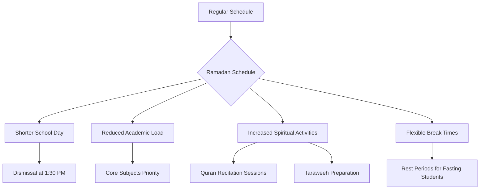
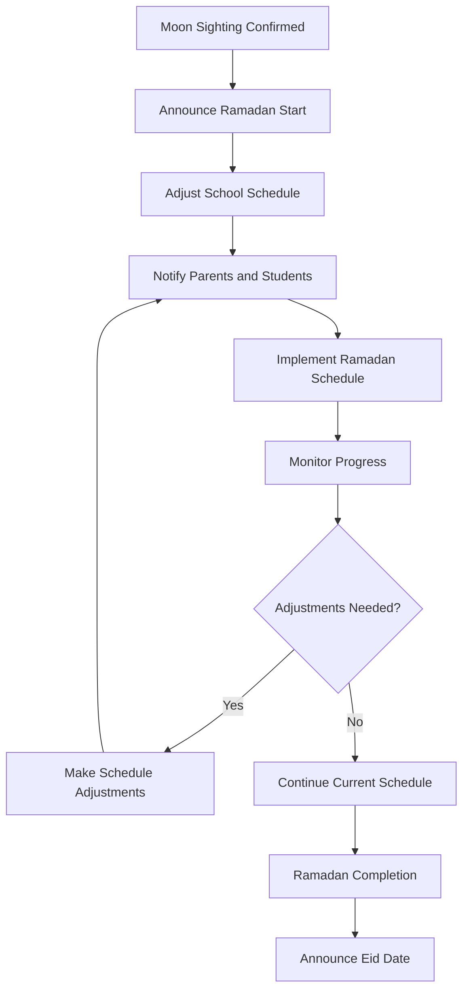

# Ramadan Activities Program

**Document Title:** Ramadan Activities Program
**Document ID:** IS_RAP_002
**Version:** 1.0
**Date:** 2026-01-11
**Project Name:** Smart Academy Digital Web Portal Development
**Content Category:** Islamic Studies Content

---

## Table of Contents

1. [Overview](#1-overview)
2. [Program Objectives](#2-program-objectives)
3. [Program Structure](#3-program-structure)
4. [Activities & Events](#4-activities--events)
5. [Schedule & Timing](#5-schedule--timing)
6. [Participation & Eligibility](#6-participation--eligibility)
7. [Resources & Materials](#7-resources--materials)
8. [Assessment & Recognition](#8-assessment--recognition)
9. [Parent Engagement](#9-parent-engagement)
10. [FAQs](#10-faqs)

---

## 1. Overview

The Ramadan Activities Program at Smart Academy creates a spiritually enriching environment during the blessed month of Ramadan, enabling students to experience the beauty and benefits of fasting, increased worship, and community service. This comprehensive program adapts the school schedule to accommodate fasting students while providing age-appropriate opportunities for spiritual growth, Quran engagement, and charitable activities.

### 1.1 Philosophy

Ramadan is the month in which the Quran was revealed as guidance for humanity:

> "The month of Ramadan is that in which was revealed the Quran, a guidance for the people and clear proofs of guidance and criterion." - Quran 2:185

Fasting in Ramadan is one of the five pillars of Islam:

> "O you who have believed, decreed upon you is fasting as it was decreed upon those before you that you may become righteous." - Quran 2:183

The Prophet Muhammad (peace be upon him) said:

> "When Ramadan begins, the gates of Paradise are opened and the gates of Hell are closed, and the devils are chained up." - Sahih Bukhari, Book 30, Hadith 1899

### 1.2 Goals

- **Spiritual Goals**: Deepen connection with Allah through increased worship and reflection
- **Knowledge Goals**: Understand the significance, rulings, and virtues of Ramadan
- **Character Goals**: Develop patience, self-discipline, empathy, and generosity
- **Community Goals**: Strengthen bonds through shared fasting and charitable activities
- **Academic Goals**: Maintain learning progress while accommodating fasting students

---

## 2. Program Objectives

### 2.1 Knowledge Objectives

By the end of the Ramadan program, students will be able to:

- Explain the significance and virtues of Ramadan
- Understand the rulings and conditions of fasting (Sawm)
- Identify the times for Suhoor (pre-dawn meal) and Iftar (breaking fast)
- Recognize the importance of Laylat al-Qadr (Night of Decree)
- Understand the concept of Zakat al-Fitr (obligatory charity before Eid)
- Learn about the Prophet's (peace be upon him) Ramadan practices

### 2.2 Skill Objectives

Students will demonstrate proficiency in:

- Performing fasting according to Islamic guidelines
- Reciting and understanding selected Quranic verses
- Performing Taraweeh prayers (night prayers during Ramadan)
- Making appropriate Du'a (supplications) for Ramadan
- Participating in charitable activities and community service
- Managing time effectively for worship and academic responsibilities

### 2.3 Character Objectives

Students will develop:

- **Sabr (Patience)**: Enduring hunger and thirst with patience
- **Shukr (Gratitude)**: Appreciating blessings through fasting
- **Taqwa (God-consciousness)**: Increasing awareness of Allah's presence
- **Ikhlas (Sincerity)**: Fasting solely for Allah's pleasure
- **Rahma (Compassion)**: Empathizing with those less fortunate
- **Amanah (Trustworthiness)**: Fulfilling the obligation of fasting
- **Karam (Generosity)**: Giving charity and helping others

### 2.4 Re-STEAM Integration

- **Science Connection**: Understanding the physiological effects of fasting on the body
- **Technology Connection**: Using Ramadan apps for prayer times, Quran reading, and tracking
- **Mathematics Connection**: Calculating Zakat amounts and understanding Islamic calendar
- **Arts Connection**: Creating Ramadan decorations, calligraphy, and Islamic crafts
- **Engineering Connection**: Designing solutions for community service projects

---

## 3. Program Structure

### 3.1 Ramadan Schedule Adjustments

The school schedule is modified during Ramadan to accommodate fasting students:

### 3.2 Daily Ramadan Schedule

| Time | Activity | Duration | Notes |
|------|----------|----------|-------|
| 8:00 AM | School Arrival | - | Students arrive energized |
| 8:30 AM | Morning Assembly | 15 min | Ramadan-themed assembly |
| 8:45 AM | Academic Period 1 | 45 min | Core subject focus |
| 9:30 AM | Quran Recitation | 30 min | Increased Quran time |
| 10:00 AM | Break | 20 min | Rest period for fasting students |
| 10:20 AM | Academic Period 2 | 45 min | Core subject focus |
| 11:05 AM | Islamic Studies | 40 min | Ramadan-specific lessons |
| 11:45 AM | Dhuhr Prayer | 20 min | Congregational prayer |
| 12:05 PM | Ramadan Activity | 25 min | Varies by day |
| 12:30 PM | Dismissal | - | Early dismissal for Iftar preparation |

### 3.3 Age-Appropriate Fasting Guidelines

#### Early Childhood (3-6 years)

- **Fasting**: Not required, encouraged to participate in "training fasts"
- **Training Fasts**: Half-day fasts (e.g., until lunch)
- **Focus**: Learning about Ramadan through stories and activities
- **Activities**: Ramadan crafts, simple Du'as, helping with Iftar preparation
- **Nutrition**: Regular meals provided with special Ramadan treats

#### Primary Level (6-11 years)

- **Fasting**: Encouraged with parental guidance
- **Gradual Approach**: Start with partial fasts, progress to full fasts
- **Age 8-9**: Half-day fasts recommended
- **Age 10-11**: Full-day fasts encouraged with parental approval
- **Support**: Monitoring and encouragement from teachers
- **Activities**: Quran memorization, charity projects, Ramadan competitions

#### Secondary Level (11-16 years)

- **Fasting**: Full-day fasts expected with parental support
- **Leadership**: Role models for younger students
- **Responsibilities**: Assisting with Ramadan activities and Taraweeh
- **Advanced Activities**: Quran Tafseer, Islamic lectures, community service
- **Preparation**: Understanding fasting exemptions and making up missed fasts

### 3.4 Program Components

#### Spiritual Development

- **Increased Quran Recitation**: Daily Quran reading sessions
- **Taraweeh Prayers**: Night prayers during Ramadan
- **Dhikr Sessions**: Collective remembrance of Allah
- **Du'a Workshops**: Learning special Ramadan supplications
- **Laylat al-Qadr Preparation**: Special activities for the last ten nights

#### Educational Activities

- **Ramadan Lessons**: Age-appropriate Islamic studies content
- **Quran Tafseer**: Understanding selected Quranic verses
- **Islamic History**: Stories of the Prophet (peace be upon him) and companions
- **Fiqh of Fasting**: Learning the rulings of fasting
- **Character Building**: Focus on Ramadan-specific character traits

#### Community Service

- **Charity Projects**: Organizing food drives and donations
- **Community Iftar**: Hosting Iftar for community members
- **Volunteer Activities**: Helping those in need
- **Zakat al-Fitr Collection**: Gathering obligatory charity
- **Environmental Projects**: Cleaning and beautifying the community

#### Social Activities

- **Ramadan Competitions**: Quran recitation, knowledge, and art contests
- **Group Iftar**: Breaking fast together at school (optional)
- **Eid Preparation**: Planning and organizing Eid celebrations
- **Family Events**: Ramadan-themed family activities
- **Cultural Exchange**: Sharing Ramadan traditions

---

## 4. Activities & Events

### 4.1 Daily Activities

#### Morning Ramadan Assembly

- **Daily Theme**: Focus on different aspects of Ramadan
- **Quran Recitation**: Selected verses read by students
- **Hadith Sharing**: Prophetic traditions about Ramadan
- **Student Reflections**: Students share their Ramadan experiences
- **Motivational Talk**: Short inspirational message

#### Quran Recitation Sessions

- **Daily Reading**: Increased Quran reading time
- **Memorization Goals**: Set individual Quran memorization targets
- **Tajweed Focus**: Improving Quranic recitation
- **Group Recitation**: Collective Quran reading
- **Progress Tracking**: Monitoring Quran completion goals

#### Ramadan-Themed Lessons

- **Islamic Studies**: Special Ramadan curriculum
- **Character Education**: Focus on Ramadan virtues
- **History**: Stories from Islamic history related to Ramadan
- **Science**: Understanding the benefits of fasting
- **Art**: Ramadan crafts and decorations

### 4.2 Weekly Activities

#### Charity Week

- **Food Drive**: Collecting non-perishable food items
- **Clothing Collection**: Gathering clothes for those in need
- **Fundraising**: Organizing charity events
- **Community Service**: Volunteering in the community
- **Zakat Education**: Teaching about Islamic charity

#### Quran Competition Week

- **Recitation Contest**: Quran recitation competition by age group
- **Memorization Challenge**: Quran memorization competition
- **Tajweed Competition**: Focus on proper recitation rules
- **Tafseer Quiz**: Understanding Quranic meanings
- **Awards Ceremony**: Recognition of winners

#### Knowledge Competition

- **Ramadan Quiz**: Testing Ramadan knowledge
- **Islamic Trivia**: General Islamic knowledge competition
- **Hadith Competition**: Memorizing and understanding Hadith
- **Islamic History Quiz**: Questions about Islamic history
- **Team Challenges**: Group-based knowledge activities

#### Community Service Week

- **Neighborhood Cleanup**: Cleaning local areas
- **Elderly Assistance**: Helping elderly community members
- **Tree Planting**: Environmental service project
- **School Improvement**: Enhancing school facilities
- **Charity Distribution**: Delivering collected items to those in need

### 4.3 Special Events

#### Ramadan Kickoff Event

- **Purpose**: Welcome Ramadan with enthusiasm
- **Activities**: Special assembly, decorations, Ramadan calendar introduction
- **Guest Speaker**: Islamic scholar or community leader
- **Parent Invitation**: Parents welcome to attend
- **Ramadan Pledge**: Students commit to Ramadan goals

#### Laylat al-Qadr Celebration

- **Significance**: Seeking the Night of Decree (odd nights in last 10 days)
- **Activities**: Extended worship, Quran recitation, special prayers
- **Iftar Gathering**: Breaking fast together
- **Spiritual Talks**: Lectures on Laylat al-Qadr
- **Late Night Program**: Extended program until midnight

#### Eid al-Fitr Preparation

- **Planning**: Organizing Eid celebration activities
- **Decorations**: Creating Eid decorations
- **Gift Exchange**: Students exchange small gifts
- **Charity Distribution**: Distributing Zakat al-Fitr
- **Eid Cards**: Making Eid cards for family and community

#### Eid al-Fitr Celebration

- **Eid Prayer**: Special Eid prayer at school or local mosque
- **Celebration Activities**: Games, food, and entertainment
- **Awards Ceremony**: Recognizing Ramadan achievements
- **Family Event**: Parents and families invited
- **Community Gathering**: Open to the wider community

### 4.4 Taraweeh Program

#### Taraweeh Prayers

- **Schedule**: Evening prayers during Ramadan
- **Location**: School Musalla or local mosque
- **Leadership**: Student Imams lead portions of Taraweeh
- **Quran Completion**: Goal to complete Quran recitation during Taraweeh
- **Age Groups**: Separate sessions for different age groups

#### Taraweeh Preparation

- **Quran Practice**: Students practice Quran portions for Taraweeh
- **Imam Training**: Training students to lead Taraweeh prayers
- **Recitation Improvement**: Focus on Tajweed and memorization
- **Understanding**: Learning the meaning of recited verses

---

## 5. Schedule & Timing

### 5.1 Ramadan Calendar

The program follows the Islamic Hijri calendar, with dates adjusted based on moon sighting:

| Activity | Timing | Duration | Notes |
|----------|--------|----------|-------|
| Ramadan Start | 1st Ramadan | - | Based on moon sighting |
| School Schedule Adjustment | 1st Ramadan | Throughout Ramadan | Modified daily schedule |
| Quran Recitation Goals | Throughout Ramadan | Daily | Individual targets set |
| Charity Weeks | Weeks 2 & 3 | 1 week each | Different focus each week |
| Quran Competition | Week 3 | 3 days | Various categories |
| Laylat al-Qadr Search | Last 10 nights | Odd nights emphasized | Extended worship |
| Eid al-Fitr | 1st Shawwal | - | Based on moon sighting |
| Eid Celebration | 1st Shawwal | Full day | School celebration |

### 5.2 Daily Fasting Schedule

| Activity | Time | Description |
|----------|------|-------------|
| Suhoor | Before Fajr | Pre-dawn meal, stop eating at Fajr time |
| Fajr Prayer | At Fajr time | Begin fasting from Fajr |
| School Day | 8:00 AM - 1:30 PM | Modified schedule for fasting students |
| Dhuhr Prayer | 1:00 PM | Midday prayer |
| Dismissal | 1:30 PM | Students go home for Iftar preparation |
| Asr Prayer | At Asr time | Afternoon prayer |
| Iftar | At Maghrib time | Break fast with dates and water |
| Maghrib Prayer | At Maghrib time | Sunset prayer |
| Isha Prayer | At Isha time | Night prayer |
| Taraweeh | After Isha | Optional night prayers (20 Rak'ah) |
| Suhoor Preparation | Before Fajr | Prepare for next day's fast |

### 5.3 Special Day Schedules

#### Fridays (Jumu'ah)

- **Jumu'ah Prayer**: Special Friday prayer at local mosque
- **Khutbah**: Sermon focused on Ramadan themes
- **Early Dismissal**: Students dismissed after Jumu'ah
- **Family Time**: Extended time for family Iftar preparation

#### Laylat al-Qadr Nights

- **Extended Hours**: School remains open until midnight
- **Intensive Worship**: Extended Quran recitation and prayers
- **Iftar Provided**: School provides Iftar for participants
- **Spiritual Talks**: Special lectures on Laylat al-Qadr
- **Family Participation**: Parents encouraged to join

#### Eid Day

- **Eid Prayer**: Special prayer at school or mosque
- **Celebration**: Full day of festivities
- **No Academic Activities**: Focus on celebration and community
- **Family Event**: Parents and families invited
- **Community Gathering**: Open to wider community

### 5.4 Schedule Adjustment Process

---

## 6. Participation & Eligibility

### 6.1 Fasting Participation

#### Mandatory Fasting

- **Secondary Students (11-16 years)**: Expected to fast with parental support
- **Primary Students (8-11 years)**: Encouraged to fast with parental guidance
- **Religious Obligation**: Fasting is obligatory for Muslim adults

#### Voluntary Fasting

- **Primary Students (6-8 years)**: May participate in training fasts
- **Early Childhood (3-6 years)**: Not required to fast, participate in activities

#### Exemptions from Fasting

- **Medical Exemptions**: Students with health conditions
- **Travel Exemptions**: Students traveling during Ramadan
- **Age Exemptions**: Young children not yet obligated
- **Make-up Fasts**: Students must make up missed fasts when able

### 6.2 Activity Participation

#### Required Activities

- **Ramadan-Themed Lessons**: All students participate
- **Morning Assembly**: Daily attendance required
- **Quran Recitation**: Age-appropriate participation
- **Character Education**: All students engaged

#### Voluntary Activities

- **Taraweeh Prayers**: Optional for students
- **Extended Worship**: Laylat al-Qadr participation optional
- **Community Service**: Voluntary but encouraged
- **Charity Projects**: Optional participation

#### Special Considerations

- **Non-Fasting Students**: Alternative activities provided
- **Special Needs**: Accommodations made as needed
- **Religious Diversity**: Respectful inclusion of all students
- **Parental Choice**: Parents decide fasting participation for younger children

### 6.3 Eligibility for Competitions

#### Quran Recitation Competition

- **Age Groups**: Separate categories for each age level
- **Requirements**: Memorization of specified Surahs
- **Tajweed**: Proper recitation rules required
- **Preparation**: Practice sessions provided

#### Knowledge Competition

- **Age Groups**: Age-appropriate questions
- **Topics**: Ramadan, Quran, Hadith, Islamic history
- **Team or Individual**: Both formats available
- **Preparation**: Study materials provided

#### Art and Craft Competition

- **Categories**: Ramadan decorations, calligraphy, crafts
- **Age Groups**: Different requirements by age
- **Materials**: Provided by school
- **Judging**: Creativity, Islamic content, effort

### 6.4 Leadership Opportunities

#### Student Ramadan Ambassadors

- **Selection**: Based on character, leadership, and Islamic knowledge
- **Role**: Assist with Ramadan activities, mentor younger students
- **Responsibilities**: Lead activities, help organize events
- **Recognition**: Special certificate and badge

#### Taraweeh Imams

- **Eligibility**: Secondary students with excellent Quran recitation
- **Selection**: Based on Quran memorization and recitation quality
- **Training**: Special Imam training provided
- **Responsibilities**: Lead portions of Taraweeh prayers

#### Charity Coordinators

- **Role**: Organize charity collections and distributions
- **Eligibility**: Students demonstrating leadership and compassion
- **Responsibilities**: Coordinate charity projects, track donations
- **Recognition**: Service hours and leadership certificate

---

## 7. Resources & Materials

### 7.1 Educational Resources

#### Student Materials

- **Ramadan Guide Booklets**: Age-appropriate Ramadan information
- **Quran Booklets**: Selected Surahs for memorization
- **Du'a Collections**: Ramadan supplications
- **Activity Books**: Ramadan-themed educational activities
- **Progress Trackers**: Charts for tracking Ramadan goals

#### Teacher Resources

- **Ramadan Curriculum**: Detailed lesson plans
- **Teaching Guides**: Instructions for Ramadan activities
- **Assessment Tools**: Rubrics for evaluating student progress
- **Presentation Materials**: Slides and visual aids
- **Parent Communication Templates**: Letters and information sheets

### 7.2 Physical Resources

#### Prayer and Worship

- **Prayer Mats**: Additional mats for extended prayers
- **Quran Copies**: Enough copies for all students
- **Prayer Space**: Extended use of Musalla
- **Wudu Facilities**: Enhanced facilities for increased use
- **Prayer Clocks**: Ramadan prayer time displays

#### Activity Supplies

- **Art Supplies**: Materials for Ramadan crafts and decorations
- **Competition Materials**: Supplies for various competitions
- **Charity Collection Boxes**: For collecting donations
- **Decorations**: Ramadan-themed decorations for school
- **Iftar Supplies**: For school Iftar events

### 7.3 Digital Resources

#### Ramadan Applications

- **Prayer Time Apps**: Installed on school devices
- **Quran Apps**: Digital Quran with recitation and translation
- **Ramadan Tracker Apps**: For tracking fasting and worship
- **Educational Videos**: Instructional videos about Ramadan
- **Interactive Games**: Ramadan-themed educational games

#### Online Resources

- **Ramadan Portal**: School website section with Ramadan resources
- **Parent Portal**: Access to Ramadan schedules and student progress
- **Virtual Activities**: Online Ramadan activities for remote learning
- **Islamic Content Library**: Digital library of Ramadan resources

### 7.4 Community Resources

#### Mosque Partnerships

- **Imam Visits**: Regular visits from local Islamic scholars
- **Mosque Tours**: Educational visits during Ramadan
- **Community Iftar**: Participation in community Iftar events
- **Taraweeh Prayers**: Joint prayers at local mosques

#### Parent Resources

- **Home Ramadan Guide**: Instructions for family Ramadan activities
- **Recipe Collection**: Healthy Suhoor and Iftar recipes
- **Family Activity Ideas**: Suggestions for home Ramadan activities
- **Q&A Sessions**: Regular opportunities for parent questions

---

## 8. Assessment & Recognition

### 8.1 Assessment Methods

#### Daily Assessment

- **Fasting Tracking**: Record of student fasting participation
- **Quran Progress**: Daily Quran recitation tracking
- **Activity Participation**: Engagement in Ramadan activities
- **Behavior Observation**: Character development assessment

#### Weekly Assessment

- **Goal Review**: Check progress on Ramadan goals
- **Quran Memorization**: Assessment of memorized portions
- **Knowledge Check**: Short quizzes on Ramadan topics
- **Character Evaluation**: Observation of Ramadan virtues

#### Monthly Assessment

- **Comprehensive Review**: Full evaluation of Ramadan participation
- **Achievement Recognition**: Identification of outstanding students
- **Parent Feedback**: Input on home Ramadan activities
- **Program Evaluation**: Assessment of program effectiveness

### 8.2 Assessment Criteria

#### Fasting Participation

- **Consistency**: Regular fasting throughout Ramadan
- **Attitude**: Positive approach to fasting
- **Perseverance**: Maintaining fast despite challenges
- **Spiritual Focus**: Understanding the purpose of fasting

#### Quran Engagement

- **Recitation Quality**: Proper Tajweed and pronunciation
- **Memorization**: Amount of Quran memorized
- **Understanding**: Comprehension of recited verses
- **Consistency**: Regular Quran reading

#### Character Development

- **Patience**: Demonstrating Sabr during fasting
- **Generosity**: Participation in charity activities
- **Discipline**: Maintaining Ramadan routines
- **Respect**: Proper behavior during Ramadan

### 8.3 Recognition System

#### Daily Recognition

- **Fasting Star**: Recognition for daily fasting
- **Quran Achiever**: Praise for Quran recitation progress
- **Good Deed**: Acknowledgment of charitable acts
- **Character Note**: Recognition for demonstrating Ramadan virtues

#### Weekly Recognition

- **Fasting Champion**: Student with best fasting consistency
- **Quran Star**: Outstanding Quran recitation
- **Charity Hero**: Exceptional participation in charity
- **Character Award**: Demonstrating Ramadan character traits

#### Monthly Recognition

- **Ramadan Excellence Award**: Outstanding overall participation
- **Quran Completion**: Completing Quran memorization goals
- **Community Service Award**: Exceptional charity work
- **Leadership Award**: Student leadership in Ramadan activities

#### End of Ramadan Recognition

- **Ramadan Achievement Certificate**: Year-end recognition
- **Quran Competition Winners**: Awards for competition winners
- **Character Excellence**: Outstanding character development
- **Perfect Fasting**: Recognition for consistent fasting

### 8.4 Award Categories

| Award | Criteria | Age Group | Recognition |
|-------|----------|-----------|-------------|
| Fasting Star | Daily fasting participation | All | Verbal praise, sticker |
| Quran Achiever | Quran recitation progress | All | Certificate, bookmark |
| Charity Hero | Exceptional charity work | All | Certificate, badge |
| Character Award | Demonstrating virtues | All | Certificate, medal |
| Ramadan Excellence | Outstanding participation | All | Certificate, trophy |
| Quran Winner | Quran competition winner | All | Certificate, prize |
| Leadership Award | Student leadership | 11-16 years | Certificate, special role |
| Perfect Fasting | Consistent fasting | 8-16 years | Certificate, recognition |

---

## 9. Parent Engagement

### 9.1 Communication Channels

#### Regular Updates

- **Ramadan Newsletter**: Weekly newsletter with Ramadan updates
- **Prayer Time Schedules**: Monthly prayer time calendars
- **Event Notifications**: Information about special Ramadan events
- **Progress Reports**: Student progress on Ramadan goals

#### Digital Communication

- **Parent Portal**: Online access to student Ramadan records
- **SMS/WhatsApp Updates**: Daily reminders and notices
- **Email Updates**: Regular email communications
- **School Website**: Ramadan program information and resources

### 9.2 Parent Workshops

#### Ramadan Preparation Workshop

- **Understanding Ramadan**: Importance and benefits of Ramadan
- **Fasting Guidelines**: Age-appropriate fasting recommendations
- **Home Preparation**: Creating Ramadan-friendly home environment
- **Suhoor and Iftar**: Healthy meal planning for fasting

#### Family Ramadan Activities

- **Family Prayer**: Establishing family Taraweeh at home
- **Quran Reading**: Family Quran reading sessions
- **Charity Projects**: Family charity activities
- **Ramadan Traditions**: Creating family Ramadan traditions

### 9.3 Family Ramadan Activities

#### Home Fasting Support

- **Suhoor Preparation**: Ideas for healthy pre-dawn meals
- **Iftar Ideas**: Nutritious and traditional Iftar recipes
- **Family Prayer**: Guidelines for family Taraweeh
- **Dhikr Resources**: Family remembrance activities

#### Special Family Events

- **Family Iftar**: Evening Iftar at school with families
- **Eid Celebration**: Family participation in Eid festivities
- **Ramadan Night**: Special evening program for families
- **Community Iftar**: Family participation in community events

### 9.4 Volunteer Opportunities

#### Ramadan Supervision

- **Parent Volunteers**: Assist with Ramadan activities
- **Iftar Preparation**: Help prepare school Iftar events
- **Charity Distribution**: Assist with delivering donations
- **Event Support**: Help organize special Ramadan events

#### Resource Contribution

- **Food Donations**: Contribute to charity food drives
- **Ramadan Supplies**: Donate decorations and materials
- **Expertise Sharing**: Parents share Ramadan knowledge
- **Community Connections**: Facilitate community partnerships

### 9.5 Parent Feedback

#### Feedback Channels

- **Parent Surveys**: Post-Ramadan survey on program effectiveness
- **Parent-Teacher Meetings**: Discuss student Ramadan progress
- **Suggestion Box**: Anonymous feedback and suggestions
- **Focus Groups**: Regular parent input sessions

#### Continuous Improvement

- **Program Review**: Annual review based on parent feedback
- **Adjustment Implementation**: Changes based on suggestions
- **Success Stories**: Share positive experiences with community
- **Challenge Addressing**: Resolve concerns and difficulties

---

## 10. FAQs

### 10.1 General Questions

**Q: Is fasting mandatory for all students?**

A: Fasting is obligatory for Muslim adults. For students, we follow age-appropriate guidelines: Early Childhood (3-6 years) are not required to fast, Primary (6-11 years) are encouraged with parental guidance, and Secondary (11-16 years) are expected to fast with parental support.

**Q: What if my child cannot fast for medical reasons?**

A: Students with medical conditions are exempt from fasting. A parental note from a healthcare provider is required. These students can still participate in all Ramadan activities and focus on other forms of worship.

**Q: How does the school schedule change during Ramadan?**

A: The school day is shortened to 8:00 AM - 1:30 PM to accommodate fasting students. Academic load is reduced, and increased time is allocated for Quran recitation, Islamic studies, and Ramadan activities.

### 10.2 Fasting-Specific Questions

**Q: What are the fasting hours?**

A: Fasting begins at Fajr (dawn) and ends at Maghrib (sunset). Students eat Suhoor (pre-dawn meal) before Fajr and break their fast at Iftar (Maghrib time).

**Q: Can students drink water during school hours?**

A: Fasting students abstain from food and drink from Fajr to Maghrib. Non-fasting students have access to water and snacks as needed.

**Q: What if a student accidentally breaks their fast?**

A: If a student accidentally breaks their fast, they should continue fasting for the remainder of the day and make up the missed fast later. This is a learning opportunity, and students are not punished for mistakes.

### 10.3 Activity-Specific Questions

**Q: Are non-Muslim students required to participate in Ramadan activities?**

A: While Ramadan activities are designed for Muslim students, all students are welcome to participate in the educational and cultural aspects. Non-Muslim students may observe and learn about Ramadan without fasting.

**Q: What happens during Taraweeh prayers?**

A: Taraweeh are special night prayers performed during Ramadan. Students may participate at school or with their families at local mosques. The prayers involve reciting portions of the Quran.

**Q: How are Quran competitions organized?**

A: Quran competitions are organized by age group with different categories: recitation, memorization, and Tajweed. Students prepare with guidance from teachers, and winners receive recognition and prizes.

### 10.4 Parent Involvement Questions

**Q: How can I support my child during Ramadan?**

A: Parents can support by ensuring healthy Suhoor and Iftar meals, creating a Ramadan-friendly home environment, encouraging Quran reading, and participating in family Ramadan activities.

**Q: Can parents attend Ramadan events at school?**

A: Yes, parents are welcome to attend special Ramadan events including the kickoff celebration, Laylat al-Qadr programs, Eid celebrations, and family Iftar events.

**Q: How will I know about my child's Ramadan progress?**

A: We provide regular updates through the parent portal, weekly newsletters, and parent-teacher meetings. Parents can track their child's fasting participation, Quran progress, and activity engagement.

### 10.5 Special Situations Questions

**Q: What if Ramadan falls during exam periods?**

A: The school schedule is designed to avoid major conflicts. If exams occur during Ramadan, accommodations are made including extended time, flexible scheduling, and reduced academic load.

**Q: How is Eid al-Fitr celebrated at school?**

A: Eid al-Fitr is celebrated with a special Eid prayer, festive activities, awards ceremony recognizing Ramadan achievements, and a community gathering with food and entertainment.

**Q: What is Zakat al-Fitr and how is it collected?**

A: Zakat al-Fitr is obligatory charity given before Eid prayer. The school collects Zakat al-Fitr from families and distributes it to those in need in the community.

---

## Document Approval

| Role | Name | Signature | Date |
|------|------|-----------|------|
| Islamic Studies Coordinator | | _________________ | ________ |
| Principal | | _________________ | ________ |
