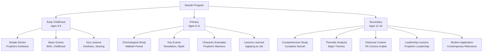
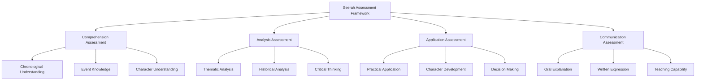

# Seerah Curriculum

**Document Title:** Seerah Curriculum
**Document ID:** IS_007
**Version:** 1.0
**Date:** 2026-01-11
**Project Name:** Smart Academy Digital Web Portal Development
**Content Category:** Islamic Studies Content

---

## Table of Contents

1. [Overview](#1-overview)
2. [Learning Objectives](#2-learning-objectives)
3. [Curriculum Structure](#3-curriculum-structure)
4. [Teaching Methodology](#4-teaching-methodology)
5. [Assessment & Evaluation](#5-assessment--evaluation)
6. [Resources & Materials](#6-resources--materials)
7. [Integration with Other Subjects](#7-integration-with-other-subjects)
8. [Parent Engagement](#8-parent-engagement)
9. [Technology Integration](#9-technology-integration)
10. [FAQs](#10-faqs)

---

## 1. Overview

The Seerah (biography of Prophet Muhammad PBUH) program at Smart Academy is designed to introduce students to the life, character, and teachings of the final Prophet of Islam. Seerah provides a comprehensive understanding of how Prophet Muhammad (PBUH) implemented Islam in his daily life, faced challenges, and established the Islamic community. Our program guides students from simple stories of the Prophet's life to comprehensive study of his biography, enabling students to learn from his example and develop love and reverence for him.

### 1.1 Philosophy

The Seerah program is founded on these fundamental principles:

- **Prophetic Model**: Prophet Muhammad (PBUH) is the perfect role model for all humanity. Allah (SWT) states in Quran 33:21: "There has certainly been for you in the Messenger of Allah an excellent pattern."

- **Love and Reverence**: Learning Seerah fosters love and reverence for Prophet (PBUH). The Prophet (PBUH) said: "None of you truly believes until I am more beloved to him than his father, his children, and all people." (Sahih Bukhari, Book 2, Hadith 14)

- **Practical Example**: Seerah provides practical examples of how to implement Islamic teachings in daily life. The Prophet (PBUH) was described as "a walking Quran" by Aisha (RA).

- **Historical Context**: Understanding Seerah requires understanding the historical context of 7th century Arabia and the challenges faced by early Muslims.

- **Lifelong Inspiration**: The lessons from Seerah provide lifelong inspiration and guidance for facing life's challenges.

### 1.2 Goals

The Seerah program aims to achieve the following goals:

1. **Biographical Knowledge**: Enable students to learn the life story of Prophet Muhammad (PBUH) at an appropriate level for their age and development.

2. **Character Development**: Help students develop Islamic character by learning from the Prophet's example.

3. **Historical Understanding**: Teach students the historical context of the Prophet's life and the early Islamic period.

4. **Practical Application**: Guide students to apply lessons from Seerah in their daily lives, character, and decision-making.

5. **Love for Prophet**: Foster deep love and reverence for Prophet Muhammad (PBUH).

6. **Critical Thinking**: Develop students' ability to reflect on and analyze events from Seerah.

7. **Teaching Capability**: Prepare students to explain Seerah to others.

8. **Integration**: Connect Seerah with Quran, Hadith, and other Islamic studies.

### 1.3 Program Structure

The Seerah program progresses through three developmental levels:

---

## 2. Learning Objectives

### 2.1 Knowledge Objectives

By the end of each level, students will demonstrate knowledge of:

#### Early Childhood (Ages 3-6)
- Basic stories about Prophet Muhammad (PBUH) from his childhood
- Prophet's kindness to children and animals
- Basic events: Birth in Makkah, first revelation
- Prophet's character: kindness, honesty, patience
- Simple lessons from Seerah: sharing, helping others, being kind

#### Primary (Ages 6-11)
- Chronological study of Prophet's life in Makkah
- Key events: First revelation, persecution, Hijrah to Madinah
- Prophet's character and manners in detail
- Stories of the Prophet's patience, courage, and wisdom
- Lessons from Seerah applicable to daily life
- Important companions of the Prophet

#### Secondary (Ages 11-16)
- Comprehensive study of complete Seerah from birth to passing
- Detailed understanding of major events and their significance
- Historical context of 7th century Arabia
- Prophet's leadership qualities and strategies
- Thematic analysis of major Seerah themes
- Application of Seerah lessons to contemporary issues
- Comparative study of different Seerah sources

### 2.2 Skills Objectives

Students will develop the following Seerah-specific skills:

#### Comprehension Skills
- **Chronological Understanding**: Understanding the sequence of events in Seerah
- **Contextual Understanding**: Understanding the historical context
- **Character Analysis**: Understanding the Prophet's character traits
- **Lesson Extraction**: Extracting lessons from Seerah events

#### Analysis Skills
- **Thematic Analysis**: Identifying and analyzing Seerah themes
- **Historical Analysis**: Understanding events in historical context
- **Critical Thinking**: Reflecting on and analyzing Seerah events
- **Comparative Analysis**: Comparing different Seerah sources

#### Application Skills
- **Practical Application**: Applying Seerah lessons to daily life
- **Character Development**: Using Seerah for character building
- **Decision Making**: Using Seerah guidance for decision making
- **Communication**: Explaining Seerah to others

### 2.3 Character Objectives

Through Seerah studies, students will develop:

- **Love for Prophet (Hubb)**: Love and reverence for Prophet Muhammad (PBUH)
- **Following Sunnah (Ittiba')**: Following the Prophet's example
- **Patience (Sabr)**: Patience in facing challenges
- **Courage (Shaja'ah)**: Courage in standing for truth
- **Wisdom (Hikmah)**: Wisdom in decision making
- **Compassion (Rahmah)**: Compassion for others
- **Honesty (Sidq)**: Honesty and integrity
- **Humility (Tawadu)**: Humility in success and leadership

---

## 3. Curriculum Structure

### 3.1 Level-Specific Curriculum

#### Early Childhood (Ages 3-6)

| Topic | Key Events | Learning Focus |
|-------|-------------|----------------|
| **Birth** | Birth in Makkah, Year of the Elephant | Prophet's blessed birth |
| **Childhood** | Orphaned, raised by grandfather and uncle | Trust in Allah |
| **First Revelation** | Cave of Hira, Angel Jibreel | Beginning of Prophethood |
| **Early Muslims** | Khadijah, Ali, Abu Bakr, Zayd | First believers |
| **Kindness to Children** | Stories of Prophet with children | Love and kindness |
| **Kindness to Animals** | Stories with cats and other animals | Compassion for all creation |
| **Honesty** | Known as Al-Amin (the Trustworthy) | Importance of honesty |
| **Patience** | Facing persecution with patience | Patience in difficulties |

**Key Lessons**:
- Kindness to everyone
- Trust in Allah
- Honesty and truthfulness
- Patience in difficulties
- Compassion for animals
- Love for family

#### Primary (Ages 6-11)

##### Makkah Period

| Period | Key Events | Learning Focus |
|--------|-------------|----------------|
| **Early Life** | Birth to Prophethood (570-610 CE) | Prophet's character before Islam |
| **First Revelation** | Cave of Hira, 610 CE | Beginning of Prophethood |
| **Early Da'wah** | Secret preaching, first converts | Courage in truth |
| **Open Da'wah** | Public preaching, opposition | Standing for truth |
| **Persecution** | Torture of early Muslims | Patience and perseverance |
| **Boycott** | Boycott of Banu Hashim | Unity and sacrifice |
| **Year of Sadness** | Death of Khadijah and Abu Talib | Trust in Allah |
| **Isra and Mi'raj** | Night journey and ascension | Allah's blessings |
| **Hijrah Preparation** | Planning to migrate to Madinah | Trust and planning |

##### Madinah Period

| Period | Key Events | Learning Focus |
|--------|-------------|----------------|
| **Hijrah** | Migration to Madinah, 622 CE | Sacrifice for Islam |
| **Establishment** | Building mosque and brotherhood | Community building |
| **Battles** | Badr, Uhud, Khandaq | Courage and strategy |
| **Treaties** | Treaty of Hudaybiyyah | Wisdom and diplomacy |
| **Conquest of Makkah** | Peaceful conquest, 630 CE | Victory and forgiveness |
| **Farewell Hajj** | Last sermon, 632 CE | Final guidance |
| **Passing** | Death of Prophet, 632 CE | Legacy and continuation |

##### Character Examples

| Character Trait | Example from Seerah | Lesson |
|----------------|-------------------|--------|
| **Patience** | Persecution in Makkah | Patience in difficulties |
| **Courage** | Standing up to Quraysh | Courage for truth |
| **Wisdom** | Treaty of Hudaybiyyah | Wisdom in diplomacy |
| **Compassion** | Forgiveness at conquest of Makkah | Compassion even to enemies |
| **Humility** | Living simply despite being leader | Humility in leadership |
| **Justice** | Justice between companions | Fairness to all |
| **Generosity** | Giving everything to others | Generosity and sacrifice |
| **Forgiveness** | Forgiving enemies | Forgiveness and mercy |

#### Secondary (Ages 11-16)

##### Comprehensive Seerah Study

| Phase | Period | Key Events | Significance |
|-------|---------|-------------|-------------|
| **Pre-Prophethood** | 570-610 CE | Birth, character, marriage to Khadijah |
| **Makkah Period** | 610-622 CE | Revelation, persecution, early Islamic community |
| **Madinah Period** | 622-632 CE | Establishment, battles, consolidation, final years |

##### Detailed Event Analysis

| Event | Date | Significance | Lessons |
|--------|------|-------------|---------|
| **Birth** | 570 CE | Prophet's blessed birth | Allah's plan |
| **First Revelation** | 610 CE | Beginning of Prophethood | Trust in Allah |
| **First Converts** | 610-611 CE | Early Islamic community | Courage in truth |
| **Persecution** | 615-622 CE | Testing of faith | Patience and perseverance |
| **Hijrah** | 622 CE | New Islamic state | Sacrifice for Islam |
| **Battle of Badr** | 624 CE | First major battle | Trust in Allah |
| **Battle of Uhud** | 625 CE | Lessons from defeat | Obedience to leadership |
| **Battle of Khandaq** | 627 CE | Strategic defense | Wisdom and planning |
| **Treaty of Hudaybiyyah** | 628 CE | Diplomatic victory | Wisdom in compromise |
| **Conquest of Makkah** | 630 CE | Peaceful victory | Forgiveness and mercy |
| **Farewell Hajj** | 632 CE | Final guidance | Complete guidance |
| **Passing** | 632 CE | End of Prophethood | Legacy and continuation |

##### Thematic Analysis

| Theme | Key Events | Lessons |
|-------|-------------|--------|
| **Tawhid** | Revelation, battles, conquest | Complete trust in Allah |
| **Sabr (Patience)** | Persecution, boycott, difficulties | Patience in all situations |
| **Shaja'ah (Courage)** | Standing for truth, battles | Courage for Islam |
| **Hikmah (Wisdom)** | Treaty of Hudaybiyyah, leadership | Wisdom in decision making |
| **Rahmah (Compassion)** | Treatment of companions, forgiveness | Compassion for all |
| **Adl (Justice)** | Justice between all people | Fairness regardless of status |
| **Tawadu (Humility)** | Simple lifestyle despite leadership | Humility in success |
| **Ukhuwwah (Brotherhood)** | Brotherhood in Madinah | Unity among Muslims |
| **Shukr (Gratitude)** | Thanking Allah in all situations | Gratitude in all circumstances |
| **Tawakkul (Trust in Allah)** | Trusting Allah in all decisions | Complete reliance on Allah |

### 3.2 Historical Context

#### Pre-Islamic Arabia (Jahiliyyah)

| Aspect | Description | Relevance to Seerah |
|--------|-------------|---------------------|
| **Tribal System** | Society organized into tribes | Challenges of tribalism |
| **Idol Worship** | Widespread idol worship | Need for Tawhid |
| **Social Injustice** | Oppression of weak, slavery | Need for justice |
| **Female Infanticide** | Burial of daughters | Need for women's rights |
| **Poetry and Culture** | Rich poetic tradition | Use of poetry in da'wah |
| **Trade Routes** | Important trade center | Economic context |
| **Geography** | Desert environment, Makkah as center | Strategic importance |

#### Key Locations

| Location | Significance | Key Events |
|----------|-------------|-------------|
| **Makkah** | Birthplace, Kaaba, center of Islam | Birth, revelation, persecution, conquest |
| **Madinah** | First Islamic state, Prophet's city | Hijrah, establishment, battles |
| **Cave of Hira** | First revelation | Beginning of Prophethood |
| **Cave of Thawr** | Hijrah journey | Trust in Allah |
| **Mount Uhud** | Battle of Uhud | Lessons from defeat |
| **Khandaq (Trench)** | Battle of Khandaq | Strategic defense |
| **Badr** | Battle of Badr | First major victory |

### 3.3 Important Figures

#### Family of the Prophet

| Person | Relationship | Significance |
|--------|--------------|-------------|
| **Abdullah** | Father | Died before Prophet's birth |
| **Aminah** | Mother | Died when Prophet was 6 |
| **Abdul Muttalib** | Grandfather | Raised Prophet after mother's death |
| **Abu Talib** | Uncle | Protected Prophet in Makkah |
| **Khadijah** | First Wife | First believer, supporter, died 619 CE |
| **Aisha** | Wife | Narrated many Hadith, scholar |
| **Fatimah** | Daughter | Beloved daughter, mother of Hasan and Husayn |
| **Hasan & Husayn** | Grandsons | Leaders of youth of Paradise |

#### Key Companions

| Companion | Title | Significance |
|-----------|-------|-------------|
| **Abu Bakr** | As-Siddiq | First male believer, first Caliph |
| **Umar** | Al-Faruq | Second Caliph, strength of Islam |
| **Uthman** | Dhun-Nurayn | Third Caliph, compiled Quran |
| **Ali** | Abu Turab | Fourth Caliph, cousin of Prophet |
| **Bilal** | Mu'adhin | First caller to prayer, endured persecution |
| **Khadijah** | Mother of Believers | First believer, supporter |
| **Aisha** | Mother of Believers | Scholar, narrator of Hadith |
| **Fatimah** | Leader of Women of Paradise | Daughter of Prophet |
| **Zayd ibn Harithah** | Freed slave, adopted son | Example of equality |
| **Mus'ab ibn Umayr** | First ambassador to Madinah | Martyr of Uhud |

---

## 4. Teaching Methodology

### 4.1 Pedagogical Approach

The Seerah program employs a combination of traditional and modern teaching methods:

#### Traditional Methods
- **Storytelling**: Using stories from Seerah to make lessons engaging
- **Memorization**: Memorizing key events and dates
- **Discussion**: Class discussions about Seerah events and lessons
- **Modeling**: Teachers demonstrate implementation of Seerah lessons

#### Modern Methods
- **Interactive Learning**: Use of smart boards, tablets, and multimedia resources
- **Project-Based Learning**: Projects that connect Seerah to real life
- **Critical Thinking**: Encouraging students to reflect and analyze
- **Differentiated Instruction**: Adapting content to different learning levels

### 4.2 Teaching Strategies

#### For Early Childhood (3-6)

| Strategy | Description | Example |
|----------|-------------|---------|
| **Storytelling** | Simple stories from Seerah | Stories of Prophet's kindness |
| **Visual Learning** | Pictures and illustrations | Pictures of Prophet's life |
| **Repetition** | Repeating key events | Repeating Prophet's birth story |
| **Songs and Rhymes** | Islamic songs about Seerah | Songs about Prophet's character |
| **Play-Based Learning** | Games and activities | Role-playing Prophet's kindness |
| **Modeling** | Teachers demonstrate Islamic behavior | Teachers showing kindness |

#### For Primary (6-11)

| Strategy | Description | Example |
|----------|-------------|---------|
| **Interactive Discussion** | Class discussions about Seerah events | Discussing lessons from battles |
| **Timeline Creation** | Creating timeline of Prophet's life | Visualizing Seerah chronology |
| **Story Analysis** | Analyzing stories from Seerah | Discussing lessons from events |
| **Character Study** | Studying Prophet's character traits | Analyzing specific traits |
| **Application Activities** | Applying Seerah lessons to daily life | Role-playing Islamic manners |
| **Group Work** | Collaborative activities | Group projects on Seerah themes |

#### For Secondary (11-16)

| Strategy | Description | Example |
|----------|-------------|---------|
| **Critical Analysis** | Deep examination of Seerah events | Analyzing significance of events |
| **Research Projects** | Independent research on Seerah topics | Research on historical context |
| **Debate and Discussion** | Structured debates on Seerah issues | Discussing contemporary relevance |
| **Comparative Study** | Comparing different Seerah sources | Comparing different biographies |
| **Application Projects** | Applying Seerah lessons to modern life | Creating guides for Islamic leadership |
| **Teaching Practice** | Students teaching younger students | Peer tutoring in Seerah |

### 4.3 Classroom Environment

The Seerah classroom is designed to be:

- **Spiritually Uplifting**: Clean, organized, with Seerah content displayed
- **Interactive**: Encouraging student participation and engagement
- **Respectful**: Environment of reverence for the Prophet's life
- **Technology-Enhanced**: Smart boards, tablets, and digital resources
- **Comfortable**: Appropriate seating for extended discussions
- **Inclusive**: Welcoming to students from all backgrounds

---

## 5. Assessment & Evaluation

### 5.1 Assessment Framework

### 5.2 Assessment Methods

#### Comprehension Assessment

| Criteria | Description | Scoring |
|----------|-------------|---------|
| **Chronological Understanding** | Understanding of sequence of events | 0-20 points |
| **Event Knowledge** | Knowledge of key events | 0-40 points |
| **Character Understanding** | Understanding of Prophet's character | 0-20 points |
| **Historical Context** | Understanding of historical context | 0-20 points |

**Scoring Rubric**:
- **Excellent (90-100)**: Deep understanding of all aspects
- **Very Good (80-89)**: Strong understanding with minor gaps
- **Good (70-79)**: Good understanding with some gaps
- **Satisfactory (60-69)**: Basic understanding with notable gaps
- **Needs Improvement (Below 60)**: Limited understanding

#### Analysis Assessment

| Criteria | Description | Scoring |
|----------|-------------|---------|
| **Thematic Analysis** | Ability to identify and analyze themes | 0-30 points |
| **Historical Analysis** | Ability to understand historical context | 0-30 points |
| **Critical Thinking** | Ability to reflect and analyze | 0-40 points |

**Scoring Rubric**:
- **Excellent (90-100)**: Excellent analytical skills
- **Very Good (80-89)**: Strong analytical skills
- **Good (70-79)**: Good analytical skills
- **Satisfactory (60-69)**: Basic analytical skills
- **Needs Improvement (Below 60)**: Limited analytical skills

#### Application Assessment

| Criteria | Description | Scoring |
|----------|-------------|---------|
| **Practical Application** | Ability to apply Seerah lessons to daily life | 0-40 points |
| **Character Development** | Evidence of character development | 0-30 points |
| **Decision Making** | Using Seerah guidance for decisions | 0-30 points |

**Scoring Rubric**:
- **Excellent (90-100)**: Excellent application of lessons
- **Very Good (80-89)**: Strong application of lessons
- **Good (70-79)**: Good application of lessons
- **Satisfactory (60-69)**: Basic application of lessons
- **Needs Improvement (Below 60)**: Limited application of lessons

#### Communication Assessment

| Criteria | Description | Scoring |
|----------|-------------|---------|
| **Oral Explanation** | Ability to explain Seerah orally | 0-30 points |
| **Written Expression** | Ability to express understanding in writing | 0-30 points |
| **Teaching Capability** | Ability to teach Seerah to others | 0-40 points |

**Scoring Rubric**:
- **Excellent (90-100)**: Excellent communication skills
- **Very Good (80-89)**: Strong communication skills
- **Good (70-79)**: Good communication skills
- **Satisfactory (60-69)**: Basic communication skills
- **Needs Improvement (Below 60)**: Limited communication skills

### 5.3 Level-Based Assessment

#### Early Childhood Assessment

| Component | Criteria | Passing Score |
|-----------|----------|----------------|
| **Simple Stories** | Understanding of simple stories | 70% |
| **Key Events** | Recall of basic events | 70% |
| **Key Lessons** | Understanding of key lessons | 70% |

#### Primary Assessment

| Component | Criteria | Passing Score |
|-----------|----------|----------------|
| **Chronological Study** | Understanding of Prophet's life chronology | 75% |
| **Key Events** | Knowledge of major events | 75% |
| **Character Examples** | Understanding of Prophet's character | 75% |
| **Application** | Application to daily life | 70% |

#### Secondary Assessment

| Component | Criteria | Passing Score |
|-----------|----------|----------------|
| **Comprehensive Seerah** | Understanding of complete Seerah | 80% |
| **Thematic Analysis** | Analysis of major themes | 75% |
| **Historical Context** | Understanding of historical context | 75% |
| **Application** | Application to modern life | 75% |
| **Communication** | Ability to explain Seerah | 70% |

### 5.4 Progress Tracking

Each student maintains a Seerah Progress Portfolio including:

- **Comprehension Record**: Record of comprehension assessments
- **Analysis Record**: Record of analytical work
- **Application Record**: Record of practical applications
- **Communication Record**: Record of oral and written explanations
- **Achievement Certificates**: Recognition of level completion
- **Teacher Feedback**: Regular feedback from Seerah teachers

---

## 6. Resources & Materials

### 6.1 Primary Textbooks

#### Seerah Books
- **Ar-Raheeq Al-Makhtum**: The Sealed Nectar - Prophet's biography
- **Muhammad: His Life Based on Earliest Sources**: Martin Lings
- **The Sealed Nectar**: Biography of the Noble Prophet
- **When the Moon Split**: Biography of Prophet Muhammad

#### Supplementary Books
- **Stories of the Prophets**: For younger students
- **Companions of the Prophet**: Stories of Sahabah
- **Women Around the Messenger**: Stories of female companions

### 6.2 Digital Resources

#### Seerah Applications
- **Seerah Timeline**: Interactive timeline of Prophet's life
- **Seerah Stories**: Stories from Seerah for children
- **Seerah Videos**: Video documentaries on Seerah

#### Online Resources
- **Seerah Websites**: Online resources on Prophet's biography
- **Seerah Lectures**: Video lectures by renowned scholars
- **Seerah Documentaries**: Educational documentaries

### 6.3 Audio and Video Resources

#### Video Resources
- **The Message**: Film about early Islamic history
- **Muhammad: Legacy of a Prophet**: PBS documentary
- **Seerah Series**: Comprehensive Seerah video series
- **Animated Stories**: Animated stories for children

#### Audio Resources
- **Seerah Audio**: Audio stories from Seerah
- **Seerah Lectures**: Lectures on Seerah topics
- **Podcasts**: Islamic podcasts on Seerah topics

### 6.4 Supplementary Materials

#### Teaching Aids
- **Flashcards**: Key events, characters, lessons
- **Posters**: Seerah timeline, character traits
- **Charts**: Chronological charts, maps
- **Visual Aids**: Pictures and illustrations for Seerah stories

#### Assessment Tools
- **Rubrics**: Detailed criteria for assessment
- **Checklists**: Progress tracking for Seerah skills
- **Portfolios**: Student work samples and achievements
- **Progress Reports**: Regular communication with parents

---

## 7. Integration with Other Subjects

### 7.1 Re-STEAM Integration

The Seerah program integrates with STEAM subjects through the Re-STEAM framework:

#### Science Integration

| Seerah Concept | Science Connection | Example Activities |
|----------------|-------------------|-------------------|
| Medicine | Health Science | Study of Prophetic medicine |
| Geography | Earth Science | Study of Arabian geography |
| Astronomy | Science | Study of Isra and Mi'raj |

#### Technology Integration

| Seerah Concept | Technology Connection | Example Activities |
|----------------|-------------------|-------------------|
| Communication | Information Technology | Study how message was spread |
| Seerah Apps | Digital Technology | Use apps for Seerah study |
| Online Resources | Internet Technology | Accessing Seerah resources online |

#### Engineering Integration

| Seerah Concept | Engineering Connection | Example Activities |
|----------------|-------------------|-------------------|
| Architecture | Structural Engineering | Study of early mosque architecture |
| Water Management | Civil Engineering | Study water management in Madinah |

#### Arts Integration

| Seerah Concept | Arts Connection | Example Activities |
|----------------|----------------|-------------------|
| Calligraphy | Visual Arts | Learning Arabic calligraphy |
| Nasheeds | Performing Arts | Islamic songs about Seerah |
| Storytelling | Language Arts | Creative writing based on Seerah |

#### Mathematics Integration

| Seerah Concept | Mathematics Connection | Example Activities |
|----------------|-------------------|-------------------|
| Dates and Timeline | Number Theory | Study of Seerah chronology |
| Numbers in Seerah | Mathematics | Study of numbers mentioned in Seerah |

### 7.2 Cross-Curricular Projects

Students engage in projects that integrate Seerah with other subjects:

- **Seerah Science Fair**: Projects on Prophetic medicine and geography
- **Islamic Art Exhibition**: Student artwork reflecting Seerah themes
- **Seerah Poetry**: Creative writing based on Seerah
- **Historical Research**: Research on 7th century Arabia
- **Community Service**: Applying Seerah lessons through service

---

## 8. Parent Engagement

### 8.1 Home-School Partnership

Parents play a crucial role in supporting their children's Seerah learning:

#### Regular Communication
- **Monthly Seerah Progress Reports**: Detailed updates on Seerah progress
- **Parent-Teacher Conferences**: Regular meetings to discuss Seerah progress
- **Digital Communication**: WhatsApp groups and email for ongoing support
- **Seerah Workshops**: Workshops on supporting children's Seerah learning at home

#### Home Support Resources
- **Daily Seerah Discussion**: Guide for discussing Seerah at home
- **Family Seerah Time**: Guide for family Seerah reading together
- **Application Guides**: Applying Seerah lessons to family life

### 8.2 Parent Involvement Opportunities

Parents are encouraged to:

- **Discuss Seerah**: Daily discussion about Seerah lessons
- **Read Together**: Reading Seerah together as a family
- **Attend Seerah Events**: Participate in Seerah competitions and celebrations
- **Model Behavior**: Demonstrate implementation of Seerah lessons in daily life

### 8.3 Monitoring Progress at Home

Parents can support Seerah learning by:

- **Daily Discussion**: Discussing Seerah lessons learned
- **Application**: Helping children apply Seerah lessons to daily life
- **Positive Reinforcement**: Encouraging and praising progress
- **Creating Environment**: Establishing an Islamic environment at home
- **Consistency**: Maintaining regularity in Seerah study

---

## 9. Technology Integration

### 9.1 Digital Learning Tools

The Seerah program incorporates technology to enhance learning:

#### Seerah Learning Apps
- **Seerah Apps**: Mobile apps for Seerah study
- **Timeline Apps**: Interactive timeline of Prophet's life
- **Story Apps**: Stories from Seerah for children

#### Classroom Technology
- **Smart Boards**: Interactive displays for Seerah content
- **Tablets**: Individual devices for personalized Seerah learning
- **Projectors**: Displaying Seerah content and videos
- **Audio Systems**: High-quality audio for Seerah lectures

#### Learning Management System
- **Gibbon Integration**: Digital platform for Seerah resources
- **Progress Tracking**: Online tracking of Seerah progress
- **Resource Sharing**: Digital library of Seerah materials
- **Assessment Tools**: Online quizzes and assessments

### 9.2 Technology for Seerah Program

The Seerah program uses specialized technology:

- **Seerah Apps**: Mobile apps for Seerah study and reference
- **Online Resources**: Access to Seerah libraries and lectures
- **Digital Libraries**: Comprehensive digital Seerah resources

### 9.3 Online Seerah Resources

Students and parents have access to:

- **Online Seerah Libraries**: Comprehensive Seerah resources
- **Seerah Video Lectures**: Access to renowned Seerah scholars
- **Interactive Learning**: Online courses and tutorials
- **Seerah Communities**: Online forums for discussion and support

---

## 10. FAQs

### General Questions

**Q: What is Seerah?**

A: Seerah is the biography of Prophet Muhammad (PBUH), covering his life from birth to passing. It includes his character, teachings, challenges, and achievements, providing a complete picture of how he implemented Islam in his daily life.

**Q: Why is Seerah important?**

A: Seerah is important because:
- It provides the perfect example for all humanity
- It shows practical implementation of Islamic teachings
- It guides daily life and character development
- It fosters love and reverence for Prophet (PBUH)
- It provides historical context for understanding Islam

**Q: At what age do students start learning Seerah?**

A: Students start learning basic Seerah concepts from Early Childhood (ages 3-6) with simple stories about the Prophet. Formal Seerah study begins in Primary level (ages 6-11) with chronological study of the Prophet's life.

### Curriculum Questions

**Q: What periods of Prophet's life are studied?**

A: Seerah study includes:
- Early Childhood: Simple stories from Prophet's life
- Primary: Makkah period (birth to Hijrah) and Madinah period (Hijrah to passing)
- Secondary: Comprehensive study of complete Seerah with detailed analysis

**Q: What are the major events in Seerah?**

A: Major events include:
- Birth in Makkah (570 CE)
- First Revelation (610 CE)
- Persecution in Makkah (615-622 CE)
- Hijrah to Madinah (622 CE)
- Battles (Badr, Uhud, Khandaq)
- Treaty of Hudaybiyyah (628 CE)
- Conquest of Makkah (630 CE)
- Farewell Hajj (632 CE)
- Passing of Prophet (632 CE)

**Q: What are the main themes in Seerah?**

A: Main themes include:
- Tawhid (complete trust in Allah)
- Sabr (patience in all situations)
- Shaja'ah (courage for Islam)
- Hikmah (wisdom in decision making)
- Rahmah (compassion for all)
- Adl (justice for all)
- Tawadu (humility in success)
- Ukhuwwah (brotherhood among Muslims)

### Assessment Questions

**Q: How is Seerah assessed?**

A: Seerah is assessed based on:
- Comprehension (chronological understanding, event knowledge, character understanding)
- Analysis (thematic, historical, critical thinking)
- Application (practical application, character development, decision making)
- Communication (oral explanation, written expression, teaching capability)

**Q: What happens if a student struggles with Seerah?**

A: We provide individualized support:
- One-on-one tutoring with Seerah teachers
- Additional resources and materials
- Simplified explanations for complex events
- Encouragement and motivation
- Parent involvement in home study

### Parent Questions

**Q: How can I support my child's Seerah learning at home?**

A: Parents can support by:
- Discussing Seerah lessons learned
- Reading Seerah together as a family
- Helping children apply Seerah lessons to daily life
- Creating an Islamic environment at home
- Encouraging questions and discussions about Seerah
- Attending Seerah workshops

**Q: Do I need to know Arabic to help my child with Seerah?**

A: No prior Arabic knowledge is required. We provide:
- Translations in English and Bengali
- Parent workshops on Seerah topics
- Home study guides with explanations
- Regular communication with teachers

### Technology Questions

**Q: What technology tools are used in Seerah learning?**

A: Technology integration includes:
- Seerah learning apps
- Smart boards for interactive lessons
- Online resources and digital libraries
- Progress tracking systems

**Q: Is technology used instead of traditional methods?**

A: No, technology is used as a supplement to traditional methods:
- Face-to-face instruction remains primary
- Traditional methods of Seerah study are maintained
- Technology enhances but does not replace traditional learning
- Balance is maintained between digital and traditional methods

---

## Document Approval

| Role | Name | Signature | Date |
|------|------|-----------|------|
| Islamic Studies Coordinator | | _________________ | ________ |
| Principal | | _________________ | ________ |
