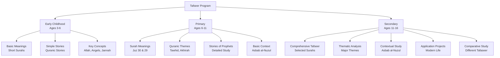
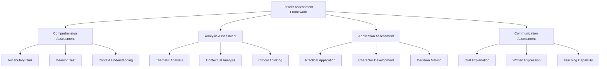

# Tafseer Studies

**Document Title:** Tafseer Studies
**Document ID:** IS_005
**Version:** 1.0
**Date:** 2026-01-11
**Project Name:** Smart Academy Digital Web Portal Development
**Content Category:** Islamic Studies Content

---

## Table of Contents

1. [Overview](#1-overview)
2. [Learning Objectives](#2-learning-objectives)
3. [Curriculum Structure](#3-curriculum-structure)
4. [Teaching Methodology](#4-teaching-methodology)
5. [Assessment & Evaluation](#5-assessment--evaluation)
6. [Resources & Materials](#6-resources--materials)
7. [Integration with Other Subjects](#7-integration-with-other-subjects)
8. [Parent Engagement](#8-parent-engagement)
9. [Technology Integration](#9-technology-integration)
10. [FAQs](#10-faqs)

---

## 1. Overview

The Tafseer Studies program at Smart Academy is designed to help students understand the deeper meanings and interpretations of the Holy Quran. Tafseer, meaning "explanation" or "interpretation," is the science of explaining the Quranic verses, their context, and their application to daily life. Our program guides students from basic understanding of short Surahs to comprehensive study of important Quranic passages, enabling them to connect with the divine message on a profound level.

### 1.1 Philosophy

The Tafseer program is founded on these fundamental principles:

- **Divine Guidance**: The Quran is Allah's (SWT) complete guidance for humanity. As stated in Quran 2:2: "This is the Book about which there is no doubt, a guidance for those conscious of Allah."

- **Understanding for Implementation**: Understanding the Quran is essential for implementing its teachings. The Prophet (PBUH) said: "The best among you are those who learn the Quran and teach it." (Sahih Bukhari, Book 61, Hadith 545)

- **Contextual Understanding**: Quranic verses must be understood in their proper context, including the circumstances of revelation (Asbab al-Nuzul), historical background, and linguistic context.

- **Application to Life**: Tafseer is not merely an academic exercise; it must lead to practical application of Quranic teachings in daily life.

- **Lifelong Journey**: Understanding the Quran is a continuous process that deepens throughout one's life.

### 1.2 Goals

The Tafseer program aims to achieve the following goals:

1. **Quranic Understanding**: Enable students to understand the meanings of Quranic verses at an appropriate level for their age and development.

2. **Contextual Knowledge**: Teach students the context of Quranic revelation, including Asbab al-Nuzul (reasons for revelation).

3. **Thematic Understanding**: Help students understand major themes and concepts in the Quran.

4. **Practical Application**: Guide students to apply Quranic teachings in their daily lives, character, and decision-making.

5. **Critical Thinking**: Develop students' ability to reflect on and analyze Quranic verses.

6. **Connection with Allah**: Foster a deeper spiritual connection with Allah (SWT) through understanding His words.

7. **Teaching Capability**: Prepare students to explain Quranic meanings to others.

8. **Integration**: Connect Tafseer with other Islamic studies and academic subjects.

### 1.3 Program Structure

The Tafseer program progresses through three developmental levels:

---

## 2. Learning Objectives

### 2.1 Knowledge Objectives

By the end of each level, students will demonstrate knowledge of:

#### Early Childhood (Ages 3-6)
- Basic meanings of short Surahs (Al-Fatiha, last 10 Surahs)
- Simple Quranic stories (stories of Prophets in simple language)
- Key Islamic concepts (Allah, Angels, Jannah, Jahannam)
- Basic Islamic values from Quran (kindness, sharing, respect)
- Simple Duas and their meanings

#### Primary (Ages 6-11)
- Meanings of Surahs in Juz 30 and Juz 29
- Major Quranic themes (Tawhid, Akhirah, Prophethood)
- Stories of Prophets mentioned in the Quran
- Basic Asbab al-Nuzul (reasons for revelation) for important verses
- Quranic vocabulary and key terms
- Islamic values and character traits from Quran

#### Secondary (Ages 11-16)
- Comprehensive Tafseer of selected important Surahs
- Detailed understanding of major Quranic themes
- Asbab al-Nuzul for important verses and Surahs
- Quranic references to science, history, and contemporary issues
- Different approaches to Tafseer
- Application of Quranic teachings to modern life
- Comparative study of different Tafaseer

### 2.2 Skills Objectives

Students will develop the following Tafseer-specific skills:

#### Comprehension Skills
- **Vocabulary**: Understanding key Quranic Arabic words
- **Context**: Understanding the context of verses
- **Meaning**: Grasping the basic and deeper meanings of verses
- **Connection**: Understanding the connection between verses and Surahs

#### Analysis Skills
- **Thematic Analysis**: Identifying and analyzing Quranic themes
- **Contextual Analysis**: Understanding verses in their proper context
- **Comparative Analysis**: Comparing different interpretations
- **Critical Thinking**: Reflecting on and analyzing Quranic verses

#### Application Skills
- **Practical Application**: Applying Quranic teachings to daily life
- **Character Development**: Using Tafseer for character building
- **Decision Making**: Using Quranic guidance for decision making
- **Communication**: Explaining Quranic meanings to others

### 2.3 Character Objectives

Through Tafseer studies, students will develop:

- **Reverence (Ta'zim)**: Respect and honor for the Quran
- **Reflection (Tafakkur)**: Deep contemplation on Quranic verses
- **Implementation (Amal)**: Applying Quranic teachings in daily life
- **Humility (Tawadu)**: Humility before Allah's words
- **Wisdom (Hikmah)**: Wisdom derived from Quranic understanding
- **Patience (Sabr)**: Patience in understanding complex verses
- **Gratitude (Shukr)**: Gratitude for the guidance of the Quran

---

## 3. Curriculum Structure

### 3.1 Level-Specific Curriculum

#### Early Childhood (Ages 3-6)

| Surah | Key Themes | Learning Focus |
|-------|------------|----------------|
| **Al-Fatiha** | Praise, guidance, path | Understanding praise and asking for guidance |
| **Al-Fil** | Allah's protection | Trust in Allah's power |
| **Quraysh** | Blessings, gratitude | Thanking Allah for blessings |
| **Al-Ma'un** | Kindness, charity | Being kind and helping others |
| **Al-Kawthar** | Abundance, sacrifice | Gratitude and prayer |
| **Al-Kafirun** | Tawhid, rejection of shirk | Faith in Allah alone |
| **An-Nasr** | Victory, gratitude | Thanking Allah for success |
| **Al-Lahab** | Consequences of disbelief | Warning against arrogance |
| **Al-Ikhlas** | Tawhid, Allah's nature | Pure monotheism |
| **Al-Falaq** | Protection from evil | Seeking Allah's protection |
| **An-Nas** | Protection from evil | Seeking Allah's protection |

**Key Concepts**:
- Allah (SWT) - The Creator
- Angels - Allah's messengers
- Jannah - Paradise
- Jahannam - Hellfire
- Prophets - Allah's messengers
- Shukr - Gratitude
- Sabr - Patience
- Adab - Manners

#### Primary (Ages 6-11)

##### Juz 30 (Juz Amma) - Selected Surahs

| Surah | Number | Key Themes | Learning Focus |
|-------|--------|------------|----------------|
| **An-Naba** | 78 | Day of Judgment, Paradise | Understanding Akhirah |
| **An-Nazi'at** | 79 | Resurrection, accountability | Reflection on life and death |
| **Abasa** | 80 | Etiquette of da'wah | Respect for all people |
| **At-Takwir** | 81 | Day of Judgment | Signs of Akhirah |
| **Al-Infitar** | 82 | Accountability | Self-reflection |
| **Al-Mutaffifin** | 83 | Justice, honesty | Fair dealings |
| **Al-Inshiqaq** | 84 | Day of Judgment | Preparation for Akhirah |
| **Al-Buruj** | 85 | Persecution, faith | Steadfastness in faith |
| **At-Tariq** | 86 | Allah's power | Recognition of Allah's signs |
| **Al-A'la** | 87 | Praise, guidance | Remembering Allah |
| **Al-Ghashiyah** | 88 | Paradise and Hellfire | Motivation for good deeds |
| **Al-Fajr** | 89 | Gratitude, consequences | Thankfulness to Allah |
| **Al-Balad** | 90 | Responsibility, effort | Striving for good |
| **Ash-Shams** | 91 | Soul purification | Self-improvement |
| **Al-Layl** | 92 | Giving, righteousness | Charity and good deeds |
| **Ad-Duhaa** | 93 | Allah's favors | Gratitude and patience |
| **Al-Inshirah** | 94 | Ease after difficulty | Trust in Allah |
| **At-Tin** | 95 | Human dignity | Purpose of creation |
| **Al-Alaq** | 96 | Knowledge, importance of reading | Value of education |
| **Al-Qadr** | 97 | Laylat al-Qadr | Night of Power |
| **Al-Bayyinah** | 98 | Clear proof of Islam | Certainty in faith |
| **Az-Zalzalah** | 99 | Day of Judgment | Accountability |
| **Al-Adiyat** | 100 | Gratitude, human nature | Self-reflection |
| **Al-Qari'ah** | 101 | Day of Judgment | Preparation for Akhirah |
| **At-Takathur** | 102 | Worldly competition | Focus on Akhirah |
| **Al-Asr** | 103 | Time, loss, success | Time management |
| **Al-Humazah** | 104 | Backbiting, greed | Avoiding negative traits |

##### Juz 29 - Selected Surahs

| Surah | Number | Key Themes | Learning Focus |
|-------|--------|------------|----------------|
| **Al-Mulk** | 67 | Allah's kingdom, creation | Reflecting on creation |
| **Al-Qalam** | 68 | Pen, truth vs falsehood | Importance of knowledge |
| **Al-Haqqah** | 69 | Day of Judgment | Truth of resurrection |
| **Al-Ma'arij** | 70 | Ascension, patience | Spiritual elevation |
| **Nuh** | 71 | Story of Prophet Nuh | Lessons from Prophets |
| **Al-Jinn** | 72 | Jinn, Quran's universality | Diversity of creation |

**Major Quranic Themes**:
- Tawhid (Oneness of Allah)
- Akhirah (Day of Judgment)
- Prophethood (Risalah)
- Divine Guidance (Hidayah)
- Accountability (Mas'uliyyah)
- Mercy (Rahmah)
- Justice (Adl)
- Patience (Sabr)
- Gratitude (Shukr)
- Trust in Allah (Tawakkul)

#### Secondary (Ages 11-16)

##### Comprehensive Tafseer of Selected Surahs

| Surah | Number | Key Themes | Learning Focus |
|-------|--------|------------|----------------|
| **Al-Baqarah** | 2 | Guidance, laws, stories | Comprehensive Islamic law and guidance |
| **Al-Imran** | 3 | Family of Imran, lessons | Faith and steadfastness |
| **An-Nisa** | 4 | Women's rights, inheritance | Social justice in Islam |
| **Al-Ma'idah** | 5 | Laws, dietary rules | Islamic jurisprudence |
| **Al-An'am** | 6 | Tawhid, rejection of shirk | Pure monotheism |
| **Al-A'raf** | 7 | Stories of Prophets | Lessons from history |
| **Al-Anfal** | 8 | Battle of Badr, jihad | Courage and faith |
| **At-Tawbah** | 9 | Repentance, hypocrites | Sincerity in faith |
| **Yunus** | 10 | Story of Prophet Yunus | Patience and dua |
| **Yusuf** | 12 | Story of Prophet Yusuf | Trust in Allah during trials |
| **Al-Kahf** | 18 | Trials, stories | Protection from fitnah |
| **Maryam** | 19 | Stories of Prophets | Faith and family |
| **Ta-Ha** | 20 | Story of Musa, dua | Communication with Allah |
| **Al-Anbiya** | 21 | Stories of Prophets | Lessons from Prophets |
| **Al-Hajj** | 22 | Hajj, tawhid | Pilgrimage and worship |
| **Al-Mu'minun** | 23 | Believers' characteristics | Building Islamic character |
| **An-Nur** | 24 | Modesty, social laws | Islamic social ethics |
| **Al-Furqan** | 25 | Quran as criterion | Following divine guidance |
| **Ash-Shu'ara** | 26 | Stories of Prophets | Consistency in da'wah |
| **An-Naml** | 27 | Stories, wisdom | Learning from history |
| **Al-Qasas** | 28 | Story of Musa | Leadership and courage |
| **Al-Ankabut** | 29 | Trials, patience | Steadfastness in faith |
| **Ar-Rum** | 30 | Signs of Allah | Reflecting on creation |
| **Luqman** | 31 | Wisdom, parenting | Islamic family values |
| **As-Sajdah** | 32 | Creation, resurrection | Submission to Allah |
| **Al-Ahzab** | 33 | Battle of the Trench | Community building |
| **Saba** | 34 | Kingdoms, consequences | Power belongs to Allah |
| **Fatir** | 35 | Creation, angels | Gratitude to Allah |
| **Ya-Sin** | 36 | Resurrection, Quran | Heart of the Quran |
| **As-Saffat** | 37 | Prophets, angels | Faith in unseen |
| **Sad** | 38 | Repentance, Dawud | Turning to Allah |
| **Az-Zumar** | 39 | Sincerity, repentance | Pure worship |
| **Ghafir** | 40 | Forgiveness, patience | Allah's mercy |
| **Fussilat** | 41 | Quran's truth | Following guidance |
| **Ash-Shura** | 42 | Consultation, unity | Islamic governance |
| **Az-Zukhruf** | 43 | Worldly adornments | Focus on Akhirah |
| **Ad-Dukhan** | 44 | Smoke, punishment | Warning and mercy |
| **Al-Jathiyah** | 45 | Accountability | Preparation for judgment |
| **Al-Ahqaf** | 46 | Disbelievers, Hud | Lessons from history |
| **Muhammad** | 47 | Jihad, believers | Striving for Allah |
| **Al-Fath** | 48 | Victory, treaty | Trust in Allah's plan |
| **Al-Hujurat** | 49 | Islamic etiquette | Social conduct in Islam |
| **Qaf** | 50 | Resurrection | Certainty of Akhirah |
| **Az-Zariyat** | 51 | Oath, creation | Reflecting on signs |
| **At-Tur** | 52 | Paradise, punishment | Motivation for deeds |
| **An-Najm** | 53 | Isra and Mi'raj | Spiritual journey |
| **Al-Qamar** | 54 | Moon, punishment | Signs of Allah |
| **Ar-Rahman** | 55 | Allah's blessings | Gratitude and recognition |
| **Al-Waqi'ah** | 56 | Day of Judgment | Three groups of people |
| **Al-Hadid** | 57 | Iron, believers | Strength in faith |
| **Al-Mujadila** | 58 | Arguments, consultation | Conflict resolution |

**Thematic Analysis**:
- Tawhid and Shirk
- Prophethood and Revelation
- Day of Judgment and Akhirah
- Divine Mercy and Justice
- Trials and Patience
- Guidance and Misguidance
- Paradise and Hellfire
- Character and Morality
- Social Justice
- Family and Society

### 3.2 Asbab al-Nuzul (Reasons for Revelation)

#### Important Asbab al-Nuzul

| Verse/Surah | Reason for Revelation | Lesson |
|-------------|---------------------|---------|
| **Quran 2:183** | Fasting prescribed | Importance of fasting |
| **Quran 2:216** | Jihad commanded | Trust in Allah's wisdom |
| **Quran 2:228** | Divorce laws | Justice in family matters |
| **Quran 4:3** | Marriage laws | Justice and fairness |
| **Quran 5:38** | Punishment for theft | Justice and deterrence |
| **Quran 24:11** | False accusation incident | Importance of verification |
| **Quran 33:5** | Adoption rules | Distinction between biological and adopted children |
| **Quran 49:11** | Mocking incident | Respect and avoiding mockery |
| **Quran 60:1** | Friendship with disbelievers | Loyalty to Allah and believers |
| **Quran 66:1-5** | Prophet's vow incident | Allah's forgiveness and mercy |

### 3.3 Methodology of Tafseer

#### Sources of Tafseer

| Source | Description | Example |
|--------|-------------|---------|
| **Quran by Quran** | Explaining Quran with Quran | Quran 2:115 explains Quran 2:115 |
| **Hadith** | Prophet's explanation of Quran | Hadith explaining Quran 2:187 |
| **Sahabah** | Companions' understanding | Ibn Abbas's Tafseer |
| **Tabi'un** | Followers' explanations | Mujahid's Tafseer |
| **Arabic Language** | Linguistic analysis | Understanding Arabic grammar and vocabulary |
| **Context** | Historical and social context | Understanding Asbab al-Nuzul |

#### Famous Tafaseer

| Tafseer | Author | Characteristics |
|---------|--------|------------------|
| **Tafseer Ibn Kathir** | Ibn Kathir | Comprehensive, authentic, based on Quran, Hadith, and Sahabah |
| **Tafseer al-Tabari** | Al-Tabari | Detailed, scholarly, includes various opinions |
| **Tafseer al-Qurtubi** | Al-Qurtubi | Focuses on Fiqh and legal aspects |
| **Tafseer al-Jalalayn** | Al-Mahalli & Al-Suyuti | Concise, easy to understand |
| **Tafseer al-Sa'di** | Al-Sa'di | Focuses on spiritual and practical lessons |
| **Tafseer Ibn Ashur** | Ibn Ashur | Focuses on linguistic and thematic analysis |

---

## 4. Teaching Methodology

### 4.1 Pedagogical Approach

The Tafseer program employs a combination of traditional and modern teaching methods:

#### Traditional Methods
- **Talaqqi**: Direct transmission of Tafseer knowledge from teacher to student
- **Storytelling**: Using stories from the Quran to make lessons engaging
- **Memorization of Meanings**: Memorizing key meanings and vocabulary
- **Discussion**: Class discussions about Quranic themes and applications

#### Modern Methods
- **Interactive Learning**: Use of smart boards, tablets, and multimedia resources
- **Project-Based Learning**: Projects that connect Tafseer to real life
- **Critical Thinking**: Encouraging students to reflect and analyze
- **Differentiated Instruction**: Adapting content to different learning levels

### 4.2 Teaching Strategies

#### For Early Childhood (3-6)

| Strategy | Description | Example |
|----------|-------------|---------|
| **Storytelling** | Simple stories from Quran | Stories of Prophets in simple language |
| **Visual Learning** | Pictures and illustrations | Pictures of Paradise, angels |
| **Repetition** | Repeating key concepts | Repeating "Allah is our Creator" |
| **Songs and Rhymes** | Islamic songs about Quran | Songs about Allah's blessings |
| **Play-Based Learning** | Games and activities | Matching games for Quranic concepts |
| **Modeling** | Teachers demonstrate Islamic behavior | Teachers showing kindness |

#### For Primary (6-11)

| Strategy | Description | Example |
|----------|-------------|---------|
| **Interactive Discussion** | Class discussions about meanings | Discussing lessons from Surah Yusuf |
| **Vocabulary Building** | Learning Quranic Arabic words | Learning words like "Jannah," "Rahman" |
| **Story Analysis** | Analyzing stories from Quran | Discussing lessons from Prophet's stories |
| **Thematic Study** | Studying major themes | Studying Tawhid across different Surahs |
| **Application Activities** | Applying teachings to daily life | Role-playing Islamic manners |
| **Group Work** | Collaborative activities | Group projects on Quranic themes |

#### For Secondary (11-16)

| Strategy | Description | Example |
|----------|-------------|---------|
| **Critical Analysis** | Deep examination of verses | Analyzing themes in Surah Al-Baqarah |
| **Research Projects** | Independent research on Tafseer topics | Research on scientific references in Quran |
| **Debate and Discussion** | Structured debates on Quranic issues | Discussing contemporary issues from Quranic perspective |
| **Comparative Study** | Comparing different Tafaseer | Comparing Ibn Kathir and Al-Jalalayn |
| **Application Projects** | Applying Quranic teachings to modern life | Creating guides for Islamic lifestyle |
| **Teaching Practice** | Students teaching younger students | Peer tutoring in Tafseer |

### 4.3 Classroom Environment

The Tafseer classroom is designed to be:

- **Spiritually Uplifting**: Clean, organized, with Quranic verses displayed
- **Interactive**: Encouraging student participation and engagement
- **Respectful**: Environment of reverence for Quranic discussion
- **Technology-Enhanced**: Smart boards, tablets, and digital resources
- **Comfortable**: Appropriate seating for extended discussions
- **Inclusive**: Welcoming to students from all backgrounds

---

## 5. Assessment & Evaluation

### 5.1 Assessment Framework

### 5.2 Assessment Methods

#### Comprehension Assessment

| Criteria | Description | Scoring |
|----------|-------------|---------|
| **Vocabulary** | Understanding key Quranic words | 0-20 points |
| **Meaning** | Understanding of verse meanings | 0-30 points |
| **Context** | Understanding of context | 0-20 points |
| **Themes** | Understanding of major themes | 0-30 points |

**Scoring Rubric**:
- **Excellent (90-100)**: Deep understanding of all aspects
- **Very Good (80-89)**: Strong understanding with minor gaps
- **Good (70-79)**: Good understanding with some gaps
- **Satisfactory (60-69)**: Basic understanding with notable gaps
- **Needs Improvement (Below 60)**: Limited understanding

#### Analysis Assessment

| Criteria | Description | Scoring |
|----------|-------------|---------|
| **Thematic Analysis** | Ability to identify and analyze themes | 0-30 points |
| **Contextual Analysis** | Ability to understand context | 0-30 points |
| **Critical Thinking** | Ability to reflect and analyze | 0-40 points |

**Scoring Rubric**:
- **Excellent (90-100)**: Excellent analytical skills
- **Very Good (80-89)**: Strong analytical skills
- **Good (70-79)**: Good analytical skills
- **Satisfactory (60-69)**: Basic analytical skills
- **Needs Improvement (Below 60)**: Limited analytical skills

#### Application Assessment

| Criteria | Description | Scoring |
|----------|-------------|---------|
| **Practical Application** | Ability to apply teachings to daily life | 0-40 points |
| **Character Development** | Evidence of character development | 0-30 points |
| **Decision Making** | Using Quranic guidance for decisions | 0-30 points |

**Scoring Rubric**:
- **Excellent (90-100)**: Excellent application of teachings
- **Very Good (80-89)**: Strong application of teachings
- **Good (70-79)**: Good application of teachings
- **Satisfactory (60-69)**: Basic application of teachings
- **Needs Improvement (Below 60)**: Limited application of teachings

#### Communication Assessment

| Criteria | Description | Scoring |
|----------|-------------|---------|
| **Oral Explanation** | Ability to explain meanings orally | 0-30 points |
| **Written Expression** | Ability to express understanding in writing | 0-30 points |
| **Teaching Capability** | Ability to teach Tafseer to others | 0-40 points |

**Scoring Rubric**:
- **Excellent (90-100)**: Excellent communication skills
- **Very Good (80-89)**: Strong communication skills
- **Good (70-79)**: Good communication skills
- **Satisfactory (60-69)**: Basic communication skills
- **Needs Improvement (Below 60)**: Limited communication skills

### 5.3 Level-Based Assessment

#### Early Childhood Assessment

| Component | Criteria | Passing Score |
|-----------|----------|----------------|
| **Basic Meanings** | Understanding of basic meanings | 70% |
| **Stories** | Recall of simple stories | 70% |
| **Key Concepts** | Understanding of key concepts | 70% |

#### Primary Assessment

| Component | Criteria | Passing Score |
|-----------|----------|----------------|
| **Surah Meanings** | Understanding of Surah meanings | 75% |
| **Themes** | Understanding of major themes | 75% |
| **Vocabulary** | Quranic vocabulary | 70% |
| **Application** | Application to daily life | 70% |

#### Secondary Assessment

| Component | Criteria | Passing Score |
|-----------|----------|----------------|
| **Comprehensive Tafseer** | Understanding of selected Surahs | 80% |
| **Thematic Analysis** | Analysis of major themes | 75% |
| **Contextual Understanding** | Understanding of Asbab al-Nuzul | 75% |
| **Application** | Application to modern life | 75% |
| **Communication** | Ability to explain Tafseer | 70% |

### 5.4 Progress Tracking

Each student maintains a Tafseer Progress Portfolio including:

- **Comprehension Record**: Record of comprehension assessments
- **Analysis Record**: Record of analytical work
- **Application Record**: Record of practical applications
- **Communication Record**: Record of oral and written explanations
- **Achievement Certificates**: Recognition of level completion
- **Teacher Feedback**: Regular feedback from Tafseer teachers

---

## 6. Resources & Materials

### 6.1 Primary Textbooks

#### Tafseer Books
- **Tafseer Ibn Kathir**: Comprehensive and authentic Tafseer
- **Tafseer al-Jalalayn**: Concise Tafseer for students
- **The Meaning of the Holy Quran**: By Abdullah Yusuf Ali
- **Tafseer al-Sa'di**: Focuses on spiritual and practical lessons

#### Quran Texts
- **The Noble Quran**: With translation and Tafseer
- **Quran with Word-for-Word Translation**: For vocabulary building
- **Study Quran**: With commentary and notes

### 6.2 Digital Resources

#### Tafseer Applications
- **Quran.com**: Online Quran with translations and Tafseer
- **Tafseer Ibn Kathir Online**: Digital version of Ibn Kathir's Tafseer
- **Quran Tafseer Apps**: Mobile apps for Tafseer study

#### Quran Applications
- **Quran Explorer**: Recitation, translation, and Tafseer
- **iQuran**: Mobile app with Tafseer features
- **Quran Pro**: Comprehensive Quran app with Tafseer

### 6.3 Audio and Video Resources

#### Video Resources
- **Tafseer Lectures**: Video lectures by renowned scholars
- **Quran Tafseer Series**: Comprehensive Tafseer series
- **Storytelling Videos**: Animated stories from the Quran

#### Audio Resources
- **Tafseer Audio**: Audio explanations of Quranic verses
- **Quran Lectures**: Lectures on Quranic themes
- **Podcasts**: Islamic podcasts on Tafseer topics

### 6.4 Supplementary Materials

#### Teaching Aids
- **Flashcards**: Quranic vocabulary, key concepts
- **Posters**: Quranic verses, themes, stories
- **Charts**: Surah themes, Quranic concepts
- **Visual Aids**: Pictures and illustrations for Quranic stories

#### Assessment Tools
- **Rubrics**: Detailed criteria for assessment
- **Checklists**: Progress tracking for Tafseer skills
- **Portfolios**: Student work samples and achievements
- **Progress Reports**: Regular communication with parents

---

## 7. Integration with Other Subjects

### 7.1 Re-STEAM Integration

The Tafseer program integrates with STEAM subjects through the Re-STEAM framework:

#### Science Integration

| Tafseer Concept | Science Connection | Example Activities |
|----------------|-------------------|-------------------|
| Creation of Heavens and Earth | Astronomy and Cosmology | Study of Big Bang theory vs Quranic description |
| Embryology | Biology | Compare Quranic embryonic stages with modern science |
| Water Cycle | Earth Science | Study water cycle mentioned in Quran 23:18 |
| Mountains as Pegs | Geology | Study mountain formation and stabilizing effect |
| Honey as Healing | Medicine | Research medicinal properties of honey |

#### Technology Integration

| Tafseer Concept | Technology Connection | Example Activities |
|----------------|-------------------|-------------------|
| Preservation of Quran | Information Technology | Study how Quran was preserved |
| Quran Apps | Digital Technology | Use apps for Tafseer study |
| Online Resources | Internet Technology | Access Tafseer and lectures online |

#### Engineering Integration

| Tafseer Concept | Engineering Connection | Example Activities |
|----------------|-------------------|-------------------|
| Ark of Nuh | Naval Engineering | Study buoyancy and ship design |
| Construction of Kaaba | Structural Engineering | Study ancient construction techniques |

#### Arts Integration

| Tafseer Concept | Arts Connection | Example Activities |
|----------------|----------------|-------------------|
| Quranic Calligraphy | Visual Arts | Learning Arabic calligraphy |
| Quranic Verses as Art | Islamic Art | Creating art with Quranic verses |
| Storytelling | Language Arts | Creative writing based on Quranic stories |

#### Mathematics Integration

| Tafseer Concept | Mathematics Connection | Example Activities |
|----------------|-------------------|-------------------|
| Inheritance Laws | Applied Mathematics | Calculate Islamic inheritance shares |
| Numerology in Quran | Number Theory | Study numbers mentioned in Quran |

### 7.2 Cross-Curricular Projects

Students engage in projects that integrate Tafseer with other subjects:

- **Quranic Science Fair**: Projects demonstrating scientific concepts mentioned in Quran
- **Islamic Art Exhibition**: Student artwork reflecting Quranic themes
- **Quranic Poetry**: Creative writing based on Quranic verses
- **Historical Research**: Research on preservation of Quran throughout history
- **Community Service**: Applying Quranic teachings of charity and kindness

---

## 8. Parent Engagement

### 8.1 Home-School Partnership

Parents play a crucial role in supporting their children's Tafseer learning:

#### Regular Communication
- **Monthly Tafseer Progress Reports**: Detailed updates on Tafseer progress
- **Parent-Teacher Conferences**: Regular meetings to discuss Tafseer progress
- **Digital Communication**: WhatsApp groups and email for ongoing support
- **Tafseer Workshops**: Workshops on supporting children's Tafseer learning at home

#### Home Support Resources
- **Daily Tafseer Discussion**: Guide for discussing Tafseer at home
- **Family Quran Time**: Guide for family Quran reading together
- **Application Guides**: Applying Quranic teachings to family life

### 8.2 Parent Involvement Opportunities

Parents are encouraged to:

- **Discuss Tafseer**: Daily discussion about Tafseer lessons
- **Read Together**: Reading Quran and Tafseer together as a family
- **Attend Tafseer Events**: Participate in Tafseer competitions and celebrations
- **Model Behavior**: Demonstrate implementation of Quranic teachings in daily life

### 8.3 Monitoring Progress at Home

Parents can support Tafseer learning by:

- **Daily Discussion**: Discussing Tafseer lessons learned
- **Application**: Helping children apply Quranic teachings to daily life
- **Positive Reinforcement**: Encouraging and praising progress
- **Creating Environment**: Establishing an Islamic environment at home
- **Consistency**: Maintaining regularity in Quran and Tafseer study

---

## 9. Technology Integration

### 9.1 Digital Learning Tools

The Tafseer program incorporates technology to enhance learning:

#### Tafseer Learning Apps
- **Tafseer Apps**: Mobile apps for Tafseer study
- **Online Tafseer**: Digital Tafseer resources
- **Quran with Tafseer**: Apps with Quran and Tafseer together

#### Classroom Technology
- **Smart Boards**: Interactive displays for Tafseer content
- **Tablets**: Individual devices for personalized Tafseer learning
- **Projectors**: Displaying Tafseer content and videos
- **Audio Systems**: High-quality audio for Tafseer lectures

#### Learning Management System
- **Gibbon Integration**: Digital platform for Tafseer resources
- **Progress Tracking**: Online tracking of Tafseer progress
- **Resource Sharing**: Digital library of Tafseer materials
- **Assessment Tools**: Online quizzes and assessments

### 9.2 Technology for Tafseer Program

The Tafseer program uses specialized technology:

- **Tafseer Apps**: Mobile apps for Tafseer study and reference
- **Online Resources**: Access to Tafseer libraries and lectures
- **Digital Libraries**: Comprehensive digital Tafseer resources

### 9.3 Online Tafseer Resources

Students and parents have access to:

- **Online Tafseer Libraries**: Comprehensive Tafseer resources
- **Tafseer Video Lectures**: Access to renowned Tafseer scholars
- **Interactive Learning**: Online courses and tutorials
- **Tafseer Communities**: Online forums for discussion and support

---

## 10. FAQs

### General Questions

**Q: What is Tafseer?**

A: Tafseer is the science of explaining the Quranic verses, their context, and their application to daily life. It involves understanding the meanings of Quranic verses, the circumstances of their revelation (Asbab al-Nuzul), and their practical implications.

**Q: Why is Tafseer important?**

A: Tafseer is important because:
- It helps understand the true meanings of Quranic verses
- It provides context for proper understanding
- It enables practical application of Quranic teachings
- It deepens spiritual connection with Allah (SWT)
- It prevents misinterpretation of the Quran

**Q: At what age do students start learning Tafseer?**

A: Students start learning basic Tafseer concepts from Early Childhood (ages 3-6) with simple meanings of short Surahs. Formal Tafseer study begins in Primary level (ages 6-11) with more detailed explanations of Surahs.

### Curriculum Questions

**Q: What Surahs are studied in Tafseer?**

A: Tafseer study includes:
- Early Childhood: Short Surahs (Al-Fatiha, last 10 Surahs)
- Primary: Juz 30 and Juz 29 (selected Surahs)
- Secondary: Selected important Surahs from throughout the Quran (Al-Baqarah, Al-Imran, Yusuf, Al-Kahf, etc.)

**Q: What are Asbab al-Nuzul?**

A: Asbab al-Nuzul are the reasons or circumstances for the revelation of specific Quranic verses. Understanding these reasons provides important context for proper interpretation of the verses.

**Q: What are the main sources of Tafseer?**

A: The main sources of Tafseer are:
- Quran by Quran (explaining Quran with Quran)
- Hadith (Prophet's explanation)
- Sahabah (Companions' understanding)
- Tabi'un (Followers' explanations)
- Arabic Language (linguistic analysis)
- Context (historical and social context)

### Assessment Questions

**Q: How is Tafseer assessed?**

A: Tafseer is assessed based on:
- Comprehension (vocabulary, meaning, context, themes)
- Analysis (thematic, contextual, critical thinking)
- Application (practical application, character development, decision making)
- Communication (oral explanation, written expression, teaching capability)

**Q: What happens if a student struggles with Tafseer?**

A: We provide individualized support:
- One-on-one tutoring with Tafseer teachers
- Additional resources and materials
- Simplified explanations for complex concepts
- Encouragement and motivation
- Parent involvement in home study

### Parent Questions

**Q: How can I support my child's Tafseer learning at home?**

A: Parents can support by:
- Discussing Tafseer lessons learned
- Reading Quran and Tafseer together
- Helping children apply Quranic teachings to daily life
- Creating an Islamic environment at home
- Encouraging questions and discussions about Quran
- Attending Tafseer workshops

**Q: Do I need to know Arabic to help my child with Tafseer?**

A: No prior Arabic knowledge is required. We provide:
- Translations in English and Bengali
- Parent workshops on Tafseer topics
- Home study guides with explanations
- Regular communication with teachers

### Technology Questions

**Q: What technology tools are used in Tafseer learning?**

A: Technology integration includes:
- Tafseer learning apps
- Smart boards for interactive lessons
- Online resources and digital libraries
- Progress tracking systems

**Q: Is technology used instead of traditional methods?**

A: No, technology is used as a supplement to traditional methods:
- Face-to-face instruction remains primary
- Traditional methods of Tafseer study are maintained
- Technology enhances but does not replace traditional learning
- Balance is maintained between digital and traditional methods

---

## Document Approval

| Role | Name | Signature | Date |
|------|------|-----------|------|
| Islamic Studies Coordinator | | _________________ | ________ |
| Principal | | _________________ | ________ |
