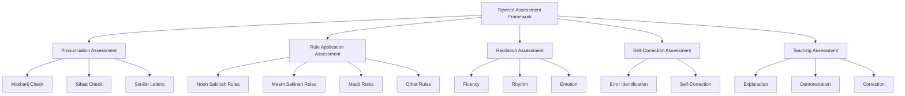

# Tajweed Program

**Document Title:** Tajweed Program
**Document ID:** IS_004
**Version:** 1.0
**Date:** 2026-01-11
**Project Name:** Smart Academy Digital Web Portal Development
**Content Category:** Islamic Studies Content

---

## Table of Contents

1. [Overview](#1-overview)
2. [Learning Objectives](#2-learning-objectives)
3. [Curriculum Structure](#3-curriculum-structure)
4. [Teaching Methodology](#4-teaching-methodology)
5. [Assessment & Evaluation](#5-assessment--evaluation)
6. [Resources & Materials](#6-resources--materials)
7. [Integration with Other Subjects](#7-integration-with-other-subjects)
8. [Parent Engagement](#8-parent-engagement)
9. [Technology Integration](#9-technology-integration)
10. [FAQs](#10-faqs)

---

## 1. Overview

The Tajweed program at Smart Academy is designed to teach students the proper rules and pronunciation for Quranic recitation. Tajweed, meaning "to improve" or "to make better," is the set of rules governing the way in which the words of the Quran should be pronounced during recitation. Our program ensures that students learn to recite the Quran with beauty, accuracy, and reverence, following the prophetic tradition of Quranic recitation.

### 1.1 Philosophy

The Tajweed program is founded on these fundamental principles:

- **Divine Preservation**: The Quran was revealed with specific rules of recitation, and preserving these rules is part of preserving the Quran itself. Allah (SWT) states in Quran 73:4: "And recite the Quran with measured recitation."

- **Prophetic Tradition**: The Prophet (PBUH) received the Quran from Angel Jibreel (AS) and recited it with specific rules that were passed down through generations. Aisha (RA) reported that the Prophet (PBUH) said: "The one who recites the Quran proficiently is with the noble, righteous scribes." (Sahih Bukhari, Book 61, Hadith 546)

- **Beauty and Reverence**: Proper Tajweed enhances the beauty of Quranic recitation and demonstrates reverence for Allah's words. The Prophet (PBUH) said: "Beautify the Quran with your voices." (Sunan Abu Dawud, Book 8, Hadith 1468)

- **Accuracy in Meaning**: Proper pronunciation ensures accurate understanding of Quranic meanings. Incorrect pronunciation can change the meaning of words and verses.

- **Lifelong Skill**: Tajweed is a skill that students will use throughout their lives, enhancing their relationship with the Quran.

### 1.2 Goals

The Tajweed program aims to achieve the following goals:

1. **Correct Pronunciation**: Enable students to pronounce all Arabic letters correctly from their proper points of articulation (Makharij).

2. **Rule Application**: Teach students to apply all Tajweed rules correctly during Quranic recitation.

3. **Fluent Recitation**: Develop fluency in Quranic recitation with proper Tajweed.

4. **Self-Correction**: Train students to identify and correct their own Tajweed errors.

5. **Teaching Capability**: Prepare students to teach Tajweed to others, continuing the chain of transmission.

6. **Appreciation of Beauty**: Foster appreciation for the beauty of Quranic recitation with proper Tajweed.

7. **Integration**: Integrate Tajweed learning with Quran memorization and comprehension.

### 1.3 Program Structure

The Tajweed program progresses through five levels of proficiency:

```mermaid
graph TD
    A[Tajweed Program] --> B[Foundation Level]
    A --> C[Beginner Level]
    A --> D[Intermediate Level]
    A --> E[Advanced Level]
    A --> F[Mastery Level]
    
    B --> B1[Makharij<br/>Points of Articulation]
    B --> B2[Sifaat<br/>Letter Characteristics]
    B --> B3[Basic Pronunciation]
    
    C --> C1[Noon Sakinah Rules]
    C --> C2[Meem Sakinah Rules]
    C --> C3[Tanween Rules]
    C --> C4[Basic Madd Rules]
    
    D --> D1[Advanced Madd Rules]
    D --> D2[Qalqalah Rules]
    D --> D3[Ghunnah Rules]
    D --> D4[Laam Sakinah Rules]
    
    E --> E1[Stopping Signs]
    E --> E2[Waqf Rules]
    E --> E3[Advanced Sifaat]
    E --> E4[Ra Rules]
    
    F --> F1[Complete Mastery]
    F --> F2[Self-Correction]
    F --> F3[Teaching Capability]
    F --> F4[Ijazah in Tajweed]
```

---

## 2. Learning Objectives

### 2.1 Knowledge Objectives

By the completion of each level, students will demonstrate knowledge of:

#### Foundation Level
- All 29 Arabic letters and their correct pronunciation
- Points of articulation (Makharij) for each letter
- Basic characteristics (Sifaat) of letters
- Difference between similar letters
- Basic concepts of Tajweed

#### Beginner Level
- Noon Sakinah and Tanween rules (Izhar, Ikhfa, Idgham, Iqlab)
- Meem Sakinah rules (Izhar, Ikhfa Shafawi, Idgham Shafawi)
- Basic Madd rules (Madd Asli, Madd Wajib)
- Laam Shamsiyyah and Laam Qamariyyah
- Hamzat Wasl and Hamzat Qat

#### Intermediate Level
- Advanced Madd rules (Madd Jaiz, Madd Lazim)
- Qalqalah rules
- Ghunnah rules
- Laam Sakinah rules
- Rules of Ra
- Rules of Hamza

#### Advanced Level
- Stopping signs (Waqf) and their rules
- Advanced stopping rules
- Advanced Sifaat
- Complex Tajweed rules
- Exceptions and special cases

#### Mastery Level
- Complete mastery of all Tajweed rules
- Ability to identify and correct errors
- Understanding of different Qira'at (recitation styles)
- Teaching capability
- Ijazah in Tajweed

### 2.2 Skills Objectives

Students will develop the following Tajweed-specific skills:

#### Pronunciation Skills
- **Makharij**: Correct articulation of all letters from their points of articulation
- **Sifaat**: Proper application of letter characteristics
- **Similar Letters**: Distinguishing between similar letters
- **Heavy and Light Letters**: Correct pronunciation of heavy (Tafkhim) and light (Tarqiq) letters

#### Rule Application Skills
- **Noon Sakinah**: Correct application of all Noon Sakinah rules
- **Meem Sakinah**: Correct application of all Meem Sakinah rules
- **Madd Rules**: Correct application of all Madd rules with proper duration
- **Qalqalah**: Correct application of Qalqalah with proper intensity
- **Ghunnah**: Correct application of Ghunnah with proper duration

#### Recitation Skills
- **Fluency**: Smooth recitation with proper Tajweed
- **Rhythm**: Appropriate pace and rhythm
- **Emotion**: Reciting with appropriate emotion and reverence
- **Self-Correction**: Identifying and correcting own errors

#### Teaching Skills
- **Explanation**: Ability to explain Tajweed rules to others
- **Demonstration**: Ability to demonstrate proper pronunciation
- **Correction**: Ability to identify and correct others' errors

### 2.3 Character Objectives

Through Tajweed studies, students will develop:

- **Reverence (Ta'zim)**: Respect and honor for the Quran through proper recitation
- **Precision (Daght)**: Attention to detail in pronunciation
- **Patience (Sabr)**: Perseverance in mastering Tajweed rules
- **Humility (Tawadu)**: Humility before Allah's words
- **Excellence (Ihsan)**: Striving for excellence in recitation
- **Discipline (Tartib)**: Regularity in Tajweed practice

---

## 3. Curriculum Structure

### 3.1 Tajweed Rules Overview

#### Makharij (Points of Articulation)

The 29 Arabic letters are pronounced from 17 points of articulation:

| Group | Letters | Point of Articulation |
|-------|---------|----------------------|
| **Al-Jawf** | Alif, Waw, Ya (Sakin) | Empty space in the mouth and throat |
| **Al-Halq** | Hamza, Ha, Ain, Ha, Ghain | Throat |
| **Al-Lisan** | Qaf, Kaf, Jim, Shin, Ya, Dal, Ta, Za, L, R, N | Tongue |
| **Ash-Shafatan** | Ba, Meem, Fa | Lips |
| **Al-Khayshum** | Mim (with Ghunnah) | Nasal cavity |

#### Sifaat (Characteristics of Letters)

Letters have characteristics that affect their pronunciation:

| Type | Characteristics | Letters |
|------|----------------|---------|
| **With Opposite** | Hams/Jahar, Shiddah/Rakhawah, Isti'la/Istifal, Itbaq/Infitah | Various letters |
| **Without Opposite** | Safir, Qalqalah, Lin, Inhiraf, Takrir, Tafashshi, Idhlaq, Ismat | Various letters |

### 3.2 Level-Specific Curriculum

#### Foundation Level (Early Childhood - Primary)

| Topic | Content | Duration |
|-------|---------|----------|
| Arabic Letters | Recognition and pronunciation of all 29 letters | 4 weeks |
| Makharij | Points of articulation for each letter | 6 weeks |
| Sifaat | Basic characteristics of letters | 4 weeks |
| Similar Letters | Distinguishing between similar letters | 4 weeks |
| Basic Practice | Simple recitation practice | Ongoing |

#### Beginner Level (Primary)

| Topic | Content | Duration |
|-------|---------|----------|
| Noon Sakinah & Tanween | Izhar, Ikhfa, Idgham, Iqlab | 6 weeks |
| Meem Sakinah | Izhar, Ikhfa Shafawi, Idgham Shafawi | 4 weeks |
| Basic Madd | Madd Asli, Madd Wajib | 4 weeks |
| Laam Shamsiyyah/Qamariyyah | Rules of Laam in Al | 2 weeks |
| Hamzat Wasl/Qat | Rules of Hamza | 2 weeks |
| Practice | Recitation with beginner rules | Ongoing |

#### Intermediate Level (Primary - Secondary)

| Topic | Content | Duration |
|-------|---------|----------|
| Advanced Madd | Madd Jaiz, Madd Lazim | 6 weeks |
| Qalqalah | Qalqalah rules and intensity | 4 weeks |
| Ghunnah | Ghunnah rules and duration | 4 weeks |
| Laam Sakinah | Rules of Laam Sakinah | 4 weeks |
| Rules of Ra | Ra rules (Tafkhim/Tarqiq) | 4 weeks |
| Rules of Hamza | Advanced Hamza rules | 4 weeks |
| Practice | Recitation with intermediate rules | Ongoing |

#### Advanced Level (Secondary)

| Topic | Content | Duration |
|-------|---------|----------|
| Stopping Signs | Types of Waqf and their rules | 6 weeks |
| Advanced Waqf | Complex stopping rules | 4 weeks |
| Advanced Sifaat | Detailed Sifaat study | 4 weeks |
| Complex Rules | Exceptions and special cases | 4 weeks |
| Different Qira'at | Introduction to different recitation styles | 4 weeks |
| Practice | Advanced recitation practice | Ongoing |

#### Mastery Level (Secondary)

| Topic | Content | Duration |
|-------|---------|----------|
| Complete Mastery | Review and mastery of all rules | 8 weeks |
| Self-Correction | Identifying and correcting errors | 4 weeks |
| Teaching Methods | Teaching Tajweed to others | 4 weeks |
| Ijazah Preparation | Preparation for Ijazah | 4 weeks |
| Practice | Mastery-level recitation | Ongoing |

### 3.3 Detailed Tajweed Rules

#### Noon Sakinah and Tanween Rules

| Rule | Meaning | Letters | Example |
|------|---------|---------|---------|
| **Izhar** | Clear | Throat letters (Hamza, Ha, Ain, Ha, Ghain) | يَنْأَوُ |
| **Ikhfa** | Hide | Remaining letters (excluding exceptions) | أَنْبَأَ |
| **Idgham** | Merge | Yaa, Waw, Meem, Noon, Laam, Ra | مِنْ يَوْمٍ |
| **Iqlab** | Turn | Ba only | مِنْ بَعْدٍ |

#### Meem Sakinah Rules

| Rule | Meaning | Letters | Example |
|------|---------|---------|---------|
| **Izhar Shafawi** | Clear lip | All letters except Ba and Meem | عَلَيْهِمْ |
| **Ikhfa Shafawi** | Hide lip | Ba only | تَرْمِيهِمْ بِحِجَارَةٍ |
| **Idgham Shafawi** | Merge lip | Meem only | هُمْ مُّهْتَدُونَ |

#### Madd Rules

| Type | Meaning | Duration | Example |
|------|---------|----------|---------|
| **Madd Asli (Natural)** | Natural elongation | 1 Alif (2 counts) | قَالَ |
| **Madd Wajib (Necessary)** | Necessary elongation | 4-5 counts | مَالِكِ |
| **Madd Jaiz (Permissible)** | Permissible elongation | 2, 4, or 6 counts | السَّمَاوَاتِ |
| **Madd Lazim (Obligatory)** | Obligatory elongation | 6 counts | آلَانَ |

#### Qalqalah Rules

| Type | Meaning | Letters | Intensity |
|------|---------|---------|-----------|
| **Qalqalah Kubra** | Greater Qalqalah | Qaf, Ta, Ba, Jeem, Dal | Strong |
| **Qalqalah Sughra** | Lesser Qalqalah | Qaf, Ta, Ba, Jeem, Dal | Light |

#### Stopping Signs (Waqf)

| Sign | Meaning | Action |
|------|---------|--------|
| **مـ** | The stop is necessary to be made | Must stop |
| **لا** | Do not stop | Do not stop |
| **ج** | Permitted to stop or continue | Optional |
| **صلى** | It is better to stop | Preferable to stop |
| **قلى** | It is better to continue | Preferable to continue |
| **س** | A silence pause without taking breath | Pause briefly |
| **وقف** | The end of a verse | Stop |
| **∴** | The sign of the end of a Rub' (quarter) | Stop |

---

## 4. Teaching Methodology

### 4.1 Pedagogical Approach

The Tajweed program employs a combination of traditional and modern teaching methods:

#### Traditional Methods
- **Talaqqi**: Direct transmission from teacher to student, ensuring proper pronunciation
- **Tasmee**: Listening to recitation and correcting errors
- **Repetition**: Repeated practice of rules and pronunciation
- **Modeling**: Teachers demonstrate proper pronunciation and rule application

#### Modern Methods
- **Visual Learning**: Use of diagrams and visual aids for Makharij and Sifaat
- **Audio Learning**: Listening to expert reciters for proper pronunciation
- **Interactive Learning**: Use of technology for interactive practice
- **Differentiated Instruction**: Adapting methods to individual learning styles

### 4.2 Teaching Strategies

#### Pronunciation Teaching

| Strategy | Description | Application |
|----------|-------------|-------------|
| **Mirror Practice** | Using mirrors to observe mouth position | Practicing Makharij |
| **Tactile Feedback** | Feeling vibrations and air flow | Understanding letter characteristics |
| **Minimal Pairs** | Contrasting similar letters | Distinguishing similar letters |
| **Slow Practice** | Slow, deliberate practice | Mastering pronunciation |
| **Recording** | Recording and listening to own recitation | Self-assessment |

#### Rule Teaching

| Strategy | Description | Application |
|----------|-------------|-------------|
| **Color Coding** | Using colors to mark Tajweed rules | Visual identification of rules |
| **Pattern Recognition** | Identifying patterns in rules | Understanding rule application |
| **Contextual Practice** | Practicing rules in context | Applying rules in Quranic verses |
| **Rule Explanations** | Clear explanations of rules | Understanding the "why" |
| **Examples** | Providing multiple examples | Reinforcing rule application |

### 4.3 Teacher-Student Relationship

The teacher-student relationship in the Tajweed program is characterized by:

- **Patience**: Teachers provide patient guidance and correction
- **Encouragement**: Positive reinforcement for progress
- **Individual Attention**: Personalized feedback and guidance
- **Modeling**: Teachers demonstrate proper pronunciation
- **Regular Feedback**: Ongoing correction and improvement

### 4.4 Classroom Environment

The Tajweed classroom is designed to be:

- **Quiet and Focused**: Minimal distractions for concentration
- **Acoustically Optimized**: Good acoustics for clear sound
- **Technology-Enhanced**: Audio systems for listening practice
- **Comfortable**: Appropriate seating for extended practice
- **Respectful**: Environment of reverence for Quran learning

---

## 5. Assessment & Evaluation

### 5.1 Assessment Framework

### 5.2 Assessment Methods

#### Pronunciation Assessment

| Criteria | Description | Scoring |
|----------|-------------|---------|
| **Makharij** | Correct points of articulation | 0-10 points |
| **Sifaat** | Proper application of characteristics | 0-10 points |
| **Similar Letters** | Distinguishing similar letters | 0-10 points |
| **Heavy/Light** | Correct Tafkhim/Tarqiq | 0-10 points |

**Scoring Rubric**:
- **Excellent (36-40)**: Perfect pronunciation
- **Very Good (32-35)**: Strong pronunciation with minor issues
- **Good (28-31)**: Good pronunciation with some issues
- **Satisfactory (24-27)**: Basic pronunciation with notable issues
- **Needs Improvement (Below 24)**: Significant pronunciation issues

#### Rule Application Assessment

| Criteria | Description | Scoring |
|----------|-------------|---------|
| **Noon Sakinah** | Correct application of all rules | 0-20 points |
| **Meem Sakinah** | Correct application of all rules | 0-15 points |
| **Madd Rules** | Correct application with proper duration | 0-20 points |
| **Other Rules** | Correct application of remaining rules | 0-25 points |

**Scoring Rubric**:
- **Excellent (80-100)**: Perfect rule application
- **Very Good (70-79)**: Strong application with minor errors
- **Good (60-69)**: Good application with some errors
- **Satisfactory (50-59)**: Basic application with notable errors
- **Needs Improvement (Below 50)**: Significant rule application issues

#### Recitation Assessment

| Criteria | Description | Scoring |
|----------|-------------|---------|
| **Fluency** | Smooth, uninterrupted recitation | 0-10 points |
| **Rhythm** | Appropriate pace and rhythm | 0-10 points |
| **Emotion** | Reciting with appropriate emotion | 0-5 points |
| **Reverence** | Demonstrating proper etiquette | 0-5 points |

**Scoring Rubric**:
- **Excellent (26-30)**: Beautiful, fluent recitation
- **Very Good (23-25)**: Strong recitation with minor issues
- **Good (20-22)**: Good recitation with some issues
- **Satisfactory (17-19)**: Basic recitation with notable issues
- **Needs Improvement (Below 17)**: Significant recitation issues

#### Self-Correction Assessment

| Criteria | Description | Scoring |
|----------|-------------|---------|
| **Error Identification** | Ability to identify own errors | 0-10 points |
| **Self-Correction** | Ability to correct own errors | 0-10 points |

**Scoring Rubric**:
- **Excellent (18-20)**: Excellent self-correction ability
- **Very Good (15-17)**: Strong self-correction ability
- **Good (12-14)**: Good self-correction ability
- **Satisfactory (9-11)**: Basic self-correction ability
- **Needs Improvement (Below 9)**: Limited self-correction ability

### 5.3 Level-Based Assessment

#### Foundation Level Assessment

| Component | Criteria | Passing Score |
|-----------|----------|----------------|
| **Letter Recognition** | All 29 letters recognized | 100% |
| **Pronunciation** | Correct pronunciation of all letters | 90% |
| **Makharij** | Correct points of articulation | 80% |
| **Sifaat** | Basic characteristics understood | 70% |

#### Beginner Level Assessment

| Component | Criteria | Passing Score |
|-----------|----------|----------------|
| **Noon Sakinah Rules** | All rules applied correctly | 90% |
| **Meem Sakinah Rules** | All rules applied correctly | 90% |
| **Basic Madd** | Basic Madd rules applied correctly | 85% |
| **Recitation** | Fluent recitation with beginner rules | 80% |

#### Intermediate Level Assessment

| Component | Criteria | Passing Score |
|-----------|----------|----------------|
| **Advanced Madd** | All Madd rules applied correctly | 85% |
| **Qalqalah** | All Qalqalah rules applied correctly | 85% |
| **Ghunnah** | All Ghunnah rules applied correctly | 85% |
| **Laam Sakinah** | All Laam Sakinah rules applied correctly | 80% |
| **Ra Rules** | All Ra rules applied correctly | 80% |
| **Recitation** | Fluent recitation with intermediate rules | 75% |

#### Advanced Level Assessment

| Component | Criteria | Passing Score |
|-----------|----------|----------------|
| **Stopping Signs** | All Waqf rules applied correctly | 85% |
| **Advanced Waqf** | Complex Waqf rules applied correctly | 80% |
| **Advanced Sifaat** | Detailed Sifaat understood | 75% |
| **Complex Rules** | Exceptions and special cases | 75% |
| **Recitation** | Fluent recitation with advanced rules | 70% |

#### Mastery Level Assessment

| Component | Criteria | Passing Score |
|-----------|----------|----------------|
| **Complete Mastery** | All rules mastered | 95% |
| **Self-Correction** | Excellent self-correction ability | 90% |
| **Teaching** | Ability to teach Tajweed | 85% |
| **Recitation** | Mastery-level recitation | 90% |

### 5.4 Progress Tracking

Each student maintains a Tajweed Progress Portfolio including:

- **Pronunciation Record**: Record of pronunciation assessments
- **Rule Application Record**: Record of rule application assessments
- **Recitation Record**: Record of recitation assessments
- **Self-Correction Record**: Record of self-correction development
- **Achievement Certificates**: Recognition of level completion
- **Teacher Feedback**: Regular feedback from Tajweed teachers

---

## 6. Resources & Materials

### 6.1 Primary Textbooks

#### Tajweed Books
- **Tajweed Rules of the Quran**: By Kareema Carol Czerepinski (3 volumes)
- **Reach the Goal via Tajweed Rules**: Comprehensive Tajweed guide
- **The Science of Tajweed**: Detailed Tajweed textbook
- **Tajweed Made Easy**: Simplified Tajweed guide

#### Quran Texts
- **The Noble Quran**: Standard Uthmani script with color-coded Tajweed
- **Tajweed Quran**: Color-coded for Tajweed rules
- **Quran with Tajweed Markings**: Clear Tajweed markings

### 6.2 Digital Resources

#### Tajweed Learning Apps
- **Tajweed Quran**: Interactive Tajweed learning
- **Learn Quran Tajweed**: Step-by-step Tajweed instruction
- **Quran Tajweed**: Video lessons and practice
- **Tajweed Master**: Comprehensive Tajweed app

#### Quran Applications
- **Quran.com**: Online Quran with Tajweed color-coding
- **Quran Explorer**: Recitation with Tajweed
- **iQuran**: Mobile app with Tajweed features

### 6.3 Audio and Video Resources

#### Recommended Reciters for Tajweed Learning
- **Sheikh Mishary Rashid Alafasy**: Clear, melodious recitation
- **Sheikh Saad Al-Ghamdi**: Excellent for learning Tajweed
- **Sheikh Mahmoud Khalil Al-Hussary**: Classic, precise recitation
- **Sheikh Mohamed Siddiq Al-Minshawi**: Beautiful, slow recitation

#### Video Resources
- **Tajweed Lessons**: YouTube channels with Tajweed instruction
- **Makharij Videos**: Visual demonstrations of points of articulation
- **Tajweed Rules Explained**: Detailed explanations of Tajweed rules

### 6.4 Supplementary Materials

#### Teaching Aids
- **Flashcards**: Tajweed rules, Makharij, Sifaat
- **Posters**: Tajweed rules, Makharij diagrams
- **Charts**: Tajweed rule summaries
- **Color-Coded Quran**: Quran with Tajweed color-coding

#### Assessment Tools
- **Rubrics**: Detailed criteria for assessment
- **Checklists**: Progress tracking for Tajweed skills
- **Portfolios**: Student work samples and achievements
- **Progress Reports**: Regular communication with parents

---

## 7. Integration with Other Subjects

### 7.1 Re-STEAM Integration

The Tajweed program integrates with STEAM subjects through the Re-STEAM framework:

#### Science Integration

| Tajweed Concept | Science Connection | Example Activities |
|----------------|-------------------|-------------------|
| Anatomy of Speech | Biology | Study of vocal cords and speech apparatus |
| Sound Waves | Physics | Understanding sound production and propagation |
| Acoustics | Physics | Study of acoustics in recitation |

#### Technology Integration

| Tajweed Concept | Technology Connection | Example Activities |
|----------------|-------------------|-------------------|
| Audio Recording | Audio Technology | Recording and analyzing recitation |
| Speech Recognition | AI Technology | Using speech recognition for Tajweed practice |
| Online Learning | Internet Technology | Accessing Tajweed resources online |

#### Arts Integration

| Tajweed Concept | Arts Connection | Example Activities |
|----------------|----------------|-------------------|
| Melodic Recitation | Music | Understanding rhythm and melody in recitation |
| Calligraphy | Visual Arts | Learning Arabic calligraphy with Tajweed |

#### Mathematics Integration

| Tajweed Concept | Mathematics Connection | Example Activities |
|----------------|-------------------|-------------------|
| Duration Counting | Number Theory | Counting Madd durations |
| Pattern Recognition | Mathematics | Identifying patterns in Tajweed rules |

### 7.2 Cross-Curricular Projects

Students engage in projects that integrate Tajweed with other subjects:

- **Tajweed Science Project**: Study of speech anatomy and acoustics
- **Tajweed Art Exhibition**: Calligraphy and visual representations of Tajweed
- **Tajweed Technology**: Developing apps or tools for Tajweed learning
- **Tajweed Performance**: Melodic recitation performances

---

## 8. Parent Engagement

### 8.1 Home-School Partnership

Parents play a crucial role in supporting their children's Tajweed learning:

#### Regular Communication
- **Monthly Tajweed Progress Reports**: Detailed updates on Tajweed progress
- **Parent-Teacher Conferences**: Regular meetings to discuss Tajweed progress
- **Digital Communication**: WhatsApp groups and email for ongoing support
- **Tajweed Workshops**: Workshops on supporting children's Tajweed learning at home

#### Home Support Resources
- **Daily Tajweed Practice**: Recommended schedule for home Tajweed practice
- **Listening Guide**: Recommended reciters for home listening
- **Practice Tips**: Tips for effective Tajweed practice at home

### 8.2 Parent Involvement Opportunities

Parents are encouraged to:

- **Listen to Recitation**: Daily listening to children's Quran recitation
- **Practice Together**: Practice Tajweed rules together
- **Attend Tajweed Events**: Participate in Tajweed competitions and celebrations
- **Model Behavior**: Demonstrate reverence for Quran in daily life

### 8.3 Monitoring Progress at Home

Parents can support Tajweed learning by:

- **Daily Practice**: Ensuring daily Tajweed practice
- **Listening**: Regular listening to recitation
- **Positive Reinforcement**: Encouraging and praising progress
- **Creating Environment**: Establishing a quiet space for Tajweed practice
- **Consistency**: Maintaining regularity in Tajweed practice

---

## 9. Technology Integration

### 9.1 Digital Learning Tools

The Tajweed program incorporates technology to enhance learning:

#### Tajweed Learning Apps
- **Interactive Learning**: Apps for interactive Tajweed learning
- **Audio Analysis**: Tools for analyzing recitation
- **Progress Tracking**: Apps for tracking Tajweed progress
- **Visual Aids**: Digital visual aids for Makharij and Sifaat

#### Classroom Technology
- **Smart Boards**: Interactive displays for Tajweed rules
- **Audio Systems**: High-quality audio for listening practice
- **Projectors**: Displaying Tajweed content and videos
- **Recording Equipment**: For recording and analyzing recitation

#### Learning Management System
- **Gibbon Integration**: Digital platform for Tajweed resources
- **Progress Tracking**: Online tracking of Tajweed progress
- **Resource Sharing**: Digital library of Tajweed materials
- **Assessment Tools**: Online quizzes and assessments

### 9.2 Technology for Tajweed Program

The Tajweed program uses specialized technology:

- **Tajweed Apps**: Mobile apps for Tajweed learning and practice
- **Audio Recording**: Recording and analyzing recitation
- **Speech Recognition**: Using AI for Tajweed practice
- **Online Resources**: Access to Tajweed resources online

### 9.3 Online Tajweed Resources

Students and parents have access to:

- **Online Tajweed Libraries**: Comprehensive Tajweed resources
- **Tajweed Video Lectures**: Access to renowned Tajweed teachers
- **Interactive Learning**: Online courses and tutorials
- **Tajweed Communities**: Online forums for discussion and support

---

## 10. FAQs

### General Questions

**Q: What is Tajweed?**

A: Tajweed is the set of rules governing the way in which the words of the Quran should be pronounced during recitation. It ensures that the Quran is recited with proper pronunciation, articulation, and beauty, following the prophetic tradition.

**Q: Why is Tajweed important?**

A: Tajweed is important because:
- It preserves the proper pronunciation of the Quran
- It ensures accurate understanding of Quranic meanings
- It enhances the beauty of Quranic recitation
- It demonstrates reverence for Allah's words
- It follows the prophetic tradition of Quranic recitation

**Q: At what age do students start learning Tajweed?**

A: Students start learning basic Tajweed concepts from Early Childhood (ages 3-6) with proper pronunciation of Arabic letters. Formal Tajweed rules are taught starting in Primary level (ages 6-11).

### Curriculum Questions

**Q: What are the main Tajweed rules?**

A: The main Tajweed rules include:
- Makharij (points of articulation)
- Sifaat (letter characteristics)
- Noon Sakinah and Tanween rules
- Meem Sakinah rules
- Madd rules (elongation)
- Qalqalah rules
- Ghunnah rules
- Laam Sakinah rules
- Ra rules
- Stopping signs (Waqf)

**Q: How long does it take to master Tajweed?**

A: Tajweed mastery is a gradual process:
- Foundation Level: 6-12 months
- Beginner Level: 6-12 months
- Intermediate Level: 12-18 months
- Advanced Level: 12-18 months
- Mastery Level: 12-24 months
Total: Approximately 3-5 years for complete mastery

**Q: What are the different types of Madd?**

A: The main types of Madd are:
- Madd Asli (Natural): 1 Alif (2 counts)
- Madd Wajib (Necessary): 4-5 counts
- Madd Jaiz (Permissible): 2, 4, or 6 counts
- Madd Lazim (Obligatory): 6 counts

### Assessment Questions

**Q: How is Tajweed assessed?**

A: Tajweed is assessed based on:
- Pronunciation (Makharij, Sifaat, similar letters)
- Rule application (all Tajweed rules)
- Recitation (fluency, rhythm, emotion)
- Self-correction ability
- Teaching capability (for advanced levels)

**Q: What happens if a student struggles with Tajweed?**

A: We provide individualized support:
- One-on-one tutoring with Tajweed teachers
- Additional practice time
- Specialized exercises for difficult rules
- Encouragement and motivation
- Parent involvement in home practice

### Parent Questions

**Q: How can I support my child's Tajweed learning at home?**

A: Parents can support by:
- Listening to daily Quran recitation
- Playing Quran recitations at home
- Encouraging regular Tajweed practice
- Creating a quiet space for practice
- Praising progress and effort
- Attending Tajweed workshops

**Q: Do I need to know Tajweed to help my child?**

A: No prior Tajweed knowledge is required. We provide:
- Parent workshops on basic Tajweed
- Home practice guides
- Recommended reciters for listening
- Regular communication with teachers

### Technology Questions

**Q: What technology tools are used in Tajweed learning?**

A: Technology integration includes:
- Tajweed learning apps
- Audio recording and analysis
- Smart boards for interactive lessons
- Online resources and digital libraries
- Progress tracking systems

**Q: Is technology used instead of traditional methods?**

A: No, technology is used as a supplement to traditional methods:
- Face-to-face instruction remains primary
- Traditional talaqqi (direct transmission) is maintained
- Technology enhances but does not replace traditional learning
- Balance is maintained between digital and traditional methods

---

## Document Approval

| Role | Name | Signature | Date |
|------|------|-----------|------|
| Islamic Studies Coordinator | | _________________ | ________ |
| Principal | | _________________ | ________ |
