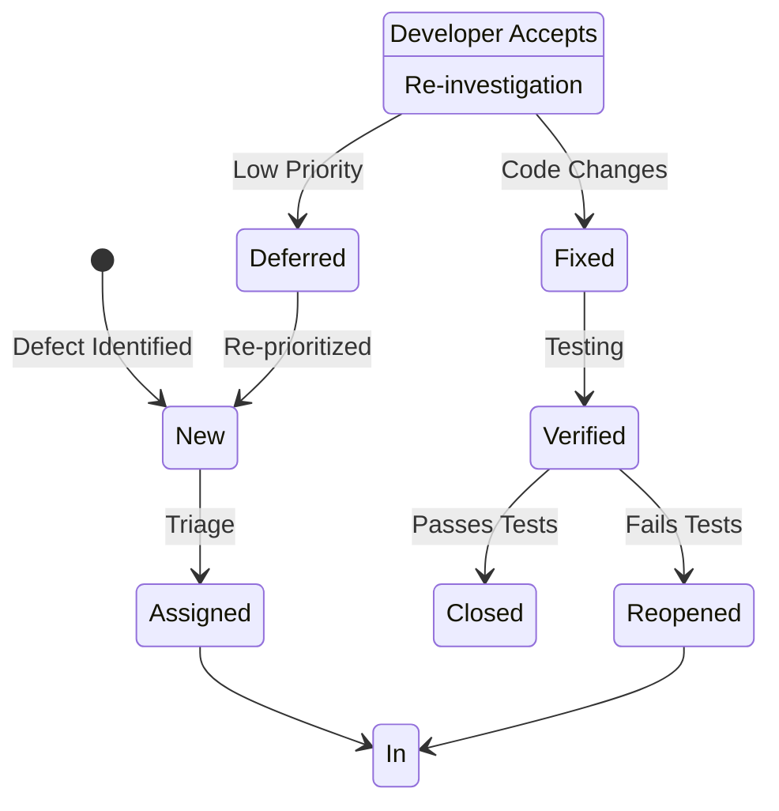
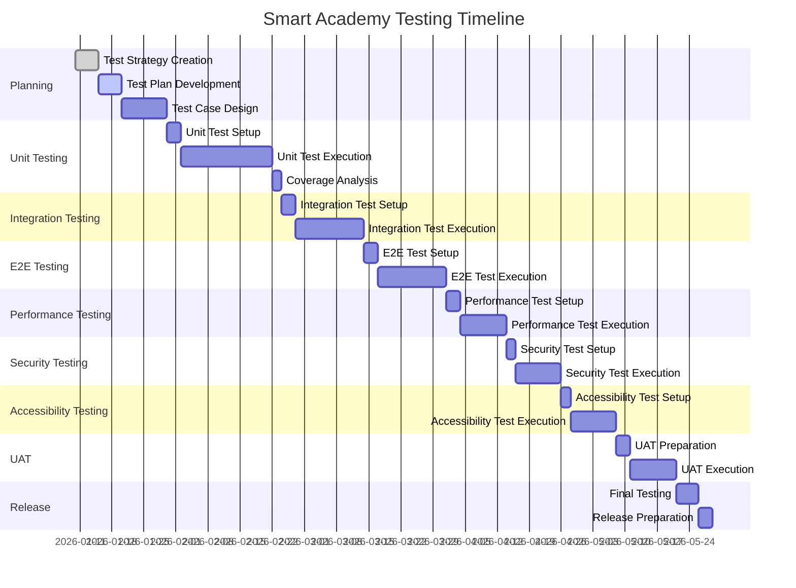

# Smart Academy Digital Portal - Test Strategy Document

| Document Information | |
|---------------------|------------------|
| **Title** | Test Strategy Document |
| **Version** | 1.0 |
| **Date** | 2026-01-10 |
| **Author** | Smart Academy Development Team |
| **Status** | Draft |
| **Project** | Smart Academy Digital Portal |

---

## Table of Contents

1. [Introduction](#1-introduction)
   - 1.1 Purpose
   - 1.2 Scope
   - 1.3 Audience
   - 1.4 Definitions and Acronyms
2. [Testing Objectives](#2-testing-objectives)
   - 2.1 Functional Testing Objectives
   - 2.2 Non-Functional Testing Objectives
   - 2.3 Security Testing Objectives
   - 2.4 Performance Testing Objectives
   - 2.5 Accessibility Testing Objectives
3. [Test Levels](#3-test-levels)
   - 3.1 Unit Testing
   - 3.2 Integration Testing
   - 3.3 End-to-End Testing
   - 3.4 Performance Testing
   - 3.5 Security Testing
   - 3.6 Accessibility Testing
4. [Testing Tools and Frameworks](#4-testing-tools-and-frameworks)
5. [Test Environment Requirements](#5-test-environment-requirements)
6. [Defect Management Process](#6-defect-management-process)
7. [Test Deliverables](#7-test-deliverables)
8. [Roles and Responsibilities](#8-roles-and-responsibilities)
9. [Testing Schedule and Milestones](#9-testing-schedule-and-milestones)
10. [Risk and Contingency](#10-risk-and-contingency)

---

## 1. Introduction

### 1.1 Purpose

This Test Strategy document defines the comprehensive testing approach for the Smart Academy Digital Portal project. It establishes the testing objectives, scope, methodology, tools, and processes to ensure the delivery of a high-quality, reliable, and secure educational management system. This strategy serves as the foundation for all testing activities and guides the testing team throughout the software development lifecycle.

### 1.2 Scope

This test strategy covers all testing activities for the Smart Academy Digital Portal, including:

- Frontend applications (Web and Mobile)
- Backend API services
- Database layer
- Third-party integrations (Gibbon, Moodle, Payment Gateways, SMS/Email services)
- Authentication and authorization systems
- Islamic education modules
- Payment processing systems
- Communication systems
- Reporting and analytics features

The strategy applies to all development phases from initial development through deployment and maintenance.

### 1.3 Audience

This document is intended for:

- Development team (solo developer and any collaborators)
- Project stakeholders
- Quality assurance personnel
- System administrators
- Third-party integration partners

### 1.4 Definitions and Acronyms

| Term | Definition |
|------|------------|
| **API** | Application Programming Interface |
| **E2E** | End-to-End Testing |
| **GPA** | Grade Point Average |
| **JWT** | JSON Web Token |
| **LCP** | Largest Contentful Paint |
| **MFA** | Multi-Factor Authentication |
| **OWASP** | Open Web Application Security Project |
| **RBAC** | Role-Based Access Control |
| **RTO** | Recovery Time Objective |
| **RPO** | Recovery Point Objective |
| **RTL** | Right-to-Left (text direction) |
| **WCAG** | Web Content Accessibility Guidelines |
| **CI/CD** | Continuous Integration/Continuous Deployment |
| **HMR** | Hot Module Replacement |
| **p95** | 95th percentile |

---

## 2. Testing Objectives

### 2.1 Functional Testing Objectives

Ensure all functional requirements are met and the system behaves as expected:

- **Core Functionality**: Verify all features work according to specifications
- **User Flows**: Validate critical user journeys from start to finish
- **Business Logic**: Confirm business rules are correctly implemented
- **Data Integrity**: Ensure data accuracy and consistency across the system
- **Integration**: Validate seamless interaction between system components
- **Edge Cases**: Test boundary conditions and unusual scenarios

**Success Criteria**:
- 100% of critical user functions pass
- 95% of all functional test cases pass
- Zero critical defects remaining

### 2.2 Non-Functional Testing Objectives

Ensure system quality attributes meet defined standards:

- **Performance**: API response time < 100ms (p95), LCP < 2.5s
- **Scalability**: Support 2000+ concurrent users
- **Reliability**: 99.5% uptime, RTO < 4 hours, RPO < 1 hour
- **Usability**: Intuitive interface with minimal learning curve
- **Compatibility**: Cross-browser, cross-device compatibility
- **Maintainability**: Clean code with comprehensive documentation

**Success Criteria**:
- All performance benchmarks met or exceeded
- System handles peak loads without degradation
- Consistent behavior across supported platforms

### 2.3 Security Testing Objectives

Ensure system security and protect sensitive data:

- **OWASP Top 10 Compliance**: Address all top security risks
- **Authentication**: Secure login, MFA, session management
- **Authorization**: Proper RBAC implementation
- **Data Protection**: Encryption at rest and in transit
- **Input Validation**: Prevent injection attacks
- **API Security**: Secure endpoints with proper authentication

**Success Criteria**:
- Zero critical or high-severity security vulnerabilities
- All OWASP Top 10 vulnerabilities addressed
- Security audit passed with no major findings

### 2.4 Performance Testing Objectives

Ensure system meets performance requirements under various conditions:

- **Response Time**: API calls respond within 100ms (p95)
- **Page Load**: LCP under 2.5 seconds
- **Throughput**: Handle 2000+ concurrent users
- **Resource Usage**: Efficient CPU, memory, and database utilization
- **Scalability**: Linear performance scaling with load increase

**Success Criteria**:
- 95th percentile response time < 100ms for all APIs
- Page load time < 2.5s on 3G connection
- System maintains performance under 2000+ concurrent users
- Database queries optimized with proper indexing

### 2.5 Accessibility Testing Objectives

Ensure the system is accessible to all users, including those with disabilities:

- **WCAG 2.2 AA Compliance**: Meet all Level AA success criteria
- **Screen Reader Support**: Compatible with NVDA, VoiceOver, TalkBack
- **Keyboard Navigation**: Full functionality via keyboard only
- **Color Contrast**: Minimum 4.5:1 for normal text, 3:1 for large text
- **Focus Management**: Clear focus indicators and logical tab order
- **RTL Support**: Proper Arabic language support with right-to-left layout

**Success Criteria**:
- 100% WCAG 2.2 Level AA compliance
- Zero critical accessibility violations
- Full keyboard navigation support
- Proper color contrast throughout

---

## 3. Test Levels

### 3.1 Unit Testing

#### Scope

Unit testing focuses on testing individual components, functions, and classes in isolation. This is the foundation of the testing pyramid and should be the most extensive type of testing.

**Areas Covered**:
- Frontend: React components, custom hooks, utility functions
- Backend: API endpoints, business logic functions, data validators
- Database: Prisma models, database queries, migrations
- Utilities: Helper functions, formatters, calculators

#### Tools

| Component | Tool | Justification |
|-----------|------|---------------|
| Frontend Unit Tests | Vitest + React Testing Library | Fast, modern, excellent React integration |
| Backend Unit Tests | Vitest | Consistent with frontend, TypeScript support |
| Mocking | vi (Vitest built-in) | Lightweight, no additional dependencies |
| Coverage | c8 (Vitest built-in) | Fast, accurate coverage reports |

#### Coverage Targets

- **Lines**: 80% overall, 90% for critical modules
- **Functions**: 80% overall, 90% for critical modules
- **Branches**: 75% overall, 85% for critical modules
- **Statements**: 80% overall, 90% for critical modules

**Critical Modules**:
- Authentication and authorization
- Payment processing
- Grade calculations
- Attendance calculations
- Student data management

#### Example: Frontend Unit Test

```typescript
// src/components/__tests__/StudentCard.test.tsx
import { describe, it, expect } from 'vitest'
import { render, screen } from '@testing-library/react'
import StudentCard from '../StudentCard'

describe('StudentCard Component', () => {
  const mockStudent = {
    id: '1',
    name: 'Ahmed Rahman',
    class: 'Class 5',
    section: 'A',
    rollNumber: '15'
  }

  it('renders student information correctly', () => {
    render(<StudentCard student={mockStudent} />)
    expect(screen.getByText('Ahmed Rahman')).toBeInTheDocument()
    expect(screen.getByText('Class 5-A')).toBeInTheDocument()
    expect(screen.getByText('Roll: 15')).toBeInTheDocument()
  })

  it('displays attendance status when provided', () => {
    render(<StudentCard student={mockStudent} attendance="Present" />)
    expect(screen.getByText('Present')).toHaveClass('text-green-600')
  })
})
```

#### Example: Backend Unit Test

```typescript
// src/services/__tests__/gradeCalculator.test.ts
import { describe, it, expect } from 'vitest'
import { calculateGPA, calculateGrade } from '../gradeCalculator'

describe('Grade Calculator', () => {
  describe('calculateGrade', () => {
    it('returns A+ for marks >= 80', () => {
      expect(calculateGrade(85)).toBe('A+')
      expect(calculateGrade(80)).toBe('A+')
    })

    it('returns F for marks < 33', () => {
      expect(calculateGrade(32)).toBe('F')
      expect(calculateGrade(0)).toBe('F')
    })

    it('throws error for invalid marks', () => {
      expect(() => calculateGrade(-5)).toThrow('Marks must be between 0 and 100')
      expect(() => calculateGrade(105)).toThrow('Marks must be between 0 and 100')
    })
  })

  describe('calculateGPA', () => {
    it('calculates GPA correctly for multiple subjects', () => {
      const grades = ['A+', 'A', 'A-', 'B+']
      expect(calculateGPA(grades)).toBeCloseTo(4.00, 2)
    })
  })
})
```

---

### 3.2 Integration Testing

#### Scope

Integration testing verifies that different modules and services work together correctly. This level of testing focuses on the interactions between components.

**Areas Covered**:
- API endpoint to database integration
- Frontend to backend API integration
- Third-party service integrations (Gibbon, Moodle, payment gateways)
- Authentication flow across multiple services
- Notification systems (SMS, Email, Push)
- File upload and storage integration

#### Tools

| Component | Tool | Justification |
|-----------|------|---------------|
| API Integration | Supertest | HTTP assertions for Node.js |
| Fastify Testing | Fastify inject() | Built-in Fastify testing utility |
| Database | Testcontainers | Isolated database instances |
| Mock Services | MSW (Mock Service Worker) | API mocking for frontend tests |

#### Test Scenarios

1. **Authentication Integration**
   - Login → JWT generation → Protected route access
   - Token refresh flow
   - MFA verification flow

2. **Student Management Integration**
   - Create student → Database storage → API response
   - Update student → Cache invalidation → Database update
   - Delete student → Cascade delete related records

3. **Payment Integration**
   - Payment initiation → Gateway API → Callback handling
   - Webhook processing → Database update → Notification

4. **Third-Party Integration**
   - Gibbon SSO → User sync → Role mapping
   - Moodle course enrollment → Grade sync
   - SMS gateway → Message delivery → Status update

#### Example: API Integration Test

```typescript
// src/api/__tests__/students.integration.test.ts
import { describe, it, expect, beforeAll, afterAll } from 'vitest'
import { build } from '../../app'
import { PrismaClient } from '@prisma/client'

const prisma = new PrismaClient()
const app = build()

describe('Student API Integration Tests', () => {
  let authToken: string
  let testStudentId: string

  beforeAll(async () => {
    // Setup test data
    const user = await prisma.user.create({
      data: {
        email: 'test@smartacademy.edu',
        passwordHash: 'hashed_password',
        role: 'ADMIN'
      }
    })

    const loginResponse = await app.inject({
      method: 'POST',
      url: '/api/auth/login',
      payload: {
        email: 'test@smartacademy.edu',
        password: 'test_password'
      }
    })

    authToken = loginResponse.json().token
  })

  it('should create a new student', async () => {
    const response = await app.inject({
      method: 'POST',
      url: '/api/students',
      headers: {
        authorization: `Bearer ${authToken}`
      },
      payload: {
        name: 'Test Student',
        class: 'Class 5',
        section: 'A',
        rollNumber: 'TEST001',
        dateOfBirth: '2012-05-15'
      }
    })

    expect(response.statusCode).toBe(201)
    expect(response.json().success).toBe(true)
    testStudentId = response.json().data.id
  })

  it('should retrieve the created student', async () => {
    const response = await app.inject({
      method: 'GET',
      url: `/api/students/${testStudentId}`,
      headers: {
        authorization: `Bearer ${authToken}`
      }
    })

    expect(response.statusCode).toBe(200)
    expect(response.json().data.name).toBe('Test Student')
  })

  afterAll(async () => {
    // Cleanup
    await prisma.student.deleteMany()
    await prisma.user.deleteMany()
    await prisma.$disconnect()
  })
})
```

---

### 3.3 End-to-End Testing

#### Scope

E2E testing validates complete user flows from start to finish, simulating real user interactions across the entire application stack.

**Critical User Flows**:
1. **Student Onboarding**: Registration → Verification → Profile setup → Class assignment
2. **Attendance Management**: Login → Select class → Mark attendance → Generate report
3. **Grade Entry**: Login → Select class → Enter grades → Calculate GPA → Generate report card
4. **Payment Processing**: Login → View fees → Initiate payment → Complete payment → Verify receipt
5. **Islamic Education Tracking**: Login → Record Quran progress → Update Tajweed level → View progress
6. **Parent Portal**: Login → View child's attendance → View grades → Download reports

#### Tools

| Component | Tool | Justification |
|-----------|------|---------------|
| E2E Framework | Playwright | Cross-browser, fast, modern API |
| Visual Regression | Percy | Automated visual testing |
| Test Data Management | Faker | Realistic test data generation |
| CI Integration | GitHub Actions | Automated test execution |

#### Critical User Flows with Examples

**Flow 1: Student Registration**

```typescript
// e2e/student-registration.spec.ts
import { test, expect } from '@playwright/test'

test.describe('Student Registration Flow', () => {
  test('complete student registration process', async ({ page }) => {
    // Navigate to registration page
    await page.goto('/register')
    await expect(page).toHaveTitle(/Register - Smart Academy/)

    // Fill registration form
    await page.fill('[name="studentName"]', 'Mohammad Ali')
    await page.fill('[name="dateOfBirth"]', '2013-03-10')
    await page.selectOption('[name="class"]', 'Class 5')
    await page.selectOption('[name="section"]', 'A')
    await page.fill('[name="rollNumber"]', '25')
    await page.fill('[name="parentName"]', 'Abdul Rahman')
    await page.fill('[name="parentPhone"]', '+8801712345678')
    await page.fill('[name="parentEmail"]', 'parent@example.com')

    // Upload documents
    await page.setInputFiles('[name="birthCertificate"]', 'test-files/birth-cert.pdf')
    await page.setInputFiles('[name="photo"]', 'test-files/photo.jpg')

    // Submit form
    await page.click('button[type="submit"]')

    // Verify success
    await expect(page.locator('.success-message')).toBeVisible()
    await expect(page.locator('.success-message')).toContainText(
      'Registration submitted successfully'
    )

    // Verify redirect to dashboard
    await expect(page).toHaveURL(/.*\/dashboard/)
  })
})
```

**Flow 2: Attendance Marking**

```typescript
// e2e/attendance.spec.ts
import { test, expect } from '@playwright/test'

test.describe('Attendance Management', () => {
  test.beforeEach(async ({ page }) => {
    // Login as teacher
    await page.goto('/login')
    await page.fill('[name="email"]', 'teacher@smartacademy.edu')
    await page.fill('[name="password"]', 'password123')
    await page.click('button[type="submit"]')
    await expect(page).toHaveURL(/.*\/dashboard/)
  })

  test('mark attendance for a class', async ({ page }) => {
    // Navigate to attendance page
    await page.click('text=Attendance')
    await page.selectOption('[name="class"]', 'Class 5')
    await page.selectOption('[name="section"]', 'A')
    await page.selectOption('[name="date"]', '2026-01-10')
    await page.click('button:has-text("Load Students")')

    // Wait for student list to load
    await expect(page.locator('.student-row')).toHaveCount(30)

    // Mark attendance
    await page.check('input[data-student-id="1"][value="present"]')
    await page.check('input[data-student-id="2"][value="present"]')
    await page.check('input[data-student-id="3"][value="absent"]')

    // Submit attendance
    await page.click('button:has-text("Submit Attendance")')

    // Verify success message
    await expect(page.locator('.toast-success')).toBeVisible()
    await expect(page.locator('.toast-success')).toContainText(
      'Attendance recorded successfully'
    )
  })

  test('generate attendance report', async ({ page }) => {
    await page.goto('/attendance/reports')
    await page.selectOption('[name="class"]', 'Class 5')
    await page.selectOption('[name="month"]', 'January')
    await page.selectOption('[name="year"]', '2026')
    await page.click('button:has-text("Generate Report")')

    // Verify report generation
    await expect(page.locator('.attendance-report')).toBeVisible()
    await expect(page.locator('.total-present')).toContainText('28')
    await expect(page.locator('.total-absent')).toContainText('2')
    await expect(page.locator('.attendance-percentage')).toContainText('93.33%')
  })
})
```

**Flow 3: Payment Processing**

```typescript
// e2e/payment.spec.ts
import { test, expect } from '@playwright/test'

test.describe('Payment Processing', () => {
  test('complete payment flow using bKash', async ({ page }) => {
    // Login as parent
    await page.goto('/login')
    await page.fill('[name="email"]', 'parent@example.com')
    await page.fill('[name="password"]', 'password123')
    await page.click('button[type="submit"]')

    // Navigate to payment section
    await page.click('text=Fees')
    await page.click('text=Pay Now')

    // Verify fee details
    await expect(page.locator('.fee-amount')).toContainText('5,000 BDT')
    await expect(page.locator('.due-date')).toContainText('January 31, 2026')

    // Select payment method
    await page.click('label:has-text("bKash")')

    // Enter bKash number
    await page.fill('[name="bkashNumber"]', '01712345678')

    // Initiate payment
    await page.click('button:has-text("Pay Now")')

    // Verify redirect to bKash payment page (mocked)
    await expect(page).toHaveURL(/.*bkash.*/)

    // Simulate successful payment
    await page.click('button:has-text("Confirm")')

    // Verify success and receipt
    await expect(page).toHaveURL(/.*\/payment\/success/)
    await expect(page.locator('.receipt-number')).toBeVisible()
    await expect(page.locator('.payment-amount')).toContainText('5,000 BDT')
  })
})
```

---

### 3.4 Performance Testing

#### Scope

Performance testing ensures the system meets performance requirements under various load conditions.

**Testing Types**:
1. **Load Testing**: Normal expected load
2. **Stress Testing**: Beyond normal capacity
3. **Endurance Testing**: Sustained load over time
4. **Spike Testing**: Sudden load increases
5. **Volume Testing**: Large data volumes

#### Tools

| Component | Tool | Justification |
|-----------|------|---------------|
| Load Testing | k6 | Developer-friendly, scriptable, good CI integration |
| Alternative | Artillery | YAML configuration, easy to set up |
| Monitoring | Grafana + Prometheus | Real-time metrics visualization |
| Profiling | Node.js Profiler | Identify bottlenecks |

#### Performance Metrics

| Metric | Target | Measurement Point |
|--------|--------|-------------------|
| API Response Time (p95) | < 100ms | All API endpoints |
| API Response Time (p99) | < 200ms | Critical endpoints |
| Page Load Time (LCP) | < 2.5s | All pages |
| Time to Interactive (TTI) | < 3.5s | All pages |
| First Contentful Paint (FCP) | < 1.8s | All pages |
| Concurrent Users | 2000+ | System-wide |
| Database Query Time | < 50ms (p95) | All queries |
| Error Rate | < 0.1% | All requests |

#### Example: k6 Load Test Script

```javascript
// performance/load-test.js
import http from 'k6/http'
import { check, sleep } from 'k6'
import { Rate, Trend } from 'k6/metrics'

const errorRate = new Rate('errors')
const apiResponseTime = new Trend('api_response_time')

export const options = {
  stages: [
    { duration: '2m', target: 100 },   // Ramp up to 100 users
    { duration: '5m', target: 100 },   // Stay at 100 users
    { duration: '2m', target: 500 },   // Ramp up to 500 users
    { duration: '5m', target: 500 },   // Stay at 500 users
    { duration: '2m', target: 1000 },  // Ramp up to 1000 users
    { duration: '5m', target: 1000 },  // Stay at 1000 users
    { duration: '2m', target: 2000 },  // Ramp up to 2000 users
    { duration: '5m', target: 2000 },  // Stay at 2000 users
    { duration: '2m', target: 0 },     // Ramp down to 0
  ],
  thresholds: {
    http_req_duration: ['p(95)<100'],  // 95% of requests < 100ms
    errors: ['rate<0.01'],             // Error rate < 1%
  },
}

const BASE_URL = 'https://api.smartacademy.edu'

export function setup() {
  // Login and get auth token
  const loginRes = http.post(`${BASE_URL}/api/auth/login`, JSON.stringify({
    email: 'test@smartacademy.edu',
    password: 'test_password'
  }))

  return { token: loginRes.json('token') }
}

export default function (data) {
  const headers = {
    'Authorization': `Bearer ${data.token}`,
    'Content-Type': 'application/json',
  }

  // Test student list endpoint
  const studentsRes = http.get(`${BASE_URL}/api/students?class=Class%205&section=A`, { headers })

  check(studentsRes, {
    'status is 200': (r) => r.status === 200,
    'response time < 100ms': (r) => r.timings.duration < 100,
    'has students data': (r) => r.json('data.length') > 0,
  }) || errorRate.add(1)

  apiResponseTime.add(studentsRes.timings.duration)

  // Test attendance endpoint
  const attendanceRes = http.get(`${BASE_URL}/api/attendance/class/5/A/2026-01-10`, { headers })

  check(attendanceRes, {
    'status is 200': (r) => r.status === 200,
    'response time < 100ms': (r) => r.timings.duration < 100,
  }) || errorRate.add(1)

  apiResponseTime.add(attendanceRes.timings.duration)

  sleep(1)
}

export function teardown(data) {
  // Cleanup if needed
}
```

#### Example: Stress Test

```javascript
// performance/stress-test.js
import http from 'k6/http'
import { check, sleep } from 'k6'

export const options = {
  stages: [
    { duration: '2m', target: 100 },    // Normal load
    { duration: '2m', target: 500 },    // Above normal
    { duration: '2m', target: 1000 },   // High load
    { duration: '2m', target: 2000 },   // Peak load
    { duration: '2m', target: 3000 },   // Beyond capacity
    { duration: '2m', target: 4000 },   // Stress point
    { duration: '2m', target: 5000 },   // Breaking point attempt
    { duration: '2m', target: 0 },      // Recovery
  ],
  thresholds: {
    http_req_failed: ['rate<0.5'],      // Allow up to 50% errors during stress
  },
}

export default function () {
  const response = http.get('https://api.smartacademy.edu/api/students')

  check(response, {
    'status is 200 or 503': (r) => r.status === 200 || r.status === 503,
  })

  sleep(0.5)
}
```

---

### 3.5 Security Testing

#### Scope

Security testing identifies vulnerabilities and ensures the system meets security standards.

**Testing Areas**:
1. **OWASP Top 10**: All top security risks
2. **Authentication**: Login, MFA, session management
3. **Authorization**: RBAC, permission checks
4. **Input Validation**: SQL injection, XSS, CSRF
5. **API Security**: Rate limiting, authentication, authorization
6. **Data Protection**: Encryption, secure storage
7. **Third-Party Integrations**: Secure communication

#### Tools

| Component | Tool | Justification |
|-----------|------|---------------|
| Automated Scanning | OWASP ZAP | Free, comprehensive, OWASP standards |
| Manual Testing | Burp Suite | Professional-grade, detailed analysis |
| Dependency Scanning | npm audit | Built-in Node.js security |
| SAST | ESLint with security plugins | Code-level security checks |
| Secrets Scanning | gitleaks | Detect leaked credentials |

#### OWASP Top 10 Coverage

| OWASP Risk | Testing Approach | Tools |
|------------|------------------|-------|
| A01: Broken Access Control | RBAC testing, permission checks | ZAP, Burp Suite |
| A02: Cryptographic Failures | Encryption verification, SSL/TLS testing | SSL Labs, ZAP |
| A03: Injection | SQL injection, XSS testing | ZAP, Burp Suite |
| A04: Insecure Design | Architecture review, threat modeling | Manual review |
| A05: Security Misconfiguration | Configuration scanning | ZAP, manual review |
| A06: Vulnerable Components | Dependency scanning | npm audit, Snyk |
| A07: Authentication Failures | Auth flow testing, session management | ZAP, manual |
| A08: Software/Data Integrity | Code signing, checksum verification | Manual |
| A09: Security Logging | Log analysis, monitoring | Manual |
| A10: Server-Side Request Forgery | SSRF testing | ZAP, Burp Suite |

#### Security Test Examples

**Test 1: SQL Injection Prevention**

```typescript
// security/sql-injection.test.ts
import { describe, it, expect } from 'vitest'
import request from 'supertest'
import { build } from '../../app'

const app = build()

describe('SQL Injection Prevention', () => {
  it('should prevent SQL injection in student search', async () => {
    const maliciousInputs = [
      "' OR '1'='1",
      "'; DROP TABLE students; --",
      "1' UNION SELECT * FROM users--",
      "' AND 1=1--",
    ]

    for (const input of maliciousInputs) {
      const response = await request(app.server)
        .get(`/api/students?search=${encodeURIComponent(input)}`)
        .expect(400)

      expect(response.body.error).toContain('Invalid search query')
    }
  })

  it('should sanitize user input in student creation', async () => {
    const maliciousStudent = {
      name: "<script>alert('xss')</script>",
      rollNumber: "'; DROP TABLE students; --",
    }

    const response = await request(app.server)
      .post('/api/students')
      .send(maliciousStudent)
      .expect(400)

    expect(response.body.error).toBeDefined()
  })
})
```

**Test 2: Authentication Security**

```typescript
// security/auth-security.test.ts
import { describe, it, expect } from 'vitest'
import request from 'supertest'
import { build } from '../../app'

const app = build()

describe('Authentication Security', () => {
  it('should lock account after multiple failed attempts', async () => {
    const credentials = {
      email: 'test@smartacademy.edu',
      password: 'wrong_password'
    }

    // Attempt login 6 times (lock after 5)
    for (let i = 0; i < 6; i++) {
      await request(app.server)
        .post('/api/auth/login')
        .send(credentials)
    }

    // Verify account is locked
    const response = await request(app.server)
      .post('/api/auth/login')
      .send(credentials)

    expect(response.status).toBe(423) // Locked
    expect(response.body.error).toContain('Account locked')
  })

  it('should require MFA for sensitive operations', async () => {
    // Login without MFA
    const loginRes = await request(app.server)
      .post('/api/auth/login')
      .send({
        email: 'test@smartacademy.edu',
        password: 'correct_password'
      })

    const token = loginRes.body.token

    // Try to access grades without MFA
    const response = await request(app.server)
      .get('/api/grades')
      .set('Authorization', `Bearer ${token}`)

    expect(response.status).toBe(403)
    expect(response.body.error).toContain('MFA required')
  })
})
```

**Test 3: Authorization Testing**

```typescript
// security/authorization.test.ts
import { describe, it, expect } from 'vitest'
import request from 'supertest'
import { build } from '../../app'

const app = build()

describe('Authorization Testing', () => {
  it('should prevent students from accessing admin endpoints', async () => {
    // Login as student
    const loginRes = await request(app.server)
      .post('/api/auth/login')
      .send({
        email: 'student@smartacademy.edu',
        password: 'password'
      })

    const token = loginRes.body.token

    // Try to access admin endpoint
    const response = await request(app.server)
      .delete('/api/students/123')
      .set('Authorization', `Bearer ${token}`)

    expect(response.status).toBe(403)
    expect(response.body.error).toContain('Insufficient permissions')
  })

  it('should prevent horizontal privilege escalation', async () => {
    // Login as parent
    const loginRes = await request(app.server)
      .post('/api/auth/login')
      .send({
        email: 'parent1@smartacademy.edu',
        password: 'password'
      })

    const token = loginRes.body.token

    // Try to access another parent's child data
    const response = await request(app.server)
      .get('/api/students/999') // Different student ID
      .set('Authorization', `Bearer ${token}`)

    expect(response.status).toBe(403)
    expect(response.body.error).toContain('Access denied')
  })
})
```

---

### 3.6 Accessibility Testing

#### Scope

Accessibility testing ensures the application is usable by people with disabilities, complying with WCAG 2.2 Level AA standards.

**Testing Areas**:
1. **Perceivable**: Content must be presentable in ways users can perceive
2. **Operable**: Interface components must be operable
3. **Understandable**: Information and operation must be understandable
4. **Robust**: Content must be robust enough for reliable interpretation

#### Tools

| Component | Tool | Justification |
|-----------|------|---------------|
| Automated Testing | axe-core | Industry standard, comprehensive |
| Automated Testing | Lighthouse | Chrome DevTools integration |
| Automated Testing | WAVE | Browser extension, visual feedback |
| Screen Reader Testing | NVDA | Windows screen reader |
| Screen Reader Testing | VoiceOver | macOS screen reader |
| Screen Reader Testing | TalkBack | Android screen reader |
| Visual Regression | Percy | Detect visual accessibility issues |

#### WCAG 2.2 Level AA Requirements

**Perceivable**
- Text alternatives for non-text content
- Time-based media alternatives
- Adaptable content
- Distinguishable content (color contrast minimum 4.5:1)

**Operable**
- Keyboard functionality
- Enough time for users
- Seizure prevention
- Navigable content

**Understandable**
- Readable text
- Predictable functionality
- Input assistance

**Robust**
- Compatible with assistive technologies
- Valid HTML

#### Accessibility Test Examples

**Test 1: Color Contrast**

```typescript
// accessibility/color-contrast.test.ts
import { test, expect } from '@playwright/test'
import AxeBuilder from '@axe-core/playwright'

test.describe('Color Contrast Testing', () => {
  test('all text meets minimum contrast requirements', async ({ page }) => {
    await page.goto('/')

    const accessibilityScanResults = await new AxeBuilder({ page })
      .withTags(['wcag2aa', 'wcag21aa'])
      .analyze()

    expect(accessibilityScanResults.violations).toEqual([])
  })

  test('form labels have sufficient contrast', async ({ page }) => {
    await page.goto('/register')

    const accessibilityScanResults = await new AxeBuilder({ page })
      .analyze()

    const colorViolations = accessibilityScanResults.violations.filter(
      v => v.id === 'color-contrast'
    )

    expect(colorViolations.length).toBe(0)
  })
})
```

**Test 2: Keyboard Navigation**

```typescript
// accessibility/keyboard-navigation.test.ts
import { test, expect } from '@playwright/test'

test.describe('Keyboard Navigation Testing', () => {
  test('all interactive elements are keyboard accessible', async ({ page }) => {
    await page.goto('/')

    // Tab through all focusable elements
    const focusableElements = await page.$$(
      'button, [href], input, select, textarea, [tabindex]:not([tabindex="-1"])'
    )

    for (let i = 0; i < focusableElements.length; i++) {
      await page.keyboard.press('Tab')
      const focusedElement = await page.evaluateHandle(() => document.activeElement)

      expect(await focusedElement.isVisible()).toBe(true)
      expect(await focusedElement.isDisabled()).toBe(false)
    }
  })

  test('focus indicators are visible', async ({ page }) => {
    await page.goto('/login')

    await page.keyboard.press('Tab')
    const firstInput = await page.locator('input').first()

    const computedStyle = await firstInput.evaluate((el) => {
      return window.getComputedStyle(el, ':focus')
    })

    // Verify outline is visible
    expect(computedStyle.outlineWidth).not.toBe('0px')
    expect(computedStyle.outlineStyle).not.toBe('none')
  })

  test('no keyboard traps', async ({ page }) => {
    await page.goto('/')

    // Tab through entire page
    let tabs = 0
    const maxTabs = 100

    while (tabs < maxTabs) {
      await page.keyboard.press('Tab')
      tabs++

      // Check if we're still on the page
      const url = page.url()
      expect(url).toContain('smartacademy.edu')
    }
  })
})
```

**Test 3: Screen Reader Testing**

```typescript
// accessibility/screen-reader.test.ts
import { test, expect } from '@playwright/test'

test.describe('Screen Reader Testing', () => {
  test('all images have alt text', async ({ page }) => {
    await page.goto('/')

    const images = await page.$$eval('img', (imgs) =>
      imgs.map(img => ({
        src: img.src,
        alt: img.alt,
        role: img.getAttribute('role')
      }))
    )

    for (const image of images) {
      expect(image.alt).toBeTruthy()
      expect(image.alt).not.toBe('')
    }
  })

  test('form inputs have associated labels', async ({ page }) => {
    await page.goto('/register')

    const inputs = await page.$$eval('input, select, textarea', (elements) =>
      elements.map(el => ({
        id: el.id,
        name: el.name,
        'aria-label': el.getAttribute('aria-label'),
        'aria-labelledby': el.getAttribute('aria-labelledby'),
        hasLabel: !!document.querySelector(`label[for="${el.id}"]`)
      }))
    )

    for (const input of inputs) {
      const hasLabel = input.hasLabel ||
                       input['aria-label'] ||
                       input['aria-labelledby']
      expect(hasLabel).toBe(true)
    }
  })

  test('headings follow logical order', async ({ page }) => {
    await page.goto('/')

    const headings = await page.$$eval('h1, h2, h3, h4, h5, h6', (headings) =>
      headings.map(h => ({
        tag: h.tagName,
        text: h.textContent?.trim()
      }))
    )

    let currentLevel = 1

    for (const heading of headings) {
      const level = parseInt(heading.tag[1])

      // Heading level should not skip levels
      expect(level - currentLevel).toBeLessThanOrEqual(1)
      currentLevel = level
    }
  })
})
```

---

## 4. Testing Tools and Frameworks

### Comprehensive Tools Matrix

| Category | Tool | Version | Purpose | Justification |
|----------|------|---------|---------|---------------|
| **Unit Testing** | | | | |
| | Vitest | Latest | Frontend/Backend unit tests | Fast, modern, TypeScript native, excellent watch mode |
| | React Testing Library | Latest | React component testing | User-centric, encourages good practices |
| | @testing-library/jest-dom | Latest | DOM assertions | Rich set of matchers |
| | @testing-library/user-event | Latest | User interaction simulation | More realistic than fireEvent |
| **Integration Testing** | | | | |
| | Supertest | Latest | API integration testing | HTTP assertions for Node.js |
| | Fastify inject() | Built-in | Fastify endpoint testing | Built-in, no additional setup |
| | Testcontainers | Latest | Database integration | Isolated, production-like environments |
| | MSW | Latest | API mocking | Network layer mocking, works in tests |
| **E2E Testing** | | | | |
| | Playwright | Latest | End-to-end testing | Cross-browser, fast, modern API, auto-waiting |
| | Percy | Latest | Visual regression testing | Automated visual comparisons |
| | Faker | Latest | Test data generation | Realistic, diverse test data |
| **Performance Testing** | | | | |
| | k6 | Latest | Load and stress testing | Developer-friendly, scriptable, CI integration |
| | Artillery | Latest | Alternative load testing | YAML configuration, easy setup |
| | Lighthouse | Latest | Performance profiling | Chrome DevTools, comprehensive metrics |
| | WebPageTest | Latest | Real-world performance testing | Multiple locations, devices |
| **Security Testing** | | | | |
| | OWASP ZAP | Latest | Automated security scanning | Free, comprehensive, OWASP standards |
| | Burp Suite | Community | Manual security testing | Professional-grade, detailed analysis |
| | npm audit | Built-in | Dependency scanning | Built-in Node.js security |
| | Snyk | Latest | Dependency security | Continuous monitoring |
| | gitleaks | Latest | Secrets scanning | Detect leaked credentials |
| **Accessibility Testing** | | | | |
| | axe-core | Latest | Automated accessibility testing | Industry standard, comprehensive |
| | Lighthouse | Latest | Accessibility auditing | Chrome DevTools integration |
| | WAVE | Latest | Visual accessibility feedback | Browser extension, visual feedback |
| | NVDA | Latest | Screen reader testing (Windows) | Free, widely used |
| | VoiceOver | Built-in | Screen reader testing (macOS) | Native macOS tool |
| **API Testing** | | | | |
| | Postman | Latest | API manual testing | User-friendly interface |
| | Newman | Latest | API automated testing | CLI for Postman collections |
| | Swagger/OpenAPI | Latest | API documentation | Standard format, code generation |
| **Code Quality** | | | | |
| | ESLint | Latest | Code linting | Flexible, highly configurable |
| | Prettier | Latest | Code formatting | Consistent code style |
| | TypeScript | Latest | Type checking | Catch errors at compile time |
| | SonarQube | Latest | Code quality analysis | Comprehensive metrics |
| **CI/CD** | | | | |
| | GitHub Actions | Latest | CI/CD automation | Native GitHub integration |
| | Docker | Latest | Containerization | Consistent environments |
| | Docker Compose | Latest | Multi-container orchestration | Local development setup |

### Tool Configuration Examples

**Vitest Configuration**

```typescript
// vitest.config.ts
import { defineConfig } from 'vitest/config'
import react from '@vitejs/plugin-react'

export default defineConfig({
  plugins: [react()],
  test: {
    globals: true,
    environment: 'jsdom',
    setupFiles: './src/test/setup.ts',
    coverage: {
      provider: 'v8',
      reporter: ['text', 'json', 'html'],
      exclude: [
        'node_modules/',
        'src/test/',
        '**/*.d.ts',
        '**/*.config.*',
        '**/mockData',
      ],
      thresholds: {
        lines: 80,
        functions: 80,
        branches: 75,
        statements: 80,
      },
    },
    include: ['src/**/*.{test,spec}.{ts,tsx}'],
    exclude: ['node_modules', 'dist', '.idea', '.git', '.cache'],
  },
})
```

**Playwright Configuration**

```typescript
// playwright.config.ts
import { defineConfig, devices } from '@playwright/test'

export default defineConfig({
  testDir: './e2e',
  fullyParallel: true,
  forbidOnly: !!process.env.CI,
  retries: process.env.CI ? 2 : 0,
  workers: process.env.CI ? 1 : undefined,
  reporter: [
    ['html'],
    ['junit', { outputFile: 'test-results/junit.xml' }],
  ],
  use: {
    baseURL: 'http://localhost:3000',
    trace: 'on-first-retry',
    screenshot: 'only-on-failure',
  },
  projects: [
    {
      name: 'chromium',
      use: { ...devices['Desktop Chrome'] },
    },
    {
      name: 'firefox',
      use: { ...devices['Desktop Firefox'] },
    },
    {
      name: 'webkit',
      use: { ...devices['Desktop Safari'] },
    },
    {
      name: 'Mobile Chrome',
      use: { ...devices['Pixel 5'] },
    },
    {
      name: 'Mobile Safari',
      use: { ...devices['iPhone 12'] },
    },
  ],
  webServer: {
    command: 'npm run dev',
    url: 'http://localhost:3000',
    reuseExistingServer: !process.env.CI,
  },
})
```

---

## 5. Test Environment Requirements

### Development Environment

**Purpose**: Local development and initial testing

**Requirements**:
- Node.js 22 LTS
- PostgreSQL 17+ (local instance)
- Redis 7+ (local instance)
- MySQL 8.0+ (for Gibbon integration testing)
- Git for version control
- VSCode with recommended extensions

**Configuration**:
- Environment file: `.env.development`
- Database: `smart_academy_dev`
- Redis: `localhost:6379`
- API: `http://localhost:3000`

### Staging Environment

**Purpose**: Pre-production testing, integration testing, UAT

**Requirements**:
- Cloud-hosted infrastructure (AWS/DigitalOcean/Azure)
- Production-like configuration
- Real third-party integrations (sandbox mode)
- Automated backups
- Monitoring and logging

**Configuration**:
- Environment: `staging.smartacademy.edu`
- Database: Production replica or dedicated staging DB
- Redis: Dedicated instance
- Payment gateways: Sandbox/test mode
- SMS/Email: Test accounts

### Production Environment

**Purpose**: Live application deployment

**Requirements**:
- High-availability infrastructure
- Load balancers
- CDN for static assets
- SSL/TLS certificates
- Automated backups
- 24/7 monitoring
- Disaster recovery plan

**Configuration**:
- Environment: `smartacademy.edu`
- Database: Production cluster with replication
- Redis: Cluster with persistence
- Payment gateways: Production mode
- SMS/Email: Production accounts

### Test Data Management

**Approaches**:
1. **Synthetic Data**: Generated using Faker for privacy
2. **Anonymized Production Data**: Sanitized real data for realistic testing
3. **Seed Scripts**: Automated database seeding with test data

**Data Categories**:
- Student records (100+ for load testing)
- Teacher accounts (20+)
- Parent accounts (100+)
- Attendance records (full academic year)
- Grade records (multiple terms)
- Payment transactions (various statuses)

---

## 6. Defect Management Process

### Defect Lifecycle



### Defect Classification

| Severity | Description | Example |
|----------|-------------|---------|
| **Critical** | System crash, data loss, security breach | Payment processing fails, data deletion |
| **High** | Major functionality broken, no workaround | Cannot login, cannot save grades |
| **Medium** | Partial functionality, workaround exists | Report formatting issues, minor UI bugs |
| **Low** | Cosmetic issues, typos | Misspelled labels, alignment issues |
| **Trivial** | Very minor issues | Extra whitespace, unused code |

| Priority | Description | Response Time |
|----------|-------------|---------------|
| **P1** | Critical, must fix immediately | < 4 hours |
| **P2** | High, fix in current sprint | < 24 hours |
| **P3** | Medium, fix in next sprint | < 1 week |
| **P4** | Low, fix when possible | < 1 month |

### Defect Reporting Template

```markdown
## Defect Report

**ID**: BUG-001
**Title**: [Brief description]
**Severity**: [Critical/High/Medium/Low]
**Priority**: [P1/P2/P3/P4]
**Status**: [New/Assigned/In Progress/Fixed/Verified/Closed]

### Description
[Detailed description of the defect]

### Steps to Reproduce
1. [Step 1]
2. [Step 2]
3. [Step 3]

### Expected Result
[What should happen]

### Actual Result
[What actually happened]

### Environment
- Browser: [Chrome/Firefox/Safari + version]
- OS: [Windows/macOS/Linux]
- URL: [Page where defect occurs]

### Screenshots/Videos
[Attach relevant media]

### Additional Information
[Any logs, error messages, or additional context]
```

### Defect Tracking

**Tools**:
- GitHub Issues (primary)
- Jira (if available)
- Custom tracking spreadsheet (simple projects)

**Metrics to Track**:
- Defect density (defects per KLOC)
- Defect removal efficiency
- Mean time to resolution
- Defect trend over time
- Defects by severity/priority
- Defects by module

---

## 7. Test Deliverables

### Documents

| Deliverable | Description | Due Date |
|-------------|-------------|----------|
| Test Strategy Document | Overall testing approach and methodology | Project Start |
| Test Plan Document | Detailed test schedule and resources | Sprint 1 |
| Test Cases Document | Comprehensive test case specifications | Sprint 2 |
| Test Data Document | Test data requirements and generation | Sprint 2 |
| Performance Test Plan | Performance testing approach and scenarios | Sprint 3 |
| Accessibility Checklist | WCAG compliance requirements | Sprint 3 |

### Artifacts

| Deliverable | Description | Format |
|-------------|-------------|--------|
| Test Scripts | Automated test scripts | TypeScript/JavaScript |
| Test Data | Synthetic and anonymized test data | SQL/JSON |
| Test Reports | Execution results and metrics | HTML/PDF |
| Coverage Reports | Code coverage analysis | HTML/JSON |
| Defect Reports | Bug reports and tracking | GitHub Issues |
| Performance Reports | Load test results and analysis | HTML/PDF |
| Security Reports | Vulnerability scan results | HTML/PDF |
| Accessibility Reports | WCAG compliance results | HTML/PDF |

### Reports

**Test Execution Report**:
- Summary of test execution
- Pass/fail statistics
- Coverage metrics
- Outstanding defects
- Recommendations

**Defect Report**:
- Defect summary by severity
- Trend analysis
- Age of open defects
- Resolution statistics

**Performance Report**:
- Response time metrics
- Throughput analysis
- Resource utilization
- Bottleneck identification
- Optimization recommendations

---

## 8. Roles and Responsibilities

### Solo Developer Context

As a solo developer, you will fulfill multiple roles:

| Role | Responsibilities | Time Allocation |
|------|------------------|-----------------|
| **Developer** | Write code, implement features | 60% |
| **Tester** | Write tests, execute tests, report defects | 25% |
| **QA Engineer** | Plan tests, review requirements, ensure quality | 10% |
| **DevOps** | CI/CD, environment setup, deployment | 5% |

### Detailed Responsibilities

**As Developer**:
- Write clean, testable code
- Follow coding standards
- Write unit tests for all new code
- Fix reported defects
- Participate in code reviews (self-review)

**As Tester**:
- Write comprehensive test cases
- Execute manual tests
- Maintain automated test suite
- Report and track defects
- Perform regression testing

**As QA Engineer**:
- Define test strategy
- Review requirements for testability
- Create test plans
- Ensure test coverage targets are met
- Analyze test metrics

**As DevOps**:
- Set up CI/CD pipelines
- Configure test environments
- Automate test execution
- Monitor test runs
- Handle deployment

### Collaboration

**Stakeholder Communication**:
- Weekly status updates to stakeholders
- Demo sessions after major features
- UAT coordination with school staff
- Feedback collection and incorporation

---

## 9. Testing Schedule and Milestones

### Testing Phases



### Milestones

| Milestone | Description | Target Date | Success Criteria |
|-----------|-------------|-------------|------------------|
| **M1: Test Strategy Complete** | All test documentation created | 2026-01-20 | Test strategy, plan, and cases approved |
| **M2: Unit Testing Complete** | 80% coverage achieved | 2026-02-20 | Coverage targets met, all unit tests passing |
| **M3: Integration Testing Complete** | All integrations tested | 2026-03-10 | All integration tests passing |
| **M4: E2E Testing Complete** | Critical flows validated | 2026-03-30 | All E2E tests passing |
| **M5: Performance Testing Complete** | Performance benchmarks met | 2026-04-15 | All performance targets achieved |
| **M6: Security Testing Complete** | Security audit passed | 2026-04-25 | Zero critical vulnerabilities |
| **M7: Accessibility Testing Complete** | WCAG 2.2 AA compliant | 2026-05-10 | Zero critical accessibility issues |
| **M8: UAT Complete** | Stakeholder approval | 2026-05-25 | All UAT test cases passed |
| **M9: Release Ready** | Production deployment | 2026-06-01 | All tests passing, deployment successful |

### Daily Testing Routine

**Morning**:
- Review昨天的 test results
- Run automated test suite
- Check for new defects

**During Development**:
- Write unit tests for new code
- Run tests frequently (TDD approach)
- Fix failing tests immediately

**Evening**:
- Review test coverage
- Update test cases
- Report defects found

---

## 10. Risk and Contingency

### Identified Risks

| Risk | Probability | Impact | Mitigation Strategy |
|------|-------------|--------|---------------------|
| **Insufficient Test Coverage** | Medium | High | Set coverage targets, enforce via CI, regular reviews |
| **Third-Party Integration Issues** | High | High | Mock services, sandbox testing, early integration |
| **Performance Bottlenecks** | Medium | High | Early performance testing, profiling, optimization |
| **Security Vulnerabilities** | Medium | Critical | Regular security scans, code reviews, OWASP compliance |
| **Accessibility Non-Compliance** | Medium | Medium | Early accessibility testing, automated tools, manual testing |
| **Test Environment Instability** | Low | Medium | Containerization, infrastructure as code, monitoring |
| **Test Data Management Issues** | Medium | Medium | Synthetic data generation, anonymization scripts |
| **Time Constraints** | High | High | Prioritize critical tests, automate repetitive tasks |
| **Resource Limitations** | Low | Medium | Use cloud resources, optimize test execution |
| **Changing Requirements** | Medium | Medium | Flexible test design, modular test cases |

### Contingency Plans

**If Test Coverage is Insufficient**:
- Prioritize critical modules for higher coverage
- Focus on high-risk areas
- Document gaps and risks
- Plan for post-release testing

**If Third-Party Integrations Fail**:
- Implement fallback mechanisms
- Use mock services for testing
- Document integration points clearly
- Have contingency integration alternatives

**If Performance Targets are Not Met**:
- Identify bottlenecks through profiling
- Implement caching strategies
- Optimize database queries
- Consider infrastructure upgrades

**If Security Vulnerabilities are Found**:
- Address critical issues immediately
- Implement temporary mitigations
- Schedule security-focused sprints
- Engage security experts if needed

**If Time Constraints Arise**:
- Prioritize P1 and P2 test cases
- Focus on critical user flows
- Defer non-critical tests
- Increase automation

### Risk Monitoring

**Weekly Risk Review**:
- Assess current risk status
- Update risk register
- Review mitigation effectiveness
- Adjust contingency plans as needed

**Metrics to Monitor**:
- Test coverage trends
- Defect discovery rate
- Test execution time
- Environment stability
- Third-party service availability

---

## Document Control

### Version History

| Version | Date | Author | Changes |
|---------|------|--------|---------|
| 1.0 | 2026-01-10 | Smart Academy Development Team | Initial version |

### Approval

| Role | Name | Signature | Date |
|------|------|-----------|------|
| Project Lead | | | |
| Development Lead | | | |
| QA Lead | | | |

### References

- [Smart Academy Product Requirements Document](../RFQ/REQ_Product_Requirements_Document_v1.0.md)
- [Smart Academy Functional Requirements](../RFQ/REQ_Functional_Requirements_v1.0.md)
- [Smart Academy Non-Functional Requirements](../RFQ/REQ_Non_Functional_Requirements_v1.0.md)
- [Smart Academy System Architecture](../Architecture/ARCH_System_Architecture_v1.0.md)
- [Smart Academy Technology Stack](../Architecture/ARCH_Technology_Stack_v1.0.md)
- [Smart Academy Security Architecture](../Security/SEC_Architecture_v1.0.md)
- [Smart Academy Deployment Architecture](../Deployment/DEPLOY_Architecture_v1.0.md)

---

**End of Test Strategy Document**
