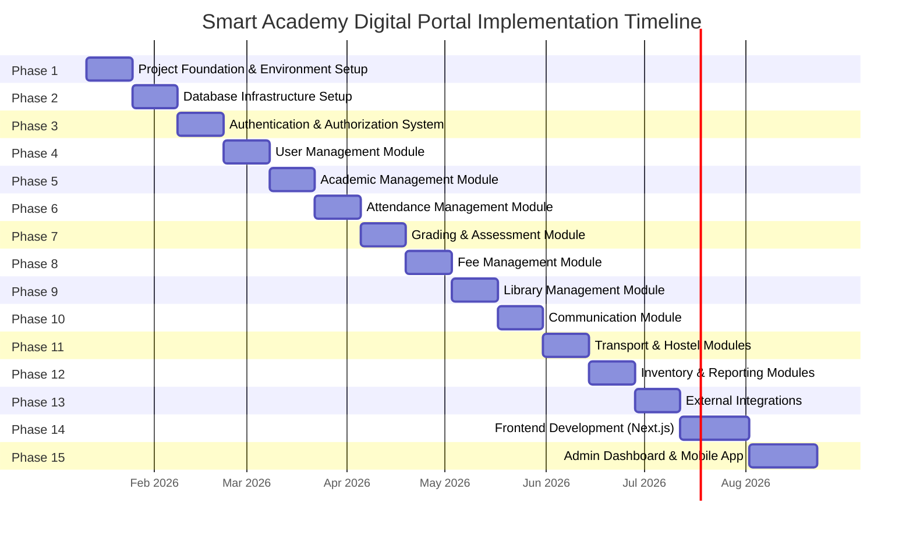
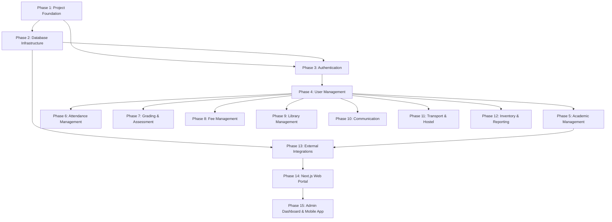

# Smart Academy Digital Portal - Master Implementation Roadmap v1.0

**Project:** Smart Academy Digital Portal  
**Version:** 1.0  
**Date:** 2026-01-10  
**Developer:** Solo Full-Stack Developer  
**Environment:** Linux OS, VS Code IDE, Local Database Server, Vite Build Server, HMR, Browser Preview

---

## Table of Contents

1. [Document Overview](#document-overview)
2. [Project Context](#project-context)
3. [Roadmap Overview](#roadmap-overview)
4. [Phase 1: Project Foundation & Environment Setup](#phase-1-project-foundation--environment-setup)
5. [Phase 2: Database Infrastructure Setup](#phase-2-database-infrastructure-setup)
6. [Phase 3: Authentication & Authorization System](#phase-3-authentication--authorization-system)
7. [Phase 4: User Management Module](#phase-4-user-management-module)
8. [Phase 5: Academic Management Module](#phase-5-academic-management-module)
9. [Phase 6: Attendance Management Module](#phase-6-attendance-management-module)
10. [Phase 7: Grading & Assessment Module](#phase-7-grading--assessment-module)
11. [Phase 8: Fee Management Module](#phase-8-fee-management-module)
12. [Phase 9: Library Management Module](#phase-9-library-management-module)
13. [Phase 10: Communication Module](#phase-10-communication-module)
14. [Phase 11: Transport & Hostel Modules](#phase-11-transport--hostel-modules)
15. [Phase 12: Inventory & Reporting Modules](#phase-12-inventory--reporting-modules)
16. [Phase 13: External Integrations (Gibbon & Moodle)](#phase-13-external-integrations-gibbon--moodle)
17. [Phase 14: Frontend Development (Next.js Web Portal)](#phase-14-frontend-development-nextjs-web-portal)
18. [Phase 15: Frontend Development (Admin Dashboard & Mobile App)](#phase-15-frontend-development-admin-dashboard--mobile-app)
19. [Appendix A: Phase Dependencies](#appendix-a-phase-dependencies)
20. [Appendix B: Risk Matrix](#appendix-b-risk-matrix)

---

## Document Overview

This Master Implementation Roadmap provides a comprehensive, step-by-step guide for developing the Smart Academy Digital Portal. The roadmap is designed for a solo full-stack developer working on a Linux-based development environment with VS Code, local databases, Vite build server, HMR, and browser preview capabilities.

### Key Characteristics

- **Total Phases:** 15
- **Total Milestones:** 150 (10 per phase)
- **Target Developer:** Solo Full-Stack Developer
- **Documentation Format:** Markdown
- **Development Approach:** Sequential, incremental delivery

---

## Project Context

### Project Summary

The Smart Academy Digital Portal is a comprehensive educational institution management system encompassing 13+ functional modules, 50+ API endpoints, 20+ database tables, 30+ UI components, and 6 external integrations.

### Technical Stack

- **Frontend:** Next.js 15, React 19, TypeScript, Tailwind CSS, Radix UI
- **Backend:** Fastify 5, TypeScript
- **Database:** PostgreSQL 17, Prisma 6 ORM
- **Caching:** Redis 7
- **Containerization:** Docker, Docker Compose
- **Web Server:** Nginx
- **Build Tools:** Vite 6, Turbopack
- **Mobile:** React Native with Expo

### Functional Modules

1. Authentication & Authorization
2. User Management
3. Academic Management
4. Attendance Management
5. Grading & Assessment
6. Fee Management
7. Library Management
8. Communication System
9. Transport Management
10. Hostel Management
11. Inventory Management
12. Reporting System
13. External Integrations (Gibbon SIS, Moodle LMS, Payment Gateways, SMS, Email)

---

## Roadmap Overview



---

## Phase 1: Project Foundation & Environment Setup

**Estimated Duration:** 2 weeks  
**Dependencies:** None  
**Risk Level:** Low

### Milestone 1: Install Linux OS Prerequisites and System Configuration

**Objective:** Configure the Linux operating system with all necessary system-level dependencies.

**Tasks:**
- Install latest Linux distribution (Ubuntu 24.04 LTS recommended)
- Update system packages: `sudo apt update && sudo apt upgrade -y`
- Install essential build tools: build-essential, curl, wget, git
- Configure system timezone: `sudo timedatectl set-timezone Asia/Dhaka`
- Set up system locale for UTF-8 support
- Configure system firewall (UFW) for development ports
- Install and configure SSH server for remote access
- Set up system monitoring tools (htop, iotop, nethogs)
- Configure swap space for adequate memory management
- Document system configuration in `docs/Development/DEV_System_Configuration.md`

**Deliverables:**
- Fully configured Linux development environment
- System configuration documentation
- Verified system performance baseline

**Acceptance Criteria:**
- All system packages are up-to-date
- Essential development tools are installed and functional
- System timezone and locale are correctly configured
- Firewall rules allow development traffic
- SSH access is secured and functional

---

### Milestone 2: Install Node.js 22 LTS and Configure Environment Variables

**Objective:** Install Node.js 22 LTS runtime and configure global environment variables.

**Tasks:**
- Install Node.js 22 LTS using NodeSource repository
- Verify Node.js installation: `node --version` (should be v22.x.x)
- Verify npm installation: `npm --version`
- Configure npm global directory: `mkdir -p ~/.npm-global`
- Set npm global path in `.bashrc` or `.zshrc`
- Configure NODE_ENV environment variable for development
- Set up npm registry configuration (use npmjs.org default)
- Configure npm cache location and size limits
- Create `.nvmrc` file specifying Node.js version
- Document Node.js configuration in `docs/Development/DEV_Node_Configuration.md`

**Deliverables:**
- Node.js 22 LTS installed and verified
- npm configured with appropriate settings
- Environment variables documented
- `.nvmrc` file created

**Acceptance Criteria:**
- Node.js version matches v22.x.x LTS
- npm can install global packages without sudo
- Environment variables are properly set
- npm cache is configured and functional

---

### Milestone 3: Install pnpm Package Manager and Configure npm Registry

**Objective:** Install pnpm as the primary package manager and configure registry settings.

**Tasks:**
- Install pnpm globally using npm: `npm install -g pnpm`
- Verify pnpm installation: `pnpm --version`
- Configure pnpm store location for efficient disk usage
- Set up pnpm workspace configuration for monorepo
- Configure pnpm to use npm registry
- Set up pnpm auto-install hooks
- Configure pnpm peer dependency behavior
- Create `.npmrc` file with pnpm-specific settings
- Document pnpm configuration in `docs/Development/DEV_PNPM_Configuration.md`
- Test pnpm with a sample package installation

**Deliverables:**
- pnpm installed and configured
- `.npmrc` configuration file
- pnpm workspace configuration
- Configuration documentation

**Acceptance Criteria:**
- pnpm version is current (8.x.x or higher)
- pnpm store is configured and functional
- Package installations work correctly
- Workspace configuration is set up for monorepo

---

### Milestone 4: Install Docker and Docker Compose for Containerization

**Objective:** Install Docker and Docker Compose for containerized development environment.

**Tasks:**
- Install Docker Engine following official Linux installation guide
- Add current user to docker group for non-sudo access
- Verify Docker installation: `docker --version`
- Verify Docker daemon is running: `sudo systemctl status docker`
- Install Docker Compose V2 plugin
- Verify Docker Compose: `docker compose version`
- Configure Docker daemon settings (storage driver, logging)
- Set up Docker network for development containers
- Create base Dockerfile templates for services
- Document Docker configuration in `docs/Development/DEV_Docker_Configuration.md`

**Deliverables:**
- Docker Engine installed and running
- Docker Compose V2 installed
- Docker daemon configured
- Base Dockerfile templates
- Docker configuration documentation

**Acceptance Criteria:**
- Docker can run containers without sudo
- Docker Compose can execute multi-container setups
- Docker daemon is optimized for development
- Base Dockerfiles are tested and functional

---

### Milestone 5: Install Git and Configure Git Workflow

**Objective:** Install Git and configure version control workflow for the project.

**Tasks:**
- Install Git: `sudo apt install git`
- Verify Git installation: `git --version`
- Configure Git user name and email
- Configure Git default branch name (main)
- Set up Git aliases for common commands
- Configure Git line endings and core settings
- Create `.gitignore` file for Node.js projects
- Set up Git commit message template
- Configure Git hooks directory
- Document Git workflow in `docs/Development/DEV_Git_Workflow.md`

**Deliverables:**
- Git installed and configured
- `.gitignore` file created
- Git commit message template
- Git workflow documentation

**Acceptance Criteria:**
- Git version is current (2.40+)
- User identity is configured
- `.gitignore` covers all necessary exclusions
- Commit template is in place

---

### Milestone 6: Install VS Code and Required Extensions

**Objective:** Install VS Code IDE and configure essential extensions for full-stack development.

**Tasks:**
- Download and install VS Code for Linux
- Verify VS Code installation
- Install VS Code command-line tools: `code --install-extension`
- Install essential extensions:
  - ESLint
  - Prettier
  - TypeScript and JavaScript Language Features
  - Tailwind CSS IntelliSense
  - Prisma
  - Docker
  - GitLens
  - Thunder Client (for API testing)
  - Auto Rename Tag
  - Path Intellisense
- Configure VS Code settings for the project
- Create `.vscode/settings.json` file
- Create `.vscode/extensions.json` for recommended extensions
- Document VS Code configuration in `docs/Development/DEV_VSCode_Configuration.md`

**Deliverables:**
- VS Code installed with all required extensions
- `.vscode/settings.json` configuration
- `.vscode/extensions.json` recommendations
- VS Code configuration documentation

**Acceptance Criteria:**
- All required extensions are installed
- VS Code settings are optimized for the project
- Code formatting and linting are configured
- Extensions are functional and tested

---

### Milestone 7: Create Project Directory Structure and Initialize Monorepo

**Objective:** Set up the project directory structure and initialize a Turborepo monorepo.

**Tasks:**
- Create root project directory: `smart-academy-portal`
- Create monorepo directory structure:
  ```
  smart-academy-portal/
  ├── apps/
  │   ├── web/              # Next.js web portal
  │   ├── admin/            # Admin dashboard (Vite + React)
  │   ├── api/              # Fastify backend
  │   └── mobile/           # React Native mobile app
  ├── packages/
  │   ├── ui/               # Shared UI components
  │   ├── config/           # Shared configurations
  │   ├── types/            # Shared TypeScript types
  │   └── utils/            # Shared utilities
  ├── docs/                 # Documentation
  ├── docker/               # Docker configurations
  └── scripts/              # Build and deployment scripts
  ```
- Initialize Git repository
- Initialize Turborepo: `pnpm create turbo@latest`
- Configure `turbo.json` for build pipeline
- Create `package.json` for root monorepo
- Set up workspace configuration in `pnpm-workspace.yaml`
- Document directory structure in `docs/Architecture/ARCH_Directory_Structure.md`

**Deliverables:**
- Complete monorepo directory structure
- Turborepo initialized and configured
- Git repository initialized
- Directory structure documentation

**Acceptance Criteria:**
- All required directories are created
- Turborepo configuration is valid
- Workspace configuration is correct
- Git repository is ready for commits

---

### Milestone 8: Configure Turborepo for Monorepo Build System

**Objective:** Configure Turborepo build system for efficient monorepo development.

**Tasks:**
- Create `turbo.json` configuration file
- Define build pipelines for each app and package
- Configure cache strategy for development builds
- Set up task dependencies between packages
- Configure output directories for builds
- Set up environment variable management
- Configure remote caching (optional)
- Create build scripts in root `package.json`
- Test build pipeline with sample packages
- Document Turborepo configuration in `docs/Development/DEV_Turborepo_Configuration.md`

**Deliverables:**
- `turbo.json` configuration file
- Build scripts in root `package.json`
- Working build pipeline
- Turborepo configuration documentation

**Acceptance Criteria:**
- Turborepo can build all packages
- Caching is working correctly
- Task dependencies are properly configured
- Build outputs are generated in correct locations

---

### Milestone 9: Set Up ESLint, Prettier, Husky, and lint-staged

**Objective:** Configure code quality tools and pre-commit hooks for consistent code style.

**Tasks:**
- Install ESLint and required plugins
- Create `.eslintrc.js` configuration file
- Configure ESLint rules for TypeScript, React, and Next.js
- Install Prettier and ESLint integration
- Create `.prettierrc` configuration file
- Configure Prettier rules for consistent formatting
- Install Husky for Git hooks
- Initialize Husky: `pnpm exec husky install`
- Install lint-staged for pre-commit linting
- Configure lint-staged in `.lintstagedrc.js`
- Create pre-commit hook for lint-staged
- Create commit-msg hook for conventional commits
- Document code quality configuration in `docs/Technology/TECH_Coding_Standards_v1.0.md`

**Deliverables:**
- `.eslintrc.js` configuration
- `.prettierrc` configuration
- Husky hooks configured
- lint-staged configuration
- Code quality documentation

**Acceptance Criteria:**
- ESLint catches code quality issues
- Prettier formats code consistently
- Pre-commit hooks run automatically
- lint-staged only checks staged files
- Commit messages follow conventional commits

---

### Milestone 10: Verify Development Environment Setup and Run Initial Tests

**Objective:** Verify all development tools are correctly configured and run initial validation tests.

**Tasks:**
- Create a test package to verify monorepo setup
- Build all packages using Turborepo
- Run ESLint on all packages
- Run Prettier check on all packages
- Test Git hooks with sample commits
- Verify Docker can build and run containers
- Test pnpm workspace functionality
- Verify VS Code extensions are working
- Create environment validation script
- Document verification results in `docs/Development/DEV_Environment_Verification.md`

**Deliverables:**
- Environment validation script
- Verification results documentation
- All development tools confirmed working

**Acceptance Criteria:**
- All packages build successfully
- Linting and formatting pass
- Git hooks execute correctly
- Docker containers run without errors
- Development environment is fully functional

---

## Phase 2: Database Infrastructure Setup

**Estimated Duration:** 2 weeks  
**Dependencies:** Phase 1  
**Risk Level:** Medium

### Milestone 1: Design PostgreSQL Schema with Prisma ORM

**Objective:** Design the complete PostgreSQL database schema using Prisma ORM.

**Tasks:**
- Review all functional requirements for data needs
- Identify all entities and their relationships
- Design entity-relationship diagram (ERD)
- Define primary keys and foreign keys
- Design indexes for query optimization
- Plan for data integrity constraints
- Consider normalization vs. denormalization trade-offs
- Document schema design decisions
- Create initial Prisma schema structure
- Review schema with stakeholders
- Document schema design in `docs/database_Design/DB_Schema_Design_v1.0.md`

**Deliverables:**
- Complete ERD documentation
- Initial Prisma schema file
- Schema design documentation

**Acceptance Criteria:**
- All functional requirements have corresponding data models
- Entity relationships are clearly defined
- Indexes are planned for performance
- Schema design is reviewed and approved

---

### Milestone 2: Create Prisma Schema File with All Entities

**Objective:** Create the complete Prisma schema file with all database entities.

**Tasks:**
- Create `apps/api/prisma/schema.prisma` file
- Define data source configuration for PostgreSQL
- Create all user-related models:
  - User, Role, Permission, UserRole
- Create academic models:
  - Class, Section, Subject, Student, Teacher
  - Enrollment, Assignment, Grade
- Create attendance models:
  - Attendance, AttendanceRecord, LeaveRequest
- Create fee models:
  - FeeStructure, FeePayment, PaymentTransaction
- Create library models:
  - Book, BookIssue, BookReturn, Fine
- Create communication models:
  - Notice, Message, Notification
- Create transport models:
  - Route, Vehicle, TransportAllocation
- Create hostel models:
  - Room, RoomAllocation, HostelFee
- Create inventory models:
  - Asset, PurchaseRecord, Maintenance
- Define all relationships between models
- Add indexes for frequently queried fields
- Configure Prisma client generation
- Document Prisma schema in `docs/database_Design/DB_Prisma_Schema_v1.0.md`

**Deliverables:**
- Complete `schema.prisma` file
- Prisma schema documentation

**Acceptance Criteria:**
- All required models are defined
- All relationships are correctly configured
- Indexes are added where needed
- Schema file is valid and generates client successfully

---

### Milestone 3: Set Up PostgreSQL Docker Container

**Objective:** Set up PostgreSQL database using Docker container.

**Tasks:**
- Create `docker/postgres/Dockerfile` for PostgreSQL
- Create `docker/postgres/init.sql` for database initialization
- Configure PostgreSQL environment variables:
  - POSTGRES_DB, POSTGRES_USER, POSTGRES_PASSWORD
- Set up PostgreSQL volume for data persistence
- Configure PostgreSQL port mapping
- Create PostgreSQL service in `docker-compose.yml`
- Configure PostgreSQL connection settings
- Set up PostgreSQL backup strategy
- Test PostgreSQL container startup
- Document PostgreSQL configuration in `docs/Development/DEV_PostgreSQL_Configuration.md`

**Deliverables:**
- PostgreSQL Dockerfile
- PostgreSQL initialization script
- PostgreSQL service in docker-compose.yml
- PostgreSQL configuration documentation

**Acceptance Criteria:**
- PostgreSQL container starts successfully
- Database is initialized with correct schema
- Data persists across container restarts
- Connection from application works

---

### Milestone 4: Set Up MySQL Docker Container for Gibbon/Moodle

**Objective:** Set up MySQL database for Gibbon SIS and Moodle LMS integrations.

**Tasks:**
- Create `docker/mysql/Dockerfile` for MySQL
- Create `docker/mysql/init.sql` for database initialization
- Configure MySQL environment variables:
  - MYSQL_ROOT_PASSWORD, MYSQL_DATABASE
- Set up MySQL volume for data persistence
- Configure MySQL port mapping
- Create MySQL service in `docker-compose.yml`
- Create separate databases for Gibbon and Moodle
- Configure MySQL character set and collation
- Test MySQL container startup
- Document MySQL configuration in `docs/Development/DEV_MySQL_Configuration.md`

**Deliverables:**
- MySQL Dockerfile
- MySQL initialization script
- MySQL service in docker-compose.yml
- MySQL configuration documentation

**Acceptance Criteria:**
- MySQL container starts successfully
- Gibbon and Moodle databases are created
- Data persists across container restarts
- Connection from integrations works

---

### Milestone 5: Set Up Redis Docker Container for Caching

**Objective:** Set up Redis for caching and session management.

**Tasks:**
- Create `docker/redis/Dockerfile` for Redis
- Configure Redis persistence (RDB and AOF)
- Configure Redis memory management
- Set up Redis volume for data persistence
- Configure Redis port mapping
- Create Redis service in `docker-compose.yml`
- Configure Redis password for security
- Set up Redis connection settings
- Test Redis container startup
- Document Redis configuration in `docs/Development/DEV_Redis_Configuration.md`

**Deliverables:**
- Redis Dockerfile
- Redis service in docker-compose.yml
- Redis configuration documentation

**Acceptance Criteria:**
- Redis container starts successfully
- Data persists with configured persistence
- Authentication is configured
- Connection from application works

---

### Milestone 6: Set Up MinIO Docker Container for Object Storage

**Objective:** Set up MinIO for file storage (documents, images, avatars).

**Tasks:**
- Create `docker/minio/Dockerfile` for MinIO
- Configure MinIO environment variables:
  - MINIO_ROOT_USER, MINIO_ROOT_PASSWORD
- Set up MinIO volume for data persistence
- Configure MinIO port mapping
- Create MinIO service in `docker-compose.yml`
- Create initial buckets for different file types
  - avatars, documents, images, exports
- Configure MinIO access policies
- Test MinIO container startup
- Document MinIO configuration in `docs/Development/DEV_MinIO_Configuration.md`

**Deliverables:**
- MinIO Dockerfile
- MinIO service in docker-compose.yml
- MinIO configuration documentation

**Acceptance Criteria:**
- MinIO container starts successfully
- All required buckets are created
- Access policies are configured
- Connection from application works

---

### Milestone 7: Create Database Migrations and Seed Data

**Objective:** Create Prisma migrations and seed initial data.

**Tasks:**
- Generate Prisma client: `npx prisma generate`
- Create initial migration: `npx prisma migrate dev --name init`
- Review generated migration SQL
- Create seed script: `prisma/seed.ts`
- Define seed data:
  - Default roles (Admin, Teacher, Student, Parent)
  - Default permissions
  - Sample academic data (classes, sections, subjects)
  - Sample users for testing
- Configure seed script in `package.json`
- Test migration execution
- Test seed data insertion
- Document migration and seed process in `docs/database_Design/DB_Migration_Guide_v1.0.md`

**Deliverables:**
- Prisma migration files
- Seed script with initial data
- Migration and seed documentation

**Acceptance Criteria:**
- Migrations apply successfully to database
- Seed data is inserted correctly
- Database is in expected state after seeding
- Migration rollback works correctly

---

### Milestone 8: Configure Database Connection Pooling

**Objective:** Configure database connection pooling for optimal performance.

**Tasks:**
- Configure Prisma connection pool settings
  - connection_limit, pool_timeout
- Configure connection timeout settings
- Set up connection pool monitoring
- Configure connection pool for PostgreSQL
- Configure connection pool for MySQL
- Test connection pool under load
- Monitor connection pool metrics
- Document connection pool configuration in `docs/database_Design/DB_Connection_Pooling_v1.0.md`

**Deliverables:**
- Connection pool configuration
- Connection pool monitoring setup
- Connection pool documentation

**Acceptance Criteria:**
- Connection pool is configured correctly
- Connection limits are enforced
- Pool handles concurrent connections efficiently
- Monitoring shows pool health

---

### Milestone 9: Set Up Database Backup and Restore Procedures

**Objective:** Set up automated database backup and restore procedures.

**Tasks:**
- Create backup script for PostgreSQL
- Create backup script for MySQL
- Configure backup schedule (daily, weekly)
- Set up backup retention policy
- Configure backup storage location
- Create restore script for PostgreSQL
- Create restore script for MySQL
- Test backup and restore procedures
- Document backup and restore procedures in `docs/database_Design/DB_Backup_Restore_v1.0.md`

**Deliverables:**
- Backup scripts
- Restore scripts
- Backup schedule configuration
- Backup and restore documentation

**Acceptance Criteria:**
- Backups run automatically on schedule
- Backups are stored securely
- Restore procedure works correctly
- Documentation is clear and complete

---

### Milestone 10: Test Database Connectivity and CRUD Operations

**Objective:** Test database connectivity and verify CRUD operations work correctly.

**Tasks:**
- Create test script to verify database connectivity
- Test connection to PostgreSQL
- Test connection to MySQL
- Test connection to Redis
- Test connection to MinIO
- Create CRUD operation tests for each entity:
  - Create operations
  - Read operations (single and list)
  - Update operations
  - Delete operations
- Test relationships between entities
- Test transaction handling
- Test error handling
- Document test results in `docs/database_Design/DB_CRUD_Tests_v1.0.md`

**Deliverables:**
- Database connectivity test script
- CRUD operation test suite
- Test results documentation

**Acceptance Criteria:**
- All database connections are successful
- All CRUD operations work correctly
- Relationships are properly maintained
- Transactions work as expected
- Error handling is robust

---

## Phase 3: Authentication & Authorization System

**Estimated Duration:** 2 weeks  
**Dependencies:** Phase 1, Phase 2  
**Risk Level:** High

### Milestone 1: Design JWT Authentication Architecture

**Objective:** Design the JWT-based authentication architecture.

**Tasks:**
- Research JWT best practices for authentication
- Design token structure (access token, refresh token)
- Define token payload structure
- Design token generation and validation flow
- Design token refresh mechanism
- Design token revocation strategy
- Define token expiration policies
- Design token storage strategy (httpOnly cookies)
- Document authentication architecture in `docs/Security/SEC_Auth_Architecture_v1.0.md`
- Create authentication flow diagram

**Deliverables:**
- Authentication architecture document
- Authentication flow diagram
- Token design specifications

**Acceptance Criteria:**
- Authentication architecture is secure and follows best practices
- Token structure is well-defined
- Refresh mechanism is designed
- Revocation strategy is clear

---

### Milestone 2: Create User Registration Endpoint with Email Verification

**Objective:** Create user registration API endpoint with email verification.

**Tasks:**
- Design registration API endpoint: `POST /api/auth/register`
- Define registration request payload:
  - email, password, firstName, lastName, role
- Implement password hashing with bcrypt
- Create user record in database
- Generate email verification token
- Send verification email using SendGrid
- Create email verification endpoint: `POST /api/auth/verify-email`
- Implement token validation
- Activate user account upon verification
- Add input validation and error handling
- Document registration API in `docs/Api_Integration/API_Specification_v1.0.md`

**Deliverables:**
- Registration API endpoint
- Email verification endpoint
- Email templates for verification
- API documentation

**Acceptance Criteria:**
- Users can register successfully
- Passwords are securely hashed
- Verification emails are sent
- Email verification activates account
- Error handling is comprehensive

---

### Milestone 3: Create User Login Endpoint with JWT Token Generation

**Objective:** Create user login API endpoint with JWT token generation.

**Tasks:**
- Design login API endpoint: `POST /api/auth/login`
- Define login request payload:
  - email, password
- Implement password verification with bcrypt
- Generate JWT access token
- Generate JWT refresh token
- Store refresh token in Redis
- Set httpOnly cookies for tokens
- Implement rate limiting for login attempts
- Add account lockout after failed attempts
- Document login API in `docs/Api_Integration/API_Specification_v1.0.md`

**Deliverables:**
- Login API endpoint
- JWT token generation logic
- Rate limiting implementation
- API documentation

**Acceptance Criteria:**
- Users can login with correct credentials
- JWT tokens are generated correctly
- Tokens are stored securely
- Rate limiting prevents brute force
- Account lockout works after failed attempts

---

### Milestone 4: Implement Password Reset Functionality with Email/SMS

**Objective:** Implement password reset functionality with email and SMS notifications.

**Tasks:**
- Design password reset request endpoint: `POST /api/auth/reset-password-request`
- Generate password reset token
- Send reset email using SendGrid
- Send reset SMS using BulkSMSBD
- Store reset token in Redis with expiration
- Design password reset endpoint: `POST /api/auth/reset-password`
- Validate reset token
- Update user password with new hash
- Invalidate all existing tokens
- Add rate limiting for reset requests
- Document password reset API in `docs/Api_Integration/API_Specification_v1.0.md`

**Deliverables:**
- Password reset request endpoint
- Password reset endpoint
- Email and SMS templates
- API documentation

**Acceptance Criteria:**
- Users can request password reset
- Reset emails and SMS are sent
- Reset tokens are validated correctly
- Passwords are updated securely
- Old tokens are invalidated

---

### Milestone 5: Implement Role-Based Access Control (RBAC) System

**Objective:** Implement role-based access control system for authorization.

**Tasks:**
- Define roles: Admin, Teacher, Student, Parent, Staff
- Define permissions for each role
- Create permission constants
- Implement permission checking middleware
- Create role assignment API
- Create permission checking utility functions
- Implement route protection based on roles
- Implement resource-level authorization
- Document RBAC system in `docs/Security/SEC_RBAC_v1.0.md`
- Create permission matrix documentation

**Deliverables:**
- RBAC middleware
- Permission checking utilities
- Role assignment API
- RBAC documentation

**Acceptance Criteria:**
- Roles are clearly defined
- Permissions are enforced correctly
- Routes are protected based on roles
- Resource-level authorization works
- Permission matrix is documented

---

### Milestone 6: Create Refresh Token Mechanism

**Objective:** Implement refresh token mechanism for maintaining user sessions.

**Tasks:**
- Design refresh token endpoint: `POST /api/auth/refresh`
- Validate refresh token from Redis
- Generate new access token
- Generate new refresh token
- Invalidate old refresh token
- Store new refresh token
- Implement refresh token rotation
- Handle expired refresh tokens
- Implement logout endpoint: `POST /api/auth/logout`
- Invalidate all user tokens on logout
- Document refresh token API in `docs/Api_Integration/API_Specification_v1.0.md`

**Deliverables:**
- Refresh token endpoint
- Logout endpoint
- Token rotation logic
- API documentation

**Acceptance Criteria:**
- Refresh tokens generate new access tokens
- Token rotation prevents token reuse
- Logout invalidates all tokens
- Expired tokens are handled correctly
- Session management is secure

---

### Milestone 7: Implement Session Management with Redis

**Objective:** Implement session management using Redis for active user sessions.

**Tasks:**
- Design session data structure
- Create session creation function
- Create session retrieval function
- Create session update function
- Create session deletion function
- Implement session expiration
- Store session data in Redis
- Implement concurrent session limits
- Implement session activity tracking
- Document session management in `docs/Security/SEC_Session_Management_v1.0.md`

**Deliverables:**
- Session management utilities
- Redis session storage
- Session tracking implementation
- Session management documentation

**Acceptance Criteria:**
- Sessions are created and stored correctly
- Session data is retrieved accurately
- Sessions expire automatically
- Concurrent sessions are limited
- Session activity is tracked

---

### Milestone 8: Create Authentication Middleware for API Protection

**Objective:** Create authentication middleware to protect API endpoints.

**Tasks:**
- Create authentication middleware function
- Extract and validate JWT from request
- Verify token signature and expiration
- Attach user data to request object
- Create authorization middleware function
- Check user permissions
- Handle authentication errors
- Create error responses for unauthorized access
- Apply middleware to protected routes
- Document middleware usage in `docs/Security/SEC_Middleware_v1.0.md`

**Deliverables:**
- Authentication middleware
- Authorization middleware
- Protected route configuration
- Middleware documentation

**Acceptance Criteria:**
- Middleware validates tokens correctly
- Unauthorized requests are rejected
- User data is attached to requests
- Permissions are checked properly
- Error responses are clear

---

### Milestone 9: Implement MFA (Multi-Factor Authentication) Support

**Objective:** Implement multi-factor authentication for enhanced security.

**Tasks:**
- Research MFA implementation options (TOTP, SMS)
- Design MFA setup flow
- Create MFA setup endpoint: `POST /api/auth/mfa/setup`
- Generate TOTP secret
- Generate QR code for authenticator apps
- Store MFA secret securely
- Create MFA verification endpoint: `POST /api/auth/mfa/verify`
- Implement TOTP token validation
- Implement backup codes generation
- Add MFA option to login flow
- Document MFA implementation in `docs/Security/SEC_MFA_v1.0.md`

**Deliverables:**
- MFA setup endpoint
- MFA verification endpoint
- QR code generation
- Backup codes implementation
- MFA documentation

**Acceptance Criteria:**
- Users can set up MFA
- QR codes are generated correctly
- TOTP tokens are validated
- Backup codes work as fallback
- MFA is integrated into login flow

---

### Milestone 10: Write Unit and Integration Tests for Authentication

**Objective:** Write comprehensive tests for authentication system.

**Tasks:**
- Set up testing framework (Jest)
- Write unit tests for registration endpoint
- Write unit tests for login endpoint
- Write unit tests for password reset
- Write unit tests for token generation
- Write unit tests for RBAC
- Write integration tests for auth flows
- Write tests for middleware
- Write tests for MFA
- Document test coverage in `docs/Testing/TEST_Auth_Tests_v1.0.md`

**Deliverables:**
- Unit test suite
- Integration test suite
- Test coverage report
- Test documentation

**Acceptance Criteria:**
- All authentication endpoints are tested
- Test coverage is above 80%
- All tests pass
- Edge cases are covered
- Tests are maintainable

---

## Phase 4: User Management Module

**Estimated Duration:** 2 weeks  
**Dependencies:** Phase 3  
**Risk Level:** Medium

### Milestone 1: Design User Profile Data Model

**Objective:** Design comprehensive user profile data model.

**Tasks:**
- Define user profile fields:
  - personalInfo, contactInfo, academicInfo, emergencyContact
- Define student-specific fields
- Define teacher-specific fields
- Define parent-specific fields
- Design profile image storage
- Design profile completion tracking
- Document profile data model in `docs/database_Design/DB_User_Profile_Model_v1.0.md`
- Create profile validation rules

**Deliverables:**
- User profile data model
- Profile validation rules
- Profile model documentation

**Acceptance Criteria:**
- Profile model covers all user types
- Fields are properly typed
- Validation rules are comprehensive
- Model is documented

---

### Milestone 2: Create User CRUD API Endpoints

**Objective:** Create CRUD API endpoints for user management.

**Tasks:**
- Create GET /api/users endpoint (list users)
- Create GET /api/users/:id endpoint (get user)
- Create POST /api/users endpoint (create user)
- Create PUT /api/users/:id endpoint (update user)
- Create DELETE /api/users/:id endpoint (delete user)
- Implement pagination for user list
- Implement filtering and sorting
- Add input validation
- Add error handling
- Document user API in `docs/Api_Integration/API_Specification_v1.0.md`

**Deliverables:**
- User CRUD endpoints
- Pagination implementation
- Filtering and sorting
- API documentation

**Acceptance Criteria:**
- All CRUD operations work
- Pagination functions correctly
- Filtering and sorting work
- Input validation catches errors
- API documentation is complete

---

### Milestone 3: Implement Bulk User Import Functionality

**Objective:** Implement bulk user import from CSV/Excel files.

**Tasks:**
- Design bulk import endpoint: `POST /api/users/import`
- Implement file upload handling
- Parse CSV files
- Parse Excel files
- Validate imported data
- Create user records in batch
- Handle duplicate users
- Generate import report
- Send notification on completion
- Document import process in `docs/Api_Integration/API_Bulk_Import_v1.0.md`

**Deliverables:**
- Bulk import endpoint
- CSV parser
- Excel parser
- Import report generator
- Import documentation

**Acceptance Criteria:**
- Files upload successfully
- Data is parsed correctly
- Validation catches errors
- Users are created in batch
- Import report is accurate

---

### Milestone 4: Create User Avatar Upload Functionality

**Objective:** Implement user avatar upload functionality.

**Tasks:**
- Design avatar upload endpoint: `POST /api/users/:id/avatar`
- Implement file upload handling
- Validate image file types
- Resize and optimize images
- Store images in MinIO
- Update user avatar URL in database
- Delete old avatar when updated
- Serve avatar images
- Document avatar upload in `docs/Api_Integration/API_File_Upload_v1.0.md`

**Deliverables:**
- Avatar upload endpoint
- Image processing logic
- MinIO integration
- Avatar serving
- Upload documentation

**Acceptance Criteria:**
- Images upload successfully
- File types are validated
- Images are optimized
- Images are stored in MinIO
- Old avatars are deleted

---

### Milestone 5: Implement User Activation/Deactivation

**Objective:** Implement user account activation and deactivation functionality.

**Tasks:**
- Create activation endpoint: `POST /api/users/:id/activate`
- Create deactivation endpoint: `POST /api/users/:id/deactivate`
- Implement status change logic
- Invalidate active sessions on deactivation
- Send notification on status change
- Log status change history
- Add authorization checks
- Document activation/deactivation in `docs/Api_Integration/API_User_Status_v1.0.md`

**Deliverables:**
- Activation endpoint
- Deactivation endpoint
- Status change logging
- Notification system
- Status management documentation

**Acceptance Criteria:**
- Accounts can be activated
- Accounts can be deactivated
- Sessions are invalidated
- Notifications are sent
- Status history is logged

---

### Milestone 6: Create Parent-Child Relationship Mapping

**Objective:** Implement parent-child relationship mapping for students.

**Tasks:**
- Design parent-child relationship model
- Create relationship endpoint: `POST /api/users/:parentId/children/:studentId`
- Create bulk relationship endpoint
- Implement relationship validation
- Create relationship query endpoint
- Remove relationship endpoint
- Document relationship mapping in `docs/Api_Integration/API_Parent_Child_v1.0.md`

**Deliverables:**
- Parent-child relationship model
- Relationship endpoints
- Relationship validation
- Relationship documentation

**Acceptance Criteria:**
- Parents can be linked to students
- Multiple parents per student supported
- Relationships are validated
- Relationships can be queried
- Relationships can be removed

---

### Milestone 7: Implement User Search and Filtering

**Objective:** Implement advanced user search and filtering capabilities.

**Tasks:**
- Design search endpoint: `GET /api/users/search`
- Implement full-text search
- Implement filter by role
- Implement filter by class
- Implement filter by status
- Implement sorting options
- Implement search suggestions
- Optimize search queries with indexes
- Document search functionality in `docs/Api_Integration/API_User_Search_v1.0.md`

**Deliverables:**
- Search endpoint
- Full-text search implementation
- Filtering options
- Sorting options
- Search documentation

**Acceptance Criteria:**
- Search returns relevant results
- Filters work correctly
- Sorting works as expected
- Search is performant
- Suggestions are helpful

---

### Milestone 8: Create User Management Admin UI Components

**Objective:** Build admin UI components for user management.

**Tasks:**
- Create user list component
- Create user detail component
- Create user form component
- Create user search component
- Create bulk import component
- Create avatar upload component
- Implement pagination UI
- Implement filtering UI
- Implement sorting UI
- Document UI components in `docs/UI_UX/UX_User_Management_Components_v1.0.md`

**Deliverables:**
- User list component
- User detail component
- User form component
- Search and filter components
- UI component documentation

**Acceptance Criteria:**
- Components are reusable
- Components are accessible
- Components are responsive
- Components follow design system
- Components are documented

---

### Milestone 9: Implement User Permissions Management

**Objective:** Implement UI and API for managing user permissions.

**Tasks:**
- Create permissions management endpoint: `PUT /api/users/:id/permissions`
- Design permissions UI component
- Implement permission assignment
- Implement permission revocation
- Implement permission templates
- Implement bulk permission updates
- Add permission change logging
- Document permissions management in `docs/Security/SEC_Permissions_Management_v1.0.md`

**Deliverables:**
- Permissions endpoint
- Permissions UI component
- Permission templates
- Permissions documentation

**Acceptance Criteria:**
- Permissions can be assigned
- Permissions can be revoked
- Templates work correctly
- Bulk updates function
- Changes are logged

---

### Milestone 10: Write Tests for User Management Module

**Objective:** Write comprehensive tests for user management module.

**Tasks:**
- Write unit tests for CRUD operations
- Write unit tests for bulk import
- Write unit tests for avatar upload
- Write unit tests for activation/deactivation
- Write unit tests for parent-child relationships
- Write unit tests for search and filtering
- Write integration tests for user flows
- Write UI component tests
- Document test coverage in `docs/Testing/TEST_User_Management_Tests_v1.0.md`

**Deliverables:**
- Unit test suite
- Integration test suite
- UI component tests
- Test coverage report
- Test documentation

**Acceptance Criteria:**
- All endpoints are tested
- Test coverage is above 80%
- All tests pass
- Edge cases are covered
- Tests are maintainable

---

## Phase 5: Academic Management Module

**Estimated Duration:** 2 weeks  
**Dependencies:** Phase 4  
**Risk Level:** Medium

### Milestone 1: Design Academic Data Models

**Objective:** Design comprehensive academic data models.

**Tasks:**
- Define Class model
- Define Section model
- Define Subject model
- Define Enrollment model
- Define Timetable model
- Define AcademicCalendar model
- Define relationships between models
- Document academic data models in `docs/database_Design/DB_Academic_Models_v1.0.md`

**Deliverables:**
- Academic data models
- Model relationships
- Model documentation

**Acceptance Criteria:**
- All academic entities are modeled
- Relationships are correct
- Models are properly typed
- Models are documented

---

### Milestone 2: Create Class/Section Management API Endpoints

**Objective:** Create API endpoints for class and section management.

**Tasks:**
- Create GET /api/classes endpoint
- Create POST /api/classes endpoint
- Create PUT /api/classes/:id endpoint
- Create DELETE /api/classes/:id endpoint
- Create GET /api/sections endpoint
- Create POST /api/sections endpoint
- Create PUT /api/sections/:id endpoint
- Create DELETE /api/sections/:id endpoint
- Document class/section API in `docs/Api_Integration/API_Academic_v1.0.md`

**Deliverables:**
- Class management endpoints
- Section management endpoints
- API documentation

**Acceptance Criteria:**
- All CRUD operations work
- Input validation is comprehensive
- Error handling is robust
- API documentation is complete

---

### Milestone 3: Create Subject Management API Endpoints

**Objective:** Create API endpoints for subject management.

**Tasks:**
- Create GET /api/subjects endpoint
- Create POST /api/subjects endpoint
- Create PUT /api/subjects/:id endpoint
- Create DELETE /api/subjects/:id endpoint
- Create endpoint to assign subjects to classes
- Create endpoint to assign teachers to subjects
- Document subject API in `docs/Api_Integration/API_Academic_v1.0.md`

**Deliverables:**
- Subject management endpoints
- Subject assignment endpoints
- API documentation

**Acceptance Criteria:**
- All CRUD operations work
- Subject assignments work correctly
- Input validation is comprehensive
- API documentation is complete

---

### Milestone 4: Implement Timetable Scheduling System

**Objective:** Implement timetable scheduling system.

**Tasks:**
- Design timetable data model
- Create timetable management endpoint: `POST /api/timetable`
- Create timetable query endpoint: `GET /api/timetable/:classId`
- Implement conflict detection
- Implement timetable validation
- Create timetable generation algorithm
- Implement timetable export functionality
- Document timetable system in `docs/Api_Integration/API_Timetable_v1.0.md`

**Deliverables:**
- Timetable data model
- Timetable management endpoints
- Conflict detection
- Timetable documentation

**Acceptance Criteria:**
- Timetables can be created
- Conflicts are detected
- Timetables can be queried
- Export functionality works
- System is documented

---

### Milestone 5: Create Academic Calendar Management

**Objective:** Implement academic calendar management system.

**Tasks:**
- Design academic calendar data model
- Create calendar event endpoint: `POST /api/calendar/events`
- Create calendar query endpoint: `GET /api/calendar/events`
- Implement event types (holidays, exams, events)
- Implement recurring events
- Implement calendar export (iCal format)
- Document calendar system in `docs/Api_Integration/API_Calendar_v1.0.md`

**Deliverables:**
- Calendar data model
- Calendar management endpoints
- Event types configuration
- Calendar documentation

**Acceptance Criteria:**
- Events can be created
- Recurring events work
- Calendar can be queried
- Export to iCal works
- System is documented

---

### Milestone 6: Implement Student Promotion/Demotion Logic

**Objective:** Implement student promotion and demotion functionality.

**Tasks:**
- Design promotion/demotion data model
- Create promotion endpoint: `POST /api/students/:id/promote`
- Create demotion endpoint: `POST /api/students/:id/demote`
- Implement promotion validation
- Implement academic record transfer
- Implement bulk promotion
- Generate promotion report
- Document promotion system in `docs/Api_Integration/API_Promotion_v1.0.md`

**Deliverables:**
- Promotion/demotion endpoints
- Validation logic
- Bulk promotion
- Promotion documentation

**Acceptance Criteria:**
- Students can be promoted
- Students can be demoted
- Validation prevents invalid promotions
- Bulk promotion works
- Reports are generated

---

### Milestone 7: Create Class Teacher Assignment Functionality

**Objective:** Implement class teacher assignment system.

**Tasks:**
- Design class teacher assignment model
- Create assignment endpoint: `POST /api/classes/:id/teacher`
- Create query endpoint: `GET /api/teachers/classes`
- Implement assignment validation
- Implement teacher workload tracking
- Create teacher class list view
- Document assignment system in `docs/Api_Integration/API_Class_Teacher_v1.0.md`

**Deliverables:**
- Assignment endpoints
- Validation logic
- Workload tracking
- Assignment documentation

**Acceptance Criteria:**
- Teachers can be assigned to classes
- Assignments are validated
- Workload is tracked
- Class lists are accurate
- System is documented

---

### Milestone 8: Build Academic Management Admin UI

**Objective:** Build admin UI for academic management.

**Tasks:**
- Create class management UI
- Create section management UI
- Create subject management UI
- Create timetable UI
- Create calendar UI
- Create promotion UI
- Implement responsive design
- Document UI in `docs/UI_UX/UX_Academic_UI_v1.0.md`

**Deliverables:**
- Academic management UI components
- Timetable interface
- Calendar interface
- UI documentation

**Acceptance Criteria:**
- UI is user-friendly
- UI is responsive
- UI follows design system
- All features are accessible
- UI is documented

---

### Milestone 9: Implement Academic Reports Generation

**Objective:** Implement academic reports generation system.

**Tasks:**
- Design report templates
- Create class list report
- Create student enrollment report
- Create subject assignment report
- Create timetable report
- Implement PDF generation
- Implement Excel export
- Document reports in `docs/Api_Integration/API_Academic_Reports_v1.0.md`

**Deliverables:**
- Report templates
- Report generation endpoints
- PDF generation
- Report documentation

**Acceptance Criteria:**
- Reports generate correctly
- PDFs are formatted properly
- Excel exports work
- Reports are accurate
- System is documented

---

### Milestone 10: Write Tests for Academic Management Module

**Objective:** Write comprehensive tests for academic management module.

**Tasks:**
- Write unit tests for class/section management
- Write unit tests for subject management
- Write unit tests for timetable
- Write unit tests for calendar
- Write unit tests for promotion/demotion
- Write integration tests for academic flows
- Document test coverage in `docs/Testing/TEST_Academic_Tests_v1.0.md`

**Deliverables:**
- Unit test suite
- Integration test suite
- Test coverage report
- Test documentation

**Acceptance Criteria:**
- All endpoints are tested
- Test coverage is above 80%
- All tests pass
- Edge cases are covered
- Tests are maintainable

---

## Phase 6: Attendance Management Module

**Estimated Duration:** 2 weeks  
**Dependencies:** Phase 5  
**Risk Level:** Medium

### Milestone 1: Design Attendance Data Model

**Objective:** Design attendance data model.

**Tasks:**
- Define Attendance model
- Define AttendanceRecord model
- Define LeaveRequest model
- Define relationships
- Document attendance model in `docs/database_Design/DB_Attendance_Model_v1.0.md`

**Deliverables:**
- Attendance data model
- Model relationships
- Model documentation

**Acceptance Criteria:**
- Model captures all attendance data
- Relationships are correct
- Model is properly typed
- Model is documented

---

### Milestone 2: Create Daily Attendance Marking API

**Objective:** Create API for marking daily attendance.

**Tasks:**
- Create attendance marking endpoint: `POST /api/attendance/mark`
- Create bulk attendance endpoint: `POST /api/attendance/bulk`
- Implement attendance validation
- Create attendance query endpoint: `GET /api/attendance`
- Implement date range filtering
- Document attendance API in `docs/Api_Integration/API_Attendance_v1.0.md`

**Deliverables:**
- Attendance marking endpoints
- Attendance query endpoints
- Validation logic
- API documentation

**Acceptance Criteria:**
- Attendance can be marked
- Bulk marking works
- Attendance can be queried
- Filtering works correctly
- API is documented

---

### Milestone 3: Implement Attendance Notification System

**Objective:** Implement notification system for attendance.

**Tasks:**
- Design notification data model
- Create notification templates
- Implement SMS notifications via BulkSMSBD
- Implement email notifications via SendGrid
- Create notification preferences
- Implement notification scheduling
- Document notification system in `docs/Api_Integration/API_Attendance_Notifications_v1.0.md`

**Deliverables:**
- Notification templates
- SMS integration
- Email integration
- Notification documentation

**Acceptance Criteria:**
- Notifications are sent on attendance mark
- SMS integration works
- Email integration works
- Preferences are respected
- System is documented

---

### Milestone 4: Create Monthly/Term Attendance Reports

**Objective:** Create attendance reporting system.

**Tasks:**
- Design report templates
- Create monthly attendance report
- Create term attendance report
- Create student attendance summary
- Create class attendance summary
- Implement PDF generation
- Implement Excel export
- Document reports in `docs/Api_Integration/API_Attendance_Reports_v1.0.md`

**Deliverables:**
- Report templates
- Report generation endpoints
- PDF generation
- Report documentation

**Acceptance Criteria:**
- Reports generate correctly
- PDFs are formatted properly
- Excel exports work
- Reports are accurate
- System is documented

---

### Milestone 5: Implement Leave Request Processing

**Objective:** Implement leave request management system.

**Tasks:**
- Design leave request data model
- Create leave request endpoint: `POST /api/leave-requests`
- Create approval endpoint: `PUT /api/leave-requests/:id/approve`
- Create rejection endpoint: `PUT /api/leave-requests/:id/reject`
- Implement leave balance tracking
- Implement leave type configuration
- Document leave system in `docs/Api_Integration/API_Leave_Requests_v1.0.md`

**Deliverables:**
- Leave request endpoints
- Leave balance tracking
- Leave type configuration
- Leave system documentation

**Acceptance Criteria:**
- Leave requests can be created
- Requests can be approved/rejected
- Leave balance is tracked
- Leave types are configurable
- System is documented

---

### Milestone 6: Create Attendance Analytics Dashboard

**Objective:** Build attendance analytics dashboard.

**Tasks:**
- Design analytics metrics
- Create attendance rate calculation
- Create trend analysis
- Create comparison charts
- Implement data visualization
- Create dashboard UI
- Document analytics in `docs/UI_UX/UX_Attendance_Analytics_v1.0.md`

**Deliverables:**
- Analytics calculation logic
- Data visualization
- Dashboard UI
- Analytics documentation

**Acceptance Criteria:**
- Metrics are calculated correctly
- Trends are accurate
- Visualizations are clear
- Dashboard is user-friendly
- System is documented

---

### Milestone 7: Implement Biometric Integration Readiness

**Objective:** Prepare system for biometric integration.

**Tasks:**
- Design biometric data model
- Create biometric data endpoint: `POST /api/attendance/biometric`
- Implement biometric data validation
- Create biometric device integration interface
- Document biometric integration in `docs/Api_Integration/API_Biometric_Integration_v1.0.md`

**Deliverables:**
- Biometric data model
- Biometric endpoint
- Integration interface
- Integration documentation

**Acceptance Criteria:**
- Biometric data can be received
- Data is validated
- Integration interface is ready
- System is documented

---

### Milestone 8: Build Attendance Management UI

**Objective:** Build UI for attendance management.

**Tasks:**
- Create attendance marking UI
- Create attendance view UI
- Create leave request UI
- Create reports UI
- Create analytics dashboard UI
- Implement responsive design
- Document UI in `docs/UI_UX/UX_Attendance_UI_v1.0.md`

**Deliverables:**
- Attendance marking UI
- Attendance view UI
- Leave request UI
- UI documentation

**Acceptance Criteria:**
- UI is user-friendly
- UI is responsive
- UI follows design system
- All features are accessible
- UI is documented

---

### Milestone 9: Implement Attendance Export Functionality

**Objective:** Implement attendance data export.

**Tasks:**
- Design export formats
- Implement CSV export
- Implement Excel export
- Implement PDF export
- Create export endpoint: `GET /api/attendance/export`
- Document export functionality in `docs/Api_Integration/API_Attendance_Export_v1.0.md`

**Deliverables:**
- Export endpoints
- CSV export
- Excel export
- PDF export
- Export documentation

**Acceptance Criteria:**
- CSV export works
- Excel export works
- PDF export works
- Exports are accurate
- System is documented

---

### Milestone 10: Write Tests for Attendance Management Module

**Objective:** Write comprehensive tests for attendance module.

**Tasks:**
- Write unit tests for attendance marking
- Write unit tests for notifications
- Write unit tests for leave requests
- Write unit tests for reports
- Write unit tests for analytics
- Write integration tests for attendance flows
- Document test coverage in `docs/Testing/TEST_Attendance_Tests_v1.0.md`

**Deliverables:**
- Unit test suite
- Integration test suite
- Test coverage report
- Test documentation

**Acceptance Criteria:**
- All endpoints are tested
- Test coverage is above 80%
- All tests pass
- Edge cases are covered
- Tests are maintainable

---

## Phase 7: Grading & Assessment Module

**Estimated Duration:** 2 weeks  
**Dependencies:** Phase 5  
**Risk Level:** Medium

### Milestone 1: Design Grading Data Model

**Objective:** Design grading data model.

**Tasks:**
- Define Assignment model
- Define Exam model
- Define Grade model
- Define Gradebook model
- Define relationships
- Document grading model in `docs/database_Design/DB_Grading_Model_v1.0.md`

**Deliverables:**
- Grading data model
- Model relationships
- Model documentation

**Acceptance Criteria:**
- Model captures all grading data
- Relationships are correct
- Model is properly typed
- Model is documented

---

### Milestone 2: Create Assignment Creation and Distribution API

**Objective:** Create API for assignment management.

**Tasks:**
- Create assignment endpoint: `POST /api/assignments`
- Create assignment distribution endpoint: `POST /api/assignments/:id/distribute`
- Implement assignment submission endpoint: `POST /api/assignments/:id/submit`
- Create assignment query endpoints
- Implement file upload for assignments
- Document assignment API in `docs/Api_Integration/API_Assignments_v1.0.md`

**Deliverables:**
- Assignment endpoints
- Distribution logic
- Submission handling
- API documentation

**Acceptance Criteria:**
- Assignments can be created
- Assignments can be distributed
- Submissions work correctly
- File uploads work
- API is documented

---

### Milestone 3: Implement Online Exam Management

**Objective:** Implement online exam system.

**Tasks:**
- Design exam data model
- Create exam creation endpoint: `POST /api/exams`
- Create exam question endpoint: `POST /api/exams/:id/questions`
- Create exam taking endpoint: `POST /api/exams/:id/submit`
- Implement exam grading
- Implement exam timer
- Document exam system in `docs/Api_Integration/API_Exams_v1.0.md`

**Deliverables:**
- Exam endpoints
- Question management
- Exam grading
- Exam documentation

**Acceptance Criteria:**
- Exams can be created
- Questions can be added
- Exams can be taken
- Grading works correctly
- System is documented

---

### Milestone 4: Create Gradebook with Customizable Grading Scales

**Objective:** Create gradebook with customizable grading.

**Tasks:**
- Design gradebook data model
- Create grading scale endpoint: `POST /api/grading-scales`
- Create grade entry endpoint: `POST /api/grades`
- Create gradebook query endpoint: `GET /api/gradebook/:studentId`
- Implement grade calculation
- Document gradebook in `docs/Api_Integration/API_Gradebook_v1.0.md`

**Deliverables:**
- Gradebook endpoints
- Grading scale management
- Grade calculation
- Gradebook documentation

**Acceptance Criteria:**
- Grades can be entered
- Grading scales are customizable
- Gradebook can be queried
- Calculations are accurate
- System is documented

---

### Milestone 5: Implement Report Card Generation

**Objective:** Implement report card generation system.

**Tasks:**
- Design report card template
- Create report card generation endpoint: `GET /api/report-cards/:studentId`
- Implement PDF generation
- Implement grade summary
- Implement performance comments
- Implement signature section
- Document report cards in `docs/Api_Integration/API_Report_Cards_v1.0.md`

**Deliverables:**
- Report card endpoint
- PDF generation
- Report card template
- Report card documentation

**Acceptance Criteria:**
- Report cards generate correctly
- PDFs are formatted properly
- Grades are summarized
- Comments are included
- System is documented

---

### Milestone 6: Create Performance Analytics

**Objective:** Create performance analytics system.

**Tasks:**
- Design analytics metrics
- Create student performance endpoint
- Create class performance endpoint
- Create subject performance endpoint
- Implement trend analysis
- Implement comparison charts
- Document analytics in `docs/Api_Integration/API_Performance_Analytics_v1.0.md`

**Deliverables:**
- Performance endpoints
- Analytics calculations
- Data visualization
- Analytics documentation

**Acceptance Criteria:**
- Metrics are calculated correctly
- Trends are accurate
- Comparisons work
- Visualizations are clear
- System is documented

---

### Milestone 7: Implement Parent Notification on Grades

**Objective:** Implement grade notification system for parents.

**Tasks:**
- Design notification data model
- Create notification templates
- Implement SMS notifications
- Implement email notifications
- Create notification preferences
- Document notifications in `docs/Api_Integration/API_Grade_Notifications_v1.0.md`

**Deliverables:**
- Notification templates
- SMS integration
- Email integration
- Notification documentation

**Acceptance Criteria:**
- Notifications are sent on grade entry
- SMS integration works
- Email integration works
- Preferences are respected
- System is documented

---

### Milestone 8: Build Grading Management UI

**Objective:** Build UI for grading management.

**Tasks:**
- Create assignment management UI
- Create exam management UI
- Create gradebook UI
- Create report card UI
- Create analytics UI
- Implement responsive design
- Document UI in `docs/UI_UX/UX_Grading_UI_v1.0.md`

**Deliverables:**
- Assignment management UI
- Exam management UI
- Gradebook UI
- UI documentation

**Acceptance Criteria:**
- UI is user-friendly
- UI is responsive
- UI follows design system
- All features are accessible
- UI is documented

---

### Milestone 9: Implement Grade Export Functionality

**Objective:** Implement grade data export.

**Tasks:**
- Design export formats
- Implement CSV export
- Implement Excel export
- Implement PDF export
- Create export endpoint
- Document export functionality in `docs/Api_Integration/API_Grade_Export_v1.0.md`

**Deliverables:**
- Export endpoints
- CSV export
- Excel export
- PDF export
- Export documentation

**Acceptance Criteria:**
- CSV export works
- Excel export works
- PDF export works
- Exports are accurate
- System is documented

---

### Milestone 10: Write Tests for Grading Module

**Objective:** Write comprehensive tests for grading module.

**Tasks:**
- Write unit tests for assignments
- Write unit tests for exams
- Write unit tests for gradebook
- Write unit tests for report cards
- Write unit tests for analytics
- Write integration tests for grading flows
- Document test coverage in `docs/Testing/TEST_Grading_Tests_v1.0.md`

**Deliverables:**
- Unit test suite
- Integration test suite
- Test coverage report
- Test documentation

**Acceptance Criteria:**
- All endpoints are tested
- Test coverage is above 80%
- All tests pass
- Edge cases are covered
- Tests are maintainable

---

## Phase 8: Fee Management Module

**Estimated Duration:** 2 weeks  
**Dependencies:** Phase 4  
**Risk Level:** High

### Milestone 1: Design Fee Data Model

**Objective:** Design fee data model.

**Tasks:**
- Define FeeStructure model
- Define FeePayment model
- Define PaymentTransaction model
- Define FeeDiscount model
- Define relationships
- Document fee model in `docs/database_Design/DB_Fee_Model_v1.0.md`

**Deliverables:**
- Fee data model
- Model relationships
- Model documentation

**Acceptance Criteria:**
- Model captures all fee data
- Relationships are correct
- Model is properly typed
- Model is documented

---

### Milestone 2: Create Fee Structure Configuration API

**Objective:** Create API for fee structure management.

**Tasks:**
- Create fee structure endpoint: `POST /api/fee-structures`
- Create fee item endpoint: `POST /api/fee-structures/:id/items`
- Create discount configuration endpoint
- Implement fee calculation
- Create fee query endpoints
- Document fee API in `docs/Api_Integration/API_Fee_Structure_v1.0.md`

**Deliverables:**
- Fee structure endpoints
- Fee calculation logic
- Discount configuration
- API documentation

**Acceptance Criteria:**
- Fee structures can be created
- Fee items can be added
- Discounts can be configured
- Calculations are accurate
- API is documented

---

### Milestone 3: Implement Fee Collection Tracking

**Objective:** Implement fee collection tracking system.

**Tasks:**
- Create payment initiation endpoint: `POST /api/payments/initiate`
- Create payment confirmation endpoint: `POST /api/payments/confirm`
- Implement payment status tracking
- Create payment history endpoint
- Implement outstanding fee calculation
- Document payment tracking in `docs/Api_Integration/API_Payment_Tracking_v1.0.md`

**Deliverables:**
- Payment endpoints
- Status tracking
- Outstanding calculation
- Payment documentation

**Acceptance Criteria:**
- Payments can be initiated
- Payments can be confirmed
- Status is tracked
- Outstanding fees are calculated
- System is documented

---

### Milestone 4: Integrate bKash Payment Gateway

**Objective:** Integrate bKash payment gateway.

**Tasks:**
- Create bKash integration service
- Implement bKash checkout URL generation
- Implement bKash payment verification
- Create bKash webhook handler
- Implement bKash refund
- Document bKash integration in `docs/Api_Integration/API_bKash_Integration_v1.0.md`

**Deliverables:**
- bKash integration service
- Checkout generation
- Payment verification
- bKash documentation

**Acceptance Criteria:**
- bKash checkout works
- Payments are verified
- Webhooks are handled
- Refunds work
- Integration is documented

---

### Milestone 5: Integrate Nagad Payment Gateway

**Objective:** Integrate Nagad payment gateway.

**Tasks:**
- Create Nagad integration service
- Implement Nagad checkout URL generation
- Implement Nagad payment verification
- Create Nagad webhook handler
- Implement Nagad refund
- Document Nagad integration in `docs/Api_Integration/API_Nagad_Integration_v1.0.md`

**Deliverables:**
- Nagad integration service
- Checkout generation
- Payment verification
- Nagad documentation

**Acceptance Criteria:**
- Nagad checkout works
- Payments are verified
- Webhooks are handled
- Refunds work
- Integration is documented

---

### Milestone 6: Integrate SSLCommerz Payment Gateway

**Objective:** Integrate SSLCommerz payment gateway.

**Tasks:**
- Create SSLCommerz integration service
- Implement SSLCommerz checkout URL generation
- Implement SSLCommerz payment verification
- Create SSLCommerz webhook handler
- Implement SSLCommerz refund
- Document SSLCommerz integration in `docs/Api_Integration/API_SSLCommerz_Integration_v1.0.md`

**Deliverables:**
- SSLCommerz integration service
- Checkout generation
- Payment verification
- SSLCommerz documentation

**Acceptance Criteria:**
- SSLCommerz checkout works
- Payments are verified
- Webhooks are handled
- Refunds work
- Integration is documented

---

### Milestone 7: Create Fee Receipt Generation

**Objective:** Implement fee receipt generation system.

**Tasks:**
- Design receipt template
- Create receipt generation endpoint: `GET /api/receipts/:paymentId`
- Implement PDF generation
- Implement receipt numbering
- Implement signature section
- Document receipts in `docs/Api_Integration/API_Fee_Receipts_v1.0.md`

**Deliverables:**
- Receipt endpoint
- PDF generation
- Receipt template
- Receipt documentation

**Acceptance Criteria:**
- Receipts generate correctly
- PDFs are formatted properly
- Receipt numbers are unique
- Signatures are included
- System is documented

---

### Milestone 8: Implement Outstanding Fee Tracking

**Objective:** Implement outstanding fee tracking system.

**Tasks:**
- Design outstanding fee calculation
- Create outstanding fee endpoint: `GET /api/fees/outstanding`
- Implement overdue fee calculation
- Create payment reminder system
- Implement fee dashboard
- Document outstanding tracking in `docs/Api_Integration/API_Outstanding_Fees_v1.0.md`

**Deliverables:**
- Outstanding fee endpoint
- Calculation logic
- Reminder system
- Outstanding documentation

**Acceptance Criteria:**
- Outstanding fees are calculated
- Overdue fees are identified
- Reminders are sent
- Dashboard shows accurate data
- System is documented

---

### Milestone 9: Build Fee Management UI

**Objective:** Build UI for fee management.

**Tasks:**
- Create fee structure UI
- Create payment UI
- Create receipt UI
- Create outstanding fee UI
- Create payment dashboard UI
- Implement responsive design
- Document UI in `docs/UI_UX/UX_Fee_UI_v1.0.md`

**Deliverables:**
- Fee structure UI
- Payment UI
- Receipt UI
- UI documentation

**Acceptance Criteria:**
- UI is user-friendly
- UI is responsive
- UI follows design system
- All features are accessible
- UI is documented

---

### Milestone 10: Write Tests for Fee Management Module

**Objective:** Write comprehensive tests for fee management module.

**Tasks:**
- Write unit tests for fee structures
- Write unit tests for payments
- Write unit tests for payment gateways
- Write unit tests for receipts
- Write unit tests for outstanding fees
- Write integration tests for payment flows
- Document test coverage in `docs/Testing/TEST_Fee_Tests_v1.0.md`

**Deliverables:**
- Unit test suite
- Integration test suite
- Test coverage report
- Test documentation

**Acceptance Criteria:**
- All endpoints are tested
- Test coverage is above 80%
- All tests pass
- Edge cases are covered
- Tests are maintainable

---

## Phase 9: Library Management Module

**Estimated Duration:** 2 weeks  
**Dependencies:** Phase 4  
**Risk Level:** Medium

### Milestone 1: Design Library Data Model

**Objective:** Design library data model.

**Tasks:**
- Define Book model
- Define BookIssue model
- Define BookReturn model
- Define Fine model
- Define BookReservation model
- Define relationships
- Document library model in `docs/database_Design/DB_Library_Model_v1.0.md`

**Deliverables:**
- Library data model
- Model relationships
- Model documentation

**Acceptance Criteria:**
- Model captures all library data
- Relationships are correct
- Model is properly typed
- Model is documented

---

### Milestone 2: Create Book Catalog Management API

**Objective:** Create API for book catalog management.

**Tasks:**
- Create book endpoint: `POST /api/books`
- Create book query endpoint: `GET /api/books`
- Implement book search
- Implement book categorization
- Create book update endpoint
- Create book delete endpoint
- Document book API in `docs/Api_Integration/API_Books_v1.0.md`

**Deliverables:**
- Book management endpoints
- Search functionality
- Categorization
- API documentation

**Acceptance Criteria:**
- Books can be created
- Books can be searched
- Categorization works
- CRUD operations work
- API is documented

---

### Milestone 3: Implement Book Issue/Return System

**Objective:** Implement book issue and return system.

**Tasks:**
- Create book issue endpoint: `POST /api/books/:id/issue`
- Create book return endpoint: `POST /api/books/:id/return`
- Implement due date calculation
- Implement book availability check
- Create issue history endpoint
- Document issue/return in `docs/Api_Integration/API_Book_Issue_Return_v1.0.md`

**Deliverables:**
- Issue endpoint
- Return endpoint
- Due date calculation
- Issue/return documentation

**Acceptance Criteria:**
- Books can be issued
- Books can be returned
- Due dates are calculated
- Availability is checked
- System is documented

---

### Milestone 4: Create Fine Calculation Logic

**Objective:** Implement fine calculation for overdue books.

**Tasks:**
- Design fine calculation rules
- Create fine calculation endpoint
- Implement daily fine calculation
- Implement maximum fine cap
- Create fine payment endpoint
- Document fine system in `docs/Api_Integration/API_Fine_Calculation_v1.0.md`

**Deliverables:**
- Fine calculation logic
- Fine payment endpoint
- Fine rules configuration
- Fine documentation

**Acceptance Criteria:**
- Fines are calculated correctly
- Daily fines accumulate
- Maximum cap is enforced
- Fine payments work
- System is documented

---

### Milestone 5: Implement Book Reservation System

**Objective:** Implement book reservation system.

**Tasks:**
- Create reservation endpoint: `POST /api/books/:id/reserve`
- Create reservation cancellation endpoint
- Implement reservation queue
- Implement reservation notification
- Create reservation query endpoint
- Document reservation system in `docs/Api_Integration/API_Book_Reservation_v1.0.md`

**Deliverables:**
- Reservation endpoints
- Queue management
- Notification system
- Reservation documentation

**Acceptance Criteria:**
- Books can be reserved
- Queue is managed
- Notifications are sent
- Reservations can be cancelled
- System is documented

---

### Milestone 6: Create Library Reports

**Objective:** Create library reporting system.

**Tasks:**
- Design report templates
- Create book inventory report
- Create issue/return report
- Create fine report
- Create popular books report
- Implement PDF generation
- Document reports in `docs/Api_Integration/API_Library_Reports_v1.0.md`

**Deliverables:**
- Report templates
- Report generation endpoints
- PDF generation
- Report documentation

**Acceptance Criteria:**
- Reports generate correctly
- PDFs are formatted properly
- Reports are accurate
- All report types work
- System is documented

---

### Milestone 7: Implement Barcode/QR Code Support

**Objective:** Implement barcode and QR code support for books.

**Tasks:**
- Design barcode/QR code data model
- Create barcode generation endpoint
- Create QR code generation endpoint
- Implement barcode scanning
- Implement QR code scanning
- Document barcode/QR in `docs/Api_Integration/API_Barcode_QR_v1.0.md`

**Deliverables:**
- Barcode generation
- QR code generation
- Scanning functionality
- Barcode/QR documentation

**Acceptance Criteria:**
- Barcodes can be generated
- QR codes can be generated
- Scanning works
- Codes are unique
- System is documented

---

### Milestone 8: Build Library Management UI

**Objective:** Build UI for library management.

**Tasks:**
- Create book catalog UI
- Create issue/return UI
- Create reservation UI
- Create fine UI
- Create reports UI
- Implement responsive design
- Document UI in `docs/UI_UX/UX_Library_UI_v1.0.md`

**Deliverables:**
- Book catalog UI
- Issue/return UI
- Reservation UI
- UI documentation

**Acceptance Criteria:**
- UI is user-friendly
- UI is responsive
- UI follows design system
- All features are accessible
- UI is documented

---

### Milestone 9: Implement Library Export Functionality

**Objective:** Implement library data export.

**Tasks:**
- Design export formats
- Implement CSV export
- Implement Excel export
- Implement PDF export
- Create export endpoint
- Document export functionality in `docs/Api_Integration/API_Library_Export_v1.0.md`

**Deliverables:**
- Export endpoints
- CSV export
- Excel export
- PDF export
- Export documentation

**Acceptance Criteria:**
- CSV export works
- Excel export works
- PDF export works
- Exports are accurate
- System is documented

---

### Milestone 10: Write Tests for Library Module

**Objective:** Write comprehensive tests for library module.

**Tasks:**
- Write unit tests for book management
- Write unit tests for issue/return
- Write unit tests for fines
- Write unit tests for reservations
- Write unit tests for reports
- Write integration tests for library flows
- Document test coverage in `docs/Testing/TEST_Library_Tests_v1.0.md`

**Deliverables:**
- Unit test suite
- Integration test suite
- Test coverage report
- Test documentation

**Acceptance Criteria:**
- All endpoints are tested
- Test coverage is above 80%
- All tests pass
- Edge cases are covered
- Tests are maintainable

---

## Phase 10: Communication Module

**Estimated Duration:** 2 weeks  
**Dependencies:** Phase 4  
**Risk Level:** Medium

### Milestone 1: Design Communication Data Model

**Objective:** Design communication data model.

**Tasks:**
- Define Notice model
- Define Message model
- Define Notification model
- Define NotificationTemplate model
- Define relationships
- Document communication model in `docs/database_Design/DB_Communication_Model_v1.0.md`

**Deliverables:**
- Communication data model
- Model relationships
- Model documentation

**Acceptance Criteria:**
- Model captures all communication data
- Relationships are correct
- Model is properly typed
- Model is documented

---

### Milestone 2: Create Notice Board API

**Objective:** Create API for notice board management.

**Tasks:**
- Create notice endpoint: `POST /api/notices`
- Create notice query endpoint: `GET /api/notices`
- Implement notice categorization
- Implement notice targeting
- Create notice update endpoint
- Create notice delete endpoint
- Document notice API in `docs/Api_Integration/API_Notices_v1.0.md`

**Deliverables:**
- Notice management endpoints
- Categorization
- Targeting
- API documentation

**Acceptance Criteria:**
- Notices can be created
- Notices can be queried
- Categorization works
- Targeting works
- API is documented

---

### Milestone 3: Integrate BulkSMSBD for SMS Notifications

**Objective:** Integrate BulkSMSBD for SMS notifications.

**Tasks:**
- Create BulkSMSBD integration service
- Implement SMS sending function
- Implement SMS template handling
- Implement SMS delivery tracking
- Create SMS endpoint: `POST /api/sms/send`
- Document SMS integration in `docs/Api_Integration/API_BulkSMSBD_Integration_v1.0.md`

**Deliverables:**
- BulkSMSBD integration service
- SMS sending function
- Delivery tracking
- SMS documentation

**Acceptance Criteria:**
- SMS can be sent
- Templates work
- Delivery is tracked
- API is functional
- Integration is documented

---

### Milestone 4: Integrate SendGrid for Email Notifications

**Objective:** Integrate SendGrid for email notifications.

**Tasks:**
- Create SendGrid integration service
- Implement email sending function
- Implement email template handling
- Implement email delivery tracking
- Create email endpoint: `POST /api/email/send`
- Document email integration in `docs/Api_Integration/API_SendGrid_Integration_v1.0.md`

**Deliverables:**
- SendGrid integration service
- Email sending function
- Delivery tracking
- Email documentation

**Acceptance Criteria:**
- Emails can be sent
- Templates work
- Delivery is tracked
- API is functional
- Integration is documented

---

### Milestone 5: Implement Parent-Teacher Messaging

**Objective:** Implement parent-teacher messaging system.

**Tasks:**
- Design messaging data model
- Create message endpoint: `POST /api/messages`
- Create conversation endpoint: `GET /api/conversations`
- Implement message threading
- Implement read receipts
- Create message notification
- Document messaging in `docs/Api_Integration/API_Messaging_v1.0.md`

**Deliverables:**
- Messaging endpoints
- Threading
- Read receipts
- Messaging documentation

**Acceptance Criteria:**
- Messages can be sent
- Conversations work
- Threading is correct
- Read receipts work
- System is documented

---

### Milestone 6: Create Event Calendar Functionality

**Objective:** Implement event calendar system.

**Tasks:**
- Design event data model
- Create event endpoint: `POST /api/events`
- Create event query endpoint: `GET /api/events`
- Implement event types
- Implement event registration
- Implement event reminders
- Document events in `docs/Api_Integration/API_Events_v1.0.md`

**Deliverables:**
- Event endpoints
- Event types
- Registration
- Event documentation

**Acceptance Criteria:**
- Events can be created
- Events can be queried
- Registration works
- Reminders are sent
- System is documented

---

### Milestone 7: Build Communication Management UI

**Objective:** Build UI for communication management.

**Tasks:**
- Create notice board UI
- Create messaging UI
- Create event calendar UI
- Create notification UI
- Create SMS/email UI
- Implement responsive design
- Document UI in `docs/UI_UX/UX_Communication_UI_v1.0.md`

**Deliverables:**
- Notice board UI
- Messaging UI
- Event calendar UI
- UI documentation

**Acceptance Criteria:**
- UI is user-friendly
- UI is responsive
- UI follows design system
- All features are accessible
- UI is documented

---

### Milestone 8: Implement Notification Templates

**Objective:** Implement notification template system.

**Tasks:**
- Design template data model
- Create template endpoint: `POST /api/notification-templates`
- Implement template variables
- Implement template rendering
- Create template preview
- Document templates in `docs/Api_Integration/API_Notification_Templates_v1.0.md`

**Deliverables:**
- Template endpoints
- Variable system
- Rendering logic
- Template documentation

**Acceptance Criteria:**
- Templates can be created
- Variables work
- Rendering is correct
- Preview works
- System is documented

---

### Milestone 9: Implement Notification Scheduling

**Objective:** Implement notification scheduling system.

**Tasks:**
- Design scheduling data model
- Create scheduled notification endpoint
- Implement cron job scheduling
- Implement notification queue
- Implement retry logic
- Document scheduling in `docs/Api_Integration/API_Notification_Scheduling_v1.0.md`

**Deliverables:**
- Scheduling endpoints
- Cron jobs
- Queue system
- Scheduling documentation

**Acceptance Criteria:**
- Notifications can be scheduled
- Cron jobs work
- Queue processes correctly
- Retry logic works
- System is documented

---

### Milestone 10: Write Tests for Communication Module

**Objective:** Write comprehensive tests for communication module.

**Tasks:**
- Write unit tests for notices
- Write unit tests for SMS
- Write unit tests for email
- Write unit tests for messaging
- Write unit tests for events
- Write integration tests for communication flows
- Document test coverage in `docs/Testing/TEST_Communication_Tests_v1.0.md`

**Deliverables:**
- Unit test suite
- Integration test suite
- Test coverage report
- Test documentation

**Acceptance Criteria:**
- All endpoints are tested
- Test coverage is above 80%
- All tests pass
- Edge cases are covered
- Tests are maintainable

---

## Phase 11: Transport & Hostel Modules

**Estimated Duration:** 2 weeks  
**Dependencies:** Phase 4  
**Risk Level:** Medium

### Milestone 1: Design Transport and Hostel Data Models

**Objective:** Design transport and hostel data models.

**Tasks:**
- Define Route model
- Define Vehicle model
- Define TransportAllocation model
- Define Room model
- Define RoomAllocation model
- Define HostelFee model
- Define relationships
- Document models in `docs/database_Design/DB_Transport_Hostel_Model_v1.0.md`

**Deliverables:**
- Transport data model
- Hostel data model
- Model relationships
- Model documentation

**Acceptance Criteria:**
- Models capture all data
- Relationships are correct
- Models are properly typed
- Models are documented

---

### Milestone 2: Create Route Management API

**Objective:** Create API for route management.

**Tasks:**
- Create route endpoint: `POST /api/routes`
- Create route query endpoint: `GET /api/routes`
- Implement stop management
- Create route update endpoint
- Create route delete endpoint
- Document route API in `docs/Api_Integration/API_Routes_v1.0.md`

**Deliverables:**
- Route management endpoints
- Stop management
- API documentation

**Acceptance Criteria:**
- Routes can be created
- Stops can be managed
- CRUD operations work
- API is documented

---

### Milestone 3: Implement Vehicle Assignment System

**Objective:** Implement vehicle assignment system.

**Tasks:**
- Design vehicle data model
- Create vehicle endpoint: `POST /api/vehicles`
- Create vehicle assignment endpoint: `POST /api/vehicles/:id/assign`
- Implement driver assignment
- Create vehicle query endpoint
- Document vehicle system in `docs/Api_Integration/API_Vehicles_v1.0.md`

**Deliverables:**
- Vehicle endpoints
- Assignment logic
- Driver management
- Vehicle documentation

**Acceptance Criteria:**
- Vehicles can be created
- Assignments work
- Drivers can be assigned
- API is documented

---

### Milestone 4: Create Room Allocation API

**Objective:** Create API for hostel room allocation.

**Tasks:**
- Create room endpoint: `POST /api/rooms`
- Create room allocation endpoint: `POST /api/rooms/:id/allocate`
- Implement bed management
- Create room query endpoint
- Implement room availability check
- Document room system in `docs/Api_Integration/API_Rooms_v1.0.md`

**Deliverables:**
- Room management endpoints
- Allocation logic
- Bed management
- Room documentation

**Acceptance Criteria:**
- Rooms can be created
- Allocations work
- Beds are managed
- Availability is checked
- API is documented

---

### Milestone 5: Implement Student Transport Allocation

**Objective:** Implement student transport allocation.

**Tasks:**
- Create transport allocation endpoint: `POST /api/transport/allocate`
- Create allocation query endpoint
- Implement route assignment
- Implement stop assignment
- Create allocation history
- Document allocation in `docs/Api_Integration/API_Transport_Allocation_v1.0.md`

**Deliverables:**
- Allocation endpoints
- Route assignment
- Stop assignment
- Allocation documentation

**Acceptance Criteria:**
- Students can be allocated
- Routes are assigned
- Stops are assigned
- History is tracked
- API is documented

---

### Milestone 6: Implement Hostel Fee Management

**Objective:** Implement hostel fee management.

**Tasks:**
- Design hostel fee data model
- Create hostel fee endpoint: `POST /api/hostel-fees`
- Create fee payment endpoint
- Implement fee calculation
- Create fee query endpoint
- Document hostel fees in `docs/Api_Integration/API_Hostel_Fees_v1.0.md`

**Deliverables:**
- Hostel fee endpoints
- Fee calculation
- Payment tracking
- Fee documentation

**Acceptance Criteria:**
- Fees can be created
- Payments work
- Calculations are accurate
- API is documented

---

### Milestone 7: Build Transport Management UI

**Objective:** Build UI for transport management.

**Tasks:**
- Create route management UI
- Create vehicle management UI
- Create allocation UI
- Create tracking UI
- Implement responsive design
- Document UI in `docs/UI_UX/UX_Transport_UI_v1.0.md`

**Deliverables:**
- Route management UI
- Vehicle management UI
- Allocation UI
- UI documentation

**Acceptance Criteria:**
- UI is user-friendly
- UI is responsive
- UI follows design system
- All features are accessible
- UI is documented

---

### Milestone 8: Build Hostel Management UI

**Objective:** Build UI for hostel management.

**Tasks:**
- Create room management UI
- Create allocation UI
- Create fee management UI
- Create occupancy UI
- Implement responsive design
- Document UI in `docs/UI_UX/UX_Hostel_UI_v1.0.md`

**Deliverables:**
- Room management UI
- Allocation UI
- Fee management UI
- UI documentation

**Acceptance Criteria:**
- UI is user-friendly
- UI is responsive
- UI follows design system
- All features are accessible
- UI is documented

---

### Milestone 9: Implement GPS Tracking Readiness

**Objective:** Prepare system for GPS tracking integration.

**Tasks:**
- Design GPS data model
- Create GPS data endpoint: `POST /api/gps/data`
- Implement data validation
- Create tracking interface
- Document GPS integration in `docs/Api_Integration/API_GPS_Tracking_v1.0.md`

**Deliverables:**
- GPS data model
- GPS endpoint
- Tracking interface
- GPS documentation

**Acceptance Criteria:**
- GPS data can be received
- Data is validated
- Tracking works
- API is documented

---

### Milestone 10: Write Tests for Transport and Hostel Modules

**Objective:** Write comprehensive tests for transport and hostel modules.

**Tasks:**
- Write unit tests for transport
- Write unit tests for hostel
- Write unit tests for allocations
- Write unit tests for fees
- Write integration tests for flows
- Document test coverage in `docs/Testing/TEST_Transport_Hostel_Tests_v1.0.md`

**Deliverables:**
- Unit test suite
- Integration test suite
- Test coverage report
- Test documentation

**Acceptance Criteria:**
- All endpoints are tested
- Test coverage is above 80%
- All tests pass
- Edge cases are covered
- Tests are maintainable

---

## Phase 12: Inventory & Reporting Modules

**Estimated Duration:** 2 weeks  
**Dependencies:** Phase 4  
**Risk Level:** Medium

### Milestone 1: Design Inventory Data Model

**Objective:** Design inventory data model.

**Tasks:**
- Define Asset model
- Define PurchaseRecord model
- Define Maintenance model
- Define Depreciation model
- Define relationships
- Document inventory model in `docs/database_Design/DB_Inventory_Model_v1.0.md`

**Deliverables:**
- Inventory data model
- Model relationships
- Model documentation

**Acceptance Criteria:**
- Model captures all inventory data
- Relationships are correct
- Model is properly typed
- Model is documented

---

### Milestone 2: Create Asset Management API

**Objective:** Create API for asset management.

**Tasks:**
- Create asset endpoint: `POST /api/assets`
- Create asset query endpoint: `GET /api/assets`
- Implement asset categorization
- Create asset update endpoint
- Create asset delete endpoint
- Document asset API in `docs/Api_Integration/API_Assets_v1.0.md`

**Deliverables:**
- Asset management endpoints
- Categorization
- API documentation

**Acceptance Criteria:**
- Assets can be created
- Assets can be queried
- Categorization works
- CRUD operations work
- API is documented

---

### Milestone 3: Implement Purchase Record Tracking

**Objective:** Implement purchase record tracking.

**Tasks:**
- Design purchase record data model
- Create purchase record endpoint: `POST /api/purchases`
- Create purchase query endpoint
- Implement vendor management
- Create purchase approval workflow
- Document purchases in `docs/Api_Integration/API_Purchases_v1.0.md`

**Deliverables:**
- Purchase endpoints
- Vendor management
- Approval workflow
- Purchase documentation

**Acceptance Criteria:**
- Purchases can be recorded
- Vendors are managed
- Approval works
- API is documented

---

### Milestone 4: Create Maintenance Tracking System

**Objective:** Implement maintenance tracking system.

**Tasks:**
- Design maintenance data model
- Create maintenance request endpoint: `POST /api/maintenance`
- Create maintenance completion endpoint
- Implement maintenance scheduling
- Create maintenance history
- Document maintenance in `docs/Api_Integration/API_Maintenance_v1.0.md`

**Deliverables:**
- Maintenance endpoints
- Scheduling
- History tracking
- Maintenance documentation

**Acceptance Criteria:**
- Requests can be created
- Completions work
- Scheduling works
- History is tracked
- API is documented

---

### Milestone 5: Implement Depreciation Calculation

**Objective:** Implement asset depreciation calculation.

**Tasks:**
- Design depreciation rules
- Create depreciation calculation endpoint
- Implement straight-line depreciation
- Implement reducing balance depreciation
- Create depreciation report
- Document depreciation in `docs/Api_Integration/API_Depreciation_v1.0.md`

**Deliverables:**
- Depreciation endpoints
- Calculation logic
- Depreciation reports
- Depreciation documentation

**Acceptance Criteria:**
- Depreciation is calculated
- Methods work correctly
- Reports are generated
- API is documented

---

### Milestone 6: Create Custom Report Builder

**Objective:** Create custom report builder functionality.

**Tasks:**
- Design report builder data model
- Create report template endpoint: `POST /api/reports/templates`
- Create report generation endpoint
- Implement field selection
- Implement filtering options
- Document report builder in `docs/Api_Integration/API_Report_Builder_v1.0.md`

**Deliverables:**
- Report builder endpoints
- Template management
- Field selection
- Report builder documentation

**Acceptance Criteria:**
- Templates can be created
- Reports are generated
- Fields can be selected
- Filters work
- API is documented

---

### Milestone 7: Build Inventory Management UI

**Objective:** Build UI for inventory management.

**Tasks:**
- Create asset management UI
- Create purchase UI
- Create maintenance UI
- Create depreciation UI
- Implement responsive design
- Document UI in `docs/UI_UX/UX_Inventory_UI_v1.0.md`

**Deliverables:**
- Asset management UI
- Purchase UI
- Maintenance UI
- UI documentation

**Acceptance Criteria:**
- UI is user-friendly
- UI is responsive
- UI follows design system
- All features are accessible
- UI is documented

---

### Milestone 8: Build Reporting Dashboard

**Objective:** Build reporting dashboard.

**Tasks:**
- Create report list UI
- Create report builder UI
- Create report viewer UI
- Create export UI
- Implement responsive design
- Document UI in `docs/UI_UX/UX_Reporting_Dashboard_v1.0.md`

**Deliverables:**
- Report list UI
- Report builder UI
- Report viewer UI
- UI documentation

**Acceptance Criteria:**
- UI is user-friendly
- UI is responsive
- UI follows design system
- All features are accessible
- UI is documented

---

### Milestone 9: Implement Report Export to PDF/Excel

**Objective:** Implement report export functionality.

**Tasks:**
- Design export formats
- Implement PDF export
- Implement Excel export
- Implement CSV export
- Create export endpoint
- Document export in `docs/Api_Integration/API_Report_Export_v1.0.md`

**Deliverables:**
- Export endpoints
- PDF export
- Excel export
- Export documentation

**Acceptance Criteria:**
- PDF export works
- Excel export works
- CSV export works
- Exports are accurate
- API is documented

---

### Milestone 10: Write Tests for Inventory and Reporting Modules

**Objective:** Write comprehensive tests for inventory and reporting modules.

**Tasks:**
- Write unit tests for inventory
- Write unit tests for purchases
- Write unit tests for maintenance
- Write unit tests for reporting
- Write integration tests for flows
- Document test coverage in `docs/Testing/TEST_Inventory_Reporting_Tests_v1.0.md`

**Deliverables:**
- Unit test suite
- Integration test suite
- Test coverage report
- Test documentation

**Acceptance Criteria:**
- All endpoints are tested
- Test coverage is above 80%
- All tests pass
- Edge cases are covered
- Tests are maintainable

---

## Phase 13: External Integrations (Gibbon & Moodle)

**Estimated Duration:** 2 weeks  
**Dependencies:** Phase 2, Phase 5  
**Risk Level:** High

### Milestone 1: Set Up Gibbon SIS Docker Container

**Objective:** Set up Gibbon SIS using Docker.

**Tasks:**
- Create Gibbon Dockerfile
- Create Gibbon initialization script
- Configure Gibbon database connection
- Create Gibbon service in docker-compose.yml
- Configure Gibbon environment variables
- Set up Gibbon volume for data persistence
- Test Gibbon container startup
- Document Gibbon setup in `docs/platform/Gibbon_Docker_Setup_v1.0.md`

**Deliverables:**
- Gibbon Dockerfile
- Gibbon service configuration
- Gibbon setup documentation

**Acceptance Criteria:**
- Gibbon container starts successfully
- Database connection works
- Data persists across restarts
- Gibbon is accessible

---

### Milestone 2: Set Up Moodle LMS Docker Container

**Objective:** Set up Moodle LMS using Docker.

**Tasks:**
- Create Moodle Dockerfile
- Create Moodle initialization script
- Configure Moodle database connection
- Create Moodle service in docker-compose.yml
- Configure Moodle environment variables
- Set up Moodle volume for data persistence
- Test Moodle container startup
- Document Moodle setup in `docs/platform/Moodle_Docker_Setup_v1.0.md`

**Deliverables:**
- Moodle Dockerfile
- Moodle service configuration
- Moodle setup documentation

**Acceptance Criteria:**
- Moodle container starts successfully
- Database connection works
- Data persists across restarts
- Moodle is accessible

---

### Milestone 3: Design Integration Architecture

**Objective:** Design integration architecture for Gibbon and Moodle.

**Tasks:**
- Design integration data flow
- Design synchronization strategy
- Design error handling
- Design retry mechanism
- Design logging
- Document architecture in `docs/Architecture/ARCH_Integration_Architecture_v1.0.md`
- Create integration flow diagram

**Deliverables:**
- Integration architecture document
- Data flow diagram
- Synchronization strategy
- Architecture documentation

**Acceptance Criteria:**
- Architecture is clear
- Data flow is defined
- Error handling is designed
- Retry mechanism is defined
- Architecture is documented

---

### Milestone 4: Create Gibbon SIS API Integration

**Objective:** Create API integration with Gibbon SIS.

**Tasks:**
- Research Gibbon API documentation
- Create Gibbon API client
- Implement user synchronization
- Implement academic data synchronization
- Implement attendance synchronization
- Create synchronization endpoint
- Document Gibbon integration in `docs/platform/Gibbon_API_Integration_v1.0.md`

**Deliverables:**
- Gibbon API client
- Synchronization logic
- Sync endpoints
- Integration documentation

**Acceptance Criteria:**
- API client works
- User sync works
- Academic data syncs
- Attendance syncs
- Integration is documented

---

### Milestone 5: Create Moodle LMS API Integration

**Objective:** Create API integration with Moodle LMS.

**Tasks:**
- Research Moodle API documentation
- Create Moodle API client
- Implement user synchronization
- Implement course synchronization
- Implement enrollment synchronization
- Create synchronization endpoint
- Document Moodle integration in `docs/platform/Moodle_API_Integration_v1.0.md`

**Deliverables:**
- Moodle API client
- Synchronization logic
- Sync endpoints
- Integration documentation

**Acceptance Criteria:**
- API client works
- User sync works
- Course syncs
- Enrollment syncs
- Integration is documented

---

### Milestone 6: Implement User Synchronization

**Objective:** Implement bidirectional user synchronization.

**Tasks:**
- Design user sync data model
- Create sync trigger endpoint
- Implement user mapping
- Implement conflict resolution
- Create sync history
- Document user sync in `docs/platform/User_Synchronization_v1.0.md`

**Deliverables:**
- Sync endpoints
- User mapping
- Conflict resolution
- Sync documentation

**Acceptance Criteria:**
- Users sync bidirectionally
- Mapping works
- Conflicts are resolved
- History is tracked
- Sync is documented

---

### Milestone 7: Implement Academic Data Synchronization

**Objective:** Implement academic data synchronization.

**Tasks:**
- Design academic sync data model
- Create class sync endpoint
- Create subject sync endpoint
- Create enrollment sync endpoint
- Implement conflict resolution
- Create sync history
- Document academic sync in `docs/platform/Academic_Synchronization_v1.0.md`

**Deliverables:**
- Sync endpoints
- Conflict resolution
- Sync history
- Sync documentation

**Acceptance Criteria:**
- Classes sync
- Subjects sync
- Enrollments sync
- Conflicts are resolved
- Sync is documented

---

### Milestone 8: Build Integration Management UI

**Objective:** Build UI for integration management.

**Tasks:**
- Create sync status UI
- Create sync trigger UI
- Create sync history UI
- Create error log UI
- Implement responsive design
- Document UI in `docs/UI_UX/UX_Integration_UI_v1.0.md`

**Deliverables:**
- Sync status UI
- Sync trigger UI
- Sync history UI
- UI documentation

**Acceptance Criteria:**
- UI is user-friendly
- UI is responsive
- UI follows design system
- All features are accessible
- UI is documented

---

### Milestone 9: Implement Integration Error Handling

**Objective:** Implement comprehensive error handling for integrations.

**Tasks:**
- Design error handling strategy
- Create error logging
- Implement retry logic
- Implement notification on errors
- Create error recovery procedures
- Document error handling in `docs/platform/Integration_Error_Handling_v1.0.md`

**Deliverables:**
- Error logging
- Retry logic
- Error notifications
- Error handling documentation

**Acceptance Criteria:**
- Errors are logged
- Retry works
- Notifications are sent
- Recovery procedures work
- Handling is documented

---

### Milestone 10: Write Tests for External Integrations

**Objective:** Write comprehensive tests for external integrations.

**Tasks:**
- Write unit tests for Gibbon integration
- Write unit tests for Moodle integration
- Write unit tests for user sync
- Write unit tests for academic sync
- Write integration tests for sync flows
- Document test coverage in `docs/Testing/TEST_Integration_Tests_v1.0.md`

**Deliverables:**
- Unit test suite
- Integration test suite
- Test coverage report
- Test documentation

**Acceptance Criteria:**
- All integrations are tested
- Test coverage is above 80%
- All tests pass
- Edge cases are covered
- Tests are maintainable

---

## Phase 14: Frontend Development (Next.js Web Portal)

**Estimated Duration:** 3 weeks  
**Dependencies:** Phase 13  
**Risk Level:** Medium

### Milestone 1: Set Up Next.js 15 with TypeScript and Turbopack

**Objective:** Set up Next.js 15 web application.

**Tasks:**
- Create Next.js 15 app in `apps/web`
- Configure TypeScript
- Enable Turbopack
- Configure Next.js environment variables
- Set up routing structure
- Configure middleware
- Document setup in `docs/Development/DEV_NextJS_Setup_v1.0.md`

**Deliverables:**
- Next.js 15 application
- TypeScript configuration
- Turbopack enabled
- Setup documentation

**Acceptance Criteria:**
- Next.js app runs
- TypeScript compiles
- Turbopack works
- Routing is configured

---

### Milestone 2: Configure Tailwind CSS and Radix UI

**Objective:** Configure Tailwind CSS and Radix UI components.

**Tasks:**
- Install Tailwind CSS
- Configure Tailwind
- Install Radix UI
- Configure Radix UI theme
- Create base styles
- Document configuration in `docs/UI_UX/UX_Tailwind_Radix_Config_v1.0.md`

**Deliverables:**
- Tailwind CSS configured
- Radix UI installed
- Base styles
- Configuration documentation

**Acceptance Criteria:**
- Tailwind works
- Radix UI components render
- Styles are applied
- Configuration is documented

---

### Milestone 3: Create Design System Components

**Objective:** Create reusable design system components.

**Tasks:**
- Create Button component
- Create Input component
- Create Card component
- Create Modal component
- Create Badge component
- Create Avatar component
- Create Table component
- Create Form components
- Document components in `docs/UI_UX/UX_Component_Library_v1.0.md`

**Deliverables:**
- Design system components
- Component documentation
- Storybook (optional)

**Acceptance Criteria:**
- Components are reusable
- Components are accessible
- Components follow design system
- Components are documented

---

### Milestone 4: Build Landing Page with Hero Section

**Objective:** Build landing page with hero section.

**Tasks:**
- Design landing page layout
- Create hero section
- Create feature sections
- Create CTA sections
- Implement responsive design
- Optimize for SEO
- Document landing page in `docs/UI_UX/UX_Landing_Page_v1.0.md`

**Deliverables:**
- Landing page
- Hero section
- Feature sections
- Page documentation

**Acceptance Criteria:**
- Page is visually appealing
- Page is responsive
- Page is accessible
- SEO is optimized
- Page is documented

---

### Milestone 5: Build About Section Pages

**Objective:** Build about section pages.

**Tasks:**
- Create About Smart Academy page
- Create History and Milestones page
- Create Vision, Mission, Values page
- Create Leadership Team page
- Create Awards and Recognition page
- Create Accreditation page
- Document about pages in `docs/UI_UX/UX_About_Pages_v1.0.md`

**Deliverables:**
- About pages
- Content pages
- Page documentation

**Acceptance Criteria:**
- Pages are complete
- Content is accurate
- Pages are responsive
- Pages are accessible
- Pages are documented

---

### Milestone 6: Build Academic Program Pages

**Objective:** Build academic program pages.

**Tasks:**
- Create Early Childhood Education page
- Create Primary Education page
- Create Secondary Education page
- Create STEAM Education page
- Create Subject-Specific pages
- Document academic pages in `docs/UI_UX/UX_Academic_Pages_v1.0.md`

**Deliverables:**
- Academic program pages
- Content pages
- Page documentation

**Acceptance Criteria:**
- Pages are complete
- Content is accurate
- Pages are responsive
- Pages are accessible
- Pages are documented

---

### Milestone 7: Build Campus & Facilities Pages

**Objective:** Build campus and facilities pages.

**Tasks:**
- Create Campus Overview page
- Create Facilities page
- Create Smart Classrooms page
- Create Library page
- Create Science Labs page
- Create Sports Facilities page
- Create Transportation page
- Document campus pages in `docs/UI_UX/UX_Campus_Pages_v1.0.md`

**Deliverables:**
- Campus pages
- Facilities pages
- Page documentation

**Acceptance Criteria:**
- Pages are complete
- Content is accurate
- Pages are responsive
- Pages are accessible
- Pages are documented

---

### Milestone 8: Build Why Choose Section Pages

**Objective:** Build why choose section pages.

**Tasks:**
- Create Unique Value Proposition page
- Create Technology Integration page
- Create Safety & Security page
- Create Affordability page
- Create Success Stories page
- Document why choose pages in `docs/UI_UX/UX_Why_Choose_Pages_v1.0.md`

**Deliverables:**
- Why choose pages
- Content pages
- Page documentation

**Acceptance Criteria:**
- Pages are complete
- Content is accurate
- Pages are responsive
- Pages are accessible
- Pages are documented

---

### Milestone 9: Build Contact Page

**Objective:** Build contact page.

**Tasks:**
- Design contact page layout
- Create contact form
- Create contact information section
- Create map integration
- Implement form validation
- Implement form submission
- Document contact page in `docs/UI_UX/UX_Contact_Page_v1.0.md`

**Deliverables:**
- Contact page
- Contact form
- Page documentation

**Acceptance Criteria:**
- Form works
- Validation works
- Page is responsive
- Page is accessible
- Page is documented

---

### Milestone 10: Implement Responsive Design and Accessibility

**Objective:** Ensure responsive design and accessibility across all pages.

**Tasks:**
- Test all pages on different screen sizes
- Implement responsive breakpoints
- Add ARIA labels
- Implement keyboard navigation
- Test with screen readers
- Optimize images
- Implement lazy loading
- Document accessibility in `docs/Testing/TEST_Accessibility_v1.0.md`

**Deliverables:**
- Responsive design
- Accessibility features
- Accessibility documentation

**Acceptance Criteria:**
- Pages work on all devices
- ARIA labels are present
- Keyboard navigation works
- Screen readers work
- Performance is optimized

---

## Phase 15: Frontend Development (Admin Dashboard & Mobile App)

**Estimated Duration:** 3 weeks  
**Dependencies:** Phase 14  
**Risk Level:** Medium

### Milestone 1: Set Up Vite 6 with React 19 for Admin Dashboard

**Objective:** Set up Vite 6 admin dashboard application.

**Tasks:**
- Create Vite 6 app in `apps/admin`
- Configure React 19
- Configure TypeScript
- Configure Tailwind CSS
- Configure routing (React Router)
- Configure API client
- Document setup in `docs/Development/DEV_Vite_Setup_v1.0.md`

**Deliverables:**
- Vite 6 application
- React 19 configured
- TypeScript configured
- Setup documentation

**Acceptance Criteria:**
- Vite app runs
- React 19 works
- TypeScript compiles
- Routing works

---

### Milestone 2: Build Admin Authentication Pages

**Objective:** Build admin authentication pages.

**Tasks:**
- Create login page
- Create registration page
- Create password reset page
- Create MFA setup page
- Implement form validation
- Implement API integration
- Document auth pages in `docs/UI_UX/UX_Admin_Auth_Pages_v1.0.md`

**Deliverables:**
- Login page
- Registration page
- Password reset page
- Page documentation

**Acceptance Criteria:**
- Forms work
- Validation works
- API integration works
- Pages are responsive
- Pages are documented

---

### Milestone 3: Build User Management Admin Pages

**Objective:** Build user management admin pages.

**Tasks:**
- Create user list page
- Create user detail page
- Create user form page
- Create bulk import page
- Create permissions page
- Implement search and filtering
- Document user pages in `docs/UI_UX/UX_Admin_User_Pages_v1.0.md`

**Deliverables:**
- User management pages
- Search and filtering
- Page documentation

**Acceptance Criteria:**
- Pages are functional
- Search works
- Filtering works
- Pages are responsive
- Pages are documented

---

### Milestone 4: Build Academic Management Admin Pages

**Objective:** Build academic management admin pages.

**Tasks:**
- Create class management page
- Create section management page
- Create subject management page
- Create timetable page
- Create calendar page
- Create promotion page
- Document academic pages in `docs/UI_UX/UX_Admin_Academic_Pages_v1.0.md`

**Deliverables:**
- Academic management pages
- Timetable interface
- Calendar interface
- Page documentation

**Acceptance Criteria:**
- Pages are functional
- Timetable works
- Calendar works
- Pages are responsive
- Pages are documented

---

### Milestone 5: Build Attendance Management Admin Pages

**Objective:** Build attendance management admin pages.

**Tasks:**
- Create attendance marking page
- Create attendance view page
- Create leave request page
- Create reports page
- Create analytics dashboard
- Document attendance pages in `docs/UI_UX/UX_Admin_Attendance_Pages_v1.0.md`

**Deliverables:**
- Attendance management pages
- Analytics dashboard
- Page documentation

**Acceptance Criteria:**
- Pages are functional
- Marking works
- Reports work
- Pages are responsive
- Pages are documented

---

### Milestone 6: Build Fee Management Admin Pages

**Objective:** Build fee management admin pages.

**Tasks:**
- Create fee structure page
- Create payment page
- Create receipt page
- Create outstanding fee page
- Create payment dashboard
- Document fee pages in `docs/UI_UX/UX_Admin_Fee_Pages_v1.0.md`

**Deliverables:**
- Fee management pages
- Payment dashboard
- Page documentation

**Acceptance Criteria:**
- Pages are functional
- Payments work
- Receipts work
- Pages are responsive
- Pages are documented

---

### Milestone 7: Set Up React Native with Expo for Mobile App

**Objective:** Set up React Native mobile application.

**Tasks:**
- Create Expo app in `apps/mobile`
- Configure React Native
- Configure TypeScript
- Configure navigation
- Configure API client
- Document setup in `docs/Development/DEV_Expo_Setup_v1.0.md`

**Deliverables:**
- Expo application
- React Native configured
- TypeScript configured
- Setup documentation

**Acceptance Criteria:**
- Expo app runs
- React Native works
- TypeScript compiles
- Navigation works

---

### Milestone 8: Build Mobile Authentication Screens

**Objective:** Build mobile authentication screens.

**Tasks:**
- Create login screen
- Create registration screen
- Create password reset screen
- Create MFA setup screen
- Implement form validation
- Implement API integration
- Document auth screens in `docs/UI_UX/UX_Mobile_Auth_Screens_v1.0.md`

**Deliverables:**
- Login screen
- Registration screen
- Password reset screen
- Screen documentation

**Acceptance Criteria:**
- Screens work
- Validation works
- API integration works
- Screens are responsive
- Screens are documented

---

### Milestone 9: Build Mobile Dashboard Screens

**Objective:** Build mobile dashboard screens.

**Tasks:**
- Create student dashboard screen
- Create parent dashboard screen
- Create teacher dashboard screen
- Create attendance screen
- Create grades screen
- Create fee screen
- Document dashboard screens in `docs/UI_UX/UX_Mobile_Dashboard_Screens_v1.0.md`

**Deliverables:**
- Dashboard screens
- Feature screens
- Screen documentation

**Acceptance Criteria:**
- Screens work
- Data loads correctly
- Navigation works
- Screens are responsive
- Screens are documented

---

### Milestone 10: Final Integration Testing and Documentation

**Objective:** Perform final integration testing and complete documentation.

**Tasks:**
- Perform end-to-end testing
- Test all user flows
- Test all integrations
- Test on multiple devices
- Fix bugs
- Create user documentation
- Create admin documentation
- Create developer documentation
- Document testing in `docs/Testing/TEST_Final_Integration_v1.0.md`

**Deliverables:**
- Test results
- Bug fixes
- User documentation
- Admin documentation
- Developer documentation

**Acceptance Criteria:**
- All tests pass
- All flows work
- All integrations work
- Documentation is complete
- System is production-ready

---

## Appendix A: Phase Dependencies



### Dependency Summary

| Phase | Depends On | Description |
|-------|------------|-------------|
| Phase 1 | None | Project foundation and environment setup |
| Phase 2 | Phase 1 | Database infrastructure requires environment setup |
| Phase 3 | Phase 1, Phase 2 | Authentication requires environment and database |
| Phase 4 | Phase 3 | User management requires authentication |
| Phase 5 | Phase 4 | Academic management requires users |
| Phase 6 | Phase 4, Phase 5 | Attendance requires users and academic data |
| Phase 7 | Phase 4, Phase 5 | Grading requires users and academic data |
| Phase 8 | Phase 4 | Fee management requires users |
| Phase 9 | Phase 4 | Library management requires users |
| Phase 10 | Phase 4 | Communication requires users |
| Phase 11 | Phase 4 | Transport and hostel require users |
| Phase 12 | Phase 4 | Inventory and reporting require users |
| Phase 13 | Phase 2, Phase 5 | Integrations require database and academic data |
| Phase 14 | Phase 13 | Web portal requires all integrations |
| Phase 15 | Phase 14 | Admin dashboard and mobile require web portal |

---

## Appendix B: Risk Matrix

### Risk Assessment

| Phase | Risk Level | Key Risks | Mitigation Strategies |
|-------|------------|-----------|----------------------|
| Phase 1 | Low | Environment compatibility issues | Use stable OS versions, document configurations |
| Phase 2 | Medium | Data loss during migration | Implement backups, test migrations thoroughly |
| Phase 3 | High | Security vulnerabilities | Follow security best practices, conduct security audits |
| Phase 4 | Medium | Data integrity issues | Implement validation, use transactions |
| Phase 5 | Medium | Complex academic logic | Document rules, implement thorough testing |
| Phase 6 | Medium | Attendance accuracy | Implement validation, audit trails |
| Phase 7 | Medium | Grade calculation errors | Implement validation, peer review calculations |
| Phase 8 | High | Payment gateway failures | Implement fallback options, monitor transactions |
| Phase 9 | Medium | Book management errors | Implement validation, audit trails |
| Phase 10 | Medium | Notification delivery failures | Implement retry logic, monitor delivery |
| Phase 11 | Medium | Transport/hostel allocation errors | Implement validation, audit trails |
| Phase 12 | Medium | Inventory tracking errors | Implement validation, regular audits |
| Phase 13 | High | Integration failures | Implement error handling, retry logic, monitoring |
| Phase 14 | Medium | Performance issues | Optimize code, implement caching, monitor performance |
| Phase 15 | Medium | Mobile compatibility issues | Test on multiple devices, implement responsive design |

### Risk Mitigation Guidelines

1. **High Risk Phases (3, 8, 13):**
   - Allocate additional testing time
   - Implement comprehensive monitoring
   - Prepare rollback procedures
   - Conduct regular security audits

2. **Medium Risk Phases (2, 4-12, 14-15):**
   - Implement validation and error handling
   - Create audit trails
   - Document all procedures
   - Conduct regular testing

3. **Low Risk Phases (1):**
   - Follow best practices
   - Document configurations
   - Verify setup thoroughly

---

## Document Control

| Version | Date | Author | Changes |
|---------|------|--------|---------|
| 1.0 | 2026-01-10 | System | Initial version |

---

**End of Master Implementation Roadmap v1.0**
